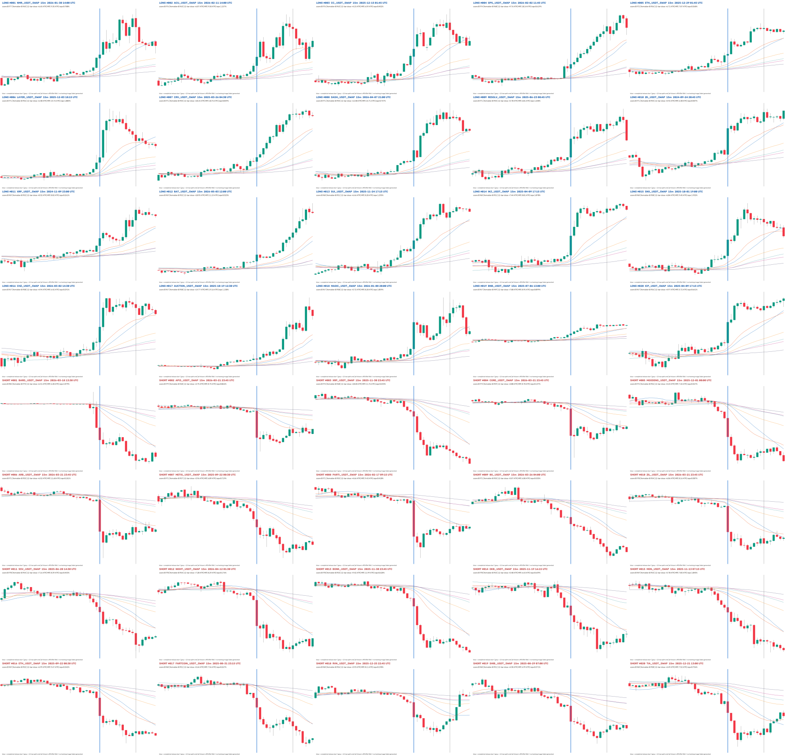

# 15m 双均线密集启动 1000 候选收集报告

## 结论先行

- 已按冻结口径完成 **1000 张 15m 候选图**：LONG 500、SHORT 500，覆盖 212 个币种；
  每张均有 1280×770 渲染图、逐样本哈希和 `PENDING` 审核位。
- 这是一份**人工候选池，不是 1000 个正标签**。全量锚点审计显示：**40.4%** 的候选在蓝线前
  3 根已沿目标方向移动超过 1 ATR，**67.3%** 的蓝线当根实体也超过 1 ATR。当前蓝线更像
  “完成的释放首根”，未必是“启动前核心右边界”，因此本轮不生成训练图片或标签。
- 数据覆盖 `2024-05-04 00:00 UTC` 至 `2026-05-04 00:00 UTC`（右端不含）。扫描物化
  10,147,779 根 K 线；最新时间为 `2026-05-03 23:45 UTC`，**holdout OHLCV 读取 0 行**。
- 完整性检查通过：1000 个事件 ID、路径和 PNG 哈希均唯一且一致；32 条未来突变因果零假设
  最大差异为 0；训练/生产资格均为 false。没有训练、收益回测、promote、forward、部署或交易动作。



图中蓝线是候选锚点 `t`，灰线是 12 根完成路径的右端；灰线后的 6 根只供人工复核。
完整 1000 图浏览器画廊位于
`experiments/active/exp-15m-ma-launch-candidate1000-v1/results/index.html`。

## 候选池统计

| 项目 | LONG | SHORT | 合计 / 说明 |
|---|---:|---:|---:|
| 原始合格候选（去重前） | 941,606 | 1,039,322 | 1,980,928 |
| 同币同方向 224 根去重后 | 21,409 | 22,117 | 43,526 |
| 最终候选 | 500 | 500 | 1,000 |
| 候选涉及币种 | 185 | 181 | 合并去重后 212 |
| 涉及 UTC 日期 | 255 | 166 | — |
| 单币最大候选数 | 8 | 8 | 冻结上限 8 |
| 单 UTC 日最大候选数 | 8 | 8 | 冻结上限 8 |
| 同币最小间隔 | 225 根 | 260 根 | 均大于 224 根排斥窗 |
| 完成分数最小 / 中位 / 最大 | 0.9322 / 0.9448 / 0.9774 | 0.9270 / 0.9422 / 0.9836 | 分数不是概率 |
| `future_release_score = 1` | 421（84.2%） | 359（71.8%） | 780（78.0%） |

未来分量在 78.0% 的入选样本上已达到裁剪上限 1，因此多数样本之间主要由 65% 的形成态分数
区分。这个饱和现象是当前候选池的限制，不能在看过结果后临时改参考尺度再重排。

## 锚点时序审计：为什么现在不能直接训练

审计只读取 `t-12..t`，使用冻结候选清单里 `t` 的 Pine/Wilder RMA14 ATR：

- `pre-k = direction × (open[t] - close[t-k]) / ATR14[t]`
- `anchor body = direction × (close[t] - open[t]) / ATR14[t]`

| 审计量 | LONG | SHORT | 合计 |
|---|---:|---:|---:|
| 蓝线前 3 根已走 >1 ATR | 220（44.0%） | 184（36.8%） | **404（40.4%）** |
| 蓝线前 3 根已走 >2 ATR | 104（20.8%） | 53（10.6%） | 157（15.7%） |
| 蓝线前 6 根已走 >1 ATR | 368（73.6%） | 335（67.0%） | 703（70.3%） |
| 蓝线前 12 根已走 >1 ATR | 435（87.0%） | 417（83.4%） | 852（85.2%） |
| 蓝线当根实体 >1 ATR | 329（65.8%） | 344（68.8%） | **673（67.3%）** |
| 蓝线前 3 根位移中位数 | 0.814 ATR | 0.703 ATR | — |
| 蓝线当根实体中位数 | 1.405 ATR | 1.577 ATR | — |

因此本轮检索回答的是“哪些已完成片段具有均线密集后释放”，没有回答“训练框应该在哪根结束”。
候选门在完成的 `t` 当根可因果复算，不等于训练核心已经因果对齐。Owner 若要求核心右端落在启动前一根，需先
逐样本重定锚点，不能把 1000 张图批量平移或直接转成正类。

## 排名头、中、尾渲染抽查

### LONG


### SHORT


六张分别取两边第 1、250、500 名，避免只展示最好看的头部。人工渲染抽查确认 K 线、六条均线、
蓝/灰时序线和标题均正常，也直观看到了部分样本在蓝线前已经开始移动的问题。

## 数据、口径与方法

### 数据覆盖

| 项目 | 数值 |
|---|---:|
| 发现的 15m 文件名币种 | 401 |
| taxonomy 过滤后 | 344 |
| 排除冻结 eval 币种 | 33 |
| 冻结可用文件名币种 | 311 |
| pre-holdout 实际有数据 | 237 |
| 空 pre-holdout 数据源 | 74 |
| 物化 K 线 | 10,147,779 |
| 扫描耗时 | 779.2 秒（约 13 分钟） |
| holdout OHLCV 物化 | 0 |

每币在 `data/kline_deep` 与 `data/kline_fetched` 中选择声明行数更大的 15m 文件；相同行数优先
`kline_deep`。读取器按时间顺序在 holdout 边界前停止，只检查每个源的首个边界时间戳，
不转换、物化、哈希、绘图或评分其 OHLCV。

### 形态合同

- 六条均线：SMA/EMA 20、60、120；ATR14 使用 Pine/Wilder RMA、SMA seed。
- 候选门继承冻结的 `dense_l1`：前置交叉数 ≥2、前置平均束宽 ≤3 ATR、当前排列 ≥6、
  交叉不平衡 ≥−1、斜率同向比例 ≥2/3、ATR 释放比 ≥1。
- 在完成的 `t` 提议候选：形成态只看 `t-12..t-1`，释放态可看 `t`，不读取 `t+1`。
- 事后排序看 `t..t+11`：形成态 65% + 完成释放 35%；后者由前三根、12 根收盘、
  12 根最大顺向幅度按 25%/45%/30% 组合，固定参考为 1.5/4/6 ATR 并裁剪到 `[0,1]`。
- 图宽 48 根：前置 30 根、完成段 12 根、另加 6 根人工复核未来。后 17 根均不进入因果候选特征，
  但 `t+1..t+11` 进入事后候选排序，所以本任务是完成态检索，不是 tip 检测。
- 先在同币同方向内按 224 根精确去重，再执行每币/每 UTC 日每边最多 8 个的全局配额；
  不足 500/边时 fail closed，不放宽规则。

### 为什么旧的 1000 图包没有直接复用

旧 `datasets/label_live_tip_1000/manifest.json` 有 1000 行，但仅 162 行是 dense-rule hit，
其余 838 行是 near-miss / exploration；它没有多空各 500 的完成释放排序，也仍未标注。
旧包保持逐字节不变，本轮没有把“已有 1000 张”误报成“已有 1000 个类似正例”。

## 零假设与验收

本任务没有定义入场、退出、TP/SL、成本、模型或 train/val split，因此 val AUC、置换收益 p、
top-decile 毛/净收益、胜率、单特征收益基线和匹配随机入场对照均**不适用**；不能据此声称可交易。
相应的严格非方向性对照如下：

| 检查 | 结果 |
|---|---:|
| 未来突变因果零假设 | 32/32 通过；`t` 后 OHLC×7、volume×13，重算最大差异 0.0 |
| 同币同方向重复零假设 | 最小间隔 LONG 225、SHORT 260；均超过 224 |
| 完整性 | 1000/1000 manifest、事件 ID、图路径、PNG 哈希及 1280×770 尺寸通过 |
| 资格门 | 1000 个 `PENDING`；training=true 0，production=true 0；训练目录 0 |
| 时间边界 | 最新物化 `2026-05-03 23:45 UTC`；holdout OHLCV 0 行 |

自动浏览器因安全策略拒绝打开本地 `file://` 地址，未绕过该限制。替代验收为 HTML 静态结构与
1000 个引用逐项核对，加上 Top-40 总览及两边头/中/尾六张真实渲染图的人工视觉检查。

## 与上一份 15m 1000 图包对照

| 版本 | dense-rule hit | 多空平衡 | 完成路径排序 | Owner 正标签 | 训练资格 |
|---|---:|---:|---:|---:|---:|
| 旧 `label_live_tip_1000` | 162 / 1000 | 否 | 否 | 0 | false |
| 本轮 `candidate1000-v1` | 候选门全通过 | 500 / 500 | 是，完成态回看 | 0，均 PENDING | false |

这不是精度提升对照：两份包回答的问题不同。本轮建立的是更纯、更平衡、可人工审核的完成态候选池，
而不是训练数据集或实时信号集。

## 风险与诚实声明

1. **不是金标。** 完成路径漂亮只代表检索条件命中；Owner 尚未逐样本判定 YES/NO 或核心边界。
2. **锚点偏晚。** 40.4% 在锚点前三根已走 >1 ATR，不能把蓝线统一当作启动前边界，也不能统一左移。
3. **完成态有未来。** 排序使用 `t` 后 11 根，图还多展示 6 根；它不得进入 tip-smoke、forward、ACTIVE 或部署。
4. **未来分数饱和。** 780/1000 达到 1，排序的未来区分度有限；本轮结果出来后未调尺度。
5. **独立性有限。** 每日配额减少同日共振，但同一市场 beta 仍可能让跨币候选相关；212 个币不等于 1000 次独立事件。
6. **没有读既有 Owner 标签。** 为避免碰到含 post-holdout 元数据的 manifest，本轮按预注册暂缓 lineage 去重。
7. **没有收益证据。** 本报告只验候选检索、时序与产物完整性，不证明可学习、可交易或有净收益。
8. **浏览器 QA 有边界。** 自动 `file://` 交互验收被安全策略阻止；已经明确记录，不冒充通过。

## 建议下一步（需 Owner 决定）

建议先审 **150 张分层样本**，而不是立即标满 1000 张：每边各取 rank 1–25、226–250、476–500，
比较头/中/尾的类别纯度，并对每张记录 `YES / NO / 边界修正 / 不确定`。同时先确定一条关键合同：

- 若蓝线允许是“释放首根完成态”，可沿当前候选图做类别审核，但训练图仍须另行重裁、物理隔离审核未来。
- 若核心必须结束在释放前一根，则需逐图标出真实启动首根，再从原边界派生训练裁剪；禁止统一左移。

在 Owner 完成这一步之前，本轮到此停止，不训练模型，也不把镜像方向自动确认为正类。

## 产物与复现

- 冻结配置：`experiments/active/exp-15m-ma-launch-candidate1000-v1/preregistration.json`
- 1000 图画廊：`experiments/active/exp-15m-ma-launch-candidate1000-v1/results/index.html`
- 候选清单：`experiments/active/exp-15m-ma-launch-candidate1000-v1/results/review_manifest.jsonl`
- 扫描摘要：`experiments/active/exp-15m-ma-launch-candidate1000-v1/results/scan_summary.json`
- 锚点审计：`experiments/active/exp-15m-ma-launch-candidate1000-v1/results/prelaunch_audit.json`
- 验收收据：`experiments/active/exp-15m-ma-launch-candidate1000-v1/results/verification_receipt.json`

正式扫描 builder：`d4f982919d9fae7a0847597c8fedab4aeb4cdaf5`；锚点审计 builder：
`f30cf6d`。从零复现命令：

```bash
cd /Users/zhangzc/fable-trading
git branch --show-current

PYTHONPATH=. .venv/bin/python -m pytest -q \
  tests/test_fifteen_minute_launch_candidates.py \
  tests/test_pine_dense_start.py \
  tests/boundaries/test_layer_imports.py

CANDIDATE_REPRO_DIR=$(mktemp -d)
PYTHONPATH=. .venv/bin/python scripts/collect_15m_ma_launch_candidates.py \
  --prereg experiments/active/exp-15m-ma-launch-candidate1000-v1/preregistration.json \
  --out "$CANDIDATE_REPRO_DIR/results"

AUDIT_REPRO_DIR=$(mktemp -d)
PYTHONPATH=. .venv/bin/python scripts/audit_15m_candidate_prelaunch.py \
  --manifest experiments/active/exp-15m-ma-launch-candidate1000-v1/results/review_manifest.jsonl \
  --out "$AUDIT_REPRO_DIR/prelaunch_audit.json"

.venv/bin/python scripts/md_to_html.py \
  analysis/p0_15m_ma_launch_candidate1000_20260825.md \
  --out-dir analysis/html
```

本轮定向代码验收：`72 passed in 0.78s`。完整 1000 PNG 的静态验收结果见 `verification_receipt.json`。
