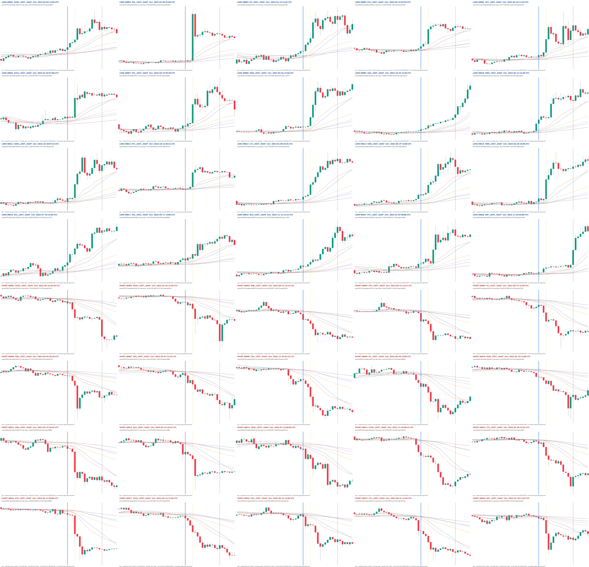

# 15m 六均线密集启动新增 9000 候选与训练门报告

## 结论先行

- 已按首批 1000 的**同一形态门和排序标准**新增 **9000 张 15m 候选图**：LONG 4500、
  SHORT 4500。与旧 1000 合并后是 10,000 个唯一事件，重复 0；全部仍为 `PENDING`。
- 时间向前扩至 `2022-01-03`，新增候选实际覆盖 `2022-01-05 17:30 UTC` 至
  `2026-05-03 10:30 UTC`；2471/9000 来自旧扫描起点 `2024-05-04` 之前。
- 已按 Owner 要求把**蓝色审核线统一显示在原选择 t 的前 3 根**，并用橙色虚线保留原 t。
  9000/9000 均精确相差 3 根即 45 分钟，且 manifest 明确
  `review_marker_is_training_label=false`。
- 全量完整性通过：9000 个事件、路径、PNG 哈希和 1280×770 尺寸均通过；32/32 未来突变
  因果零假设最大差异 0；物化 holdout OHLCV 为 0。
- **没有生成训练集、负样本或模型，也没有在 3060 开训。** 9000 个机器候选不是 9000 个
  Owner 金标：2358/9000（26.2%）在原 t 前 3 根已经顺向走出 >1 ATR，4925/9000（54.7%）
  的 t 当根实体 >1 ATR；统一 t-3 不能证明逐样本核心边界。
- 3060 的只读环境检查已通过：实际地址为 `192.168.1.5`，RTX 3060 12GB，Mac/3060 的
  torch/torchvision/ultralytics/numpy 版本和训练入口 SHA 一致。数据金标门未通过，因此没有
  同步数据、没有跑 epoch、没有产出权重。



完整画廊：
`experiments/active/exp-15m-ma-launch-candidate9000-v1/results/index.html`。

## 新增候选池统计

| 项目 | LONG | SHORT | 合计 / 说明 |
|---|---:|---:|---:|
| 原始合格候选（去重前） | 1,269,621 | 1,373,087 | 2,642,708 |
| 同币同方向 224 根去重后 | 28,456 | 29,288 | 57,744 |
| 新增候选 | 4,500 | 4,500 | 9,000 |
| 旧池种子 | 500 | 500 | 1,000 |
| 联合池 | 5,000 | 5,000 | 10,000，身份重复 0 |
| 联合池涉及币种 | 228 | 225 | 合并后 228 |
| 联合池涉及 UTC 日期 | 955 | 730 | 合并后 1,248 |
| 联合池单币最大候选数 | 80 | 80 | 每边最大份额仍为 1.6% |
| 联合池单 UTC 日最大候选数 | 80 | 80 | 每边最大份额仍为 1.6% |
| 联合池同币最小间隔 | 225 根 | 225 根 | 均严格大于 224 根排斥窗 |
| 新增分数最小 / 中位 / 最大 | 0.8795 / 0.9040 / 0.9717 | 0.8819 / 0.9042 / 0.9806 | 分数不是概率 |
| 新增 `future_release_score=1` | — | — | 4,733 / 9,000（52.6%） |

旧 1000 的每币/每日上限是 `8/500=1.6%`。扩容后的联合池上限按相同比例设为
`80/5000=1.6%`，但选择器先把旧 500/边写入币种计数、日期计数和同币同向 224 根排斥区间，
再选新增 4500/边。不能只对新批次独立满足约束后再拼接。

### 时间覆盖

| 年份 | 新增候选 |
|---|---:|
| 2022 | 888 |
| 2023 | 1,145 |
| 2024 | 1,173 |
| 2025 | 3,572 |
| 2026（至 05-03） | 2,222 |

扫描仍读取同一组 311 个冻结合格文件名数据源，其中 237 个在 pre-holdout 有数据、74 个为空；
物化 10,147,779 根 K 线，最新为 `2026-05-03 23:45 UTC`。读取器在首个 holdout 边界时间戳
停止，边界行 OHLCV 不转换、不哈希、不绘图、不评分。

## t-3 审核线不是训练框

图上三条竖线的语义：

- 蓝线：Owner 要求的审核视图 `t-3`；
- 橙色虚线：候选算法原选择 bar `t`；
- 灰线：完成 12 根路径的右端 `t+11`。

全量验收确认：9000 行的蓝线 source index 都等于 `source_anchor_i-3`，时间都等于
`anchor_time-45min`，训练标签真值为 0。下面各取 LONG/SHORT 的头、中、尾，避免只展示最好看的头部。

### LONG


### SHORT


### 锚点时序审计

审计只读取 `t-12..t`，用候选清单中 `t` 的 Pine/Wilder RMA14 ATR：

- `pre-k = direction × (open[t] - close[t-k]) / ATR14[t]`
- `anchor body = direction × (close[t] - open[t]) / ATR14[t]`

| 审计量 | LONG | SHORT | 合计 |
|---|---:|---:|---:|
| t 前 3 根已走 >1 ATR | 1,250（27.8%） | 1,108（24.6%） | **2,358（26.2%）** |
| t 前 3 根已走 >2 ATR | 404（9.0%） | 312（6.9%） | 716（8.0%） |
| t 前 6 根已走 >1 ATR | 2,280（50.7%） | 2,218（49.3%） | 4,498（50.0%） |
| t 前 12 根已走 >1 ATR | 3,311（73.6%） | 3,262（72.5%） | 6,573（73.0%） |
| t 当根实体 >1 ATR | 2,557（56.8%） | 2,368（52.6%） | **4,925（54.7%）** |
| t 前 3 根位移中位数 | 0.409 ATR | 0.373 ATR | — |
| t 当根实体中位数 | 1.145 ATR | 1.063 ATR | — |

首批 1000 的对应数是 pre3 >1 ATR 40.4%、t 实体 >1 ATR 67.3%；新增池更宽，偏晚比例下降，
但仍有四分之一以上在蓝线与橙线之间已经明显启动。真实核心结束点必须逐样本确定，不能把
9000 个框统一左移 3 根后直接训练。

## 与首批 1000 的同标准对照

| 项目 | 首批 1000 | 新增 9000 |
|---|---:|---:|
| 形态门 | `dense_l1` | 完全相同 |
| 形成/未来权重 | 65% / 35% | 完全相同 |
| 完成路径 / 额外复核 | 12 / 6 根 | 完全相同 |
| 同币同向去重 | 224 根 | 完全相同，并继承旧池占位 |
| 每币/每日最大份额 | 8/500 = 1.6% | 联合池 80/5000 = 1.6% |
| 扫描起点 | 2024-05-04 | 2022-01-03 |
| 完成分数中位 | LONG 0.9448 / SHORT 0.9422 | LONG 0.9040 / SHORT 0.9042 |
| 未来分数饱和 | 780/1000（78.0%） | 4733/9000（52.6%） |
| Owner 正标签 | 0 | 0 |
| 训练资格 | false | false |

分数下降是从同一固定排序中取到更深的 4500/边所致，不是降低形态门。未来分数饱和比例下降，
说明尾部排序比首批 1000 有更多区分度；本轮没有在看过结果后调权重或阈值。

## 恢复的旧训练合同

已从 `docs/protocol/local_signal_v2.md`、`datasets/manifests/frozen_baseline_r1_r2_v1.json` 和
`datasets/manifests/dataset_v3_1_position_spread_v1.json` 恢复 Owner 所说的逻辑：

| 项目 | 冻结口径 |
|---|---|
| 输入检测窗 | 规格约 14–22 根最短充分上下文；实际 R1/R2 使用动态 W12–19 |
| 核心信号框 | 4–7 根 |
| 核心后确认 | 3 根优先，5 根硬上限；6–10 根撤出 |
| 框位置 | 随最短充分上下文自然变化，禁止固定最右/正中或统一 delta |
| 几何来源 | Owner 原始框或 Owner 批准的派生规则，禁止 Codex 二次目测重框 |
| 旧 train 正例 | 1,143（另有 val 202） |
| 旧 train 负例 | easy 1,143 + hard 2,286 = 3,429，即正例的 3:1 |
| 训练配方 | YOLO，epochs 40，patience 10，batch 8，imgsz 960，AdamW，lr0 1e-4，warmup 0.5，seed 0，deterministic，rect |
| 增强 | HSV/flip/mosaic/mixup/cutmix/copy-paste/erasing 全关 |

历史位置扩散清单为 left/middle/right = 72/636/637，但它自己标记
`training_eligible=false` 且 quality gate 为 `not_first_round`，只能证明旧逻辑，不是新 9000 的
强制配额。新数据应逐样本确定最短充分上下文后再审位置分布。

## 为什么没有先收集负样本

安全负样本依赖已确认正框的禁入区。当前没有一个新样本有 Owner 类别和核心几何：

- 若先造 easy/hard negative，可能把尚未确认的同类形态当作负例；
- 当前协议只确认 SHORT 参考，LONG 镜像仍是 `mirror_unconfirmed`，既不能当正例也不能当负例；
- 没有真实正框就无法执行同币同时间块、Owner 框保护和跨 split 时间隔离；
- 3:1 是软目标，不能为了凑比例缩小金标禁入区。

因此本轮负样本 0、训练图片 0、YOLO 标签 0。`training_gate_receipt.json` 已把后续要求钉死：
先逐样本确认类别和几何，再做依赖组件时间切分，最后才按 1 easy + 2 hard/正例尝试收集；不足时
诚实缺样，不能跨币或靠近金标补数。

## 3060 只读验收

第一次按旧文档地址 `.3` 检查失败。局域网核对发现 `.3` 已是随机 MAC 设备，登记的 3060
Intel MAC `e0:d4:e8:c7:fb:41` 在 `.5`；随后确认：

| 项目 | 结果 |
|---|---|
| 地址 / 主机名 | `Administrator@192.168.1.5` / `win-zzc` |
| GPU | NVIDIA GeForce RTX 3060 12GB |
| torch / torchvision | 2.8.0 / 0.23.0 |
| ultralytics / numpy | 8.4.89 / 2.0.2 |
| CUDA / CUDA NMS | 通过 / 通过 |
| Mac / 3060 trainer SHA | 两边均 `92b58d62…e2204c6` |
| 数据同步 / epochs / 权重 | 0 / 0 / 0 |

当前共享工作区的 `scripts/train_on_3060.sh` 和 `scripts/windows/train_dense.py` 另有未提交改动，
本实验没有认领或提交它们。即使环境通过，生成器未提交也不能作为正式训练入口；而 Gold Dataset
门本身已经独立阻断训练。

## 零假设与验收

本任务没有模型分数、train/val、入场、退出、TP/SL、成本或收益，因此 val AUC、置换收益 p、
top-decile 毛/净收益、胜率、单特征收益基线和匹配随机入场对照均**不适用**；不能编造，也不能
据此声称可学习或可交易。相应的严格非方向性对照：

| 检查 | 结果 |
|---|---:|
| 未来突变因果零假设 | 32/32 通过；t 后 OHLC×7、volume×13，最大差异 0.0 |
| 旧+新身份重复零假设 | 10,000/10,000 唯一，旧新交集 0 |
| 联合同币同向重复零假设 | LONG/SHORT 最小间隔均 225 根，严格大于 224 |
| 联合配额零假设 | 每币/每日每边最大均 80，没有突破 1.6% |
| 完整性 | 9000/9000 manifest、路径、PNG SHA、1280×770、HTML 引用通过 |
| t-3 算术 | 9000/9000 相差 −3 根 / −45 分钟，training-label=true 为 0 |
| 资格门 | 9000 PENDING；training=true 0，production=true 0，训练目录 0 |
| 时间边界 | 最新物化 2026-05-03 23:45 UTC；holdout OHLCV 0 |

本地浏览器安全策略拒绝打开 `file://` 报告，未绕过该限制，也不冒充浏览器交互 QA 通过。
替代验收为 HTML 标题/表格/7 个内嵌图的静态结构核对，以及 Top-40 和两边头/中/尾 PNG 的
真实视觉检查；HTML 仍可由 Owner 在本机直接打开。

## 风险与诚实声明

1. **不是 9000 个正例。** 完成态检索使用 `t+1..t+11` 排名；漂亮走势不能替代 Owner 裁决。
2. **t-3 只是审核视图。** 26.2% 在这 3 根间已经走 >1 ATR，真实启动边界不服从固定 delta。
3. **方向协议未齐。** 当前只确认 SHORT 参考，LONG 镜像尚无资格进入正负任一类。
4. **候选相关性。** 配额减少同币/同日集中，但跨币市场 beta 仍使 10,000 事件并非 10,000 次独立试验。
5. **未来分量仍饱和。** 52.6% 达到 1；本轮坚持冻结尺度，没有事后重排。
6. **没有负样本或模型证据。** 3060 可用不等于数据可训；本轮没有静态 val、前向或经济结论。
7. **3060 IP 漂移。** `.3` 与 `.5` 已再次分叉；正式训练前需固定地址或再次验证主机/GPU。
8. **训练入口尚未入库。** 当前工作区另有他人未提交改动，本轮没有吞并或冒充可复现训练代码。
9. **浏览器 QA 有边界。** `file://` 被浏览器策略拒绝；只完成静态 HTML 和源渲染视觉验收。

## 下一步需要 Owner 决定

要继续到训练，缺的不是算力，而是以下三个 Owner 决策/输入：

1. 这批只做 SHORT，还是明确批准 LONG 镜像语义；
2. 对候选给出逐样本 `KEEP / DROP / UNCERTAIN`，并确认每个 KEEP 的 4–7 根核心几何；
3. 审核由此生成的时间切分、正负清单预览后，明确设置 `training_eligible=true`。

完成前不得生成正标签、负样本或启动 3060。完成后按冻结合同执行：动态短窗、4–7 根小框、
自然位置分散、同币时间隔离、负例软目标 3:1、增强全关、40 epoch，并在训练结束后停止于产物，
不自动 promote、deploy 或交易。

## 产物与复现

- 预注册：`experiments/active/exp-15m-ma-launch-candidate9000-v1/preregistration.json`
- 9000 图画廊：`experiments/active/exp-15m-ma-launch-candidate9000-v1/results/index.html`
- 候选 manifest：`experiments/active/exp-15m-ma-launch-candidate9000-v1/results/review_manifest.jsonl`
- 扫描摘要：`experiments/active/exp-15m-ma-launch-candidate9000-v1/results/scan_summary.json`
- 锚点审计：`experiments/active/exp-15m-ma-launch-candidate9000-v1/results/prelaunch_audit.json`
- 静态验收：`experiments/active/exp-15m-ma-launch-candidate9000-v1/results/verification_receipt.json`
- 训练门收据：`experiments/active/exp-15m-ma-launch-candidate9000-v1/results/training_gate_receipt.json`

正式扫描 builder：`7802d94`；静态验收 builder：`7169521`。从零复现命令：

```bash
cd /Users/zhangzc/fable-trading
git branch --show-current

PYTHONPATH=. .venv/bin/python -m pytest -q \
  tests/test_fifteen_minute_launch_candidates.py \
  tests/test_pine_dense_start.py \
  tests/boundaries/test_layer_imports.py

CANDIDATE_REPRO_DIR=$(mktemp -d)
PYTHONPATH=. .venv/bin/python scripts/collect_15m_ma_launch_candidates.py \
  --prereg experiments/active/exp-15m-ma-launch-candidate9000-v1/preregistration.json \
  --out "$CANDIDATE_REPRO_DIR/results"

AUDIT_REPRO_DIR=$(mktemp -d)
PYTHONPATH=. .venv/bin/python scripts/audit_15m_candidate_prelaunch.py \
  --manifest experiments/active/exp-15m-ma-launch-candidate9000-v1/results/review_manifest.jsonl \
  --out "$AUDIT_REPRO_DIR/prelaunch_audit.json" \
  --expected-total 9000 \
  --expected-per-side 4500

VERIFY_REPRO_DIR=$(mktemp -d)
PYTHONPATH=. .venv/bin/python scripts/verify_15m_candidate_pool.py \
  --prereg experiments/active/exp-15m-ma-launch-candidate9000-v1/preregistration.json \
  --results experiments/active/exp-15m-ma-launch-candidate9000-v1/results \
  --out "$VERIFY_REPRO_DIR/verification_receipt.json"

.venv/bin/python scripts/md_to_html.py \
  analysis/p0_15m_ma_launch_candidate9000_20260826.md \
  --out-dir analysis/html
```

定向代码验收为 `77 passed`；完整 9000 PNG 静态验收结果见 `verification_receipt.json`。
