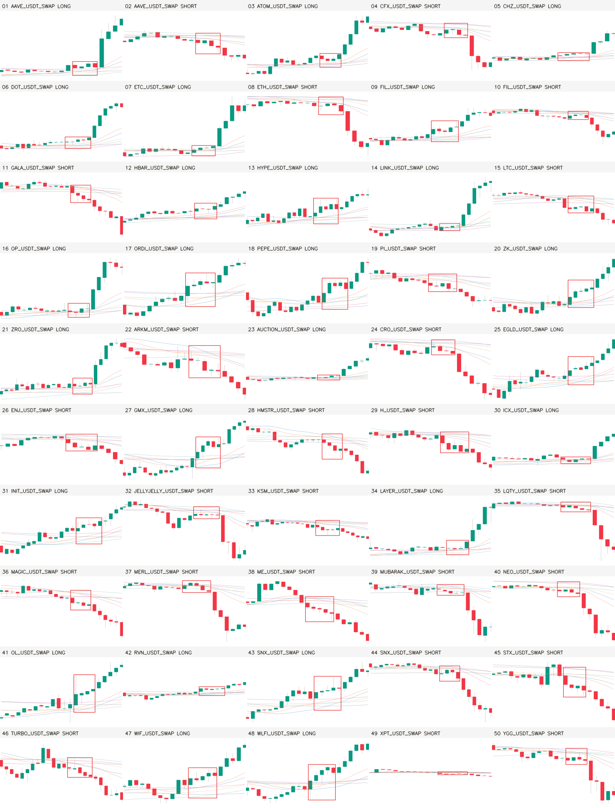

# P0：15m 均线密集启动严格自动补齐 50（2026-08-27）

## 结论先行

此前交付“20 张有框 + 30 张无框，再请 Owner 人工审核”是任务类型错误，现已作废。Owner 要的是合格样例包，不是固定 50 个身份的标签审计。

本轮从冻结的 **10,000 个 pre-holdout 候选**内部淘汰并自动补位，最终交付 **50 张全部有框**的 15m PNG：25 LONG + 25 SHORT，每张恰好一个红框，框内 4–5 根 K。50 张已作为 1280×742 原始 PNG document 逐张发送到 Telegram；没有无框图，也没有要求 Owner 回复 KEEP / ADJUST / REJECT。

这仍只是 P0 形态示例，不是 Gold 标签或训练集。holdout OHLCV 读取 0、YOLO label 0、训练 0、3060 作业 0，ACTIVE / frozen / forward / 部署与交易状态均未改变。



## 为什么上一批不对

| 版本 | 交付合同 | 有框 | 无框 | Owner 人工动作 | 裁决 |
|---|---:|---:|---:|---:|---|
| strict Review50 v5 | 固定 50 个身份后逐个裁决 | 20 | 30 | 需要 | **作废：不是 Owner 要的任务** |
| autofill v6 | 从 10,000 池自动补位 | 50 | 0 | 不需要 | 内部视觉 QA 拒绝：仍有已走较多的 K 被包进核心 |
| autofill v7 | 更严核心/及时释放门 + 自动补位 | **50** | **0** | **不需要** | 本轮正式交付 |

关键修正不是“给无框图写得更清楚”，而是让无框候选根本不进入交付：内部失败就继续从池里补下一张。

## 冻结方法

Owner 明确认可的旧 #42（good）和 #44（perfect）只作为方向归一化的形态参照。对每个候选，在 `t-8..t-1` 内枚举 4/5 根核心，比较四条序列：收盘路径、K 线实体、六均线中心、六均线宽度。SHORT 乘 -1 后与 LONG 使用同一坐标，但时间顺序不反转。

v7 在 v6 基础上收紧以下同一语义包（Owner 此前已批准“按照你的这些建议全部去做”）：

- 核心最大实体 ≤1.2 ATR，核心方向进展 ≤1.3 ATR；
- 核心每根 K 的收盘/实体不能整体逃离六均线包络；
- 核心后第 1 根不能反向，第 2 根累计至少 1.0 ATR；第 3/5 根至少 1.25/1.75 ATR；
- 六均线核心包络 ≤1.5 ATR，核心末端包络 ≤1.1 ATR；
- 到 #42/#44 的方向归一化距离 ≤0.50。

为避免同一次全市场共振刷屏，整包每 UTC 小时最多 1 张、每天最多 2 张；50 张覆盖至少 45 个不同币。精确可满足性审计证明“50 张必须 50 个不同币”与其他冻结配额不相容，因此只放宽多样性、不放宽形态：同一币最多一多一空，最终仍有 47 个不同币。

## 数据与结果

| 项目 | 结果 |
|---|---:|
| 冻结候选 | 10,000 |
| 通过核心/释放硬门（距离前） | 3,217 |
| 同时通过距离 ≤0.50 | 106 |
| 最终交付 | 50 |
| LONG / SHORT | 25 / 25 |
| 4 根框 / 5 根框 | 22 / 28 |
| 不同币 | 47 |
| 单小时最大 | 1 |
| 单日最大 | 2 |
| 时间范围 | 2022-03-22 03:15 ～ 2026-04-13 22:15 UTC |
| 相似距离 min / median / max | 0.2541 / 0.4476 / 0.4983 |
| 图片尺寸 | 50/50 为 1280×742 PNG |
| 实际红框像素 | 50/50 检出；每图 2,848～6,678 个精确红像素 |
| Telegram | 50/50 document 逐张成功 |
| holdout / labels / training | 0 / 0 / 0 |

## 非方向性零假设对照

本轮是形态检索与渲染审计，没有收益标签，因此 val AUC、top-decile 收益、胜率、0.2% 成本、匹配随机入场和收益置换检验均不适用，不能编造。

同等严格的零假设是：如果方向归一化只是任意符号操作，把每张图的 LONG/SHORT 故意反转后，到两个 Owner 参照的距离不应系统性变差。实际 50 张正确方向距离中位 **0.4476**，反向后中位 **2.5155**；**50/50** 都是正确方向更近，双侧二项检验 `p=1.78e-15`。重新计算的正确方向距离与 manifest 逐项最大误差为 **0.0**。

工程零假设也 fail-closed：若图没有精确红框像素、不是 1280×742、不是恰好一个 4/5 根框、出现 `.txt` label、读取 holdout 或启动训练，发送器拒绝发送。实际全部通过。

## 复现命令

```bash
git checkout 10bf35c
python3 -m pytest -q \
  tests/test_ma_launch_owner_autofill_review.py \
  tests/test_send_15m_ma_launch_owner_autofill50.py

RUN_ROOT=$(mktemp -d)
PYTHONPATH=. python3 scripts/build_15m_ma_launch_owner_autofill50.py \
  --output "$RUN_ROOT/results"

# canonical 产物的逐像素 QA；不会发送 TG
PYTHONPATH=. python3 scripts/send_15m_ma_launch_owner_autofill50.py qa
```

Telegram 是外部副作用，只有 Owner 明确要求时才运行 `images` / `report` 阶段；本轮已获得明确授权且用 SHA 回执防重复。

## 风险与诚实声明

- 两个校准参照都是 Owner 认可的 SHORT；LONG 是不反转时间的方向镜像检索，不等于 Owner 已逐张确认 25 个 LONG 为 Gold。
- 形态门使用核心后最多 5 根 K 来验证“确实启动”，所以它是已完成历史形态检索，不是 tip 因果检测器，禁止冒充新鲜实盘信号。
- 红框高度随真实 K 线/均线价格范围变化（源图 31～399 px）；这些 PNG 没有进入训练。若未来做 Gold 数据集，必须先冻结标签几何与最小像素策略，不能直接把本批转成 YOLO labels。
- v5 已经发出的历史 TG 消息没有被删除；v7 的开场消息明确标记其人工审核口径作废，避免误用。

## 下一步

本轮没有需要 Owner 完成的审核表，也不会自动开训。若后续要把这些例子升级成训练标签，必须另走 P0/P1 Gold 门：冻结类别和逐样本核心边界、生成正负样本、时间切分与 parity QA，并由 Owner 单独授权训练。当前允许停在“50 张示例已交付”。
