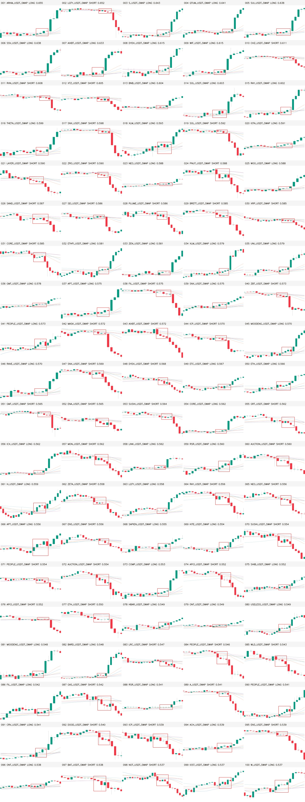

# P0：15m 正样本 10,000 张“完美形态”严格二次过滤（2026-08-28）

## 结论

已对现有 **10,000 张 weak-positive 正样本**完成一次不凑数的严格二次过滤：

- 10,000 张全部进入可追溯排名；其中当前训练 `data.yaml` 实际暴露 9,976 张；
- 345 张通过全部绝对形态硬门（3.45%）；
- 261 张再通过 #42/#44 精确参考与 v7 接受族的时序距离门；
- 排除 1 张未进入当前 train/val 的样本并完成精确/事件去重后，最终交付 **260 张完美候选**，保留率 **2.60%**；
- 260 张为 LONG 135、SHORT 125，覆盖 129 个币、260 个唯一事件；
- 260/260 红框审核图和 260/260 模型实际无框输入图都逐字节复用原文件，全部为 **1280×742 PNG**，没有重渲染、压缩另存、拉伸或颜色通道转换；
- holdout OHLCV 读取为 0；没有写 YOLO label、没有改原数据集/split、没有启动训练，也没有改 ACTIVE、forward 或生产状态。

最重要的边界：这里输出的是自动 `PERFECT_CANDIDATE`，不是逐张 Owner Gold。它适合先作为“高纯候选层”浏览或用于后续 Gold 决策，当前仍是 `training_eligible=false / production_eligible=false`。

入口：

- [260 张高清双图画廊：红框审核图 + 模型实际无框输入](../../experiments/active/exp-15m-ma-launch-owner-perfect-filter10000-v1/results/public/index.html)
- 完整排名：`experiments/active/exp-15m-ma-launch-owner-perfect-filter10000-v1/results/ranked_manifest.jsonl`
- CSV 排名：`experiments/active/exp-15m-ma-launch-owner-perfect-filter10000-v1/results/ranked_manifest.csv`
- 机器摘要：`experiments/active/exp-15m-ma-launch-owner-perfect-filter10000-v1/results/summary.json`



## 为什么这次不是再套一个简单阈值

此前 10,000 张是按 v7 接受形态族自动扩出的 weak positive；“看起来像”不等于每张都达到了 Owner 所说的完美程度。本轮把判断拆成六个互不替代的轴：

1. 六条 SMA/EMA 20/60/120 是否真正收拢、交叉或持续变窄；
2. 核心前 12 根是否安静，最近 3 根是否已经提前偷跑；
3. 核心 K 线是否仍与均线束接触，而不是价格已脱离均线；
4. 核心后 1/2/3/5 根是否沿正确方向干净释放；
5. 核心与释放段是否存在过大影线、反向实体或回撤；
6. 方向归一化的 12 根前文 + 5 点核心 + 5 根释放序列，与 Owner 的精确参考形态是否接近。

第 6 轴同时使用锁步距离、Sakoe–Chiba 半径 2 的分段 DTW 和 derivative-DTW；prelude/core/release 分段比较，禁止 DTW 把启动边界跨段对齐。SHORT 只把方向性通道乘以 -1，**时间顺序从不倒放**。绝对 ATR 幅度仍由硬门控制，不会被 z-normalization 洗掉。

## 参考图血缘

Owner 历史提到的“第 42/44/48 张”并不来自最新 v7 编号，而来自旧 50 张审核链。若不先绑定 manifest，会把相同编号套到完全不同的币和图片。本轮冻结为：

| 角色 | 旧编号 | sample_id | 用法 |
|---|---:|---|---|
| 完美正锚 | 44 | `a20a0a4e50a94b1a017d38a0` | 全部门必须通过；leave-one-anchor-out 定标 |
| 很好正锚 | 42 | `4e86ddc32a5401c49bf4aeb3` | 全部门必须通过；leave-one-anchor-out 定标 |
| 偏晚边界 | 48 | `0846b4f53090c2980df602b9` | 因启动已进入核心且后续释放脏，必须淘汰 |
| 语义反例 | 03/08/20/21/22/34 | 6 个精确 sample_id | 每张至少失败一个命名硬门 |
| 错框边界 | 14/18/32/35/40 | old + reboxed 两套几何 | 只做边界对照，不作为坏形态类别参考 |

四份旧参考 manifest、10,000 正样本 manifest、实际训练 manifest、`data.yaml`、构建摘要和 source audit 均用 SHA-256 固定。10,000 个 `source_sample_id` 一对一联结，并核对 source、event、顺序、方向、币种、核心索引/时间、上下文、审核图路径与哈希。

## 冻结硬门

| 轴 | 关键口径 |
|---|---|
| 均线密集 | 核心末六线宽度 `≤0.95 ATR`，整个核心包络 `≤1.50 ATR` |
| 边界新鲜 | 核心方向进度 `[-0.60, 1.00] ATR`，避免框内已经走完大段 |
| 收拢/交叉 | 收拢比 `≤0.90` 且至少 2 次继续变窄，或比值 `≤1.15` 且至少 3 次均线次序翻转 |
| 价格接触 | K 线触及均线束比例 `≥40%`，收盘到束的 Q75 `≤1.50 ATR` |
| 前置安静 | 12 根实体 Q90 `≤1.10 ATR`、总路径 `≤5.50 ATR`、最近 3 根方向进度 `≤1.00 ATR` |
| 释放 | post2 `≥1.00 ATR`、post3 `≥1.25 ATR`、post5 `≥1.75 ATR`，至少 3/5 个正向步 |
| 干净度 | 最大释放回撤 `≤0.75 ATR`，核心/释放反向实体数与影线受限 |
| 图形安全 | 原框高度 `≤0.55` 画布；框高不单独充当形态真值 |

阈值在查看 10,000 张输出分布前冻结；没有为达到目标张数而放宽。#44/#42 均全门通过；#48 同时失败 `core_directional_progress_too_large`、`core_max_body_atr` 以及多项 release 门；6 张明确语义反例全部至少失败一个命名硬门。

## 漏斗与上一层对照

| 指标 | 原 10,000 weak-positive 层 | 本轮结果 |
|---|---:|---:|
| 输入/完整排名 | 10,000 | 10,000 |
| 当前 data.yaml 暴露正例 | 9,976 | 9,976 |
| 绝对硬门通过 | 未分层 | 345（3.45%） |
| 参考距离门通过 | 未分层 | 261（2.61%） |
| 最终高清候选 | 10,000 张审核包 | 260（2.60%） |
| LONG / SHORT | 5,000 / 5,000 | 135 / 125 |
| 4 根 / 5 根核心 | 5,153 / 4,847 | 140 / 120 |
| 唯一事件 | 10,000 | 260 |
| 唯一币种 | 229 | 129 |
| 时间范围 | 2021-09-02…2026-05-03 | 2021-09-10…2026-05-03 |
| 训练 / 生产资格 | false / false | false / false |

260 张质量分数最小/中位/最大为 `0.3886 / 0.5202 / 0.6554`。分数只在全部硬门通过后排序，不能用高分覆盖某个硬门失败。主要淘汰原因是价格没有接触均线束（6,072）、均线拓扑不满足（4,940）、前置路径过大（3,382）和末端均线仍太宽（3,316）；同一张可以同时触发多项，因此原因计数不能相加成样本数。

## 去重与分布

先按 `(source_path, core_start, core_end, direction)` 与审核图 SHA 精确去重；再在同币同方向内按质量从高到低做 4 小时 non-maximum suppression，只有与所有已保留事件都相隔超过 4 小时才保留。随后限制同币×方向×时间块最多 2 张、同币×方向总计最多 12 张，并按方向×时间块 round-robin 排列，不为补齐任何桶而放宽。

最终 split 为 train 217、val 43；时间块为：2021H2 5、2022H1 16、2022H2 15、2023H1 27、2023H2 16、2024H1 27、2024H2 33、2025H1 38、2025H2 51、2026H1 32。不存在同一图片或同一事件重复进入画廊。

## 非方向性零假设与边界对照

本轮是 P0 形态排名，不定义入场、出场、TP/SL、成本或模型预测。因此 val AUC、top-decile 毛/净收益、胜率、单特征收益基线、匹配随机入场对照和收益置换检验均**不适用**；不能为了填表虚构经济指标。

对应的严格非方向性对照在固定 1,000 张样本上完成：

| 对照 | morphology-only 通过 | full-no-box 通过 |
|---|---:|---:|
| 原边界、正确方向 | 51/1,000（5.1%） | 37/1,000（3.7%） |
| 核心左移 3 根 | 32/1,000（3.2%） | 1/1,000（0.1%） |
| 核心右移 3 根 | 0/1,000（0.0%） | 0/1,000（0.0%） |
| 方向翻转、时间不倒放 | 0/1,000（0.0%） | 0/1,000（0.0%） |

`morphology-only` 明确排除 release 与 box；`full-no-box` 保留 release、排除无法随平移重画的 box。这样不会再把“形态边界”与“后面是否走出来”混成同一个 shape-only 数字。正确边界明显优于 ±3 根平移，方向翻转为 0；这支持当前过滤器对方向和边界有辨别力，但仍不能证明交易收益。

本地 DTW/DDTW 固定 fixture 与隔离环境 `aeon==1.5.0` 的原始 cost 精确一致：DTW `1.3172096700811546`、DDTW `0.34713860704043453`，绝对误差容限 `1e-12`。aeon 未安装进训练环境。

## 原图、模型输入与 HTML 验收

| 验收项 | 结果 |
|---|---:|
| 红框审核图 hard-link + SHA 一致 | 260/260 |
| 模型实际无框输入 hard-link + SHA 一致 | 260/260 |
| 模型输入实际尺寸 1280×742 | 260/260 |
| 模型输入精确红色 overlay 像素 | 最大 0 |
| 唯一审核图 SHA / 唯一事件 | 260 / 260 |
| HTML 文件 | 1 个索引 + 3 个分页 |
| HTML 本地相对链接解析 | 527/527 |
| 结果目录 YOLO `.txt` | 0 |
| 重渲染/resize/重编码 | 0 |

完整排名 SHA256：`5011966a5fa0d23ea06935348f127261d70126de6a109ac0f55af715d24218a5`；CSV SHA256：`1f567d8e5d7c6bba8396c89ea1a7f922d7f7c8654df6d94307d064ff3d6bedbb`；前 100 总览 SHA256：`2cd8d8ae33a3b940319445d95bad4863a68908299e6d0386e28b4fec01cde7f3`。

## 独立复核

另开本机可见的 **Luna Max** 任务做只读第二意见。它确认没有 holdout 物化、正锚 leave-one-out 没有 self-match，并指出四个需修问题：错框边界不应进入坏形态池、shape-only 对照混入 release、4 小时 anchored clustering 可能保留相距不足 4 小时的 winner、进度日志污染 CLI JSON。四项均在全量构建前修复，并新增回归测试。

## 风险与诚实声明

1. 260 张只是由两个精确正锚、6 个语义反例和 v7 50 张接受族自动筛出的高纯候选，不是 Owner 逐张确认的 Gold；两个完美/很好正锚仍然太少，无法估计真实纯度置信区间。
2. 过滤使用核心之后 5 根 K 来确认历史释放，是 completed-history retrieval；不得冒充 tip、forward 或实盘因果信号。
3. 最低分候选仍通过全部硬门，但视觉上会比前排更接近边界。完整排名和双图画廊保留这个事实，没有只展示最好看的少数样本。
4. 本轮没有改变原 10,000 正样本、30,000 负样本、YOLO label、train/val split 或历史模型；不能把“筛出 260 张”误写成“已经重建并训练了新数据集”。
5. 本轮严格不读 `>=2026-05-04` 的 OHLCV，没有消费 holdout 次数。

## 复现命令

```bash
# 1) 构建器提交必须先存在；本轮 builder commit
git show --stat 24d87a0186bc4272aa9a984428dd7b7e10206704

# 2) 全量 10,000 张严格二筛（拒绝覆盖既有 results）
PYTHONPATH=. python3 scripts/filter_15m_ma_launch_owner_perfect10000.py

# 3) 定向回归
PYTHONPATH=. python3 -m pytest -q \
  tests/test_ma_launch_owner_perfect_filter.py \
  tests/test_ma_launch_owner_autofill10000.py \
  tests/test_ma_launch_owner_autofill_review.py

# 4) Python/JSON/空白检查
python3 -m py_compile \
  scripts/filter_15m_ma_launch_owner_perfect10000.py \
  yoyo/datasets/ma_launch_owner_perfect_filter.py
python3 -m json.tool \
  experiments/active/exp-15m-ma-launch-owner-perfect-filter10000-v1/preregistration.json \
  >/dev/null

# 5) 报告 HTML
python3 scripts/md_to_html.py \
  analysis/p0_15m_ma_launch_owner_perfect_filter10000_20260828.md \
  --out-dir analysis/html
```

构建器提交：`24d87a0186bc4272aa9a984428dd7b7e10206704`；预注册 SHA256：`5e96987e61597e650e4a8603ba8bb6bd6bb11802f9ff8cc74b9d94e78fafe0e9`。18 项定向/相邻回归测试通过。

## 下一步选项

本轮允许停在“260 张完美候选 + 全量排名 + 高清双图画廊”。若 Owner 要把这 260 张升级成新训练数据，仍需另行决定：它们是作为 Gold 候选逐样本确认，还是只作为现有正样本的采样权重；同时必须重新定义负样本保护区和时间切分。本轮不自动改训练集、不训练、不 promote。
