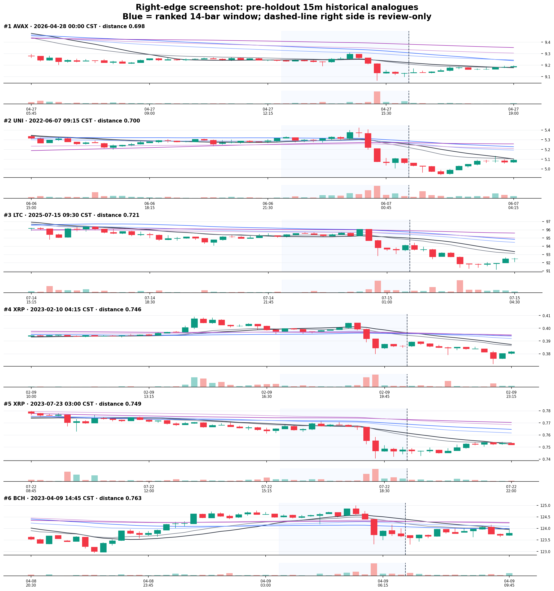
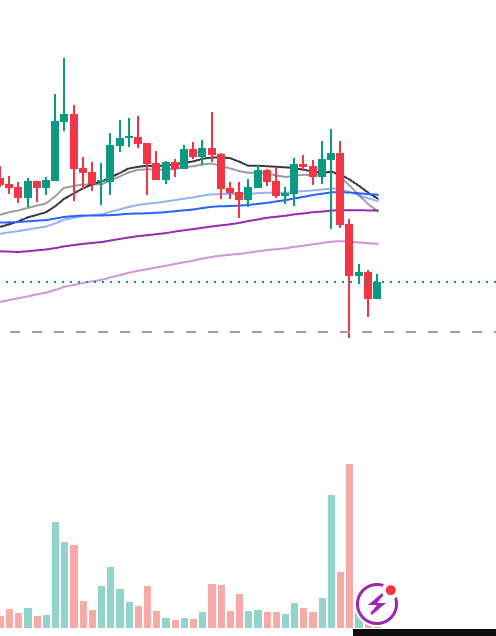
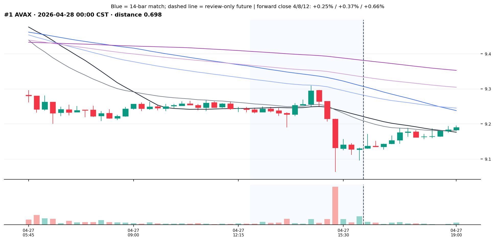
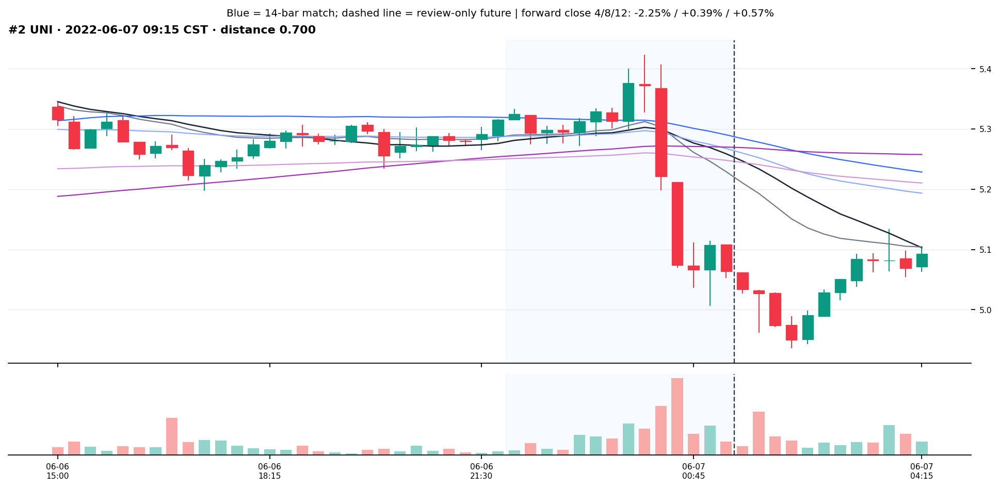
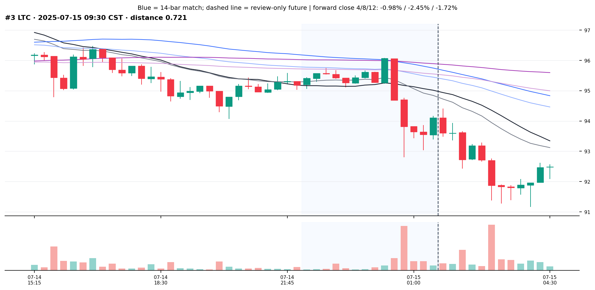

# 15m 截图最右侧历史相似形态检索（pre-holdout）

## Executive Summary

- 按截图最右侧 **14 根 K 线**冻结形态合同后，在仓内 54 个 OKX USDT 永续、**6,160,332 根 pre-holdout 15m K 线**中完成一次检索。第一名是 **AVAX 2026-04-28 00:00（北京时间）**，距离 0.6985；它同样表现为横盘后连续放量下破、第二段带长下影，随后在低位小实体交替回收。
- 第一名不是孤立币种事件。同一 ±45 分钟市场簇里有 **20 个币种候选**，前列包括 AVAX、WLD、ETH、LINK、BTC、SAND、FIL。它应理解为一次 2026-04-27 16:00 UTC 的全市场冲击，不能包装成 20 次独立复现。
- 跨市场时段去重后的其余高位近邻包括 **UNI 2022-06-07 09:15、LTC 2025-07-15 09:30、XRP 2023-02-10 04:15**（均为北京时间）。Top-10 后续 4 根收盘恰好 5 涨 5 跌；后续 12 根为 6 涨 4 跌，中位 +0.18%、均值 -0.11%，**方向并不一致**。
- 条件 phase-scramble 对照中，真实 Top-10 平均距离 0.7457，打乱每个候选末 6 根顺序后的均值 2.0701，`p=1/1001=0.000999`。这只说明“连续破位—长下影—弱回收”的时间顺序被检索到了，不证明收益或未来方向。
- 本轮 **holdout OHLCV 读取 0**；没有训练、阈值修改、promote、ACTIVE/frozen、forward、部署或交易状态变化。所有候选均为 `training_eligible=false / production_eligible=false`，等待 Owner 视觉复核。



蓝底是参与相似度的 14 根；虚线右侧 12 根只供回看，完全不参与排名。

## Owner 参考与检索语义



截图裁掉了币种、价格轴和周期标签。本轮明确作出一个可撤销假设：**按本项目当前默认表面把它当作 15m 图**。若原图不是 15m，本报告的日期候选不能跨周期直接沿用，必须用真实周期另立配置；不能事后把本轮结果改名。

从固定颜色连通域恢复的末 14 根涨跌序列为 `GRRGGRRGGRRGRG`。末 6 根的核心结构是：

1. 一根带上下影的绿色前置 K；
2. 两根连续大阴线向下释放；
3. 第二根大阴线的下影长于实体；
4. 三根小实体在低位交替回收/再压；
5. 释放段成交量明显高于前 8 根中位量。

截图最后两根量柱可能仍在形成且被界面图标遮挡，因此它们在预注册时已从成交量距离中屏蔽；价格蜡烛仍保留。参考图 SHA-256 为 `ebfe78851b4460c4a6e81a906590b5e3f194982e800fbbcdf3eef9e336c4dedf`，正式扫描前已与 builder 一起提交。

## 检索结果

| 排名 | 币种 | 匹配结束（北京时间） | 距离↓ | 同时段候选币 | 后 4 根收盘 | 后 12 根收盘 | 后 12 根最低 |
|---:|---|---|---:|---:|---:|---:|---:|
| 1 | AVAX | 2026-04-28 00:00 | 0.6985 | 20 | +0.25% | +0.66% | -0.03% |
| 2 | UNI | 2022-06-07 09:15 | 0.6997 | 10 | -2.25% | +0.57% | -2.53% |
| 3 | LTC | 2025-07-15 09:30 | 0.7210 | 5 | -0.98% | -1.72% | -3.13% |
| 4 | XRP | 2023-02-10 04:15 | 0.7464 | 11 | -0.29% | -1.12% | -3.63% |
| 5 | XRP | 2023-07-23 03:00 | 0.7493 | 1 | -0.36% | +0.54% | -0.72% |
| 6 | BCH | 2023-04-09 14:45 | 0.7632 | 11 | +0.24% | +0.11% | -0.30% |
| 7 | OP | 2026-04-02 10:15 | 0.7648 | 36 | +0.28% | -0.37% | -0.94% |
| 8 | ZK | 2026-02-03 09:15 | 0.7666 | 2 | +0.79% | +0.25% | -1.71% |
| 9 | TRX | 2023-11-13 20:15 | 0.7689 | 3 | +0.35% | -0.29% | -0.49% |
| 10 | CFX | 2022-07-21 11:30 | 0.7786 | 1 | -0.28% | +0.34% | -1.30% |

这里的后续涨跌只回答“这些历史图后来怎么走”，不是回测：没有定义入场、成交时点、止损、止盈、持仓或成本，也没有按结果参与筛选。

### 第一名：AVAX 2026-04-28 00:00



视觉上最接近的地方是：启动前短线价格收拢，随后两段大阴线放量击穿短均线；第二段下破留下明显下影，之后三根在低位缩量、没有立刻 V 形收回。虚线后 12 根则缓慢回到 +0.66%，期间最低只比匹配终点低 0.03%。

该时刻同时出现的前十个币种近邻为 AVAX、WLD、ETH、LINK、BTC、SAND、FIL、GRT、NEAR、BNB。BTC 同时段距离 0.8332，不如 AVAX，但属于同一次市场事件。

### 第二名：UNI 2022-06-07 09:15



同样是放量二段下破后在均线下方小实体整理。它后 4 根继续跌 2.25%，后 12 根却回到 +0.57%；期间最低 -2.53%，说明“先续跌再修复”与最终收盘方向可以相反。

### 第三名：LTC 2025-07-15 09:30



形态末端同样没有立刻收复均线，后 12 根继续收跌 1.72%，期间最低 -3.13%。它与 AVAX、UNI 的分化正是不能把形态相似度直接解释成未来概率的原因。

## 数据与方法

| 项目 | 数值 |
|---|---:|
| 固定长历史币种 | 54 |
| pre-holdout OHLCV 行 | 6,160,332 |
| 连续 14 根匹配 + 12 根回看可用窗口 | 6,158,982 |
| holdout OHLCV 行 | 0 |
| 每币锁步粗排保留 | 150 |
| DTW 复排候选 | 8,100 |
| 同币 24 根去重后 | 6,588 |
| 原始榜单 | 30 |
| 跨币 ±45 分钟去重交付 | 10 |

每个候选与截图都按前 8 根的中位 true range 归一化价格、按前 8 根中位成交量归一化量能。价格通道权重为 O/H/L/C = 30%/20%/20%/30%；前 8 根与末 6 根权重为 30%/70%；价格/成交量权重为 85%/15%。第一阶段锁步距离粗筛，第二阶段在前段与末段分别做半径 ±1 的受限多变量 DTW，禁止把释放边界跨段对齐；最终为 45% 锁步 + 55% DTW 混合距离。**距离越低越相似，不是概率或置信度。**

源 CSV 按第一列毫秒时间戳升序读取。读到 `2026-05-04T00:00:00Z` 或之后时，先检查时间戳便立即停止，不解析该行 OHLCV。独立 QA 第二次计算 54 份 pre-holdout 前缀审计完全一致，10/10 图存在且 SHA 唯一，所有结果时间严格早于 holdout。

## 零假设对照

本任务是非方向性的形态检索，没有可诚实计算的 val AUC、top-decile 毛/净收益、胜率、0.2% 成本或匹配随机入场对照；本轮没有策略与标签，因此这些经济指标均 **不适用**，不能编造。

等价零假设是：条件在冻结的跨时段 Top-10 上，保留每个候选末 6 根 OHLCV 的联合行值与振幅，只随机打乱六行顺序，再执行完全相同的锁步 + 分段 DTW 距离 1,000 次。

| 真实平均距离↓ | 随机均值 | 随机中位 | 随机 5%–95% | 次数 | 单侧 p |
|---:|---:|---:|---:|---:|---:|
| 0.7457 | 2.0701 | 2.0748 | 1.8281–2.2808 | 1,000 | 0.000999 |

这个对照证明的是选中近邻的末端顺序比同振幅乱序更贴近截图。它条件在已选 Top-10 上，存在选择条件，**不是**无条件全市场检索 p 值；更不是收益或未来方向检验。

## 与上一版本对照

| 版本 | 状态 | 变化 |
|---|---|---|
| 上一版本 | 不存在 | 本截图、15m 假设与 pre-holdout 范围的首次冻结检索 |
| v1 | 完成，待 Owner 复核 | 54 币；10 个跨时段候选；holdout 0；无生产状态变化 |

没有上一版本，不能声称“提升”。原型运行只用于证明 builder 可行；正式排名来自 builder 提交后的唯一官方扫描，且正式结果出来后未修改窗口、权重、DTW、去重或 Top-N。

## 风险与诚实声明

1. **周期是假设。** 截图没有周期标签；本轮按 15m 做。如果实际是 5m、1h 或其他周期，必须重做，不能沿用本榜。
2. **像素合同不是原始 OHLCV。** 截图没有价格轴，查询使用相对像素几何；它能比较形状，不能恢复真实涨跌幅或原币种。
3. **最后一根可能未收盘。** 最后两根量柱已屏蔽，但价格蜡烛仍来自截图可见状态；若最后一根尚未完成，查询末端会随收盘改变。
4. **横截面不独立。** 第一名和多个高位结果来自市场共振；币种数不等于独立事件数。
5. **完成形态不是 tip 信号。** 检索使用截图已经可见的全部 14 根；虚线后 12 根只回看。候选不能接入 tip-smoke、forward、ACTIVE 或部署。
6. **相似不等于同方向。** Top-10 后 4 根 5 涨 5 跌；后 12 根 6 涨 4 跌。距离没有预测概率含义。
7. **币池有限。** 只扫描仓内固定 54 币长历史池，不代表 OKX 全市场，更不代表其他交易所。
8. **Owner 尚未逐样本确认。** 十张都是数值近邻提案，不是 Gold，也没有资格进入训练。
9. **没有交易状态变化。** 未训练、未调阈值、未 promote、未改 ACTIVE/frozen、未部署、未下单。

## 下一步选项

- Owner 可先看第一名 AVAX、第二名 UNI、第三名 LTC，直接判断哪些“肉眼也算像”。逐样本判断应记为 Owner 复核，不用数值排名冒充。
- 如果你告诉我原图的**币种和实际周期**，可以把假设替换成真实合同另做一次；若周期不是 15m，本轮仅保留为错误周期对照。
- 若要回答“这种形态之后有没有可交易优势”，必须另立方向性实验，预注册入场/退出/成本并带同币 × 同时间块 × 同波动桶匹配随机对照；本报告不能被改名成回测。

## 复现与验收

Builder 在正式扫描前已提交：`4c20cb11f9f5c7d86e67f17fed67167fcf74f71c`。冻结配置位于 `experiments/active/exp-15m-right-edge-screenshot-similarity-v1/preregistration.json`；正式逐样本字段位于 `results/review_manifest.jsonl`。

```bash
cd /Users/zhangzc/fable-trading
git branch --show-current
git show --stat --oneline 4c20cb11f9f5c7d86e67f17fed67167fcf74f71c

PYTHONPATH=. .venv/bin/python -m pytest -q \
  tests/test_find_15m_screenshot_similarity.py \
  tests/contracts/test_registries.py \
  tests/boundaries/test_layer_imports.py

SCREENSHOT_SIM_REPRO_DIR=$(mktemp -d)
PYTHONPATH=. .venv/bin/python scripts/find_15m_screenshot_similarity.py \
  --out "$SCREENSHOT_SIM_REPRO_DIR"

.venv/bin/python scripts/md_to_html.py \
  analysis/p0_15m_right_edge_screenshot_similarity_20260829.md \
  --out-dir analysis/html
```

正式扫描摘要：54 币、6,160,332 行 pre-holdout、6,158,982 个连续可用窗口、8,100 个 DTW 复排候选、10 个跨市场时段交付候选、holdout OHLCV 0。独立 QA 为 10/10 图和哈希通过。
