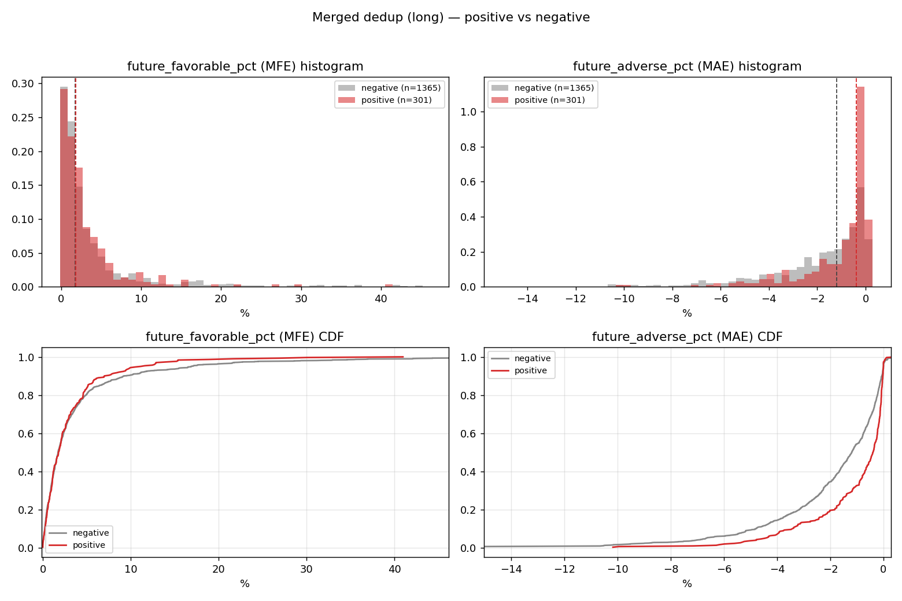

# P0 报告：人工标签是否含 alpha？

**日期**：2026-07-07
**脚本**：`analysis/p0_alpha_check.py`（可复现，产出全部在 `analysis/output/`）
**数据**：旧项目 `yolo-yolo-okx-20-k` 的 12 个含人工标签的数据集版本（v169–v181），只读。

## 一句话结论

**人工标签在"收益端"没有 alpha，但在"风险端"有真实且显著的 alpha**：
正样本的未来上涨幅度（MFE）与负样本完全无差异（p = 0.844），
但正样本的未来回撤（MAE）显著更小（p ≈ 9.2e-14，效应量 r = 0.274）。
人工挑出的不是"会涨的点"，而是"跌不动的点"。这不足以支撑"人工标签直接当分类目标"的路线，
阶段 2 判断层应改用 **triple-barrier 结果导向标注**。

## 数据与方法

### 字段含义（源自旧项目 `tools/build_strict_dense_review_pack.py`）

- `future_favorable_pct`（MFE）= 未来 72 根 K 线最高价 / 信号收盘价 − 1（做多有利幅度；5m 周期约 6 小时，15m 约 18 小时）
- `future_adverse_pct`（MAE）= 未来 72 根最低价 / 信号收盘价 − 1（做多不利幅度，通常为负）
- `user_label` 为人工复核标签（positive/negative），是权威标签（v181 summary.json 明确说明）

### 处理

- 12 个版本（v169、v170、v171、v172 三个子集、v176–v181）全部读入；
- 主分析限定 `direction = long`（short 样本仅 21 个正样本，单独列参考行）；
- 因 v177/v178/v181 是历史版本的合并超集，"合并数据"按 `(inst_id, bar, signal_time)` 去重、
  保留最新版本的标签，得到 301 正 / 1365 负；
- 检验：Mann-Whitney U（双侧）+ rank-biserial 效应量（r = 2·AUC − 1，>0 表示正样本更大）；
- 成本假设：单边 taker 0.05% + 滑点 0.05%，往返 0.2%。

## 核心结果（合并去重，long，n=301 正 / 1365 负）

| 指标 | 正样本中位 | 负样本中位 | Mann-Whitney p | rank-biserial r | 判读 |
|---|---|---|---|---|---|
| future_favorable_pct（MFE） | **+1.785%** | **+1.731%** | **0.844** | **−0.007** | 完全无差异 |
| future_adverse_pct（MAE） | **−0.388%** | **−1.193%** | **9.2e-14** | **+0.274** | 正样本回撤显著更小 |

- 剔除可能带前视筛选（strict 候选模式）的 v169 后复验，结论不变（`stats_by_version.csv` 中
  `merged_dedup_excl_v169` 行：MFE p = 0.811，MAE p < 1e-13）。
- MFE 的 r = −0.007 意味着随机抽一对正/负样本，正样本 MFE 更大的概率只有 49.6%——等同抛硬币。

### 经济意义

- 正样本中位 MFE − |中位 MAE| = 1.785% − 0.388% = **+1.397%**，名义上远超 0.2% 往返成本；
- **但这是理想化上限**（假设精确逃顶），不是可实现收益。真正的问题是：负样本同口径也有
  1.731% − 1.193% = +0.538%，**正负样本的差别几乎全部来自 MAE 端**；
- 这解释了旧项目回测为何亏损（ETH 一年 −26.3%）：模型学的目标（人工标签）不预测上涨，
  实际交易的盈亏却主要由"涨不涨"决定。**图形上"完美的启动结构"并不比同规则筛出的普通密集区更会涨。**

### 分布对比图

左列（MFE）：红灰两条 CDF 几乎重合。右列（MAE）：正样本（红）明显右移（回撤更浅）。
单版本图：`output/p0_dist_v181_long_first.png`、`output/p0_dist_v172_base.png`、`output/p0_dist_v172_balanced.png`。

## 逐版本结果（`output/stats_by_version.csv`）

| 版本（long） | n 正/负 | MFE p | MFE r | MAE p | MAE r |
|---|---|---|---|---|---|
| v169_seed | 30/50 | 0.762 | +0.04 | 0.024 | +0.30 |
| v170_mixed（=v172_base） | 82/557 | **0.0007** | +0.23 | <1e-15 | +0.46 |
| v171_hard_mining | 164/674 | 0.877 | +0.01 | <1e-15 | +0.36 |
| v172_balanced | 79/343 | 0.825 | +0.02 | 0.043 | +0.15 |
| v176_human_seed | 28/92 | 0.400 | −0.11 | 0.223 | +0.15 |
| v177_combined | 129/831 | 0.647 | +0.03 | <1e-15 | +0.34 |
| v178_user_feedback | 241/992 | 0.734 | +0.01 | <1e-15 | +0.35 |
| v179_clean_feedback | 114/203 | **0.0003** | +0.25 | <1e-15 | +0.37 |
| v180_hard_negative | 111/308 | **0.00001** | +0.28 | <1e-15 | +0.36 |
| v181_long_first | 271/1162 | 0.285 | +0.04 | <1e-15 | +0.32 |

个别版本（v170、v179、v180）MFE 显著，但它们的样本在合并去重后被 v181 的最终标签覆盖/稀释，
**最全、最新的 v181 和合并数据都不显著**。v179/v180 的显著更可能来自"负样本池不同"
（它们的负样本以 `current_model_box`（模型误报）为主，本身质量更差），而非标签含收益端信息。

## 子集分析

### 按周期（`output/stats_by_bar.csv`）

- **15m**：MFE p = 0.030，r = +0.097（弱正向）；MAE r = +0.32。15m 正样本中位 MFE 2.58% vs 负 2.06%。
- **5m**：MFE p = 0.088，r = **−0.133**（方向反了，正样本反而更差）。5m 子集无 alpha。
- 若坚持人工标签路线，只有 15m 有一丝弱信号，但效应量 <0.1，达不到可交易门槛。

### 按币种（`output/stats_by_symbol.csv`，正样本 ≥10 的 7 个币）

ETH（MFE p = 0.012，r = +0.50）、LTC（p = 0.002，r = +0.68）、TRX（p = 0.0009，r = +0.48）
在 MFE 上显著。**警告**：每币正样本仅 10–32 个，7 个币做多重比较，未做校正，
这个模式与旧项目"2911 组参数搜索过拟合"是同一类陷阱，只能当作后续假设，不能当结论。

### 按来源分组（`output/stats_by_group.csv`）

`auto_positive`、`auto_positive_volume`、`current_model_box` 三组内部 MFE 均显著（p<0.03），
但这更多反映"组间负样本基线不同"；合并后整体仍不显著。

### 数值特征与未来收益的 Spearman 相关（`output/spearman_features.csv`）

| 特征 | vs MFE（全体 long） | vs MFE（仅正样本） |
|---|---|---|
| ma_spread_pct | **+0.41**（p<1e-15） | **+0.45**（p<1e-15） |
| volume_ratio | −0.18 | −0.07（不显著） |
| volume_z | −0.17 | −0.11 |

`ma_spread_pct`（均线间距）与未来 MFE 有稳定的中等强度相关——注意它同时是波动率代理
（间距大 → 波动大 → MFE 天然大，MAE 也更负，r = −0.10），不能直接当 alpha，
但说明**数值特征对未来波动结构有实际预测力，阶段 2 判断层用数值特征是有希望的**。

## 已知局限（诚实清单）

1. MFE/MAE 是"未来 72 根内最优/最差价"，不是可实现的交易收益，没有出场规则；结论只针对
   "标签能否区分未来收益分布"，不等价于回测；
2. 正负样本共享同一预筛规则（双均线密集候选池），结论是"池内区分度"，不涉及池本身相对
   全市场是否有 alpha；
3. strict 候选模式在生成时用未来收益筛过候选（前视），主要影响 v169；已做剔除敏感性分析，结论不变；
4. 多版本样本高度重叠，"逐版本 p 值"之间不独立；以合并去重结果为准；
5. 按币种/分组的显著结果未做多重比较校正，仅供产生假设。

## 结论与阶段 2 建议

**回答 P0 问题：人工标签在收益端（MFE）无 alpha；在风险端（MAE）有显著 alpha（r≈0.27）。**

对阶段 2 判断层的明确建议：

1. **不要用人工标签当分类目标**。它学到的是"回撤浅"，不是"会涨"，直接建模会复现旧项目
   "验证指标好、回测亏钱"的老路。
2. **改用 triple-barrier 结果导向标注**（止盈/止损/超时三重障碍，标签 = 先触哪个障碍），
   让标签直接对齐交易盈亏。人工标签可降级为辅助过滤器或特征（它携带的"低回撤"信息真实存在，
   可以用来改善持仓体验/降低止损率，但不能当主目标）。
3. 数值特征路线可行性初步为正：`ma_spread_pct` 与未来波动结构相关性稳定（ρ≈0.4），
   判断层特征集应围绕均线间距序列、密集持续时间、量能、波动率位置展开。
4. 若要保留人工标签的价值，最合理的用法是 15m 子集 + 风险端目标（如"预测 MAE 是否 > −0.5%"），
   作为 triple-barrier 主模型之外的风控叠加，且必须先在新数据上复验。
