# BTC 4h 双均线密集启动相似形态检索

## Executive Summary

- 在冻结口径下，对 **54 个 OKX USDT 永续币种、2024-08-25 至 2026-08-25 的 224,585 根 4h K 线**做了一次回溯检索，得到 **8 个多头候选 + 8 个价格轴镜像空头候选**。
- 多头最接近的是 **DOGE 2026-08-19 20:00（北京时间）**，距离 0.1977；较早且跨市场时段的代表是 **LTC 2024-10-16 00:00**，距离 0.2512。空头最接近的是 **APE 2025-09-22 08:00**，距离 0.2786；直观上最值得优先复核的是 **BTC 2025-02-24 20:00**，距离 0.2818。
- LONG 前 8 名和 SHORT 前 8 名各自只有 **6 个 24 小时市场时段簇**。例如 DOGE、LTC、ETH 的 2026-08-19 多头是同一次全市场共振，不能当成 3 次独立历史复现。
- 200 次“保持振幅、打乱释放段时序”的零假设对照中，LONG 与 SHORT 的真实序列均优于全部随机排列，单侧置换检验均为 **p=1/201=0.00498**。这只说明时间顺序可被检索，不代表形态有收益或可实时识别。
- 本次读取了 holdout（2026-05-04 之后）共 **36,720 个 4h 币种行**；依据 Owner 本轮明确要求检索“最近两年”并以 2026-08-19 截图为参考，记录为本配置 **第 1 次 holdout 消耗**。扫描后没有调整门槛、权重、窗口、DTW 或 Top-N。
- 所有候选均为 **完成形态回看**：匹配使用启动后的 12 根 4h K 线，渲染另加 6 根只供人工复核。因此它们不是 tip 信号，`training_eligible=false`、`production_eligible=false`，没有训练、promote、ACTIVE/frozen 切换或交易动作。

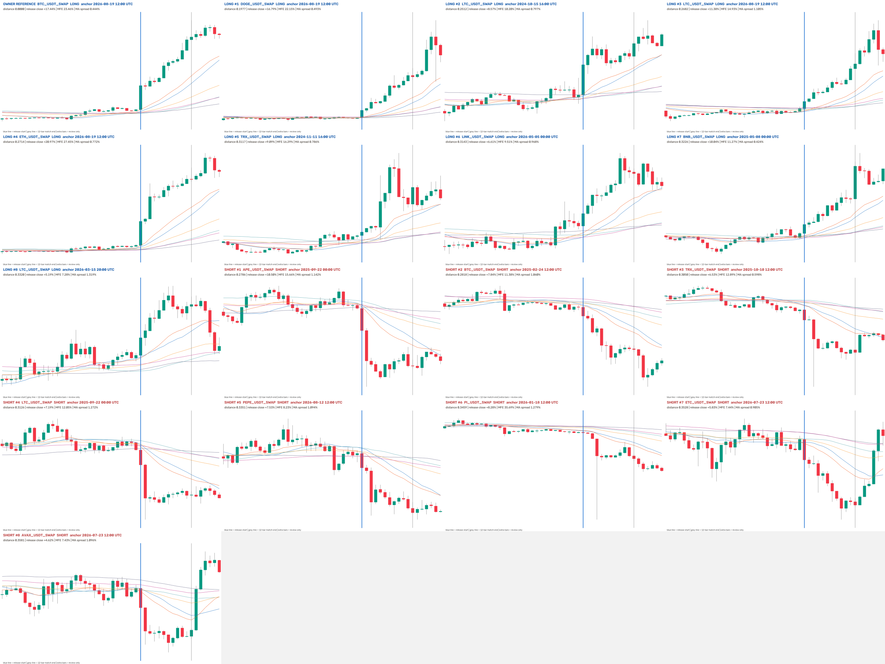

总览中蓝线是候选释放段第一根，灰线是 12 根匹配段结束；灰线之后的 6 根只用于人工观察，未进入距离。距离越低越相似，不是概率或置信度。

## Owner 参考形态

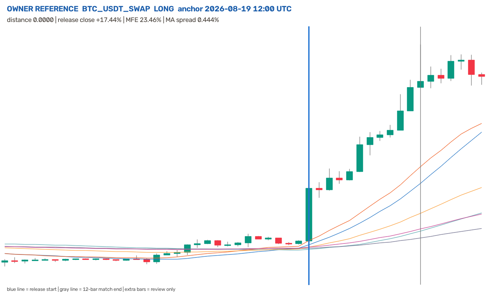

参考锚点按截图光标和第一根爆发 4h K 线推定为 **BTC 2026-08-19 12:00 UTC / 20:00 北京时间**。启动前 6 条均线（SMA/EMA 20、60、120）全束宽 0.444%，锚点开盘距均线中心 0.892%；随后 12 根收盘累计上涨 17.44%，最大顺向幅度 23.46%（33.64 ATR）。Owner 提供的是类别方向参考；这个精确 4h 边界是本次检索口径的推定，不等于 Owner 已逐 K 确认。

## 检索结果

### 多头候选

| 排名 | 币种 | 释放起点（北京时间） | 距离↓ | 12 根顺向收盘 | 最大顺向幅度 | 启动前均线束宽 | 启动前区间 | 最大顺向 ATR |
|---:|---|---|---:|---:|---:|---:|---:|---:|
| 1 | DOGE | 2026-08-19 20:00 | 0.1977 | +16.79% | +22.15% | 0.493% | 2.20% | 33.8 |
| 2 | LTC | 2024-10-16 00:00 | 0.2512 | +8.57% | +10.20% | 0.797% | 7.91% | 6.2 |
| 3 | LTC | 2026-08-19 20:00 | 0.2682 | +11.38% | +14.93% | 1.105% | 4.04% | 18.1 |
| 4 | ETH | 2026-08-19 20:00 | 0.2714 | +20.97% | +27.45% | 0.772% | 3.58% | 32.3 |
| 5 | TRX | 2024-11-12 00:00 | 0.3117 | +9.09% | +16.29% | 0.786% | 4.66% | 16.5 |
| 6 | LINK | 2026-05-05 08:00 | 0.3143 | +6.61% | +9.51% | 0.968% | 7.09% | 6.4 |
| 7 | BNB | 2025-05-08 08:00 | 0.3226 | +10.04% | +11.27% | 0.424% | 4.46% | 13.8 |
| 8 | LTC | 2026-03-16 04:00 | 0.3320 | +5.19% | +7.28% | 1.319% | 6.16% | 6.0 |

“顺向”在 LONG 中就是上涨。这里的涨幅是形态描述量，不是进出场收益；没有定义成交、止盈止损或成本。

#### LONG 1 — DOGE 2026-08-19

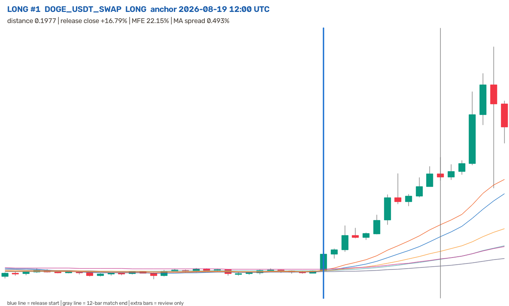

全样本最低距离，启动前波动区间仅 2.20%，均线束宽 0.493%，随后 12 根上涨 16.79%。它与 BTC 参考、同榜的 LTC 和 ETH 发生在同一锚点，只能算一次 2026-08-19 市场共振中的横截面近邻。

#### LONG 2 — LTC 2024-10-16

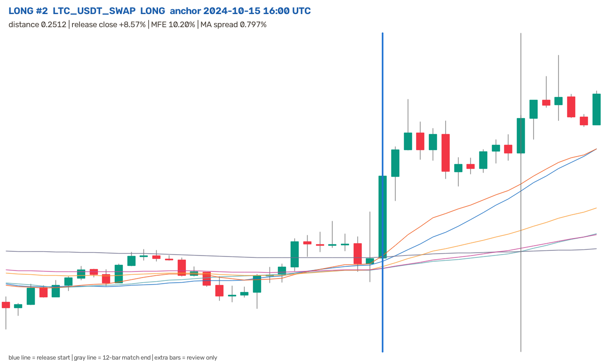

距离 0.2512，是较早且不与参考同日的最高排名候选。前置区间 7.91% 接近冻结上限 8%，所以“密集”主要体现在启动前均线束宽 0.797%，而不是极窄价格箱体。

#### LONG 3 — LTC 2026-08-19

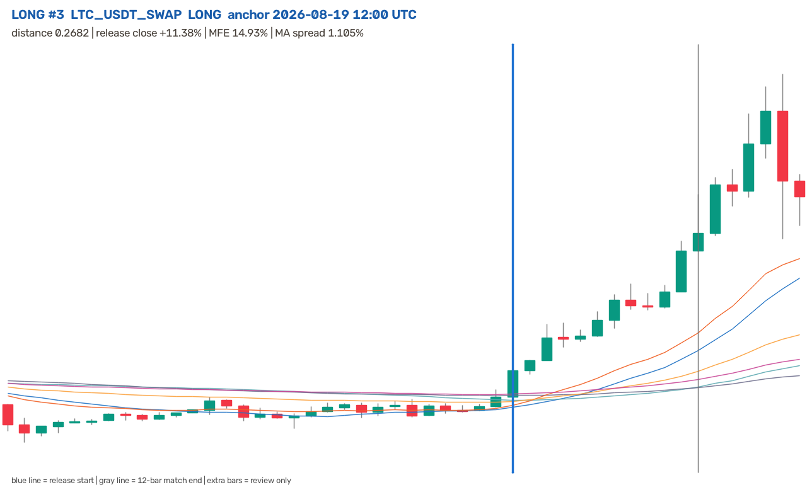

同一 2026-08-19 共振中的 LTC 版本；释放节奏与参考相近，但均线束宽 1.105% 更松、12 根涨幅 11.38% 更小。不能与 DOGE、ETH 分别计作独立复现。

#### LONG 4 — ETH 2026-08-19

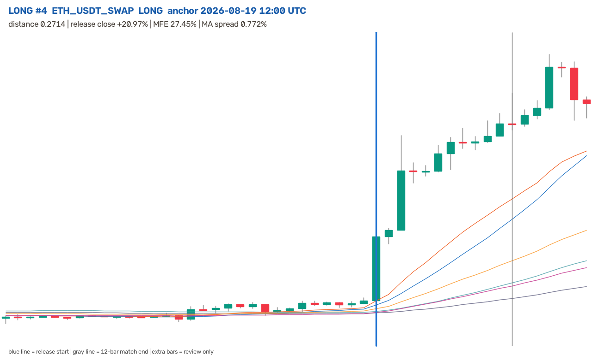

同日共振中幅度最大的候选，12 根上涨 20.97%、最大顺向 27.45%。它说明检索确实抓到了参考时段的跨币同步释放，也同时暴露出横截面依赖。

#### LONG 5 — TRX 2024-11-12

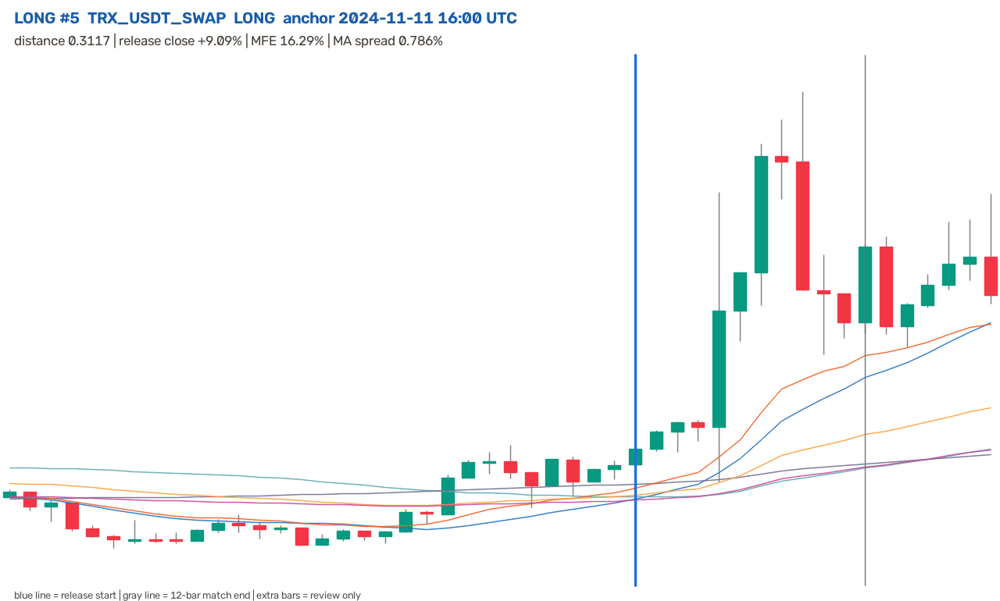

独立于参考时段，均线束宽 0.786%，12 根上涨 9.09%，期间最大顺向 16.29%。收盘路径没有参考那么陡，但中途顺向扩张较充分。

#### LONG 6 — LINK 2026-05-05

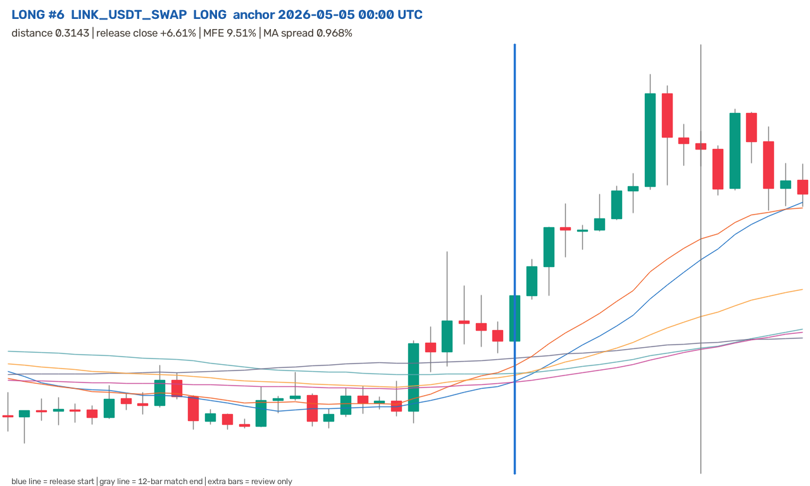

距离 0.3143，前置区间 7.09%，12 根上涨 6.61%。这是较弱幅度的合格近邻，也位于 holdout 内；只用于本轮回溯展示。

#### LONG 7 — BNB 2025-05-08

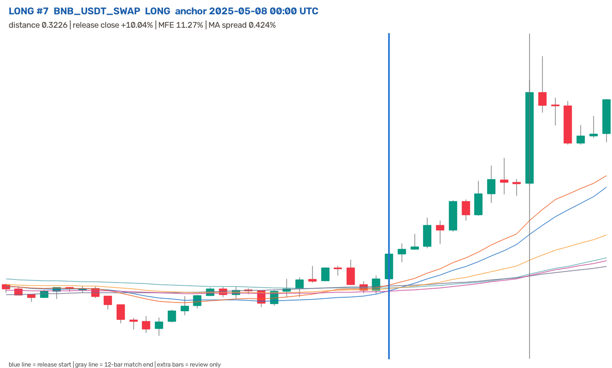

启动前均线束宽仅 0.424%，甚至略窄于参考；释放段累计上涨 10.04%。它的密集程度很强，但价格释放节奏与参考的距离略大。

#### LONG 8 — LTC 2026-03-16

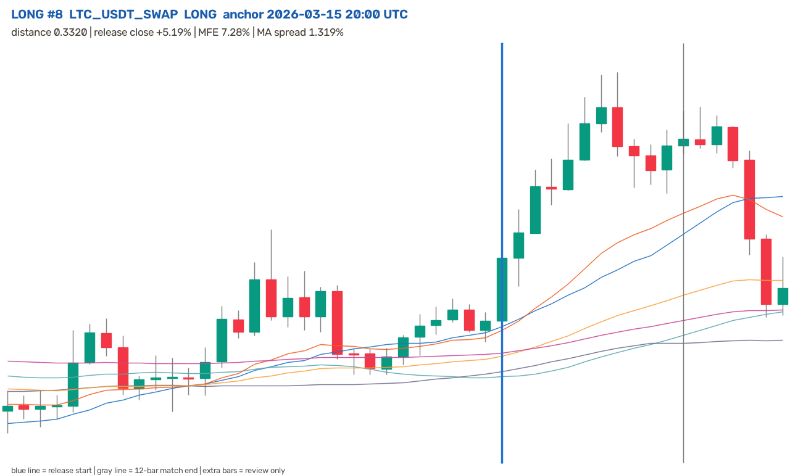

多头榜尾，均线束宽 1.319% 已贴近冻结门槛 1.333%，12 根上涨 5.19%。保留它是为了展示当前 Top-8 的边缘相似度，不建议与前两名同等看待。

### 镜像空头候选

| 排名 | 币种 | 释放起点（北京时间） | 距离↓ | 12 根顺向收盘 | 最大顺向幅度 | 启动前均线束宽 | 启动前区间 | 最大顺向 ATR |
|---:|---|---|---:|---:|---:|---:|---:|---:|
| 1 | APE | 2025-09-22 08:00 | 0.2786 | +10.50% | +15.66% | 1.142% | 7.06% | 9.2 |
| 2 | BTC | 2025-02-24 20:00 | 0.2818 | +7.84% | +11.38% | 1.060% | 4.90% | 16.3 |
| 3 | TRX | 2025-10-10 20:00 | 0.3050 | +6.53% | +12.89% | 0.598% | 4.13% | 15.0 |
| 4 | LTC | 2025-09-22 08:00 | 0.3126 | +7.19% | +12.05% | 1.272% | 5.66% | 9.3 |
| 5 | PEPE | 2026-08-12 20:00 | 0.3351 | +7.53% | +8.23% | 1.094% | 7.09% | 5.1 |
| 6 | PI | 2026-01-18 20:00 | 0.3459 | +8.28% | +35.69% | 1.279% | 5.36% | 39.1 |
| 7 | ETC | 2026-07-23 20:00 | 0.3528 | +5.83% | +7.44% | 0.905% | 5.63% | 6.5 |
| 8 | AVAX | 2026-07-23 20:00 | 0.3581 | +4.62% | +7.43% | 1.096% | 4.73% | 5.1 |

“顺向”在 SHORT 中表示下跌幅度的正数，避免多空表的好坏方向相反。SHORT 是同一个 LONG 参考张量沿价格轴精确镜像，不是另拟门槛后挑出的空头。

#### SHORT 1 — APE 2025-09-22

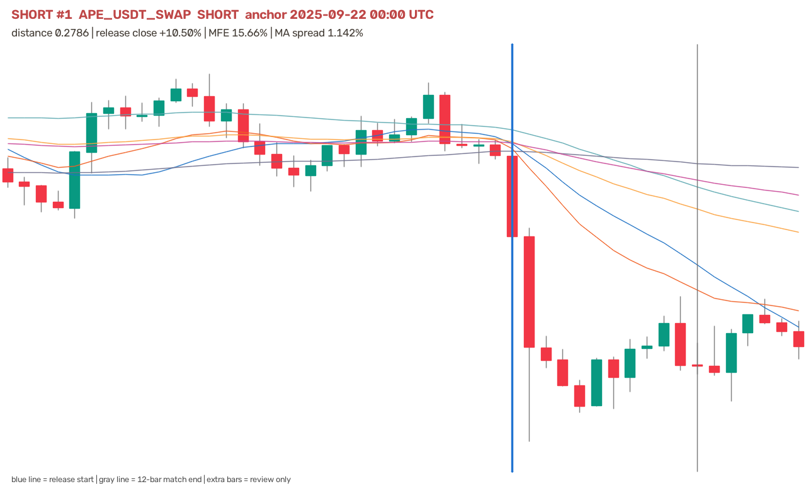

空头最低距离，12 根下跌 10.50%、最大顺向 15.66%。它与同榜 LTC 发生在同一锚点，应合并理解为一次 2025-09-22 市场下行时段。

#### SHORT 2 — BTC 2025-02-24

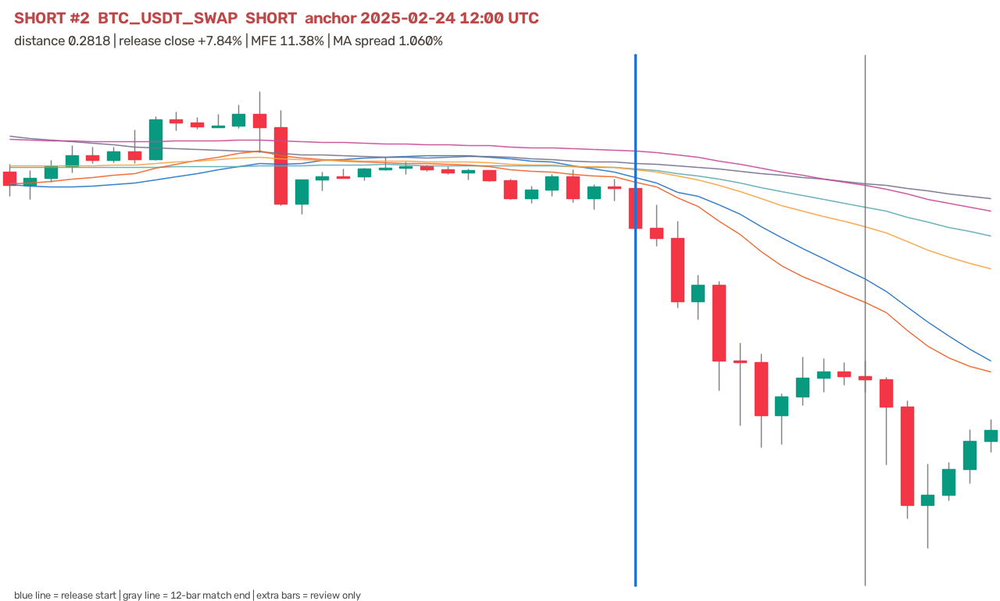

距离只比 APE 高 0.0032，且同为 BTC，视觉上最适合与 Owner 参考直接左右对照。启动前区间 4.90%，随后 12 根下跌 7.84%，最大顺向 11.38%。

#### SHORT 3 — TRX 2025-10-10

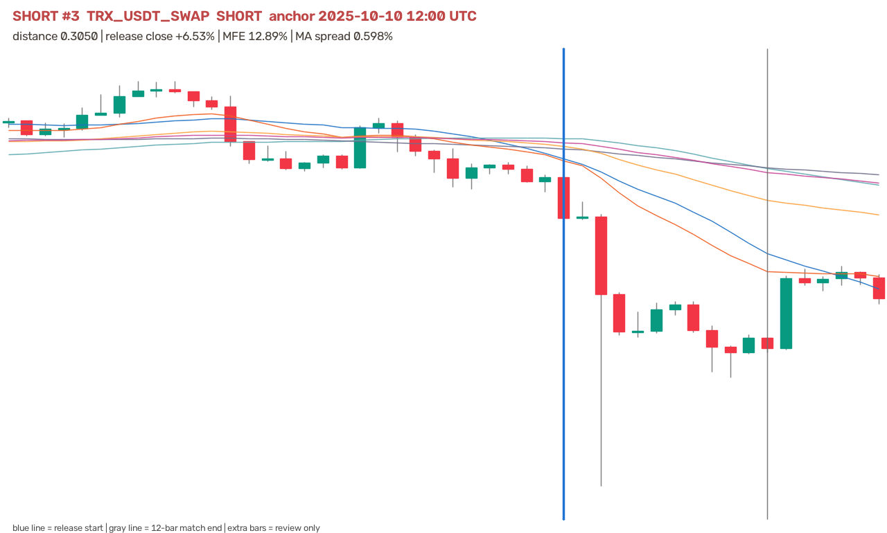

启动前均线束宽 0.598%，在空头候选中较密；12 根下跌 6.53%，中途最大顺向达到 12.89%。收盘终点弱于盘中最低点，说明释放路径有回抽。

#### SHORT 4 — LTC 2025-09-22

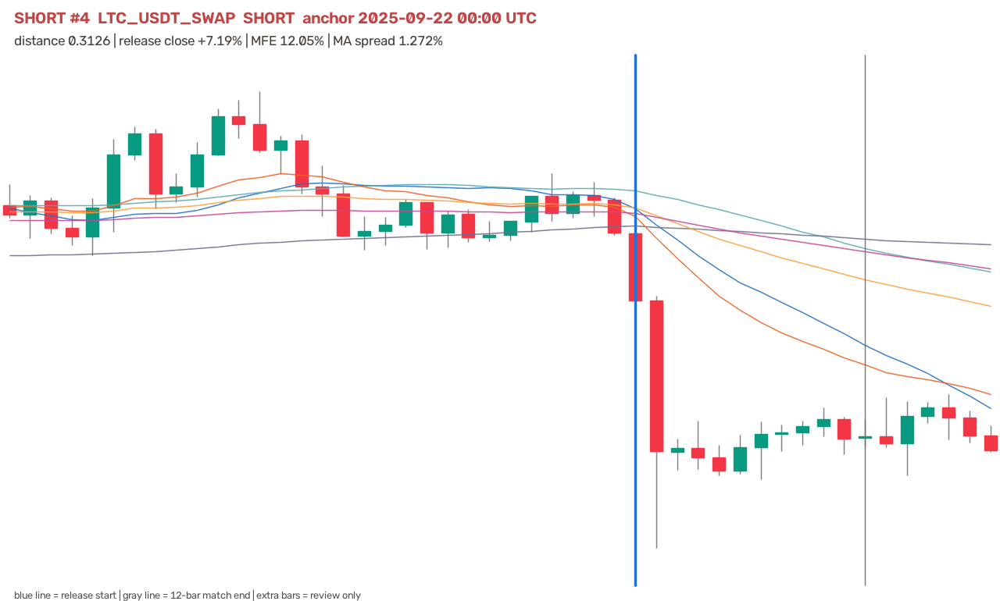

与 APE 同一市场时段，均线束宽 1.272%，12 根下跌 7.19%。它是横截面共振的第二个币，不是独立的第二次历史事件。

#### SHORT 5 — PEPE 2026-08-12

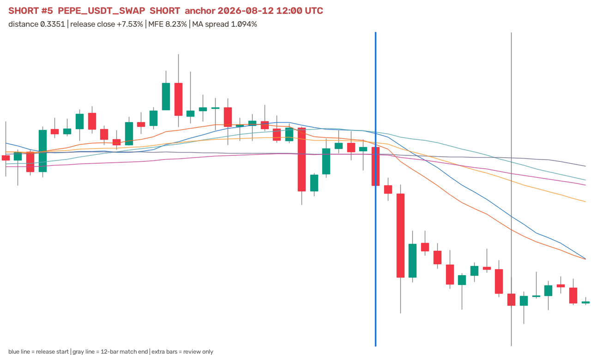

释放段下跌 7.53%，最大顺向 8.23%，二者接近，路径相对单向。该样本发生在 holdout 内，只能作为这次已授权回溯的候选。

#### SHORT 6 — PI 2026-01-18

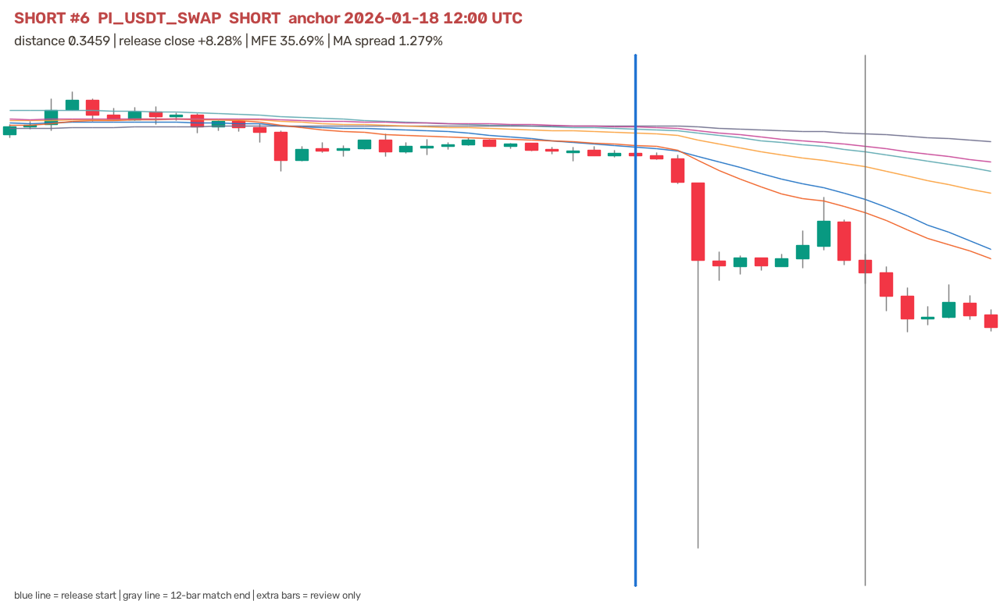

12 根收盘下跌 8.28%，但最大顺向达到 35.69%（39.1 ATR），振幅明显异常于其最终排名所暗示的“典型”形态。它适合人工复核，不应仅凭幅度被提升名次。

#### SHORT 7 — ETC 2026-07-23

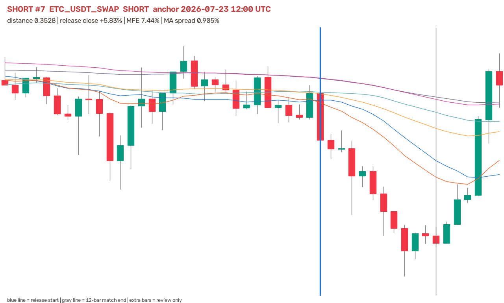

距离 0.3528，12 根下跌 5.83%。它与 AVAX 同一锚点，是 2026-07-23 下行共振的一部分。

#### SHORT 8 — AVAX 2026-07-23

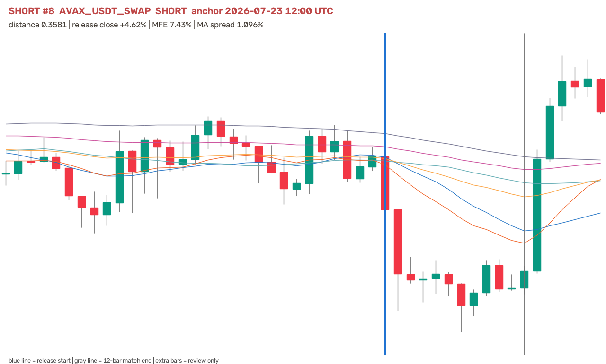

空头榜尾，12 根下跌 4.62%，略高于冻结最低门槛 4.359%。与 ETC 合并后仍只算一次市场时段；它展示的是当前检索边界，不是高置信度样本。

## 市场时段簇，而非 16 次独立事件

| 方向 | Top-8 币种候选 | 24h 市场时段簇 | 主要重复簇 |
|---|---:|---:|---|
| LONG | 8 | 6 | 2026-08-19：DOGE、LTC、ETH（另有参考 BTC） |
| SHORT | 8 | 6 | 2025-09-22：APE、LTC；2026-07-23：ETC、AVAX |

检索先在“同币 × 同方向”内用 18 根 4h K 线去重，防止同一走势连续命中；它没有跨币去重。因而样本数量与独立市场事件数量必须分开报告。若后续把这些候选用于统计或标注抽样，应按市场时段簇分组，不能把横截面共振当作独立重复。

## 方法与冻结口径

### 数据与覆盖

| 项目 | 数值 |
|---|---:|
| 本地长历史币种 | 54 |
| 完整覆盖两年 | 44 |
| 因上市/本地历史较晚而部分覆盖 | 10 |
| 扫描范围内 4h 币种行 | 224,585 |
| 每边候选锚点评估数 | 449,170 |
| 通过宽门 LONG / SHORT | 64 / 30 |
| 最终去重候选 LONG / SHORT | 8 / 8 |
| OKX 公共接口调用 | 54（每币一次、每次最多 300 根 4h） |
| 本地/API 重叠 OHLC | 54/54 全部逐值一致 |
| 原始 K 线本地写入 | 0 |
| holdout 4h 币种行 | 36,720 |

本地 `data/kline_deep` 的 15m 数据只读，在 UTC 对齐后仅保留完整的 16×15m 桶；随后每币读取一次 OKX 公共 4h 尾段，在重叠 OHLC 精确一致后仅在内存合并。扫描以 2026-08-25 04:00 UTC 的最后完整 4h 桶结束。OKX 接口与 4H bar 规格见 [OKX API v5 官方文档](https://www.okx.com/docs-v5/en/)。

### 形态窗口与距离

- 窗口由启动前 **30 根**（5 天）和启动后 **12 根**（48 小时）组成，共 42 根 4h K 线。
- 通道及权重：有符号收盘路径 40%、有符号 6-MA 中心路径 20%、6-MA 束宽 15%、有符号实体 10%、窗口内对数成交量比 15%。6 条均线是 SMA/EMA 20、60、120。
- 第一阶段用参考尺度归一化后的 42×5 加权 RMSE；第二阶段用半径 ±2 的多变量 DTW，启动前/释放段分别计算并按 35%/65% 合成。
- 最终距离 = 45% 粗距离 + 55% DTW 距离；**越低越相似，不是概率**。
- 每个币、每个方向中，锚点相隔不超过 18 根视为同一事件邻域，只保留最低距离。
- LONG 与 SHORT 只改变方向符号；窗口、门槛、尺度、权重、DTW、去重、Top-N 与零假设完全相同，符合本轮单变量纪律。

冻结宽门由参考值在扫描前一次性派生：启动前均线束宽 ≤1.333%，锚点距均线中心 ≤2.000%，前置区间 ≤8.000%，前三根顺向收盘 ≥1.084%，12 根顺向收盘 ≥4.359%，最大顺向 ≥5.047 ATR。结果出来后没有改门。

## 零假设对照

本任务是非方向性的形态检索审计，不存在可诚实计算的 AUC、top-decile 毛/净收益、胜率、0.2% 成本或匹配随机入场对照；本轮没有定义入场、TP/SL、持有或退出。因此这些经济指标均 **不适用**，不能留空或编造。等价的严格零假设是：保留同一 30 根前置段，也保留释放段 12 行的全部振幅与五通道联合值，只随机打乱这 12 行的时间顺序，再重复相同粗检索与去重 Top-8 比较。

| 方向 | 真实 Top-8 粗距离均值↓ | 随机均值 | 随机中位数 | 随机 5%–95% | 置换次数 | 单侧 p |
|---|---:|---:|---:|---:|---:|---:|
| LONG | 0.27465 | 0.33161 | 0.33279 | 0.30912–0.35004 | 200 | 0.00498 |
| SHORT | 0.31297 | 0.34991 | 0.35013 | 0.33052–0.36764 | 200 | 0.00498 |

两边真实释放时序都比同振幅、同通道值但乱序的释放更容易从历史中找回。这个对照检验的是“时间顺序是否有信息”，不检验收益、标签正确性、实时可见性，也不排除市场共同因子造成的横截面重复。

## 与上一版本对照

| 版本 | 状态 | 变化 |
|---|---|---|
| 上一版本 | 不存在 | 本轮是该 Owner 参考与 4h 两年范围的首次冻结检索 |
| v1（本报告） | 完成，待 Owner 逐样本确认 | 54 币；8 LONG + 8 SHORT；两边各 6 个 24h 时段簇；holdout 配置消耗 #1 |

没有旧版本就不能声称“提升”。本报告只建立可复现的 v1 候选册与基线。

## 风险与诚实声明

1. **完成形态，不是盘口信号。** 距离使用启动后的 12 根 4h K 线，另有 6 根未来 K 线只用于图上复核；这违反实时 tip 的可见性要求，绝不能接入 tip-smoke、forward、ACTIVE 或部署。
2. **Owner 类别参考不等于逐样本金标。** 参考图的形态方向由 Owner 提供，但精确锚点由截图光标与首根爆发 K 线推定；16 个候选目前都是 `PENDING`，Codex 只做建议检索，不能替代 Owner 的 YES/NO 裁决。
3. **holdout 已消费。** 这次读取 36,720 个 holdout 4h 币种行，记录为本配置第 1 次。任何改权重、门槛、窗口、币池、DTW、去重或 Top-N 后再跑都构成新配置，必须重新获得 Owner 明确批准并记录新的消费次数。
4. **覆盖不是 OKX 全市场。** 54 币来自仓内长历史池；44 币完整覆盖两年，10 币因上市或本地历史较晚只覆盖部分时段。未静默换数据源，也未补造历史。
5. **横截面不独立。** 16 个币种候选对应的独立 24h 时段少于 16；同一市场 beta 可同时推动多个币形成相似图形。
6. **距离不是成功概率。** 排名只比较已完成的路径形态，未证明未来收益、因果可检测性或可学习性。PI 等极端振幅也说明单一总距离仍需人工检查。
7. **零假设范围有限。** phase-scramble 排除了“同样振幅随便排序也一样好找”这一解释，但没有构造交易随机对照，也没有检验跨市场制度稳定性。
8. **没有生产状态变化。** 未训练模型、未 promote、未改阈值预设、未改新鲜度门、未清日志、未下单。

## 下一步选项

- **Owner 可直接复核 16 张图并给 YES / NO / 边界修正。** 建议优先看 LONG：DOGE 2026-08-19、LTC 2024-10-16；SHORT：BTC 2025-02-24、APE 2025-09-22。确认层级应记录为逐样本确认，不能用“协议方向已确认”代替。
- 若目标改成“在启动当根即可识别”，需要另立因果规格，只允许 tip / tip-1 / tip-2 可见窗口，并重新设计标签与延迟预算；不能把本轮使用 12 根未来 K 的结果直接改名为实时信号。
- 若要扩大币池、调整相似度或重跑本配置，必须先由 Owner 决定是否值得再次消耗 holdout。本轮不自动继续。

## 复现与验收

Builder 在正式扫描前已提交，提交号：`d0fd226fbd52e4683d5a6ac429776477a781909e`。冻结配置位于 `experiments/active/exp-btc-4h-ma-launch-similarity-v1/preregistration.json`；完整逐样本字段、哈希与 Owner 审核位位于 `results/review_manifest.jsonl`。

以下是从零执行的完整命令。**注意：扫描命令会再次读取同一 holdout；在没有 Owner 新一轮明确批准前不要执行，若执行应记录为该配置第 2 次消耗。**

```bash
cd /Users/zhangzc/fable-trading
git branch --show-current
git show --stat --oneline d0fd226fbd52e4683d5a6ac429776477a781909e

PYTHONPATH=. .venv/bin/python -m pytest -q \
  tests/test_four_hour_similarity.py \
  tests/boundaries/test_layer_imports.py \
  tests/boundaries/test_experiment_isolation.py

FOUR_HOUR_REPRO_DIR=$(mktemp -d)
PYTHONPATH=. .venv/bin/python \
  scripts/find_four_hour_ma_launch_similarity.py \
  --source-dir data/kline_deep \
  --prereg experiments/active/exp-btc-4h-ma-launch-similarity-v1/preregistration.json \
  --out "$FOUR_HOUR_REPRO_DIR"

.venv/bin/python scripts/md_to_html.py \
  analysis/p0_btc_4h_ma_launch_similarity_20260825.md \
  --out-dir analysis/html
```

本轮正式代码验收：

```text
PYTHONPATH=. .venv/bin/python -m pytest tests -q
1545 passed, 4 skipped, 14 warnings in 29.76s
```

直接在仓库根目录执行不限定 `tests/` 的 `pytest` 会收集外部 Kronos 目录，并因其独立的 `qlib` / `model` 环境缺失而在 collection 阶段报错；这不是本次变更失败。仓内正式 `tests/` 全量验收如上已通过。
