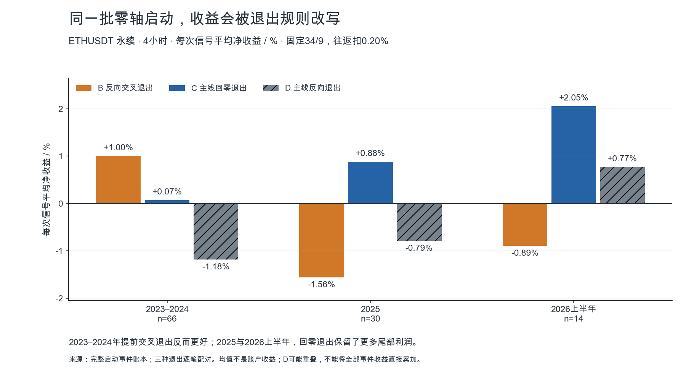
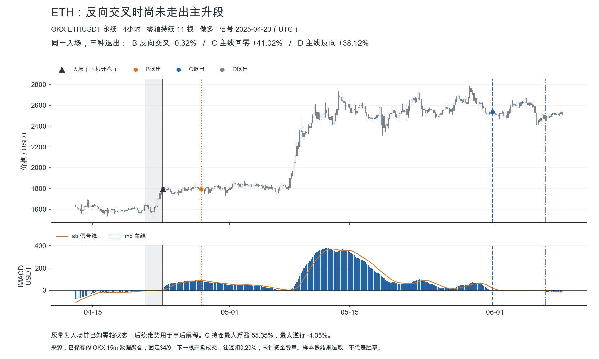
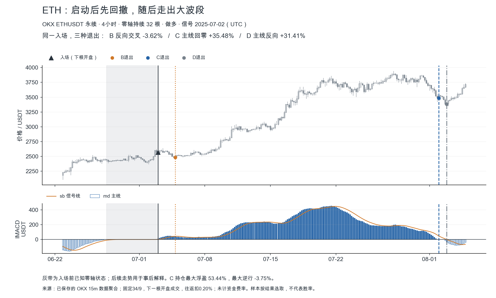
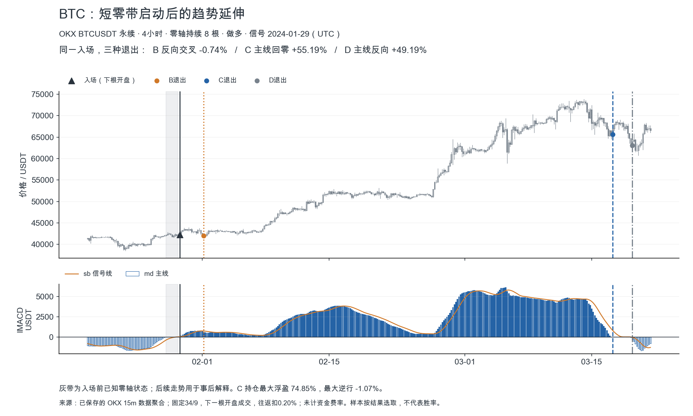
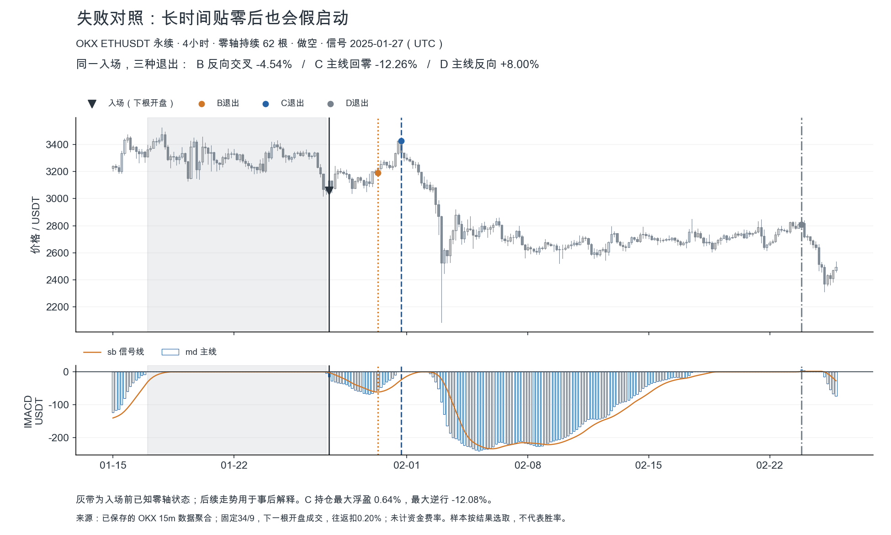

# IMACD：零轴横盘后启动，利润怎样留在手里

研究日期：2026-09-07。OKX BTCUSDT/ETHUSDT USDT永续；原参数34/9；长期样本2023-01-01至2026-06-30；不是当前行情信号。

## 这次发现的核心

**找到了与你“零轴横盘后启动、拿住大趋势”相符的盈利机制线索：少数启动会发展成大波段，过程中反向金死叉先发生，价格趋势却继续；过早按反向交叉离场，会把这部分利润截掉。**

最直接的例子：ETH4h 2025-04-23同一入场，反向交叉退出净−0.32%，主线回零退出净+41.02%；2025-07-03同一入场，分别−3.62%与+35.48%。这些是按已定义规则和下一根开盘计算的结果，不是拿最高点当收益。

**值得继续盯住的候选：ETH4h连续≥9根零轴后启动、BTC4h连续2–8根零轴后启动，持有至主线回零。** 两组在三个时间段均录得正均值，但大部分交易仍亏损，随机对照后的优势没有通过严格多重检验。这是一条值得保留的研究方向，尚不足以认定“已验证能赚大钱”。

## 先把形态定义到可以重现

1. “零轴横盘”指主线md精确等于0，代表零滞后均线处于SMMA高低通道内；它不是价格必然窄幅横盘，也不等于多条均线已经密集。
2. “启动”指上一根md=0，本根md首次变正/负；本根收盘后决定多/空，下一根开盘进入。同一次脱离零轴不重复追每个箭头。
3. “拿住”分别测试三种退出：B首次反向交叉；C主线回零或越过零轴反向；D主线真正反向。退出状态在收盘确认，下一根开盘执行。
4. 保持原34/9，不调参、不叠加过滤器、不加TP/SL。20bp往返成本固定。先固定同一批入场，再只改退出，才能看清收益差异。

为什么会出现这个机制：信号线sb是md的9根均值；md从快速扩张转为缓慢扩张时，可以下穿sb，但仍在零轴上方。此时交叉表达的是推动速度相对近期均值放慢，不必然代表整个上行段结束。空头对称。

连续≥9根md=0还有一个代码层面的含义：在启动前，sb及sh也已归零，旧的信号线记忆消失。2–8根的短归零则可能保留前一段方向记忆。这个差别为两个币种不同的结果提供解释线索，但本实验尚未检验前一段方向，不能把解释当结论。

## 同一入场，只改退出

ETH4h完整零轴启动母群；单位为每次事件平均净收益，不是账户收益。配对三分支样本完全一致。

| 时段 | 启动数 | 匹配数 | B 全部/匹配/随机 | C 全部/匹配/随机 | D 全部/匹配/随机 | C 匹配超额 |
| --- | --- | --- | --- | --- | --- | --- |
| 2023–2024 | 66 | 63 | 1.00% / 1.17% / 0.99% | 0.07% / 0.32% / -0.33% | -1.18% / -0.87% / -0.88% | 0.66% |
| 2025 | 30 | 27 | -1.56% / -1.24% / -1.31% | 0.88% / 1.53% / -0.51% | -0.79% / 0.43% / -1.92% | 2.05% |
| 2026上半年 | 14 | 14 | -0.89% / -0.89% / -2.02% | 2.05% / 2.05% / 0.49% | 0.77% / 0.77% / -0.80% | 1.56% |



2025年C相对B每次增加2.44个百分点，2026上半年增加2.95个百分点；但2023–2024年减少0.93个百分点。因此“多拿总更好”不成立。D进一步等到反向，ETH4h三个时间段的事件均值都低于C：持有规则也需要结束边界。

## 找到的两组候选形态

两组来自预先声明的零带根数分组，报告看完全部周期与分组后重点展示，属于探索性选择。三段同号不等于三段都从未见过，更不等于独立终验。

| 形态 | 时段 | 全部n | 全部净均值 | 净中位数 | 胜率 | PF | 匹配n | 匹配信号均值 | 随机均值 | 超额均值 | 月聚类p（未校正） |
| --- | --- | --- | --- | --- | --- | --- | --- | --- | --- | --- | --- |
| BTC4h 2–8根 | 2023–2024 | 30 | 3.36% | -2.13% | 33.33% | 2.37 | 29 | 3.65% | 2.41% | 1.24% | 0.1670 |
| BTC4h 2–8根 | 2025 | 17 | 0.65% | -2.42% | 29.41% | 1.29 | 16 | 0.84% | 0.11% | 0.73% | 0.3438 |
| BTC4h 2–8根 | 2026上半年 | 7 | 4.36% | -2.60% | 42.86% | 3.09 | 7 | 4.36% | 4.33% | 0.03% | 0.5000 |
| ETH4h ≥9根 | 2023–2024 | 29 | 1.45% | -1.47% | 41.38% | 1.62 | 27 | 2.04% | 0.53% | 1.51% | 0.0060 |
| ETH4h ≥9根 | 2025 | 14 | 2.20% | -2.76% | 28.57% | 1.52 | 12 | 3.10% | 2.44% | 0.66% | 0.3633 |
| ETH4h ≥9根 | 2026上半年 | 11 | 0.76% | -2.79% | 45.45% | 1.29 | 11 | 0.76% | -1.40% | 2.16% | 0.0312 |

PF=全部正收益之和/全部负收益绝对值之和。随机对照与信号使用相同退出算法、同成本。**超额=匹配信号均值−随机均值，不一定等于全部信号均值−随机均值**；缺少3个对照的事件不参与超额推断。以下完整周期附表同理，全部与匹配分母明确区分。

| 币种4h | 零带长度 | 2023–24 全部/匹配/随机 | 2025 全部/匹配/随机 | 2026H1 全部/匹配/随机 |
| --- | --- | --- | --- | --- |
| BTC | 2–8根 | 3.36% (n=30) / 匹配 3.65% / 随机 2.41% (m=29) | 0.65% (n=17) / 匹配 0.84% / 随机 0.11% (m=16) | 4.36% (n=7) / 匹配 4.36% / 随机 4.33% (m=7) |
| BTC | ≥9根 | -0.38% (n=26) / 匹配 -0.07% / 随机 -1.91% (m=23) | -1.55% (n=17) / 匹配 -1.55% / 随机 -2.28% (m=17) | -0.21% (n=8) / 匹配 -0.21% / 随机 -2.27% (m=8) |
| ETH | 2–8根 | -1.54% (n=36) / 匹配 -1.50% / 随机 -1.18% (m=35) | -0.27% (n=16) / 匹配 0.28% / 随机 -2.87% (m=15) | 6.82% (n=3) / 匹配 6.82% / 随机 7.43% (m=3) |
| ETH | ≥9根 | 1.45% (n=29) / 匹配 2.04% / 随机 0.53% (m=27) | 2.20% (n=14) / 匹配 3.10% / 随机 2.44% (m=12) | 0.76% (n=11) / 匹配 0.76% / 随机 -1.40% (m=11) |

**不能把“横得越久、爆发越强”一概而论。** ETH偏长零带，BTC偏短零带，是本次更值得继续追踪的差异。BTC长零带三段净均值都负。这个发现不证明币种有永恒属性，也没有排除少数历史行情驱动结果。

## 大钱来自少数大波段：这对执行意味着什么

| 形态 | 时段 | 全部净均值 | 删除最大赢家后均值 | 删除事后前10%后均值 | 最差单次净收益 | 最差持仓逆行 | 持仓中位数 |
| --- | --- | --- | --- | --- | --- | --- | --- |
| BTC4h 2–8根 | 2023–2024 | 3.36% | 1.57% | -1.29% | -8.23% | -14.27% | 8.58天 |
| BTC4h 2–8根 | 2025 | 0.65% | -0.80% | -1.99% | -6.10% | -13.06% | 8.50天 |
| BTC4h 2–8根 | 2026上半年 | 4.36% | 1.21% | 1.21% | -5.88% | -6.45% | 3.00天 |
| ETH4h ≥9根 | 2023–2024 | 1.45% | -0.57% | -1.86% | -8.20% | -8.41% | 9.17天 |
| ETH4h ≥9根 | 2025 | 2.20% | -0.79% | -3.81% | -12.26% | -12.39% | 6.58天 |
| ETH4h ≥9根 | 2026上半年 | 0.76% | -1.00% | -2.20% | -10.42% | -10.59% | 6.67天 |

ETH候选在三个时段里只去掉最大赢家，均值就全部转负。BTC候选2025年也如此。这里删除赢家只是依赖度诊断，绝不能用事后赢家名单制定入场。

这类系统的关键能力是：连续假启动后仍能执行下一次有效启动；进入大波段后容忍正常回撤；在已定义的结束条件出现时兑现。若把止盈设得很近或每次出现反向交叉就走，会改变盈利来源。反过来，容忍回撤不等于任何亏损都死扛：本研究没有保护止损，出现过超过10%的单笔亏损，不能直接照搬成杠杆实盘。

## 实际K线：两个2025赢家、一个BTC赢家、一个同形态失败

每张图明确显示已知零带和事后价格路径。图按结果挑选用于解释，完整胜负分母在前表与逐笔账本。日期均UTC。

### ETH：反向交叉时尚未走出主升段

| 规则 | 入场UTC | 入场价 | 退出UTC | 退出价 | 净收益 | 同事件3随机控制均值 | 超额 |
| --- | --- | --- | --- | --- | --- | --- | --- |
| B 零轴启动/反向交叉退出 | 2025-04-23T04:00 | 1795.24 | 2025-04-27T16:00 | 1793.10 | -0.32% | -0.30% | -0.02% |
| C 零轴启动/主线回零退出 | 2025-04-23T04:00 | 1795.24 | 2025-05-31T16:00 | 2535.28 | 41.02% | 41.05% | -0.03% |
| D 零轴启动/主线反向退出 | 2025-04-23T04:00 | 1795.24 | 2025-06-06T20:00 | 2483.13 | 38.12% | 38.14% | -0.03% |



### ETH：启动后先回撤，随后走出大波段

| 规则 | 入场UTC | 入场价 | 退出UTC | 退出价 | 净收益 | 同事件3随机控制均值 | 超额 |
| --- | --- | --- | --- | --- | --- | --- | --- |
| B 零轴启动/反向交叉退出 | 2025-07-03T00:00 | 2569.34 | 2025-07-04T20:00 | 2481.56 | -3.62% | 1.63% | -5.24% |
| C 零轴启动/主线回零退出 | 2025-07-03T00:00 | 2569.34 | 2025-08-02T00:00 | 3486.00 | 35.48% | 26.18% | 9.30% |
| D 零轴启动/主线反向退出 | 2025-07-03T00:00 | 2569.34 | 2025-08-02T20:00 | 3381.55 | 31.41% | 22.39% | 9.02% |



### BTC：短零带启动后的趋势延伸

| 规则 | 入场UTC | 入场价 | 退出UTC | 退出价 | 净收益 | 同事件3随机控制均值 | 超额 |
| --- | --- | --- | --- | --- | --- | --- | --- |
| B 零轴启动/反向交叉退出 | 2024-01-29T12:00 | 42240.00 | 2024-02-01T04:00 | 42012.30 | -0.74% | -2.91% | 2.17% |
| C 零轴启动/主线回零退出 | 2024-01-29T12:00 | 42240.00 | 2024-03-17T08:00 | 65637.40 | 55.19% | 51.80% | 3.39% |
| D 零轴启动/主线反向退出 | 2024-01-29T12:00 | 42240.00 | 2024-03-19T12:00 | 63102.20 | 49.19% | 45.93% | 3.26% |



### 失败对照：长时间贴零后也会假启动

| 规则 | 入场UTC | 入场价 | 退出UTC | 退出价 | 净收益 | 同事件3随机控制均值 | 超额 |
| --- | --- | --- | --- | --- | --- | --- | --- |
| B 零轴启动/反向交叉退出 | 2025-01-27T12:00 | 3058.79 | 2025-01-30T08:00 | 3191.56 | -4.54% | 2.06% | -6.60% |
| C 零轴启动/主线回零退出 | 2025-01-27T12:00 | 3058.79 | 2025-01-31T16:00 | 3427.60 | -12.26% | -3.85% | -8.41% |
| D 零轴启动/主线反向退出 | 2025-01-27T12:00 | 3058.79 | 2025-02-23T20:00 | 2807.94 | 8.00% | 13.81% | -5.81% |



ETH 2025-01-27失败样本此前连续62根（约10.3天）md=0，向下启动后价格迅速反抽，等回零离场净亏约12.26%；继续等到反向的D最终净赚8.00%。它和赢家属于同一长零带候选，证明“贴零后启动”不能保证第一段方向正确，C也不是每笔最优退出。不能因为这一个反例就忽略D在全母群的回吐代价。

## 各周期真正告诉了什么

下表全部使用C：零轴启动→回零退出。括号n；每次净均值与匹配随机均值并列，避免把市场方向收益当指标优势。15m及以上使用同一长历史；不按全样本收益挑一个所谓最优周期。

| 币种 | 周期 | 2023–24 全部/匹配/随机 | 2025 全部/匹配/随机 | 2026H1 全部/匹配/随机 |
| --- | --- | --- | --- | --- |
| BTC | 15m | -0.12% (n=1091) / -0.12% / -0.14% (m=1091) | -0.20% (n=539) / -0.20% / -0.29% (m=539) | -0.14% (n=255) / -0.14% / -0.15% (m=255) |
| BTC | 30m | -0.05% (n=535) / -0.05% / -0.12% (m=535) | -0.38% (n=274) / -0.38% / -0.48% (m=274) | 0.07% (n=129) / 0.07% / -0.45% (m=129) |
| BTC | 1h | 0.27% (n=247) / 0.28% / -0.02% (m=246) | -0.58% (n=149) / -0.57% / -0.55% (m=148) | 0.32% (n=60) / 0.32% / -0.55% (m=60) |
| BTC | 2h | 0.84% (n=118) / 0.92% / -0.84% (m=116) | -0.57% (n=73) / -0.59% / -1.18% (m=72) | 0.61% (n=29) / 0.61% / -0.15% (m=29) |
| BTC | 4h | 1.62% (n=56) / 2.01% / 0.50% (m=52) | -0.45% (n=34) / -0.39% / -1.12% (m=33) | 1.92% (n=15) / 1.92% / 0.81% (m=15) |
| BTC | 6h | 2.74% (n=37) / 2.68% / 0.57% (m=31) | -0.38% (n=24) / -0.74% / -1.26% (m=23) | 5.76% (n=7) / 7.57% / 6.46% (m=6) |
| BTC | 12h | 3.80% (n=21) / 4.39% / 1.82% (m=20) | 1.54% (n=10) / 2.57% / 1.50% (m=9) | 6.03% (n=5) / 6.03% / 3.32% (m=5) |
| BTC | 24h | 8.39% (n=11) / 1.68% / 1.14% (m=8) | 1.80% (n=5) / -6.80% / -2.12% (m=2) | 1.81% (n=2) / 1.81% / 0.76% (m=2) |
| ETH | 15m | -0.12% (n=1085) / -0.12% / -0.22% (m=1085) | -0.13% (n=570) / -0.13% / -0.25% (m=570) | -0.02% (n=246) / -0.02% / -0.02% (m=246) |
| ETH | 30m | -0.12% (n=552) / -0.12% / -0.23% (m=552) | -0.33% (n=284) / -0.33% / -0.51% (m=284) | -0.06% (n=130) / -0.06% / -0.49% (m=130) |
| ETH | 1h | 0.22% (n=266) / 0.23% / 0.04% (m=265) | -0.40% (n=140) / -0.40% / -1.09% (m=140) | -0.06% (n=59) / -0.06% / -1.11% (m=59) |
| ETH | 2h | 0.52% (n=126) / 0.57% / -0.17% (m=123) | -0.35% (n=77) / -0.35% / -1.68% (m=77) | -0.16% (n=34) / -0.16% / -0.96% (m=34) |
| ETH | 4h | 0.07% (n=66) / 0.32% / -0.33% (m=63) | 0.88% (n=30) / 1.53% / -0.51% (m=27) | 2.05% (n=14) / 2.05% / 0.49% (m=14) |
| ETH | 6h | -0.55% (n=42) / -0.50% / -2.54% (m=38) | 2.88% (n=20) / 0.99% / -3.24% (m=19) | 3.80% (n=10) / 6.34% / 5.30% (m=8) |
| ETH | 12h | -0.32% (n=24) / 2.39% / 0.17% (m=17) | 10.94% (n=10) / 19.03% / 14.08% (m=7) | 5.51% (n=6) / 5.51% / 5.18% (m=6) |
| ETH | 24h | 0.48% (n=12) / -5.38% / -6.25% (m=6) | 30.58% (n=3) / 35.02% / 33.34% (m=2) | 13.70% (n=3) / 13.70% / 12.72% (m=3) |

15m/30m多数净均值为负，20bp成本后难形成优势，频繁切换对这套持有逻辑不利。4h出现可解释的形态条件；BTC12h/1d全母群三段正均值，但信号少，而且BTC日线2025随机对照更好，不能据绝对盈利宣布优势。ETH日线2025只有3次信号，其大收益不能外推。6h/12h/1d可作为低频研究对象，尚无足够证据用来给4h信号加过滤；多周期共振本轮未回测。

| 币种 | 周期 | 开始UTC | 结束UTC | n | 全部净均值 | 匹配n | 匹配均值 | 随机均值 | 超额 |
| --- | --- | --- | --- | --- | --- | --- | --- | --- | --- |
| BTC | 3m | 2026-03-14T05:15 | 2026-07-01T00:00 | 868 | -0.22% | 868 | -0.22% | -0.19% | -0.03% |
| BTC | 5m | 2025-12-21T14:20 | 2026-01-01T00:00 | 52 | -0.28% | 52 | -0.28% | -0.35% | 0.07% |
| BTC | 5m | 2026-01-01T00:00 | 2026-07-01T00:00 | 871 | -0.24% | 871 | -0.24% | -0.25% | 0.01% |
| ETH | 3m | 2026-03-14T05:15 | 2026-07-01T00:00 | 849 | -0.20% | 849 | -0.20% | -0.20% | 0.01% |
| ETH | 5m | 2025-12-21T14:20 | 2026-01-01T00:00 | 52 | -0.28% | 52 | -0.28% | -0.36% | 0.07% |
| ETH | 5m | 2026-01-01T00:00 | 2026-07-01T00:00 | 824 | -0.21% | 824 | -0.21% | -0.14% | -0.06% |
| ETH | 1m | 2026-04-17T20:36 | 2026-07-01T00:00 | 1778 | -0.21% | 1778 | -0.21% | -0.22% | 0.01% |

小周期缓存范围较短。5m在2025仅有12月下旬，不能称2025全年验证。BTC1m缺失；周线可用总根数不够340根预热；没有伪造这些结果。当前覆盖1m（仅ETH）、3m、5m、15m、30m、1h、2h、4h、6h、12h、1d；未声称覆盖TradingView所有自定义周期。

## 和你的Notion怎样连接

最直接相关的是[交易系统-更新中](https://app.notion.com/p/2ac8856479af8063b17bc02256e564a9)里“回测Impulse MACD [LazyBear] + 均线密集”的待办。当前找出的零轴启动，是把这个想法中IMACD的一半写成了可执行规则；尚未把均线密集量化，因此没有把它称为对你完整系统的验证。

[CM_Williams_Vix_Fix交易系统](https://app.notion.com/p/2248856479af80d8b0fdcb7360750e01)及[Stochastic + Vix + Impulse MACD策略回测](https://app.notion.com/p/2258856479af80d5bbf3dd45c59278d2)把IMACD列入组合；对应[bonk1h](https://app.notion.com/p/2278856479af809fbeeeebe17910a3e6)的几笔截图收益不能替代BTC/ETH的完整账本。[2025下半年计划](https://app.notion.com/p/2358856479af8047bcfccab5ea9a2f0e)的趋势、动量、成交量、结构分层，可以作为下一轮研究背景，不能直接当作本轮已测试条件。

笔记里“三根没按预期走就退出”、Vix体系里的1:1后保本，与本次“忍受回调、拿到回零”可能产生冲突。它们属于不同体系或候选规则，不能不经同母群比较就全部叠加。本轮只检索引用，没有修改Notion。

## 数据、对照与统计口径

完整母群包括全部符合启动定义的信号，盈利标签为已定义退出后扣20bp收益>0；不是未来最高涨幅标签。分段按时间：2023–2024 discovery、2025 replication、2026H1 exposed。2026及过往资料已经暴露给研究，不声称独立未见终验。Owner允许所有日期，本轮四个策略配置各第1次消耗holdout；分组是同一轮预声明诊断，不能重新宣称是未使用配置。独立价格核对与数值修复没有新增交易配置或抽取新样本。

每条信号找3个同币、同周期、同月、同ATR/close滚动240根百分位五桶、同md区域的随机时点，赋予相同多空方向；每个入场家族不重复使用控制时点。选择控制时不看未来；三个退出分支复用同一批控制。对照使用同一退出算法、20bp和边界记账。少于3个控制保留交易但不计算该事件的超额。

超额=信号净收益−三个对照平均净收益。按月聚类bootstrap区间与单侧符号置换p，承认月间独立近似。控制窗口可能互相重叠或与事件重叠，因此这是一种匹配观察研究，不是随机试验。没有宣称事件级独立。2025全部72个可比较单元做Holm校正（包括短样本5m），最小校正p=0.28125，没有任何一个达到项目p<0.01终验门槛。候选子组的p未再校正，只作描述。

单特征基线固定为入场方向×md/ATR14强度；给出AUC、强度最高10%样本的毛/净收益、胜率与匹配超额。这里AUC衡量强度与该退出下盈利标签的关系；没有训练L2，所以不是模型val AUC。2025作为时间验证段，完整指标见附表。按验证段强度排名取前10%是离线诊断，未构造可上线阈值。收益最高的事后10%只用于尾部依赖诊断，与这个因果强度排名严格区分。

数据规模：220个币种×周期×时段×规则单元；82,463条事件反事实（同一启动含三个退出版本，不是独立交易数）；246,788条控制反事实；完整3对照事件82,174条，缺口289条。原始数据2022年开始用于长周期预热，长样本评估从2023年开始；每个周期至少340根热身。

| 核心母群 | 时间段 | 候选数 | 盈利正类率 | 边界强制记账 | 完整对照数 |
| --- | --- | --- | --- | --- | --- |
| BTC4h | 2023–2024 | 56 | 32.14% | 1 | 52 |
| ETH4h | 2023–2024 | 66 | 31.82% | 1 | 63 |
| BTC4h | 2025 | 34 | 26.47% | 0 | 33 |
| ETH4h | 2025 | 30 | 26.67% | 0 | 27 |
| BTC4h | 2026上半年 | 15 | 46.67% | 1 | 15 |
| ETH4h | 2026上半年 | 14 | 42.86% | 1 | 14 |

## 单仓路径与风险

候选C各交易互不重叠。以下仅用每笔固定初始本金名义金额的研究路径，累计百分比是收益相加，非复利、非杠杆账户收益；回撤按已收盘价标记，盘中可能更大。不同时间段重置权益，不拼接跨年持仓。

| 候选 | 时段 | 固定初始名义收益和 | 收盘标记最大回撤 | 最低权益/初始权益 | 边界记账数 |
| --- | --- | --- | --- | --- | --- |
| BTC4h 2–8根 | 2023–2024 | 100.66% | 24.00% | 0.994 | 1 |
| BTC4h 2–8根 | 2025 | 11.06% | 22.92% | 0.804 | 0 |
| BTC4h 2–8根 | 2026上半年 | 30.53% | 11.08% | 0.977 | 1 |
| ETH4h ≥9根 | 2023–2024 | 41.95% | 25.03% | 0.993 | 0 |
| ETH4h ≥9根 | 2025 | 30.80% | 27.35% | 0.832 | 0 |
| ETH4h ≥9根 | 2026上半年 | 8.31% | 24.52% | 0.816 | 1 |

全规则基线中有42个单仓路径的固定名义账面权益穿过0。原始摘要保留这些负结果用于审计，但它们不能当作可实施账户表现；完整标记在portfolio_solvency_audit.csv。两组展示候选是否穿零也在候选CSV逐项列明。这里没有保证金、逐仓/全仓、杠杆或清算引擎。

## 风险与诚实声明

- **已找到机制，尚未证明可持续赚钱。** 全母群退出优势跨期不恒定，子组选择是探索，严格对照与多重检验未达终验门槛。
- **尾部依赖非常强。** 不能错过少数大赢家，但事前也不能知道哪次是大赢家；“拿住”的代价是多数假启动和较大回撤。
- **20bp只是费用筛查。** 固定为既有约定，未建真实资金费率账本、滑点/价差与流动性模型；跨多周持仓尤其不能忽略资金费率。参见[OKX资金费率机制](https://www.okx.com/en-us/help/perps-funding-fee-mechanism)。
- **数据是已有OKX缓存。** 本机公开历史接口返回403，未换交易所；当前结论不覆盖7月以后新行情。源文件哈希固定，原始K线只读。
- **交易时钟已审计，尚未声称TradingView逐根原生parity。** 标量实现与向量实现核对；真实图表起算历史、日线时区仍需与用户图表设置一致。本轮均使用UTC聚合，日线对应UTC00:00。
- **无保护止损与仓位模型。** 因而本轮不是可直接照抄的资金管理方案，也没有实盘收益承诺。
- **边界平仓单列。** 分段最后一根close只是评估记账，真实策略是否平仓取决于退出信号，不是自然交易出口。

## 已完成的验证与来源

全部事件和控制的入场/退出价格、下根开盘时钟、首次合法退出、匹配月份/波动桶/区域、不复用控制、三分支同母群、收益公式与摘要算术均通过重新核对。BTC/ETH4h另用独立标量递推核对md。MFE/MAE抽查1079条持仓路径，未使用退出开盘后的高低价。全部单仓路径独立逐bar重算并标记穿零。

主实验builder先提交：`59137e5d11f0afb0669f79711be93dfb29f8039a`。本机BLAS对有限输入发出浮点警告，修复为显式乘积求和后从保存账本刷新推断：`cd4c4b5`；事件/对照/单仓账本哈希完全不变，全部p最大变化0。保留first_run原始摘要与修复证据。此修复没有调整策略或利润结果。

原作者说明与公式背景：[LazyBear原指标](https://www.tradingview.com/script/qt6xLfLi-Impulse-MACD-LazyBear/)、[TradingView DEMA](https://www.tradingview.com/support/solutions/43000589132-double-exponential-moving-average-ema/)。收盘信号时钟依据用户提供Pine逻辑并参考[TradingView重绘说明](https://www.tradingview.com/pine-script-docs/v5/concepts/repainting/)。这些来源支持指标语义，不为本次盈利数字背书。

上一版V1是交叉分布审计，没有交易收益，因此经济指标N/A；本轮新增A原箭头策略作为同数据/同时钟/同成本经济基线，完整四规则同表对照如下。

## 完整结果附表：基线、全部周期与失败结果

全部为每事件统计；D事件可重叠，不作账户收益累加。净均值单位%，AUC为固定强度单特征；Top10为强度最高10%的毛/净均值。p为同组匹配超额的月聚类单侧置换，p-H为2025全72单元Holm；其他段N/A。CSV还含区间、单仓统计及尾部依赖。

| 币 | 周期 | 时段 | 规则 | n | 全部净均值 | 胜率% | PF | 匹配n | 匹配均值 | 随机均值 | 超额 | p | p-H | 强度AUC | 强度Top10毛/净 | Top10胜率% | Top10超额 |
| --- | --- | --- | --- | --- | --- | --- | --- | --- | --- | --- | --- | --- | --- | --- | --- | --- | --- |
| BTC | 15m | 2023–2024 | A | 3763 | -0.18% | 24.48 | 0.62 | 3763 | -0.18% | -0.19% | 0.01% | 0.3345 | N/A | 0.455 | 0.02% / -0.18% | 20.42 | -0.03% |
| BTC | 15m | 2023–2024 | B | 1091 | -0.17% | 24.47 | 0.61 | 1091 | -0.17% | -0.20% | 0.03% | 0.2670 | N/A | 0.554 | 0.02% / -0.18% | 30.91 | 0.02% |
| BTC | 15m | 2023–2024 | C | 1091 | -0.12% | 23.56 | 0.80 | 1091 | -0.12% | -0.14% | 0.02% | 0.3695 | N/A | 0.587 | 0.36% / 0.16% | 39.09 | 0.09% |
| BTC | 15m | 2023–2024 | D | 1091 | -0.10% | 26.95 | 0.88 | 1091 | -0.10% | -0.10% | -0.00% | 0.5072 | N/A | 0.548 | 0.24% / 0.04% | 30.91 | -0.02% |
| BTC | 15m | 2025 | A | 1842 | -0.18% | 26.66 | 0.61 | 1842 | -0.18% | -0.19% | 0.01% | 0.3208 | 1.0000 | 0.455 | -0.12% / -0.32% | 22.16 | 0.01% |
| BTC | 15m | 2025 | B | 539 | -0.13% | 27.46 | 0.69 | 539 | -0.13% | -0.20% | 0.07% | 0.1553 | 1.0000 | 0.551 | -0.07% / -0.27% | 29.63 | -0.24% |
| BTC | 15m | 2025 | C | 539 | -0.20% | 24.68 | 0.68 | 539 | -0.20% | -0.29% | 0.09% | 0.0085 | 0.5981 | 0.531 | -0.32% / -0.52% | 27.78 | -0.17% |
| BTC | 15m | 2025 | D | 539 | -0.10% | 29.13 | 0.88 | 539 | -0.10% | -0.17% | 0.08% | 0.1064 | 1.0000 | 0.503 | -0.37% / -0.57% | 24.07 | -0.41% |
| BTC | 15m | 2026上半年 | A | 973 | -0.23% | 26.00 | 0.55 | 973 | -0.23% | -0.22% | -0.02% | 0.6094 | N/A | 0.464 | -0.04% / -0.24% | 18.37 | -0.19% |
| BTC | 15m | 2026上半年 | B | 255 | -0.22% | 28.24 | 0.55 | 255 | -0.22% | -0.10% | -0.11% | 0.7344 | N/A | 0.486 | 0.03% / -0.17% | 42.31 | 0.01% |
| BTC | 15m | 2026上半年 | C | 255 | -0.14% | 26.27 | 0.80 | 255 | -0.14% | -0.15% | 0.01% | 0.4844 | N/A | 0.466 | -0.44% / -0.64% | 26.92 | -0.18% |
| BTC | 15m | 2026上半年 | D | 255 | -0.04% | 32.55 | 0.95 | 255 | -0.04% | -0.19% | 0.15% | 0.1875 | N/A | 0.430 | -1.05% / -1.25% | 15.38 | -0.52% |
| BTC | 30m | 2023–2024 | A | 1813 | -0.17% | 27.41 | 0.73 | 1813 | -0.17% | -0.15% | -0.02% | 0.6955 | N/A | 0.462 | 0.14% / -0.06% | 21.98 | 0.01% |
| BTC | 30m | 2023–2024 | B | 535 | -0.14% | 27.85 | 0.75 | 535 | -0.14% | -0.13% | -0.01% | 0.5483 | N/A | 0.556 | 0.09% / -0.11% | 37.04 | 0.14% |
| BTC | 30m | 2023–2024 | C | 535 | -0.05% | 24.49 | 0.94 | 535 | -0.05% | -0.12% | 0.06% | 0.2188 | N/A | 0.490 | 0.03% / -0.17% | 31.48 | 0.41% |
| BTC | 30m | 2023–2024 | D | 535 | 0.10% | 28.97 | 1.09 | 535 | 0.10% | -0.00% | 0.10% | 0.2457 | N/A | 0.477 | 0.04% / -0.16% | 35.19 | 0.63% |
| BTC | 30m | 2025 | A | 917 | -0.13% | 30.21 | 0.78 | 917 | -0.13% | -0.07% | -0.06% | 0.9028 | 1.0000 | 0.477 | 0.01% / -0.19% | 29.35 | -0.15% |
| BTC | 30m | 2025 | B | 274 | -0.25% | 28.47 | 0.59 | 274 | -0.25% | -0.30% | 0.05% | 0.3069 | 1.0000 | 0.544 | 0.21% / 0.01% | 42.86 | 0.22% |
| BTC | 30m | 2025 | C | 274 | -0.38% | 24.45 | 0.60 | 274 | -0.38% | -0.48% | 0.11% | 0.2561 | 1.0000 | 0.563 | 0.55% / 0.35% | 46.43 | 0.81% |
| BTC | 30m | 2025 | D | 274 | -0.48% | 26.28 | 0.63 | 274 | -0.48% | -0.62% | 0.15% | 0.1992 | 1.0000 | 0.528 | 0.63% / 0.43% | 39.29 | 0.94% |
| BTC | 30m | 2026上半年 | A | 493 | -0.23% | 25.56 | 0.64 | 493 | -0.23% | -0.22% | -0.01% | 0.5938 | N/A | 0.487 | 0.12% / -0.08% | 26.00 | 0.22% |
| BTC | 30m | 2026上半年 | B | 129 | -0.05% | 27.13 | 0.90 | 129 | -0.05% | -0.33% | 0.28% | 0.0312 | N/A | 0.570 | 0.07% / -0.13% | 30.77 | 0.36% |
| BTC | 30m | 2026上半年 | C | 129 | 0.07% | 31.01 | 1.09 | 129 | 0.07% | -0.45% | 0.52% | 0.0312 | N/A | 0.546 | 0.63% / 0.43% | 38.46 | 1.01% |
| BTC | 30m | 2026上半年 | D | 129 | 0.38% | 41.86 | 1.41 | 129 | 0.38% | -0.39% | 0.77% | 0.0156 | N/A | 0.541 | 0.08% / -0.12% | 30.77 | 0.66% |
| BTC | 60m | 2023–2024 | A | 879 | -0.11% | 31.63 | 0.87 | 879 | -0.11% | -0.20% | 0.09% | 0.1283 | N/A | 0.508 | 0.32% / 0.12% | 28.41 | -0.08% |
| BTC | 60m | 2023–2024 | B | 247 | -0.10% | 29.15 | 0.88 | 246 | -0.09% | -0.15% | 0.06% | 0.3907 | N/A | 0.553 | 0.50% / 0.30% | 44.00 | 0.77% |
| BTC | 60m | 2023–2024 | C | 247 | 0.27% | 26.72 | 1.23 | 246 | 0.28% | -0.02% | 0.30% | 0.0750 | N/A | 0.565 | 2.19% / 1.99% | 48.00 | 2.65% |
| BTC | 60m | 2023–2024 | D | 247 | 0.66% | 34.82 | 1.43 | 246 | 0.68% | 0.13% | 0.55% | 0.0253 | N/A | 0.511 | 3.26% / 3.06% | 56.00 | 3.59% |
| BTC | 60m | 2025 | A | 482 | -0.31% | 28.22 | 0.64 | 481 | -0.31% | -0.38% | 0.08% | 0.2214 | 1.0000 | 0.467 | 0.21% / 0.01% | 26.53 | 0.84% |
| BTC | 60m | 2025 | B | 149 | -0.59% | 24.16 | 0.37 | 148 | -0.59% | -0.39% | -0.20% | 0.9368 | 1.0000 | 0.699 | 0.79% / 0.59% | 53.33 | 0.79% |
| BTC | 60m | 2025 | C | 149 | -0.58% | 24.83 | 0.55 | 148 | -0.57% | -0.55% | -0.02% | 0.5457 | 1.0000 | 0.674 | 2.02% / 1.82% | 60.00 | 2.04% |
| BTC | 60m | 2025 | D | 149 | -0.51% | 28.19 | 0.69 | 148 | -0.50% | -0.80% | 0.30% | 0.0911 | 1.0000 | 0.515 | 1.15% / 0.95% | 40.00 | 1.60% |
| BTC | 60m | 2026上半年 | A | 217 | 0.10% | 36.41 | 1.13 | 216 | 0.10% | 0.03% | 0.07% | 0.2031 | N/A | 0.457 | 0.00% / -0.20% | 31.82 | -0.41% |
| BTC | 60m | 2026上半年 | B | 60 | 0.27% | 40.00 | 1.56 | 60 | 0.27% | -0.02% | 0.29% | 0.2500 | N/A | 0.456 | -0.54% / -0.74% | 16.67 | -0.98% |
| BTC | 60m | 2026上半年 | C | 60 | 0.32% | 36.67 | 1.34 | 60 | 0.32% | -0.55% | 0.87% | 0.0938 | N/A | 0.618 | -0.33% / -0.53% | 50.00 | 0.20% |
| BTC | 60m | 2026上半年 | D | 60 | 0.24% | 36.67 | 1.20 | 60 | 0.24% | -0.43% | 0.68% | 0.2031 | N/A | 0.490 | -1.43% / -1.63% | 33.33 | 0.02% |
| BTC | 120m | 2023–2024 | A | 446 | 0.12% | 31.17 | 1.10 | 442 | 0.13% | -0.05% | 0.18% | 0.1445 | N/A | 0.486 | 0.63% / 0.43% | 26.67 | -0.38% |
| BTC | 120m | 2023–2024 | B | 118 | 0.09% | 35.59 | 1.09 | 116 | 0.13% | -0.62% | 0.75% | 0.0090 | N/A | 0.500 | -1.17% / -1.37% | 25.00 | -0.80% |
| BTC | 120m | 2023–2024 | C | 118 | 0.84% | 35.59 | 1.55 | 116 | 0.92% | -0.84% | 1.76% | 0.0003 | N/A | 0.532 | 1.98% / 1.78% | 33.33 | 2.29% |
| BTC | 120m | 2023–2024 | D | 118 | 0.41% | 32.20 | 1.19 | 116 | 0.48% | -0.92% | 1.39% | 0.0257 | N/A | 0.566 | 1.78% / 1.58% | 41.67 | 2.45% |
| BTC | 120m | 2025 | A | 244 | -0.20% | 30.74 | 0.82 | 242 | -0.21% | -0.21% | -0.00% | 0.5144 | 1.0000 | 0.464 | -0.56% / -0.76% | 20.00 | -0.43% |
| BTC | 120m | 2025 | B | 73 | -0.19% | 35.62 | 0.84 | 72 | -0.25% | -0.58% | 0.33% | 0.0593 | 1.0000 | 0.558 | 0.44% / 0.24% | 50.00 | 0.86% |
| BTC | 120m | 2025 | C | 73 | -0.57% | 31.51 | 0.67 | 72 | -0.59% | -1.18% | 0.59% | 0.0127 | 0.8633 | 0.586 | -0.98% / -1.18% | 37.50 | 0.24% |
| BTC | 120m | 2025 | D | 73 | -1.03% | 34.25 | 0.56 | 72 | -1.01% | -1.53% | 0.51% | 0.0422 | 1.0000 | 0.482 | -1.81% / -2.01% | 25.00 | -0.20% |
| BTC | 120m | 2026上半年 | A | 107 | -0.20% | 35.51 | 0.82 | 107 | -0.20% | -0.34% | 0.13% | 0.3594 | N/A | 0.560 | 0.77% / 0.57% | 36.36 | 0.51% |
| BTC | 120m | 2026上半年 | B | 29 | -0.26% | 37.93 | 0.77 | 29 | -0.26% | 0.17% | -0.43% | 0.7969 | N/A | 0.636 | -1.12% / -1.32% | 66.67 | -0.87% |
| BTC | 120m | 2026上半年 | C | 29 | 0.61% | 48.28 | 1.45 | 29 | 0.61% | -0.15% | 0.76% | 0.1719 | N/A | 0.571 | 4.46% / 4.26% | 66.67 | 3.51% |
| BTC | 120m | 2026上半年 | D | 29 | 2.61% | 41.38 | 2.47 | 29 | 2.61% | 2.63% | -0.01% | 0.5156 | N/A | 0.745 | 4.24% / 4.04% | 66.67 | -2.34% |
| BTC | 240m | 2023–2024 | A | 230 | 0.21% | 34.35 | 1.13 | 221 | 0.16% | -0.11% | 0.26% | 0.2055 | N/A | 0.475 | -0.52% / -0.72% | 34.78 | -0.57% |
| BTC | 240m | 2023–2024 | B | 56 | 1.14% | 37.50 | 1.82 | 52 | 1.36% | -0.35% | 1.71% | 0.0110 | N/A | 0.493 | -0.88% / -1.08% | 50.00 | 0.56% |
| BTC | 240m | 2023–2024 | C | 56 | 1.62% | 32.14 | 1.63 | 52 | 2.01% | 0.50% | 1.50% | 0.0318 | N/A | 0.504 | -0.77% / -0.97% | 33.33 | 0.71% |
| BTC | 240m | 2023–2024 | D | 56 | 0.96% | 28.57 | 1.25 | 52 | 1.53% | 0.02% | 1.50% | 0.0413 | N/A | 0.498 | -2.72% / -2.92% | 33.33 | 1.09% |
| BTC | 240m | 2025 | A | 125 | -0.36% | 28.80 | 0.74 | 123 | -0.33% | -0.11% | -0.22% | 0.7864 | 1.0000 | 0.464 | 0.09% / -0.11% | 30.77 | -0.56% |
| BTC | 240m | 2025 | B | 34 | -0.57% | 23.53 | 0.61 | 33 | -0.53% | -0.04% | -0.50% | 0.8271 | 1.0000 | 0.490 | -0.84% / -1.04% | 25.00 | -0.14% |
| BTC | 240m | 2025 | C | 34 | -0.45% | 26.47 | 0.79 | 33 | -0.39% | -1.12% | 0.73% | 0.2432 | 1.0000 | 0.458 | -3.07% / -3.27% | 25.00 | -2.46% |
| BTC | 240m | 2025 | D | 34 | -0.69% | 26.47 | 0.77 | 33 | -0.52% | -1.08% | 0.57% | 0.2822 | 1.0000 | 0.422 | -4.63% / -4.83% | 0.00 | -2.59% |
| BTC | 240m | 2026上半年 | A | 59 | -0.36% | 35.59 | 0.74 | 57 | -0.37% | -0.49% | 0.12% | 0.3594 | N/A | 0.615 | 3.10% / 2.90% | 66.67 | 2.14% |
| BTC | 240m | 2026上半年 | B | 15 | -0.50% | 46.67 | 0.64 | 15 | -0.50% | -0.13% | -0.37% | 0.9844 | N/A | 0.214 | -0.95% / -1.15% | 0.00 | -4.88% |
| BTC | 240m | 2026上半年 | C | 15 | 1.92% | 46.67 | 2.16 | 15 | 1.92% | 0.81% | 1.11% | 0.0312 | N/A | 0.464 | 14.41% / 14.21% | 100.00 | 2.09% |
| BTC | 240m | 2026上半年 | D | 15 | 1.12% | 33.33 | 1.44 | 15 | 1.12% | -0.35% | 1.47% | 0.0312 | N/A | 0.820 | 14.18% / 13.98% | 100.00 | 2.15% |
| BTC | 360m | 2023–2024 | A | 139 | 0.95% | 42.45 | 1.54 | 130 | 0.82% | 0.77% | 0.05% | 0.4540 | N/A | 0.535 | 0.90% / 0.70% | 42.86 | -1.14% |
| BTC | 360m | 2023–2024 | B | 37 | 1.20% | 45.95 | 1.74 | 31 | 1.71% | 0.79% | 0.92% | 0.1817 | N/A | 0.538 | 0.44% / 0.24% | 50.00 | -1.23% |
| BTC | 360m | 2023–2024 | C | 37 | 2.74% | 40.54 | 1.91 | 31 | 2.68% | 0.57% | 2.11% | 0.0775 | N/A | 0.518 | -1.13% / -1.33% | 50.00 | 0.34% |
| BTC | 360m | 2023–2024 | D | 37 | 1.84% | 37.84 | 1.44 | 31 | 1.88% | 0.65% | 1.23% | 0.2052 | N/A | 0.394 | -5.27% / -5.47% | 25.00 | -0.19% |
| BTC | 360m | 2025 | A | 73 | 0.27% | 38.36 | 1.19 | 71 | 0.22% | 0.81% | -0.59% | 0.8711 | 1.0000 | 0.466 | 0.47% / 0.27% | 37.50 | -1.26% |
| BTC | 360m | 2025 | B | 24 | -0.46% | 25.00 | 0.75 | 23 | -0.46% | -0.53% | 0.07% | 0.4150 | 1.0000 | 0.343 | -2.92% / -3.12% | 0.00 | -0.31% |
| BTC | 360m | 2025 | C | 24 | -0.38% | 20.83 | 0.86 | 23 | -0.74% | -1.26% | 0.52% | 0.2285 | 1.0000 | 0.368 | -3.90% / -4.10% | 0.00 | -3.12% |
| BTC | 360m | 2025 | D | 24 | -1.22% | 20.83 | 0.67 | 23 | -1.55% | -1.16% | -0.39% | 0.7598 | 1.0000 | 0.432 | -1.50% / -1.70% | 33.33 | -2.92% |
| BTC | 360m | 2026上半年 | A | 39 | -0.11% | 35.90 | 0.94 | 36 | -0.90% | -1.05% | 0.15% | 0.3750 | N/A | 0.634 | 2.63% / 2.43% | 25.00 | -0.90% |
| BTC | 360m | 2026上半年 | B | 7 | -1.24% | 42.86 | 0.24 | 6 | -1.15% | 1.44% | -2.59% | 0.9375 | N/A | 0.250 | -1.60% / -1.80% | 0.00 | N/A |
| BTC | 360m | 2026上半年 | C | 7 | 5.76% | 42.86 | 3.52 | 6 | 7.57% | 6.46% | 1.11% | 0.3125 | N/A | 0.083 | -4.89% / -5.09% | 0.00 | N/A |
| BTC | 360m | 2026上半年 | D | 7 | 3.23% | 42.86 | 1.82 | 6 | 5.38% | 4.27% | 1.12% | 0.3125 | N/A | 0.083 | -9.53% / -9.73% | 0.00 | N/A |
| BTC | 720m | 2023–2024 | A | 78 | 0.30% | 33.33 | 1.10 | 74 | 0.20% | -0.05% | 0.25% | 0.3367 | N/A | 0.491 | 2.33% / 2.13% | 37.50 | 0.66% |
| BTC | 720m | 2023–2024 | B | 21 | 1.45% | 52.38 | 1.56 | 20 | 1.63% | 0.57% | 1.06% | 0.0805 | N/A | 0.564 | -1.05% / -1.25% | 66.67 | 1.48% |
| BTC | 720m | 2023–2024 | C | 21 | 3.80% | 33.33 | 1.84 | 20 | 4.39% | 1.82% | 2.57% | 0.0678 | N/A | 0.704 | 9.03% / 8.83% | 66.67 | 1.35% |
| BTC | 720m | 2023–2024 | D | 21 | 5.26% | 42.86 | 1.90 | 20 | 6.12% | 4.94% | 1.18% | 0.2008 | N/A | 0.583 | 3.53% / 3.33% | 33.33 | 0.82% |
| BTC | 720m | 2025 | A | 39 | -0.94% | 33.33 | 0.60 | 37 | -0.79% | -1.10% | 0.30% | 0.2825 | 1.0000 | 0.559 | 1.73% / 1.53% | 50.00 | -0.18% |
| BTC | 720m | 2025 | B | 10 | -1.62% | 20.00 | 0.39 | 9 | -1.08% | -1.84% | 0.76% | 0.3438 | 1.0000 | 0.125 | -6.26% / -6.46% | 0.00 | N/A |
| BTC | 720m | 2025 | C | 10 | 1.54% | 40.00 | 1.48 | 9 | 2.57% | 1.50% | 1.07% | 0.2578 | 1.0000 | 0.083 | -7.52% / -7.72% | 0.00 | N/A |
| BTC | 720m | 2025 | D | 10 | -0.65% | 40.00 | 0.86 | 9 | 0.65% | 0.80% | -0.15% | 0.5234 | 1.0000 | 0.083 | -12.20% / -12.40% | 0.00 | N/A |
| BTC | 720m | 2026上半年 | A | 13 | 3.41% | 46.15 | 2.65 | 13 | 3.41% | 2.75% | 0.66% | 0.3906 | N/A | 0.643 | 0.38% / 0.18% | 50.00 | 0.18% |
| BTC | 720m | 2026上半年 | B | 5 | 6.26% | 60.00 | 4.79 | 5 | 6.26% | -1.48% | 7.74% | 0.3750 | N/A | 0.000 | -4.90% / -5.10% | 0.00 | -5.87% |
| BTC | 720m | 2026上半年 | C | 5 | 6.03% | 60.00 | 3.07 | 5 | 6.03% | 3.32% | 2.71% | 0.3750 | N/A | 0.000 | -8.02% / -8.22% | 0.00 | -6.50% |
| BTC | 720m | 2026上半年 | D | 5 | 5.21% | 60.00 | 2.68 | 5 | 5.21% | 1.59% | 3.62% | 0.3750 | N/A | 0.000 | -7.69% / -7.89% | 0.00 | -6.02% |
| BTC | 1440m | 2023–2024 | A | 31 | 1.53% | 38.71 | 1.32 | 27 | 1.14% | 3.79% | -2.65% | 0.9430 | N/A | 0.535 | -3.42% / -3.62% | 25.00 | -4.94% |
| BTC | 1440m | 2023–2024 | B | 11 | 3.27% | 27.27 | 1.86 | 8 | 3.51% | 5.14% | -1.63% | 0.8906 | N/A | 0.833 | 0.26% / 0.06% | 50.00 | -4.11% |
| BTC | 1440m | 2023–2024 | C | 11 | 8.39% | 27.27 | 2.19 | 8 | 1.68% | 1.14% | 0.53% | 0.4219 | N/A | 0.833 | 7.94% / 7.74% | 50.00 | -4.19% |
| BTC | 1440m | 2023–2024 | D | 11 | 9.95% | 36.36 | 2.08 | 8 | -3.35% | -1.68% | -1.67% | 0.8750 | N/A | 0.750 | 2.32% / 2.12% | 50.00 | -4.46% |
| BTC | 1440m | 2025 | A | 18 | 0.15% | 27.78 | 1.04 | 15 | -0.35% | -0.54% | 0.18% | 0.4570 | 1.0000 | 0.600 | -3.12% / -3.32% | 0.00 | -3.81% |
| BTC | 1440m | 2025 | B | 5 | 2.42% | 60.00 | 1.86 | 2 | -7.04% | 0.53% | -7.57% | 1.0000 | 1.0000 | 0.167 | -9.59% / -9.79% | 0.00 | 0.21% |
| BTC | 1440m | 2025 | C | 5 | 1.80% | 40.00 | 1.36 | 2 | -6.80% | -2.12% | -4.67% | 1.0000 | 1.0000 | 0.000 | -9.51% / -9.71% | 0.00 | 0.21% |
| BTC | 1440m | 2025 | D | 5 | 6.79% | 60.00 | 2.57 | 2 | 4.94% | 5.42% | -0.47% | 1.0000 | 1.0000 | 0.000 | -10.09% / -10.29% | 0.00 | 0.21% |
| BTC | 1440m | 2026上半年 | A | 5 | 12.08% | 60.00 | 18.86 | 5 | 12.08% | 12.42% | -0.33% | 0.5625 | N/A | 0.500 | -1.97% / -2.17% | 0.00 | -2.90% |
| BTC | 1440m | 2026上半年 | B | 2 | 4.56% | 100.00 | N/A | 2 | 4.56% | 3.52% | 1.04% | 0.5000 | N/A | N/A | 0.93% / 0.73% | 100.00 | -0.42% |
| BTC | 1440m | 2026上半年 | C | 2 | 1.81% | 50.00 | 1.76 | 2 | 1.81% | 0.76% | 1.05% | 0.5000 | N/A | 0.000 | -4.57% / -4.77% | 0.00 | -0.40% |
| BTC | 1440m | 2026上半年 | D | 2 | -4.47% | 50.00 | 0.48 | 2 | -4.47% | -5.55% | 1.08% | 0.5000 | N/A | 0.000 | -17.15% / -17.35% | 0.00 | -0.35% |
| BTC | 3m | 2026上半年 | A | 2949 | -0.20% | 18.58 | 0.28 | 2949 | -0.20% | -0.21% | 0.01% | 0.0625 | N/A | 0.428 | -0.03% / -0.23% | 12.88 | -0.01% |
| BTC | 3m | 2026上半年 | B | 868 | -0.22% | 16.71 | 0.22 | 868 | -0.22% | -0.20% | -0.02% | 1.0000 | N/A | 0.527 | -0.08% / -0.28% | 14.94 | -0.10% |
| BTC | 3m | 2026上半年 | C | 868 | -0.22% | 18.20 | 0.38 | 868 | -0.22% | -0.19% | -0.03% | 0.8125 | N/A | 0.593 | 0.05% / -0.15% | 32.18 | -0.03% |
| BTC | 3m | 2026上半年 | D | 868 | -0.27% | 19.47 | 0.39 | 868 | -0.27% | -0.24% | -0.03% | 0.8125 | N/A | 0.559 | 0.03% / -0.17% | 26.44 | 0.01% |
| BTC | 5m | 2025 | A | 164 | -0.21% | 14.63 | 0.28 | 164 | -0.21% | -0.22% | 0.01% | 0.5000 | 1.0000 | 0.429 | 0.03% / -0.17% | 17.65 | 0.11% |
| BTC | 5m | 2025 | B | 52 | -0.20% | 19.23 | 0.24 | 52 | -0.20% | -0.25% | 0.05% | 0.5000 | 1.0000 | 0.621 | 0.20% / -0.00% | 33.33 | 0.13% |
| BTC | 5m | 2025 | C | 52 | -0.28% | 19.23 | 0.25 | 52 | -0.28% | -0.35% | 0.07% | 0.5000 | 1.0000 | 0.586 | -0.17% / -0.37% | 33.33 | -0.03% |
| BTC | 5m | 2025 | D | 52 | -0.24% | 23.08 | 0.38 | 52 | -0.24% | -0.37% | 0.12% | 0.5000 | 1.0000 | 0.527 | -0.01% / -0.21% | 33.33 | 0.14% |
| BTC | 5m | 2026上半年 | A | 2956 | -0.20% | 21.35 | 0.39 | 2956 | -0.20% | -0.22% | 0.02% | 0.1406 | N/A | 0.443 | -0.05% / -0.25% | 12.16 | -0.01% |
| BTC | 5m | 2026上半年 | B | 871 | -0.23% | 19.75 | 0.35 | 871 | -0.23% | -0.22% | -0.01% | 0.6562 | N/A | 0.531 | 0.00% / -0.20% | 23.86 | 0.03% |
| BTC | 5m | 2026上半年 | C | 871 | -0.24% | 19.86 | 0.48 | 871 | -0.24% | -0.25% | 0.01% | 0.4062 | N/A | 0.535 | -0.06% / -0.26% | 23.86 | -0.01% |
| BTC | 5m | 2026上半年 | D | 871 | -0.24% | 23.42 | 0.58 | 871 | -0.24% | -0.27% | 0.03% | 0.3281 | N/A | 0.477 | -0.13% / -0.33% | 19.32 | -0.08% |
| ETH | 15m | 2023–2024 | A | 3756 | -0.18% | 27.08 | 0.65 | 3756 | -0.18% | -0.21% | 0.03% | 0.0585 | N/A | 0.442 | -0.03% / -0.23% | 21.28 | -0.02% |
| ETH | 15m | 2023–2024 | B | 1085 | -0.16% | 24.98 | 0.67 | 1085 | -0.16% | -0.21% | 0.04% | 0.1760 | N/A | 0.516 | -0.01% / -0.21% | 27.52 | -0.07% |
| ETH | 15m | 2023–2024 | C | 1085 | -0.12% | 24.33 | 0.83 | 1085 | -0.12% | -0.22% | 0.09% | 0.1118 | N/A | 0.536 | -0.17% / -0.37% | 26.61 | -0.22% |
| ETH | 15m | 2023–2024 | D | 1085 | -0.04% | 28.66 | 0.96 | 1085 | -0.04% | -0.18% | 0.14% | 0.0338 | N/A | 0.557 | 0.08% / -0.12% | 33.03 | 0.04% |
| ETH | 15m | 2025 | A | 1822 | -0.09% | 30.35 | 0.86 | 1822 | -0.09% | -0.14% | 0.04% | 0.1770 | 1.0000 | 0.456 | 0.03% / -0.17% | 22.95 | -0.06% |
| ETH | 15m | 2025 | B | 570 | -0.06% | 31.93 | 0.90 | 570 | -0.06% | -0.25% | 0.19% | 0.0339 | 1.0000 | 0.550 | 0.14% / -0.06% | 38.60 | 0.36% |
| ETH | 15m | 2025 | C | 570 | -0.13% | 22.98 | 0.86 | 570 | -0.13% | -0.25% | 0.11% | 0.2463 | 1.0000 | 0.532 | 0.45% / 0.25% | 31.58 | 0.14% |
| ETH | 15m | 2025 | D | 570 | -0.30% | 25.26 | 0.77 | 570 | -0.30% | -0.53% | 0.24% | 0.0637 | 1.0000 | 0.547 | 0.36% / 0.16% | 33.33 | 0.45% |
| ETH | 15m | 2026上半年 | A | 919 | -0.18% | 28.07 | 0.71 | 919 | -0.18% | -0.14% | -0.04% | 0.8125 | N/A | 0.463 | -0.09% / -0.29% | 21.74 | -0.23% |
| ETH | 15m | 2026上半年 | B | 246 | -0.14% | 26.42 | 0.71 | 246 | -0.14% | -0.06% | -0.09% | 0.7188 | N/A | 0.539 | -0.14% / -0.34% | 16.00 | -0.44% |
| ETH | 15m | 2026上半年 | C | 246 | -0.02% | 26.42 | 0.98 | 246 | -0.02% | -0.02% | 0.01% | 0.4844 | N/A | 0.552 | 0.02% / -0.18% | 36.00 | -0.21% |
| ETH | 15m | 2026上半年 | D | 246 | -0.21% | 30.08 | 0.81 | 246 | -0.21% | -0.36% | 0.15% | 0.3125 | N/A | 0.533 | 0.10% / -0.10% | 36.00 | 0.25% |
| ETH | 30m | 2023–2024 | A | 1852 | -0.16% | 28.62 | 0.77 | 1852 | -0.16% | -0.14% | -0.02% | 0.6895 | N/A | 0.460 | 0.31% / 0.11% | 26.34 | 0.12% |
| ETH | 30m | 2023–2024 | B | 552 | -0.18% | 28.08 | 0.72 | 552 | -0.18% | -0.14% | -0.04% | 0.6960 | N/A | 0.549 | 0.54% / 0.34% | 48.21 | 0.59% |
| ETH | 30m | 2023–2024 | C | 552 | -0.12% | 24.28 | 0.88 | 552 | -0.12% | -0.23% | 0.11% | 0.1532 | N/A | 0.531 | 0.54% / 0.34% | 37.50 | 0.78% |
| ETH | 30m | 2023–2024 | D | 552 | 0.01% | 29.53 | 1.01 | 552 | 0.01% | -0.14% | 0.15% | 0.1313 | N/A | 0.498 | 0.66% / 0.46% | 32.14 | 1.01% |
| ETH | 30m | 2025 | A | 902 | -0.12% | 32.71 | 0.87 | 902 | -0.12% | -0.17% | 0.05% | 0.1978 | 1.0000 | 0.458 | 0.30% / 0.10% | 35.16 | 0.08% |
| ETH | 30m | 2025 | B | 284 | -0.06% | 30.63 | 0.93 | 284 | -0.06% | -0.13% | 0.06% | 0.2427 | 1.0000 | 0.600 | 0.77% / 0.57% | 48.28 | 0.82% |
| ETH | 30m | 2025 | C | 284 | -0.33% | 27.11 | 0.77 | 284 | -0.33% | -0.51% | 0.19% | 0.0354 | 1.0000 | 0.565 | 0.30% / 0.10% | 41.38 | 1.15% |
| ETH | 30m | 2025 | D | 284 | -0.03% | 33.80 | 0.98 | 284 | -0.03% | -0.24% | 0.21% | 0.0940 | 1.0000 | 0.511 | 0.51% / 0.31% | 44.83 | 1.17% |
| ETH | 30m | 2026上半年 | A | 468 | -0.28% | 26.07 | 0.68 | 468 | -0.28% | -0.26% | -0.02% | 0.6562 | N/A | 0.454 | 0.09% / -0.11% | 27.66 | 0.09% |
| ETH | 30m | 2026上半年 | B | 130 | -0.23% | 29.23 | 0.69 | 130 | -0.23% | -0.50% | 0.27% | 0.0781 | N/A | 0.492 | -0.68% / -0.88% | 23.08 | -0.37% |
| ETH | 30m | 2026上半年 | C | 130 | -0.06% | 28.46 | 0.94 | 130 | -0.06% | -0.49% | 0.43% | 0.0469 | N/A | 0.480 | -1.36% / -1.56% | 15.38 | -1.05% |
| ETH | 30m | 2026上半年 | D | 130 | -0.38% | 29.23 | 0.76 | 130 | -0.38% | -0.62% | 0.24% | 0.2031 | N/A | 0.415 | -1.39% / -1.59% | 15.38 | -1.82% |
| ETH | 60m | 2023–2024 | A | 883 | -0.12% | 31.48 | 0.87 | 882 | -0.12% | -0.27% | 0.15% | 0.0295 | N/A | 0.485 | -0.04% / -0.24% | 31.46 | -0.19% |
| ETH | 60m | 2023–2024 | B | 266 | -0.09% | 31.95 | 0.89 | 265 | -0.09% | -0.31% | 0.22% | 0.0752 | N/A | 0.607 | 0.26% / 0.06% | 48.15 | 0.77% |
| ETH | 60m | 2023–2024 | C | 266 | 0.22% | 27.07 | 1.18 | 265 | 0.23% | 0.04% | 0.20% | 0.2360 | N/A | 0.531 | 0.02% / -0.18% | 25.93 | 0.96% |
| ETH | 60m | 2023–2024 | D | 266 | 0.81% | 31.58 | 1.42 | 265 | 0.82% | 0.26% | 0.56% | 0.0445 | N/A | 0.508 | 1.25% / 1.05% | 25.93 | 0.96% |
| ETH | 60m | 2025 | A | 444 | -0.21% | 31.08 | 0.84 | 443 | -0.20% | -0.35% | 0.15% | 0.2537 | 1.0000 | 0.464 | -0.08% / -0.28% | 26.67 | -0.16% |
| ETH | 60m | 2025 | B | 140 | -0.16% | 30.71 | 0.88 | 140 | -0.16% | -0.20% | 0.04% | 0.4392 | 1.0000 | 0.534 | 1.64% / 1.44% | 42.86 | 1.46% |
| ETH | 60m | 2025 | C | 140 | -0.40% | 27.86 | 0.79 | 140 | -0.40% | -1.09% | 0.70% | 0.0039 | 0.2812 | 0.583 | 0.93% / 0.73% | 50.00 | 1.69% |
| ETH | 60m | 2025 | D | 140 | 0.49% | 30.00 | 1.20 | 140 | 0.49% | -0.83% | 1.32% | 0.0071 | 0.5027 | 0.555 | 5.17% / 4.97% | 57.14 | 5.64% |
| ETH | 60m | 2026上半年 | A | 213 | -0.04% | 31.92 | 0.97 | 213 | -0.04% | -0.01% | -0.03% | 0.5156 | N/A | 0.442 | -0.10% / -0.30% | 22.73 | -0.67% |
| ETH | 60m | 2026上半年 | B | 59 | 0.04% | 37.29 | 1.05 | 59 | 0.04% | -0.49% | 0.52% | 0.0156 | N/A | 0.643 | 0.99% / 0.79% | 50.00 | 1.08% |
| ETH | 60m | 2026上半年 | C | 59 | -0.06% | 30.51 | 0.96 | 59 | -0.06% | -1.11% | 1.05% | 0.1094 | N/A | 0.604 | 3.28% / 3.08% | 33.33 | 3.98% |
| ETH | 60m | 2026上半年 | D | 59 | -0.36% | 28.81 | 0.83 | 59 | -0.36% | -1.13% | 0.76% | 0.1562 | N/A | 0.518 | 2.59% / 2.39% | 33.33 | 2.24% |
| ETH | 120m | 2023–2024 | A | 437 | -0.03% | 31.35 | 0.97 | 433 | -0.05% | -0.05% | 0.00% | 0.4863 | N/A | 0.458 | -0.36% / -0.56% | 29.55 | -1.38% |
| ETH | 120m | 2023–2024 | B | 126 | 0.17% | 32.54 | 1.14 | 123 | 0.21% | -0.28% | 0.49% | 0.1465 | N/A | 0.624 | 3.52% / 3.32% | 69.23 | 1.65% |
| ETH | 120m | 2023–2024 | C | 126 | 0.52% | 30.95 | 1.30 | 123 | 0.57% | -0.17% | 0.74% | 0.0505 | N/A | 0.561 | 2.66% / 2.46% | 53.85 | 4.10% |
| ETH | 120m | 2023–2024 | D | 126 | 0.70% | 34.13 | 1.26 | 123 | 0.84% | -0.27% | 1.11% | 0.0540 | N/A | 0.584 | 3.80% / 3.60% | 53.85 | 2.99% |
| ETH | 120m | 2025 | A | 235 | 0.09% | 31.06 | 1.05 | 231 | 0.09% | -0.02% | 0.11% | 0.3367 | 1.0000 | 0.418 | -0.18% / -0.38% | 25.00 | -0.91% |
| ETH | 120m | 2025 | B | 77 | -0.24% | 29.87 | 0.85 | 77 | -0.24% | -1.01% | 0.78% | 0.1750 | 1.0000 | 0.514 | 1.49% / 1.29% | 25.00 | 3.87% |
| ETH | 120m | 2025 | C | 77 | -0.35% | 24.68 | 0.87 | 77 | -0.35% | -1.68% | 1.33% | 0.0293 | 1.0000 | 0.514 | -1.06% / -1.26% | 12.50 | -0.04% |
| ETH | 120m | 2025 | D | 77 | 1.46% | 32.47 | 1.42 | 77 | 1.46% | 0.69% | 0.77% | 0.2729 | 1.0000 | 0.530 | 2.17% / 1.97% | 25.00 | -4.01% |
| ETH | 120m | 2026上半年 | A | 114 | -0.19% | 32.46 | 0.88 | 112 | -0.18% | -0.45% | 0.27% | 0.1875 | N/A | 0.415 | -0.58% / -0.78% | 8.33 | -2.45% |
| ETH | 120m | 2026上半年 | B | 34 | -0.18% | 35.29 | 0.87 | 34 | -0.18% | -0.60% | 0.41% | 0.3281 | N/A | 0.390 | -1.91% / -2.11% | 0.00 | -2.23% |
| ETH | 120m | 2026上半年 | C | 34 | -0.16% | 23.53 | 0.93 | 34 | -0.16% | -0.96% | 0.80% | 0.1406 | N/A | 0.591 | -0.65% / -0.85% | 50.00 | -0.25% |
| ETH | 120m | 2026上半年 | D | 34 | 0.41% | 29.41 | 1.13 | 34 | 0.41% | -0.15% | 0.56% | 0.2031 | N/A | 0.654 | 4.11% / 3.91% | 50.00 | 1.21% |
| ETH | 240m | 2023–2024 | A | 221 | 0.43% | 35.29 | 1.26 | 216 | 0.46% | 0.21% | 0.24% | 0.1710 | N/A | 0.491 | -0.05% / -0.25% | 21.74 | 0.15% |
| ETH | 240m | 2023–2024 | B | 66 | 1.00% | 37.88 | 1.63 | 63 | 1.17% | 0.99% | 0.18% | 0.3678 | N/A | 0.380 | -1.35% / -1.55% | 28.57 | -2.79% |
| ETH | 240m | 2023–2024 | C | 66 | 0.07% | 31.82 | 1.02 | 63 | 0.32% | -0.33% | 0.66% | 0.1212 | N/A | 0.428 | -2.51% / -2.71% | 14.29 | -1.67% |
| ETH | 240m | 2023–2024 | D | 66 | -1.18% | 27.27 | 0.74 | 63 | -0.87% | -0.88% | 0.01% | 0.4888 | N/A | 0.418 | -1.71% / -1.91% | 28.57 | 2.11% |
| ETH | 240m | 2025 | A | 121 | -0.46% | 28.93 | 0.81 | 117 | -0.63% | -0.49% | -0.13% | 0.6506 | 1.0000 | 0.473 | -0.24% / -0.44% | 23.08 | -1.13% |
| ETH | 240m | 2025 | B | 30 | -1.56% | 26.67 | 0.47 | 27 | -1.24% | -1.31% | 0.07% | 0.4766 | 1.0000 | 0.710 | 5.29% / 5.09% | 66.67 | 2.53% |
| ETH | 240m | 2025 | C | 30 | 0.88% | 26.67 | 1.22 | 27 | 1.53% | -0.51% | 2.05% | 0.0664 | 1.0000 | 0.642 | -3.06% / -3.26% | 33.33 | 3.62% |
| ETH | 240m | 2025 | D | 30 | -0.79% | 30.00 | 0.86 | 27 | 0.43% | -1.92% | 2.35% | 0.0527 | 1.0000 | 0.598 | -0.71% / -0.91% | 33.33 | 4.37% |
| ETH | 240m | 2026上半年 | A | 55 | -0.43% | 34.55 | 0.80 | 55 | -0.43% | -0.24% | -0.19% | 0.6562 | N/A | 0.563 | 1.36% / 1.16% | 33.33 | -3.33% |
| ETH | 240m | 2026上半年 | B | 14 | -0.89% | 35.71 | 0.53 | 14 | -0.89% | -2.02% | 1.13% | 0.2500 | N/A | 0.400 | -4.84% / -5.04% | 0.00 | -2.06% |
| ETH | 240m | 2026上半年 | C | 14 | 2.05% | 42.86 | 1.76 | 14 | 2.05% | 0.49% | 1.56% | 0.0312 | N/A | 0.583 | 9.89% / 9.69% | 50.00 | -1.91% |
| ETH | 240m | 2026上半年 | D | 14 | 0.77% | 28.57 | 1.23 | 14 | 0.77% | -0.80% | 1.57% | 0.0312 | N/A | 0.625 | 10.09% / 9.89% | 50.00 | -2.01% |
| ETH | 360m | 2023–2024 | A | 150 | -0.01% | 31.33 | 1.00 | 143 | -0.07% | 0.17% | -0.25% | 0.7280 | N/A | 0.442 | 0.80% / 0.60% | 33.33 | 1.18% |
| ETH | 360m | 2023–2024 | B | 42 | 0.30% | 33.33 | 1.13 | 38 | 0.10% | -0.16% | 0.26% | 0.3650 | N/A | 0.429 | 0.79% / 0.59% | 40.00 | 0.82% |
| ETH | 360m | 2023–2024 | C | 42 | -0.55% | 23.81 | 0.88 | 38 | -0.50% | -2.54% | 2.04% | 0.0168 | N/A | 0.481 | -0.60% / -0.80% | 40.00 | 2.88% |
| ETH | 360m | 2023–2024 | D | 42 | -0.70% | 30.95 | 0.86 | 38 | -0.33% | -1.92% | 1.59% | 0.1242 | N/A | 0.456 | -3.27% / -3.47% | 40.00 | 2.61% |
| ETH | 360m | 2025 | A | 70 | 0.00% | 35.71 | 1.00 | 68 | 0.17% | -0.17% | 0.34% | 0.3088 | 1.0000 | 0.495 | -0.45% / -0.65% | 28.57 | -4.16% |
| ETH | 360m | 2025 | B | 20 | 0.09% | 40.00 | 1.03 | 19 | 0.03% | 1.15% | -1.12% | 0.6543 | 1.0000 | 0.531 | 1.60% / 1.40% | 50.00 | 2.89% |
| ETH | 360m | 2025 | C | 20 | 2.88% | 40.00 | 1.71 | 19 | 0.99% | -3.24% | 4.23% | 0.0098 | 0.6738 | 0.312 | -11.02% / -11.22% | 0.00 | 2.32% |
| ETH | 360m | 2025 | D | 20 | 14.72% | 55.00 | 5.02 | 19 | 13.27% | 12.86% | 0.41% | 0.2793 | 1.0000 | 0.434 | -11.22% / -11.42% | 0.00 | 2.34% |
| ETH | 360m | 2026上半年 | A | 39 | -0.83% | 28.21 | 0.70 | 37 | -0.63% | -0.96% | 0.33% | 0.4062 | N/A | 0.531 | 2.02% / 1.82% | 25.00 | -2.04% |
| ETH | 360m | 2026上半年 | B | 10 | -0.68% | 40.00 | 0.60 | 8 | 0.27% | -0.38% | 0.65% | 0.4375 | N/A | 0.583 | 1.72% / 1.52% | 100.00 | -8.02% |
| ETH | 360m | 2026上半年 | C | 10 | 3.80% | 30.00 | 2.28 | 8 | 6.34% | 5.30% | 1.04% | 0.2500 | N/A | 0.667 | 34.23% / 34.03% | 100.00 | 1.51% |
| ETH | 360m | 2026上半年 | D | 10 | 1.44% | 20.00 | 1.31 | 8 | 3.87% | 2.65% | 1.21% | 0.1250 | N/A | 0.812 | 30.62% / 30.42% | 100.00 | 1.59% |
| ETH | 720m | 2023–2024 | A | 89 | 0.56% | 35.96 | 1.21 | 72 | 0.82% | 1.65% | -0.83% | 0.9520 | N/A | 0.497 | -0.25% / -0.45% | 33.33 | -0.81% |
| ETH | 720m | 2023–2024 | B | 24 | 1.48% | 29.17 | 1.52 | 17 | 4.38% | 2.98% | 1.40% | 0.1075 | N/A | 0.723 | 12.13% / 11.93% | 100.00 | 1.64% |
| ETH | 720m | 2023–2024 | C | 24 | -0.32% | 33.33 | 0.93 | 17 | 2.39% | 0.17% | 2.22% | 0.0168 | N/A | 0.758 | 18.77% / 18.57% | 100.00 | 5.29% |
| ETH | 720m | 2023–2024 | D | 24 | -0.10% | 41.67 | 0.98 | 17 | 1.30% | -0.55% | 1.85% | 0.0390 | N/A | 0.750 | 16.99% / 16.79% | 100.00 | 5.30% |
| ETH | 720m | 2025 | A | 44 | 1.94% | 34.09 | 1.52 | 41 | 1.00% | 1.52% | -0.52% | 0.6650 | 1.0000 | 0.620 | 2.14% / 1.94% | 40.00 | -4.15% |
| ETH | 720m | 2025 | B | 10 | 4.99% | 30.00 | 2.65 | 7 | 8.94% | 4.35% | 4.59% | 0.2188 | 1.0000 | 0.429 | -3.13% / -3.33% | 0.00 | -5.44% |
| ETH | 720m | 2025 | C | 10 | 10.94% | 40.00 | 3.48 | 7 | 19.03% | 14.08% | 4.94% | 0.2500 | 1.0000 | 0.833 | 15.12% / 14.92% | 100.00 | -4.48% |
| ETH | 720m | 2025 | D | 10 | 9.28% | 50.00 | 2.60 | 7 | 18.44% | 13.25% | 5.19% | 0.2188 | 1.0000 | 0.680 | 22.21% / 22.01% | 100.00 | -4.11% |
| ETH | 720m | 2026上半年 | A | 18 | 2.08% | 27.78 | 1.92 | 17 | 2.41% | -0.71% | 3.12% | 0.0312 | N/A | 0.362 | -1.29% / -1.49% | 0.00 | 0.65% |
| ETH | 720m | 2026上半年 | B | 6 | 7.23% | 50.00 | 4.97 | 6 | 7.23% | 5.65% | 1.58% | 0.2500 | N/A | 0.667 | 21.58% / 21.38% | 100.00 | 2.76% |
| ETH | 720m | 2026上半年 | C | 6 | 5.51% | 50.00 | 2.93 | 6 | 5.51% | 5.18% | 0.33% | 0.3750 | N/A | 0.667 | 26.34% / 26.14% | 100.00 | 2.59% |
| ETH | 720m | 2026上半年 | D | 6 | 2.94% | 33.33 | 1.53 | 6 | 2.94% | 3.73% | -0.79% | 0.6875 | N/A | 0.875 | 26.34% / 26.14% | 100.00 | 2.59% |
| ETH | 1440m | 2023–2024 | A | 40 | 1.60% | 35.00 | 1.43 | 35 | 2.13% | 1.44% | 0.69% | 0.2115 | N/A | 0.551 | 0.15% / -0.05% | 50.00 | -0.15% |
| ETH | 1440m | 2023–2024 | B | 12 | -2.15% | 33.33 | 0.53 | 6 | -2.87% | -2.99% | 0.12% | 0.4688 | N/A | 0.875 | 7.58% / 7.38% | 100.00 | -0.04% |
| ETH | 1440m | 2023–2024 | C | 12 | 0.48% | 33.33 | 1.06 | 6 | -5.38% | -6.25% | 0.87% | 0.4062 | N/A | 0.594 | -1.37% / -1.57% | 50.00 | -0.05% |
| ETH | 1440m | 2023–2024 | D | 12 | -5.21% | 25.00 | 0.56 | 6 | -9.12% | -10.58% | 1.46% | 0.4062 | N/A | 0.593 | -2.02% / -2.22% | 50.00 | -0.05% |
| ETH | 1440m | 2025 | A | 19 | 1.63% | 42.11 | 1.26 | 17 | 0.92% | -1.50% | 2.42% | 0.2773 | 1.0000 | 0.602 | -5.12% / -5.32% | 0.00 | 24.56% |
| ETH | 1440m | 2025 | B | 3 | 5.66% | 66.67 | 3.20 | 2 | -2.10% | 0.69% | -2.79% | 1.0000 | 1.0000 | 0.000 | -7.50% / -7.70% | 0.00 | -1.21% |
| ETH | 1440m | 2025 | C | 3 | 30.58% | 100.00 | N/A | 2 | 35.02% | 33.34% | 1.68% | 0.5000 | 1.0000 | N/A | 58.03% / 57.83% | 100.00 | -2.07% |
| ETH | 1440m | 2025 | D | 3 | 25.38% | 100.00 | N/A | 2 | 27.22% | 25.36% | 1.86% | 0.5000 | 1.0000 | N/A | 45.76% / 45.56% | 100.00 | -1.91% |
| ETH | 1440m | 2026上半年 | A | 6 | 7.99% | 50.00 | 4.41 | 5 | 7.68% | 8.89% | -1.21% | 0.7500 | N/A | 0.333 | -0.27% / -0.47% | 0.00 | 2.32% |
| ETH | 1440m | 2026上半年 | B | 3 | 14.79% | 66.67 | 15.94 | 3 | 14.79% | 10.54% | 4.25% | 0.2500 | N/A | 0.500 | 30.39% / 30.19% | 100.00 | 2.46% |
| ETH | 1440m | 2026上半年 | C | 3 | 13.70% | 66.67 | 10.27 | 3 | 13.70% | 12.72% | 0.98% | 0.2500 | N/A | 0.500 | 20.17% / 19.97% | 100.00 | 2.82% |
| ETH | 1440m | 2026上半年 | D | 3 | 12.58% | 66.67 | 5.18 | 3 | 12.58% | 11.61% | 0.98% | 0.2500 | N/A | 0.500 | 21.42% / 21.22% | 100.00 | 2.77% |
| ETH | 3m | 2026上半年 | A | 2883 | -0.20% | 20.57 | 0.39 | 2883 | -0.20% | -0.21% | 0.01% | 0.1250 | N/A | 0.431 | 0.00% / -0.20% | 15.22 | 0.02% |
| ETH | 3m | 2026上半年 | B | 849 | -0.20% | 19.08 | 0.36 | 849 | -0.20% | -0.20% | -0.01% | 0.6250 | N/A | 0.576 | 0.08% / -0.12% | 30.59 | 0.09% |
| ETH | 3m | 2026上半年 | C | 849 | -0.20% | 20.02 | 0.53 | 849 | -0.20% | -0.20% | 0.01% | 0.4375 | N/A | 0.572 | 0.27% / 0.07% | 32.94 | 0.26% |
| ETH | 3m | 2026上半年 | D | 849 | -0.26% | 21.55 | 0.50 | 849 | -0.26% | -0.26% | -0.00% | 0.5625 | N/A | 0.543 | 0.19% / -0.01% | 27.06 | 0.30% |
| ETH | 5m | 2025 | A | 177 | -0.18% | 16.95 | 0.43 | 177 | -0.18% | -0.16% | -0.02% | 1.0000 | 1.0000 | 0.397 | -0.04% / -0.24% | 5.56 | -0.02% |
| ETH | 5m | 2025 | B | 52 | -0.19% | 17.31 | 0.40 | 52 | -0.19% | -0.21% | 0.01% | 0.5000 | 1.0000 | 0.656 | -0.40% / -0.60% | 16.67 | -0.34% |
| ETH | 5m | 2025 | C | 52 | -0.28% | 19.23 | 0.35 | 52 | -0.28% | -0.36% | 0.07% | 0.5000 | 1.0000 | 0.588 | -0.18% / -0.38% | 16.67 | -0.22% |
| ETH | 5m | 2025 | D | 52 | -0.45% | 21.15 | 0.28 | 52 | -0.45% | -0.52% | 0.07% | 0.5000 | 1.0000 | 0.599 | -0.73% / -0.93% | 16.67 | -0.63% |
| ETH | 5m | 2026上半年 | A | 2837 | -0.20% | 23.30 | 0.51 | 2837 | -0.20% | -0.20% | 0.00% | 0.4375 | N/A | 0.457 | 0.00% / -0.20% | 18.31 | 0.01% |
| ETH | 5m | 2026上半年 | B | 824 | -0.21% | 21.97 | 0.49 | 824 | -0.21% | -0.18% | -0.04% | 0.8594 | N/A | 0.482 | -0.13% / -0.33% | 22.89 | -0.14% |
| ETH | 5m | 2026上半年 | C | 824 | -0.21% | 21.72 | 0.64 | 824 | -0.21% | -0.14% | -0.06% | 0.8438 | N/A | 0.529 | 0.01% / -0.19% | 24.10 | -0.07% |
| ETH | 5m | 2026上半年 | D | 824 | -0.20% | 26.94 | 0.72 | 824 | -0.20% | -0.16% | -0.04% | 0.7500 | N/A | 0.516 | 0.02% / -0.18% | 26.51 | -0.08% |
| ETH | 1m | 2026上半年 | A | 6068 | -0.20% | 13.66 | 0.20 | 6068 | -0.20% | -0.20% | 0.00% | 0.3750 | N/A | 0.436 | -0.01% / -0.21% | 9.72 | -0.01% |
| ETH | 1m | 2026上半年 | B | 1778 | -0.20% | 11.70 | 0.20 | 1778 | -0.20% | -0.21% | 0.01% | 0.2500 | N/A | 0.492 | 0.00% / -0.20% | 11.24 | 0.02% |
| ETH | 1m | 2026上半年 | C | 1778 | -0.21% | 15.30 | 0.32 | 1778 | -0.21% | -0.22% | 0.01% | 0.3750 | N/A | 0.535 | -0.03% / -0.23% | 16.29 | -0.00% |
| ETH | 1m | 2026上半年 | D | 1778 | -0.21% | 19.01 | 0.40 | 1778 | -0.21% | -0.22% | 0.01% | 0.2500 | N/A | 0.507 | 0.00% / -0.20% | 20.22 | 0.02% |

## 下一步应该沿什么线索研究

1. 首选核验“均线密集＋零轴启动”是否能保留大赢家、减少假启动，分别在ETH4h长零带与BTC4h短零带上加同一个因果形态条件；先固定定义再回放。这直接承接Notion待办。新增阈值由Owner决定。
2. 对照已经找到的大赢家与最大失败，验证“上一段趋势方向、回零后是否同向再启动”这一条单变量，避免把短零带和长零带误当同一种压缩。
3. 再用同一批入场检查退出后的收益回吐与真实资金费率；若加入结构止损、分批兑现、ATR障碍或改变20bp，需Owner确定规则后单独登记，不能看到结果后回改。
4. 保留当前候选记录，未来新增未见时段进行前向检验；本轮没有上线、下单、训练或修改ACTIVE。

## 复现与交付文件

运行前必须具有manifest所列7个原始OKX CSV且哈希一致；没有这些数据不能从结果CSV伪造重建。所有原始输入只读，研究账本写入data/imacd_profit_mechanism_v2，不入git。最初运行使用冻结builder；当前代码重建会直接使用修复后的推断，不应再次调用只允许执行一次的--refresh-statistics归档命令。

```bash
cd /Users/zhangzc/fable-trading
git show 59137e5d11f0afb0669f79711be93dfb29f8039a:yoyo/evaluation/imacd_profit_mechanism.py
.venv/bin/python -m pytest tests/test_imacd_indicator_audit.py tests/test_imacd_profit_mechanism.py -q
.venv/bin/python -m yoyo.evaluation.imacd_profit_mechanism
.venv/bin/python -m yoyo.evaluation.imacd_profit_report
python3 scripts/md_to_html.py analysis/p0_imacd_profit_mechanism_20260907.md --out-dir analysis/html
```

严格重建应在允许的同一仓工作目录保存本次交付备份后执行，命令会重写同名研究产物；不需要更改原始缓存、分支、生产配置或依赖。

| 交付 | 路径（仓内） |
| --- | --- |
| summary.csv | [打开](/Users/zhangzc/fable-trading/experiments/active/exp-imacd-profit-mechanism-20260907-v2/summary.csv) |
| groups.csv | [打开](/Users/zhangzc/fable-trading/experiments/active/exp-imacd-profit-mechanism-20260907-v2/groups.csv) |
| candidate_cohorts.csv | [打开](/Users/zhangzc/fable-trading/experiments/active/exp-imacd-profit-mechanism-20260907-v2/candidate_cohorts.csv) |
| paired_exits.csv | [打开](/Users/zhangzc/fable-trading/experiments/active/exp-imacd-profit-mechanism-20260907-v2/paired_exits.csv) |
| portfolio_solvency_audit.csv | [打开](/Users/zhangzc/fable-trading/experiments/active/exp-imacd-profit-mechanism-20260907-v2/portfolio_solvency_audit.csv) |
| manifest.json | [打开](/Users/zhangzc/fable-trading/experiments/active/exp-imacd-profit-mechanism-20260907-v2/manifest.json) |
| audit_qa.json | [打开](/Users/zhangzc/fable-trading/experiments/active/exp-imacd-profit-mechanism-20260907-v2/audit_qa.json) |
| statistics_refresh_qa.json | [打开](/Users/zhangzc/fable-trading/experiments/active/exp-imacd-profit-mechanism-20260907-v2/statistics_refresh_qa.json) |

逐笔账本：`data/imacd_profit_mechanism_v2/events.csv`、`controls.csv`、`portfolio_trades.csv`。图表契约、配置计划与数据哈希保存在本实验目录。
