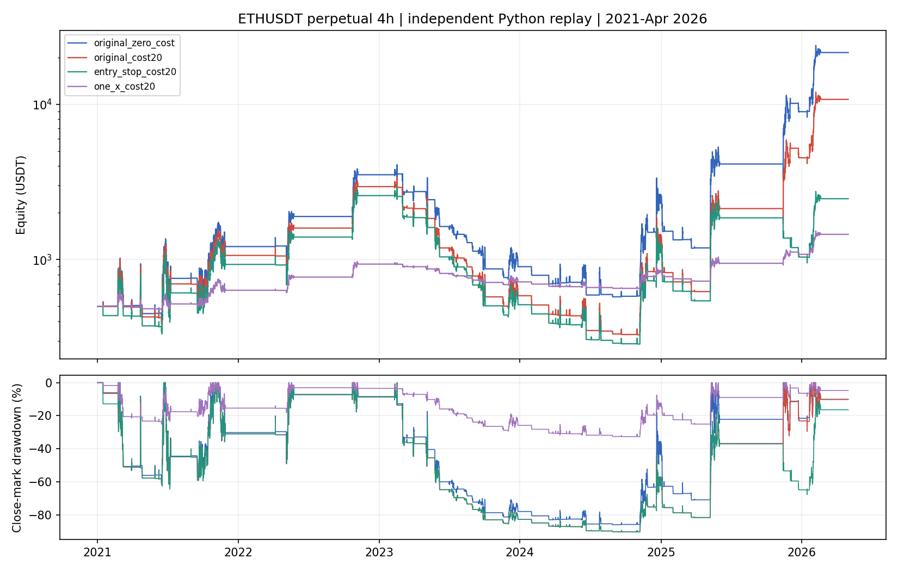

# ALLIN V7：ETHUSDT 永续 4H 原码回放

生成时间：2026-09-07T11:02:27.181487+00:00。这是独立 Python 历史回放，尚未与 TradingView 原生交易清单逐笔对齐。

## 主要结果

币安 ETHUSDT 永续，2021-01-01 至 2026-04-30，初始 500 USDT。
原版零成本权益收益 4208.73%；按每边 0.1% 名义手续费计算后 2050.94%，
原版计成本资金曲线路径回撤 91.66%，已平仓 69 笔。
仅让初始止损从成交首根生效，权益收益变为 393.37%；仅改固定 1 倍则为 190.77%。
这些是预先冻结的单变量检查，没有调参择优。
原版计成本的净盈利交易只有 14.49%；最大 5 笔盈利占全部正盈利金额 89.73%。
2023 年权益亏损约 80.17%，所以累计盈利不能解释成各年稳定。2026 年只含 1–4 月。

## 数据与复现范围

- 数据来自 Binance 官方 USD-M 月度公开档案，本机只读，SHA256 07013f996a13a0b205f9df6df2af5deab5d601e7e34b42bfc308dc13aef400bd。
- 原始 15m 221952 根，聚合 4h 13872 根；每组恰好 16 根、时间连续、无缺口，普通 OHLC。
- 2020 年只作指标预热；连续资金账户从 2021 年开始。另从 2025 年空仓、500 USDT、冷却清零重新启动，检验起点敏感性。
- 2026-05-01 起没有进入数据；仓库 holdout 从 2026-05-04 起，本配置消耗次数为 0。没有训练、特征选择或部署。
- 连续期原始 V7 候选 119，日历和波动过滤后 117；单纯交叉 293。
- 正类定义为已平仓净收益 >0；正类率即表中净胜率。AUC 用 abs(osc) 作诊断分数，没有训练出的概率。
- 2025 年以后是事先划定的后段诊断，不宣称此前没有被人看过，也不算独立最终验证。

## 连续资金结果及同币随机对照

| 版本 | 权益收益% | 路径回撤% | 平仓笔数 | 净胜率% | 资金PF | 每笔净bp | 匹配病例净bp | 随机净bp | 配对超额bp |
| --- | --- | --- | --- | --- | --- | --- | --- | --- | --- |
| 原版·零成本 | 4208.73 | 87.65 | 69 | 71.01 | 4.88 | 205.60 | 216.07 | -51.99 | 268.06 |
| 原版·计成本 | 2050.94 | 91.66 | 69 | 14.49 | 3.42 | 185.61 | 196.07 | -71.94 | 268.01 |
| 仅提前首根止损·计成本 | 393.37 | 91.69 | 73 | 12.33 | 1.49 | 137.25 | 145.76 | -72.08 | 217.85 |
| 仅改固定1倍·计成本 | 190.77 | 34.47 | 69 | 14.49 | 2.97 | 185.61 | 196.07 | -71.94 | 268.01 |
| 仅改均线交叉·计成本 | -92.12 | 97.21 | 221 | 11.31 | 0.87 | 22.61 | 20.70 | -47.98 | 68.68 |

权益包含末端未平仓浮盈亏；胜率、PF、每笔均值只含已平仓交易。资金 PF 按实际美元盈亏计算；与不加仓权重的每笔 PF 可不同。
路径回撤依照 4h OHLC 的开盘接近极值顺序记账，是模型内回撤，不是逐笔市场实测或 TradingView 同定义复刻。
bp 为万分之一。随机对照每个事件独立入场，不能把这些重叠事件的均值当成可交易组合收益。

## 2025 年重新启动账户

| 版本 | 权益收益% | 路径回撤% | 平仓笔数 | 净胜率% | 资金PF | 每笔净bp | 匹配病例净bp | 随机净bp | 配对超额bp |
| --- | --- | --- | --- | --- | --- | --- | --- | --- | --- |
| 原版·零成本 | 1320.21 | 44.10 | 12 | 75.00 | 13.82 | 628.20 | 628.20 | 45.57 | 582.63 |
| 原版·计成本 | 1199.24 | 45.34 | 12 | 25.00 | 11.83 | 608.47 | 608.47 | 25.70 | 582.77 |
| 仅提前首根止损·计成本 | 241.86 | 61.80 | 15 | 13.33 | 2.73 | 322.34 | 322.34 | 13.58 | 308.75 |
| 仅改固定1倍·计成本 | 87.05 | 15.57 | 12 | 25.00 | 8.52 | 608.47 | 608.47 | 25.70 | 582.77 |
| 仅改均线交叉·计成本 | -94.29 | 96.64 | 68 | 7.35 | 0.37 | -63.06 | -63.89 | -56.60 | -7.29 |

## 原版计成本的逐年表现

| 年份 | 年内权益收益% | 当年入场已平仓数 | 每笔净bp | 随机净bp | 配对超额bp |
| --- | --- | --- | --- | --- | --- |
| 2021 | 112.72 | 14 | 195.82 | -86.19 | 297.84 |
| 2022 | 177.34 | 4 | 1092.96 | -202.09 | 1765.93 |
| 2023 | -80.17 | 22 | -117.34 | -113.53 | -3.81 |
| 2024 | 144.34 | 17 | 57.26 | -53.19 | 110.45 |
| 2025 | 216.51 | 10 | 384.56 | -74.21 | 458.77 |
| 2026 | 137.69 | 2 | 1728.03 | 525.26 | 1202.77 |

年度权益包含跨年持仓的盯市变化；交易统计按入场年份归属且可跨年退出，因此两列不强求会计相等。

## 原版计成本的多空分解

| 方向 | 笔数 | 净胜率% | 每笔净bp | 匹配病例净bp | 随机净bp | 配对超额bp |
| --- | --- | --- | --- | --- | --- | --- |
| 空 | 33 | 15.15 | 196.72 | 203.18 | -21.43 | 224.61 |
| 多 | 36 | 13.89 | 175.42 | 189.57 | -118.13 | 307.69 |

## 排序与对照检验

| 窗口 | AUC | 前10%笔数 | 前10%毛bp | 前10%净bp | 前10%随机净bp | 前10%配对超额bp | 排序p | 月簇配对p |
| --- | --- | --- | --- | --- | --- | --- | --- | --- |
| continuous_2021_2026apr | 0.44 | 7 | 274.72 | 254.43 | 51.11 | 203.32 | 0.3859 | 0.0023 |
| reset_2025_2026apr | 0.41 | 2 | 10.00 | -9.99 | -113.43 | 103.44 | 0.4881 | 0.0939 |

上表仅针对原版计成本。原策略交易全部合格交叉，没有前 10% 选单规则；不能用该诊断倒推重新筛选交易。
详细 p 值保留在 summary.json，表中 p 值保留四位小数，其他指标保留两位。全程匹配病例 67/69，后段 12/12；各版本覆盖率另见 summary.csv。
匹配同币、UTC 月份、香港 6 小时时间块、因果 ATR% 五分位、同方向，排除距病例信号 12 根以内；候选按固定哈希顺序选最多 3 个。
对照用自己的入场价和 ATR、相同止损/保本/原始信号退出规则和成本，独立空仓状态启动；没有复制病例实现后的持有期限。
冷却路径依赖于各自账户历史，独立事件对照不复制主账户先前盈利造成的计数；这是解释边界。
缺匹配和未闭合事件保留在 ledgers/summary，不把它们当作零收益。配对 p 使用月度簇符号翻转，10,000 次，未修正全部探索比较的多重检验。

## 执行语义核对

独立复核 62/62 项通过，包含两边手续费、总账权益、信号时仓位、下一根开盘价格及精确对照分层。原版计成本有 4 笔交易在未挂止损的入场首根已经触及原定止损，其中 1 笔后来盈利。首轮矩阵乘法出现浮点警告，改用逐项求和核对后 p 值不变；原始交易、账户和费用结果均未重跑。

- 历史信号在收盘计算、下一根开盘成交；初始止损价格锚定信号 close，并按原码延后提交。修正分支只改变初始止损生效时点。
- 保本门槛严格 >1.5%，锁定价格变化 0.1%；收盘更新只能影响后续价格，不能在同根历史 K 线上追溯成交。
- 保留原码先求 is_cooling_down 再更新计数的顺序；同向信号虽不加仓仍重置共享 sl_price；反向信号先修改共享止损再翻仓。
- 日历禁入和周日用 UTC；周四仓位倍增用 UTC+8。UTC 对齐 4h 开盘小时不落在 3 点或 21–22 点，所以凌晨加成与小时禁入没有触发。
- 原版平时约 4 倍、香港周四约 8 倍；每次按信号收盘权益和价格计算数量。13 倍只是上限，本次时间格不会达到。
- 相反方向 strategy.entry、旧仓 strategy.exit、strategy.close 在同一时刻的队列，采用合并反向成交模型；未验证原生交易清单的一致性。
- 无限保证金假设沿用 Pine v5 原码未指定保证金的口径；若路径权益 <=0 会显式标记，不能把这样的收益解释为可执行。

## 风险与诚实声明

- 没有运行 TradingView Pine 编译器；这份结果是代码语义的 Python 复现，不是原生策略测试器导出。截图使用的交易所、回测窗口和属性仍可能不同。
- 费用为每边成交额的 0.1%，名义往返 0.2%；没有另外添加滑点或永续资金费，也没有模拟交易所强平、最低数量、数量步长、价格取整。
- calc_on_every_tick 只在实时执行能看到盘中信号，此次复现历史收盘行为；不等同于实时警报绩效。
- 原码 strategy() 的 alert_message 属于声明语法疑点；实际 TV 使用版本仍需核对。可视化和警报文字没有参与收益计算。
- 旧 V7 的 15m、多币种、修正执行结果不是本次 4h 原码的可比上一版本，所以没有拼接成同口径历史基线；本次五行在同数据同窗口对照。
- 交易可能集中在少数大行情。单一品种、重复使用历史、随机对照重叠及未做原生对齐，均限制盈利证据强度。

## 资金曲线



## 复现命令

```bash
cd /Users/zhangzc/fable-trading
.venv/bin/python -m pytest tests/test_pine_allin_eth4h.py -q
.venv/bin/python -m yoyo.evaluation.pine_allin_eth4h_replay
.venv/bin/python -m yoyo.evaluation.pine_allin_eth4h_verify
.venv/bin/python scripts/md_to_html.py analysis/p0_pine_allin_eth4h_20260907.md --out-dir analysis/html
```

先具备源 CSV 并核对固定 SHA256；来源文档与逐月下载校验收据在 data/kline_preholdout_binance_um15m/audits/ETHUSDT.json。
结果目录保留各窗口/版本交易、随机对照、权益曲线、状态事件、源码和数据哈希及验证收据。重复执行禁止覆盖现有结果，应先另行归档并注册新运行。

## 下一步

先核对 TradingView 同交易所、同日期、同佣金和计算设置的逐笔交易。确认原生一致性后再讨论是否继续；新的调参或 holdout 检验需要单独决策。本次不改原策略，不推进实盘。

来源：[TradingView 策略执行规则](https://www.tradingview.com/pine-script-docs/v5/concepts/strategies/)、[Pine 时间语义](https://www.tradingview.com/pine-script-docs/v5/concepts/time/)、[Binance 官方公开数据](https://github.com/binance/binance-public-data)。
