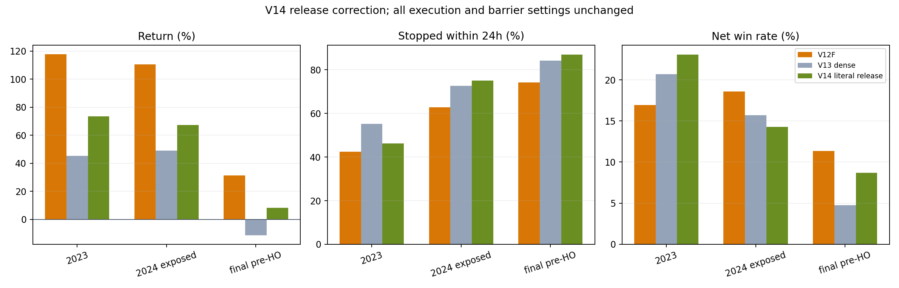
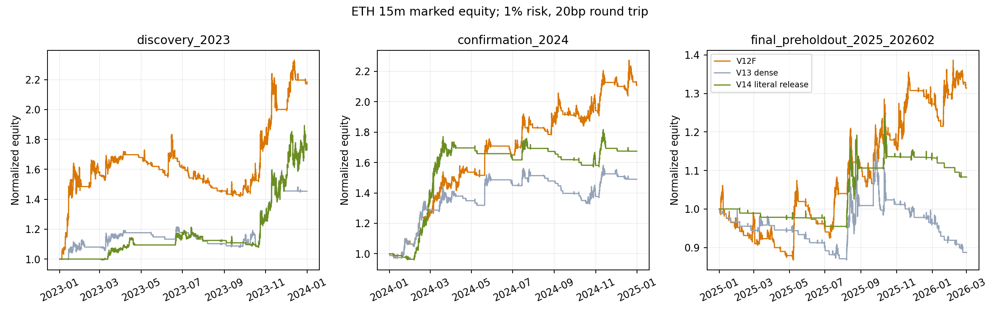

# ETH 15m Pine：六线密集启动 V13 / 真实释放 V14 优化报告（2026-08-21）

> **结论先行**：已把 Owner 批准的“六线密集 → ATR 压缩 → 净方向/排序 → 价格与波幅释放”
> 完整落实到 Pine 和因果 Python replay，并生成两版 15 分钟 paper 脚本。**V13 与 V14 均未通过
> 验收，不得替换、promote 或部署。** V13 在 final-preholdout 为 **-11.29% / DD 23.07% / 胜率
> 4.76%**；把释放改为真实 `TR[t]/ATR[t-1]` 与突破距离扩张后，V14 修复到 **+8.30% / DD
> 12.96% / 胜率 8.70%**，但仍弱于 V12F 的 **+31.41% / DD 18.22% / 胜率 11.34%**，且
> V14 同段匹配随机入场超额为 **-108.70bp/笔**、8 个匹配分配种子全部为负。

> **为什么胜率低已经定位**：不是止损代码失效，而是这个趋势系统靠极少数多日 runner 支付大量
> 小止损。final-preholdout 中，V12F/V13/V14 分别为 `11/97`、`3/63`、`2/23` 笔盈利；平均盈利
> 分别约 `+13.21%/+10.78%/+13.73%`，平均亏损约 `-1.04%/-1.05%/-1.19%`。V13 的硬密集门
> 没有减少假启动，反而删除了多笔真正趋势尾部。因此下一步应把这些特征交给判断层做条件概率/效用
> 判断，而不是继续向 Pine 信号堆硬 `AND`。

## 一、实际交付

### Pine paper 脚本

| 版本 | 唯一研究改动 | SHA-256 | 裁决 |
|---|---|---|---|
| V13D `dense_l1` | 15 对总交叉密集 + 六线跨度/ATR + 12 对净方向/排序 + 当前突破/斜率/ATR 释放，full-state gate | `370f4a53174cbb4b24f22c29b69aced7e534b582df4ee5f8ce4086d1d0b3a570` | rejected；paper only |
| V14R | V13 setup 不动；只把释放收紧为 `TR[t]/ATR[t-1] >= 1` 且方向突破距离继续扩大 | `65f8d6ab17334e33767ac34b3f6e3efbd563fbf5467ceffde1dff35a0eb8094d` | rejected；低回撤组件，paper only |

文件：

- `experiments/active/exp-pine-eth-15m-dense-start-v1/pine/allin_eth_15m_v13d_dense_start_dense_l1_paper.pine`；
- `experiments/active/exp-pine-eth-15m-dense-release-v2/pine/allin_eth_15m_v14r_dense_release_paper.pine`。

两版都硬锁 `timeframe.in_seconds() == 900` 与 ETH base；没有 `request.security`、lookahead 或未来
特征。信号只在确认 bar `t` 判断，订单在 `t+1` open。ATR4/3% 初始止损、1.5%/0.1%
break-even、1% risk、13x cap、20bp 成本、cooldown、反转与 calendar 全部沿用 V9/V12F。

### 逐笔与研究产物

V13 目录包含 1,022 行版本化交易、3,393 行匹配 controls、1,131 行候选-control pairs 和 661 行
无未来标签的判断层特征。V14 目录包含 684 行版本化交易、2,052 行 controls、684 行 pairs 和同一
661 个原始候选的 release-v2 特征。CSV 包含半年与年度重叠视图，因此不能把总行数当独立交易数；
三个互不重叠主区间的 V13 比较账本是 645 行，V14 比较账本是 433 行。

关键文件 hash：

| 文件 | 行数 | SHA-256 |
|---|---:|---|
| V13 trades | 1,022 | `6b699e54440dd7f8009394b36e6eb788d9cae8c9fb2fa9537b34f86d75247180` |
| V13 controls | 3,393 | `c69d320136bed19c1bb245e2546cf7eddf0abe1232b3a8142a517dc0ef68fb56` |
| V13 feature rows | 661 | `6b92e2363b2e78a91863dbbb263caca8fdba09e971bc1eac299757c261e962db` |
| V14 trades | 684 | `8d35e310099cadca73bed309f9c798b9586d7e76253597ea33ac8d682db8fa26` |
| V14 controls | 2,052 | `aaec3c3c11b8486c3347f6a5c294caeff8890c6a42422c499e5a94537149956e` |
| V14 feature rows | 661 | `078da4aaa2efc6fe65068968f93e8164abcd41214d9d11b277d550ec0ae86b0b` |

## 二、六线因子的精确定义

六条 close-derived 均线固定为：

`SMA20, EMA20, SMA60, EMA60, SMA120, EMA120`。

### 1. 密集

所有六线共有 15 个无序 pair。对每个 pair，只要它在相邻两根发生次序翻转，就记一次事件。
决策 bar 为 `t` 时，密集统计严格使用 `[t-12, t-1]`，不把释放 bar `t` 自己的交叉算进 setup：

`pre_pairwise_cross_count = sum(all 15 pair flips over [t-12,t-1])`。

这修复了 V12F 的核心语义问题：V12F 只要求方向净交叉 `>=0`，所以最近完全没有交叉也会通过；
V13 最低要求至少 1–3 次总交叉。

### 2. 压缩

每根计算：

`bandwidth_atr = (max(six MA) - min(six MA)) / Pine_ATR14`。

gate 使用 `[t-12,t-1]` 的均值，profile 上限从 3.5 逐级收紧到 2.0。这里使用 replay 已有的
Pine/Wilder ATR，不调用项目另一套 warmup 语义，避免两个 ATR 实现漂移。

### 3. 方向与排序

同周期 SMA/EMA 没有天然快慢方向，因此方向只使用 12 个跨周期 pair：

- 20 × 60，共 4 个 SMA/EMA 组合；
- 20 × 120，共 4 个；
- 60 × 120，共 4 个。

多头方向值为前 12 根金叉数减死叉数，空头对称；当前排序一致性为 12 个 fast/slow 关系中与方向
一致的数量。额外导出总交叉 breadth、排序熵、方向/反方向交叉数等连续特征，但没有训练 LR。

### 4. 释放

V13 要求 close 已在六线绳外、六线方向平均斜率为正，并满足“斜率一致性或 ATR 相对过去 8 根
扩张”。这个条件在实测中过弱。

V14 只改变释放：

```text
TR[t] = max(high[t]-low[t], |high[t]-close[t-1]|, |low[t]-close[t-1]|)
range_release = TR[t] / ATR14[t-1] >= 1.0
distance_release = side_distance[t] - side_distance[t-1] > 0
```

其中多头 `side_distance=(close-rope_upper)/ATR`，空头对称。它明确要求当前确认 K 线真的扩张并
把价格推得更远，而不是均线自身移动制造“突破”。

## 三、数据、时序与预注册纪律

- 有界读取 145,666 根 OKX ETH-USDT-SWAP 15m bar，范围
  `2022-01-03T15:30:00Z` 至 `2026-02-28T23:45:00Z`；
- bounded-prefix SHA-256：
  `17f091b5e9b88f35feb5560c5a774a9277a21b64444d6ee2ea963cfacfc09159`；
- 重复时间、空 OHLCV、非 15m 间隔、OHLC 约束错误均为 0；
- V13 profile 只在 2023H1/H2 选择；2024 只在 profile 锁定后评价；
- final-preholdout `2025-01-01` 至 `2026-03-01` 已被该研究家族看过，只能描述，不能称新 OOS；
- 本轮两次 replay 均为 `holdout_rows_read=0`，没有读取、哈希、绘图或评分 `>=2026-05-04` 的
  repository holdout；
- predecessor V12F 已经完成一次 Owner 批准的最近半年 holdout 消耗且严格失败，不能把这次新
  feature 再放进去择优。V12F 的既有 holdout 裁决是全段 `-3.46% / DD 24.74%`，本报告不改变它；
- OKX swap 只是研究 proxy，不能自动等同于 TradingView 未指定 venue 的 `ETHUSDT.P`。

661 个 guarded V9 原始候选按互不重叠主区间为 2023/2024/final 各 167/168/168 个。V13 `dense_l1`
通过 57/81/80 个（34.13%/48.21%/47.62%）；V14 通过 21/37/28 个
（12.57%/22.02%/16.67%）。pass rate 随时间漂移本身就是警告：一个固定“密集”定义没有保持固定
选择强度。

## 四、V13 profile 只在 2023 的选择结果

预注册四个有序 strictness profiles，必须每个 2023 半年不少于 10 笔；排序依次看最差半年复利
收益、最差半年净 bp/笔、最差胜率、最大 DD、最后偏好较松 profile。

| Profile | 2023H1 交易/收益/胜率 | 2023H2 交易/收益/胜率 | 最差半年净 bp/笔 | 匹配超额 H1/H2 | 资格 | 选择 |
|---|---|---:|---:|---:|---|---|
| L0 | 13 / +12.73% / 30.77% | 26 / +19.61% / 15.38% | +51.76 | +306.63 / -17.57 | pass | 否 |
| L1 | 12 / +17.70% / 33.33% | 17 / +23.52% / 11.76% | **+97.25** | +176.36 / +44.75 | pass | **是** |
| L2 | 12 / +3.99% / 16.67% | 12 / +0.24% / 8.33% | -10.52 | +119.35 / -67.22 | pass | 否 |
| L3 | 9 / +10.07% / 22.22% | 8 / -6.51% / 0% | -62.74 | +215.38 / -75.10 | fail 样本数 | 否 |

严格度不是单调改善：L2/L3 在开发期已经明显变坏。L1 是按预注册规则唯一锁定版本，而不是看到
2024/final 后挑出来的最好点。

## 五、主回测结果

共同条件：15m、next-open、20bp、初始本金 500、每单 1% stop-risk、最大 13x、ATR4/3% stop、
原 break-even/cooldown/full-state reversal。收益为动态仓位状态下的复利账户收益，DD 为 15m
mark-to-market 最大回撤。

| 区间 | 版本 | 交易 | 收益 | DD | 胜率 | PF | 净 bp/笔 | 24h 内止损率 |
|---|---|---:|---:|---:|---:|---:|---:|---:|
| 2023 开发 | V12F | 59 | **+117.84%** | 22.55% | 16.95% | 3.353 | +119.21 | **42.37%** |
| 2023 开发 | V13 dense | 29 | +45.37% | **13.22%** | 20.69% | 3.127 | +190.43 | 55.17% |
| 2023 开发 | V14 release | 13 | +73.54% | 14.36% | **23.08%** | **13.919** | **+520.27** | 46.15% |
| 2024 已暴露验证 | V12F | 70 | **+110.61%** | **10.49%** | **18.57%** | 3.160 | +179.15 | **62.86%** |
| 2024 已暴露验证 | V13 dense | 51 | +48.97% | 15.02% | 15.69% | 2.203 | +122.56 | 72.55% |
| 2024 已暴露验证 | V14 release | 28 | +67.41% | 11.29% | 14.29% | **3.357** | **+273.45** | 75.00% |
| 2025-01～2026-02 | V12F | 97 | **+31.41%** | 18.22% | **11.34%** | 1.589 | **+57.63** | **74.23%** |
| 2025-01～2026-02 | V13 dense | 63 | -11.29% | 23.07% | 4.76% | 0.629 | -48.56 | 84.13% |
| 2025-01～2026-02 | V14 release | 23 | +8.30% | **12.96%** | 8.70% | **1.748** | +11.08 | 86.96% |

V14 对 V13 的单变量释放修正是有效的路径修复：final 收益 +19.59 个百分点、DD -10.12 个百分点，
且保留了两笔多日赢家；但它没有完成最初机制目标，因为短期止损率不降反升。它是“更少交易、靠
少数 runner”的风险路径组件，不是已证明的入场质量因子。





## 六、胜率为什么仍然这么低

### 1. 出场结构决定了“多数小亏、少数大赚”

final-preholdout：

| 版本 | 盈利笔数/总笔数 | 平均盈利 | 平均亏损 | 平均盈亏幅度比 |
|---|---:|---:|---:|---:|
| V12F | 11/97 | +13.21% | -1.04% | 12.71:1 |
| V13 | 3/63 | +10.78% | -1.05% | 10.28:1 |
| V14 | 2/23 | +13.73% | -1.19% | 11.57:1 |

没有常规固定小 TP；成功单通常一直持有到反向信号或 period end。V13 final 的 3 笔赢家全部由
reverse 退出，平均约 +10.78%；60 笔 stop 全部净亏。V14 是 2 笔 reverse 赢家对 21 笔 stop。
因此仅机械追求 50% 胜率会破坏策略本质，但从 11.34% 掉到 4.76% 显然不是“趋势策略正常”，而是
过滤器失效。

### 2. 硬 gate 删除了真正的收益尾部

V13 相对 V12F 在 final 动态路径上错过的盈利趋势包括：

| V12F 入场 | 方向 | 毛收益 | 持有 bars | 被 V13 拒绝的主要特征 |
|---|---|---:|---:|---|
| 2025-05-08 | long | +38.64% | 747 | 当前排序仅 2/12 |
| 2025-07-10 | long | +26.65% | 1,300 | prior 平均带宽 3.49 ATR，超过 L1 |
| 2025-11-03 | short | +25.82% | 1,993 | 净交叉 -2，低于 L1 |
| 2025-08-08 | long | +12.60% | 761 | 带宽 4.72 ATR、ATR release <1 |
| 2026-02-04 | short | +11.67% | 1,671 | 只有 1 次总交叉 |

早期趋势本来就可能尚未完成 120 周期均线重排；把“当前绝对排序很一致”设为必要条件，会把最早的
启动误判为不合格。反过来，六线已经全部同向且价格在绳外，也可能只是延伸末端，仍然会止损。

### 3. 当前 dense score 没有排序能力

V13/V14 的连续 score 只是透明等权诊断，不是训练模型。V14 final 的盈利 AUC 为 0.381，top-decile
净值 `-159.17bp/笔`，置换 `p=0.7694`；压缩单特征 top-decile 也为 `-113.33bp/笔`，
`p=0.7044`。因此不能说“分数高的 dense start 更值得做”。

## 七、匹配随机对照

对照匹配 ETH × UTC 月 × 香港 6 小时块 × **前一个月** ATR 五分位，复制候选方向、持仓 horizon、
止损/BE 与 20bp 成本；每笔 3 个不复用 controls。`p` 为 UTC 周区块单侧 sign-flip。

| 区间 | 版本 | 候选净 bp/笔 | 对照净 bp/笔 | 候选−对照 | p |
|---|---|---:|---:|---:|---:|
| 2023 | V12F | +119.21 | +79.38 | +39.83 | 0.1056 |
| 2023 | V13 | +190.43 | -17.18 | +207.61 | 0.0317 |
| 2023 | V14 | +520.27 | +16.92 | +503.35 | 0.0352 |
| 2024 | V12F | +179.15 | +35.96 | +143.19 | **0.0080** |
| 2024 | V13 | +122.56 | +28.71 | +93.85 | 0.1201 |
| 2024 | V14 | +273.45 | +240.47 | +32.97 | 0.2280 |
| final-preholdout | V12F | +57.63 | +42.09 | +15.54 | 0.3268 |
| final-preholdout | V13 | -48.56 | +0.97 | -49.53 | 0.9944 |
| final-preholdout | V14 | +11.08 | +119.78 | **-108.70** | 0.9219 |

V14 的 control assignment sensitivity 在 2023/2024 各 8/8 个种子为正，但 final 的 8/8 全负，
范围约 `-134.74` 至 `-3.45bp/笔`。这不是一次随机配对碰巧不好，而是该时间段选择池真实落后于
同环境随机入场。

## 八、AUC、top-decile 与单特征基线

项目要求 top-decile 扣成本后为正且置换 `p<0.01`，同时必须带单特征基线。下表为 V14：

| 区间 | 盈利 AUC | composite top 10% 净 bp/笔 | composite p | compression-only top 10% | compression p |
|---|---:|---:|---:|---:|---:|
| 2023 | 0.400 | -100.23 | 0.7824 | -100.23 | 0.7807 |
| 2024 | 0.573 | -226.53 | 0.9515 | -179.93 | 0.8410 |
| final-preholdout | 0.381 | -159.17 | 0.7694 | -113.33 | 0.7044 |

三段全部失败。这里没有 AUC 突然高得异常的问题；相反，结果清楚表明等权规则不能替代真正的判断
层。池内排序与匹配随机对照分别检验“池内顺序”和“池本身是否优于随机”，两者都必须看。

## 九、能不能接项目 LR 判断层

**特征已经能接，当前不能训练。** 本轮导出的每个 raw candidate 都有：

- 前 12 根 15 对总交叉数、breadth；
- 六线 bandwidth/ATR 均值与最大值；
- 方向交叉、反向交叉、净交叉；
- 当前 12 对排序一致性与方向排序熵；
- close 到六线绳外的 ATR 距离；
- 六线方向斜率一致性、平均斜率；
- ATR release ratio；
- `TR[t]/ATR[t-1]`、prior distance 与 breakout expansion；
- V13/V14 透明诊断 score。

这些特征均在 `t` 可见，`future_feature_bars=0`。但项目当前 P0/P1 明确禁止新 LR/LightGBM 训练，
`models/active_bundle.json` 也不存在，生产路径 fail-closed 为 0 模型。因此本轮只交 feature contract
与 CSV，所有行 `training_eligible=false`。

真正合理的 L2 不应学习“是否满足所有硬条件”，而应至少拆成两个目标：

1. `early_failure_probability`：未来 96 根内是否 stop；
2. `runner_probability / expected_net_utility`：在原动态状态契约下是否成为多日、高盈亏比 runner。

然后由 L2 输出三种状态，而不是一个粗暴布尔：允许开仓、拒绝新开但保留旧仓、允许反向关闭。否则
模型判断会和 full-state cooldown/reversal 语义纠缠。训练时必须时间切分、每 fold 重建动态 replay，
并用同币同时间块同前月波动桶随机入场作外部对照；AUC 只能参考，经济门仍是 top-decile 净收益、
`p<0.01` 与 matched-control excess。

## 十、Luna Max 独立复核

可见本机 Codex 任务 `01a02379-1c18-78a0-990b-9219510e65d0` 明确使用
`gpt-5.6-luna + thinking=max`，只读且不碰 holdout。它在 V13 replay 结果出来前完成复核，确认：

- V12F 只有净方向，没有总交叉，零交叉也能通过；
- 同周期 SMA/EMA 只能进入 15 对无方向密集，不能伪造金叉/死叉方向；
- spread 应使用 ATR 单位；
- 释放应使用确认 bar 的真实 TR/前一 ATR 与 prior-vs-current rope 距离；
- full-state gate 必须动态 replay，不能静态删除旧 trades；
- 2023 选、2024 锁定验证、final-preholdout 只描述，repository holdout 本轮不读。

V14 正是把复核中唯一未进入 V13 的“真实 release”作为单变量修正；因此不是看到 final 亏损后扫描
release 阈值。即使如此，2024/final 已有 analyst exposure，报告仍不冒充独立 OOS。

## 十一、测试与实现审计

专项测试覆盖：

- formation `[t-12,t-1]` 排除释放 bar；
- 改变未来 K 线不改变任何过去 dense/release 特征；
- 15 对总交叉、12 对有方向交叉；
- density/compression/direction/release 任一失败均 fail-closed；
- Pine 15m guard、固定 ATR4/3% stop、BE、成本、仓位、full-state 状态语义；
- V14 `TR[t]/ATR[t-1]` 与 prior/current rope distance；
- 安全区间全部早于 holdout。

本轮专项组合先后为 `18 passed` 与 `16 passed`；项目 `.venv` 下再运行本轮测试、layer imports、
causality 与 parity 共 **374 passed**。扩大到当前系统 Python 的 boundary/causality/parity 集合为
**476 passed / 4 skipped / 3 failed**；3 个失败全部是当前安装版本与已由其他工作修改的
`constraints-ci.txt` 不一致：`fastapi 0.128.0 != 0.128.8`、
`opencv-python 4.12.0.88 != 5.0.0.93`、`pyyaml 5.3.1 != 6.0.3`。本轮没有修改依赖锁或安装包来
掩盖环境漂移。新 Pine 由严格字符串生成器构建，能发现源代码漂移；但没有运行 TradingView 官方
编译器，也没有 trade export parity，因此 `official_tradingview_parity_passed=false`。

## 十二、风险与诚实声明

- **V13/V14 都 rejected**；V14 回撤较低不等于可用，绝不替换 ACTIVE、frozen 或实盘路径。
- 2024 与 final-preholdout 都已被分析者看过；V14 是固定公式的 robustness check，不是 unseen OOS。
- predecessor V12F 的正式最近半年 holdout 已失败且不可复用；本轮没有给新配置看 holdout。
- 收益高度依赖少数多日 runner；V14 2023 有一笔 period-end +41.75% 净收益，点估计对终点敏感。
- 动态 full-state gate 会改变反转、持仓时长与 cooldown，不能从旧 CSV 静态过滤得到同一结果。
- 20bp 已扣，但滑点、资金费、强平、最小下单量和 exchange-specific liquidation 未进入 replay。
- OKX proxy 与 TradingView venue 未做 bar-by-bar parity；新 Pine 未通过官方 trade-export parity。
- 没有训练/评分 LR 或 LightGBM，没有 promote、deploy、ACTIVE 切换、forward_log 写入或真金操作。

## 十三、当前裁决与下一步

1. **当前没有通过统计与 holdout 门的 Pine。** V12F 只保留为冻结历史 comparator；V13/V14 均
   rejected，V14 仅作为未来 L2 的 release 特征来源。
2. **停止继续堆硬门。** 两轮已证明更严格的形态描述没有降低假启动，反而删除 runner 尾部。
3. **等 P0/P1 允许后再做 L2。** 使用本轮 661 行 feature interface 扩展真正训练集，但不能把这
   661 行及已看过区间冒充 Gold/OOS；目标应拆 early-failure 与 runner utility。
4. **最终只认新的前向样本。** 任何未来 LR/规则候选都需预注册后收集全新 100 笔新鲜交易；不得
   再消费已有 repository holdout 来调 gate。
5. **若只在 TradingView 查看**，V14 可作为带完整因子的 paper 可视版本，V12F 作历史对照；两者
   都不能接真实 alerts 或仓位。

## 十四、复现命令

```bash
git branch --show-current  # 必须是 main

python3 -m pytest -q \
  tests/test_pine_dense_start.py \
  tests/test_generate_pine_eth_15m_dense_start.py \
  tests/test_research_pine_eth_15m_dense_start.py

python3 -m scripts.research_pine_eth_15m_dense_start

python3 -m pytest -q \
  tests/test_pine_dense_release.py \
  tests/test_generate_pine_eth_15m_dense_release.py

python3 -m scripts.research_pine_eth_15m_dense_release

python3 scripts/md_to_html.py \
  analysis/p0_pine_eth_15m_dense_start_release_20260821.md \
  --out-dir analysis/html
```

核心产物：

- `experiments/active/exp-pine-eth-15m-dense-start-v1/results/dense_start_summary.json`；
- `experiments/active/exp-pine-eth-15m-dense-start-v1/results/dense_start_trades.csv`；
- `experiments/active/exp-pine-eth-15m-dense-start-v1/results/dense_start_controls.csv`；
- `experiments/active/exp-pine-eth-15m-dense-start-v1/results/dense_start_pairs.csv`；
- `experiments/active/exp-pine-eth-15m-dense-start-v1/results/dense_start_feature_rows.csv`；
- `experiments/active/exp-pine-eth-15m-dense-release-v2/results/dense_release_summary.json`；
- `experiments/active/exp-pine-eth-15m-dense-release-v2/results/dense_release_trades.csv`；
- `experiments/active/exp-pine-eth-15m-dense-release-v2/results/dense_release_controls.csv`；
- `experiments/active/exp-pine-eth-15m-dense-release-v2/results/dense_release_pairs.csv`；
- `experiments/active/exp-pine-eth-15m-dense-release-v2/results/dense_release_control_sensitivity.csv`；
- `experiments/active/exp-pine-eth-15m-dense-release-v2/results/dense_release_feature_rows.csv`。
