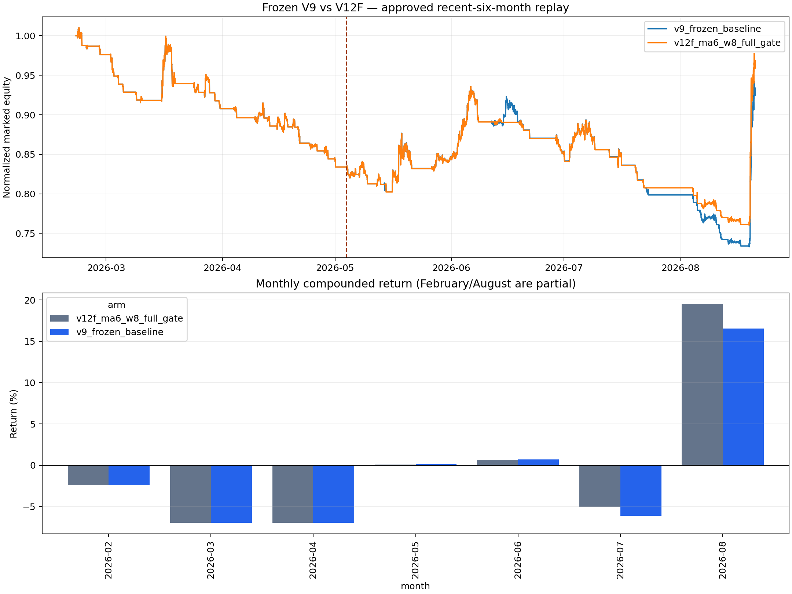

# ETH 15m Pine：V12F 失败后怎么办（2026-08-21）

## Executive Summary

- **不要再用已经看过的最近半年调 V12F 参数。** V12F 在完整半年为 `-3.46%`、PF `0.912`，严格经济门失败；继续根据这段行情改 W8、止损或阈值，只会把 holdout 变成训练集。
- **问题主要在入场质量和状态决策，不是“趋势策略胜率低”这一个表象。** V12F 完整半年 58 笔只有 5 笔盈利、52 笔止损；W8 只拒绝 94 个 guarded candidates 中的 11 个，而且没有创造新赢家。更严格的 V13/V14 和软分数硬准入 V15 又切掉了真正的多日 runner。
- **立即可做的是先完成 TradingView 逐笔 parity，再冻结前向实验；不是再挖 2023–2026。** parity 只能证明 Pine/Python 执行一致，不能证明策略赚钱，但在 parity 前继续优化会把执行误差和 alpha 问题混在一起。
- **真正的下一代方向是状态感知 L2，而不是新的 Pine `AND`。** 等 P0/P1 放行后，把“空仓开仓、同向持有、反向关闭/反手”拆成三个决策，并分别估计 early-stop 和 runner 概率。当前 166 个执行样本只有 27 个正例，不足以训练 28 特征 LightGBM；第一步只能是预注册的单特征/极小特征正则 LR。
- **“交叉前路径效率/震荡度”已按单变量协议实现并被数据淘汰。** 固定 32 根、右端 `t-1` 的高效率假设在 166 笔开发交易上 Spearman `-0.0047`、AUC `0.4991`，最高十分位 `-80.05bp/笔`、置换 `p=0.9671`。不写成硬门、不反转方向、不扫描窗口；成交量也只保留为尚未证实的 paper 对照。

## 现在的问题不是止损太宽，而是假启动无法被因果区分

完整最近半年使用 ETH-USDT-SWAP 15m、下一根开盘成交、往返 20bp、每单 1% stop-risk。V12F 相比 V9 少亏，但绝对仍失败。

| 版本 | 交易 | 收益 | 最大回撤 | 胜率 | PF | 净 bp/笔 |
|---|---:|---:|---:|---:|---:|---:|
| V9 frozen | 61 | -6.93% | 27.45% | 8.20% | 0.835 | -45.44 |
| V12F W8 full-state | 58 | -3.46% | 24.74% | 8.62% | 0.912 | -41.39 |

V12F 完整半年有 52 笔 stop、5 笔 reverse、1 笔 period-end。多空平均每笔均为负；它不是仅有某一边失效。V9/V12F 共有 56 笔交易且单笔结果相同，V12F 的改善来自路径上少做几笔较差交易、保留更多本金参加后续大趋势，不是更准确地识别赢家。

月度路径进一步表明制度依赖：2–4 月连续亏损，7 月仍亏，8 月一个大趋势才修复大部分回撤。下图只作诊断；原资金曲线文件末端有重复状态行，汇总数字已经去重，但图不能作为 TradingView 逐点 parity 证据。



## 已经试过的路为什么不能继续堆

| 路线 | 已有证据 | 裁决 |
|---|---|---|
| V12F 六线 W8 净交叉 | 相对 V9 改善，但完整半年仍亏；匹配对照不显著 | 保留历史 comparator，不生产 |
| V13 严格密集/压缩/排序 | final-preholdout `-11.29%`，误删多笔 runner | 拒绝 |
| V14 真实波幅释放 | final-preholdout `+8.30%`，仍弱于 V12F `+31.41%`，匹配超额 `-108.70bp/笔` | 拒绝 |
| V15 多速度 EWMAC/Donchian/六线软分 | 作为硬阈值后错过 `+11.47%` runner，并衍生 6 笔亏损 | 拒绝；连续特征可留给未来 L2 |
| V10 `vol_ratio_mean8 >= 1` | 三次递增回放点估计都改善，但 18-gate max-stat `p=0.5000`，且成交量跨 venue 敏感 | 只保留为预注册 paper 假设 |
| 改 break-even | 当前 +10bp 锁盈低于 20bp 成本，语义确实错误；同退出时刻的上界只改善约 `4.45bp/笔` | 应单独修正，但不能当 alpha 解法；参数变更需 Owner 批准 |

这里最重要的反证是：**更严格的形态门并没有稳定降低 24 小时内止损率，反而经常在趋势早期因为慢均线尚未完成排序而拒绝真正 runner。** 因此不能继续把六线密集、压缩、释放、EWMAC、Donchian 全部写成必须同时为真的条件。

独立只读复核又从 V12F 自身的 final-preholdout 逐笔账本核对了退出结构：97 笔中有 11 笔 reverse runner、43 笔初始止损、43 笔成本下 BE 止损；后 43 笔全部是毛 `+0.1%`、项目净 `-10bp`。这说明入场假启动与 BE 成本语义同时存在，但静态把 BE 从 `-10bp` 改记为 0 仍不足以去掉最大赢家依赖。

## 证据门仍然没有通过

### V12F 最近半年验收

| 区间 | AUC | top 10% 净 bp/笔 | top 10% 置换 p | 匹配对照超额 bp/笔 | 周区块 p |
|---|---:|---:|---:|---:|---:|
| 完整半年 | 0.487 | +136.93 | 0.1876 | -30.63 | 0.3730 |
| 纯受保护期 fresh-start | 0.404 | +456.46 | 0.1838 | +41.73 | 0.2566 |

AUC 使用原振荡器绝对值作单特征排序，只是基线诊断，不是 W8 的模型分数。纯受保护期点估计为正，但只有 30 笔、4 个赢家；去掉最大已实现赢家的机械账本诊断会由 `+15.77%` 变为约 `-8.70%`。所有 p 值远高于项目要求的 `0.01`。

### 最强单特征基线也没有获得训练资格

`vol_ratio_mean8` 是现有因果特征中最值得保留的单特征先验。其 expanding-fold 静态 top-decile 为 `+365.67bp/笔`，但只有 `3/14` 笔盈利，原始/Holm p 分别为 `0.0595/0.2380`；而且它来自更宽的 28 特征搜索，Holm 仍没有覆盖全部选择历史。它只能作为未来前向假设，不能据此宣称已经找到判断层。

## 推荐执行顺序

### 1. 先做执行一致性，不再动 alpha 参数

使用明确的 TradingView venue、15m、冻结默认值，导出 pre-holdout Strategy Tester 逐笔账本，与本地 canonical ledger 对齐。必须核对：方向、signal/entry/exit 时间、成交价、手续费和 period-end。当前 Pine 官方编译已经通过，但 trade-export parity 尚未通过。

本轮已经把 fail-closed 对账工具扩展到 V12F：V9 必须精确匹配 110 笔，V12F 必须精确匹配 97 笔；两者使用独立 canonical source 和独立输出文件。新增的 V9/V12F 精确匹配、价格/笔数不符、未知版本拒绝测试共 4 项，全部通过。该工具仍只允许 2026-03-01 前的 pre-holdout 数据，不会启动 paper、生产或 holdout 评估。

```bash
PYTHONPATH=. .venv/bin/python scripts/reconcile_pine_eth_15m_tradingview.py \
  --variant v12f \
  --input experiments/active/exp-pine-eth-15m-v1/tradingview/trades_normalized_v12f.csv
```

在 parity 前：不启用真实 alert、不发 paper order、不改 ACTIVE，也不根据 TradingView 与 Python 的收益差异临时调参。

### 2. V12F 冻结，不再回看当前 holdout

V12F 的角色改为“历史 comparator”。本次 holdout 已消费完成，后续只允许校验已有产物 hash；禁止重跑数据路径、重选 W8、交叉阈值、TBSL、ATR 倍数或 oscillator。

如果 Owner 仍希望收集 paper 数据，需要在 parity 通过后单独批准新的前向协议。风险控制建议从 `0.5%` 每单开始；这只是降低损失速度，不代表 alpha 更强。正式读数仍至少需要 100 笔新鲜交易，并报告 exact venue 的手续费、滑点和 funding。

### 3. 当前项目主线继续完成 P0/P1

P0/P1 没通过以前，仓库禁止新 LR/LightGBM 训练。先完成形态语义稳定性和 Gold Dataset 门，避免模型学习事后框、未来走势或不稳定标签。

### 4. 单变量连续特征已经执行：结果拒绝

本轮已在看收益前冻结“交叉前路径效率/震荡度”：比较固定 32 个历史价格变化的净位移与逐 bar 绝对位移总和。它满足：

- 只读取 signal bar `t` 及以前；
- lookback 在实验前冻结为 32，不扫描 final 或当前 holdout；
- 先作为连续特征记录，不写成 `efficiency > x` 的 Pine 硬门；
- 335 个 raw candidates 全覆盖、无缺失；
- 166 笔 on-policy 交易只作描述性排序诊断，不静态删除交易冒充 gate。

结果没有单调价值：Spearman `-0.0047`（`p=0.9518`）、AUC `0.4991`，高十分位只有 1/17 笔盈利，净 `-80.05bp/笔`，比全池低 `176.48bp/笔`，20,000 次置换 `p=0.9671`。因此该单特征假设拒绝；不能看结果后改成“低效率更好”或扫描新窗口。

### 5. 放行后只做一个状态感知小模型

第一版不训练 28 特征 LightGBM。路径效率已被淘汰，`vol_ratio_mean8` 也只能作为已经存在但未证实的基线，不能看结果后把它自动升为赢家。P0/P1 放行后，应重新预注册状态目标和一个极小特征合同；模型在完整动态状态机内输出：

1. 空仓是否允许开仓；
2. 已有同向仓是否继续持有；
3. 反向信号是否足以关闭或反手；
4. 未来 96 根 early-stop 概率；
5. 成为多日 runner 的概率与扣成本期望效用。

模型阈值只能在过去时间 fold 内校准；下一 fold 必须动态重放 cooldown、仓位、反转和止损。不能在现成 trade CSV 上静态删行，因为已验证静态 volume gate 会把 `50.50bp/笔` 高估成动态 replay 的 `41.22bp/笔`，入场 Jaccard 只有 `84.52%`。

## GO / NO-GO

| 动作 | 裁决 |
|---|---|
| 把 V12F promote、部署或用于真金 | **NO-GO** |
| 继续堆 V13/V14/V15 一类硬 gate | **NO-GO** |
| 用当前 holdout 调 W8、止损、BE、TBSL 或模型阈值 | **NO-GO** |
| TradingView 官方编译与 pre-holdout trade-export parity | **GO，最高优先级** |
| 交叉前路径效率单特征 | **已完成并拒绝**；不进 Pine、不进 LR |
| parity 通过后启动冻结 challenger 的新鲜 paper A/B | **条件 GO，需 Owner 单独批准** |
| 现在训练 LR/LightGBM | **NO-GO**；P0/P1 与样本容量均未通过 |

## 需要 Owner 单独决定的两件事

1. **TradingView 数据条件**：提供可以覆盖 pre-holdout 15m 区间的 Deep Backtesting/历史账本导出环境，用于正式 parity。
2. **是否批准独立 break-even 语义修正实验**：只把 offset 从 `0.1%` 改到至少覆盖 20bp 往返成本的预注册值，其他条件完全不动；该实验只能解决“名为保本、实际锁定亏损”的执行缺陷，预计不能单独把策略变成稳定正收益。

## 风险与诚实声明

- 本报告没有重新读取、哈希、绘制或评分 holdout 原始行情；数字来自已完成并登记的一次性产物。
- 最近半年不能再承担参数选择功能；任何据其表现选择的新门都属于数据泄漏式后验优化。
- 当前 OKX swap 代理不等于用户在 TradingView 上未明确 venue 的 `ETHUSDT.P`。
- 20bp 成本未覆盖所有滑点、资金费、最小下单量、盘口冲击和强平风险。
- 趋势策略低胜率可以合理，但“靠一两笔 runner 才不亏”仍代表显著路径风险；不能用高盈亏比掩盖统计不显著。
- 没有模型训练、promote、deploy、ACTIVE 切换、forward log 写入或真金操作。
- 可见本机复核任务 `01a024d3-9ca6-7800-8465-43c050920a37` 明确以 `gpt-5.6-luna`、`thinking=max` 创建，只读检查 pre-holdout 证据；它未运行 holdout replay、未改文件，GO/NO-GO 与本报告一致。

## 复核命令

以下命令只验证已经物化的 holdout 产物，不重新打开 holdout 数据：

```bash
cd /Users/zhangzc/fable-trading
python3 -m scripts.backtest_pine_eth_15m_v12f_holdout1 --verify-existing
```

查看 pre-holdout 特征与退出诊断：

```bash
jq . experiments/active/exp-pine-eth-15m-v1/results/exit_anatomy.json
jq . experiments/active/exp-pine-eth-15m-v1/results/robustness_checks.json
jq . experiments/active/exp-pine-eth-15m-v1/results/judgment_signal_audit.json
```

复核 V9/V12F TradingView 对账门：

```bash
PYTHONPATH=. .venv/bin/python -m pytest -q \
  tests/test_reconcile_pine_eth_15m_tradingview.py
```

生成本报告 HTML：

```bash
python3 scripts/md_to_html.py \
  analysis/p0_pine_eth_15m_next_action_20260821.md \
  --out-dir analysis/html
```
