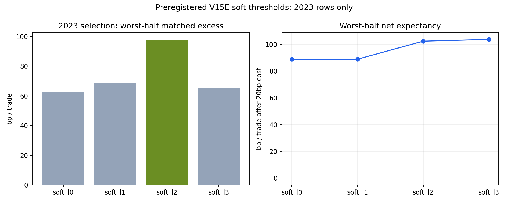
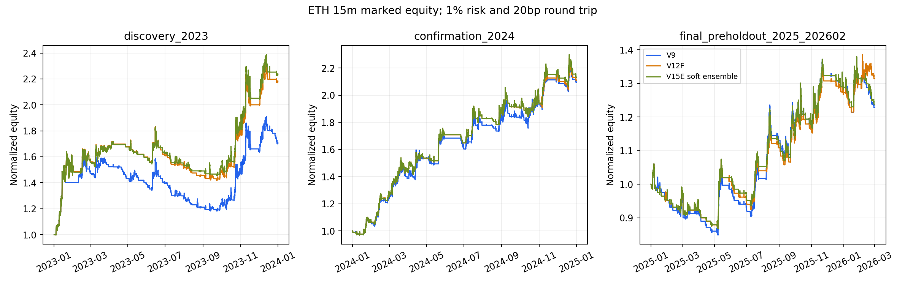
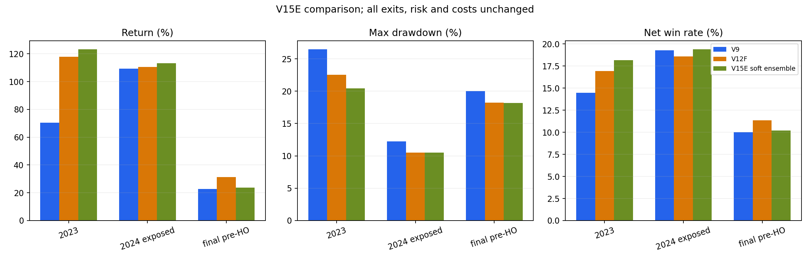

# ETH 15m Pine V15E：多速度趋势组合 + 六线软判断回测（2026-08-21）

> **技术结论**：V15E 已完整实现为固定 15 分钟、ETH、paper-only Pine，并用同一套因果
> Python 状态机完成回放。它在冻结的 V12F 候选之上加入三组 EWMAC、三组 Donchian 和六线
> 密集分数，2023 只选择一次阈值 `0.55`。**V15E 未通过验收，不得替换、promote、部署或接真实
> alerts。** 相对 V12F，V15E 在 2023/2024 收益分别提高 `+5.47/+2.56` 个百分点，最终
> pre-holdout 段却降低 `-7.56` 个百分点；三段 top-decile 置换 p 值均未达到项目要求的
> `p<0.01`，最终段 8 个随机对照分配中有 2 个为负。

> **最重要的失败原因**：`0.55` 虽然是“软分数”，一旦用于准入仍是硬否决。它拒绝了
> 2026-02-03 的一笔趋势质量 `0.5347`、最终净收益 `+11.47%` 的空头 runner；持仓路径因此改变，
> 后续又产生 6 笔 V15-only 空头，合计 `-8.33%`。所以结果不是简单“少做六笔”，而是整个反转、
> 冷却、止损路径被重写。

## 一、已交付什么

### 15 分钟 Pine paper 脚本

- 文件：`experiments/active/exp-pine-eth-15m-trend-ensemble-v1/pine/allin_eth_15m_v15e_trend_ensemble_soft_l2_paper.pine`
- Pine SHA-256：`866ed92929a59213810fe338582b53df2431cfa86906458a9be68edfcb85d243`
- 固定条件：ETH base、`timeframe.in_seconds() == 900`、`t` 收盘确认、`t+1` open 下单；
- 无 `request.security`、无 lookahead、未来特征根数为 0；
- ATR4/最大 3% 初始止损、`+1.5%` 触发 break-even、`+0.1%` offset、每单 1% stop-risk、
  13x cap、反转、cooldown、calendar 与成本全部继承 V12F；
- `commission_value=0.10%`/边，对应 20bp 往返成本；
- 未更改 TP/SL 障碍，没有训练 LR/LightGBM。

该脚本可以放进 TradingView 做 paper 编译与官方交易清单对照，但当前没有 TradingView 官方
编译与 trade-export parity 证据，因此 `official_tradingview_parity_passed=false`。

### 完整研究产物

| 产物 | 数据行/用途 | SHA-256 |
|---|---:|---|
| `trend_ensemble_summary.json` | 预注册、数据质量、全指标与裁决 | `2ba3dc11b71b10ddd81daa80d6cda2d96eea7f69cf920c346197f84ea21e49c5` |
| `trend_ensemble_trades.csv` | 1,142 行版本化逐笔交易 | `2900e1e15d3e5611ce7e0a8e104ec78c0e6a5790a31e2d5cf69784d1669437bc` |
| `trend_ensemble_controls.csv` | 4,107 行匹配随机入场 | `5cf230c7cf0b42e410f443b4e45da3420382ff93d25b301c2b58983c2228baa2` |
| `trend_ensemble_pairs.csv` | 1,369 行候选—对照配对 | `b3e4805bac28300b693f6f621deaa49ec038bd9989a8f3c6c42a663904a2a4e2` |
| `trend_ensemble_feature_rows.csv` | 559 行无未来标签特征接口 | `09ee4511cc524bca581dbd6a654aa95d85e0a0c631f7e64a358a04447bcf6c30` |
| `trend_ensemble_path_differences.csv` | 20 行 V12F-only / V15-only 路径差异 | `264147171ba107992f2ce66a601dda522c51c0ef4f1f120e2b4e1498a8f5777d` |
| `trend_ensemble_control_sensitivity.csv` | 24 行、每主区间 8 个对照分配种子 | `4ef45fdab028d342b1f437e69d9ff75d7ca89418525c578c30785b75e0e27658` |

交易 CSV 包含半年与年度重叠视图，因此 1,142 行不能理解为 1,142 个独立下单。三个互不重叠主区间、
三个版本的比较账本共 722 笔：V9 `276`、V12F `226`、V15E `220`。

## 二、V15E 到底加入了什么

V15E 不改变 V12F 的原始双均线、EMA regime、振荡器与六线 W8 净交叉候选，只对已经通过 V12F
的候选计算一个连续质量分数。

### 1. 多速度 EWMAC

三组速度为 `8/32`、`16/64`、`32/128`：

```text
ewmac(fast, slow) = tanh(((EMA_fast[t] - EMA_slow[t]) / ATR14[t]) / 2)
```

用 ATR 归一化是为了让快慢均线距离表达“相对当前波动有多大”，而不是 ETH 价格绝对点数。三组
速度分别覆盖较快启动、中段趋势和较慢趋势。

### 2. 多窗口 Donchian

窗口为 `24/48/96` 根，通道严格在 `t-1` 结束：

```text
donchian(n) =
  clip((close[t] - midpoint(highest(high[t-n:t-1]), lowest(low[t-n:t-1])))
       / prior_half_range, -1, 1)
```

它测量当前价格在过去通道中的方向位置，不把确认 K 线的 high/low 偷进通道，因此没有前视。

### 3. 六线密集因子只作 20% 软贡献

六线仍为 `SMA20/EMA20/SMA60/EMA60/SMA120/EMA120`。沿用上一轮已经因果化的总交叉次数、
带宽/ATR、方向交叉/排序、绳外距离、斜率和 ATR release，合成 `dense_start_score_side`。
这次不再要求所有 dense 条件同时为真，只把分数作为 20% 的软信息。

### 4. 最终分数

```text
trend_forecast = mean(3 个 EWMAC + 3 个 Donchian)
side_support   = (1 + side_sign * trend_forecast) / 2
trend_quality  = 0.80 * side_support + 0.20 * dense_start_score_side
```

只有已经通过 V12F W8 gate 的候选需要 `trend_quality >= 0.55`。这个设计比 V13/V14 的形态硬门
温和，但阈值本身仍会对候选作最终二元否决。

## 三、数据、时间切分与无前视

- 有界读取 145,666 根 OKX ETH-USDT-SWAP 15m bar；
- 范围 `2022-01-03T15:30:00Z` 至 `2026-02-28T23:45:00Z`；
- bounded-prefix SHA-256：
  `17f091b5e9b88f35feb5560c5a774a9277a21b64444d6ee2ea963cfacfc09159`；
- 重复时间、空 OHLCV、非 15m gap、OHLC body 约束错误均为 0；
- 2023H1/H2 只用于阈值选择；阈值锁定后才评价 2024；
- `2025-01` 至 `2026-02` 已被这一研究家族多次看过，只能叫 final-preholdout 描述段，不能冒充
  新 OOS；
- repository holdout 从 `2026-05-04` 开始，本轮读取、哈希、图表、评分的 holdout 行数全部为 0；
- 2024 与 final-preholdout 已 analyst-exposed，本轮只能提供机制与稳健性证据。

559 行特征接口覆盖 2022/2023/2024/final-preholdout 各 `125/135/147/152` 个 V12F 候选。
所有行都明确 `outcome_label_included=false`、`training_eligible=false`。

## 四、阈值只在 2023 选择一次

四个阈值全部预注册，且 2023H1/H2 各至少 10 笔才有资格。排序首先最大化两个半年中更差一半的
匹配对照超额，然后依次看更差半年净 bp/笔、收益、最大 DD，最后偏好较低阈值。

| Profile | 阈值 | 最差半年匹配超额 | 最差半年净 bp/笔 | 最差半年收益 | 最大半年 DD | 选择 |
|---|---:|---:|---:|---:|---:|---|
| soft_l0 | 0.45 | +62.65 | +88.86 | +34.83% | 13.42% | 否 |
| soft_l1 | 0.50 | +69.06 | +88.86 | +34.83% | 13.42% | 否 |
| **soft_l2** | **0.55** | **+97.82** | +102.37 | +36.86% | **12.62%** | **是** |
| soft_l3 | 0.60 | +65.35 | **+103.68** | +3.69% | 14.85% | 否 |

`0.60` 虽然最差半年每笔净值略高，但复利收益与回撤显著变差；按预注册的第一排序指标，
`0.55` 是唯一锁定结果。没有读取 2024/final 后回头挑阈值。



图中左侧显示首要选择指标，右侧显示每个阈值在较差半年扣 20bp 后的净期望。阈值提高并不产生
单调改善，说明不能继续用更严格阈值机械追高分。

## 五、主回测：开发和 2024 小幅改善，最终段退化

共同条件：15m、next-open、20bp 往返成本、初始本金 500、每单 1% stop-risk、13x cap、
ATR4/3% 初始止损、原 break-even/cooldown/full-state reversal。收益为动态仓位复利收益，
DD 为每根 15m mark-to-market 最大回撤。

| 区间 | 版本 | 交易 | 收益 | DD | 胜率 | PF | 净 bp/笔 | 24h 内止损率 | ≥10% runner |
|---|---|---:|---:|---:|---:|---:|---:|---:|---:|
| 2023 开发 | V9 | 83 | +70.50% | 26.48% | 14.46% | 1.921 | +52.01 | 57.83% | 4 |
| 2023 开发 | V12F | 59 | +117.84% | 22.55% | 16.95% | 3.353 | +119.21 | 42.37% | 4 |
| 2023 开发 | **V15E** | 55 | **+123.31%** | **20.41%** | **18.18%** | **3.671** | **+132.20** | **41.82%** | 4 |
| 2024 已暴露确认 | V9 | 83 | +109.26% | 12.22% | 19.28% | 2.748 | +141.35 | 65.06% | 7 |
| 2024 已暴露确认 | V12F | 70 | +110.61% | **10.49%** | 18.57% | 3.160 | +179.15 | 62.86% | 7 |
| 2024 已暴露确认 | **V15E** | 67 | **+113.17%** | **10.49%** | **19.40%** | **3.306** | **+191.40** | **62.69%** | 7 |
| 2025-01～2026-02 | V9 | 110 | +22.82% | 20.03% | 10.00% | 1.366 | +30.22 | 75.45% | 4 |
| 2025-01～2026-02 | **V12F** | 97 | **+31.41%** | 18.22% | **11.34%** | **1.589** | **+57.63** | **74.23%** | **5** |
| 2025-01～2026-02 | V15E | 98 | +23.84% | **18.17%** | 10.20% | 1.421 | +39.07 | 76.53% | 4 |

V15E 的确没有破坏大趋势策略的总体盈亏结构，2023/2024 的 runner 数全部保留，回撤也未高于 V12F。
但 final-preholdout 收益少 `7.56` 个百分点、胜率少 `1.14pp`、24h 内止损率多 `2.30pp`，
所以“改善入场质量”的核心目标在时间上不稳定。



资金曲线显示 2023/2024 三条路径大体同步，V15E 主要是减少局部噪声；最终段在 2026 年 2 月与
V12F 明显分叉，正是漏掉长空 runner 后形成的新路径。



分段柱状图的含义不是“V15E 普遍更好”：它只说明 2023/2024 点估计略优，而 final-preholdout 的
收益与胜率同时回落；回撤几乎相同，不能抵消收益退化和统计门失败。

## 六、为什么胜率仍低

V15E 仍是典型右偏趋势策略：大量小止损由极少数大 runner 支付。

| 区间 | 版本 | 盈利/总笔数 | 平均盈利 | 平均亏损 | 平均盈亏幅度比 |
|---|---|---:|---:|---:|---:|
| 2023 | V12F | 10/59 | +10.61% | -0.73% | 14.54:1 |
| 2023 | V15E | 10/55 | +10.59% | -0.74% | 14.36:1 |
| 2024 | V12F | 13/70 | +13.26% | -0.82% | 16.10:1 |
| 2024 | V15E | 13/67 | +13.26% | -0.82% | 16.23:1 |
| final-preholdout | V12F | 11/97 | +13.21% | -1.04% | 12.71:1 |
| final-preholdout | V15E | 10/98 | +13.38% | -1.09% | 12.33:1 |

因此不能把 50% 胜率当目标，否则会被迫加入小 TP 并截断趋势尾部。但 `10.20%` 也不是可以忽略的
问题：V15E 没有提高最终段胜率，说明 EWMAC/Donchian/六线组合仍不能稳定识别“刚启动”与“趋势
末端/震荡假突破”。

池内盈利 AUC 也支持这个结论：V15E 在 2023/2024/final 分别为
`0.433/0.615/0.448`。只有 2024 大于 0.5，跨期方向不稳定。它不是一个已经被证明的胜负分类器。

## 七、关键失败不是单笔，而是状态路径改变

用 `signal_i + direction` 比较 V12F 与 V15E 的实际动态交易：

| 区间 | 路径差异 | 笔数 | 净收益简单合计 | 盈利笔数 |
|---|---|---:|---:|---:|
| 2023 | V12F-only | 5 | -4.07% | 0 |
| 2023 | V15-only | 1 | -1.50% | 0 |
| 2024 | V12F-only | 3 | -2.83% | 0 |
| 2024 | V15-only | 0 | 0 | 0 |
| final-preholdout | V12F-only | 5 | **+9.28%** | 1 |
| final-preholdout | V15-only | 6 | **-8.33%** | 0 |

前两段 V15E 的改善有合理路径解释：它主要绕开了 V12F-only 的亏损。最终段逻辑反转：

- V12F 在 `2026-02-03 23:45 UTC` 出现 short；
- V15E 分数为 `0.534713`，仅比阈值低 `0.015287`，因此拒绝；
- V12F 下一根开仓，持有 1,671 根（约 17.4 天），reverse 退出；
- 毛收益 `+11.6707%`，扣 20bp 后 `+11.4707%`；
- V15E 没有这笔持仓保护，`2026-02-10` 至 `2026-02-20` 又开出 6 笔 short；
- 这 6 笔全部亏损，净收益简单合计 `-8.3287%`。

这也解释了为什么 V15E “过滤候选”后主区间交易数反而从 97 增至 98：过滤器改变了后续是否仍在
持仓、何时反转、何时进入冷却。任何未来判断层都必须完整 replay 状态机，禁止从旧 trades CSV
静态删行估算收益。

## 八、匹配随机对照：方向正确，但最终证据不稳

每笔交易匹配 ETH × UTC 月 × 香港 6 小时块 × 前一个月 ATR 五分位，复制方向、持仓 horizon、
止损/BE 与 20bp 成本；每笔 3 个不复用 controls。`p` 为 UTC 周区块单侧 sign-flip。

| 区间 | 版本 | 候选净 bp/笔 | 对照净 bp/笔 | 候选−对照 | sign-flip p |
|---|---|---:|---:|---:|---:|
| 2023 | V12F | +119.21 | +81.89 | +37.32 | 0.1324 |
| 2023 | V15E | +132.20 | +9.59 | **+122.61** | 0.0356 |
| 2024 | V12F | +179.15 | -17.30 | +196.45 | 0.0029 |
| 2024 | V15E | +191.40 | -9.46 | **+200.86** | 0.0024 |
| final-preholdout | V12F | +57.63 | +18.24 | +39.39 | 0.1298 |
| final-preholdout | V15E | +39.07 | +29.20 | **+9.87** | 0.2140 |

主分配下三段候选超额都为正，但 assignment sensitivity 更保守：

| 区间 | 8 个分配种子范围 | 中位数 | 正值种子 |
|---|---:|---:|---:|
| 2023 | +71.98 ～ +122.24 bp/笔 | +105.16 | 8/8 |
| 2024 | +146.09 ～ +203.44 bp/笔 | +164.98 | 8/8 |
| final-preholdout | **-26.21 ～ +53.84** bp/笔 | +25.91 | **6/8** |

因此最终段 `+9.87bp/笔` 不能被解释为稳定超额：它会随合法匹配分配变成负值，而且周区块
`p=0.2140`。

## 九、top-decile 与单因子基线：没有达到统计门

项目门要求 top 10% 扣 20bp 后为正且置换 `p<0.01`。下表所有值都在 V15E 实际交易池内计算：

| 区间 | 分数 | 盈利 AUC | top 10% 净 bp/笔 | permutation p |
|---|---|---:|---:|---:|
| 2023 | **80/20 组合** | 0.433 | +308.95 | 0.2674 |
| 2023 | trend-only | 0.436 | +271.96 | 0.2965 |
| 2023 | EWMAC-only | 0.567 | +64.73 | 0.4348 |
| 2023 | Donchian-only | 0.393 | +258.06 | 0.9943 |
| 2023 | dense-only | 0.416 | -75.49 | 0.8590 |
| 2024 | **80/20 组合** | 0.615 | +674.00 | 0.0380 |
| 2024 | trend-only | 0.623 | +372.27 | 0.2104 |
| 2024 | EWMAC-only | 0.628 | +99.74 | 0.5653 |
| 2024 | Donchian-only | 0.605 | +328.67 | 0.0282 |
| 2024 | dense-only | 0.521 | -33.60 | 0.7945 |
| final-preholdout | **80/20 组合** | 0.448 | +384.47 | 0.0489 |
| final-preholdout | trend-only | 0.431 | +393.48 | 0.0431 |
| final-preholdout | EWMAC-only | 0.566 | +240.92 | 0.1559 |
| final-preholdout | Donchian-only | 0.394 | +385.19 | 0.0491 |
| final-preholdout | dense-only | 0.514 | +263.28 | 0.1360 |

三段组合 top-decile 净值都为正，但 `p=0.2674/0.0380/0.0489`，没有一段达到 `0.01`。
高 top-decile 点估计主要由少数 runner 驱动，样本不足以证明可重复的排序能力。AUC 与收益排序也
不总一致，再次说明 AUC 只能参考，不能作生产裁决。

## 十、严格验收结果

| 预注册门 | 结果 |
|---|---|
| 三个主区间匹配随机对照超额均为正 | 通过（但 final 对种子敏感） |
| 三个主区间 top-decile 扣成本均为正 | 通过 |
| 三个主区间 top-decile 置换均 `p<0.01` | **失败** |
| 每段至少保留 V12F 一半的 ≥10% runner | 通过 |
| 每段 24h 内止损率均不恶化 | **失败** |
| 每段最大 DD 均不恶化 | 通过 |
| 全部门通过 | **失败：V15E rejected** |

V15E 只能保留为 causal feature experiment 与 TradingView paper 对照，不能替换 V12F，更不能
绕过项目当前 `models/active_bundle.json` 缺失、生产 0 模型的 fail-closed 状态。

## 十一、这对项目 LR 判断层意味着什么

这些特征可以进入未来 L2，但本轮不能训练。最有价值的不是 `trend_quality >= 0.55` 这个门，而是
下面这些连续量：

- 三个 EWMAC 速度各自的 ATR 标准化方向强度；
- 三个 Donchian 窗口各自的通道位置；
- 六个趋势分量的一致率与跨周期离散度；
- side-specific trend support；
- 六线总交叉、净方向、带宽/ATR、排序、绳外距离与 release；
- 当前是否已持仓、持仓方向、浮盈、距 break-even/stop、cooldown 状态。

最后一组“状态特征”非常关键：同一个新信号在空仓、已有同向 runner、已有反向仓三种状态下的动作
效用不同。未来 L2 不应只输出“这根 K 线好不好”，而应分别估计：

1. 空仓时是否允许新开；
2. 已持有同向仓时是否继续持有；
3. 反向信号是否足以关闭或反转；
4. 未来 96 根 early-stop 概率；
5. 成为多日 runner 的概率与扣成本期望效用。

但 P0/P1 当前禁止新 LR/LightGBM 训练，本轮没有绕过阶段门。等 Gold Dataset 与目标语义通过后，
才允许按时间 fold 重建完整动态 replay；不能把本轮 analyst-exposed 的 559 行当成 Gold/OOS。

## 十二、风险与诚实声明

- **V15E rejected、paper only。** 没有 ACTIVE/frozen 切换、promote、deploy、forward_log 写入或
  真金操作。
- 2024 和 final-preholdout 已暴露给分析者；它们不是新 OOS。repository holdout 本轮完全未读。
- `0.55` 在 2023 选出，不能因 2026-02 runner 差一点被拒就事后改成 `0.53`；那会是典型结果后调参。
- 结果依赖少数大 runner，终点和单笔路径影响很大；点估计不能当稳定收益保证。
- OKX swap 是 `ETHUSDT.P` 的研究 proxy，不等同于 TradingView 具体 venue；尚无 bar-by-bar 与官方
  trade export parity。
- 20bp 已扣，但资金费、滑点、盘口冲击、最小下单量、强平与交易所细节没有完整建模。
- Python replay 与 Pine 生成器有专项测试，但 Pine 尚未在 TradingView 官方编译器验证。
- 本轮没有新训练模型、没有读取 holdout、没有改止损/止盈、没有扫描 TBSL。

## 十三、下一步建议

1. **冻结 V15E 负面结果，不再围绕 `0.55` 微调。** 改到 `0.53` 只是追 2026-02 那笔 runner，
   没有独立证据。
2. **V12F 继续只作历史 comparator。** V15E 没有资格替换它，而 V12F 自己既有最近半年 holdout
   也已失败，二者都不能生产化。
3. **等 P0/P1 允许 L2 后改成状态感知效用判断。** 连续 EWMAC/Donchian/六线特征可以保留，但要把
   “开仓、持有、反转”拆成不同决策，而不是一个统一阈值。
4. **评价必须完整动态 replay。** 每轮输出 baseline-only/candidate-only 路径差异，避免静态删行
   误判。
5. **最终确认只认新的前向样本。** 预注册候选后收集至少 100 笔新鲜交易；不再消费当前 repository
   holdout 为新阈值择优。

## 十四、测试与复现

新专项测试覆盖：

- EWMAC、Donchian prior-channel 与 side support 的公式；
- 修改未来 K 线不改变历史特征；
- profile 只使用 2023H1/H2；
- 15m/ETH guard、next-open、无 `request.security`；
- ATR4/3% stop、break-even、风险、成本与状态语义未改；
- 动态路径差异按 `signal_i + direction` 审计；
- safe end 早于 holdout。

本轮新增专项为 **15 passed**；此前连同相关 boundary/causality/parity 与 V13/V14 测试为
**389 passed**。最终交付前还会再次运行项目守门测试与 registry 校验。

从当前仓库复现：

```bash
git branch --show-current  # 必须是 main

.venv/bin/python -m pytest -q \
  tests/test_pine_trend_ensemble.py \
  tests/test_generate_pine_eth_15m_trend_ensemble.py \
  tests/test_research_pine_eth_15m_trend_ensemble.py

.venv/bin/python -m scripts.research_pine_eth_15m_trend_ensemble

python3 scripts/md_to_html.py \
  analysis/p0_pine_eth_15m_trend_ensemble_20260821.md \
  --out-dir analysis/html
```

运行代码 provenance：

- 最终研究运行 commit：`255832fdbb175d75f91ff58c84114e66e4f92048`；
- runner SHA-256：`1bb6f7452a84f696aa8fef8c69d4599f74d7c7e54175bb50e748ed483d786911`；
- feature SHA-256：`3115a0b603f9f0dc02f293942371a10cb75655d83ad28992fc3842fb2912948a`；
- Pine generator SHA-256：`0c3f52925327176d81b57421da47fe7b930ef5d22b6c6563ae2ae133231620b8`。
