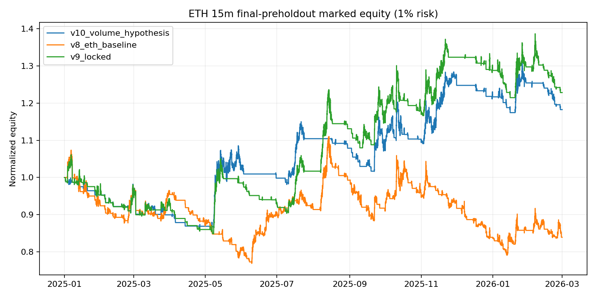
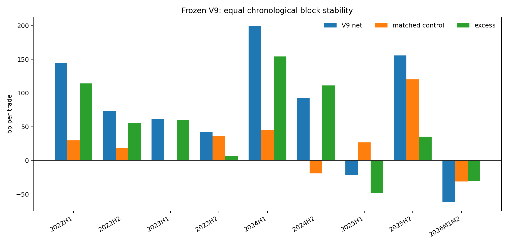
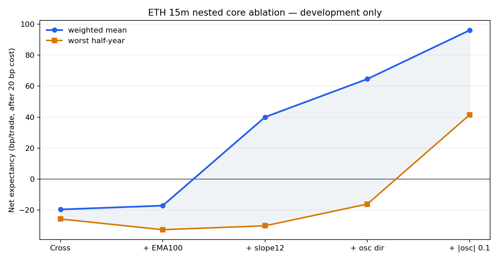
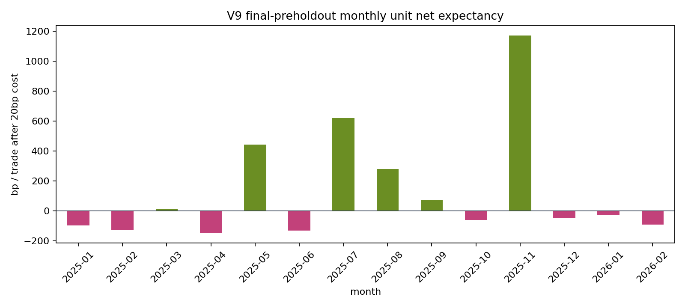
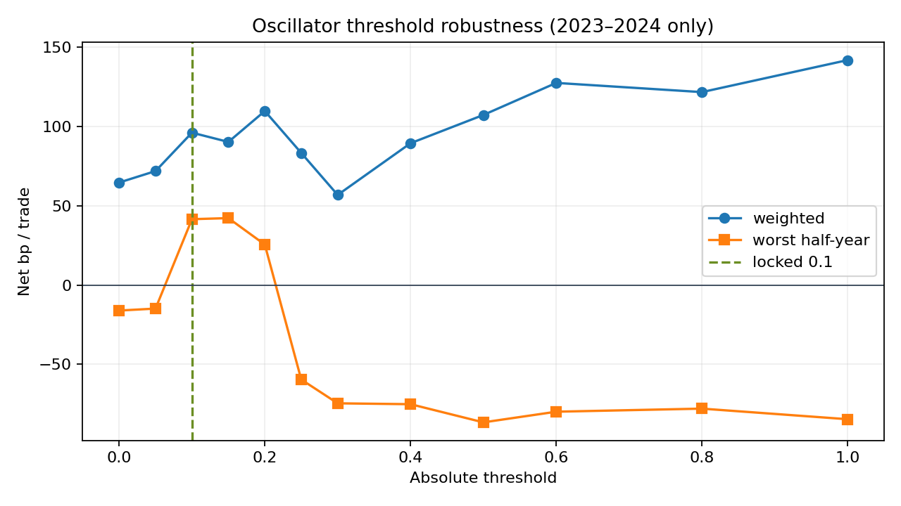
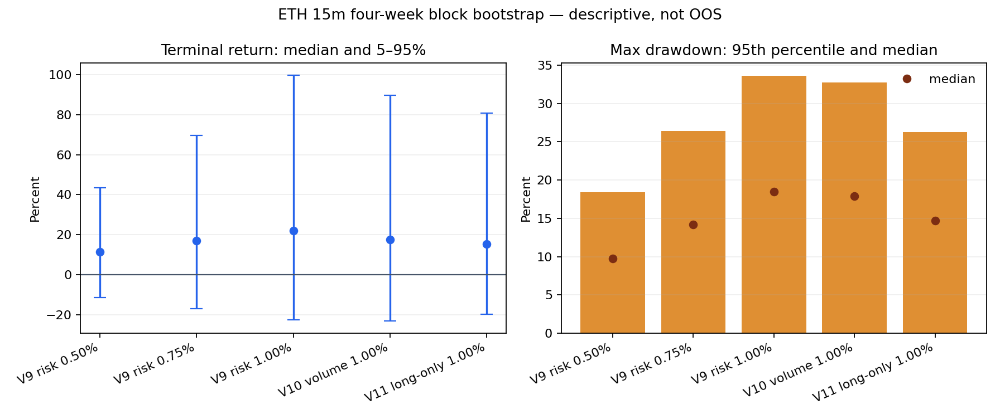

# ETHUSDT.P / ETH-USDT-SWAP 15m Pine 定型与回测审计（V1）

生成日期：2026-08-21
实验：`exp-pine-eth-15m-v1`
构建提交：`d3ed09833885bef4930f2129b67048012e8a44e2`
状态：**研究候选；不可生产、不可 forward、未通过 TradingView parity**

## 结论先行

15 分钟已经定死为本轮唯一研究周期：本地数据契约是 **OKX `ETH-USDT-SWAP` 15m**，
TradingView 的 `ETHUSDT.P` 必须再明确具体交易所后做逐笔导出对账，不能把一个显示名当成同一数据源。

当前最诚实的结论不是“已经找到稳定暴利策略”，而是：

1. 原始逻辑在 ETH 单币 final-preholdout 段成本后失败：V8 为
   **-28.29 bp/笔**。
2. 在 2023/2024 四个时间块先选择项目已有的 `slow_slope_12` 方向门，再把 oscillator
   阈值从 `0.2` 锁到 `0.1`，V9 在 2025-01 至 2026-02 得到
   **+30.22 bp/笔、PF 1.366、
   1% 风险资金收益 +22.82%、15m 收盘最大回撤 20.07%**。
3. 这个正结果仍未过项目的证据门：相对匹配随机对照 +29.43 bp，
   但 UTC 周区块 sign-flip `p=0.1704`，绝对收益周 bootstrap
   95% CI 为 [-61.87, 214.14] bp，均未达到 `p<0.01`。
4. 110 笔里只有 11 笔盈利；去掉最大一笔后均值变为
   **-4.77 bp/笔**，正收益高度依赖少数长趋势反转单。
5. V10 的 `vol_ratio_mean8 >= 1` 历史点估计更好（+41.22 bp/笔、
   回撤 13.50%），但它是在 V9 final 已看过之后才选出的，
   且 sign-flip `p=0.2966`；只能作为下一轮纸面 forward 假设。
6. 开发段选择出的 long-only V11 历史点估计为
   +63.39 bp/笔、回撤
   16.77%，但这同样是 consumed-final 后的诊断，
   仅 5/56 笔盈利，
   sign-flip `p=0.2710`。
7. 真实 10m 数据的短共同窗不支持“15m 天生更优”：原 V8 在 10m 为
   +27.39 bp/笔，
   15m 为 -39.78 bp/笔；
   V9 在 10m/15m 都为负。该窗只有约 10 周且四组 p 均未过门，不能反向选回 10m，但必须披露。
8. 当前所谓 break-even 不是成本后保本：+10 bp 锁盈低于 20 bp 往返成本，final 有
   49 笔固定为 -10 bp；
   另 50 笔初始止损，
   11 笔反转单贡献全部正收益。
9. 冻结 V9 跨 9 个时间块有
   7/9 为正，但绝对净收益/匹配超额
   精确 p 分别为 0.0176 /
   0.0215，仍未到 0.01。
10. “与项目同源”不等于同一信号：276 笔 V9 入场仅
    4 笔（1.45%）
    满足项目严格 EMA ribbon density，扩展口径也只有
    29 笔（10.51%）。

因此，**V9 是最后一个在 final 前锁定的 15m 研究基线；V10（成交量门）和 V11（只开多）
是互不叠加的下一步 paper A/B 候选。三者都不能上线。**



## Context & Methods

### 数据与切分

| 项目 | 值 |
|---|---|
| 数据 | OKX `ETH-USDT-SWAP` 15m CSV |
| 行数 | 145,666 |
| 时间 | 2022-01-03T15:30:00+00:00 → 2026-02-28T23:45:00+00:00 |
| 15m 缺口 / 重复 / OHLC 错误 | 0 / 0 / 0 |
| Discovery | 2023-01-01 → 2024-01-01 |
| Confirmation | 2024-01-01 → 2025-01-01 |
| Final-preholdout | 2025-01-01 → 2026-03-01（已消耗，今后不再称未见 OOS） |
| Repository holdout | >= 2026-05-04；策略计算读取 0 行、配置评估 0 次；另见下方意外预览披露 |

所有特征只用信号 bar `t` 及以前数据；订单在 `t+1` 开盘成交。止损/标签才读取未来。
正式成本固定为单边 0.10%，即往返 20 bp；没有滑点、资金费、强平和共享保证金模拟。

### V9 信号与执行契约

- `hl2` 的 SMA10/SMA60 金叉/死叉；close 需位于 SMA60 与 EMA100 的同方向一侧；
- 原振荡器：`hl2-SMA40 → trailing 200-bar p99 → ratio → 10-bar change → HMA10`；
- oscillator 方向阈值 `±0.1`，并要求继续上升/下降；
- 项目判断特征 `EMA200.pct_change(12)` 必须与方向一致；
- HK 21:00–23:00 禁入、周日禁入、ATR% 0.1–10%；
- 初始止损 `min(4×Pine ATR14, signal close 的 3%)`，按 0.01 tick 舍入并锚定实际 fill；
- 完成 bar 达到 +1.5% 后，下一 bar 起锁 +0.1%；trailing 关闭；
- opposite signal 单次反转，legacy 03:00/周四仓位倍增关闭；
- 仓位默认每笔止损风险 1%，13x 只是上限，final 实际最大杠杆 1.15x。

### 从用户原 V7.2 到 V9 修了什么

原附件 SHA-256 与配置完全一致，迁移静态账本 **16/16**
通过。保留的 alpha 祖先是 SMA10/60 crossover、EMA100、ATR14、原振荡器、时间/周日意图和盈利后 cooldown；
真正的 alpha 改动只有 `slow_slope_12` 与 oscillator `0.2 → 0.1`。执行层则做了这些必要修复：

- 显式单边 0.10% commission 与 0 slippage，关闭 `calc_on_every_tick` / fill recalc / bar magnifier；
- 固定 4x、03:00 和周四加仓改成按初始止损距离的 1% 风险仓位；
- 初始止损从 signal close 改为 next-open 实际 fill 锚定；
- 删除 `strategy.entry` 反转后又 `strategy.close` 的重复订单路径；
- 时间过滤改为明确 `Asia/Hong_Kong`，并增加 900 秒、ETH base、日期和 confirmed-bar 守卫；
- percentile 分母从“仅不等于 0”改为 `not na and > 0` fail-closed。

这些修复让回测口径可审计，但不等于 alpha 增强。TradingView 官方 Pine v6 编译已经通过；仍未解决的是
TradingView **交易导出**逐笔 parity，以及 +0.1% 锁盈在 0.2% 往返成本后仍是 -0.1%。

### 10m 改到 15m 到底改变了什么

保留 10/60 根后，墙钟窗口由约 100/600 分钟变为 **150/900 分钟**，策略变慢 50%。
我们把“按原 10m 墙钟长度换算到 15m”（约 7/40、EMA67、osc 27/133/7/7）作为一个概念变量，
ATR14 和止损完全不动。结果：

| 开发块 | 笔数 | 净 bp/笔 | 资金收益 % | 15m DD % |
|---|---|---|---|---|
| 2023H1 | 64 | -20.65 | -9.58 | 22.93 |
| 2023H2 | 55 | -1.75 | 16.15 | 21.97 |
| 2024H1 | 78 | 2.57 | -3.31 | 18.67 |
| 2024H2 | 63 | 27.45 | 14.84 | 16.51 |

四块有两块净期望为负，所以拒绝等时长搬运；15m 版本应视为一个新的、较慢的固定策略。

### 真实 10m 与 15m 共同短窗

本地 20,328 根无缺口 OKX 5m K 线被严格两两聚合为 10,164 根真实 10m K（0 个不完整母 K），
与 15m 合约在 2025-12-23 至 2026-02 做同窗比较。这里同时隔离“周期变化”和“V8→V9 规则变化”，
每组都带 3 个非复用同层随机对照：

| 规则/周期 | 笔数 | 净 bp/笔 | 对照 bp | 超额 bp | 周 p | 收益 % | bar-close DD % |
|---|---|---|---|---|---|---|---|
| V8_10m | 52 | 27.39 | -4.75 | 32.14 | 0.2810 | 21.28 | 14.14 |
| V8_15m | 31 | -39.78 | 4.13 | -43.92 | 0.3977 | -3.31 | 9.40 |
| V9_10m | 29 | -15.99 | 0.57 | -16.57 | 0.4034 | 2.12 | 12.82 |
| V9_15m | 25 | -58.68 | -3.06 | -55.62 | 0.4955 | -5.98 | 11.43 |

V8 从 10m 改到 15m 的同窗差值为
-67.17 bp/笔；V9 为
-42.68 bp/笔。
这段短窗明确反对“15m 一定优于 10m”，也显示最近两个月是 V9 的坏制度；但它发生在参数锁定和
final 消费之后、只有 10 个周区块，不能用来选择回 10m。用户要求的 **15m 仍按长期协议定死**，
同时把这条负面证据保留为 forward 风险警报。

### 2022 backcast 与跨制度稳定性

把已锁参数反放到更早 2022 年，只能叫 reverse-time backcast，因为参数是在其后的 2023/24 选择：

| 版本 | 笔数 | 净 bp/笔 | 对照 bp | 超额 bp | 周 p | 去 top1 bp |
|---|---|---|---|---|---|---|
| V9 | 80 | 108.66 | 26.97 | 81.69 | 0.0624 | 63.84 |
| V10 | 70 | 49.69 | 3.31 | 46.38 | 0.1295 | 1.10 |
| V11 | 42 | 42.95 | -17.02 | 59.97 | 0.2386 | -38.99 |

V9 的 backcast 点估计和匹配超额为正，但 `p=0.0624`，
仍未过门；V10/V11 在这个旧制度反而更弱，支持不让 post-selection 版本替换 V9。

冻结 V9 进一步按固定半年重新起账（最后一段为 2026M1M2）：

| 时间块 | 笔数 | V9 bp | 对照 bp | 超额 bp | 收益 % | DD % | 去 top1 bp |
|---|---|---|---|---|---|---|---|
| 2022H1 | 34 | 143.99 | 32.05 | 111.94 | 33.68 | 14.13 | 37.76 |
| 2022H2 | 47 | 73.98 | 41.25 | 32.73 | 9.33 | 13.70 | 1.62 |
| 2023H1 | 42 | 61.02 | -0.95 | 61.97 | 39.80 | 16.64 | 2.01 |
| 2023H2 | 42 | 41.49 | 61.38 | -19.88 | 21.84 | 16.72 | -10.28 |
| 2024H1 | 38 | 199.76 | 29.66 | 170.10 | 60.32 | 9.48 | 137.30 |
| 2024H2 | 45 | 92.04 | 17.67 | 74.36 | 30.52 | 12.19 | 33.75 |
| 2025H1 | 51 | -21.33 | 6.04 | -27.37 | -7.18 | 20.07 | -98.64 |
| 2025H2 | 38 | 155.58 | 73.20 | 82.38 | 40.06 | 12.69 | 88.30 |
| 2026M1M2 | 21 | -61.78 | -50.82 | -10.96 | -4.62 | 11.43 | -100.58 |



绝对净收益 7/9 块为正，但 512 种穷举 sign-flip `p=0.0176`；
匹配超额为正 6/9 块、`p=0.0215`。
2025H1 和 2026M1M2 为负，说明长期总和不是“每个制度都赚钱”。

### 核心逻辑嵌套消融（只读 2023/2024）

下面每一步只增加一个信号组件，执行、止损、仓位、冷却和 20 bp 成本完全不变：

| 信号阶段 | 总笔数 | 最差半年 bp | 加权 bp | 正半年 |
|---|---|---|---|---|
| core_cross_only | 1,196 | -25.73 | -19.57 | 0/4 |
| core_plus_ema100_regime | 620 | -32.64 | -17.11 | 0/4 |
| core_plus_slope12 | 247 | -30.11 | 40.03 | 3/4 |
| core_plus_osc_direction | 192 | -16.11 | 64.59 | 3/4 |
| core_v9_threshold_0p1 | 167 | 41.49 | 96.04 | 4/4 |



单纯 SMA10/60 crossover 和再加 EMA100 的四个开发半年全部成本后为负；`EMA200 slope12`
是第一个产生正加权期望的组件，但仍有一个半年为负。振荡器方向继续降噪，最终 `±0.1`
门才让四块都为正。因此当前核心应理解为**趋势方向一致后的稀疏交叉触发**，而不是已经验证的
“均线密集形态”。这也解释了为什么把严格 ribbon density 强塞进去反而不稳定。

为了把“同源”从口头判断变成可检验语义，本轮把每笔 V9 的 signal bar 映射到项目现有、未经修改的
EMA8/13/21/34/55 + EMA144/200 strict / expanded 密集规则：

| 时期 | V9 笔数 | strict 重合 | expanded 重合 | MA spread 中位 bp | strict 移位 p | expanded 移位 p |
|---|---|---|---|---|---|---|
| discovery_2023 | 83 | 2/83 (2.41%) | 15/83 (18.07%) | 22.77 | 0.7044 | 0.0050 |
| confirmation_2024 | 83 | 1/83 (1.20%) | 6/83 (7.23%) | 33.57 | 0.6023 | 0.2451 |
| final_preholdout_2025_202602 | 110 | 1/110 (0.91%) | 8/110 (7.27%) | 37.67 | 0.6799 | 0.1128 |

全时期只有 4/276
笔满足 strict，final 更只有
1/
110；V9 signal bar 的五条快 EMA spread
中位数为 33.63 bp，高于 strict 的
28.00 bp。每个时期都穷举 signal path
相对 density mask 的所有循环时间移位；strict 三段均没有富集（p 都远高于 0.01）。2023 expanded
重合虽有 p=0.0050，
但 2024 / final 未复现，且这是事后语义诊断，不是可加到 V9 的 gate。

所以答案是：两者共享“均线结构后启动”的研究祖先，但**当前 Pine 与 Local Signal V2 的事件定义不同**。
旧 L2 的候选池、标签与密集特征分布不能直接当成 V9 的判断层训练集。

方向 eligibility 作为另一个单变量，只在开发段比较：

| 方向策略 | 总笔数 | 最差半年 bp | 加权 bp | 正半年 | 最差 DD % |
|---|---|---|---|---|---|
| v9_two_sided | 167 | 41.49 | 96.04 | 4/4 | 16.72 |
| v9_long_only | 81 | 79.40 | 171.15 | 4/4 | 15.78 |
| v9_short_only | 99 | -40.29 | 23.48 | 2/4 | 11.84 |

long-only 的四块绝对期望都为正，但相对 two-sided 的增量在 2024H2 为负；三种方向策略的
共同区块 max-stat `p=0.1250`，
仍过不了 `p<0.01`。随后查看的 V11 final 点估计为
63.39 bp/笔、PF
1.508、收益
17.46%、回撤
16.77%；但 final 已经消费，
去掉最大赢家后均值 -5.35 bp/笔，
所以只能登记为 V11 paper-forward 假设。

## Results

### 主版本对照

| 版本 | 时期 | 笔数 | 毛 bp/笔 | 净 bp/笔 | PF | 收益 % | 15m DD % |
|---|---|---|---|---|---|---|---|
| V8 原 ETH 基线 | discovery_2023 | 181 | 5.14 | -14.86 | 0.964 | -4.44 | 26.01 |
| V8 原 ETH 基线 | confirmation_2024 | 195 | 43.66 | 23.66 | 1.353 | 44.91 | 21.79 |
| V8 原 ETH 基线 | final 2025–2026-02 | 212 | -8.29 | -28.29 | 0.826 | -16.06 | 28.72 |
| V8 + EMA200 slope12 | discovery_2023 | 67 | 97.63 | 77.63 | 2.405 | 81.30 | 23.02 |
| V8 + EMA200 slope12 | confirmation_2024 | 72 | 161.15 | 141.15 | 3.082 | 103.16 | 9.99 |
| V8 + EMA200 slope12 | final 2025–2026-02 | 103 | 18.80 | -1.20 | 1.108 | 5.81 | 27.48 |
| V9 锁定候选 | discovery_2023 | 83 | 72.01 | 52.01 | 1.921 | 70.51 | 26.46 |
| V9 锁定候选 | confirmation_2024 | 83 | 161.35 | 141.35 | 2.748 | 109.25 | 12.19 |
| V9 锁定候选 | final 2025–2026-02 | 110 | 50.22 | 30.22 | 1.366 | 22.82 | 20.07 |
| V10 成交量假设* | discovery_2023 | 62 | 114.72 | 94.72 | 2.985 | 100.76 | 20.53 |
| V10 成交量假设* | confirmation_2024 | 64 | 212.44 | 192.44 | 3.585 | 118.00 | 11.43 |
| V10 成交量假设* | final 2025–2026-02 | 77 | 61.22 | 41.22 | 1.405 | 18.24 | 13.50 |

`*` V10 是 post-selection 历史诊断，不是独立 OOS。

### 匹配随机、排序检验与尾部依赖

| 检验 | V9 结果 | 判定 |
|---|---:|---|
| 策略净收益 | +30.22 bp/笔 | 点估计为正 |
| 匹配随机净收益 | 0.80 bp/笔 | 同月×HK 6h×ATR 五分位×方向×持有期 |
| 策略 - 对照 | +29.43 bp/笔 | 正，但不显著 |
| UTC 周 sign-flip | p=0.1704 | **未过 p<0.01** |
| 绝对收益周 bootstrap | [-61.87, 214.14] bp | 跨 0 |
| oscillator top-decile | +202.97 bp/笔，p=0.1646 | 排序不显著 |
| oscillator AUC（净正收益） | 0.5170 | 仅参考，不是成功标准 |
| 盈利笔数 | 11/110 | 低胜率趋势策略 |
| 最大一笔占净收益 | 115.63% | 去掉后均值转负 |
| 正月份 | 6/14 | 月中位数 -38.03 bp/笔 |



单个 deterministic control seed 可复现，但不是不确定性区间。64 个预定义 seed、每个仍严格
3 个非复用同层对照后的敏感性如下（方括号为 seed 间 5%–95%）：

| 候选 | 候选 bp | 对照中位 [5%,95%] | 超额中位 [5%,95%] | 超额>0 seed % | 周 p 范围 |
|---|---|---|---|---|---|
| v9_locked | 30.22 | 12.25 [-12.59, 45.05] | 17.97 [-14.83, 42.81] | 89.06 | 0.077–0.546 |
| v10_volume_hypothesis | 41.22 | 16.10 [-15.15, 48.71] | 25.12 [-7.49, 56.37] | 89.06 | 0.153–0.573 |
| v11_long_only_postselection | 63.39 | 12.62 [-20.73, 50.75] | 50.77 [12.64, 84.12] | 95.31 | 0.151–0.679 |

V9/V10 各有 89.06% 的 assignment seed 得到正超额，V11 为 95.31%；但三者 64 个 seed 中
`p<0.01` 的比例都为 **0%**。因此报告保留原 seed 作为逐笔可复现 ledger，同时把 seed 分布
作为经济结论；禁止挑一个最有利 seed 代表策略。

### 参数选择与单变量实验

oscillator 阈值只在 2023/2024 搜索；`0.1` 与 `0.15` 形成稳定平台，选择 `0.1` 是因为样本更多、
加权期望更高，不是因为看了 final。

| 阈值 | 示例块笔数 | 最差半年 bp | 四块加权 bp | 状态 |
|---|---|---|---|---|
| 0.00 | 47 | -16.11 | 64.59 | — |
| 0.05 | 45 | -14.87 | 71.82 | — |
| 0.10 | 42 | 41.49 | 96.04 | 锁定 |
| 0.15 | 41 | 42.17 | 90.19 | — |
| 0.20 | 31 | 25.49 | 109.67 | — |
| 0.25 | 27 | -59.59 | 83.25 | — |
| 0.30 | 30 | -74.59 | 56.78 | — |
| 0.40 | 25 | -75.14 | 89.38 | — |
| 0.50 | 24 | -86.59 | 107.19 | — |
| 0.60 | 23 | -79.88 | 127.40 | — |
| 0.80 | 18 | -77.94 | 121.61 | — |
| 1.00 | 10 | -84.61 | 141.79 | — |



项目 28 个因果特征逐个用自然阈值筛选后的开发段前八名如下；没有训练 LR/LightGBM：

| 单特征门 | 示例块笔数 | 最差半年 bp | 四块加权 bp | 选择 |
|---|---|---|---|---|
| vol_ratio_mean8_ge1 | 31 | 68.25 | 144.35 | 是（仅 forward 假设） |
| ret24_aligned | 38 | 60.86 | 115.75 | 否 |
| order_ge3 | 42 | 53.34 | 100.31 | 否 |
| spread_expanding8 | 34 | 51.22 | 108.02 | 否 |
| pre_range48_le0032 | 35 | 45.94 | 70.30 | 否 |
| cluster_breakout | 41 | 41.49 | 99.92 | 否 |
| ema55_price_side | 41 | 41.49 | 97.92 | 否 |
| ema200_price_side | 42 | 41.49 | 96.04 | 否 |

增量 prequential 检查每次只用已经结束的半年选 gate，再测紧接着的下半年：

| 选择所用历史块 | 下一测试块 | 选中 gate | gate bp | V9 bp | 增量 bp |
|---|---|---|---|---|---|
| 2023H1 | 2023H2 | vol_ratio_mean8_ge1 | 68.25 | 41.49 | 26.76 |
| 2023H1,2023H2 | 2024H1 | vol_ratio_mean8_ge1 | 274.12 | 199.76 | 74.37 |
| 2023H1,2023H2,2024H1 | 2024H2 | vol_ratio_mean8_ge1 | 124.75 | 92.04 | 32.71 |

三次都选中 `vol_ratio_mean8 >= 1`，增量三次为正，测试块加权期望为
151.91 bp，
同期 V9 为 107.80 bp。
这是 V10 值得 paper A/B 的最好证据，但只有三个测试块，精确 sign-flip 最低也只能到
`p=0.1250`；
对 18 个 gate 的搜索做共同区块 max-stat 校正后为
`p=0.5000`。

所以 `vol_ratio_mean8 >= 1` 的 V10 虽改善历史点估计和回撤，但 final 已污染、尾部更集中，
且多重选择校正未过，不能冒充验证成功。

把已经落盘的 12 个 oscillator 阈值、11 个 slope lag、18 个自然特征门、3 个方向策略和
21 个 trailing 组合放进同一份选择预算，共 65 个已知配置、
折叠后 60 条独立四块表现路径。使用同一个
half-year sign vector 同时翻转所有路径的 exact max-stat，观察期最优是
`side:v9_long_only`，但选择校正
`p=0.2500`；V9 的四块均值/最差块
排名仅为 19/
12（分母均为
60）。这不是说 V9 必须改成榜首，而是说明可被挑中的“榜首”太多，
继续挖同一开发期会扩大选择偏差。

只用过去块选择、再看紧接着半年，也没有形成单一稳定冠军：

| 选择所用块 | 下一块 | 选中配置 | 选中 bp | V9 bp | 差值 bp |
|---|---|---|---|---|---|
| 2023H1 | 2023H2 | slope:24 | 42.60 | 41.49 | 1.11 |
| 2023H1, 2023H2 | 2024H1 | side:v9_long_only | 350.24 | 199.76 | 150.48 |
| 2023H1, 2023H2, 2024H1 | 2024H2 | side:v9_long_only | 79.40 | 92.04 | -12.63 |

四块只能形成 16 个 sign patterns，选择风险审计明确不声称正式 PBO；它只给出停止条件：
**不再在 2023/2024 上增加超参搜索，V10/V11 必须靠新鲜前向。**

为后续互斥 paper A/B，已从 V9 通过严格生成器产出两份 Pine：

- `pine/allin_eth_15m_v10_volume_paper.pine`：只增加 20-bar volume ratio 的 8-bar 均值 `>=1`；
- `pine/allin_eth_15m_v11_long_only_paper.pine`：只允许开多，空信号仍在下一根开盘平多；
- manifest 明确 `combined_v10_v11_generated=false`、parity/production 均为 false。

两者都不覆盖 `allin_eth_15m_v9_research.pine`，也不能因为文件可运行就被解释成已验证。

三份 Pine 的 SHA256 已写入 fail-closed paper protocol，但没有启动采集、写 forward log 或发任何订单。
按 consumed-final 历史到达率，达到每臂 100 笔约需：V9
12.66 个月、V10
18.09 个月、V11
24.88 个月（仅规划估计，不是预测）。
正式一次性读取采用三臂 Holm familywise 0.01，并要求匹配超额、绝对周区块 CI、去最大赢家和
venue-exact 总成本同时通过。TradingView 逐笔 parity 未通过前，协议保持 `blocked=true`。

止损/退出结论：

- 本轮冻结保持 break-even 不变（不代表其经济语义正确）：原开发消融不足以直接替换，后续成本解剖则明确暴露 +10 bp 锁盈低于 20 bp 成本；任何参数改动仍需单独批准；
- 拒绝 trailing：开发段搜索的所有 2.5–10% 激活、1–5% 距离组合，最差半年都为负；
- `close only` 反转模式最差半年 +22.32 bp，低于 V9 的 +41.49 bp，拒绝；
- 初始 `4×ATR / 3% cap`、ATR 下限和 20 bp 成本未调参。

对冻结 final 退出逐笔解剖后：

| 退出类型 | 笔数 | 净 bp/笔 | 持有中位 bars | 出场前 MFE 中位 bp | 出场前 MAE 中位 bp |
|---|---:|---:|---:|---:|---:|
| 成本下的“BE”止损 | 49 | -10.00 | 51.00 | 255.07 | 53.98 |
| 初始保护止损 | 50 | -211.21 | 19.50 | 55.97 | 151.74 |
| 反转退出 | 11 | +1,306.81 | 747.00 | 2,205.77 | 43.16 |

`BREAK_EVEN_OFFSET=0.1%` 只锁 10 bp，而冻结往返成本为 20 bp，所以 2023、2024、final 三段
所有此类退出都精确为 -10 bp；名称和经济语义不一致。50 笔初始止损中
74.00%
在出场前连 +1% MFE 都没有，说明多数失败首先是入场不延续，而不只是止损太紧。

把 49 笔 -10 bp 静态替换成 0、保持同一退出时点的**会计上限示意**，只把均值从
30.22
提高到 34.68 bp/笔；
去掉最大赢家后仍为
-0.27 bp/笔。
这不是 barrier replay，不能据此偷改参数；但它证明修正 BE 语义也不是解决尾部依赖的万能药。

### 仓位风险与回撤

仓位只改变资金路径，不改变 +30.22 bp/笔的单位期望：

| 每笔风险 % | 资金收益 % | 15m DD % | 均值杠杆 | 最大杠杆 |
|---|---|---|---|---|
| 0.50 | 12.14 | 10.63 | 0.29 | 0.57 |
| 0.75 | 17.68 | 15.49 | 0.43 | 0.86 |
| 1.00 | 22.82 | 20.07 | 0.57 | 1.15 |
| 1.25 | 27.51 | 24.38 | 0.72 | 1.44 |
| 1.50 | 31.73 | 28.46 | 0.86 | 1.72 |
| 2.00 | 38.65 | 35.93 | 1.15 | 2.30 |

本轮把 **1%** 作为默认研究风险：0.5% 更稳但收益低；2% 的历史回撤已达 35.93%。
正式 20 bp 成本下 V9 毛期望 50.22 bp/笔，意味着总成本接近该值时点估计归零；
资金费和真实滑点未建模，不能忽略。

为避免只盯着实际一条资金曲线，使用 consumed-final 的 61 个周收益做 20,000 次连续 4 周
循环区块重采样（纯描述、不是 OOS/预测）：

| 资金臂 | 实际收益 % | 实际 DD % | bootstrap 收益中位 [5%,95%] | DD 95% % | 终值<0 % | DD>20 % | 最长连亏 |
|---|---|---|---|---|---|---|---|
| V9 risk 0.50% | 12.14 | 10.63 | 11.49 [-11.42, 43.40] | 18.44 | 22.60 | 2.96 | 22 |
| V9 risk 0.75% | 17.68 | 15.49 | 17.03 [-16.95, 69.77] | 26.42 | 23.24 | 19.38 | 22 |
| V9 risk 1.00% | 22.82 | 20.07 | 21.86 [-22.61, 99.78] | 33.66 | 24.32 | 42.37 | 22 |
| V10 volume 1.00% | 18.24 | 13.50 | 17.58 [-23.10, 89.83] | 32.76 | 27.73 | 38.88 | 27 |
| V11 long-only 1.00% | 17.46 | 16.77 | 15.40 [-19.91, 80.98] | 26.31 | 27.77 | 20.72 | 20 |



0.5% 风险把 V9 的实际回撤从 20.07% 压到 10.63%，bootstrap 回撤 95 分位从
33.66% 降到
18.44%；但终值为负的重采样比例仍为
22.60%。因此 **0.5% 是更保守的
paper 风险档，不是 alpha 优化**；1% 继续作为可比研究基准，2% 不建议。

### 独立回测框架复核

本机 `Backtesting.py 0.6.5` 的独立回放得到：

- 110/110 入场时间一致，110/110 出场时间一致；
- 最大入/出价格误差分别 0.0000000000 / 0.0000000000；
- 最大单位收益误差 0.0000000000 bp；
- 框架收益 +22.78%、最大回撤 20.01%，
  与自定义引擎 +22.82% / 20.07% 接近。

这通过了**独立 Python 框架 reconciliation**，但不是 TradingView broker-emulator parity。
精确 V9 hash 已在 `OKX:ETHUSDT.P` 15m 通过 TradingView 官方 Pine v6 编译，错误 0，且成功显示为
active strategy；但仍需导出逐笔 ledger。

V9 Pine 静态契约 25/25 项通过：常量、900 秒周期守卫、ETH base 守卫、confirmed-bar、next-open、
commission、禁 tick 重算/放大器、无 `request.security`/lookahead 都与冻结配置一致。静态审计器自身没有
调用编译器，但独立 compiler receipt 已把 `official_pine_compiler_run=true` 钉到源 SHA
`6465fa80f89907b2ed584085960f355f331de62e3c38ebf65f3065c57873dfe9`。`tradingview/trades_normalized.template.csv` 与
`scripts/reconcile_pine_eth_15m_tradingview.py` 已准备好，真实导出必须 110/110 entry+side、exit time、
入/出价格一 tick 内全部通过；费用/净 P&L 仍需 venue 会计复核。

本次浏览器 smoke 无法进入历史账本：账号计划为 Basic，已加载图表区间
2026-06-01～2026-08-21，完全晚于
`researchEnd=2026-03-01`；任意历史 Deep Backtesting 会弹出升级门，因此报告为 “This report requires trade data”，
没有导出或 reconciliation。编译成功与逐笔 parity 必须继续分开表述。

同一 OKX 合约的 3m 有序路径又做了一层执行敏感性复核：

- 2025-01 至 2026-02 共 40,704 根 15m 母 K，
  每根都恰好由五根 3m K 构成，OHLC 最大误差为 0；
- V9 的 110 笔中，
  110/110 出场母 K 一致，
  110/110 出场价一致；
- 99 笔止损没有发现 15m 聚合隐藏的 3m 跳空劣化，
  单笔净收益最大差 0.0000000000 bp。

这只证明**本地 OKX 同源 15m 执行没有被聚合路径高估**；Pine 设置仍为
`use_bar_magnifier=false`，也没有替代 TradingView venue-specific parity。

### 邻近数据源敏感性

同一 2025-07 至 2026-02 时段，OKX swap 与 spot 各有 23,328 根无缺口 15m K；spot 只作为
附近独立 feed，不是永续替代品：

| 版本 | swap 笔数 | spot 笔数 | 入场 Jaccard % | 共同入场净收益差 bp |
|---|---|---|---|---|
| V9 | 59 | 57 | 96.61 | 2.33 |
| V10 | 47 | 42 | 78.00 | 6.99 |
| V11 | 28 | 27 | 96.43 | 2.96 |

V9/V11 的价格型规则入场重合约 96%，但成交量门 V10 只有 78%；`vol_ratio_mean8` 两 feed
相关性虽为 0.9303，成交量本身来自不同市场。
因此 feed 审计支持 V9 做本地 proxy 基线，同时进一步降低 V10 的可信度；仍不等于 TradingView parity。

### Docker 复核状态

固定配方两次都停在 Docker Hub 的 `python:3.11-slim` metadata 拉取，尚未进入依赖安装或代码执行，
因此明确记录 `pinned_docker_recipe_built=false`。为了区分“Docker runtime 坏了”和“外部镜像站阻塞”，
使用本机已有镜像在 `--network none` 下做了两层只读复核：

- Python 3.13.12 / pandas 2.2.3 /
  NumPy 2.2.6；
- 产物算术 smoke 39/39 项通过，包括 110 笔收益重算、20 bp 成本、
  330 个唯一对照、统计失败门、3m 出场对账和 eligibility；
- 另从原始 15m K 线前缀重新计算 V9 信号并运行 stateful replay：读取
  145,666 根、holdout 0 行，重建
  110 笔；方向、索引、退出原因、三组时间全部逐笔一致，
  数值列最大绝对误差 9.095e-13；
- Linux runtime 为 Python 3.13.12 / pandas
  2.2.3 / NumPy 2.2.6。

所以已有断网 Linux 镜像已通过“原始数据 → 信号 → 110 笔账本”的跨版本重放；但这不是固定依赖镜像，
更不是 TradingView Pine 编译/成交导出，**正式 pinned 容器构建与 TradingView parity 仍未通过**。

## 项目判断层（用户称 LR）能否接入

可以接，但当前不能把旧模型直接拿来判定：

1. 仓库生产判断层实际是 LightGBM；LogisticRegression 只是 `ma_spread_pct` 单特征 baseline。
2. 当前冻结 v10 是短侧 YOLO-v10 候选池、72-bar barrier 标签、legacy feature semantics；Pine 是双向交叉候选和反转/BE 退出，分布与目标都不同。
3. `models/active_bundle.json` 缺失，生产协议 fail-closed；当前真实生产模型数是 0。
4. P0/P1 `training_eligible=false`，因此本轮没有新训练、没有加载旧模型做伪 OOS 打分。

本轮已经输出每个 V9 final 信号 bar 的 28 个因果特征、side-aligned 语义和 label end：
`results/pine_l2_feature_rows.csv`，但每行都标记 `training_eligible=false`。

另外只读取 2023/2024，连续回放得到 166 条 Pine-specific judgment
lineage（79 long / 87 short，
成本后正类率 16.27%，28 特征缺失 0）：

| fold | raw train | purged train | label-overlap purge | validation | train 正类 % | val 正类 % |
|---|---|---|---|---|---|---|
| wf_2023h2 | 42 | 41 | 1 | 40 | 17.07 | 10.00 |
| wf_2024h1 | 83 | 82 | 1 | 38 | 13.41 | 21.05 |
| wf_2024h2 | 121 | 121 | 0 | 45 | 15.70 | 17.78 |

这 166 行只是基线实际执行账本，不能覆盖 gate 改写状态后的候选。为此另导出完整、
无标签的 raw-candidate 因果特征面：共 335 行（170 long /
165 short），其中只有
166 行出现在基线执行账本，另有
169 行因原持仓/cooldown 没有执行；
基线覆盖率仅 49.55%。
未来 LR 必须给 scored period 的每个 raw candidate 恰好一个、在 next-open 前可用的分数；缺失、重复或迟到一律
fail-closed，再把 pass 结果 AND 到 `v9_long/v9_short` 后进入动态状态机。当前 score template 为空，
没有模型、分数或阈值。

这条接口已经有可执行的恒等性自审，而不只是文档约定：用不含任何预测含义的 synthetic allow-all
sentinel，2023 的 83 笔和 2024 的
83 笔都逐笔复现，最大数值误差
4.547e-13；缺候选、重复候选、
早于特征、迟于 next-open、非有限分数、模型哈希漂移、空阈值、calibration overlap 八类输入全部拒绝。
自审还钉住一个容易漏掉的顺序：不可入场的原始信号虽不需要模型分数，仍会在 Pine 中先消耗 cooldown；
动态桥会只保留这个状态副作用，可入场候选才由分数控制。整个自审读取 final/holdout 各 0 行，未训练、
未加载模型、未选择阈值，仍为 `production_eligible=false`。

特征在 signal bar 收盘完成，时间戳与 `t+1` entry open 完全相同；label end 保守加到 exit bar
收盘，两个跨切点样本已经 purge。这个表依然**不能直接拿来静态 top-decile 筛选**：它只记录
V9 baseline 的 on-policy executed trades，一旦 LR 拒绝某单，后续持仓、反转与 cooldown 状态会改变。
未来获批后，模型分数必须放回动态 replay 内逐信号执行，不能只过滤现成 trade CSV。

这个限制不是理论提醒，两个已知 gate 的静态/动态 final 对照如下：

| gate | 静态入场表 bp/笔 | 动态 replay bp/笔 | 静态高估 bp | 入场 Jaccard % |
|---|---:|---:|---:|---:|
| `vol_ratio_mean8>=1` | 50.50 | 41.22 | 9.29 | 84.52 |
| long-only | 75.57 | 63.39 | 12.18 | 94.64 |

判断层容量也不够直接上全量模型：166 行只有
27 个正例 / 28 特征，
即 0.964 正例/特征；三折训练正例仅
7–
19，验证正例仅
4–
8。
所以未来第一步应是**预注册单特征正则 LR**（最多极小先验子集）；不能在 166 笔上拟合 28 特征
LightGBM 再用好看的 AUC 自证。若要全量模型，需要相同 Pine 候选/标签语义的动态样本扩展，优先
time-grouped 跨币训练并单独校验 ETH，而不是复用旧 YOLO-v10 判断层。

为了先判断“有没有值得训练的单特征”，又做了一个**不拟合模型、不选择执行阈值**的时间外推审计。
四个透明先验都只用早期 fold 的经验分位给下一半年打分；每项使用 40×38×45 = 68,400 个
半年内 outcome circular-shift 组合做精确零假设，并对展示的四项做 Holm 校正：

| 先验特征 | AUC | AUC p | top 正/总 | top10% bp | 去 top1 bp | top p | top Holm p |
|---|---|---|---|---|---|---|---|
| ma_spread_pct | 0.453 | 0.5493 | 0/13 | -50.03 | -53.37 | 0.8161 | 1.0000 |
| vol_ratio_mean8 | 0.571 | 0.2223 | 3/14 | 365.67 | 189.44 | 0.0595 | 0.2380 |
| slow_slope_12 | 0.527 | 0.4642 | 2/14 | 55.53 | -8.06 | 0.5810 | 1.0000 |
| atr_pct_ratio96 | 0.463 | 0.6955 | 2/16 | 134.97 | -33.14 | 0.3858 | 1.0000 |

最好的 `vol_ratio_mean8` 静态 top-decile 为 +365.67 bp，
但只有 3/14 笔为正，原始/四项 Holm p 分别为
0.0595 /
0.2380，
且它此前来自更宽的 28 特征搜索，所以连这个 Holm p 也没有覆盖全部选择历史。结果只支持“V10 值得保留为
paper 假设”，不支持训练或宣称通过。

更灵活的 28 特征 prequential selector 每折只在 purged 过去选最强特征，下一半年表现如下：

| fold | 过去选中 | 方向 | train oriented AUC | next-fold AUC |
|---|---|---|---|---|
| wf_2023h2 | spread_mean24 | lower | 0.723 | 0.483 |
| wf_2024h1 | ret_48 | lower | 0.688 | 0.477 |
| wf_2024h2 | full_ratio_min48 | higher | 0.643 | 0.390 |

合并下一期 AUC 只有
0.430；top-decile
0/
13 笔为正，净收益
-65.94 bp/笔。
这直接显示“从 28 个特征里挑当期最好再外推”是在过拟合，而不是可训练信号。

未来获得训练许可后，正确链路是：

```text
Pine confirmed close(t)
  → 28 causal L2 features available_at close(t)
  → preregistered one-feature regularized LR（LightGBM deferred）
  → calibration-only q90 threshold
  → entry at open(t+1)
```

标签必须用同一套 Pine 入场、反转、止损、BE 和 20 bp 成本；按时间 walk-forward，按 label end purge，
并同时报告 top-decile 净收益、p<0.01、64-seed 匹配随机对照和 leave-top-winner-out。
不能把旧 YOLO L2 分数当成 Pine 已验证 gate。

## 风险与诚实声明

- **Final 已消耗。** 2025-01 至 2026-02 已用于 V9 单次终测；V10 是其后的 post-selection 假设。
- **统计未过门。** V9/V10 的区块 p 值都远高于 0.01，CI 跨 0，不能说收益已稳定。
- **特征搜索未过多重校正。** `vol_ratio_mean8 >= 1` 的四块增量都为正，但 18-gate max-stat `p=0.5000`；V10 仍只是 paper-forward 假设。
- **已知搜索预算已很大。** 五类落盘搜索共 65 个配置 / 60 条独立四块路径，全局 max-stat p=0.2500；历史代码迭代和人工选择还无法完整枚举，因此这个校正只可能低估、不会消除 selection risk。
- **收益高度集中。** V9 去掉最大赢家后转负；V10 集中更严重。
- **V11 也未解决尾部依赖。** 56 笔只有 5 笔盈利，去掉最大赢家后均值 -5.35 bp/笔；它没有资格替换 V9。
- **真实 10m 短窗反对简单周期优越论。** 约 10 周同窗中，10m 原 V8 为正而 15m V8/V9 为负；四组匹配检验均不显著，不能选回 10m，也不能宣称 15m 在所有制度更好。
- **跨制度仍未过门。** V9 虽 7/9 时间块为正，但绝对/匹配精确 p 为 0.0176 / 0.0215；2025H1、2026M1M2 为负。
- **break-even 经济语义错误但本轮未改。** +10 bp 锁盈低于 20 bp 成本，49 笔固定净 -10 bp；任何 offset 修改仍是需 owner 单独批准的新 barrier 实验。
- **随机对照有 assignment 方差。** V9 的 64-seed 超额 5%–95% 为 [-14.83, 42.81] bp；单 seed 不能当确定事实。
- **数据源未 parity。** OKX cache 不能证明等于任意 TradingView `ETHUSDT.P`；swap/spot 审计中 V9 入场 Jaccard 96.61%，V10 仅 78%，后者更依赖 venue volume。
- **成本不完整。** 正式扣 20 bp，但滑点/资金费/强平/最小下单量未进入资金曲线。
- **资金费不可得而不是 0。** 本地 ETH funding 从 2026-04-07T08:00:00Z 才开始，与 canonical final 交集 0；没有计算 funding-adjusted return。
- **路径 bootstrap 不是预测。** 它只重排已消费时期的 4 周区块；V9 0.5% 风险仍有 22.60% 重采样终值为负，不能解释成未来亏损概率的精确估计。
- **没有真实密集门。** 原始核心是 SMA10/60 单点 crossover，不是项目 Local Signal V2；严格 EMA ribbon density gate 在开发段不稳定。
- **没有训练或生产动作。** 所有策略计算的 bounded loader 都读取 0 行 holdout；未 train、promote、deploy、改 ACTIVE、写 forward_log 或操作真金账户。
- **意外 holdout 预览已披露。** 在写 3m bounded loader 前，一次 shell `tail` 意外显示了原始文件末尾两行（均在 repository holdout）；它们没有进入 Python、没有被评分、没有参与任何配置选择或收益评估。按本仓“看一眼也要记录”的纪律，此事故不能写成“从未看见”，后续已用前缀加载器和不读取整文件的前缀哈希封死。
- **第二次意外预览已披露。** 检查 funding coverage 时，shell 又显示了 8 条 holdout 期 funding 原始行，最晚到 2026-07-08T16:00:00Z；同样未进 Python、未汇总/评分/选参，发现本地 funding 不覆盖回测后立即停止该分析。
- **第三次意外预览已披露。** TradingView 编译 smoke 默认打开 2026-06-01～2026-08-21 当前图表，晚于 repository holdout；事前没有 owner 的专项 holdout 批准。V9 日期门让入场/评分为 0，也没有读取任何策略指标、做收益评价或选参；临时策略已撤销、布局/脚本未保存、未发布。该事故只保留“官方编译通过”事实，不能当 holdout 验收。
- **正式 Docker 构建未完成。** 两次都卡在外部基础镜像 metadata；已有断网 Linux 镜像完成了原始数据全重放并逐笔一致，但其依赖未按实验 Dockerfile 固定，不能冒充 pinned build，更不能冒充 TradingView parity。

## 下一步选项（需 owner 决策的已标出）

1. **需 owner 提供可访问历史区间的 TradingView 方案：** 官方编译已过；在支持 2025-01～2026-02 Deep Backtesting 的计划/会话中导出 trade list，再对 signal/entry/exit/fee/equity 逐笔对账。未过不得 forward；本轮不会替 owner 购买升级。
2. **需 owner 单独批准：** 把名义 BE 的 +0.1% offset 改成成本感知值并作为单一 barrier 变量重跑；当前只完成语义/会计诊断，未改参数。
3. **parity 后再由 owner 启动：** V9 / V10（成交量门）/ V11（只开多）做互斥 paper-only 新鲜前向 A/B，各积累至少 100 笔；纸面风险优先 0.5%，1% 留作可比基准；禁止把 V10+V11 打包，旧 final 不追认为 OOS。
4. **需 owner 在 P0/P1 通过后批准：** 先建 Pine-specific 单特征正则 LR；不要直接在 166 笔上训 28 特征 LightGBM。所有分数必须进入动态 replay。
5. **需 owner 单独批准：** 任何其他 TP/SL 倍数、ATR 下限、20 bp 成本或 holdout 评估；本轮都没动。
6. **不建议：** 用 2% 风险、legacy 日历倍增、静态 trade CSV 过滤或继续挖 consumed-final 参数掩盖不显著的单位 alpha。

## 复现命令

```bash
git checkout 330d0bcce5bfbcf5e66f378260811f96a770ea0a
PYTHONPATH=. .venv/bin/python scripts/research_pine_eth_15m.py
PYTHONPATH=. .venv/bin/python scripts/analyze_pine_eth_15m_robustness.py
PYTHONPATH=. .venv/bin/python scripts/analyze_pine_eth_15m_side_hypothesis.py
PYTHONPATH=. .venv/bin/python scripts/analyze_pine_eth_15m_control_sensitivity.py
PYTHONPATH=. .venv/bin/python scripts/analyze_pine_eth_15m_path_risk.py
PYTHONPATH=. .venv/bin/python scripts/analyze_pine_eth_15m_feed_sensitivity.py
PYTHONPATH=. .venv/bin/python scripts/analyze_pine_eth_15m_exit_anatomy.py
PYTHONPATH=. .venv/bin/python scripts/analyze_pine_eth_15m_backcast.py
PYTHONPATH=. .venv/bin/python scripts/analyze_pine_eth_actual_10m_vs_15m.py
PYTHONPATH=. .venv/bin/python scripts/analyze_pine_eth_15m_regime_stability.py
PYTHONPATH=. .venv/bin/python scripts/generate_pine_eth_15m_paper_variants.py
PYTHONPATH=. .venv/bin/python scripts/prepare_pine_eth_15m_judgment_research.py
PYTHONPATH=. .venv/bin/python scripts/prepare_pine_eth_15m_gate_surface.py
PYTHONPATH=. .venv/bin/python scripts/analyze_pine_eth_15m_judgment_feasibility.py
PYTHONPATH=. .venv/bin/python scripts/analyze_pine_eth_15m_judgment_signal.py
PYTHONPATH=. .venv/bin/python scripts/analyze_pine_eth_15m_selection_risk.py
PYTHONPATH=. .venv/bin/python scripts/analyze_pine_eth_15m_density_overlap.py
PYTHONPATH=. .venv/bin/python scripts/analyze_pine_eth_15m_stateful_gate.py
PYTHONPATH=. .venv/bin/python scripts/replay_pine_eth_15m_judgment_gate.py --self-audit
PYTHONPATH=. .venv/bin/python scripts/audit_pine_eth_15m_migration.py
PYTHONPATH=. .venv/bin/python scripts/audit_pine_eth_15m_static_contract.py
PYTHONPATH=. .venv/bin/python scripts/design_pine_eth_15m_paper_protocol.py
PYTHONPATH=. python3 scripts/reconcile_pine_eth_15m_backtesting.py
PYTHONPATH=. python3 scripts/reconcile_pine_eth_15m_intrabar.py
PYTHONPATH=. .venv/bin/python scripts/validate_pine_eth_15m.py
PYTHONPATH=. /tmp/fable-pine-eval-venv/bin/python scripts/build_pine_eth_15m_report.py
PYTHONPATH=. .venv/bin/python scripts/md_to_html.py \
  analysis/p0_pine_eth_15m_v1_20260821.md --out-dir analysis/html
PYTHONPATH=. .venv/bin/python scripts/build_pine_eth_15m_artifact_manifest.py
PYTHONPATH=. .venv/bin/python scripts/build_pine_eth_15m_artifact_manifest.py --verify
PYTHONPATH=. .venv/bin/python -m pytest -q \
  tests/test_pine_allin_v7_backtest.py tests/test_research_pine_eth_15m.py tests/test_reconcile_pine_eth_15m*.py tests/test_analyze_pine_eth*.py tests/test_audit_pine_eth_15m_static_contract.py tests/test_design_pine_eth_15m_paper_protocol.py tests/test_generate_pine_eth_15m_paper_variants.py tests/test_prepare_pine_eth_15m_judgment_research.py tests/test_replay_pine_eth_15m_judgment_gate.py tests/test_smoke_pine_eth_15m_artifacts.py
```

Docker：

```bash
docker build -t fable-pine-eth15m-v1 \
  experiments/active/exp-pine-eth-15m-v1/docker
docker run --rm --network none -v "$PWD:/workspace:ro" \
  -v "$PWD/experiments/active/exp-pine-eth-15m-v1/results-docker:/output" \
  fable-pine-eth15m-v1

# External base-image pull unavailable: offline artifact-only smoke used here
docker run --rm --network none --entrypoint python -w /workspace \
  -v "$PWD:/workspace:ro" \
  -v "$PWD/experiments/active/exp-pine-eth-15m-v1/results:/output" \
  heartexlabs/label-studio:latest scripts/smoke_pine_eth_15m_artifacts.py \
  --runtime-label offline-local-label-studio-image \
  --output /output/docker_offline_smoke.json

# Full frozen-V9 market-data replay in the same network-disabled Linux image
docker run --rm --network none --entrypoint python -e PYTHONPATH=/workspace \
  -v "$PWD:/workspace:ro" \
  -v "$PWD/experiments/active/exp-pine-eth-15m-v1/results:/output" \
  heartexlabs/label-studio:latest \
  /workspace/scripts/replay_pine_eth_15m_offline.py \
  --config /workspace/experiments/active/exp-pine-eth-15m-v1/config.json \
  --canonical-trades /workspace/experiments/active/exp-pine-eth-15m-v1/results/trades.csv \
  --output /output/docker_offline_replay.json
```

验证器结果：**52/52 checks pass**。
