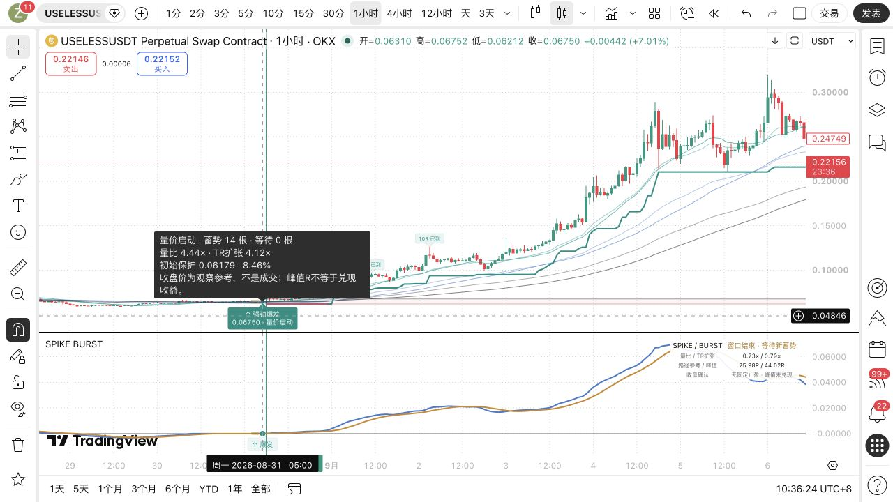
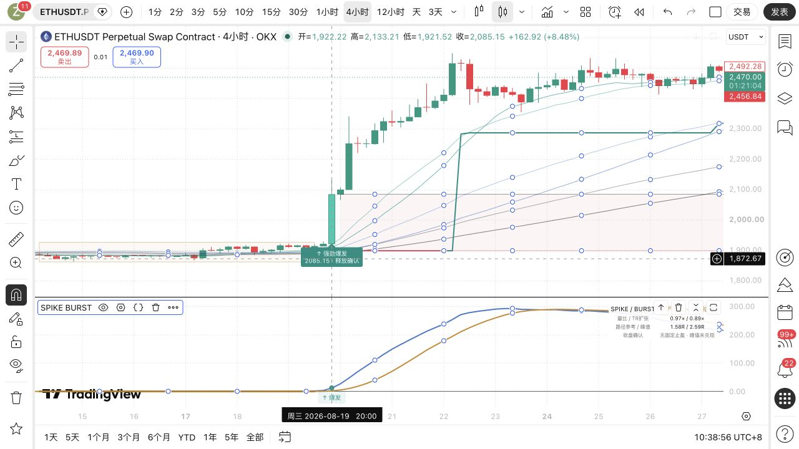
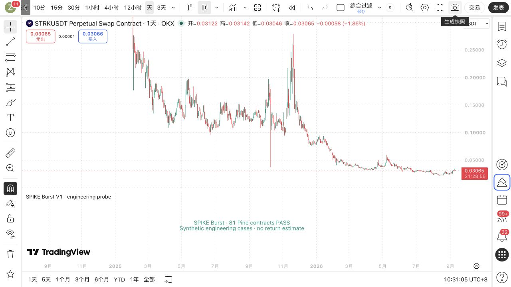

# SPIKE 强劲爆发 V1：独立指标工程验收

这版专门识别“已有蓄势与均线密集，随后出现强量价扩张”。新增价格先行路径，允许价格已经突破时IMACD仍在零轴附近。USELESS 1H案例已在TradingView核对到 **0.06750的价格先行箭头**。独立私有脚本已在TradingView保存为「SPIKE 强劲爆发 V1」，版本2（2026-09-10 10:33）。本轮完成指标功能与时序验证；这些是工程默认参数，未被证明是最优参数，也未验证盈利能力。

源码基准：`6d357fc`；独立脚本 `yoyo/evaluation/pine/spike_burst_v1.pine`。旧IMACD、Spike监控、Bark、YOLO和订单配置未改动。

## 与原指标相比

| 项目 | 原IMACD蓄势释放 | SPIKE强劲爆发 |
|---|---|---|
| 关注事件 | 近零整理后主线释放 | 蓄势后的强量价扩张 |
| 均线密集 | 原可见释放的背景参考 | 必须满足此前密集资格 |
| 成交量、K线强度 | 不作为该释放的硬门槛 | 量比、TR扩张、实体与收盘位置同时通过 |
| 触发路径 | IMACD释放 | 价格先行，或释放后6根内确认 |
| 出场参考 | 原版本自己的规则 | 宽初始保护＋单向跟踪，无固定止盈 |
| 主副图 | 保留原脚本 | 独立标签、亮色关键K；六条细MA；副图零轴和双线，无柱 |

## 默认规则与使用方式

| 条件 | 工程默认 |
|---|---|
| 基础 | IMACD34/9、ATR14、SMA/EMA20/60/120；默认多头，可选双向/空头 |
| 蓄势 | 双线处于0.10×前根ATR以内至少12根；合格后冻结容差 |
| 密集 | 前12根平均六MA宽度≤3ATR，15对MA合计交织≥2次 |
| 强度 | 量比≥4、TR/前根ATR≥3、实体/振幅≥55%、方向侧收盘位置≥75% |
| 价格位置 | 同向实体，收盘在此前箱沿和六MA之外 |
| 价格先行 | 前根已蓄势合格；MD不逆向，零滞后均线同向转强 |
| 释放确认 | 主线离带后，释放当根＋随后5根内满足强度与位置条件 |

价格先行在当前K线并入箱体之前检查。两条路径共用同一段蓄势，一段只发一次；已有活动趋势参考时不叠加。只在当前K线收盘发箭头，不回填更早位置，也不等待YOLO或高周期过滤。

## 为什么增加价格先行

首版真实图检查看到，USELESS的强阳先出现，IMACD晚两根才离开近零带。首版等到离带时，价格已经回落，且早先强阳抬高了整理箱沿，所以没有通过。这是原规格的排除结果，不能解释为绘图漏标。

随后显式修订形态，加入价格先行，量价阈值、止损参数均未修改。**这是观看USELESS之后的第二次工程曝光，属于针对已见问题的设计修订；不是盲测、样本外验证或收益改善证据。** 本轮账户收益验收次数为0；图上R只是该指标的未计成本路径参考，已经随工程图曝光，不能当成独立业绩。

| 案例，均为北京时间 | 必要条件核对 | 验证状态 |
|---|---|---|
| USELESS 1H，08-31 05:00开盘→06:00收盘 | 此前14根；量比4.383×、TR4.121×、实体81.48%、收盘位置99.63%；0.06750高于此前箱沿0.06617；MD=SB=0，零滞后均线上升 | 修订后价格先行通过，TV箭头已核对 |
| USELESS 1H，07:00开盘→08:00收盘 | 原释放价0.06800，但为阴线，实体48.53%、收盘位置42.79%，低于当时箱沿0.07195 | 首版必要条件失败对照 |
| ETH 4H，08-19 20:00开盘→08-20 00:00收盘 | 释放后第1根；量比13.002×、TR14.056×、实体76.97%、收盘位置77.30%；2085.15高于箱沿1927 | 数据与TV原生箭头均通过，标签为“释放确认” |

最终图表抽查2个币种、2个周期、2条正例路径，另有1个原释放失败条件对照；不估计总体候选数或正类率。两币原始OHLCV与冻结特征的SHA及价格列已核验，并独立重算ATR和IMACD。注意图表通常标K线开盘时间，通知常写收盘确认时间；不能把两者相差一根直接认定为延迟。

## 实际图表

以下是TradingView原生图，不是后画的预测。箭头后的走势用于检查显示与保护路径；右上角面板始终是图表最新状态，不是十字光标时刻状态。





## 宽止损与趋势跟踪

初始保护取近期5根反侧极值外加0.2ATR缓冲，距离至少2ATR，并按最小跳动向外取整。以信号收盘价计算的初始距离冻结为1R；信号根的高低点不计入后续收益。无效风险参考单独标明，不隐藏有效爆发箭头。

收盘浮盈达到2R后，保护距离为收盘价外4ATR，仅向盈利方向收紧。当前收盘更新的保护从下一根生效；先检查此前有效保护，再计算本根峰值，跳空采用较差开盘参考。3R/5R/10R仅为已达到的路程标记，**不是止盈指令；峰值R不是兑现收益**。保护更宽意味着相同账户风险需要更小仓位。图上粗保护线表示这一根开始时已生效的价位；最新标签注明“下根保护”。价格触及保护时，本根收盘才显示退出确认。实际交易若需要盘中止损，应在交易所预先设置相应保护；该指标不会自动挂单。

多头示例：收盘参考100、初始保护96，则1R=4；3R对应112只是里程碑。收盘达到108（2R）后开始跟踪；若ATR=2，则候选保护是108−4×2=100，下一根才生效。保护以后只上移，回调不下移。

## 验收证据与复现

TradingView原生执行通过81条helper断言和35条状态断言；Python源码契约与探针完整性测试22项通过。覆盖逐项破坏必要条件、多空镜像、缺量、六根边界、冻结箱体、单段一次、跳空止损、止损优先和下一根保护生效。

| 指标 | 本轮口径 |
|---|---|
| val AUC、胜率、top-decile毛/净收益、置换p | 不适用：未构造收益标签、评分器或训练/验证集 |
| 匹配随机入场收益对照 | 不适用：本轮没有账户收益实验 |
| 同等工程零假设对照 | 相同合成输入只破坏一个必要条件应不发信号；前缀重放不受后续输入改变 |
| 生产/训练资格 | 均为false；通过工程断言不等于获准上线 |

```bash
cd /Users/zhangzc/fable-trading
.venv/bin/python -m pytest -q tests/test_spike_burst_contract.py tests/test_spike_burst_state_probe.py
.venv/bin/python -m yoyo.evaluation.build_spike_burst_probe --output /tmp/spike_burst_contract_probe.pine
.venv/bin/python -m yoyo.evaluation.build_spike_burst_state_probe --output /tmp/spike_burst_state_probe.pine
python3 scripts/md_to_html.py analysis/p0_spike_burst_indicator_20260910.md --out-dir analysis/html
```

探针命令只生成代码；分别粘贴到TradingView临时指标并添加到图表，至少加载29根已收盘K线，必须实际显示81 PASS与35/35 PASS才算原生通过。两个探针提取生产Pine的真实函数/状态块，保留源码哈希。最终测试源码提交为6d357fc。




曾保留两项失败：首次Mac长文本输入破坏标点，未保存或应用，改用浏览器粘贴并逐字核验（仅规范CRLF换行）；首版状态夹具缺少前根ATR，原生断言失败，添加明确预备K线后重新执行通过。不是删除失败断言换取通过。测试临时图已关闭，原IMACD仍保留，自动保存已恢复。云端布局若被用户其他设备改动，采用当时最新保存状态，不回写旧快照。

## 在TradingView使用

在「指标 → 我的脚本」选择 **SPIKE 强劲爆发 V1**。若Mac端列表还未刷新，重新打开图表/脚本列表；下方附完整源码可单独新建指标。保持普通K线，先观察1H与4H。默认多头，参数面板可选双向/空头；“初始结构回看根数”“最小初始距离 ATR”“趋势保护距离 ATR”分别决定保护参考的结构、下限和跟踪宽度。

它按当前图表品种和周期计算，可在TradingView提供完整OHLCV的OKX、币安、Gate永续图使用；本轮只完成OKX两例实图验收，不能推断所有交易所同参数效果相同。没有加入全市场扫描，也没有接入原Spike/Bark通知协议。两个现有系统可以并行观察，箭头不要求与原IMACD相同。

## 风险与诚实声明

收盘确认会晚于盘中突破，1H/4H可能已经走出较大距离。当前脚本提供观察与保护参考，不执行真实止损，未计手续费、滑点、资金费或流动性冲击。缺成交量或基数为零不发信号；不同交易所的量与K线可能不同。只支持普通时间K线，预热不足不发信号。

信号状态由`barstate.isconfirmed`限制在收盘更新；这与TradingView的[收盘状态语义](https://www.tradingview.com/pine-script-docs/concepts/bar-states/#barstateisconfirmed)一致。已收盘信号不使用未来K线或回填，但数据修订、参数和历史起点改变仍可能改变重算结果；未收盘的六条均线仍会随价格变化，副图双线保持上一收盘值。这种区别见[官方重绘说明](https://www.tradingview.com/pine-script-docs/concepts/repainting/)。不能承诺任何条件下绝对不重算。`alertcondition`提供可选报警条件，不会自行创建运行中的警报；见[官方报警说明](https://www.tradingview.com/pine-script-docs/concepts/alerts/)。本轮没有开通TV报警或接入现有推送。

下一步可独立冻结多交易所账户实验，检查强劲爆发的失败率、等待成本和跟踪退出；不能用这两张已见案例选出“最优参数”。上线监控或改变通知协议需要Owner决定。

## 完整Pine脚本

```pine
//@version=6
// SPIKE Burst V1. Engineering defaults, not fitted or validated profit parameters.
// Derived from LazyBear IMACD and the owner's frozen near-zero/6MA launch idea.
// Current and prior OHLCV only; no security(), pivots, backstamping, or varip.
indicator("SPIKE 强劲爆发 V1", shorttitle="SPIKE BURST", overlay=false, max_labels_count=300, max_boxes_count=80, max_lines_count=80, explicit_plot_zorder=true)

string gSetup = "01 · 蓄势资格"
int maLen = input.int(34, "IMACD 长度", minval=2, maxval=200, group=gSetup, display=display.none)
int sigLen = input.int(9, "信号线长度", minval=1, maxval=100, group=gSetup, display=display.none)
int minQuiet = input.int(12, "连续近零根数", minval=2, maxval=100, group=gSetup, display=display.none)
float nearAtr = input.float(0.10, "近零带 / 前根 ATR", minval=0, maxval=1, step=0.01, group=gSetup, display=display.none)
int denseLen = input.int(12, "释放前密集窗口", minval=2, maxval=100, group=gSetup, display=display.none)
float denseWidth = input.float(3.0, "平均六均线宽度 / ATR 上限", minval=0.1, step=0.1, group=gSetup, display=display.none)
int denseCrosses = input.int(2, "至少交织次数", minval=0, maxval=100, group=gSetup, display=display.none)
int opportunity = input.int(6, "爆发窗口（含释放根）", minval=1, maxval=30, group=gSetup, tooltip="释放当根＋随后5根，默认共6根。爆发条件后到，箭头就画在后来的确认根，不回填。", display=display.none)

string gBurst = "02 · 强劲爆发"
string direction = input.string("多头", "方向", options=["多头", "双向", "空头"], group=gBurst, display=display.none)
float minVolume = input.float(4.0, "最低量比", minval=1, step=0.25, group=gBurst, tooltip="本根成交量 / 前20根成交量中位数。量缺失或基数为0时不触发。", display=display.none)
float minExpansion = input.float(3.0, "最低 TR / 前根 ATR", minval=1, step=0.25, group=gBurst, display=display.none)
float minBody = input.float(0.55, "最低实体占比", minval=0.1, maxval=1, step=0.05, group=gBurst, display=display.none)
float minEnd = input.float(0.75, "最低方向侧收盘位置", minval=0.5, maxval=1, step=0.05, group=gBurst, tooltip="多头(close-low)/(high-low)，空头相反。75%要求收在方向侧四分之一区域。", display=display.none)

string gRisk = "03 · 宽止损与趋势保护"
int stopLen = input.int(5, "初始结构回看根数", minval=1, maxval=100, group=gRisk, display=display.none)
float stopBuffer = input.float(0.2, "结构外侧缓冲 ATR", minval=0, step=0.1, group=gRisk, display=display.none)
float riskFloor = input.float(2.0, "最小初始距离 ATR", minval=0.25, step=0.25, group=gRisk, tooltip="是价格空间，不是账户风险额度。止损变宽时，同样账户风险应减少仓位。工程默认，未优化盈利。", display=display.none)
float armR = input.float(2.0, "收盘浮盈达到多少 R 后跟踪", minval=0, step=0.25, group=gRisk, display=display.none)
float trailAtr = input.float(4.0, "趋势保护距离 ATR", minval=0.5, step=0.25, group=gRisk, tooltip="收盘价外4ATR，单向收紧。本根更新从下一根生效；无固定止盈。", display=display.none)

string gView = "04 · 显示"
bool showMas = input.bool(true, "六条均线", group=gView, display=display.none)
bool showZone = input.bool(true, "淡色蓄势区", group=gView, display=display.none)
bool showRisk = input.bool(true, "风险区与保护线", group=gView, display=display.none)
bool showPanel = input.bool(true, "紧凑状态面板", group=gView, display=display.none)
bool showMilestones = input.bool(true, "已达到 3R / 5R / 10R", group=gView, display=display.none)
int keepZones = input.int(8, "保留蓄势区组数", minval=1, maxval=30, group=gView, display=display.none)

color bull = #008F82
color bear = #D34B66
color gold = #AD7B29
color blue = #4679C9
color ink = chart.fg_color
color muted = color.new(ink, 40)

// BEGIN BURST PURE HELPERS
// Price-first launch uses the same force gates BEFORE an IMACD release can lag.
// Caller must supply a fully qualified PRIOR quiet/dense episode and frozen box.
// IMACD cannot oppose the direction; rising/falling ZLEMA is current-bar causal.
f_priceBurst(int side, float o, float h, float l, float c, float md, float sb, float mi, float priorMi, float zoneHigh, float zoneLow, float ropeHigh, float ropeLow, float rv, float expansion, float volGate, float trGate, float bodyGate, float endGate) =>
    float span = h - l
    bool known = span > 0 and not na(rv) and not na(expansion) and not na(priorMi) and not na(ropeHigh) and not na(ropeLow) and not na(zoneHigh) and not na(zoneLow)
    float body = span > 0 ? math.abs(c - o) / span : 0.0
    float endPosition = span > 0 ? (side == 1 ? (c - l) / span : (h - c) / span) : 0.0
    bool directional = side == 1 ? c > o and c > zoneHigh and c > ropeHigh and md >= 0 and md >= sb and mi > priorMi : side == -1 ? c < o and c < zoneLow and c < ropeLow and md <= 0 and md <= sb and mi < priorMi : false
    known and directional and rv >= volGate and expansion >= trGate and body >= bodyGate and endPosition >= endGate

// Uses current OHLC/md/sb and prior md, with previously frozen zone boundaries.
// rv uses current volume / median(volume[1],20), expansion uses TR/ATR[1].
f_burst(int side, float o, float h, float l, float c, float md, float previousMd, float sb, float zoneHigh, float zoneLow, float ropeHigh, float ropeLow, float rv, float expansion, float volGate, float trGate, float bodyGate, float endGate) =>
    float span = h - l
    bool known = span > 0 and not na(rv) and not na(expansion) and not na(previousMd) and not na(ropeHigh) and not na(ropeLow) and not na(zoneHigh) and not na(zoneLow)
    float body = span > 0 ? math.abs(c - o) / span : 0.0
    float endPosition = span > 0 ? (side == 1 ? (c - l) / span : (h - c) / span) : 0.0
    bool directional = side == 1 ? c > o and c > zoneHigh and c > ropeHigh and md > 0 and md > sb and md > previousMd : side == -1 ? c < o and c < zoneLow and c < ropeLow and md < 0 and md < sb and md < previousMd : false
    known and directional and rv >= volGate and expansion >= trGate and body >= bodyGate and endPosition >= endGate

// Inclusive launch window; release is age zero. Same episode cannot emit twice.
f_window(int age, int count, int side, float md, float band, float c, float zoneHigh, float zoneLow) =>
    age >= 0 and age < count and (side == 1 ? md > band and c >= zoneLow : side == -1 ? md < -band and c <= zoneHigh : false)

// Frozen signal-close inputs only; outward rounding preserves the minimum risk.
f_risk(int side, float entry, float extreme, float a, float floorAtr, float bufferAtr, float tick) =>
    bool known = (side == 1 or side == -1) and entry > 0 and a > 0 and tick > 0 and not na(extreme)
    float candidate = side == 1 ? math.min(extreme - bufferAtr * a, entry - floorAtr * a) : math.max(extreme + bufferAtr * a, entry + floorAtr * a)
    float stop = known ? (side == 1 ? math.floor(candidate / tick) * tick : math.ceil(candidate / tick) * tick) : na
    float risk = side * (entry - stop)
    bool valid = known and stop > 0 and risk > 0
    [valid ? stop : na, valid ? risk : na, valid]

// Call only AFTER the entry bar. priorProtection was fixed at the previous close.
// First apply the operative stop and adverse gap; never count stop-bar highs as profit.
// A new close-based ATR ratchet only becomes operative on the next bar.
f_path(int side, float entry, float risk, float priorProtection, float priorPeak, bool wasArmed, float o, float h, float l, float c, float a, float activationR, float distanceAtr, float tick) =>
    bool stopped = side == 1 ? l <= priorProtection : h >= priorProtection
    float exitPrice = stopped ? (side == 1 ? math.min(o, priorProtection) : math.max(o, priorProtection)) : na
    float currentR = side * ((stopped ? exitPrice : c) - entry) / risk
    float peakR = stopped ? priorPeak : math.max(priorPeak, side * ((side == 1 ? h : l) - entry) / risk)
    bool armed = wasArmed or (not stopped and currentR >= activationR)
    float protection = priorProtection
    if not stopped and armed and a > 0
        float raw = c - side * distanceAtr * a
        float candidate = side == 1 ? math.floor(raw / tick) * tick : math.ceil(raw / tick) * tick
        protection := side == 1 ? math.max(priorProtection, candidate) : math.min(priorProtection, candidate)
    [not stopped, protection, peakR, currentR, exitPrice, armed]
// END BURST PURE HELPERS

f_smma(float source, int length) =>
    float seed = ta.sma(source, length)
    var float value = na
    value := na(value[1]) ? seed : (value[1] * (length - 1) + source) / length
    value
f_flip(float a, float b) =>
    float d = a - b
    (d > 0 and d[1] <= 0) or (d < 0 and d[1] >= 0) ? 1.0 : 0.0

float smHigh = f_smma(high, maLen)
float smLow = f_smma(low, maLen)
float ema1 = ta.ema(hlc3, maLen)
float middle = 2.0 * ema1 - ta.ema(ema1, maLen)
float md = middle > smHigh ? middle - smHigh : middle < smLow ? middle - smLow : 0.0
float sb = ta.sma(md, sigLen)
float atr = f_smma(ta.tr(true), 14)
float s20 = ta.sma(close, 20)
float e20 = ta.ema(close, 20)
float s60 = ta.sma(close, 60)
float e60 = ta.ema(close, 60)
float s120 = ta.sma(close, 120)
float e120 = ta.ema(close, 120)
float ropeHigh = math.max(s20, e20, s60, e60, s120, e120)
float ropeLow = math.min(s20, e20, s60, e60, s120, e120)
float width = atr > 0 ? (ropeHigh - ropeLow) / atr : na
float flips = f_flip(s20,e20) + f_flip(s20,s60) + f_flip(s20,e60) + f_flip(s20,s120) + f_flip(s20,e120) + f_flip(e20,s60) + f_flip(e20,e60) + f_flip(e20,s120) + f_flip(e20,e120) + f_flip(s60,e60) + f_flip(s60,s120) + f_flip(s60,e120) + f_flip(e60,s120) + f_flip(e60,e120) + f_flip(s120,e120)
float pastWidth = ta.sma(width[1], denseLen)
float pastCrosses = math.sum(flips[1], denseLen)
float pastVolume = ta.median(volume[1], 20)
float rv = not na(volume) and pastVolume > 0 ? volume / pastVolume : na
float expansion = atr[1] > 0 ? ta.tr(true) / atr[1] : na
float recentLow = ta.lowest(low, stopLen)
float recentHigh = ta.highest(high, stopLen)
bool ready = bar_index >= math.max(340, 10 * maLen) and atr[1] > 0 and not na(sb) and not na(pastWidth)
if barstate.isfirst and (not chart.is_standard or timeframe.isticks)
    runtime.error("请使用普通时间 K 线，合成K线不支持。")

// BEGIN BURST STATE MACHINE
var int quietCount = 0
var float frozenBand = na
var float quietHigh = na
var float quietLow = na
var box zone = na
var array<box> zones = array.new<box>()
var int pendingSide = 0
var int releasedAt = na
var float launchHigh = na
var float launchLow = na
var float launchBand = na
var int launchQuiet = 0
var int trendSide = 0
var int entryBar = na
var float entry = na
var float initialStop = na
var float risk = na
var float protection = na
var float peakR = 0.0
var float currentR = na
var bool trailArmed = false
var string stateText = "等待蓄势"
var label liveTag = na
bool burstUp = false
bool burstDown = false
bool exitUp = false
bool exitDown = false
float visibleProtection = trendSide != 0 ? protection : na
float visibleInitial = trendSide != 0 ? initialStop : na
float visibleEntry = trendSide != 0 ? entry : na

if barstate.isconfirmed and ready
    bool endedThisBar = false
    if trendSide != 0 and bar_index > entryBar
        int sideBefore = trendSide
        float oldPeak = peakR
        [alive, newProtection, newPeak, newCurrent, exitPrice, armed] = f_path(trendSide, entry, risk, protection, peakR, trailArmed, open, high, low, close, atr, armR, trailAtr, syminfo.mintick)
        protection := newProtection
        peakR := newPeak
        currentR := newCurrent
        trailArmed := armed
        if not alive
            exitUp := trendSide == 1
            exitDown := trendSide == -1
            endedThisBar := true
            trendSide := 0
            pendingSide := 0
            stateText := "保护触及 · 本段结束"
            label.new(bar_index, exitPrice, "保护触及\n" + str.tostring(exitPrice, format.mintick) + " · " + str.tostring(currentR, "#.##") + "R参考", style=sideBefore == 1 ? label.style_label_down : label.style_label_up, color=color.new(ink, 88), textcolor=ink, size=size.small, force_overlay=true)
        else
            stateText := trailArmed ? "趋势跟踪" : "爆发后 · 初始保护"
            if showMilestones
                float level = oldPeak < 10 and peakR >= 10 ? 10 : oldPeak < 5 and peakR >= 5 ? 5 : oldPeak < 3 and peakR >= 3 ? 3 : na
                if not na(level)
                    label.new(bar_index, sideBefore == 1 ? high : low, str.tostring(level, "#") + "R 已到", style=sideBefore == 1 ? label.style_label_down : label.style_label_up, color=color.new(sideBefore == 1 ? bull : bear, 90), textcolor=sideBefore == 1 ? bull : bear, size=size.tiny, force_overlay=true)

    float band = quietCount >= minQuiet and not na(frozenBand) ? frozenBand : nearAtr * atr[1]
    // Evaluate the already qualified box BEFORE including the current burst bar.
    // Price-first and oscillator-release paths consume the SAME episode once.
    bool canLead = quietCount >= minQuiet and pendingSide == 0 and trendSide == 0 and not endedThisBar and pastWidth <= denseWidth and pastCrosses >= denseCrosses
    bool leadUp = canLead and direction != "空头" and f_priceBurst(1, open, high, low, close, md, sb, middle, middle[1], quietHigh, quietLow, ropeHigh, ropeLow, rv, expansion, minVolume, minExpansion, minBody, minEnd)
    bool leadDown = canLead and direction != "多头" and f_priceBurst(-1, open, high, low, close, md, sb, middle, middle[1], quietHigh, quietLow, ropeHigh, ropeLow, rv, expansion, minVolume, minExpansion, minBody, minEnd)
    int leadingSide = leadUp ? 1 : leadDown ? -1 : 0
    // A pending launch owns its frozen band. ATR changes must not create a new
    // quiet episode that silently cancels an otherwise valid waiting launch.
    bool near = pendingSide == 0 and math.max(math.abs(md), math.abs(sb)) <= band
    if leadingSide != 0
        pendingSide := leadingSide
        releasedAt := bar_index
        launchHigh := quietHigh
        launchLow := quietLow
        launchBand := band
        launchQuiet := quietCount
        quietCount := 0
        frozenBand := na
        quietHigh := na
        quietLow := na
        zone := na
    else if near
        pendingSide := 0
        quietCount += 1
        quietHigh := quietCount == 1 ? high : math.max(quietHigh, high)
        quietLow := quietCount == 1 ? low : math.min(quietLow, low)
        if quietCount == minQuiet
            frozenBand := band
            if showZone
                // Starts NOW at qualification, never backpaints the prior 11 bars.
                zone := box.new(bar_index, quietHigh, bar_index, quietLow, border_color=color.new(gold, 65), bgcolor=color.new(gold, 95), force_overlay=true)
                array.push(zones, zone)
                if array.size(zones) > keepZones
                    box.delete(array.shift(zones))
        if quietCount >= minQuiet and not na(zone)
            box.set_right(zone, bar_index)
            box.set_top(zone, quietHigh)
            box.set_bottom(zone, quietLow)
        if trendSide == 0 and not endedThisBar
            stateText := quietCount >= minQuiet ? "蓄势就绪 · 等待爆发" : "近零整理"
    else
        if quietCount >= minQuiet
            bool dense = pastWidth <= denseWidth and pastCrosses >= denseCrosses
            int side = md > band ? 1 : md < -band ? -1 : 0
            bool allowed = side == 1 ? direction != "空头" : side == -1 ? direction != "多头" : false
            if dense and allowed and trendSide == 0 and not endedThisBar
                pendingSide := side
                releasedAt := bar_index
                launchHigh := quietHigh
                launchLow := quietLow
                launchBand := band
                launchQuiet := quietCount
            else if trendSide == 0 and not endedThisBar
                stateText := dense ? "方向或主线未通过" : "释放 · 密集未通过"
        quietCount := 0
        frozenBand := na
        quietHigh := na
        quietLow := na
        zone := na

    if pendingSide != 0 and trendSide == 0 and not endedThisBar
        int age = bar_index - releasedAt
        bool validWindow = leadingSide != 0 or f_window(age, opportunity, pendingSide, md, launchBand, close, launchHigh, launchLow)
        if not validWindow
            pendingSide := 0
            stateText := "窗口结束 · 等待新蓄势"
        else
            stateText := "待爆发 · " + str.tostring(age + 1) + "/" + str.tostring(opportunity)
            bool burst = leadingSide != 0 or f_burst(pendingSide, open, high, low, close, md, md[1], sb, launchHigh, launchLow, ropeHigh, ropeLow, rv, expansion, minVolume, minExpansion, minBody, minEnd)
            if burst
                int side = pendingSide
                burstUp := side == 1
                burstDown := side == -1
                [sl, r, riskValid] = f_risk(side, close, side == 1 ? recentLow : recentHigh, atr, riskFloor, stopBuffer, syminfo.mintick)
                entry := close
                initialStop := sl
                risk := r
                protection := sl
                entryBar := bar_index
                peakR := 0.0
                currentR := riskValid ? 0.0 : na
                trailArmed := false
                trendSide := riskValid ? side : 0
                pendingSide := 0
                stateText := riskValid ? "强劲爆发 · 初始保护" : "爆发 · 风险参考不可用"
                color signalColor = side == 1 ? bull : bear
                string riskText = riskValid ? "初始保护 " + str.tostring(sl, format.mintick) + " · " + str.tostring(100 * r / close, "#.##") + "%" : "风险参考不可用"
                string timing = leadingSide != 0 ? "量价启动" : "释放确认"
                string details = timing + " · 蓄势 " + str.tostring(launchQuiet) + " 根 · 等待 " + str.tostring(age) + " 根\n量比 " + str.tostring(rv, "#.##") + "× · TR扩张 " + str.tostring(expansion, "#.##") + "×\n" + riskText + "\n收盘价为观察参考，不是成交；峰值R不等于兑现收益。"
                label.new(bar_index, side == 1 ? low : high, (side == 1 ? "↑ 强劲爆发" : "↓ 强劲爆发") + "\n" + str.tostring(close, format.mintick) + " · " + timing, style=side == 1 ? label.style_label_up : label.style_label_down, color=signalColor, textcolor=color.white, size=size.small, tooltip=details, force_overlay=true)
                // Separate pane marker; no overlapping diamond, arrow and full label.
                label.new(bar_index, md, side == 1 ? "↑ 爆发" : "↓ 爆发", style=side == 1 ? label.style_label_up : label.style_label_down, color=color.new(signalColor, 92), textcolor=signalColor, size=size.small, tooltip=details)
                if not na(liveTag)
                    label.delete(liveTag)
                liveTag := na

    if showRisk and trendSide != 0
        if na(liveTag)
            liveTag := label.new(bar_index + 2, protection, "", style=label.style_label_left, color=color.new(chart.bg_color, 5), textcolor=ink, size=size.small, force_overlay=true)
        label.set_xy(liveTag, bar_index + 2, protection)
        label.set_text(liveTag, (trailArmed ? "下根跟踪保护 " : "下根初始保护 ") + str.tostring(protection, format.mintick) + "\n初始风险 " + str.tostring(100 * risk / entry, "#.##") + "% · 峰值 " + str.tostring(peakR, "#.##") + "R（未兑现）")
    else if trendSide == 0 and not na(liveTag)
        label.delete(liveTag)
        liveTag := na

// END BURST STATE MACHINE
// Unclosed oscillator points are held at their last confirmed value.
float shownMd = barstate.isconfirmed ? md : md[1]
float shownSb = barstate.isconfirmed ? sb : sb[1]
hline(0, "零轴", color=color.new(ink, 38), linestyle=hline.style_solid, linewidth=1)
plot(shownMd, "IMACD 主线", blue, 2, display=display.pane + display.data_window)
plot(shownSb, "IMACD 信号线", #CB882A, 2, display=display.pane + display.data_window)
plot(quietCount >= minQuiet ? 0.0 : na, "已确认蓄势", color.new(gold, 10), 3, plot.style_linebr, display=display.pane + display.data_window)
plot(burstUp or burstDown ? md : na, "爆发确认点", burstUp ? bull : bear, 4, plot.style_circles, display=display.pane + display.data_window)
plot(showMas ? s20 : na, "SMA20", color.new(bull, 38), 1, force_overlay=true, display=display.pane + display.data_window)
plot(showMas ? e20 : na, "EMA20", color.new(bull, 58), 1, force_overlay=true, display=display.pane + display.data_window)
plot(showMas ? s60 : na, "SMA60", color.new(blue, 40), 1, force_overlay=true, display=display.pane + display.data_window)
plot(showMas ? e60 : na, "EMA60", color.new(blue, 60), 1, force_overlay=true, display=display.pane + display.data_window)
plot(showMas ? s120 : na, "SMA120", color.new(ink, 48), 1, force_overlay=true, display=display.pane + display.data_window)
plot(showMas ? e120 : na, "EMA120", color.new(ink, 66), 1, force_overlay=true, display=display.pane + display.data_window)
// Historical line at bar t is the protection that was actually active DURING t.
pProtect = plot(showRisk ? visibleProtection : na, "本根有效保护", trailArmed ? bull : bear, 2, plot.style_linebr, force_overlay=true, display=display.pane + display.data_window)
pInitial = plot(showRisk ? visibleInitial : na, "冻结初始止损", color.new(bear, 55), 1, plot.style_linebr, force_overlay=true, display=display.pane + display.data_window)
pEntry = plot(showRisk ? visibleEntry : na, "信号收盘参考", color.new(ink, 60), 1, plot.style_linebr, force_overlay=true, display=display.pane + display.data_window)
fill(pInitial, pEntry, color.new(bear, 94), title="初始风险区")
barcolor(burstUp ? #00CBB1 : burstDown ? #F05A78 : na, title="爆发关键K线")

var table panel = table.new(position.top_right, 2, 4, bgcolor=color.new(chart.bg_color, 8), border_width=0)
if barstate.islast and showPanel
    table.cell(panel, 0, 0, "SPIKE / BURST", text_color=ink, text_size=size.small)
    table.cell(panel, 1, 0, ready ? stateText : "预热 / 数据不足", text_color=trendSide == 1 ? bull : trendSide == -1 ? bear : gold, text_size=size.small)
    table.cell(panel, 0, 1, "量比 / TR扩张", text_color=muted, text_size=size.tiny)
    table.cell(panel, 1, 1, str.tostring(barstate.isconfirmed ? rv : rv[1], "#.##") + "× / " + str.tostring(barstate.isconfirmed ? expansion : expansion[1], "#.##") + "×", text_color=ink, text_size=size.tiny)
    table.cell(panel, 0, 2, "路径参考 / 峰值", text_color=muted, text_size=size.tiny)
    table.cell(panel, 1, 2, na(currentR) ? (na(entry) ? "等待信号" : "风险参考不可用") : str.tostring(currentR, "#.##") + "R / " + str.tostring(peakR, "#.##") + "R", text_color=ink, text_size=size.tiny)
    table.cell(panel, 0, 3, "收盘确认", text_color=muted, text_size=size.tiny)
    table.cell(panel, 1, 3, "无固定止盈 · 峰值未兑现", text_color=muted, text_size=size.tiny)

alertcondition(burstUp, "SPIKE 多头爆发", "SPIKE 多头强劲爆发 | {{exchange}}:{{ticker}} | {{interval}} | 信号收盘 {{close}}")
alertcondition(burstDown, "SPIKE 空头爆发", "SPIKE 空头强劲爆发 | {{exchange}}:{{ticker}} | {{interval}} | 信号收盘 {{close}}")
alertcondition(exitUp or exitDown, "SPIKE 保护触及", "SPIKE 趋势保护已触及 | {{exchange}}:{{ticker}} | {{interval}} | 已收盘确认，请查看保护参考价")
```
