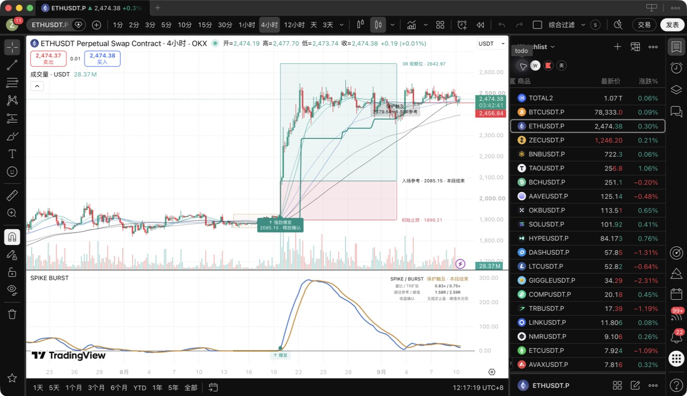
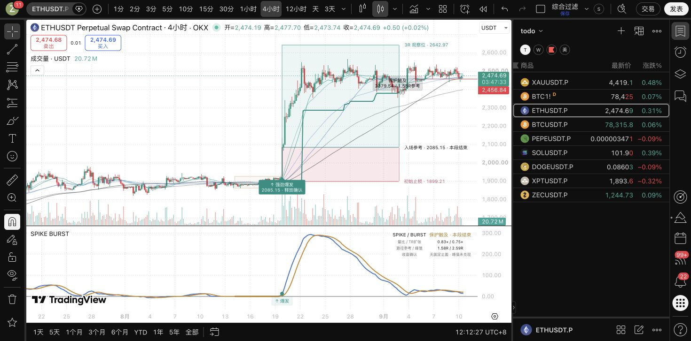

# SPIKE 强劲爆发 V1：盈亏框恢复验收

2026-09-10，北京时间。工程显示修复已完成，并保存到原同名 TradingView 私有脚本版本 4（12:09）。Mac 应用刷新后已实际显示。信号、初始风险计算、保护线和退出规则保持原样。

## 原因与调整

旧版只画入场线、初始止损线与 94% 透明度的红色填充，没有完整的红绿盈亏双框；线条读取前根已生效状态，信号当根尚不显示风险区域。

| 项目 | 原 V1 | 显示修复版 |
| --- | --- | --- |
| 信号当根 | 没有完整盈亏框 | 收盘确认后立即画红绿双框 |
| 红色区域 | 很淡的填充 | 入场参考到固定初始止损的风险框 |
| 绿色区域 | 无独立收益框 | 先展示 3R 观察位，确认峰值超过 3R 后继续扩展 |
| 结束后 | 原有线条状态 | 固定保留当段双框和价位，默认保留最近 8 组 |
| 信号与退出 | 冻结 V1 | 原始代码逐字节保留 |

3R 是观察位，不是强制止盈。绿色框超过 3R 后表示这段行情曾达到的参考浮盈，不是已经成交兑现的利润；真正的保护仍看原有跟踪保护线。图中的入场价仍是信号收盘参考。

新增设置在“05 · 趋势盈亏框”：显示盈亏双框、保留组数、当前框向右展示根数；还需原有风险显示开关开启。六条均线和副图的零轴、主线、信号线未改。

## 原生显示证据

ETHUSDT.P 4H 同一历史段：入场参考 2085.15，初始止损 1899.21，3R 观察位 2642.97。该段框已结束并固定保留，旧的逐步抬升保护线仍在。





原生编译第一次发现 Pine 保留字 `text` 被用作辅助函数参数，报 CE10150；已改为 `caption`，随后版本 4 编译通过并实际渲染。Pine 编辑器复制全文、统一 CRLF 为 LF 后，与本地发行源码完全相同。图表已保存，自动保存已恢复开启。Mac 刷新后重新加载了服务器当前的 Watchlist；尝试恢复之前缓存的 todo 列表时出现账户升级提示，已关闭提示，未修改列表内容。

## 验证与复现

发行源码：`yoyo/evaluation/pine/spike_burst_v1_display.pine`。冻结回测源码 `yoyo/evaluation/pine/spike_burst_v1.pine` 未修改。

- 冻结源 SHA256：`18bbb6955fdf12e124688003799c44fc2a641f11a342edcf478157b1c9641fe2`。
- 显示发行源 SHA256：`1fc6ec83ca035a371c1146edf86c0ca1f628678ea069bfd1f26ec8c77c7f952c`。
- 两项 Python 源码契约通过：移除声明的新增显示块后，整文件等于冻结源；新增状态不能写入原信号/风控状态。
- 独立代码复核通过：多空方向、信号当根、退出冻结、对象保留数量与时间坐标；图形对象预算低于原上限。
- 原生验收：私有脚本版本 4、编译无错误、ETH 4H 已结束长仓双框、Mac 刷新后显示。

```bash
cd /Users/zhangzc/fable-trading
.venv/bin/python -m pytest tests/test_spike_burst_display_contract.py -q
shasum -a 256 yoyo/evaluation/pine/spike_burst_v1.pine yoyo/evaluation/pine/spike_burst_v1_display.pine
.venv/bin/python scripts/md_to_html.py analysis/p0_spike_burst_risk_display_20260910.md --out-dir analysis/html
```

原生复现：在 TradingView 原私有脚本编辑器加载发行源码，保存并更新图表；观察 ETHUSDT.P 4H，对照截图与三个价格。源码契约检查不是 Pine 编译器，须分别验证。

## 风险与诚实声明

本轮只修显示，不进行参数搜索或收益评分。候选数、正类率、val 样本数、AUC、置换 p、top-decile 收益、胜率及匹配随机入场不适用；对应的严格不变性对照是移除新增显示块后完整原源码 SHA 一致，并且显示层不能改变信号状态。

Owner 此前允许任意日期；本轮仅观察已讨论历史图的显示效果，没有增加收益 holdout 消耗、训练或 promote。收益研究仍见[冻结 V1 两个月回测](p1_spike_burst_validation_20260910.html)，该回测未确认稳定收益优势。

本次原生截图验收覆盖 ETH 4H 浅色主题长仓；空仓几何与对象生命周期通过代码复核，未冒充所有币种、周期、主题的截图验收。图中参考价格和最大浮盈不代表实际成交。线上监控、Bark、执行和账户配置没有改动。

下一步可依据真实使用反馈调整标签间距与透明度；无需为显示修复重新调信号参数。
