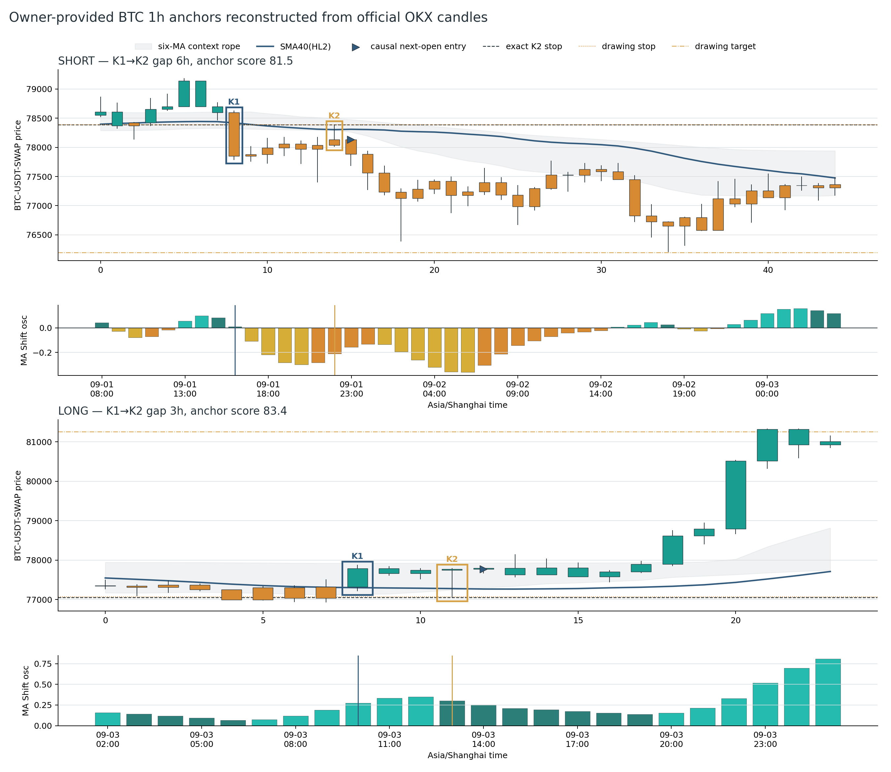
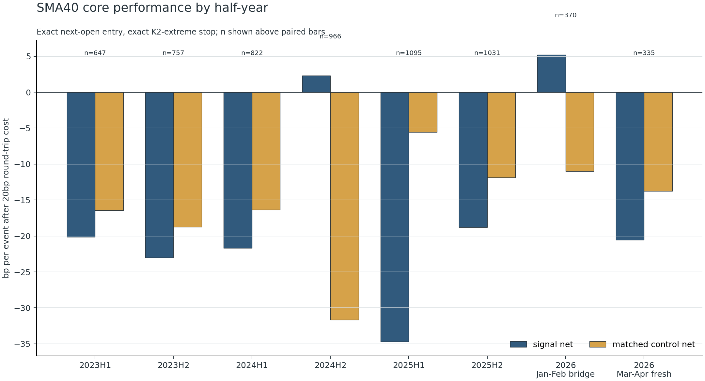
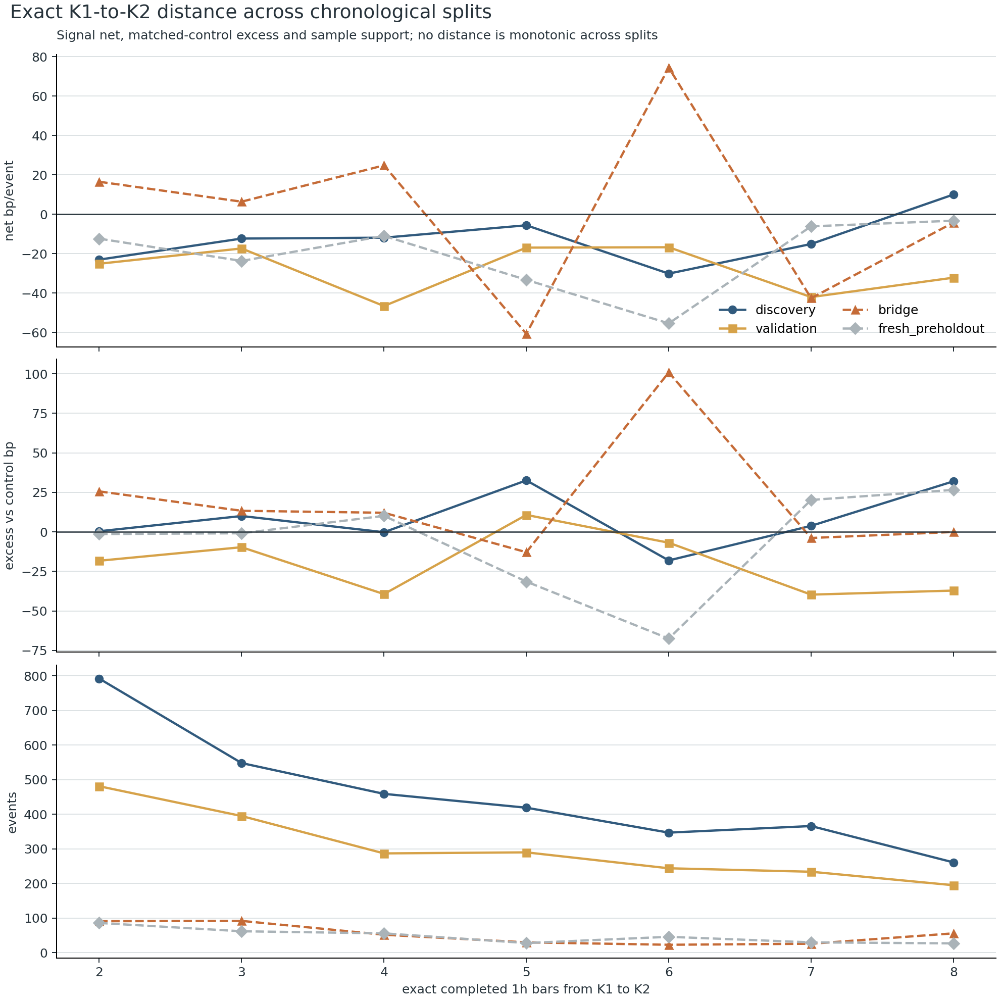
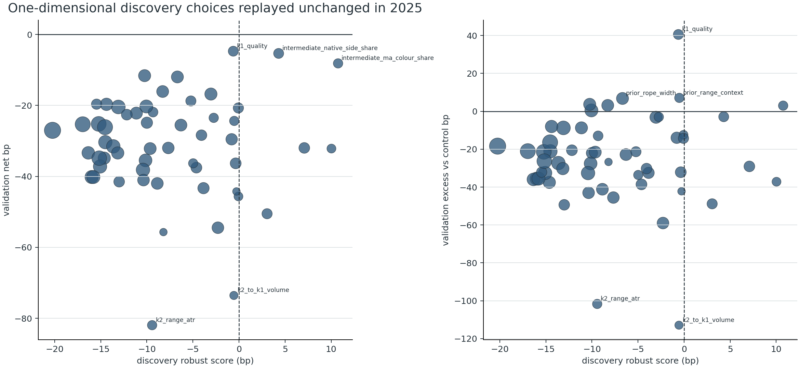
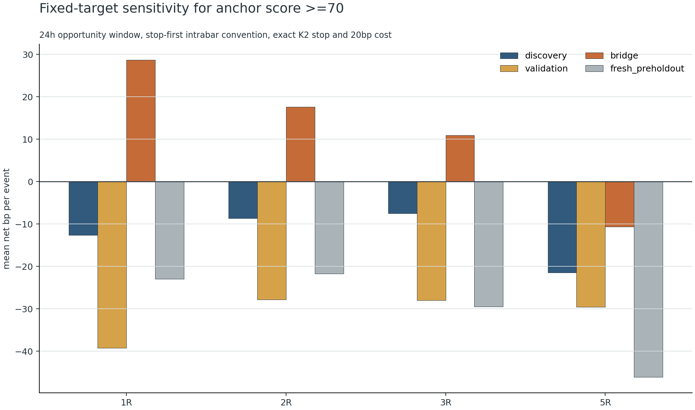
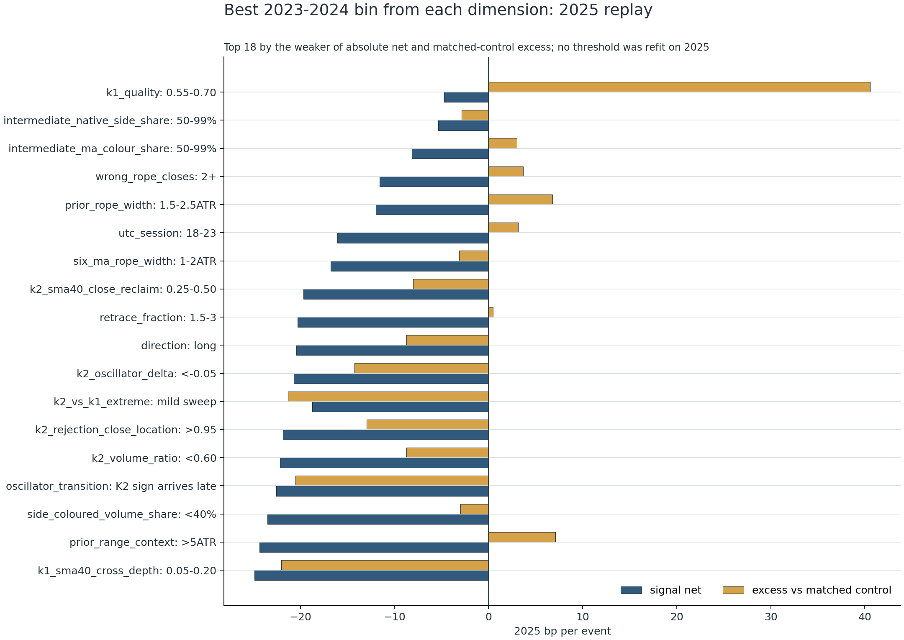

# P0 — 两根关键 K 线 + SMA40 回踩：55 维因果拆解与盈利性证伪（2026-09-04）

> 图表：BTCUSDT 永续，1 小时。按上下文把 owner 所说的“引力能力”理解为**盈利能力**。
> **结论先行：这个形态已经可以被严谨定义和复现，但当前没有任何可交付实盘的盈利参数。**
> 量化研究未读取 2026-05-04 起的项目 holdout；未训练、未 promote、未改 ACTIVE、未改成本或障碍参数。

## 结论摘要

| 问题 | 结论 |
|---|---|
| 图里的核心逻辑能否精确定义？ | **可以。** K1 是穿越 `SMA40(HL2)` 的方向性启动棒；K2 是 2–8 根后以方向侧影线触碰 SMA40、收盘重新站回趋势侧的拒绝棒。六均线绳、颜色、振荡器、结构、量能和中间路径均可作为因果描述维度。 |
| 两张图例是否符合这套语义？ | **符合度很高。** 空头/多头锚点得分分别为 81.54/83.44，但两者在距离、K1 穿线深度、K2 原生颜色、是否扫过 K1 极值上并不相同。 |
| “越像图例”是否越赚钱？ | **不是。** `anchor_score >=70` 历史净收益 -31.5bp，2026-03/04 净收益 -54.4bp；`>=80` 的新鲜 pre-holdout 4 笔全部止损。形态分数的 AUC 在新鲜段仅 0.313。 |
| 距离是不是漏掉的关键？ | **已逐个检验 2–8 根。** 发现期只有 gap=8 为正，2025 同一参数变成 -32.2bp；图例对应 gap=3/6 在 2025 分别 -17.3/-16.7bp，新鲜段分别 -23.7/-55.3bp。没有稳定甜点。 |
| 55 个维度有没有一个跨期通过？ | **0 个。** 42 个原始预注册维度、13 个补充诊断维度，按发现期单变量选箱后原样复放到 2025；绝对净收益 + 匹配对照超额 + 稳定性 + 多重检验的联合门通过数为 0。 |
| 当前“最优参数”是什么？ | 对**形态标注/候选召回**，保留宽口径 SMA40 状态机；对**交易执行**，最优决策是暂不启用。继续从这 55 维里硬挖阈值只会把时间噪声拟合成答案。 |

这里最重要的认识是：**视觉形态分数是“像不像 owner 范例”的相似度，不是交易置信度。** 两者必须分开建模和验收。

## 图上指标到底在表达什么

### 1. 可见主线是 `SMA40(HL2)`，不是六均线绳

图中 [Moving Average Shift（ChartPrime）](https://www.tradingview.com/script/aApUyBnk-Moving-Average-Shift-ChartPrime/) 的当前设置是：

- 均线：`SMA((high + low) / 2, 40)`；
- K 线着色：`HL2 >= SMA40` 为青色，否则为橙色；
- 因此颜色表示**价格位于均线哪一侧**，不等于原生 `close > open` 的红绿；
- 振荡器先算 `diff = HL2 - SMA40`，用过去 1000 根的 99 分位归一化，再对 `change(diff / percentile, 15)` 做 `HMA(10)`；
- 振荡器的四种颜色分别编码“正/负 × 加速/减速”，不是四档胜率；
- 图上的 ±0.5 是振荡器阈值，不是 50% 概率。

这解释了一个肉眼很容易误判的细节：**空头 K2 的原生实体是上涨棒，但 MA Shift 仍把它涂成空头侧颜色。** 所以原生 K 线颜色不能设为硬条件。

隐藏的“双均线 20/60/120”在研究中被还原为六条线：`SMA/EMA × 20/60/120`。它们的最小值到最大值构成“绳带”，用于描述压缩、排序和斜率；它不是这两张图里 K1/K2 接触关系的主参考线。V1 把绳带当主线后出现了典型的发现期好、验证期崩溃，V2 因此改回可见 SMA40。

### 2. Market Break 是延迟确认的结构状态，不是即时预言

[Market Break Analytics（ChartPrime）](https://www.tradingview.com/script/0vET13Ra-Market-Break-Analytics-ChartPrime/) 当前为 pivot 10/10：一个以第 `j` 根为中心的 pivot，必须再等右侧 10 根完成后才确认；只有收盘穿过最近已确认 pivot 才切换结构状态。因此：

- 在 1h 图上，结构 pivot 天生至少延迟 10 小时；
- 它适合作为“已有结构背景”，不能冒充 K2 当下才知道的领先信号；
- 图上的 71/29 来自一段 swing 内“上涨实体棒成交量 / 下跌实体棒成交量”的比例，不是订单流买卖主动性，更不是上涨概率。

### 3. 图上的仓位框会改变纵轴观感

右侧未来区域的止盈/止损绘图会压缩图表纵轴。红色仓位框的边界是交易绘图，不是天然阻力位。形态测量一律使用原始 OHLC、ATR 和均线值，不能从截图像素高度直接推断波动或斜率。

## 可执行的因果状态机

以下所有描述特征最多使用到 K2 收盘；只有标签/收益允许看 K2 之后。

### K1：启动棒

方向统一编码为 `d=+1`（多）或 `d=-1`（空）：

- 实体方向与 `d` 一致；
- 实体占全棒范围至少 0.50；
- 全棒范围至少 1.00 ATR；
- 方向化收盘位置至少 0.75，即收在 K1 的方向侧四分之一；
- K1 的开、收相对 SMA40 的最小穿越深度至少 -0.05 ATR；负的 0.05 容许数据源/视觉误差和“几乎贯穿”；
- 连续保留：实体占比、范围 ATR、穿线深度、成交量倍率、MA 颜色、振荡器符号/加速度、Market Break 状态。

### K1→K2：距离与路径

不只记录“隔了几根”，还记录：

- 精确距离 2、3、4、5、6、7、8；
- K1/K2 收盘距离、K2 是否扫过 K1 极值；
- 中间收盘路径总变差 `sum(abs(delta close)) / ATR`；
- 路径效率 `方向化净位移 / 总变差`；
- 回踩前最大顺向延伸、回撤比例；
- 中间有几根收在 SMA40/六线绳的错误侧；
- 中间 MA Shift 颜色和原生实体颜色的方向一致比例；
- K1/K2 实体重叠、两棒成交量比。

这部分正面回应“**K 线之间的距离为什么不分析**”：距离不仅逐根检验，还与路径曲折、错误侧收盘、延伸后回撤分开建模，避免把相同 gap 的两条完全不同价格路径混成一种形态。

### K2：触线拒绝棒

- 方向侧影线占全棒范围至少 0.45；
- 实体占比至多 0.50；
- 方向化拒绝收盘位置至少 0.65；
- 影线相对 SMA40 的触碰深度为 -0.05 到 1.50 ATR；
- 收盘必须回到 SMA40 的趋势侧；
- 下一根开盘到 K2 极值的风险为 0.15–2.50 ATR；
- 连续保留 K2 范围、量能、原生/MA 颜色、振荡器、结构状态和 K1/K2 相对关系。

### 入场与止损：图上说法需要一个因果修正

如果要先看到 K2 的完整影线、实体和收盘位置，**最早无前视入场是 K2 结束后的下一根开盘**。在 K2 开盘价入场、同时又用 K2 完整形态筛选，等于事后知道这一小时将如何收线。

本研究固定：

- 入场：`open[K2 + 1]`；
- 多头止损：K2 最低价；空头止损：K2 最高价；无 buffer；
- 同一根同时碰止损和目标：止损优先；
- 研究主观察窗：24 根 1h；12/48 根为敏感性；
- 往返成本：固定 0.2%，未调。

若 owner 真正想“在 K2 形成过程中开仓”，必须另建一个 15m 内部状态机：先出现触线，再出现 15m 收回/突破触发，然后才下单。那是另一条可验证的因果假设，不能用 1h 完整 K2 的事后形态来模拟。

## 两张 owner 图例逐根回放



数据来自 OKX 官方 `BTC-USDT-SWAP` 1H 历史 K 线接口；官方文档说明返回顺序为 `[ts,o,h,l,c,vol,...,confirm]`，其中 `confirm=1` 代表完整 K 线：[OKX Market Data API](https://app.okx.com/docs-v5/en)。这里仅按 owner 明确指定的当前图例提取形态，不计算这两笔之后的收益，也不把它们放进参数选择。

### K1/K2 形态细节

| 方向/棒 | 上海时间 | OHLC | 范围/ATR | 实体占比 | 方向侧收盘/拒绝 | 量/前20 | SMA40 关系 | 颜色与状态 |
|---|---|---|---:|---:|---:|---:|---|---|
| 空 K1 | 09-01 16:00 | 78599.4 / 78628.5 / 77785.0 / 77849.0 | 1.83 | 0.890 | 0.924 | 2.71× | 完整穿越 0.391 ATR | MA 色✓；振荡器符号尚未转空、但加速度已向空；结构空✓ |
| 空 K2 | 09-01 22:00 | 78038.1 / 78388.0 / 78011.8 / 78135.5 | 0.83 | 0.259 | 上影拒绝 0.671 | 1.91× | 上影深入 SMA40 0.186 ATR，收回空侧 0.370 ATR | **原生上涨棒**；MA 色空✓；振荡器空✓但冷却；结构空✓ |
| 多 K1 | 09-03 10:00 | 77321.3 / 77875.9 / 77209.0 / 77785.4 | 1.48 | 0.696 | 0.864 | 1.41× | 与 SMA40 仅差 -0.048 ATR，属于近似贯穿；未穿完整六线绳 | MA 色✓；振荡器符号/加速度多✓；结构多✓ |
| 多 K2 | 09-03 13:00 | 77746.7 / 77798.9 / 77050.0 / 77772.0 | 1.67 | 0.034 | 下影拒绝 0.964 | 1.64× | 下影深入 SMA40 0.506 ATR，收回多侧 1.104 ATR | 原生/MA 色多✓；振荡器多✓但冷却；结构多✓ |

### 两根 K 线之间的关系

| 维度 | 空头图例 | 多头图例 | 语义 |
|---|---:|---:|---|
| K1→K2 距离 | 6 根 | 3 根 | 两张图本身已经否定“只能固定一个距离” |
| K2 相对 K1 收盘 | -0.623 ATR | -0.030 ATR | 空头 K2 收盘有明显回抽；多头几乎回到 K1 收盘 |
| K2 相对 K1 极值 | 保持 0.523 ATR | **下扫 0.353 ATR** | “K2 必须 higher-low/lower-high”不是共同条件 |
| 路径总变差 | 1.021 ATR | 0.500 ATR | 空头中间更曲折 |
| 回踩前顺向延伸 | 0.974 ATR | 0.138 ATR | 两者延伸幅度不同 |
| 中间错误侧 SMA40 收盘 | 0 | 0 | 这是两张图的共同视觉连续性 |
| 中间 MA 侧颜色比例 | 100% | 100% | 共同点，但历史上不形成稳定收益优势 |
| K2/K1 成交量 | 0.689 | 1.172 | K2 不必统一缩量 |
| 形态得分 | 81.54 | 83.44 | 只表示相似度，不表示获利概率 |

### 图中画法与真实因果价格

| 方向 | 最早因果入场 | 图中入场 | 精确 K2 止损 | 图中止损 | 差异 |
|---|---:|---:|---:|---:|---|
| 空 | 78135.5 | 78038.1 | 78388.0 | 78386.8 | 图中入场是 K2 开盘，若依赖完整 K2 则前视；止损比最高点少 1.2 |
| 多 | 77771.9 | 77771.9 | 77050.0 | 77068.0 | 入场与下一开盘一致；止损比最低点高 18.0 |

所以图上的核心语义成立，但要回测时必须把入场和止损画法纠正为可执行口径。

## 数据、切分与对照设计

| 项 | 设计 |
|---|---|
| 市场 | 当前缓存中的 54 个 OKX USDT 永续；BTC 单独做转移检查 |
| 原始粒度 | 15m；每 4 根完整无缺口地聚合为 UTC 1h |
| 核心候选 | V3 使用冻结的 SMA40 宽口径，共 6,023 个独立事件 |
| 发现期 | 2023-01-01 至 2024-12-31，n=3,192 |
| 未参与选择的验证期 | 2025-01-01 至 2025-12-31，n=2,126 |
| bridge | 2026-01/02，n=370，只解释时变性 |
| 新鲜 pre-holdout | 2026-03/04，n=335；该窗口已被 V2 打开，V3 新增维度只作描述 |
| 禁止区 | 量化事件 K2 一律早于 2026-05-04；统一校验得到 holdout rows=0 |
| 匹配随机对照 | 每事件严格 3 个：同币 × 同月 × 同 UTC 六小时段 × 同币同月 ATR 五分位；复制方向、观察窗、止损 ATR 距离和 0.2% 成本；排除宽口径信号棒 |
| 选择纪律 | 每次只看一个维度；发现期选一个箱后冻结；不搜索交互 |
| 稳健分数 | `min(整体净收益, 整体对照超额, 半年净收益中位数, 半年超额中位数)` |
| 统计 | 10,000 次符号翻转/置换，按 symbol 聚类 bootstrap 置信区间；原始 42 维与补充 13 维分别做 FDR |

当前 54 币是“今天仍在缓存里的存活者集合”，不是历史时点上市全集；这会产生存活偏差，已在风险部分列明。

## 三轮实验：从看似成功到完整证伪

| 版本/口径 | 时段 | n | 净收益 bp | 对照 bp | 配对超额 bp | PF | p | 结论 |
|---|---|---:|---:|---:|---:|---:|---:|---|
| V1 六线绳 + 发现期贪心阈值 | 2023–24 非 BTC | 558 | **+25.8** | -35.1 | **+60.9** | 1.319 | 0.0002 | 发现期看似强 |
| 同一 V1 冻结规则 | 2025 非 BTC | 388 | **-14.5** | -13.1 | -1.4 | 0.829 | 0.535 | 完全不泛化 |
| V1 转移到 BTC | pre-holdout | 25 | -13.2 | -34.9 | +21.7 | 0.663 | 0.127 | 样本小且仍亏 |
| V2 SMA40 宽核心 | 2023–2026-02 | 5,688 | -17.8 | -16.0 | -1.8 | 0.817 | 0.661 | 无优势 |
| 同一宽核心 | 2026-03/04 | 335 | -20.6 | -13.8 | -6.8 | 0.756 | 0.676 | 新鲜段失败 |
| V2 图例相似分 ≥70 | 历史 | 998 | -31.5 | -25.6 | -5.9 | 0.697 | 0.735 | 越像不越赚 |
| 同一 ≥70 | 2026-03/04 | 72 | **-54.4** | -4.5 | **-49.9** | 0.427 | 0.961 | 明显更差 |
| V2 图例相似分 ≥80 | 2026-03/04 | 4 | -156.7 | -50.3 | -106.3 | 0.000 | 0.876 | 4/4 止损 |
| V3 55 个单变量族 | 2025 验证 | 55 族 | 通过数 **0** | — | 通过数 **0** | — | FDR 后 0 | 无稳定参数 |

V1 的冻结参数是 K1 实体≥0.75、范围≥1 ATR、量≥1.5×、止损距离 0.15–1.5 ATR、回踩前延伸≤1 ATR、绳带顺向斜率≥0。它在发现期有漂亮数字，但验证期立刻消失。这就是为什么本轮不再把“发现期最优”当答案。

## 时间稳定性：收益不是一个常数



| 半年 | n | 净收益 bp | 匹配对照 bp | 配对超额 bp | PF | 止损率 |
|---|---:|---:|---:|---:|---:|---:|
| 2023H1 | 647 | -20.2 | -16.5 | -3.7 | 0.759 | 82.5% |
| 2023H2 | 757 | -23.0 | -18.7 | -4.2 | 0.713 | 82.2% |
| 2024H1 | 822 | -21.7 | -16.3 | -5.4 | 0.786 | 81.3% |
| 2024H2 | 966 | +2.3 | -31.7 | +33.9 | 1.022 | 76.7% |
| 2025H1 | 1,095 | **-34.7** | -5.6 | **-29.1** | 0.689 | 82.6% |
| 2025H2 | 1,031 | -18.8 | -11.8 | -6.9 | 0.807 | 82.3% |
| 2026-01/02 bridge | 370 | +5.2 | -11.0 | +16.2 | 1.060 | 73.0% |
| 2026-03/04 fresh | 335 | -20.6 | -13.8 | -6.8 | 0.756 | 80.0% |

只有 2024H2 和 bridge 为正，前后都失败。这不像稳定结构优势，更像阶段性 beta/波动环境。

## 距离：2–8 根全部逐项检验



| gap | 发现期 n / 净bp | 2025 n / 净bp | 2026-03/04 n / 净bp | 结论 |
|---:|---:|---:|---:|---|
| 2 | 792 / -23.0 | 481 / -25.1 | 86 / -12.4 | 始终负 |
| **3** | 548 / -12.3 | 395 / **-17.3** | 62 / **-23.7** | 多头图例距离；仍负 |
| 4 | 459 / -11.9 | 287 / -46.5 | 56 / -11.0 | 始终负 |
| 5 | 419 / -5.6 | 290 / -16.9 | 28 / -33.3 | 始终负 |
| **6** | 347 / -30.1 | 244 / **-16.7** | 46 / **-55.3** | 空头图例距离；更差 |
| 7 | 366 / -15.1 | 234 / -42.0 | 30 / -6.1 | 始终负 |
| 8 | 261 / **+10.0** | 195 / **-32.2** | 27 / -3.3 | 发现期假甜点，未泛化 |

因此不能把 gap=3、6 或 8 升格成盈利参数。合理做法是把 2–8 作为候选召回范围，把精确距离留给后续独立数据判断。

## 颜色、振荡器与结构：共同视觉语言，不是收益开关

两张锚点共同呈现：K1 有顺向加速度，K2 振荡器符号仍顺向但开始冷却；两根 MA Shift 颜色都在趋势侧；Market Break 状态都一致。历史检验如下：

| 状态 | 发现期 n / 净 / 超额 bp | 2025 n / 净 / 超额 bp | 新鲜 n / 净 / 超额 bp |
|---|---:|---:|---:|
| K1 impulse → K2 同向但冷却 | 648 / -16.6 / -5.4 | 515 / -27.9 / -19.1 | 91 / **-63.8 / -39.1** |
| K1/K2 MA 颜色都同向 | 1,018 / -16.7 / +11.2 | 692 / -24.7 / -9.8 | 121 / -21.5 / -5.7 |
| SMA40 宽核心整体 | 3,192 / -14.4 / +4.5 | 2,126 / -27.0 / -18.4 | 335 / -20.6 / -6.8 |

颜色值得保留，因为它把图表语义编码清楚；但不能因为颜色“齐了”就提高仓位或通过信号。

## 相似度得分没有排序能力



- 55 个发现期稳健分与 2025 净收益的 Pearson 相关仅 0.003，Spearman -0.015；
- 与 2025 匹配对照超额的 Pearson -0.032，Spearman -0.044；
- `anchor_score >=70` 的历史 AUC 0.464，新鲜段 AUC 0.313，方向还低于随机；
- 宽核心的质量分 top-decile：历史毛收益 -13.5bp、净 -33.5bp、对照 -20.8bp，置换 p=0.928；新鲜净 -67.5bp、对照 -14.1bp，p=0.923；
- 单特征基线 `K2 wick share` 的 top-decile：历史毛 +21.8bp、净 +1.8bp、置换 p=0.042；新鲜毛 -8.1bp、净 -28.1bp、p=0.561。它没有跨期通过，更没有达到项目要求的 p<0.01。

这组证据直接否定“再把形态分调细一点就会赚钱”。

## 严格复刻图例反而更差

| 冻结口径 | 历史 | 2026-03/04 | 解释 |
|---|---|---|---|
| 宽 SMA40 核心 2–8 | n=5,688，净 -17.8bp | n=335，净 -20.6bp | 候选召回层 |
| owner 形态 3–6 | n=14，净 **-154.2bp** | n=2，净 **-111.9bp**，2/2 止损 | 样本骤减且变坏 |
| owner 状态 3–6 | n=2，净 -271.6bp，2/2 止损 | n=0 | 过严、无支持 |
| owner 状态 2–8 | n=4，净 +14.8bp，p=0.244 | n=0 | 4 笔不能定参数 |
| score ≥80 | 历史 n=87，净 -26.7bp | n=4，净 -156.7bp | 高相似度不是高期望 |
| score ≥90 | 历史 n=2，净 -250.1bp | n=0 | 极端相似完全无证据 |

## 换止盈、降成本也救不了



`anchor_score >=70` 在 24h 内改用固定目标：

| 目标 | 发现期净bp | 2025净bp | bridge净bp | 2026-03/04净bp |
|---:|---:|---:|---:|---:|
| 1R | -12.6 | -39.2 | +28.7 | -22.9 |
| 2R | -8.6 | -27.8 | +17.6 | -21.7 |
| 3R | -7.5 | -28.0 | +10.9 | -29.5 |
| 5R | -21.4 | -29.5 | -10.6 | -46.1 |

零成本也不能解释失败：score≥70 在发现/2025/新鲜段的**毛收益**分别为 -16.1/-10.3/-34.4bp。宽核心在零成本下只有发现期 +5.6bp、bridge +25.2bp；2025 -7.0bp、新鲜 -0.6bp。当前问题先于手续费。

BTC 也没有特殊豁免：SMA40 核心 24h 在发现期 n=65、净 -30.7bp；2025 n=33、净 -41.1bp；新鲜 n=7、净 -32.1bp。

## 55 维完整复放结果

下表每行只改变一个维度。选中箱只由 2023–24 决定；2025 和 2026-03/04 不参与该箱选择。`补充诊断`表示第一轮看过 2025 后才为完整性补登记，因此不能当确认性证据。所有行的 2025 联合门均失败。



| 维度 | 注册层级 | 发现期选中箱 | 2025 n | 2025 净bp | 2025 超额bp | 2026-03/04 n | 2026-03/04 净bp | 2026-03/04 超额bp |
|---|---:|---|---:|---:|---:|---:|---:|---:|
| `direction` | 原始 | long | 1092 | -20.4 | -8.7 | 170 | -12.0 | -5.9 |
| `gap_exact` | 原始 | 8 | 195 | -32.2 | -37.2 | 27 | -3.3 | 26.5 |
| `gap_band` | 原始 | 7-8 | 429 | -37.5 | -38.6 | 57 | -4.8 | 23.2 |
| `k1_sma40_cross_depth` | 原始 | 0.05-0.20 | 504 | -24.9 | -22.0 | 75 | -19.9 | 8.0 |
| `k1_body_share` | 原始 | 0.50-0.65 | 399 | -41.5 | -49.4 | 66 | -41.0 | -13.8 |
| `k1_range_atr` | 原始 | >2.50 | 99 | -55.7 | -26.7 | 12 | -74.2 | -91.8 |
| `k1_close_location` | 原始 | 0.82-0.88 | 503 | -43.3 | -32.5 | 76 | -60.4 | -43.5 |
| `k1_volume_ratio` | 原始 | <0.8 | 406 | -32.0 | -29.1 | 71 | 9.6 | 13.0 |
| `k1_ma_colour` | 原始 | aligned | 992 | -30.4 | -21.1 | 171 | -14.3 | 7.4 |
| `k1_oscillator_sign` | 补充诊断 | aligned | 1020 | -31.5 | -27.3 | 200 | -23.0 | -14.7 |
| `k1_oscillator_acceleration` | 原始 | opposite | 823 | -35.5 | -27.5 | 119 | 21.4 | 33.0 |
| `k1_structure_state` | 原始 | aligned | 909 | -40.2 | -35.5 | 135 | -14.6 | -2.1 |
| `k1_quality` | 补充诊断 | 0.55-0.70 | 305 | -4.7 | 40.6 | 58 | 10.6 | 32.7 |
| `k2_wick_share` | 原始 | 0.45-0.60 | 785 | -33.4 | -35.9 | 119 | -2.2 | 17.7 |
| `k2_body_share` | 原始 | 0-0.10 | 529 | -29.5 | -14.0 | 76 | 6.5 | 27.6 |
| `k2_range_atr` | 原始 | 1.30-1.80 | 237 | -81.9 | -101.7 | 42 | -78.9 | -73.8 |
| `k2_rejection_close_location` | 补充诊断 | >0.95 | 281 | -21.9 | -13.0 | 50 | -23.8 | -44.7 |
| `k2_volume_ratio` | 补充诊断 | <0.60 | 664 | -22.2 | -8.7 | 100 | -6.2 | -1.1 |
| `k2_sma40_touch_depth` | 原始 | 0.40-0.80 | 626 | -25.5 | -22.8 | 104 | -5.9 | 23.6 |
| `k2_sma40_close_reclaim` | 原始 | 0.25-0.50 | 733 | -19.7 | -8.0 | 118 | 9.8 | 40.6 |
| `k2_native_body_colour` | 原始 | aligned | 1570 | -25.3 | -21.0 | 227 | -18.2 | -2.9 |
| `k2_ma_shift_colour` | 原始 | opposite | 697 | -34.8 | -37.5 | 109 | -8.1 | 17.4 |
| `k2_oscillator_sign` | 原始 | aligned | 1472 | -25.2 | -21.4 | 240 | -21.3 | -9.7 |
| `k2_oscillator_acceleration` | 原始 | opposite/cooling | 1005 | -38.2 | -32.6 | 165 | -22.7 | -10.4 |
| `k2_structure_state` | 原始 | aligned | 971 | -37.2 | -32.6 | 150 | -14.5 | 4.3 |
| `k2_break_event` | 补充诊断 | no directional break on K2 | 2113 | -27.0 | -18.4 | 332 | -19.3 | -6.8 |
| `k2_oscillator_level` | 补充诊断 | <-0.25 | 192 | -45.6 | -12.4 | 21 | -30.2 | 15.4 |
| `k2_oscillator_delta` | 补充诊断 | <-0.05 | 343 | -20.7 | -14.3 | 70 | -27.4 | -15.2 |
| `oscillator_transition` | 原始 | K2 sign arrives late | 417 | -22.6 | -20.5 | 63 | 41.9 | 58.0 |
| `ma_colour_transition` | 原始 | neither | 397 | -28.4 | -30.2 | 59 | -17.5 | -0.9 |
| `structure_transition` | 原始 | both aligned | 909 | -40.2 | -35.5 | 135 | -14.6 | -2.1 |
| `k2_vs_k1_extreme` | 原始 | mild sweep | 331 | -18.7 | -21.3 | 71 | -16.9 | 18.3 |
| `k2_vs_k1_close` | 原始 | extends 0.25-0.75 | 333 | -50.5 | -48.8 | 52 | -25.9 | -25.5 |
| `k1_k2_body_overlap` | 原始 | none | 599 | -42.0 | -41.1 | 100 | -21.3 | -16.5 |
| `k2_to_k1_volume` | 原始 | >2.00 | 143 | -73.6 | -112.9 | 22 | -57.5 | -19.1 |
| `stop_distance_atr` | 补充诊断 | 1.00-1.50 | 350 | -19.6 | -32.1 | 55 | -21.2 | 0.6 |
| `pre_retest_extension` | 原始 | 0.50-1.00 | 638 | -32.2 | -21.5 | 122 | -45.7 | -32.5 |
| `retrace_fraction` | 补充诊断 | 1.5-3 | 875 | -20.3 | 0.5 | 163 | -39.7 | -36.8 |
| `path_variation` | 原始 | >2.00 | 706 | -33.4 | -30.2 | 104 | -22.8 | -7.7 |
| `path_efficiency` | 原始 | 0-0.50 | 564 | -32.0 | -45.5 | 88 | -11.1 | -0.7 |
| `wrong_sma40_closes` | 原始 | 1 | 432 | -36.3 | -32.1 | 74 | -35.6 | -13.1 |
| `wrong_rope_closes` | 补充诊断 | 2+ | 661 | -11.6 | 3.7 | 76 | -4.6 | 23.9 |
| `intermediate_ma_colour_share` | 原始 | 50-99% | 239 | -8.1 | 3.0 | 38 | -22.3 | 20.8 |
| `intermediate_native_side_share` | 补充诊断 | 50-99% | 306 | -5.3 | -2.9 | 53 | -26.5 | -15.8 |
| `six_ma_rope_width` | 原始 | 1-2ATR | 677 | -16.8 | -3.1 | 133 | -16.0 | -9.4 |
| `six_ma_rope_slope` | 原始 | aligned/nonnegative | 1411 | -34.9 | -26.3 | 239 | -24.6 | -9.6 |
| `six_ma_order_alignment` | 补充诊断 | 6-11/12 pairs | 576 | -54.5 | -59.0 | 110 | -41.5 | -32.9 |
| `prior_rope_width` | 原始 | 1.5-2.5ATR | 636 | -12.0 | 6.8 | 116 | -22.4 | -9.0 |
| `prior_range_context` | 补充诊断 | >5ATR | 236 | -24.4 | 7.1 | 44 | -49.5 | -46.9 |
| `atr_release` | 原始 | <0.80 | 102 | -44.2 | -42.2 | 9 | 57.2 | 21.3 |
| `atr_percent_of_price` | 原始 | 1.6-2.5% | 576 | -41.0 | -43.0 | 38 | -120.1 | -87.8 |
| `side_coloured_volume_share` | 原始 | <40% | 240 | -23.5 | -3.0 | 27 | -32.3 | -48.9 |
| `utc_session` | 原始 | 18-23 | 617 | -16.1 | 3.1 | 94 | 20.7 | 29.8 |
| `weekpart` | 原始 | weekday | 1592 | -26.1 | -16.4 | 248 | -31.3 | -19.3 |
| `anchor_score` | 原始 | <50 | 229 | -36.3 | -33.6 | 43 | -22.1 | 1.1 |

表里最容易诱惑人的是补充诊断 `k1_quality 0.55–0.70`：2025 净 -4.7bp、对照 -45.3bp、超额 +40.6bp，新鲜段净 +10.6bp。但它仍有三个致命问题：2025 绝对亏损、发现期本身为 -0.6bp、该维度是在看过 2025 后补登记。不能拿来宣称找到盈利参数。

另一个事后看起来漂亮的箱是 `pre_retest_extension 0.25–0.50 ATR`，2025 约 +24.0bp、新鲜约 +12.7bp；但发现期为负，2025H1 -13.1bp、H2 +54.2bp、bridge -18.6bp，时间符号来回翻转。因此同样只是一条**下一轮可预注册的候选假设**，不是本轮结论。

## 当前最优参数：分成“识别”与“执行”两套答案

### 形态识别/标注口径（推荐保留）

| 模块 | 建议参数 | 为什么 |
|---|---|---|
| 主参考线 | `SMA40(HL2)` | 与图上实际可见指标一致 |
| 六线绳 | `SMA/EMA × 20/60/120`，只作上下文 | V1 证明把它当主线会错配图意并过拟合 |
| gap | 2–8，精确值作为特征，不硬选 3/6/8 | 覆盖两锚点；任何单一 gap 都未泛化 |
| K1 | 方向实体；body≥0.50；range≥1ATR；方向收盘≥0.75；SMA40 穿越深度≥-0.05ATR | 宽召回且可复现 |
| K2 | 方向侧影线≥0.45；body≤0.50；拒绝收盘≥0.65；SMA40 触深 -0.05..1.50ATR；收回趋势侧 | 把“影线踩线”量化，而不要求原生同色 |
| 风险几何 | 下一开盘到 K2 极值 0.15–2.50ATR | 排除零风险/极端宽止损的坏数据，不是盈利优化 |
| 颜色 | MA Shift 颜色、原生颜色分开存；不设硬同色门 | 空头图例 K2 已证明两者可冲突 |
| 路径 | gap、变差、效率、延伸、回撤、错误侧收盘、颜色连续性全部连续保存 | 不把路径信息压成一句“隔几根” |
| 图例分 | 作为标注相似度/检索分 | 历史证据禁止把它当交易置信度 |

这是一份 **L1 观察语言**，不是策略参数。

### 交易执行口径

当前最优状态是：`production_eligible=false`，不发真实信号。没有任何阈值组合同时满足：

1. 2025 扣 0.2% 后净收益为正；
2. 相对匹配随机对照为正；
3. 时间子段稳定；
4. 置换/FDR 通过；
5. 新鲜 pre-holdout 不翻车。

## 为什么这个形态视觉上有说服力，却没有盈利性

1. **它很好地描述了“发生过一次冲击与回踩”，但没有描述回踩后谁会继续接力。** K1/K2 都是形态描述，后续流动性、持仓拥挤和更高周期位置仍可完全不同。
2. **精确 K2 极值止损产生约 80% 止损率。** 核心事件的中位 MFE 约 1R、24h 触 2R 约 32–33%，但大部分最终仍被极值止损或回吐；固定 1/2/3/5R 也未救回期望。
3. **两张范例是结果显眼后被注意到的图。** 它们适合教机器“你在找什么”，不能估计基础胜率。
4. **视觉条件高度相关。** K1 大实体、MA 同色、结构同向、量放大常由同一次波动冲击共同造成；多加维度不等于多份独立信息。
5. **优势是时变的。** 2024H2、2026 Jan-Feb 短暂为正，2025H1 和随后新鲜段显著转负；静态阈值捕捉到的是阶段，而非不变量。
6. **“形态完成”与“可交易时点”存在一根棒的差。** 图上在 K2 开盘入场会系统性美化价格；改成 K2+1 才是可执行收益。

## 不受当前项目框架限制的下一代盈利架构

继续在 55 个形态维度里做组合搜索不值得。下一代应把系统拆成三个互不冒充的层：

1. **形态观测层**：只回答“这段是否像 owner 定的 K1→路径→K2”，输出可解释向量和相似度；不输出获利概率。
2. **因果接力层**：只使用入场时已经存在、且与形态不同源的信息判断“是否有人接力”。可独立预注册的候选包括更高周期趋势/位置、资金费率与基差、持仓量变化、清算冲击、盘口失衡、跨市场 BTC beta、波动状态转移。每次只增加一族，使用新的时间外数据。
3. **执行层**：比较 `K2+1 market` 与 15m 内部确认/限价回踩两套真实可成交路径，显式计滑点、未成交率和止损次序。它不能复用完整 1h K2 的未来信息。

最值得先做的两条、但本轮**尚未执行**的假设是：

- `pre_retest_extension 0.25–0.50 ATR` 作为单变量冻结候选，在全新 forward 数据上盲测；它目前只是事后不稳定线索；
- 15m 因果 K2 内部触发：先触 SMA40，再等一根 15m 回到趋势侧/突破微结构，才入场；同时记录未成交与更差价格。

如果这两条仍失败，应接受“形态只适合检索/标注，不适合独立交易”的结论，而不是继续抬高复杂度。

## 复现命令

```bash
# V1：六均线主参考的旧基线
PYTHONPATH=. .venv/bin/python scripts/research_two_key_candle_ma_retest_1h.py

# V2：改回图上的 SMA40(HL2)，冻结 owner 形态/状态分层
PYTHONPATH=. .venv/bin/python scripts/research_two_key_candle_ma_retest_sma40_v2.py

# V3：55 个因果维度逐维发现→2025 复放
PYTHONPATH=. .venv/bin/python scripts/analyze_two_key_candle_feature_atlas_v3.py

# owner 当前图例：只复放形态，不算事后收益（需要访问 OKX 公共接口）
PYTHONPATH=. .venv/bin/python scripts/replay_owner_two_key_candle_anchors.py

# 对三代产物统一审计：时间边界、下一开盘、精确止损、成本、对照覆盖、哈希
PYTHONPATH=. .venv/bin/python scripts/validate_two_key_candle_artifacts.py

# 交付 HTML
python3 scripts/md_to_html.py \
  analysis/p0_two_key_candle_ma_retest_deep_dive_20260904.md \
  --out-dir analysis/html
```

最新统一校验结果：

| 版本 | 审计事件行 | 币种 | 最早 K2 | 最晚 K2 | 量化 holdout 行 | 最大算术误差 |
|---|---:|---:|---|---|---:|---:|
| V1 | 971 | 54 | 2023-01-05 | 2026-02-25 | 0 | 1.98e-16 |
| V2 | 7,208（含重复分层行） | 54 | 2023-01-01 | 2026-04-30 | 0 | 1.98e-16 |
| V3 core | 6,023 | 54 | 2023-01-01 | 2026-04-30 | 0 | 1.98e-16 |

Docker 里现有镜像只有 Label Studio，适合后续 owner 标注，不提供本轮数值计算所需的额外优势；本轮直接使用仓库固定 Python 环境，避免为“用了 Docker”而引入版本漂移。

## 风险与诚实声明

1. **没有找到盈利策略。** 本报告的最大产出是把一个视觉直觉变成了可证伪状态机，并排除了 55 个常见“再调一下就好”的方向。
2. **当前两张 2026-09 图例属于 owner 明确要求的定性规格回放。** 它们位于项目 holdout 日期之后，但未计算这两笔的未来收益、未参与阈值选择、未给任何配置做 holdout 评分；量化验证事件严格为 0 holdout 行。不能把这两张的后验结果拿来替任何配置验收。
3. **当前币池有存活偏差。** 54 个币是当前缓存集合，历史退市/未存活资产缺失；绝对收益不能直接外推到历史可交易全集。
4. **OKX 与 TradingView 不是逐字节同源。** 1h 是从 OKX 15m 四根重建；owner 锚点另用 OKX 官方 1H。价格差、时区设置和数据修订可能造成细小边界差异。
5. **ChartPrime 结构是公开公式语义的因果复现。** pivot 10/10 与 close break 被还原，但 TradingView 多指标的最终着色层叠顺序可能影响肉眼颜色。
6. **补充 13 维不是确认性检验。** 它们在首轮打开 2025 后才登记；即使出现好看数字也只能形成下一轮假设。
7. **匹配对照控制了币、月、时段、ATR、方向、止损和成本，但不伪造一根随机 K2 影线。** 它回答“这一池是否优于同环境随机入场”，不回答所有可能的微结构反事实。
8. **没有改动敏感决策。** 未读量化 holdout、未训练、未更改 TP/SL 倍数、ATR 下限、0.2% 成本、新鲜度门、ACTIVE、forward_log 或真实仓位。

## 下一步选项（需 owner 决策）

- **A（推荐，P0）：把这套宽状态机作为标注语言。** owner 对一批候选同时标“形态真伪”和 K1/K2 边界；负例包含“像但不算”的 hard negatives。目的先是稳定重标，不是训练赚钱模型。
- **B（推荐，独立实验）：预注册 15m K2 内部因果触发。** 保持 1h 形态不变，只比较入场实现；障碍、成本或 ATR 下限若要改，需 owner 单独批准。
- **C（独立信息层）：选择一族当前项目外的信息。** 建议先在 OI/资金费率/清算或更高周期状态中四选一；不得一次打包，以免无法归因。
- **D（最低风险）：只做 shadow forward。** 图例相似度发观察告警，不下单，积累从未被筛选过的新样本；先到预注册样本量再揭盲。
- **E：现在消耗正式 holdout。** **不推荐。** 当前所有前置段都未通过，消耗 holdout 不会修复逻辑，只会浪费最后裁决数据。

在 owner 选择下一条之前，本轮的正确落点是：**形态定义保留，交易资格关闭。**
