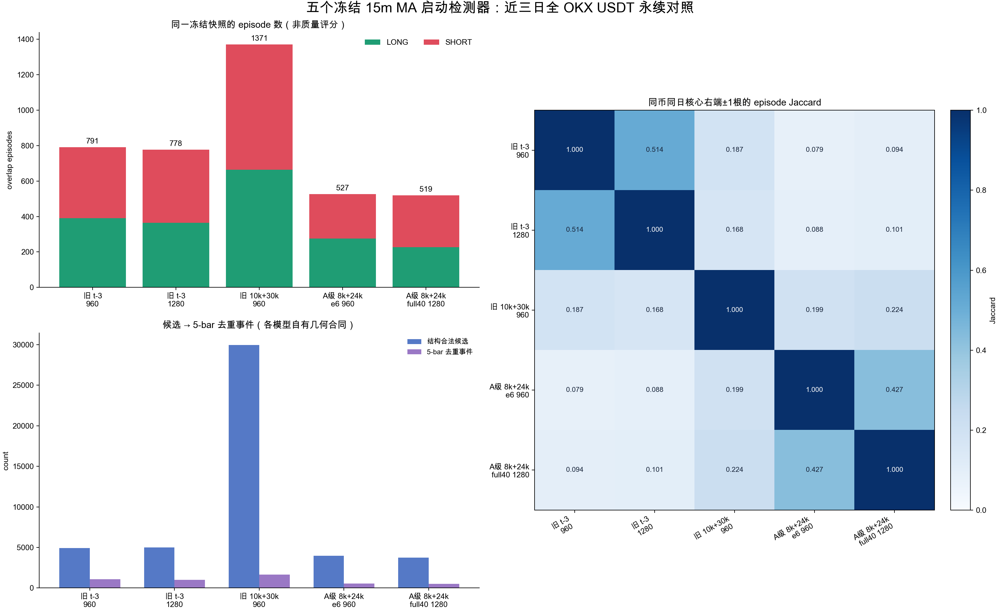

# 五个 15m 均线密集检测模型：近三天全币种冻结对照（2026-09-01）

## 技术结论

已在**同一份冻结的 OKX USDT 永续快照**上运行五个讨论过的 YOLO 权重。范围是 2026-08-28, 2026-08-29, 2026-08-30 UTC 三个完整日的全部可用 current-live crypto USDT-SWAP：**274 个币、822 个币日、每币 482 根连续且已确认的 15m K 线**。五个模型的源 OHLCV 文件逐字节相同；差异只来自各权重及其自己历史训练支持的窗口/核心/确认合同。

这是一份**形态提案输出对照**，不是收益回测，也没有宣称谁“最好”。总信号数、置信度和静态 mAP 都不能跨模型直接排优劣：旧 t-3、旧 10k+3万负样本、Grade-A 两臂的窗口与确认长度本来不同。最有用的可比信息是：同一币、同一天、核心右端相差不超过一根 15m K 时，它们是否还指向同一个 episode，是否方向一致。

## 范围、模型与输出

| 模型 | 原生 imgsz | 窗口 W | 核心根数 | 确认根数 | 合法候选 | 5-bar 事件 | episode | LONG / SHORT | 每100币日 episode | 本配置 holdout 使用 |
| --- | --- | --- | --- | --- | --- | --- | --- | --- | --- | --- |
| Legacy t-3 weak-label 10k · native 960 | 960 | 14/18/22 | 4/5/6/7 | 3/4/5 | 4909 | 1074 | 791 | 391 / 400 | 96.23 | 2 |
| Legacy t-3 weak-label 10k · native 1280 | 1280 | 14/18/22 | 4/5/6/7 | 3/4/5 | 5007 | 1010 | 778 | 364 / 414 | 94.65 | 1 |
| Owner 10k + 30k negatives · native 960 | 960 | 18/19/20/21/22/23/24/25 | 4/5 | 4/5/6 | 29954 | 1642 | 1371 | 664 / 707 | 166.79 | 6 |
| Grade-A 8k + 24k negatives · epoch 6 · native 960 | 960 | 18/19 | 4/5 | 2/3/4/5/6/7/8/9 | 3958 | 535 | 527 | 276 / 251 | 64.11 | 3 |
| Grade-A 8k + 24k negatives · full40 · native 1280 | 1280 | 18/19 | 4/5 | 2/3/4/5/6/7/8/9 | 3759 | 522 | 519 | 226 / 293 | 63.14 | 2 |

固定条件：`conf=0.25`、NMS IoU `0.70`、原模型的 normalized `cx/cy/w/h` 框保留、每个模型内部按同币同日重叠区间合并 episode、每张复盘图只有其代表原框。没有根据结果删信号、移动框或改变阈值。



上图左侧的数是输出密度，**不是 precision 或盈利能力**；右侧 Jaccard 才是在定义一致的同币同日核心时点上，两个模型看到同一形态的比例。

## 逐对 episode 身份一致性

| 左模型 | 右模型 | 时点重合 | 同向 | 反向 | Jaccard | 旋转零假设均值 | 零假设最大 | p(零假设≥实际) |
| --- | --- | --- | --- | --- | --- | --- | --- | --- |
| 旧 t-3 960 | 旧 t-3 1280 | 533 | 533 | 0 | 0.514 | 32.00 | 529 | 0.010 |
| 旧 t-3 960 | 旧 10k+30k 960 | 340 | 336 | 4 | 0.187 | 49.63 | 379 | 0.021 |
| 旧 t-3 960 | A级 8k+24k e6 960 | 97 | 97 | 0 | 0.079 | 21.35 | 204 | 0.042 |
| 旧 t-3 960 | A级 8k+24k full40 1280 | 113 | 113 | 0 | 0.094 | 20.74 | 219 | 0.042 |
| 旧 t-3 1280 | 旧 10k+30k 960 | 309 | 300 | 9 | 0.168 | 49.72 | 345 | 0.021 |
| 旧 t-3 1280 | A级 8k+24k e6 960 | 106 | 104 | 2 | 0.088 | 21.47 | 192 | 0.042 |
| 旧 t-3 1280 | A级 8k+24k full40 1280 | 119 | 119 | 0 | 0.101 | 20.92 | 214 | 0.042 |
| 旧 10k+30k 960 | A级 8k+24k e6 960 | 315 | 314 | 1 | 0.199 | 33.05 | 353 | 0.021 |
| 旧 10k+30k 960 | A级 8k+24k full40 1280 | 346 | 341 | 5 | 0.224 | 31.80 | 390 | 0.021 |
| A级 8k+24k e6 960 | A级 8k+24k full40 1280 | 313 | 311 | 2 | 0.427 | 15.43 | 297 | 0.010 |

零假设不是收益或价格结果：对每一个右侧模型，在每个币的每个 UTC 日内把核心右端做 1–95 根的循环位移，保留它的 episode 数、方向、置信度、同日间距和币种分布，再重新计算同一时点的重合。表中的 `p` 是 95 种非零位移中“重合数至少与实际一样多”的比例（加一校正）。它只回答“两个模型的相同时间提案是否超过偶然错位”，不回答形态是否盈利或标注是否 Gold。

## 置信度：仅供每个模型内部排序

| 模型 | P10 | 中位数 | P90 | 均值 |
| --- | --- | --- | --- | --- |
| 旧 t-3 960 | 0.258 | 0.294 | 0.356 | 0.300 |
| 旧 t-3 1280 | 0.259 | 0.299 | 0.371 | 0.309 |
| 旧 10k+30k 960 | 0.307 | 0.642 | 0.922 | 0.625 |
| A级 8k+24k e6 960 | 0.302 | 0.598 | 0.927 | 0.611 |
| A级 8k+24k full40 1280 | 0.288 | 0.534 | 0.892 | 0.563 |

这些数不能横向理解为“哪个模型更自信/更准确”。YOLO 分数没有跨 checkpoint 的统一校准；例如较低的分数可能只是训练数据、分辨率或负样本构成不同。

## 高清全景图

以下是模型实际输出的每个 overlap episode 的一图一框、1920×1400 全景文件；右下角内嵌了送入模型的精确 1280×742 像素输入。所有图按模型分别打包，未做人工抽删。

| 模型键 | 图数 | 完整 ZIP |
| --- | --- | --- |
| legacy_t3_10k_960 | 791 | experiments/active/exp-15m-ma-launch-model-compare-all3d-20260831-v1/results/models/legacy_t3_10k_960/all_signal_charts.zip |
| legacy_t3_10k_1280 | 778 | experiments/active/exp-15m-ma-launch-model-compare-all3d-20260831-v1/results/models/legacy_t3_10k_1280/all_signal_charts.zip |
| legacy_owner_10k_neg30k_960 | 1371 | experiments/active/exp-15m-ma-launch-model-compare-all3d-20260831-v1/results/models/legacy_owner_10k_neg30k_960/all_signal_charts.zip |
| grade_a8k_neg24k_epoch6_960 | 527 | experiments/active/exp-15m-ma-launch-model-compare-all3d-20260831-v1/results/models/grade_a8k_neg24k_epoch6_960/all_signal_charts.zip |
| grade_a8k_neg24k_full40_1280 | 519 | experiments/active/exp-15m-ma-launch-model-compare-all3d-20260831-v1/results/models/grade_a8k_neg24k_full40_1280/all_signal_charts.zip |

对应的逐图 manifest 在同一模型目录下；可按 `episode_id` 追溯到 `accepted_candidates.csv`、`episodes.csv` 和原始四坐标预测框。

## 完整性、复现与 QA

- 一次网络读取只发生在快照阶段；之后 5 个模型扫描、高清渲染、QA 全部为离线读取。
- Fetch receipt SHA-256：`28f5d6248dd831dd5a858a83c824f107ee2eed060b94ece2bc0b2e6c3ed34806`；扫描 receipt SHA-256：`c6d2d7b37d86deb65d185c50478d435f144d05350b9e5ef466ca73f8c78dfb9f`。
- 像素 QA：3986 个实际模型输入、3986 张全景重渲、3986 个 PNG 哈希都通过；全局独立 PNG 为 3986。
- 无模型训练、微调、阈值/权重变更、ACTIVE/frozen 变更、promote、部署、forward 写入、Telegram 发送或下单。

复现顺序（市场读取已经冻结，后两步完全离线）：

```bash
cd /Users/zhangzc/fable-trading

OUT=analysis/output/ma_launch_model_compare_all3d_20260831_v1
RESULTS=experiments/active/exp-15m-ma-launch-model-compare-all3d-20260831-v1/results

# 复核高清图，不会重新抓取或再跑模型。
PYTHONPATH=. .venv/bin/python scripts/scan_15m_ma_launch_model_compare_all3d.py \
  --verify --out "$OUT" --results "$RESULTS"

# 重新生成图表、零假设和 Markdown；再转成可直接打开的 HTML。
PYTHONPATH=. .venv/bin/python scripts/build_15m_ma_launch_model_compare_all3d_report.py \
  --out "$OUT" --results "$RESULTS"
python3 scripts/md_to_html.py analysis/p1_15m_ma_launch_five_model_alluniverse_20260831.md \
  --out-dir analysis/html
```

## 风险与诚实声明

- 所有币种是扫描时 `state=live` 的当前 universe，因此含有幸存者偏差；它不是历史时点可交易的 universe。
- 这些 detector 保留了各自历史的 post-core 确认要求；它们是 completed-history 形态检索，不能冒充 tip/tip-1/tip-2 实盘信号。
- 本轮不含收益、胜率、AUC、top-decile、匹配随机入场或置换收益指标。那些对纯 detection parity 报告不适用，不能用“候选数更多”代替。
- 横向窗口合同不一致是有意保留的历史事实，不是本轮调优。因此本报告不从数量、置信度或静态 val mAP 推出模型排名。
- 本轮的唯一新近三日 holdout 使用已按每个 checkpoint 配置登记；它不是 final acceptance，也不能再被用来调阈值或挑权重。

## 下一步（需 Owner 决策）

若要从五个中选出要继续投入的一个，建议先确定一个**未读的新时间段或独立 Owner Gold 集**，并预注册单一裁决标准（形态级 precision/recall、跨分辨率稳定性或因果 tip 任务中的一个），而不是回看这一轮哪一个“看起来更多/更像”。当前这份对照只负责把全部输出、原框、高清图和一致性证据固定下来。
