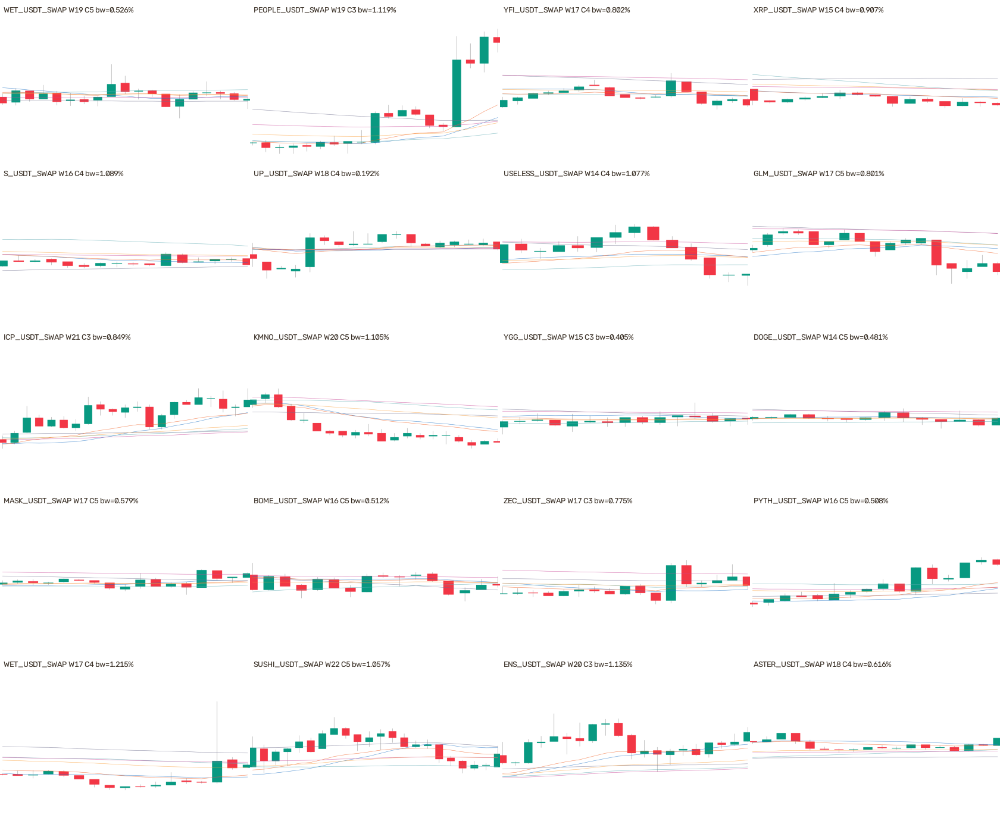

# P1：15m 负样本两项问题审计与 hard-val 补集（2026-08-27）

## 结论

负样本**没有**首批审核图的 `t-3` 竖线错位问题；26,874 张原负样本全部没有竖线、框、
`event_id` 或 core 几何，YOLO 标签均为空文件。负样本确实也把 W14–22 的短输入窗铺满
1280 像素，因此拿它和 48 根人工审核图比较时，K 线同样会显得更宽；但这不是正负类别之间的
压缩差异：正例、easy 和 hard 负例调用同一个 `render_chart`，W14–22 与确认 3/4/5 的分布
逐档严格匹配，所以模型不能靠图片尺度或画风判断正负。

Owner 要求补 hard-val 后，本轮没有修改原数据集，而是新建独立 pre-holdout sidecar：目标
1,470 张，严格保持同币、同 val split、候选保护区、旧负窗保护和新窗互斥后安全生成 **1,469**
张。唯一缺口是 `BSB_USDT_SWAP` 的 1 张；穷举该币 23 个 hard anchor 后，最多只能组成 5 个
互不重叠安全窗，不能为了凑 1:1 放宽规则。

## 你问的两个问题

| 问题 | 原负样本是否存在 | 证据 | 结论 |
|---|---|---|---|
| 48 根审核图与 W14–22 训练图铺满同一宽度，观感不同 | **作为跨用途比较现象存在** | 负样本也是 W14–22、1280×742；它本来没有 48 根配对审核图 | 若拿去和审核图比较，K 线更宽；但训练集正负同管线、同 W/C 分布，不是类别 shortcut |
| 首批 1,000 张审核竖线未移动到 `t-3` | **不存在** | 26,874/26,874 负例无 marker/core/box 字段；26,874/26,874 标签 SHA 是空文件 SHA | 负例没有“启动首根”框，也没有竖线可错移；它只以 pseudo-`t` 定义 no-launch 标签 |

原数据集中正负输入的逐档配平如下：

| split / 类别 | 数量 | W14–22 | confirm 3/4/5 |
|---|---:|---|---|
| train positive | 8,468 | 基准分布 | 2,835 / 2,816 / 2,817 |
| train easy | 8,468 | 每一档与 positive 相等 | 2,835 / 2,816 / 2,817 |
| train hard | 16,936 | 每一档恰为 positive 2× | 5,670 / 5,632 / 5,634 |
| val positive | 1,470 | 基准分布 | 487 / 518 / 465 |
| val easy | 1,470 | 每一档与 positive 相等 | 487 / 518 / 465 |
| 原 val hard | 0 | — | — |
| 新 sidecar hard-val | **1,469** | 仅缺 BSB 的 W18 一张 | 487 / 517 / 465 |

正例与两类负例在构建器中分别位于
`yoyo/datasets/ma_launch_t3_training.py:842` 和 `:884`，两处都直接调用
`render_chart(window, out_path=None)`；负例随后写入空 `label_text`。这比抽几张截图判断颜色或
缩放更强：它核对的是实际调用路径和完整 manifest 分布。

## 新 hard-val 数据

| 项目 | 结果 |
|---|---:|
| 目标 / 实际 / 缺口 | 1,470 / **1,469** / 1 |
| 覆盖 source | 228 |
| 新图片尺寸 | 1,469/1,469 均为 1280×742×3 |
| 空 YOLO 标签 | 1,469/1,469 |
| 新窗互相重叠 | 0 |
| 与原 26,874 个负窗重叠 | 0 |
| 与 10,000 候选保护区重叠 | 0 |
| 模型像素最晚可见 | pseudo-`t+2` |
| no-launch 标签最晚依赖 | pseudo-`t+11` |
| 读取 holdout OHLCV | 0 |
| 修改原数据集文件 | 0 |
| 训练新模型 | 0 |

hard 的定义仍是“pseudo-`t` 前六均线带宽 ≤1.243218%，并且 pseudo-`t..t+11` 的收盘绝对
位移 ≤1.5 ATR、双向最大位移 ≤2 ATR”。这里的 hard 是**密集均线但未完成启动**，不是后来
从模型误报中二次挖出的 Gold hard negative。



完整 1,469 张逐图页面：
[hard-val HTML 画廊](../../experiments/active/exp-15m-ma-launch-t3-hardval-v1/results/gallery/index.html)。

## 冻结模型的 easy / hard 误报对照

没有重新训练，也没有调阈值。用原 `best.pt`、`imgsz=960`、`conf=0.25` 在本机 MPS 对
1,470 张原 easy-val 与 1,469 张新 hard-val 做同配方推理：

| 指标 | easy-val | hard-val | hard - easy |
|---|---:|---:|---:|
| 图片数 | 1,470 | 1,469 | -1 |
| 开火图片 | 4 | 4 | 0 |
| 开火率 | 0.272109% | 0.272294% | +0.000185pp |
| 误报框 | 5 | 4 | -1 |
| 误报框 / 1,000 图 | 3.4014 | 2.7229 | -0.6784 |
| 最高置信度 | 0.32795 | 0.32678 | -0.00117 |
| LONG / SHORT 误报框 | 5 / 0 | 4 / 0 | — |

开火图片的 Fisher 精确检验为 `p=1.0`（4/1,470 对 4/1,469）。当前没有证据表明 hard-val
比 easy-val 更容易触发这一个冻结模型；这不等于两类完全等价，也不证明 weak labels 是 Gold。

## 零假设对照与为什么不报收益指标

本轮是非方向性的数据/渲染审计，没有交易入场、未来收益、成本或排名，因而 val AUC、置换收益
`p`、top-decile 毛/净收益、胜率和匹配随机交易对照在字面上不适用，禁止编造。

同等严格的零假设对照是：冻结同一模型、同一阈值、同一 W/C 支持集，仅把负例类型从 easy
换成 hard，比较每千图误报框和开火率。Fisher `p=1.0` 未拒绝“开火率相同”的零假设。

## 复现命令

构建器必须先在 `main` 提交，再生成数据：

```bash
cd /Users/zhangzc/fable-trading
git branch --show-current
PYTHONPATH=. .venv/bin/python scripts/build_15m_ma_launch_t3_hard_val.py
PYTHONPATH=. .venv/bin/python scripts/verify_15m_ma_launch_t3_hard_val.py
PYTHONPATH=. .venv/bin/python scripts/evaluate_15m_ma_launch_t3_hard_val.py --device mps --batch 16
.venv/bin/python -m pytest -q \
  tests/test_ma_launch_t3_hard_val.py \
  tests/test_ma_launch_t3_training.py \
  tests/test_ma_launch_review_parity.py
PYTHONPATH=. .venv/bin/python scripts/md_to_html.py \
  analysis/p1_15m_ma_launch_negative_parity_hardval_20260827.md \
  --out-dir analysis/html
```

关键产物：

- sidecar manifest：`datasets/ma_launch_t3_hardval_v1/manifest.jsonl`
- 构建回执：`experiments/active/exp-15m-ma-launch-t3-hardval-v1/results/build_receipt.json`
- 独立 QA：`experiments/active/exp-15m-ma-launch-t3-hardval-v1/results/qa_receipt.json`
- 冻结模型对照：`experiments/active/exp-15m-ma-launch-t3-hardval-v1/results/hard_val_evaluation.json`

## 风险与诚实声明

- 新 hard-val 是 pre-holdout 诊断 sidecar；没有读取或消耗 ≥2026-05-04 的 holdout。
- 原数据集、原 val、原 `best.pt` 和历史 mAP 均未改写；因此历史结果仍可复现。
- hard-val 全为空标签，只能评价误报，不能单独计算有意义的检测 mAP 或 recall。
- 1,469 张来自机器规则 no-launch，不是 Owner 逐样本确认的 Gold negatives。
- 低误报率部分受 `conf=0.25` 和当前冻结模型影响；本轮没有据此调阈值。
- W14–22 内部仍会导致单根 K 线宽度随 W 改变，但正、easy、hard 的 W 分布配平，未形成类别捷径。

## 下一步

当前允许的动作是把 hard-val 作为独立误报验收面保留，并在后续模型版本上固定复用。是否把它
并入某个新数据集版本的正式 val、是否重训、以及是否改变阈值，都会改变实验或模型状态，需另行
由 Owner 决定；本轮没有自动执行。
