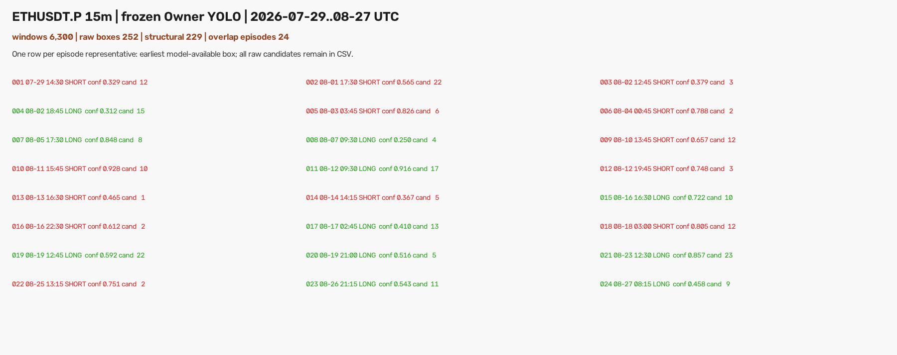

# ETHUSDT.P 近 30 日 Grade-A epoch-6 模型扫描（2026-08-29）

## 结论先行

本轮使用的“刚刚已经跑完的模型”是 **Grade-A 8,000 正样本 + 24,000 负样本、YOLO11s、
imgsz=960 的早停版 `best.pt`**。它是 40 轮上限训练中第 6 轮取得的最佳权重，不是仍在 RTX
3060 上运行的 full40-960 或排队的 full40-1280。

- 权重：`analysis/output/ma_launch_owner_grade_a8000_neg24000_v1/ma_launch_owner_grade_a8000_neg24000_v1_y11s_ft960/weights/best.pt`
- SHA256：`0524e78086face6ccba0f2bb220dadada4555a914c64a4e6794f620fa0d9103f`
- 固定推理：`conf=0.25`、NMS IoU `0.7`、`imgsz=960`
- 训练支持：W18/W19、核心 4/5 根、核心后确认 2–9 根

在与昨天完全相同的 2026-07-29 至 2026-08-27 共 30 个完整 UTC 信号日上，本模型产生
252 个原始框，其中 229 个符合训练几何；5 根 K 去重后为 26 个事件，跨滑窗重叠合并后是
**24 个独立 episode：11 LONG / 13 SHORT**，覆盖 20/30 个日期。



24 个 episode 均已渲染成独立 1920×1400 PNG。每张上方是 128 根完整行情，只保留一个模型
原始框；右下角是模型实际看到的 1280×742 输入和同一个框。虚线 `DETECT` 右侧若有灰色行情，
只供事后看整体，从未进入该次模型输入。

## 数据边界与昨天一致性

昨天旧模型最多需要 6 根确认 K；本模型训练支持到 9 根。因此目标信号日不变，只在快照最末端
增加 3 根 15m K，使 8 月 27 日最后几根核心也拥有完整的 post2–9 扫描机会。

| 数据检查 | 结果 |
|---|---:|
| 目标信号日 | 30 个完整 UTC 日，2026-07-29..08-27 |
| MA warmup 起点 | 2026-07-27 00:00 UTC |
| 新快照末根 | 2026-08-28 02:00 UTC |
| 总 K 数 | 3,081 |
| 每个目标日 | 96 / 96 根 |
| 缺口 / 重复 | 0 / 0 |
| 与昨天共享前缀 | 3,078 根 |
| 共享前缀 OHLCV 逐值一致 | **3,078 / 3,078** |
| 仅新增末端确认 K | 3 根，不增加信号日 |

新快照 SHA256 为
`666b466c744120fa54eef862a5bafe4dd97630f428a713106ff8bdb597553922`；昨天快照 SHA256 为
`d09f82a06945a36b8ed5e6d2445afdc67511f8582d75bda5828bf23b256742b8`。两者哈希不同只因后者
少最后 3 行；重叠部分的时间与 OHLCV 已逐单元格严格相等。

## 本模型结果漏斗

| 层级 | 数量 | 解释 |
|---|---:|---|
| 模型输入窗口 | 6,300 | 30 日 × 每日 105 个 endpoint × W18/W19 |
| 含任意框的窗口 | 237 | 3.76% 的输入至少出现一个框 |
| 原始 YOLO 框 | 252 | 保留原始 `cx/cy/w/h` |
| 核心长度不合训练支持 | 1 | 非 4/5 根 |
| 确认长度不合训练支持 | 19 | 非 2–9 根 |
| 核心不属于目标日 | 3 | 末端延伸窗口的边界保护 |
| 结构合格候选 | 229 | 未修改置信度或框坐标 |
| 5 根 K 去重事件 | 26 | 仅作为旧报表兼容指标 |
| 连续重叠 episode | **24** | 本轮 Owner 图与 TG 交付单位 |
| LONG / SHORT | **11 / 13** | 取 episode 最早可见原始框的类别 |

## 与昨天旧模型对照

昨天使用的是 10,000 弱正样本 + 30,000 负样本模型，支持 W18–25、确认 4–6 根；本轮只替换为
Grade-A epoch-6 权重及它真实训练过的窗口几何。目标信号日、`conf`、NMS、episode 合并规则、
整图渲染和 TG 传输方式均保持不变。

| 指标 | 昨天旧模型 | 本轮 Grade-A 模型 |
|---|---:|---:|
| 支持窗口 | W18–25（8 种） | W18/W19（2 种） |
| 扫描输入 | 24,480 | 6,300 |
| 原始框 | 1,318 | 252 |
| 每千输入原始框 | 53.84 | 40.00 |
| 结构合格候选 | 1,057 | 229 |
| 每千输入结构候选 | 43.18 | 36.35 |
| 连续 episode | 41 | **24** |
| LONG / SHORT | 27 / 14 | **11 / 13** |
| 有 episode 的日期 | 24 / 30 | **20 / 30** |
| 置信度中位数 | 0.429 | **0.602** |
| conf ≥ 0.50 | 18 / 41 | **16 / 24** |
| conf ≥ 0.75 | 8 / 41 | **8 / 24** |
| conf ≥ 0.90 | 4 / 41 | **2 / 24** |
| episode 候选数中位数 / 最大值 | 21 / 96 | **9.5 / 23** |

按两个模型 episode 的实际时间区间相交来对照，本轮 24 个中有 **18 个**与昨天 episode 重叠，
且 18/18 方向类别一致；另外 6 个是本轮独有。昨天 41 个中有 23 个没有被本轮覆盖。若把匹配
放宽为代表检测时间相距不超过 3 小时，则本轮 24 个中有 19 个匹配，方向仍为 19/19 一致。

这些数字只能说明本模型更克制、重复候选更少且置信度分布更高，不能自动证明其 24 张视觉上更
标准。哪一个模型更接近 Owner Gold，仍应以相同图面上的 Owner 视觉标准或预注册盲评判断；本轮
没有根据结果回调阈值、窗口或 episode 规则。

## 24 个 episode 分布

| 指标 | 结果 |
|---|---:|
| 置信度均值 / 中位数 | 0.610 / 0.602 |
| 置信度范围 | 0.250–0.928 |
| conf ≥ 0.50 / 0.75 / 0.90 | 16 / 8 / 2 |
| W18 / W19 代表框 | 10 / 14 |
| 核心 4 / 5 根 | 8 / 16 |
| 代表框确认根数 2 / 3 / 4 / 7 | 17 / 5 / 1 / 1 |
| episode 候选数中位数 / 最大值 | 9.5 / 23 |

代表框多为确认 2 根，是因为冻结规则会在同一连续行情里优先选择**最早模型可见**的合法框；这与
昨天相同，不是扫描完成后人为把框前移。

## 图像与框的独立校验

校验阶段重新读取冻结快照与 `episodes.csv`，逐个恢复模型窗口、原始归一化框、128 根全景和最终
PNG：

| QA 项 | 结果 |
|---|---:|
| 每张恰好一个模型框 | 24 / 24 |
| 模型实际输入像素一致 | 24 / 24 |
| 整张文档逐像素重渲染一致 | 24 / 24 |
| PNG SHA 一致 | 24 / 24 |
| 唯一模型输入 SHA | 24 / 24 |
| 唯一成图 SHA | 24 / 24 |
| 将 episode 与下一张输入循环错配的零假设命中 | **0 / 24** |

本任务是检测与渲染审计，不存在合理的 val AUC、收益、胜率、top-decile 净收益或匹配随机入场
对照，因此不编造交易指标。等价的严格零假设是把每个 episode 循环错配到下一张模型输入：正确
配对为 24/24，错配为 0/24，证明图、事件和实际模型输入没有顺序串位；它不证明每个框都符合
Owner 的主观完美形态。

## 风险与诚实声明

- 这是该 epoch-6 Grade-A 配置经 Owner 明确授权的 holdout 消费 **#1**。
- 24 个 episode 是模型真实候选，不是 24 个逐张人工确认 Gold，也不表示全部可交易。
- `confidence` 是 YOLO 框置信度，不是涨跌概率、胜率或收益概率。
- 模型需要核心后的 2–9 根确认 K，属于 completed-history / delayed detector；不能进入只扫
  tip/tip-1/tip-2 的新鲜实盘路径，也不能冒充盘口即时信号。
- 本轮没有训练、调参、改标签、改权重、promote、部署、改 ACTIVE/frozen、改 forward 状态或
  下单；`training_eligible=false / production_eligible=false` 保持不变。
- 正在 RTX 3060 上跑满 40 轮的 960/1280 是另外两个实验；它们完成后必须作为新权重另行冻结
  推理契约，不能把本轮结果算到它们名下。

## 复现命令

```bash
cd /Users/zhangzc/fable-trading

PREREG=experiments/active/exp-15m-ma-launch-owner-grade-a8000-eth30d-20260829-v1/preregistration.json
OUT=analysis/output/ma_launch_owner_grade_a8000_eth30d_20260829_v1
RESULTS=experiments/active/exp-15m-ma-launch-owner-grade-a8000-eth30d-20260829-v1/results

PYTHONPATH=. .venv/bin/python scripts/scan_15m_ma_launch_owner_yolo_eth30d.py \
  --fetch --prereg "$PREREG" --out "$OUT" --results "$RESULTS"

PYTHONPATH=. .venv/bin/python scripts/scan_15m_ma_launch_owner_yolo_eth30d.py \
  --scan --prereg "$PREREG" --out "$OUT" --results "$RESULTS" --batch-size 32

PYTHONPATH=. .venv/bin/python scripts/scan_15m_ma_launch_owner_yolo_eth30d.py \
  --verify --prereg "$PREREG" --out "$OUT" --results "$RESULTS"

PYTHONPATH=. .venv/bin/python -m pytest \
  tests/test_15m_ma_launch_owner_yolo_eth30d.py -q

.venv/bin/python scripts/md_to_html.py \
  analysis/p1_15m_ma_launch_owner_grade_a8000_eth30d_20260829.md \
  --out-dir analysis/html
```

官方构建拒绝覆盖既有快照、扫描结果和 TG 回执。从零复现必须使用新的实验目录，不能删除本轮
证据后冒充第一次运行。

## 下一步

本轮不需要人工审核才能完成交付；24 张图会按文件逐张发到 TG。Owner 可在收到后直接按自己的
视觉标准查看。若后续要比较 full40-960 或 full40-1280，应继续使用同一批 30 个信号日和相同
渲染/合并规则，单独登记新的 holdout 消费次数。
