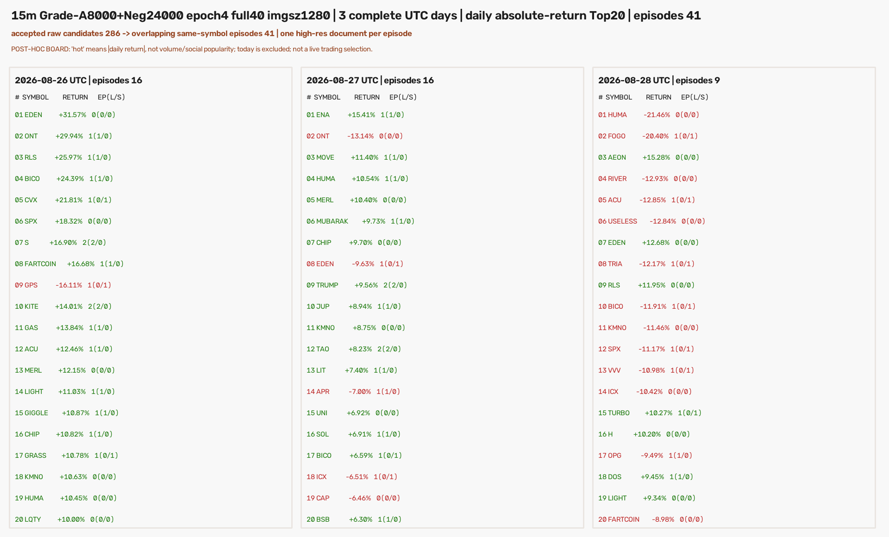

# 同一热门币快照：1280 全量训练模型与 960 模型的冻结对照（2026-08-30）

## 技术结论

在**完全相同**的 60 个「日期×币种」15m 行情快照、相同 W18/W19 窗口、`conf=0.25`、NMS IoU `0.70`、核心 4/5 根、确认 2–9 根、原框映射及同币重叠 episode 合并规则下，刚完成的 **YOLO11s full40 `imgsz=1280` best.pt（epoch 4）**产出 **41** 个独立 episode（28 LONG / 13 SHORT）；此前 **`imgsz=960` best.pt（epoch 6）**产出 **30** 个（26 LONG / 4 SHORT）。

但这不是“1280 找到原来 30 个，再多找到 11 个”。按同一币种且核心区间重叠或相距不超过一根 15m K 的、按核心右端距离一对一匹配，二者只重合 **19 / 52** 个物理 episode（Jaccard **0.365**）：960 独有 11 个、1280 独有 22 个；19 个重合项中 18 个方向一致、1 个（TRIA，2026-08-28 13:00 UTC）方向相反。也就是说，1280 和 960 在这个冻结盘口上看到的是**显著不同的形态集合**。

1280 的静态 val `mAP50-95=0.78649`，比 960 的 `0.77768` 高 **0.00881**（0.881 个百分点），但该差异没有预测这份真实快照上的 episode 身份稳定性。因此本轮**没有赢家裁决**：不能仅因 41 比 30 多或 val mAP 略高而选择 1280，也不能把任一结果称为交易信号或盈利证据。

## 同一快照上的输出差异

三日榜单仍是 2026-08-26、08-27、08-28 UTC 的每日绝对开收涨跌幅 Top20（60 个榜单位、43 个不同币种）。输入快照、每日排名 CSV、原始 OHLCV 文件、渲染器哈希均复用 960 已冻结版本；本次网络读取为 0。

| 指标 | 960 full40 best | 1280 full40 best | 差异 |
|---|---:|---:|---:|
| best epoch | 6 | 4 | — |
| val mAP50-95 | 0.77768 | 0.78649 | +0.00881 |
| 模型输入 | 12,600 | 12,600 | 0 |
| 含任意框的输入 | 314 | 343 | +29 |
| 原始 YOLO 框 | 327 | 354 | +27 |
| 结构合法候选 | 278 | 286 | +8 |
| 去重 episode | 30 | **41** | +11 |
| 每千模型输入 episode | 2.381 | **3.254** | +0.873 |
| LONG / SHORT | 26 / 4 | 28 / 13 | SHORT +9 |
| 平均 / 中位置信度 | 0.626 / 0.623 | 0.471 / 0.407 | 不可跨模型校准比较 |
| `conf≥0.50 / 0.80 / 0.90` episode | 21 / 10 / 4 | 15 / 5 / 2 | 1280 分数整体更低 |

按日拆开，960 是 15 / 8 / 7 个 episode，1280 是 16 / 16 / 9 个。最大差异出现在 08-27：1280 多出 8 个，而非三个日期均匀地多报。



上图是本轮 41 个 episode 的完整板级视图；它只说明每个榜单位的触发数量和 LONG/SHORT 构成，**不**说明对应方向随后会盈利。每一条 episode 有一张 1920×1400 的整图，主图仅一个模型原框，右下角是实际送入模型的 1280×742 输入；41 张已打包为 `hot3d_all_signal_charts.zip`。

## 不是置信度阈值造成的简单差别

跨模型置信度不能直接校准比较，所以除了固定 `conf=0.25` 的结果，还用 episode 身份做了不依赖绝对分数阈值的检查。匹配规则是：同一 `symbol`，核心区间相交或间隙至多一根 15m K；候选按核心右端时间距离从小到大一对一配对。17 对核心右端完全相同，另 2 对仅差一根 K。

| episode 身份对照 | 结果 |
|---|---:|
| 两臂 episode 总并集 | 52 |
| 配对重合 | 19 |
| Jaccard（19 / 52） | 0.365 |
| 960 独有 / 1280 独有 | 11 / 22 |
| 重合项方向相同 / 反向 | 18 / 1 |
| 两臂各自置信度 Top10 的共同 episode | 6 / 10（Jaccard 0.429） |
| 两臂各自置信度 Top20 的共同 episode | 7 个（Jaccard 0.212） |

重合的 19 对置信度仍有中等正相关（Spearman `ρ=0.525`，两侧 `p=0.021`），这只说明它们在少数共同形态上不是完全随机排序；它不改变“多数 episode 身份不同”的事实。更关键的是，改成各自的 Top10/Top20 仍不能使集合一致，因此差异不能简单归因于一个统一的 `0.25` 分数门太宽或太窄。

TRIA 是需要单独记录的反例：两臂都落在 2026-08-28 13:00 UTC 的同一核心右端，但 960 输出 LONG `0.257`，1280 输出 SHORT `0.385`。这不是合并窗口或行情快照错配；它是相同模型输入在不同分辨率训练臂下的类别分歧。

## 这轮实际比较了什么

本轮的单变量是**原生训练与推理分辨率**：两臂使用相同的 8,000 正样本 + 24,000 负样本、同 seed、YOLO11s、batch、优化器、学习率日程、增强关闭规则和 40 轮上限；960 的最佳 checkpoint 在 epoch 6，1280 的最佳 checkpoint 在 epoch 4。每一臂都以自己的原生 `imgsz` 推理：行情源 PNG 仍为同一份 1280×742 像素，Ultralytics 只在内部 letterbox 到 checkpoint 对应的 `imgsz`。

推理时固定如下条件：

- 15m K 线，W18/W19；核心允许 4/5 根，核心后确认只允许 2–9 根。
- `conf=0.25`、NMS IoU `0.70`；保留模型给出的原始 `cx/cy/w/h`，不在结果后改框、移框或删图。
- 仅当映射后的核心右端落进被选 UTC 日时归属该榜单位；同币重叠区间合为一个 episode，代表框选最早可见合法框。
- 全景图可显示检测右端后的 K 线供复盘，但这些像素从未进入模型输入。

## 完整性与渲染 QA

1280 回放从 960 已归档的数据快照读取，而非重新拉取市场数据。源 fetch receipt SHA-256 为 `2df199f6305f4b3b233e8034c770df1a953f87c25659b7f65051cccc6ab1a050`，日榜 CSV SHA-256 为 `60ac5e28e0f7c49d94830a52d9ece1ec202d27837b173e999815fe49c09e13f9`。本轮权重 SHA-256 为 `862705b999594355c1133640acc540f4de19b561889e89d9e050ddad5c6db838`。

| QA 项 | 结果 |
|---|---:|
| 榜单位 / 不同币种 | 60 / 43 |
| 1280 episode 文档 | 41 |
| 每图恰好一个 episode 框 | 41 / 41 |
| 实际模型输入像素重建一致 | 41 / 41 |
| 整张 1920×1400 文档逐像素重渲一致 | 41 / 41 |
| PNG SHA 一致 / 唯一 | 41 / 41 |
| 循环错配事件与下一输入的零假设命中 | 0 / 41 |
| 验证阶段网络读取 | 0 |

这组检查证明了 41 张图、框和各自的实际模型输入没有串位，也证明本轮没有靠重新抓取行情改变对照样本；它**不**证明 41 个形态都是 Gold，也不证明任何方向的交易收益。

## 限制与诚实声明

- 这是 1280 配置对此快照的 holdout 使用 **#1**；960 旧配置对此快照已是使用 #2。Owner 明确授权了该无网络冻结回放，但它不是最终验收。
- “热门”指已收盘日的绝对涨跌幅，不是成交量或社交热度。榜单成分只能事后知道；当前 live universe 还带有幸存者偏差。
- 41 对 30 是 detector 输出密度，不是 precision、recall、胜率、收益、AUC 或交易次数。没有在本轮运行回测、收益排序、匹配随机入场对照或置换收益检验；这些指标对纯检测/图像身份审计按字面不适用，不能编造。
- 该 detector 需要核心后的 2–9 根确认 K，是 completed-history / delayed detector；不能被代表成 tip、tip-1 或 tip-2 的新鲜实盘信号。
- 本轮没有人工删信号、调阈值、改权重、训练、promote、部署、写 forward、发 Telegram 或下单。`training_eligible=false` 与 `production_eligible=false` 维持不变。

## 建议的下一步

不要根据静态 mAP 的 0.881pp 差异或 episode 数量挑选 1280。若需要在 960/1280 中选择，下一份预注册应把“同一形态在相邻分辨率下是否保持 episode 身份和方向”列为独立稳定性指标，并在**未被本轮读取的新时间段**或已有独立 Gold 集上评估。选择门应看形态级一致性与既定 Gold 语义，而不是事后看哪一臂多报、少报或更贴合随后走势。

目前没有需要 Owner 人工审核才算完成的步骤；本轮的可复现结论已经封存为“两个分辨率臂在同一快照上显著分歧”，而不是“1280 更好”。

## 复现与审计命令

```bash
cd /Users/zhangzc/fable-trading

PREREG=experiments/active/exp-15m-ma-launch-owner-grade-a8000-hot3d-1280-20260830-v1/preregistration.json
OUT=analysis/output/ma_launch_owner_grade_a8000_hot3d_1280_20260830_v1
RESULTS=experiments/active/exp-15m-ma-launch-owner-grade-a8000-hot3d-1280-20260830-v1/results

# 只读复核；不会重新 fetch，也不会写市场数据。
PYTHONPATH=. .venv/bin/python scripts/scan_15m_ma_launch_owner_grade_a8000_hot3d.py \
  --verify --prereg "$PREREG" --out "$OUT" --results "$RESULTS"

PYTHONPATH=. .venv/bin/pytest -q \
  tests/test_scan_15m_ma_launch_owner_grade_a8000_hot3d.py

python3 scripts/md_to_html.py \
  analysis/p1_15m_ma_launch_owner_grade_a8000_hot3d_1280_20260830.md \
  --out-dir analysis/html
```

扫描器拒绝覆盖已经存在的本轮结果目录；这是为了保护本次 holdout 证据。若要在新目录重跑，必须先做新的预注册并登记同一配置的下一次 holdout 使用，不能删除本轮结果后冒充第一次。
