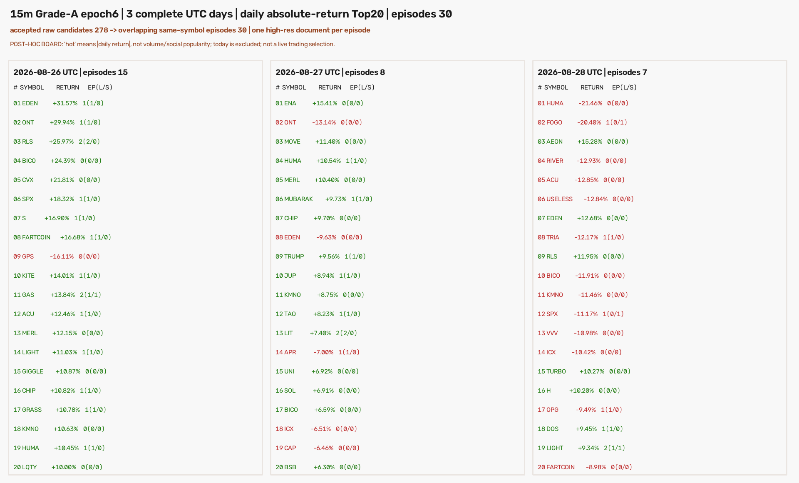
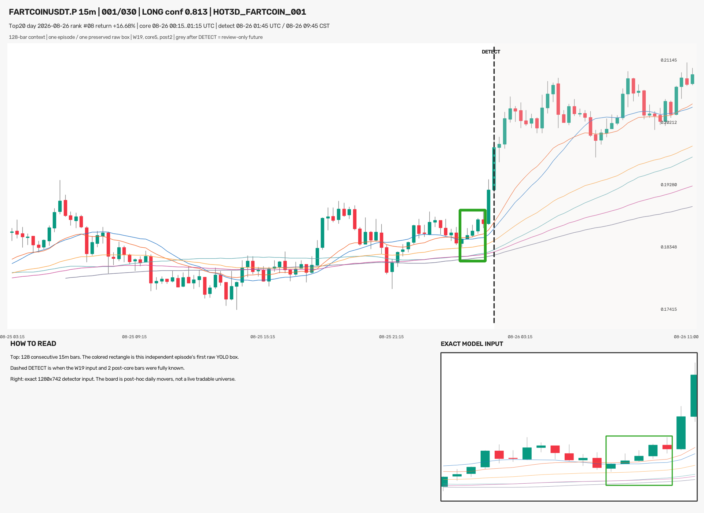
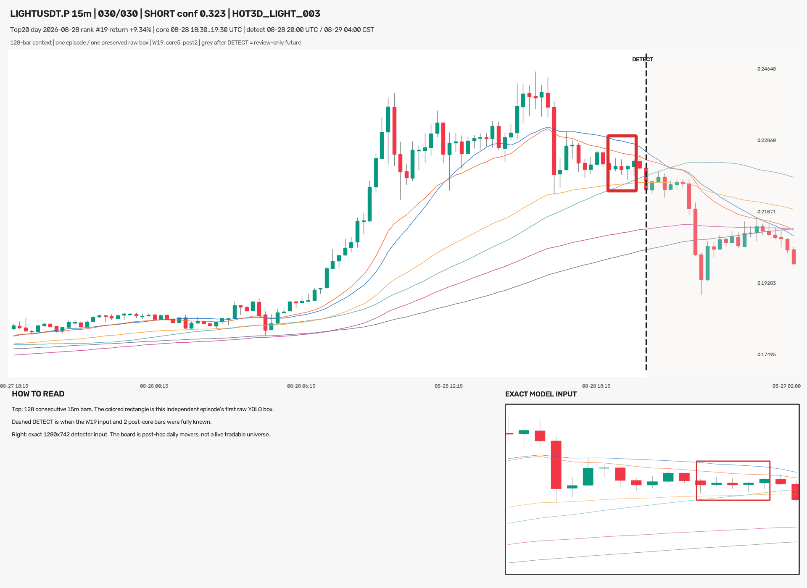

# 近 3 个完整日热门币 Grade-A 模型扫描（2026-08-29）

## 结论先行

本轮按此前“热门币”实际口径执行：在 OKX 当前可交易、`instCategory=1` 的加密
USDT 永续中，分别按每个完整 UTC 日的 **绝对开收涨跌幅** 排 Top20。目标日是
2026-08-26、08-27、08-28；未收盘的 08-29 没有进入榜单。这里的“热门”是日内大幅
波动代理，不是成交量榜或社交热度榜，而且同日收盘后才能知道完整 Top20，属于事后复盘榜单。

冻结模型是刚完成的 **Grade-A 8,000 正样本 + 24,000 负样本、YOLO11s、imgsz=960、
epoch-6 `best.pt`**：

- 权重：`analysis/output/ma_launch_owner_grade_a8000_neg24000_v1/ma_launch_owner_grade_a8000_neg24000_v1_y11s_ft960/weights/best.pt`
- SHA256：`0524e78086face6ccba0f2bb220dadada4555a914c64a4e6794f620fa0d9103f`
- 推理参数：`conf=0.25`、NMS IoU `0.7`、`imgsz=960`
- 训练实际支持：W18/W19、核心 4/5 根、核心后确认 2–9 根

60 个“日期×币种”榜单位合并后涉及 43 个不同币种。共扫描 12,600 个模型输入，得到
327 个原始框，其中 278 个符合训练几何；将同币种重叠的滑窗候选合并后，最终是
**30 个独立 episode、30 张 1920×1400 高清整图：26 LONG / 4 SHORT**。这些 episode
分布于 26/60 个榜单位、23/43 个币种。



每张图的上半部分是 128 根连续 15m K 线，只画一个独立 episode 的模型原框；右下角是实际
交给检测器的 1280×742 渲染数组和同一个框。虚线 `DETECT` 右侧的灰色 K 线仅供复盘整体行情，
从未进入该次推理。Ultralytics 在内部按冻结的 `imgsz=960` 做 letterbox，不会重写原始行情图。

## 榜单与数据完整性

日线排序使用确认后的 `1Dutc close / open - 1`，先取绝对值降序，再以 symbol 升序稳定打破
并列；没有成交量过滤。当前 live universe 会带来幸存者偏差，不能把本榜单冒充当日实时可得
的历史成分股。

| UTC 日 | Top20 最低绝对涨跌幅 | 上涨 / 下跌币 | episode | LONG / SHORT |
|---|---:|---:|---:|---:|
| 2026-08-26 | 10.00% | 19 / 1 | 15 | 14 / 1 |
| 2026-08-27 | 6.30% | 15 / 5 | 8 | 8 / 0 |
| 2026-08-28 | 8.98% | 7 / 13 | 7 | 4 / 3 |
| **合计** | — | **41 / 19** | **30** | **26 / 4** |

| 数据检查 | 结果 |
|---|---:|
| 当前合格 OKX USDT 永续 | 274 |
| 榜单位 | 60（3×20） |
| 榜单并集币种 | 43 |
| 15m 快照行数 | 21,027 |
| 每个榜单位完整 K 数 | 96 / 96 |
| 完整榜单位 | 60 / 60 |
| 全快照缺口 / 重复 | 0 / 0 |
| MA warmup | 首个目标日前 48 小时 |
| 最后确认扩展 | 9 根 15m K，不增加信号日 |

## 检测漏斗

| 层级 | 数量 | 占上层 | 说明 |
|---|---:|---:|---|
| W18/W19 模型输入 | 12,600 | — | 60 个榜单位 × 每日 105 个 endpoint × 2 个窗口 |
| 含任意框的输入 | 314 | 2.49% | 至少有一个 `conf≥0.25` 原框 |
| 原始 YOLO 框 | 327 | — | 原始 `cx/cy/w/h` 全部保留 |
| 确认长度不合训练支持 | 41 | 12.54% | 映射后不在 post2–9 |
| 核心不属于榜单日 | 8 | 2.45% | 末端确认扩展的日期边界保护 |
| 结构合法候选 | 278 | 85.02% | 核心 4/5 根且确认 2–9 根 |
| 重叠 episode | **30** | **10.79%** | 同币种、跨窗口、跨三日按重叠区间合并 |

278 个候选压缩为 30 个 episode，去掉了 **89.21%** 的滑窗重复。每个 episode 的候选数均值
9.27、中位数 8、范围 1–26。代表框固定取该连续 episode 中**最早模型可见**的合法框；置信度
只在检测终点完全相同时打破并列，没有在看完行情后挑最高分框。

## 30 个 episode 分布

| 指标 | 结果 |
|---|---:|
| 覆盖榜单位 | 26 / 60（43.33%） |
| 覆盖不同币种 | 23 / 43（53.49%） |
| LONG / SHORT | 26 / 4 |
| 置信度均值 / 中位数 | 0.626 / 0.623 |
| 置信度范围 | 0.252–0.973 |
| conf ≥ 0.50 / 0.80 / 0.90 | 21 / 10 / 4 |
| W18 / W19 代表框 | 15 / 15 |
| 核心 4 / 5 根 | 13 / 17 |
| post2 / 3 / 5 / 6 / 8 / 9 | 19 / 3 / 3 / 3 / 1 / 1 |

按榜单名次分桶，episode 数分别为：第 1–5 名 6 个、第 6–10 名 8 个、第 11–15 名 9 个、
第 16–20 名 7 个。模型并不是只在涨跌幅最大的前几名触发。

方向类别明显偏 LONG：上涨榜单位产生 23 LONG / 2 SHORT，下跌榜单位产生 3 LONG / 2 SHORT。
这既受三天榜单本身 41 涨 / 19 跌影响，也可能反映当前权重在这批路径上的类别偏好；模型类别
不是未来涨跌结论，因此不能把 26:4 解读成 26 次看涨交易。

冻结阈值下仍完整保留 9 个 `conf<0.50` episode，其中最低为 0.252。报告置信度分层只用于理解
输出，不据此删图或回调阈值；`confidence` 不是胜率或盈利概率。

## 与同一模型 ETH 30 日扫描对照

可比基线是同一 epoch-6 权重此前在 ETHUSDT.P 30 个完整日上的扫描。两者权重、阈值、NMS、
训练几何、episode 合并和渲染相同，但币种与日期不同，因此下面只能比较输出密度，不能归因为
“热门币更好/更差”。

| 指标 | ETH 30 日 | 本轮三日 Top20 |
|---|---:|---:|
| 模型输入 | 6,300 | 12,600 |
| 结构合法候选 | 229 | 278 |
| 每千输入合法候选 | 36.35 | **22.06** |
| 重叠 episode | 24 | 30 |
| 每千输入 episode | 3.81 | **2.38** |
| LONG / SHORT | 11 / 13 | **26 / 4** |

本轮虽然最终图更多，但输入数量正好是 ETH 基线的两倍；标准化后候选和 episode 密度分别低
39.3% 和 37.5%。这说明本权重在这 60 个事后大波动榜单位上并没有无差别乱报，反而单位输入
触发更少；类别构成却显著不同，后续若要判断偏差来源，必须使用预注册且时间可得的币池，而不
能继续根据同日涨跌幅选样后回调模型。

## 高清整图示例

以下两张分别展示 LONG 与 SHORT。图中主图只有一个 episode 框；右下角是同一模型输入的放大
核对，不是第二个信号。





完整 30 张图片在
`experiments/active/exp-15m-ma-launch-owner-grade-a8000-hot3d-20260829-v1/results/charts/`，并同时打包为
`hot3d_all_signal_charts.zip`。

## 图像、框与零假设 QA

校验阶段重新读取冻结行情和 `episodes.csv`，逐张恢复 W18/W19 模型输入、原始归一化框、128 根
全景以及最终 PNG，而不是只核对文件是否存在。

| QA 项 | 结果 |
|---|---:|
| 每张一个独立 episode | 30 / 30 |
| 模型实际输入像素一致 | 30 / 30 |
| 整张文档逐像素重渲染一致 | 30 / 30 |
| PNG SHA 一致 | 30 / 30 |
| 唯一模型输入 SHA | 30 / 30 |
| 唯一成图 SHA | 30 / 30 |
| 将事件与下一张输入循环错配的零假设命中 | **0 / 30** |

本任务是冻结模型的检测与图像审计，没有交易入场、结果标签或收益排序，因此 val AUC、胜率、
top-decile 毛/净收益、置换收益检验与同币同时间块随机入场对照都不适用；这里不编造这些指标。
等价的严格零假设对照是循环错配事件和模型输入：正确配对 30/30，错配 0/30，证明图片、框和
实际输入没有串位。该 QA 证明数据与渲染身份，不证明 30 张都已被 Owner 逐张确认成 Gold。

## 风险与诚实声明

- 这是该 exact epoch-6 权重的 holdout 使用 **#2**，也是它第一次跨币日榜扫描；Owner 本轮请求
  明确授权了这 3 个完整日的读取。
- Top20 使用同日完整涨跌幅，只能在日收盘后得到，存在后视选择；不能用于声称实盘选币收益。
- 当前 live universe 排除了后来下架币，存在幸存者偏差。
- 30 个 episode 是模型原始结果，不是人工复审后的 30 个完美 Gold，也不是盈利信号。
- 本模型需要核心后 2–9 根确认 K，属于 completed-history / delayed detector，不能进入只扫
  tip/tip-1/tip-2 的新鲜实盘路径。
- 本轮没有人工删信号、阈值调整、窗口调整、训练、改标签、promote、部署、改 ACTIVE/frozen、
  改 forward 状态或下单；`training_eligible=false / production_eligible=false` 保持不变。
- Owner 此前已取消 Telegram，本轮协议冻结为本地交付，`telegram_sent=false`。

## 复现命令

```bash
cd /Users/zhangzc/fable-trading

PREREG=experiments/active/exp-15m-ma-launch-owner-grade-a8000-hot3d-20260829-v1/preregistration.json
OUT=analysis/output/ma_launch_owner_grade_a8000_hot3d_20260829_v1
RESULTS=experiments/active/exp-15m-ma-launch-owner-grade-a8000-hot3d-20260829-v1/results

PYTHONPATH=. .venv/bin/python scripts/scan_15m_ma_launch_owner_grade_a8000_hot3d.py \
  --fetch --prereg "$PREREG" --out "$OUT" --results "$RESULTS"

PYTHONPATH=. .venv/bin/python scripts/scan_15m_ma_launch_owner_grade_a8000_hot3d.py \
  --scan --prereg "$PREREG" --out "$OUT" --results "$RESULTS" --batch-size 32

PYTHONPATH=. .venv/bin/python scripts/scan_15m_ma_launch_owner_grade_a8000_hot3d.py \
  --verify --prereg "$PREREG" --out "$OUT" --results "$RESULTS"

PYTHONPATH=. .venv/bin/pytest -q \
  tests/test_scan_15m_ma_launch_owner_grade_a8000_hot3d.py \
  tests/test_scan_15m_ma_launch_t3_daily_movers.py \
  tests/test_scan_15m_ma_launch_owner_yolo_recent5d.py \
  tests/test_scan_15m_ma_launch_owner_yolo_recent5d_rawbox.py

.venv/bin/python scripts/md_to_html.py \
  analysis/p1_15m_ma_launch_owner_grade_a8000_hot3d_20260829.md \
  --out-dir analysis/html
```

官方脚本拒绝覆盖本轮行情快照、扫描结果和回执。从零复现应使用新的实验目录，不能删除本轮证据
再冒充第一次扫描。

## 下一步选项

本轮结果已完整生成，不需要人工审核才能算任务完成。若只想看图，直接打开 `charts/` 按编号浏览；
若后续要验证“热门币是否比普通币更容易出现该形态”，应另行预注册一个**前一日闭合的币池排名**
并配同币×同时间块×同波动桶随机对照，不能复用这份同日事后 Top20 得出交易结论。
