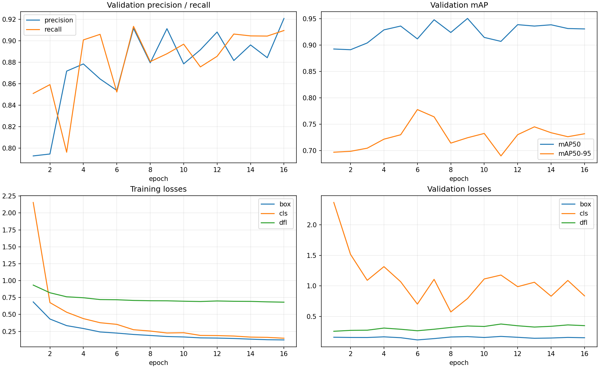
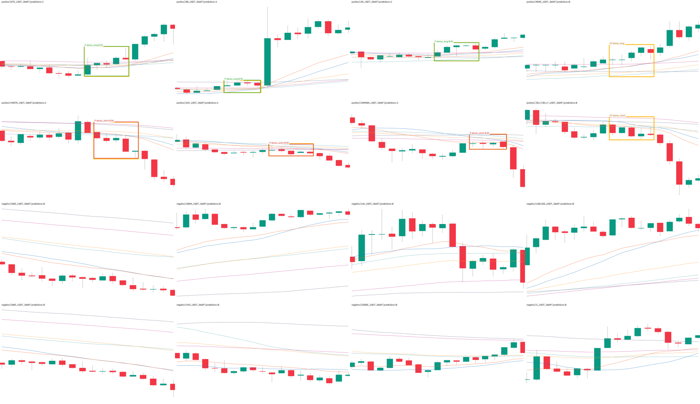

# 15m Grade-A 8,000 正例 + 24,000 匹配负例 YOLO11s 960 训练报告

## 结论先行

- RTX3060 训练已正常完成并以退出码 0 结束：请求 40 轮，实际第 16 轮触发
  `patience=10` 早停，`best.pt` 来自第 6 轮；取回权重与 3060 现场 SHA-256 一致。
- 回载最佳权重在冻结 chronological pre-holdout val 上得到 **P 0.8528、R 0.8532、
  mAP50 0.9116、mAP50-95 0.7775**；LONG / SHORT 的 mAP50-95 分别为 0.793 / 0.762。
- 固定 `conf=0.25` 对 1,200 张正例推理，类别正确且 `IoU>=0.5` 的命中为
  **1,035 / 1,200 = 86.25%**；113 张出现多框（9.42%），总计 142 个额外框。
- 155 个独立正事件中，**146 个至少一个变体命中（94.19%）**，但最早可用变体
  只命中 **116 / 155 = 74.84%**；在具有精确 post=2 变体的 149 个事件中，
  post=2 命中 111 个（74.50%）。任一变体高命中率含有明显的后续确认收益。
- 3,600 张真实空标签负例中 37 张出框，误报图率 **1.028%**；总计 38 个假框，
  每千图 10.56 个。hard / easy 误报图率为 1.125% / 0.833%。
- 方向翻转零假设的图像级 recall 从真实类别 86.25% 降为 0，独立事件级从 94.19%
  降为 0，exact `p` 分别为 `5.43e-312` 与 `2.24e-44`；模型不只学了方向中性的框几何。
- 高分后的独立 split 审计显示：图像 SHA、图像级 ID、事件 ID 与 65 个共用源文件的
  完整渲染＋标签依赖区间跨 split 交集全为 0，全局时间空档 85.25 小时。
- 训练、全量评估、预览、数据集校验与注册表的定向回归测试最终 **50 / 50 通过**。
- 本轮的 mAP50-95 略低于上版 10k+30k 模型的 0.7923，负例误报图率也略高于上版
  0.845%；由于数据集和 val 同时变了，只能作描述，不能归因给 Grade-A 或匹配负例。
- **这不是因果实时模型。** 输入含核心后 2–9 根 K 线，只能按 completed-history /
  delayed-confirmation 契约使用，不得冒充 tip / tip-1 / tip-2 盘口信号。本轮 holdout 读取 0，
  没有改 ACTIVE/frozen、promote、部署或交易状态。



## 实际训练数据

数据集是 `ma_launch_owner_grade_a8000_yolo_neg24000_v1`，每张源 PNG 为 1280×742 无损图。
训练时 `imgsz=960` 由 Ultralytics 在内存中等比缩放与 letterbox，不改写源文件。
正负样本使用同一渲染器、尺寸、K 线颜色与六条均线；训练 PNG 内没有红框，
正例框只存在 `.txt` 标签，负例标签为字节级空文件。

| split | 正例 | hard 负例 | easy 负例 | 总图数 | LONG / SHORT 正框 |
|---|---:|---:|---:|---:|---:|
| train | 6,800 | 13,600 | 6,800 | 27,200 | 3,205 / 3,595 |
| val | 1,200 | 2,400 | 1,200 | 4,800 | 531 / 669 |
| 合计 | **8,000** | **16,000** | **8,000** | **32,000** | **3,736 / 4,264** |

8,000 张正图来自 1,043 个独立形态事件，每个事件有 7–8 个 `post_bars=2..9`
完成态变体；24,000 张负图来自 3,129 个独立负事件。每个正事件按同源、同币、
同半年块、同 split、同核心根数与同变体位置配 2 个 dense-no-launch hard 事件和
1 个 easy 事件。正负图数比在 train/val 均精确为 1:3。

数据身份：

| 产物 | SHA-256 |
|---|---|
| dataset manifest | `22e95465b072fdfc4b0284f439c73a7f1cc9be9ab998ea768b2857a7cec798e2` |
| build summary | `716881a3cdade504fdd00069431b7aba007f1c92c10636d1270d6eb9eb06dc2e` |
| data.yaml | `4846b0e9fed8775efdcb375be3184b34fbc39c68de6effd2bc87cac3e849fb82` |
| independent QA receipt | `364ac95c2ec71427f6062a04edac1d8e2be9d8c7f04e1752a41762171d901473` |

本地和 RTX3060 均全量验证 64,000 个 image/label 文件：尺寸、SHA、类别与方向绑定、
单框/空标签、框边界、split 事件隔离全部通过；32,000 张图像 SHA 全部唯一。
匹配零假设把正负事件随机错配 1,000 次，真实精确匹配 1,043/1,043，随机最高 6，
单侧 `p=0.000999`。

## 训练合同与执行结果

| 项目 | 冻结值 / 实际值 |
|---|---|
| 设备 | NVIDIA RTX 3060 12GB，CUDA / torchvision NMS 通过 |
| 环境 | torch 2.8.0、torchvision 0.23.0、ultralytics 8.4.89、numpy 2.0.2；Mac/3060 一致 |
| 基础权重 | YOLO11s；SHA `85a76fe86dd8afe384648546b56a7a78580c7cb7b404fc595f97969322d502d5` |
| 训练 | epochs 40、patience 10、batch 8、imgsz 960 |
| 优化 | AdamW、lr0 1e-4、lrf 0.01、warmup 0.5 |
| 复现 | seed 0、deterministic true、rect true、cache false、workers 2 |
| 增强 | flip / HSV / mosaic / mixup / copy-paste / erasing 全 0；translate 0.02、scale 0.1 |
| 执行 | 16 轮触发 `patience=10` 早停；约 2 小时 28 分；最佳第 6 轮 |

| 口径 | epoch | Precision | Recall | mAP50 | mAP50-95 |
|---|---:|---:|---:|---:|---:|
| 第 1 轮 | 1 | 0.7929 | 0.8510 | 0.8924 | 0.6969 |
| results.csv 最佳行 | **6** | 0.8538 | 0.8523 | 0.9116 | **0.7777** |
| 早停/末轮，不是交付权重 | 16 | 0.9207 | 0.9095 | 0.9305 | 0.7319 |
| 回载 `best.pt` 终局验证 | overall | **0.8528** | **0.8532** | **0.9116** | **0.7775** |
| 回载 `best.pt` | dense_long（531） | 0.875 | 0.874 | 0.941 | **0.793** |
| 回载 `best.pt` | dense_short（669） | 0.831 | 0.833 | 0.882 | **0.762** |

`best.pt` 为 19,189,210 bytes，SHA-256
`0524e78086face6ccba0f2bb220dadada4555a914c64a4e6794f620fa0d9103f`。训练日志、`args.yaml`、
`results.csv` 和权重均与训练结束后 3060 现场回执逐字节对齐。

## 固定阈值的全量正例与分方向结果

推理参数冻结为 `imgsz=960、conf=0.25、NMS IoU=0.7`；正确命中要求预测类别与
GT 一致且框 `IoU>=0.5`。阈值没有根据本次结果调优。

| 正例集合 | 图数 | 正确命中图 | 固定阈值 recall | 多框图率 | 额外框 | 错方向重叠图 |
|---|---:|---:|---:|---:|---:|---:|
| 全部 | 1,200 | 1,035 | **86.25%** | 9.42% | 142 | 0 |
| LONG | 531 | 462 | **87.01%** | 8.29% | 52 | 0 |
| SHORT | 669 | 573 | **85.65%** | 10.31% | 90 | 0 |

## 独立事件与首次命中延迟

1,200 张正图只来自 155 个独立 val 事件，不能把同一事件的 7–8 个变体当作
1,200 个独立成功案例。

| 事件口径 | 结果 |
|---|---:|
| 有精确 post=2 变体的事件 | 149 / 155 |
| post=2 正确命中 | **111 / 149 = 74.50%** |
| 最早可用变体正确命中 | **116 / 155 = 74.84%** |
| 任一变体命中的独立事件 | **146 / 155 = 94.19%** |
| 首次命中 post-bars min / median / p90 / max | **2 / 2.0 / 3.5 / 9** |

各 `post_bars` 变体的命中为：post2 111/149（74.50%）、post3 126/153（82.35%）、
post4 131/147（89.12%）、post5 136/151（90.07%）、post6 135/150（90.00%）、
post7 137/151（90.73%）、post8 128/147（87.07%）、post9 131/152（86.18%）。
首次命中分布为 post2/3/4/5/6/7/9 = 111/20/11/1/1/1/1；9 个事件所有变体都没命中。

## 全量负例误报

| 负例集合 | 图数 | 出框图 | 出框率 | 总框数 | 每千图假框 |
|---|---:|---:|---:|---:|---:|
| 全部 | 3,600 | 37 | **1.028%** | 38 | 10.56 |
| hard 密集但未启动 | 2,400 | 27 | **1.125%** | 28 | 11.67 |
| easy 背景 | 1,200 | 10 | **0.833%** | 10 | 8.33 |

38 个假框中 LONG 10、SHORT 28；全部假框置信度中位 0.604、P90 0.917、最高 0.966。
hard 假框中位 0.732、最高 0.966；easy 中位 0.500、最高 0.696。因此假火数量低不等于
只要简单抬高阈值就能无代价消失。

## 方向翻转零假设

零假设保持每张图、框、置信度与 IoU 不变，只把 LONG / SHORT 类别交换；然后对
真实方向独有命中与翻转方向独有命中做双侧 exact paired sign test。

| 层级 | 真实方向 recall | 翻转方向 recall | 差值 | exact p |
|---|---:|---:|---:|---:|
| 图像级 | 86.25% | 0% | +86.25pp | `5.43e-312` |
| 独立事件级 | 94.19% | 0% | +94.19pp | `2.24e-44` |

## 固定预测渲染



上图按稳定图像身份抽取 4 LONG、4 SHORT 和 8 easy 负例；8 张正例中 6 张在
`conf=0.25` 下出了正确方向框，2 张零框；8 张 easy 负例均零框。这只用于确认权重、
颜色、GT 与预测渲染链路，不代替 4,800 张全量评估。预览 PNG SHA 为
`da574d0abffa374bcc5244755ba2b5d8ff78a4d0fff561476588a234646d915f`。

## 高分泄漏检查

第 6 轮 `mAP50-95` 超过 0.7 后，首先执行了独立泄漏审计，而不是直接宣布成功。
审计只读冻结 manifest 与 independent QA 回执，不读模型预测、不读 holdout。

| 检查 | 结果 |
|---|---:|
| train / val 图像 SHA 交集 | 0 |
| train / val `dataset_sample_id` 交集 | 0 |
| train / val 正/负事件身份交集 | 0 |
| train / val 共用源文件 | 65 |
| 共用源中完整渲染＋标签依赖区间重叠 | **0** |
| train 最晚标签依赖 | 2025-11-29 08:45 UTC |
| val 最早渲染输入 | 2025-12-02 22:00 UTC |
| 实际跨 split 时间空档 | **85.25 小时** |

这排除了最直接的重复图、重复事件和同源时间区间重叠，但不证明模型学到了
可实时交易的抽象。更可能的易学因素是：框定义统一、训练和 val 来自同一渲染器与市场分布、
以及输入已含核心后 2–9 根确认 K 线。

## 与上一版 960 模型对照——只作描述，不作因果

| 模型 / 验证集 | val 图数 | P | R | mAP50 | mAP50-95 |
|---|---:|---:|---:|---:|---:|
| 上版 Owner 10k 弱正例 + 30k 负例 | 7,260 | 0.8852 | 0.9262 | 0.9462 | 0.7923 |
| 本轮 Grade-A 8k + 匹配 24k | 4,800 | 0.8528 | 0.8532 | 0.9116 | 0.7775 |

两行的正例选择、负例池、事件集合和 val 都不同；差值不能解释为“Grade-A 筛选”或
“匹配负例”的单独因果收益。

## 非方向性实验的适用指标与零假设

本轮是 completed-history 目标检测器实验，不是交易入场/离场或收益排序；因此 val AUC、
收益置换 `p`、top-decile 毛/净收益、胜率、单特征收益基线和匹配随机入场对照都不适用；
不能把 mAP 改名为收益证据。

同等严格的非方向零假设/对照为：

1. 正负输入保持同源、同币、同时间块、同 split、同核心根数与同窗口位置；
2. 32,000 张图像 SHA 全部唯一，8,000 正图/标签与冻结 Grade-A 源逐字节一致；
3. 随机错配 1,000 次的匹配零假设 `p=0.000999`；
4. train/val 图像、图像级 ID、事件 ID 和完整源依赖区间均零交集；
5. 方向翻转零假设保持预测几何不变，验证模型是否学到 LONG/SHORT 语义；
6. 全部 3,600 张真实空标签 val 负图必须在固定阈值报告假火，不只报 mAP。

## 风险与诚实声明

1. **Grade-A 仍不等于逐张 Owner Gold。** 这一批是按 Owner 接受方向自动扩展的高质量
   completed-history proposal，不是 Owner 逐张、逐根 K 线复核的金标。
2. **完成态不是盘口。** 模型实际输入含核心后 2–9 根 K 线，不得冒充 tip / tip-1 /
   tip-2 新鲜实时检测器。
3. **chronological val 仍是同分布静态验证。** 时间与完整依赖区间隔离已通过，但渲染器、
   市场来源和自动标签逻辑仍有共性。
4. **历史模型对照不是单变量实验。** 不能把差异单独归因于正例级别或负例匹配。
5. **最早命中明显低于任一完成态命中。** 74.84% 的最早可用命中与 94.19% 的任一变体
   命中相差 19.35pp，不能把后面等到的高命中写成早期信号能力。
6. **多框与高置信假火仍存在。** 9.42% 的正图有多框，额外框 142 个；hard 负例假框
   最高置信度 0.966，消费端仍需冻结去重契约，不能只用高置信当正确证据。
7. **本报告不自动 promote 或部署。** Owner 已授权这些动作，但本轮的评估目标仍是
   冻结 pre-holdout val；是否消耗带真值的 holdout 和切换何种延迟扫描路径应作为单独受审计动作。

## 完整复现命令

```bash
cd /Users/zhangzc/fable-trading
git branch --show-current

# 远端合同检查、训练状态与结果取回
FABLE_3060_HOST=Administrator@192.168.1.5 \
  bash scripts/train_15m_ma_launch_owner_grade_a8000_neg24000_on_3060.sh --check
FABLE_3060_HOST=Administrator@192.168.1.5 \
  bash scripts/train_15m_ma_launch_owner_grade_a8000_neg24000_on_3060.sh --status
FABLE_3060_HOST=Administrator@192.168.1.5 \
  bash scripts/train_15m_ma_launch_owner_grade_a8000_neg24000_on_3060.sh --fetch

# 远端文件哈希、冻结 args、双类与回载 best 验证
PYTHONPATH=. .venv/bin/python scripts/summarize_15m_ma_launch_t3_training.py \
  --run analysis/output/ma_launch_owner_grade_a8000_neg24000_v1/ma_launch_owner_grade_a8000_neg24000_v1_y11s_ft960 \
  --out experiments/active/exp-15m-ma-launch-owner-grade-a8000-neg24000-train960-v1/results/training_receipt.json \
  --curve experiments/active/exp-15m-ma-launch-owner-grade-a8000-neg24000-train960-v1/results/training_curves.png \
  --run-name ma_launch_owner_grade_a8000_neg24000_v1_y11s_ft960 \
  --experiment-id exp-15m-ma-launch-owner-grade-a8000-neg24000-train960-v1 \
  --expected-imgsz 960 \
  --remote-dataset-name ma_launch_owner_grade_a8000_neg24000_v1_input \
  --remote-host Administrator@192.168.1.5 \
  --expected-long-instances 531 --expected-short-instances 669

# train/val 身份、事件与完整源依赖区间隔离
PYTHONPATH=. .venv/bin/python scripts/audit_15m_ma_launch_owner_grade_a8000_split.py \
  --output experiments/active/exp-15m-ma-launch-owner-grade-a8000-neg24000-train960-v1/results/split_isolation_audit.json

# 全部 4,800 张 val：实际在 RTX3060 运行的正例/事件/负例/方向零假设命令
scp scripts/evaluate_15m_ma_launch_owner_grade_a8000_val.py \
  Administrator@192.168.1.5:/C:/fable/evaluate_grade_a_val_d10cdd20f6c1648eaba5f62ed54efc73ac33947b15d8c089a2371716a32d7be9.py
ssh Administrator@192.168.1.5 \
  "C:/fable/.venv/Scripts/python.exe \
  C:/fable/evaluate_grade_a_val_d10cdd20f6c1648eaba5f62ed54efc73ac33947b15d8c089a2371716a32d7be9.py \
  --weights C:/fable/runs/detect/ma_launch_owner_grade_a8000_neg24000_v1_y11s_ft960/weights/best.pt \
  --weights-sha256 0524e78086face6ccba0f2bb220dadada4555a914c64a4e6794f620fa0d9103f \
  --dataset C:/fable/datasets/ma_launch_owner_grade_a8000_neg24000_v1_input \
  --output C:/fable/evaluations/ma_launch_owner_grade_a8000_neg24000_v1_y11s_ft960/frozen_val_evaluation.json \
  --predictions-output C:/fable/evaluations/ma_launch_owner_grade_a8000_neg24000_v1_y11s_ft960/frozen_val_predictions.jsonl \
  --experiment-id exp-15m-ma-launch-owner-grade-a8000-neg24000-train960-v1 \
  --generator-commit cc1263bef9e8dbb983cd6fa0a04f435ee3f0ca5d \
  --device 0 --batch 8 --imgsz 960 --confidence 0.25 --nms-iou 0.7 --match-iou 0.5"

scp Administrator@192.168.1.5:/C:/fable/evaluations/ma_launch_owner_grade_a8000_neg24000_v1_y11s_ft960/frozen_val_evaluation.json \
  experiments/active/exp-15m-ma-launch-owner-grade-a8000-neg24000-train960-v1/results/frozen_val_evaluation.json
scp Administrator@192.168.1.5:/C:/fable/evaluations/ma_launch_owner_grade_a8000_neg24000_v1_y11s_ft960/frozen_val_predictions.jsonl \
  experiments/active/exp-15m-ma-launch-owner-grade-a8000-neg24000-train960-v1/results/frozen_val_predictions.jsonl

# 固定 16 张预测渲染
PYTHONPATH=. .venv/bin/python scripts/render_15m_ma_launch_t3_validation_preview.py \
  --run analysis/output/ma_launch_owner_grade_a8000_neg24000_v1/ma_launch_owner_grade_a8000_neg24000_v1_y11s_ft960 \
  --dataset datasets/ma_launch_owner_grade_a8000_yolo_neg24000_v1 \
  --out experiments/active/exp-15m-ma-launch-owner-grade-a8000-neg24000-train960-v1/results/validation_preview.png \
  --receipt experiments/active/exp-15m-ma-launch-owner-grade-a8000-neg24000-train960-v1/results/validation_preview_receipt.json \
  --device mps --conf 0.25 --imgsz 960 \
  --experiment-id exp-15m-ma-launch-owner-grade-a8000-neg24000-train960-v1

PYTHONPATH=. .venv/bin/python -m pytest \
  tests/test_audit_15m_ma_launch_owner_grade_a8000_split.py \
  tests/test_evaluate_15m_ma_launch_owner_grade_a8000_val.py \
  tests/test_render_15m_ma_launch_t3_validation_preview.py \
  tests/test_train_15m_ma_launch_t3_script.py \
  tests/test_detection_train_speed_knobs.py \
  tests/test_verify_yolo_dataset.py \
  tests/contracts/test_registries.py -q

python3 scripts/md_to_html.py \
  analysis/p1_15m_ma_launch_owner_grade_a8000_neg24000_train960_20260829.md \
  --out-dir analysis/html
```

## 产物与结论边界

- 训练合同与回执：
  `experiments/active/exp-15m-ma-launch-owner-grade-a8000-neg24000-train960-v1/`
- 实际取回权重：
  `analysis/output/ma_launch_owner_grade_a8000_neg24000_v1/ma_launch_owner_grade_a8000_neg24000_v1_y11s_ft960/weights/best.pt`
- canonical Markdown：
  `analysis/p1_15m_ma_launch_owner_grade_a8000_neg24000_train960_20260829.md`
- Owner HTML：
  `analysis/html/p1_15m_ma_launch_owner_grade_a8000_neg24000_train960_20260829.html`

训练回执 SHA 为 `1dcdea2d8cf7325c26058c279f189ccb245acd9e7eea54e9684265e0b8c0d7f0`；
固定阈值评估 SHA 为 `f54e09dcd1b570c3ffee89388e158da04befd4b9fdcabd1990e74b0b0c30a8f1`；
4,800 行预测账本 SHA 为 `1b1b0bc7c8df06b4bcc6affa7eb9fb8029b2951f4ad8b662c3020de1d3fd9d23`。

本模型可作为 completed-history / delayed-confirmation 研究候选，但本轮结果不能支持将它放入
tip / tip-1 / tip-2 因果实时路径。若下一步消耗带真值 holdout，必须把“最早可用命中”、
多框去重后的事件 precision 与延迟作为主指标，而不是只看任一后续变体的高命中。
