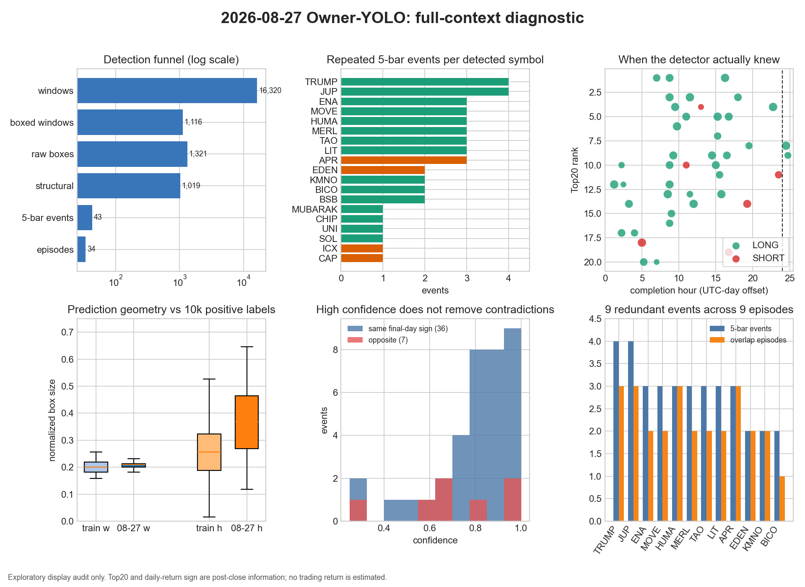
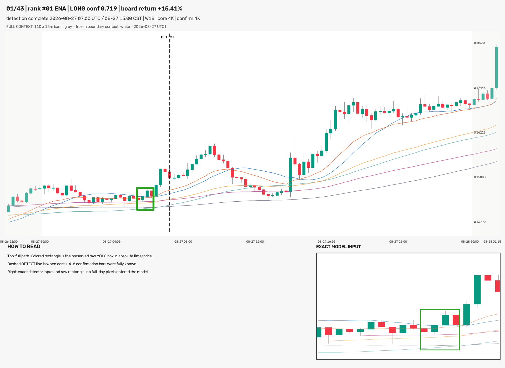
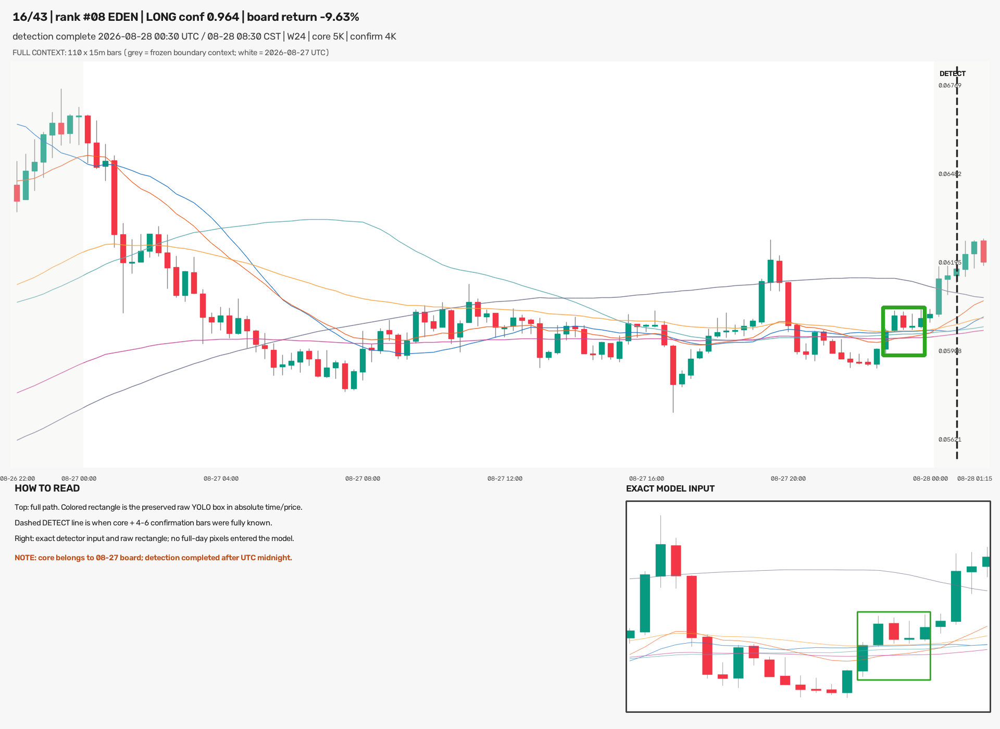
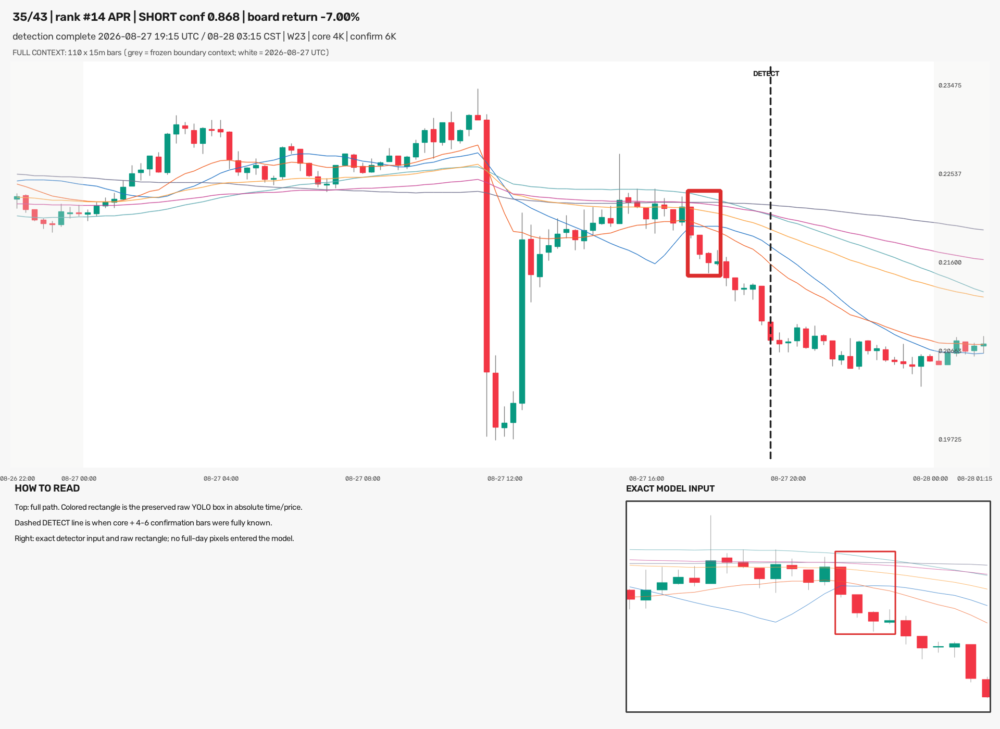

# 2026-08-27 全部信号：高清全景复核与详细数据分析

## 结论先行

- 已把 2026-08-27 榜单归属的 **43 个冻结事件**逐个重画并发到 Telegram：37 LONG、6 SHORT，
  覆盖 Top20 中 19 个币，ONT 无信号。每个文件都是 **1920×1400 PNG document**，上方显示
  110 根连续 15m K 线全景，右下显示模型当时真正看到的 1280×742、W18–25 输入；每张严格一个
  原始 YOLO 框。
- 43 张图不是重新推理、重筛或手改框。离线 verifier 对 43/43 事件身份、43/43 模型输入像素、
  43/43 全图逐像素重渲染、43/43 原框逆投影与 43/43 PNG SHA 均通过。
- 昨天的主要问题不是“图上框画多了”这么简单，而是**模型选择性仍然不足**：16,320 个滑窗中
  1,116 个窗口有框，1,019 个结构合格框压成 43 个 5-bar 事件；Top20 中 19/20 个币被检出，
  每个有信号币平均 2.26 个事件。
- 43 个旧口径事件进一步按重叠决策区间只剩 **34 个连续 episode**。其中 9 个事件其实是已有
  episode 的第二次触发；如果复核 surface 每个币日只保留最早 episode，才会变成 19 张，而不是
  模型天然只报 19 次。不能把展示聚合包装成模型更准。
- 全景里的框看起来窄，主要是比例变化：原框中位宽度为 3.73 根 K，只占 110 根全景横轴的
  **3.42%**。它与 10,000 个训练正标签的归一化中位宽度只差 +4.2%，没有被全景渲染器压窄；
  但预测框中位高度比训练标签高 **43.5%**，这是当前高波动样本上的真实定位差异，不能在展示层
  美化掉。
- 框与 `DETECT` 虚线不是同一个时间：框定位核心 4–5 根 K，模型还要再看 4–6 根确认 K 才完成
  检测，因此真实延迟为 **60–90 分钟，中位 60 分钟**。这套模型不能把框右端冒充实时信号时刻。
- 本轮是该配置经 Owner 授权的 **holdout 消费 #3**。这是事后 Top20 的探索性展示审计，不是
  预注册交易绩效试验；没有据此调阈值、NMS、episode 规则或权重，也没有训练、promote、部署、
  forward 写入或下单。



## 这 43 张高清图到底画了什么

每张文件的上半部分固定使用该币冻结快照中的最大共同连续范围：
`2026-08-26 22:00` 至 `2026-08-28 01:15 UTC`，共 110 根 15m K。白色区域是完整 08-27 UTC
日，灰色区域是边界上下文。最初计划画到 01:45，但 19 份冻结快照都只到 01:15；预检在写出
结果前 fail-closed，最终没有联网补两根，也没有造数据。

彩色矩形不是按全日图重新猜的核心框，而是：

1. 从冻结账本取模型原始 `prediction_cx/cy/w/h`；
2. 用当时 W18–25 输入的 `ChartTransform` 把四个像素边界逆变换成绝对小数 K 线索引和价格；
3. 再通过 110 根全景的 `ChartTransform` 投影回来；
4. 右下角同时放入逐像素相同的模型输入和原框，供肉眼对照；
5. 虚线固定在完整检测窗右端 `window_end_time`。

如果错误地把小窗归一化 x 直接乘到 110 根全景上，框中心的中位绝对偏差会达到 **26.82 根 K，
约 402 分钟**。正确的时间/价格双变换在 43 张图中全部以 1 像素以内闭环复现。

## 与前两版展示的同日对照

| 08-27 展示版本 | 图/面板 | 展示框 | 框来源 | 能否看整体 | 能否核对模型实际输入 |
|---|---:|---:|---|---|---|
| v1 压缩日图 | 20 个币日面板 | 43 个事件叠画；单面板最多 4 个 | x 来自预测，y 曾按核心 high/low 重造 | 是，但多框混在一起 | 否 |
| rawbox-v2 最早 episode | 20 个币日面板 | 19×1 + ONT×0 | 完整原始 `cx/cy/w/h` | 否，只显示各自 W18–25 | 是 |
| **本轮 fullcontext-v3** | **43 个独立文件** | **43×1** | **同一个原始框经绝对时间/价格投影** | **是，110 根** | **是，右下 exact inset** |

v3 没有删除 v1 的任何事件，也没有把 v2 的 19 张复核 surface 冒充全量。它解决的是“同一张图既
要看整体，又要知道模型当时看了什么”的证据问题；43→34→19 的模型选择性问题仍原样保留。

### 示例 1：ENA LONG，完整日内路径



### 示例 2：EDEN 的榜单归属在 08-27，但检测跨过 UTC 午夜



### 示例 3：APR SHORT，框和检测完成线相隔确认 K



## 检出漏斗：为什么仍然感觉信号太多

| 层级 | 数量 | 相邻层解释 |
|---|---:|---|
| 扫描窗口 | 16,320 | 20 个币日 × 816 个 W18–25 因果小窗 |
| 有任意框的窗口 | 1,116 | 窗口检出率 6.84% |
| 原始 YOLO 框 | 1,321 | 一个窗口可有多个框 |
| 结构合格框 | 1,019 | 原始框的 77.14% 通过核心/确认/日界门 |
| 5-bar 去重事件 | 43 | 从结构框移除 976 个，移除率 95.78% |
| 重叠决策 episode | 34 | 仍有 9 个旧事件属于已有连续 episode |
| 有信号币 | 19 / 20 | 每币日只取最早 episode 才得到 19 张 surface |

因此有三个不同数字，不能混着说：

- **43** 是旧扫描合同的 5-bar 去重事件，必须原样保留；
- **34** 是相互重叠的连续决策 episode，更接近“独立行情段”；
- **19** 是每币日只展示最早 episode 的人工复核 surface，不代表模型只报 19 次。

43 个事件中，6 个币只有 1 次、4 个币有 2 次、7 个币有 3 次、TRUMP 和 JUP 各 4 次。ENA、
MOVE、MERL、TAO、LIT、TRUMP、JUP、BICO、BSB 各有 1 个 5-bar 事件落在已经存在的 episode
里。这证明单纯“每隔 5 根去重”仍会把连续识别段切成两次信号。

## 框宽是否异常，以及和训练标签是否一致

| 几何 | 10,000 训练正标签中位数 | 08-27 的 43 个预测中位数 | 变化 |
|---|---:|---:|---:|
| `cx_norm` | 0.670 | 0.673 | +0.3 个百分点 |
| `w_norm` | 0.201 | 0.209 | +4.2% |
| `cy_norm` | 0.501 | 0.580 | +7.9 个百分点 |
| `h_norm` | 0.256 | 0.368 | **+43.5%** |

横向上，模型预测与训练标签非常接近：预测中位宽 3.73 根 K，4 根核心 22 个、5 根核心 21 个。
在 1280×742 小窗中它不窄；放到 110 根全景里必然只占约 3.42% 宽，这就是肉眼上“框很窄”的
主要原因。右下角真实输入 inset 用来防止把全景比例误认为训练输入比例。

纵向则不能说“完全一样”：43 个预测的高度分布明显更大，95 分位 0.598，而训练标签 95 分位为
0.426。这可能反映当前 Top20 高波动路径、模型定位膨胀或训练标签语义不足；本轮只确认它是原始
模型输出事实，不在 holdout 上手工收紧框。另需注意，扫描器的 `core_start/core_end` 本来就是从
预测横向几何映射出来的，所以两者贴合不是独立的语义正确性证据。

## 置信度并没有解决重复和方向矛盾

43 个事件置信度均值 0.781、中位数 0.829；38 个 ≥0.50、32 个 ≥0.70、25 个 ≥0.80、13 个
≥0.90。看起来分数很高，但：

- 仍有 9 个事件是同一连续 episode 的第二次触发；
- 7/43 个方向与币种最终日涨跌符号相反；
- 这 7 个反向事件的平均置信度仍有 0.716，不能说低分天然都是错框；
- EDEN 当日 -9.63%，两个事件却都是 LONG；APR 当日 -7.00%，3 个事件中 2 LONG、1 SHORT；
  HUMA、JUP、KMNO 也各有一次局部反向事件。

36/43（83.7%）与最终日方向一致，只能说明模型在**已经走完并被事后挑进 Top20 的路径**中大多
识别同向趋势。Top20 身份和最终正负号都要等收盘后才知道，所以 83.7% 不是交易胜率，更不能据此
挑一个置信度门。置信度阈值若要改变，必须另开 pre-holdout 或新鲜 tip 的单变量实验。

## 时间：框早于真正可用信号

| 确认 K | 事件数 | 核心框后额外等待 |
|---:|---:|---:|
| 4 | 28 | 60 分钟 |
| 5 | 9 | 75 分钟 |
| 6 | 6 | 90 分钟 |

24 个事件在 12:00 UTC 前完成，12 个在 12:00–18:00 完成，7 个在 18:00 后完成；EDEN 和
TRUMP 各有一个事件直到 08-28 00:30 / 00:45 UTC 才完成。它们归属 08-27 榜单是冻结扫描合同的
事实，但若未来用于实时告警，时间戳必须记完整窗口右端，不能记核心框右端。

## 逐币详细表

`事件`为旧 5-bar 去重口径，`episode`为重叠决策区间聚合；`同日方向`只是事后最终涨跌符号对照。

|排名|币种|日涨跌|事件|episode|多/空|同日方向|置信度均/高|首个完成 UTC|最后完成 UTC|
|---:|---|---:|---:|---:|---:|---:|---:|---|---|
|1|ENA|+15.41%|3|2|3/0|3/3|0.836/0.959|08-27 07:00|08-27 16:15|
|3|MOVE|+11.40%|3|2|3/0|3/3|0.881/0.970|08-27 08:45|08-27 18:00|
|4|HUMA|+10.54%|3|3|2/1|2/3|0.740/0.980|08-27 09:30|08-27 22:45|
|5|MERL|+10.40%|3|2|3/0|3/3|0.892/0.961|08-27 11:00|08-27 16:45|
|6|MUBARAK|+9.73%|1|1|1/0|1/1|0.970/0.970|08-27 09:45|08-27 09:45|
|7|CHIP|+9.70%|1|1|1/0|1/1|0.684/0.684|08-27 15:15|08-27 15:15|
|8|EDEN|-9.63%|2|2|2/0|0/2|0.800/0.964|08-27 19:30|08-28 00:30|
|9|TRUMP|+9.56%|4|3|4/0|4/4|0.793/0.919|08-27 09:15|08-28 00:45|
|10|JUP|+8.94%|4|3|3/1|3/4|0.675/0.871|08-27 02:15|08-27 15:00|
|11|KMNO|+8.75%|2|2|1/1|1/2|0.710/0.728|08-27 15:30|08-27 23:30|
|12|TAO|+8.23%|3|2|3/0|3/3|0.712/0.957|08-27 01:15|08-27 08:45|
|13|LIT|+7.40%|3|2|3/0|3/3|0.806/0.981|08-27 08:30|08-27 15:45|
|14|APR|-7.00%|3|3|2/1|1/3|0.896/0.970|08-27 03:15|08-27 19:15|
|15|UNI|+6.92%|1|1|1/0|1/1|0.740/0.740|08-27 09:00|08-27 09:00|
|16|SOL|+6.91%|1|1|1/0|1/1|0.701/0.701|08-27 08:45|08-27 08:45|
|17|BICO|+6.59%|2|1|2/0|2/2|0.720/0.784|08-27 02:15|08-27 04:00|
|18|ICX|-6.51%|1|1|0/1|1/1|0.968/0.968|08-27 05:00|08-27 05:00|
|19|CAP|-6.46%|1|1|0/1|1/1|0.807/0.807|08-27 16:45|08-27 16:45|
|20|BSB|+6.30%|2|1|2/0|2/2|0.536/0.783|08-27 05:15|08-27 07:00|

## 验收、零假设对照与不适用指标

这是检测展示、重复性和几何 parity 审计，没有定义入场、持仓、TP/SL 或收益标签。因此 val AUC、
top-decile 毛/净收益、胜率、0.2% 成本、收益置换检验和同币×同时间块×同波动桶随机入场对照均
不适用；强行计算会把视觉事件伪装成交易实验。

等价的严格零假设/负对照是：如果事件身份、输入像素或坐标变换错了，冻结账本就不能逐像素复现；
如果错误地把小窗归一化坐标直接画到全景上，应出现可量化的大偏移。

| 验收 / 负对照 | 结果 |
|---|---:|
| 事件身份 | 43/43 完全一致 |
| 模型实际输入像素 SHA | 43/43 一致 |
| 1920×1400 全图独立重渲染 | 43/43 逐像素一致 |
| 每张文件框数 | 43×1；最小=最大=1 |
| 原框逆投影→回投影闭环 | 43/43，误差 ≤1px |
| 错误的直接归一化投影 | 中位错 26.82 根 K / 402 分钟 |
| Telegram document 回执 | 43/43 完整 |
| 网络 / 新推理 / 调参 / 训练 | 0 / 0 / 0 / 0 |

## Holdout 使用与诚实边界

这 43 个事件来自 2026-08-27，晚于项目 holdout 起点 2026-05-04。Owner 先要求详细数据分析，随后
明确要求先把昨天全部信号以高清全景发到 TG；本轮记录为同一配置 **第 3 次有界 holdout 消费**。
本轮复用冻结的事件账本、19 份快照和原始预测四维坐标，不重新抓取、不重新推理、不改变选择。

详细统计属于看完图后的探索性诊断，不是预注册性能检验。尤其禁止接下来直接在这 43 张上选择
置信度、最小间隔、episode 预算、框高或方向过滤，然后继续把 08-23..27 当未见 holdout。若要
解决 19/20 覆盖和重复告警，必须在 pre-holdout 或新的新鲜 tip Gold 上冻结一个单变量方案。

## 风险与诚实声明

1. **高波动事后选池。** Top20 是收盘后榜单，19/20 覆盖率不能外推到全市场实时选择性。
2. **框正确复现不等于语义正确。** parity 证明画的是模型原框，不证明它符合 Owner 的严格 Gold。
3. **重复仍严重。** 43→34 episode→19 review surface 是三层不同口径；只展示 19 张会掩盖模型
   实际触发量。
4. **完成时间晚于框。** 4–6 根确认 K 是结构性延迟，不能靠把竖线左移消除。
5. **预测框高度漂移。** 横向与训练标签接近，纵向明显更大，需要新的未见语义 Gold 审计；不能
   在本五天手工重框后当成模型改进。
6. **没有经济结论。** 36/43 最终日方向一致不是胜率，本轮没有匹配随机交易对照。
7. **生产状态未动。** `training_eligible=false / production_eligible=false`；ACTIVE/frozen、
   tip-smoke、forward、部署、仓位和订单均未改变。

## 完整复现命令

```bash
cd /Users/zhangzc/fable-trading
git branch --show-current

# 在独立目录复现，避免覆盖正式 holdout 回执与 43 张已发送文件
FULLCONTEXT_REPRO_DIR=$(mktemp -d "$PWD/analysis/output/fullcontext_repro.XXXXXX")

# 仅用冻结账本与本地快照生成 43 张全景；无网络、无模型推理
PYTHONPATH=. .venv/bin/python \
  scripts/render_15m_ma_launch_owner_yolo_20260827_fullcontext.py \
  --results "$FULLCONTEXT_REPRO_DIR/results"

# 逐张重新渲染并逐像素复核
PYTHONPATH=. .venv/bin/python \
  scripts/verify_15m_ma_launch_owner_yolo_20260827_fullcontext.py \
  --results "$FULLCONTEXT_REPRO_DIR/results"

# 描述性几何、重复与时序分析；不计算交易收益
PYTHONPATH=. .venv/bin/python \
  scripts/analyze_15m_ma_launch_owner_yolo_20260827_fullcontext.py \
  --results "$FULLCONTEXT_REPRO_DIR/results"

# Telegram 是外部交付而非分析复现步骤；正式回执已完成，发送器会拒绝重复发送。
# 43-document mock transport contract 由下面的测试覆盖。

PYTHONPATH=. .venv/bin/python -m pytest -q tests
python3 scripts/md_to_html.py \
  analysis/p1_15m_ma_launch_owner_yolo_20260827_fullcontext_analysis_20260828.md \
  --out-dir analysis/html
```

## 产物入口

- 43 张高清 PNG：`experiments/active/exp-15m-ma-launch-owner-yolo-20260827-fullcontext-v3/results/charts/`
- 逐事件详细表：`.../results/detailed_event_analysis.csv`
- 逐币详细表：`.../results/detailed_symbol_analysis.csv`
- 机器可读统计：`.../results/detailed_analysis_receipt.json`
- 逐像素 QA：`.../results/qa_receipt.json`
- Telegram 回执：`.../results/telegram_delivery_receipt.json`
- Owner HTML：`analysis/html/p1_15m_ma_launch_owner_yolo_20260827_fullcontext_analysis_20260828.html`

下一步应先让 Owner 看完这 43 张并指出哪些属于严格 Gold、哪些是重复或语义错框；在新的未见范围
预注册聚合/选择性方案之前，不继续在本五天调规则。
