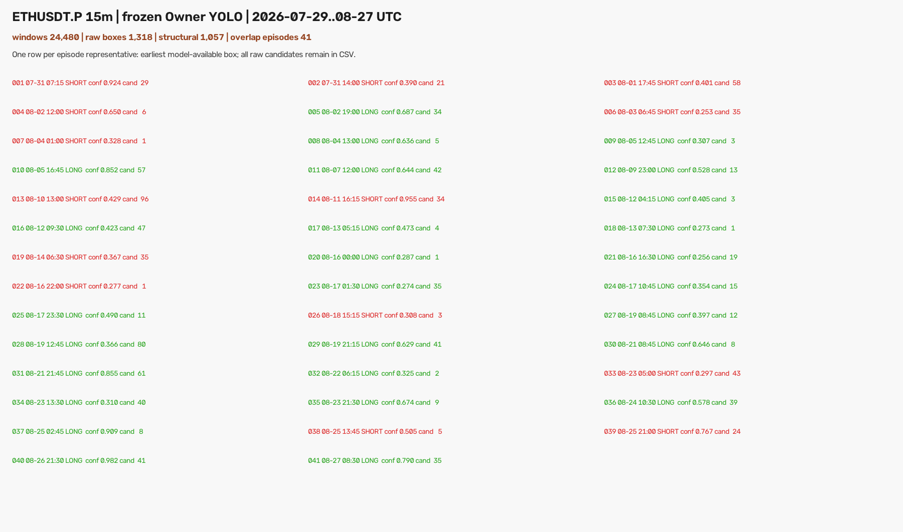

# ETHUSDT.P 近 30 日原 Owner-YOLO 扫描（2026-08-28）

## 技术摘要

按 Owner 要求，使用当前 **Owner 10,000 正例 + 30,000 负例**训练出的原始权重，对
`ETH-USDT-SWAP` 的 2026-07-29 至 2026-08-27 共 30 个完整 UTC 日重新进行了 15m 扫描。
权重、`conf=0.25`、NMS IoU 0.7、W18–25、4–5 根核心和 4–6 根确认全部未改。

结果是：24,480 个模型输入产生 1,318 个原始框，其中 1,057 个通过原有横向结构门；按 5 根 K
去重后是 53 个事件，再按跨滑窗连续重叠区间合并为 **41 个独立 episode：27 LONG / 14 SHORT**。
41 个 episode 覆盖 24/30 个完整日。



这 41 个 episode 已分别渲染成 41 张 1920×1400 PNG：每张上方显示 128 根连续 15m K 的整体
行情，只画该 episode 的第一个原始 YOLO 框；右下角是模型实际看到的 1280×742 W18–25 输入和
同一个原始框。虚线 `DETECT` 是模型完成检测的真实时间；其右侧若有灰色行情，只用于事后看图，
从未进入模型推理。

## 结果漏斗

| 层级 | 数量 | 解释 |
|---|---:|---|
| 完整 UTC 日 | 30 | 2026-07-29..08-27 |
| 连续 15m K | 3,078 | 含 48 小时 MA warmup 与末端 6 根确认上下文 |
| 模型输入窗口 | 24,480 | 每日 102 个 endpoint × W18–25 八种窗口 |
| 含任意框的窗口 | 1,090 | 4.45% 的输入至少出一个框 |
| 原始 YOLO 框 | 1,318 | 一个输入可以有多个框 |
| 结构合格候选 | 1,057 | 映射为核心 4–5 根、确认 4–6 根，核心归属目标日 |
| 5 根 K 去重事件 | 53 | 1,004 个重叠候选被去除，去除率 94.99% |
| 连续重叠 episode | **41** | 跨滑窗、跨 UTC 日按实际连续区间合并 |
| LONG / SHORT | **27 / 14** | 以每个 episode 最早可见框的类别计 |
| 有 episode 的日期 | 24 / 30 | 六个完整日没有 episode |

## 41 个 episode 的分布

| 指标 | 结果 |
|---|---:|
| 每日 episode 均值 | 1.37 |
| episode 置信度中位数 | 0.429 |
| episode 置信度均值 | 0.517 |
| episode 置信度范围 | 0.253–0.982 |
| conf ≥ 0.50 | 18 / 41 |
| conf ≥ 0.75 | 8 / 41 |
| conf ≥ 0.90 | 4 / 41 |
| 每个 episode 原始候选中位数 | 21 |
| 每个 episode 原始候选最大值 | 96 |
| 最密集重复段 | 08-10 13:00 UTC，SHORT，96 个候选合为一个 episode |

大量原始框并不代表有大量独立形态。模型在同一段连续行情的相邻 endpoint 和不同 W18–25
窗口上会重复命中：1,057 个结构候选最终只对应 41 个连续 episode。TG 交付因此采用“一张图一个
episode、一个原始框”，但原始 1,057 个候选全部保留在 CSV，没有被隐藏或删除。

## 图像与框的校验

独立校验重新读取冻结 ETH 快照和 `episodes.csv`，逐个恢复模型实际窗口、原始归一化
`cx/cy/w/h`、128 根全景和 1920×1400 成图：

| QA 项 | 结果 |
|---|---:|
| 单框高清文档 | 41 / 41 |
| 模型实际输入像素一致 | 41 / 41 |
| 完整文档逐像素重渲染一致 | 41 / 41 |
| PNG SHA 一致 | 41 / 41 |
| 唯一模型输入 SHA | 41 / 41 |
| 唯一文档 SHA | 41 / 41 |
| 循环错配 episode 与下一张输入的零假设命中 | **0 / 41** |

零假设对照表示：若图与事件只是按顺序误配，循环移动一位后仍可能出现输入 SHA 命中；实际为
0/41，而正确配对为 41/41。这里验证的是“图确实对应模型实际输入与框”，不是宣称 41 个框都符合
Owner 的视觉标准。

## 重要口径

本轮**没有**再用历史 14 项训练样本检索门，把 41 个 episode 自动判成“对”或“错”。那些门用于
当初搜索弱标签样本，全部通过与否不等同于 Owner 的视觉判断。这里交付的是模型在冻结参数下真实
跑出的结果，让 Owner 直接看到整体行情、检测时点和模型输入。

同样，本轮是非方向性的检测/渲染任务，不存在合理的 val AUC、置换检验 p、top-decile 收益、
胜率或匹配随机入场对照；因此不编造这些交易指标。模型是否具有交易价值需要另行预注册的因果
收益实验，本轮没有做。

## 风险与诚实声明

- 41 个 episode 是模型候选，不是 41 个 Owner Gold，也不表示 41 个都标准。
- `confidence` 是 YOLO 框置信度，不是行情上涨/下跌概率，也不是视觉正确率。
- 检测需要核心后的 4–6 根确认 K，即完成时间通常晚于框中核心 60–90 分钟；不能冒充 tip 信号。
- 主图中 `DETECT` 右侧的 K 线只为事后看整体，右下模型输入证明这些未来像素没有进入推理。
- 这是同一检测配置经 Owner 明确授权的 holdout 消费 **#5**。本轮结果不得再用于在这 30 天上
  调置信度、NMS、窗口或 episode 规则后声称未见验证。
- 本轮没有训练、调参、改标签或权重，也没有改 ACTIVE/frozen、promote、forward、部署或订单。
  `training_eligible=false / production_eligible=false` 保持不变。

## 复现命令

```bash
cd /Users/zhangzc/fable-trading

PYTHONPATH=. .venv/bin/python \
  scripts/scan_15m_ma_launch_owner_yolo_eth30d.py --fetch

PYTHONPATH=. .venv/bin/python \
  scripts/scan_15m_ma_launch_owner_yolo_eth30d.py --scan --batch-size 32

PYTHONPATH=. .venv/bin/python \
  scripts/scan_15m_ma_launch_owner_yolo_eth30d.py --verify

PYTHONPATH=. .venv/bin/python -m pytest \
  tests/test_15m_ma_launch_owner_yolo_eth30d.py -q

.venv/bin/python scripts/md_to_html.py \
  analysis/p1_15m_ma_launch_owner_yolo_eth30d_20260828.md \
  --out-dir analysis/html
```

官方构建拒绝覆盖既有快照、扫描结果和 TG 回执；从零复现应使用新的实验目录，不能删除本轮证据后
冒充第一次运行。
