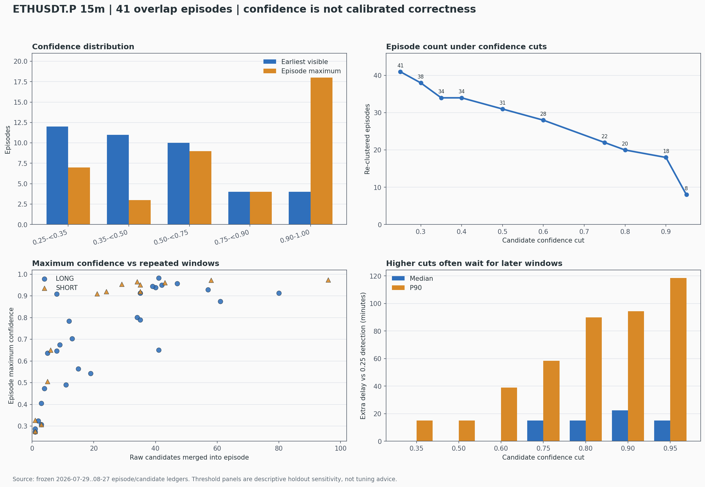

# ETHUSDT.P 近 30 日模型置信度分析（2026-08-28）

## 技术摘要

这 41 个独立 episode 的**首次可见框置信度整体并不高**：中位数 0.429，23/41（56.1%）低于
0.50，只有 8/41 达到 0.75，4/41 达到 0.90。按 TG 图上的首次框排序，最高四张是
**#40 0.982、#14 0.955、#01 0.924、#37 0.909**。

但“episode 内后续最高置信度”是另一回事：其中位数升至 0.790，18/41 最终达到 0.90。这个高分
往往是行情继续走、模型又看过更多相邻 endpoint 与 W18–25 窗口后才出现；41 个 episode 中只有
18 个一开始就达到自身最高分，另外 23 个最高分出现在更晚的窗口，最晚相差 12 根 15m K（3 小时）。

因此，**不能把 episode 内最高分当成最初信号的置信度**。同样，confidence 只是 YOLO 对“像不像
训练标签”的内部得分，不是 Owner 视觉正确率、涨跌概率或交易胜率。本批没有 Owner 真值标签，
所以不能用它证明“高置信度一定更准”，也不能据此选择新阈值。



## 首次分数偏低，后续最高分明显右移

蓝色口径对应 TG 每张图上真实显示的最早可见原框；橙色口径是同一 episode 后来所有重复窗口中的
最高分。两者必须分开：前者可用于描述实际首次检测，后者包含额外等待和多次抽样机会。

| 置信度区间 | 首次可见框 | 占 41 个比例 | episode 内最高分 |
|---|---:|---:|---:|
| 0.25–<0.35 | 12 | 29.3% | 7 |
| 0.35–<0.50 | 11 | 26.8% | 3 |
| 0.50–<0.75 | 10 | 24.4% | 9 |
| 0.75–<0.90 | 4 | 9.8% | 4 |
| 0.90–1.00 | 4 | 9.8% | 18 |

首次分数均值 0.517、中位数 0.429、四分位范围 0.325–0.650；episode 最高分均值 0.714、中位数
0.790。平均上升 0.197，但中位只上升 0.022，说明均值被少数“低分起步、后来突然高分”的 episode
拉高。例如 #06 从 0.253 升至 0.951（晚 2 根），#33 从 0.297 升至 0.961（晚 1 根），#23 从
0.274 升至 0.913（晚 6 根）。

## 单纯提高阈值不会像“首次高分张数”那样大幅减少信号

下面不是重新推理，也不是推荐阈值；只是把冻结的 1,057 个候选按不同 confidence 截断后，重新执行
完全相同的连续 episode 合并，观察数量与首次出现时间的敏感度。

| 候选阈值 | 保留候选框 | 重合并 episode | LONG / SHORT | 有检测的 UTC 日 | 相对 0.25 中位额外延迟 | P90 额外延迟 |
|---:|---:|---:|---:|---:|---:|---:|
| 0.25 | 1,057 | 41 | 27 / 14 | 24 | 0 分钟 | 0 分钟 |
| 0.35 | 853 | 34 | 23 / 11 | 22 | 0 分钟 | 15 分钟 |
| 0.50 | 616 | 31 | 20 / 11 | 21 | 0 分钟 | 15 分钟 |
| 0.75 | 276 | 22 | 13 / 9 | 18 | 15 分钟 | 58.5 分钟 |
| 0.90 | 81 | 18 | 9 / 9 | 15 | 22.5 分钟 | 94.5 分钟 |
| 0.95 | 18 | 8 | 2 / 6 | 8 | 15 分钟 | 118.5 分钟 |

最容易误解的一点是：TG 首次框只有 18 张达到 0.50，但若候选门设为 0.50，并不是只剩 18 个
episode，而是仍有 **31 个**。原因是另外 13 个 episode 会在后续相邻窗口中越过 0.50，只是信号
出现得更晚。0.90 亦同：最初只有 4 张达到 0.90，但稍后共有 18 个 episode 达到 0.90。

所以 confidence 门主要同时改变两件事：**过滤一部分 episode + 推迟另一部分 episode**。仅看最终
保留数量会漏掉延迟代价；仅看 TG 首次框的高分张数又会高估过滤力度。

## episode 最高分受到重复窗口次数的强烈影响

首次可见分数与 episode 候选数的 Spearman 相关为 0.281；固定 41 个候选数、随机打乱首次分数
10,000 次的双侧置换 `p=0.0761`，没有越过 0.05。相反，episode 最高分与候选数的相关达到
**0.859**，同样置换对照 `p=0.00010`。

这符合“多看几次更容易抽到一个高分”的最大值效应：候选越多，episode 最高分越容易接近 1。
因此最高分不能被当作独立的质量证据。它同时混合了形态、持续时间、可用窗口数量和检测延迟。

## 多空分数差异暂时不能解释为质量差异

| 方向 | episode | 首次分数均值 | 首次分数中位 | 最高分中位 | episode 候选数中位 |
|---|---:|---:|---:|---:|---:|
| LONG | 27 | 0.531 | 0.490 | 0.704 | 15.0 |
| SHORT | 14 | 0.489 | 0.396 | 0.921 | 26.5 |

SHORT 的首次中位分数反而低于 LONG，但后续最高分更高；同时 SHORT 每个 episode 的候选数中位
为 26.5，明显高于 LONG 的 15.0。结合上面的最大值效应，更合理的解释是 SHORT 获得了更多重复
窗口和后续抽样机会，而不是模型已经证明 SHORT 更准。样本只有 14 个 SHORT，且没有逐 episode
真值，这里不做方向优劣推断。

## 首次置信度最高的 10 张 TG 图

| TG 编号 | 方向 | 检测完成（北京时间） | 首次分数 | episode 最高分 | 候选数 | 最高分晚几根 K |
|---:|---|---|---:|---:|---:|---:|
| 40 | LONG | 08-27 05:30 | 0.982 | 0.982 | 41 | 0 |
| 14 | SHORT | 08-12 00:15 | 0.955 | 0.966 | 34 | 1 |
| 01 | SHORT | 07-31 15:15 | 0.924 | 0.954 | 29 | 1 |
| 37 | LONG | 08-25 10:45 | 0.909 | 0.909 | 8 | 0 |
| 31 | LONG | 08-22 05:45 | 0.855 | 0.875 | 61 | 2 |
| 10 | LONG | 08-06 00:45 | 0.852 | 0.928 | 57 | 7 |
| 41 | LONG | 08-27 16:30 | 0.790 | 0.790 | 35 | 0 |
| 39 | SHORT | 08-26 05:00 | 0.767 | 0.921 | 24 | 1 |
| 05 | LONG | 08-03 03:00 | 0.687 | 0.801 | 34 | 3 |
| 35 | LONG | 08-24 05:30 | 0.674 | 0.674 | 9 | 0 |

这个排名只回答“模型第一次有多肯定”，不回答图是否符合 Owner 目标。若把后续最高分拿来排序，
排名会显著改变，并把更晚的信息混入早期信号比较。

## 范围、定义与方法

- 分析单位：已经冻结的 41 个跨滑窗连续 episode；来源范围仍是 ETHUSDT.P 15m、2026-07-29 至
  08-27 共 30 个完整 UTC 日。
- 首次可见置信度：episode 中最早 `window_end` 的候选；同一最早时点有多个框时取最高分。这正是
  TG 图上展示的原框。
- episode 最高置信度：该 episode 以后所有 0.25 以上候选框的最大值；它不是因果首发指标。
- 阈值敏感度：在既有 1,057 行候选账本上截断后重新执行同一 overlap clustering，没有重新跑
  YOLO，也没有改变任何原始框。
- 零假设对照：保持候选数不变，随机置换 41 个 episode 的置信度秩 10,000 次，比较绝对
  Spearman 相关；随机种子 20260828。
- 数据完整性：来源 ZIP SHA-256 为
  `3a34913a0c7b7d5e07f113434f33ff650a3183095360b16b53cf4f702f27ae18`；41 个 episode 与
  1,057 个候选的逐 episode 数量和最大分全部闭环。

## 限制、诚实声明与稳健性

- 本批没有 Owner Gold 或逐图正确/错误标签，因此无法计算置信度分档 precision、recall、可靠性图、
  ECE 或“高分比低分准多少”。
- 未读取未来收益、PnL、止盈止损或日涨跌幅作为结果标签；confidence 与交易价值无关。
- 这是对 holdout 消费 #5 已冻结输出的同轮描述性切片，`new_holdout_consumption=false`。阈值表只能
  显示数量和延迟敏感度，禁止拿它选择阈值后在这 30 日上宣称未见验证。
- 方向性收益指标、val AUC、top-decile、匹配随机入场和成本收益在本任务中不适用；这里的同等严格
  零假设是置信度秩置换与候选数相关对照，不编造经济指标。
- 没有训练、调参、改标签/权重、ACTIVE/frozen、promote、forward、部署或订单变更；仍
  `training_eligible=false / production_eligible=false`。

## 建议的下一步

**当前不要仅凭这 41 张把 conf 从 0.25 改成 0.50、0.75 或 0.90。** 这批只能证明提高门槛会减少
数量并产生额外延迟，不能证明剩下的图更标准。

真正能决定阈值的下一步，应在独立的 pre-holdout 或新鲜因果 tip Gold 上预注册：按首次可见分数
分档，报告每档 precision 与置信区间、漏检率、首次检测延迟，并用相同 episode 规则比较。只看
episode 最终最高分的方案应排除，因为它天然偏向持续更久、重复窗口更多的行情。

## 复现命令

```bash
cd /Users/zhangzc/fable-trading

PYTHONPATH=. .venv/bin/python \
  scripts/analyze_15m_ma_launch_owner_yolo_eth30d_confidence.py \
  --out /tmp/eth30d_confidence_rebuild

PYTHONPATH=. .venv/bin/python -m pytest -q \
  tests/test_15m_ma_launch_owner_yolo_eth30d_confidence.py

.venv/bin/python scripts/md_to_html.py \
  analysis/p1_15m_ma_launch_owner_yolo_eth30d_confidence_20260828.md \
  --out-dir analysis/html
```
