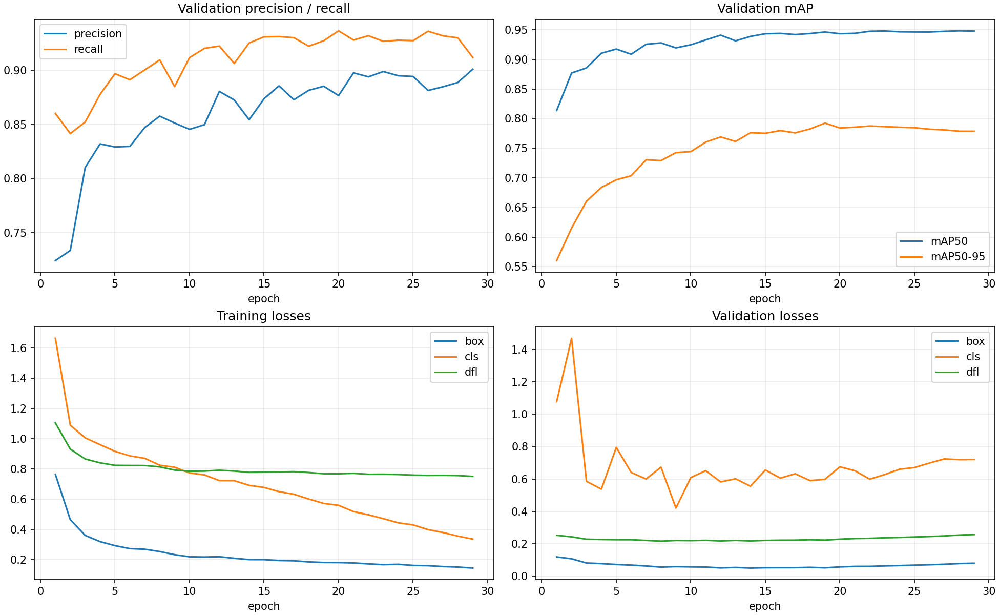
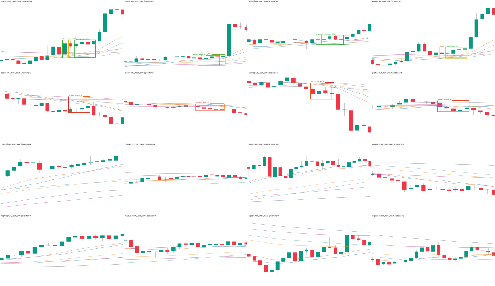

# 15m Owner 弱标签 10,000 正 + 30,000 负 YOLO 960 训练报告

## 结论先行

- RTX 3060 训练已完成且正常退出：请求 40 轮，实际第 29 轮触发 `patience=10` 早停，
  `best.pt` 来自第 19 轮；远端退出码为 0，取回文件与 3060 现场 SHA-256 逐字节一致。
- 回载最佳权重在冻结的 pre-holdout 时间验证集上得到 **P 0.8852、R 0.9262、mAP50
  0.9462、mAP50-95 0.7923**。LONG / SHORT 的 mAP50-95 分别为 0.780 / 0.805。
- 固定 `conf=0.25` 对全部 **5,445 张空标签负例**推理，仅 46 张出框，误报图率
  **0.845%**；hard 为 1.148%，easy 为 0.267%。阈值没有为本结果调优。
- 因为指标明显高于旧研究模型，追加了独立 split 审计：train/val 图像 SHA、sample ID、
  source sample ID 交集均为 0；191 个共用源文件的完整依赖区间重叠为 0，时间空档 76 小时。
  没发现直接的像素或事件跨 split 泄漏。
- **不能把提升归因给“负例从 1 万增至 3 万”。** 字节一致的 10,000 正 + 10,000 负前身
  没有按本配方训练；旧 960 模型来自另一套 36,812 图数据，下面只作历史背景，不能作因果对照。
- 这是包含核心后完成态上下文的 Owner 批量认可弱标签模型，不是 tip 实盘检测器。没有读取
  holdout，没有改 ACTIVE/frozen，没有 promote、部署或改变 forward/order 状态，
  `production_eligible=false`。
- 当前项目测试为 **1,721 passed、4 skipped**；没有为本实验改变跨机依赖合同。



## 实际训练数据

数据集是 `ma_launch_owner_autofill10000_yolo_neg30000_v2`，所有源 PNG 为 1280×742 无损图；
训练时 `imgsz=960` 由 Ultralytics 在内存中按标准流程缩放，不会改写源文件。正图和负图使用同一
渲染器、颜色、均线及尺寸，训练 PNG 内没有红框；框只存在于正例 `.txt` 标签。

| split | 正例 | 负例 | 总图数 | LONG / SHORT 正框 |
|---|---:|---:|---:|---:|
| train | 8,161 | 24,483 | 32,644 | 4,096 / 4,065 |
| val | 1,815 | 5,445 | 7,260 | 896 / 919 |
| excluded purge | 24 | 72 | 96 | 不进入 data.yaml |
| 全部物化 | **10,000** | **30,000** | **40,000** | 5,000 / 5,000 |

30,000 个负例中 hard 19,922、easy 10,078。每个正例配三个同源、同币、同时间块、同 split、
同窗口几何且互不重叠的负窗；全部 14,117 个严格候选仍在禁入保护区内。完整文件 QA 已验证
40,000 个唯一图像哈希、30,000 个字节为空的负标签、10,000 个可解析正标签和 0 个烙入训练图
的精确红框像素。

数据身份：

| 产物 | SHA-256 |
|---|---|
| dataset manifest | `6e601034ab15765a74b788cc6d094e9326c3044c1fb615c908ef9de897d6e0af` |
| build summary | `5d47ed2ddfa9355b32abf1dbccad05354ebd37d8471abef3367832eec29d1c2a` |
| data.yaml | `94376651f00a7dc5be3192f181109d9b67d4fed92931c5af8c70cf0b5787ef25` |
| full dataset QA | `347343455e14872e23c410292a97b0dd5915be9f9217137a1a0e2ab748349d5d` |

## 训练合同与执行结果

| 项目 | 冻结值 / 实际值 |
|---|---|
| 设备 | NVIDIA RTX 3060 12GB，CUDA / torchvision NMS 通过 |
| 环境 | torch 2.8.0、torchvision 0.23.0、ultralytics 8.4.89、numpy 2.0.2；Mac/3060 完全一致 |
| 基础权重 | YOLO11s；SHA `85a76fe…2d502d5` |
| 训练 | epochs 40、patience 10、batch 8、imgsz 960 |
| 优化 | AdamW、lr0 1e-4、lrf 0.01、warmup 0.5 |
| 复现 | seed 0、deterministic true、rect true、cache false、workers 2 |
| 增强 | flip / HSV / mosaic / mixup / copy-paste / erasing 全 0；translate 0.02、scale 0.1 |
| 执行 | 29 轮早停；约 5.57 小时；最佳第 19 轮 |

| 口径 | epoch | Precision | Recall | mAP50 | mAP50-95 |
|---|---:|---:|---:|---:|---:|
| 第 1 轮 | 1 | 0.7244 | 0.8602 | 0.8136 | 0.5603 |
| results.csv 最佳行 | **19** | 0.8852 | 0.9273 | 0.9462 | **0.7924** |
| 早停当轮，不是交付权重 | 29 | 0.9009 | 0.9118 | 0.9478 | 0.7786 |
| 回载 `best.pt` 终局验证 | overall | **0.8852** | **0.9262** | **0.9462** | **0.7923** |
| 回载 `best.pt` | dense_long（896） | 0.870 | 0.923 | 0.937 | 0.780 |
| 回载 `best.pt` | dense_short（919） | 0.901 | 0.929 | 0.956 | 0.805 |

`best.pt` 为 19,190,874 bytes，SHA-256：
`58888f996f7da46d4321316964085e90855d00e4c0a14e18c98b303c6e43c182`。训练日志、
`args.yaml`、`results.csv` 和权重均与训练结束后 3060 现场回执相等；训练参数也通过冻结合同审计。

## 全量负例误报

固定推理参数为 `imgsz=960、conf=0.25、IoU=0.7`。这是预先约定的展示/报警阈值，不从本次
结果反推；没有扫描阈值、没有挑最好的一档。

| 负例集合 | 图数 | 出框图 | 出框率 | 总框数 | 每千图假框 |
|---|---:|---:|---:|---:|---:|
| 全部负例 | 5,445 | 46 | **0.845%** | 47 | 8.63 |
| hard 密集但未启动 | 3,572 | 41 | 1.148% | 41 | 11.48 |
| easy 非密集背景 | 1,873 | 5 | 0.267% | 6 | 3.20 |

47 个假框中 LONG 28、SHORT 19。hard 误报置信度中位数 0.519，最高 0.956；所以低总体误报率
不等于每个错报都可以靠简单提高阈值消失。后续若做误差修复，应单独审这 41 个 hard false fire，
不能在本验证集上反复调阈值再回报同一数字。

## 固定预测渲染

下图是稳定 SHA 选择的 4 LONG、4 SHORT、8 easy 负例；黄框为 GT，绿色/红色为模型预测，
阈值固定 0.25。8 个正例均有正确类别预测，8 个负例均未出框；但 4 个 LONG 中有 3 张出现两个
相互重叠的同类预测，说明高 mAP 并不代表输出已经完全干净。



这 16 张只用于确认权重、颜色、框和推理链路，不替代 7,260 张完整 val 或 5,445 张负例全量统计。

## 高分泄漏检查与诚实归因

高分首先按“可能泄漏或 shortcut”处理，而不是直接庆祝。独立脚本仅读取冻结 manifest 与 build
receipt，对完整渲染区间和标签依赖区间做了如下检查：

| 检查 | 结果 |
|---|---:|
| train / val 图像 SHA 交集 | 0 |
| train / val sample ID 交集 | 0 |
| train / val source sample ID 交集 | 0 |
| train / val 共用源文件 | 191 |
| 共用源文件内完整依赖区间重叠 | **0** |
| train 最晚标签依赖 | 2025-11-29 10:00 UTC |
| val 最早渲染像素 | 2025-12-02 14:00 UTC |
| 实际跨 split 空档 | **76 小时** |
| holdout 样本 / OHLCV | 0 / 0 |

这些结果排除了最直接的重复图、重复事件和同源时间窗重叠，但没有证明模型学到的是可实时交易的
“均线密集启动”抽象。更可能的共同原因包括：Owner 批量认可后的框语义比旧 t-3 机器框更一致；
输入含核心后完成态上下文，启动已经较容易看见；train/val 虽按时间隔离但仍来自同一渲染器与同类
市场；3:1 且多数为 hard 的负例显著降低了同分布假火。

## 与历史 960 模型对照——只作背景，不作因果

| 模型 / 验证集 | val 图数 | P | R | mAP50 | mAP50-95 |
|---|---:|---:|---:|---:|---:|
| 历史 t-3 960；旧 36,812 图数据 | 2,940 | 0.5341 | 0.6073 | 0.5887 | 0.3319 |
| 本轮 Owner v2 960；10k+30k 数据 | 7,260 | 0.8852 | 0.9262 | 0.9462 | 0.7923 |

两行的正例来源、框几何、时间 cutoff、验证样本和负例构成都不同。差值不能解释为“多 20,000
负例的收益”，也不能用来决定上线。严格回答负例数量的因果问题，需要在完全相同的 10,000 正例、
同 split、同配方下分别训练 10,000 负和 30,000 负两个 arm；本轮没有擅自追加第二次训练。

## 非方向性实验的适用指标与零假设

本轮是检测器/标签实验，不是交易回测，因此 val AUC、收益置换 `p`、top-decile 毛/净收益、胜率、
单特征收益基线和匹配随机入场对照均不适用；不能把 mAP 改名成收益证据。

同等严格的非方向性零假设/对照是：

1. 正负输入保持同一渲染器、尺寸、颜色与几何分布，负例必须是同源匹配的 no-launch，而不是任意
   空白图；
2. 10,000 正图与 10,000 seed 负图相对 v1 的图像/标签 SHA 必须 20,000/20,000 一致；
3. shifted-box null 在 1,000 张稳定样本上匹配 0/1,000，排除“任意邻框也能复现 Owner 图”；
4. train/val 的身份和完整依赖区间必须零交集；
5. 全部真实空标签 val 负图必须在固定阈值上报告假火，不能只给含正例的 mAP。

## 风险与诚实声明

1. **弱标签不是 Gold。** Owner 认可了批量方向和总体质量，不等于逐张确认 10,000 个类别与框。
2. **完成态不是盘口。** 输入含核心后的上下文，模型不得冒充 tip / tip-1 / tip-2 新鲜检测器。
3. **静态同分布 val 不是实盘。** 时间隔离通过，但同渲染器、同币市场结构仍可能使任务偏容易。
4. **缺少严格 1:1 训练 arm。** 不能把本轮高分单独归功于负例增至 3 万。
5. **高置信 hard 假火仍存在。** 41 个 hard 误报里最高置信度 0.956，后续需要盲审，而不是在本
   val 上追调阈值。
6. **固定预览发现重复框。** 3/4 抽样 LONG 有重叠双框，实际消费端仍需按冻结 NMS/去重合同验收。
7. **holdout 未消费。** 本报告不是最终 holdout 验收，也不授予 production 资格。
8. **没有自动上线。** 权重只作为研究产物保存；ACTIVE、frozen、forward、部署与下单均未改。

## 完整复现命令

```bash
cd /Users/zhangzc/fable-trading
git branch --show-current

# 远端合同检查、训练状态与结果取回
FABLE_3060_HOST=Administrator@192.168.1.5 \
  bash scripts/train_15m_ma_launch_owner_neg30000_on_3060.sh --check
FABLE_3060_HOST=Administrator@192.168.1.5 \
  bash scripts/train_15m_ma_launch_owner_neg30000_on_3060.sh --status
FABLE_3060_HOST=Administrator@192.168.1.5 \
  bash scripts/train_15m_ma_launch_owner_neg30000_on_3060.sh --fetch

# 远端文件哈希、冻结 args、双类和回载 best 验证
PYTHONPATH=. .venv/bin/python scripts/summarize_15m_ma_launch_t3_training.py \
  --run analysis/output/ma_launch_owner_yolo_neg30000_v2/ma_launch_owner_yolo_neg30000_v2_y11s_ft960 \
  --out experiments/active/exp-15m-ma-launch-owner-yolo-neg30000-train960-v1/results/training_receipt.json \
  --curve experiments/active/exp-15m-ma-launch-owner-yolo-neg30000-train960-v1/results/training_curves.png \
  --run-name ma_launch_owner_yolo_neg30000_v2_y11s_ft960 \
  --experiment-id exp-15m-ma-launch-owner-yolo-neg30000-train960-v1 \
  --expected-imgsz 960 --remote-dataset-name ma_launch_owner_yolo_neg30000_v2_input \
  --remote-host Administrator@192.168.1.5 \
  --expected-long-instances 896 --expected-short-instances 919

# train/val 身份与完整依赖区间隔离
PYTHONPATH=. .venv/bin/python scripts/audit_15m_ma_launch_owner_yolo_training_split.py \
  --output experiments/active/exp-15m-ma-launch-owner-yolo-neg30000-train960-v1/results/split_isolation_audit.json

# 全部 5,445 张空标签 val 负例，固定 conf=0.25
PYTHONPATH=. .venv/bin/python scripts/evaluate_15m_ma_launch_owner_neg30000_val.py \
  --weights analysis/output/ma_launch_owner_yolo_neg30000_v2/ma_launch_owner_yolo_neg30000_v2_y11s_ft960/weights/best.pt \
  --weights-sha256 58888f996f7da46d4321316964085e90855d00e4c0a14e18c98b303c6e43c182 \
  --output experiments/active/exp-15m-ma-launch-owner-yolo-neg30000-train960-v1/results/negative_val_evaluation.json \
  --device mps --batch 16 --imgsz 960 --confidence 0.25

# 固定 16 张预测渲染
PYTHONPATH=. .venv/bin/python scripts/render_15m_ma_launch_t3_validation_preview.py \
  --run analysis/output/ma_launch_owner_yolo_neg30000_v2/ma_launch_owner_yolo_neg30000_v2_y11s_ft960 \
  --dataset datasets/ma_launch_owner_autofill10000_yolo_neg30000_v2 \
  --out experiments/active/exp-15m-ma-launch-owner-yolo-neg30000-train960-v1/results/validation_preview.png \
  --receipt experiments/active/exp-15m-ma-launch-owner-yolo-neg30000-train960-v1/results/validation_preview_receipt.json \
  --device mps --conf 0.25 --imgsz 960 \
  --experiment-id exp-15m-ma-launch-owner-yolo-neg30000-train960-v1

PYTHONPATH=. .venv/bin/python -m pytest tests -q
python3 scripts/md_to_html.py \
  analysis/p1_15m_ma_launch_owner_yolo_neg30000_train960_20260828.md \
  --out-dir analysis/html
```

## 产物与下一步

- 训练预注册与回执：
  `experiments/active/exp-15m-ma-launch-owner-yolo-neg30000-train960-v1/`
- 实际取回权重：
  `analysis/output/ma_launch_owner_yolo_neg30000_v2/ma_launch_owner_yolo_neg30000_v2_y11s_ft960/weights/best.pt`
- canonical Markdown：`analysis/p1_15m_ma_launch_owner_yolo_neg30000_train960_20260828.md`
- Owner HTML：`analysis/html/p1_15m_ma_launch_owner_yolo_neg30000_train960_20260828.html`

下一步可做的是盲审 41 个 hard 假火，或另行预注册严格的 10k-neg 对 30k-neg 双 arm。是否消费
holdout、改生产资格、promote、部署或接入任何实盘路径，均需要 Owner 另行明确批准；本轮不代替该
决定。
