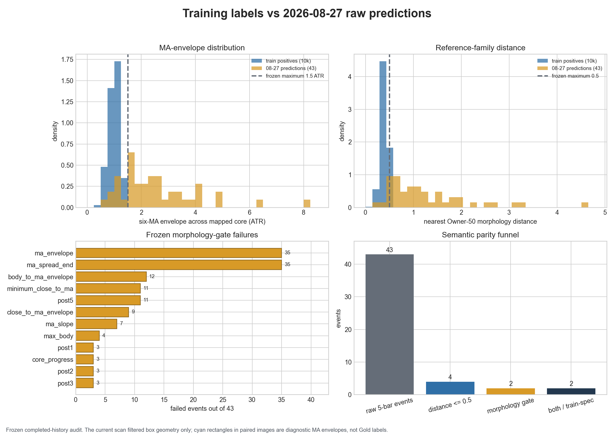
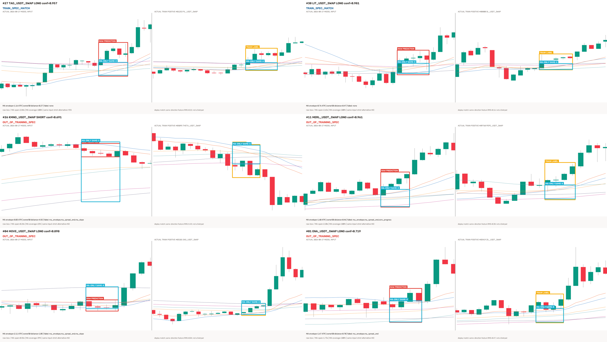

# 15m Owner-YOLO 检测框与实际训练图语义对照（2026-08-28）

## 技术摘要

Owner 的判断是对的：**2026-08-27 的 43 个原始检测框中，只有 2 个保持了训练正例的完整语义，
其余 41 个不符合训练正例标准。** 合格的是 **#27 TAO LONG** 与 **#30 LIT LONG**。

这不是单纯的“框左右偏了几根 K”。对 41 个失败事件，在同一张模型实际输入里穷举所有允许的
4/5 根核心、4/5/6 根确认组合，**0 个事件存在另一个符合训练标准的核心**。也就是说，主要问题是
整张输入属于训练分布外形态，而不是把现有框平移一下就能修好。

根因有两层：

1. 训练标签本身并不是“只框六条均线最密集带”。生成器在 4–5 根核心内同时包住**完整 K 线影线
   和六条均线**，再加 4% 垂直留白。10,000 个正例全部使用这个定义；其中 9,578 张（95.78%）
   的 K 线跨度大于均线跨度。因此模型实际学到的是“核心 K 线 + 均线”的联合框，不是纯均线框。
2. 最近五日扫描只检查预测框横向是否能映射成 4–5 根核心、后面是否有 4–6 根确认 K；它**没有
   在推理结果上重跑训练检索时的 14 项形态门和 Owner-50 距离门**。结构上合法的框因此被当作
   信号保留下来，即使均线已经明显散开、行情已经走了一段。

本轮只读取已经冻结的 2026-08-23..27 快照和 08-27 的 43 个既有预测，未联网、未重新推理、
未调阈值、未改框、未改标签、未训练，也未触碰 ACTIVE/frozen、forward、部署或订单状态。

## 最关键的对照图



图中蓝色是 10,000 张实际训练正例，黄色是 43 个当天预测框映射出的核心：

- 训练正例六均线包络上限是 1.5 ATR，中位数 1.009；当天预测中位数是 2.354，35/43 超限。
- 训练正例到 Owner-50 参考族的距离上限是 0.5，中位数 0.396；当天预测中位数是 1.036，
  只有 4/43 通过距离门。
- 只有 2/43 同时通过完整形态门和距离门。
- 35/43 同时在最主要的 `ma_envelope` 或 `ma_spread_end` 密集度约束上失败。



每一组左侧是 08-27 当时模型真正看到的 1280×742 输入，右侧是从 10,000 张实际训练正例中按
同方向、14 项形态特征最近而选出的真实训练图。颜色含义：

- 红框：模型原始预测框，未经移动或重画；
- 橙框：该训练图真正使用的 YOLO 标签；
- 青框：相同横向核心上的纯六均线包络，仅作诊断，不是 Gold，也没有拿去训练。

完整 43 张逐图高清对照入口：
[08-27 预测框 vs 模型实际训练图画廊](../../experiments/active/exp-15m-ma-launch-owner-yolo-20260827-training-parity-audit-v1/results/comparison_gallery.html)。

## 结果表

| 项目 | 实际训练正例 | 08-27 原始预测 | 解释 |
|---|---:|---:|---|
| 样本数 | 10,000 | 43 | 训练全集正例 vs 昨日冻结事件 |
| 完整训练标准通过 | 10,000 / 10,000 | 2 / 43 | #27、#30 通过 |
| 六均线包络中位数 | 1.009 ATR | 2.354 ATR | 预测核心的均线明显更散 |
| 六均线包络最大值 | 1.500 ATR | 8.029 ATR | 训练门上限被大量突破 |
| Owner-50 距离中位数 | 0.396 | 1.036 | 预测形态远离训练参考族 |
| Owner-50 距离最大值 | 0.495 | 4.552 | 训练门上限为 0.5 |
| 标签/预测框高度中位数 | 0.256 图高 | 0.368 图高 | 预测框高约 +43.5% |
| K 线跨度大于均线跨度 | 9,578 / 10,000 | 不适用 | 证明训练标签主要不是纯均线带 |
| 失败事件存在同图替代合格核心 | 不适用 | 0 / 41 | 不能靠统一左移/右移修复 |

预测框高度相对同核心纯均线带的中位比值为 1.696 倍；预测框对均线带的覆盖率中位数虽然是
100%，但均值只有 73.3%，最低为 0。这说明部分框不仅偏高或偏大，甚至没有稳定覆盖它声称要检测的
均线带。

## 为什么静态验证分数高，实际仍会出现这些框

训练和静态验证来自同一套自动生成器，标签语义、窗口分布和采样方式高度一致，所以 mAP 可以很好。
但最近五日使用的是“收盘后涨跌幅 Top20”极端波动币种，天然集中在已经完成大幅运动的路径上。
同生成器验证集的高 mAP 只能说明模型能复现该生成器的框，不能证明它在这个分布外扫描面仍保持
“均线密集启动”的业务语义。

更直接的执行缺口是：推理管道只做了横向框几何过滤，没有把训练数据检索时用过的完整语义约束
带到结果验收层。于是高置信度并不等于训练形态合格。例如 #11 的置信度为 0.961、参考距离也通过，
但均线包络、末端均线间距和核心进度仍失败；#26 的六均线包络达到 8.03 ATR，与训练上限 1.5 ATR
相差五倍以上。

## 训练标签语义核对

实际训练标签由 `core_box()` 生成：横向覆盖 4–5 根核心 K，纵向取该范围内 `high/low` 与六条均线
的联合最小/最大值，再增加 4% 垂直留白。10,000/10,000 manifest 行都声明
`contains_core_wicks_and_six_mas=true`。

因此，若目标是“均线最密集的几根 K 所在的窄均线带”，当前标签定义与目标并不完全一致。
这不意味着要把 10,000 张重新交给 Owner 人工审核；可以按冻结的自动规则生成新的纯均线弱标签，
但必须诚实标为自动 weak labels，不能冒充逐样本 Gold。

## 43 个事件逐项结果

`MA ATR` 是框对应核心内六均线包络宽度；`距离` 是到 Owner-50 参考族的冻结距离，训练上限为 0.5。

| # | 币种 | 方向 | 置信度 | MA ATR | 距离 | 失败门 | 结论 |
|---:|---|---|---:|---:|---:|---|---|
| 01 | ENA_USDT_SWAP | LONG | 0.719 | 1.67 | 0.70 | ma_envelope,ma_spread_end | 不符合训练标准 |
| 02 | ENA_USDT_SWAP | LONG | 0.829 | 2.49 | 0.99 | ma_envelope,ma_spread_end,minimum_close_to_ma,body_to_ma_envelope | 不符合训练标准 |
| 03 | ENA_USDT_SWAP | LONG | 0.959 | 1.87 | 0.53 | ma_envelope,ma_spread_end | 不符合训练标准 |
| 04 | MOVE_USDT_SWAP | LONG | 0.898 | 2.11 | 1.05 | ma_envelope,ma_spread_end,ma_slope | 不符合训练标准 |
| 05 | MOVE_USDT_SWAP | LONG | 0.970 | 1.56 | 0.57 | ma_envelope,ma_spread_end,minimum_close_to_ma,body_to_ma_envelope | 不符合训练标准 |
| 06 | MOVE_USDT_SWAP | LONG | 0.775 | 4.93 | 2.59 | ma_envelope,ma_spread_end | 不符合训练标准 |
| 07 | HUMA_USDT_SWAP | LONG | 0.915 | 4.09 | 1.82 | ma_envelope,ma_spread_end | 不符合训练标准 |
| 08 | HUMA_USDT_SWAP | SHORT | 0.324 | 4.82 | 3.14 | ma_envelope,ma_spread_end,ma_slope,close_to_ma_envelope,body_to_ma_envelope | 不符合训练标准 |
| 09 | HUMA_USDT_SWAP | LONG | 0.980 | 3.31 | 1.44 | ma_envelope,ma_spread_end | 不符合训练标准 |
| 10 | MERL_USDT_SWAP | LONG | 0.845 | 1.08 | 0.66 | post1,post5 | 不符合训练标准 |
| 11 | MERL_USDT_SWAP | LONG | 0.961 | 1.60 | 0.46 | ma_envelope,ma_spread_end,core_progress | 不符合训练标准 |
| 12 | MERL_USDT_SWAP | LONG | 0.870 | 2.38 | 0.99 | ma_envelope,ma_spread_end,core_progress,close_to_ma_envelope,body_to_ma_envelope | 不符合训练标准 |
| 13 | MUBARAK_USDT_SWAP | LONG | 0.970 | 1.51 | 0.56 | ma_envelope,ma_spread_end,body_to_ma_envelope | 不符合训练标准 |
| 14 | CHIP_USDT_SWAP | LONG | 0.684 | 3.83 | 1.86 | ma_envelope,ma_spread_end,max_body,minimum_close_to_ma | 不符合训练标准 |
| 15 | EDEN_USDT_SWAP | LONG | 0.637 | 2.55 | 1.28 | ma_envelope,ma_spread_end,post5 | 不符合训练标准 |
| 16 | EDEN_USDT_SWAP | LONG | 0.964 | 2.75 | 1.16 | ma_envelope,ma_spread_end | 不符合训练标准 |
| 17 | TRUMP_USDT_SWAP | LONG | 0.895 | 0.89 | 0.68 | ma_slope | 不符合训练标准 |
| 18 | TRUMP_USDT_SWAP | LONG | 0.919 | 2.36 | 1.04 | ma_envelope,ma_spread_end | 不符合训练标准 |
| 19 | TRUMP_USDT_SWAP | LONG | 0.804 | 2.58 | 1.25 | ma_envelope,ma_spread_end,minimum_close_to_ma,close_to_ma_envelope,body_to_ma_envelope | 不符合训练标准 |
| 20 | TRUMP_USDT_SWAP | LONG | 0.555 | 4.10 | 1.93 | ma_envelope,ma_spread_end | 不符合训练标准 |
| 21 | JUP_USDT_SWAP | LONG | 0.442 | 1.31 | 0.85 | post5,ma_slope | 不符合训练标准 |
| 22 | JUP_USDT_SWAP | LONG | 0.813 | 0.53 | 0.74 | ma_slope | 不符合训练标准 |
| 23 | JUP_USDT_SWAP | SHORT | 0.574 | 1.98 | 2.22 | ma_envelope,ma_spread_end,post5,ma_slope,minimum_close_to_ma,close_to_ma_envelope,body_to_ma_envelope | 不符合训练标准 |
| 24 | JUP_USDT_SWAP | LONG | 0.871 | 2.11 | 0.71 | ma_envelope,ma_spread_end,post5 | 不符合训练标准 |
| 25 | KMNO_USDT_SWAP | LONG | 0.728 | 6.30 | 3.30 | ma_envelope,ma_spread_end | 不符合训练标准 |
| 26 | KMNO_USDT_SWAP | SHORT | 0.691 | 8.03 | 4.55 | ma_envelope,ma_spread_end,ma_slope | 不符合训练标准 |
| 27 | TAO_USDT_SWAP | LONG | 0.957 | 1.16 | 0.27 | — | **符合训练标准** |
| 28 | TAO_USDT_SWAP | LONG | 0.308 | 1.52 | 0.75 | ma_envelope,ma_spread_end,max_body,core_progress,post5,minimum_close_to_ma,close_to_ma_envelope,body_to_ma_envelope | 不符合训练标准 |
| 29 | TAO_USDT_SWAP | LONG | 0.872 | 2.95 | 1.55 | ma_envelope,ma_spread_end,minimum_close_to_ma,close_to_ma_envelope,body_to_ma_envelope | 不符合训练标准 |
| 30 | LIT_USDT_SWAP | LONG | 0.981 | 0.76 | 0.47 | — | **符合训练标准** |
| 31 | LIT_USDT_SWAP | LONG | 0.492 | 2.13 | 1.14 | ma_envelope,ma_spread_end,post1,post2,post3,post5,minimum_close_to_ma,close_to_ma_envelope,body_to_ma_envelope | 不符合训练标准 |
| 32 | LIT_USDT_SWAP | LONG | 0.945 | 1.65 | 0.66 | ma_envelope,ma_spread_end | 不符合训练标准 |
| 33 | APR_USDT_SWAP | LONG | 0.849 | 1.65 | 0.55 | ma_envelope,ma_spread_end | 不符合训练标准 |
| 34 | APR_USDT_SWAP | LONG | 0.970 | 1.04 | 2.76 | post1,post2,post3,post5 | 不符合训练标准 |
| 35 | APR_USDT_SWAP | SHORT | 0.868 | 1.18 | 0.40 | post2,post3 | 不符合训练标准 |
| 36 | UNI_USDT_SWAP | LONG | 0.740 | 2.55 | 0.97 | ma_envelope,ma_spread_end | 不符合训练标准 |
| 37 | SOL_USDT_SWAP | LONG | 0.701 | 4.15 | 2.02 | ma_envelope,ma_spread_end | 不符合训练标准 |
| 38 | BICO_USDT_SWAP | LONG | 0.784 | 3.02 | 1.21 | ma_envelope,ma_spread_end,max_body | 不符合训练标准 |
| 39 | BICO_USDT_SWAP | LONG | 0.656 | 3.35 | 1.59 | ma_envelope,ma_spread_end,post5,minimum_close_to_ma,close_to_ma_envelope,body_to_ma_envelope | 不符合训练标准 |
| 40 | ICX_USDT_SWAP | SHORT | 0.968 | 2.35 | 0.95 | ma_envelope,ma_spread_end | 不符合训练标准 |
| 41 | CAP_USDT_SWAP | SHORT | 0.807 | 1.96 | 0.67 | ma_envelope,ma_spread_end,post5 | 不符合训练标准 |
| 42 | BSB_USDT_SWAP | LONG | 0.783 | 3.22 | 1.51 | ma_envelope,ma_spread_end,minimum_close_to_ma | 不符合训练标准 |
| 43 | BSB_USDT_SWAP | LONG | 0.289 | 3.51 | 1.71 | ma_envelope,ma_spread_end,max_body,post5,minimum_close_to_ma,close_to_ma_envelope,body_to_ma_envelope | 不符合训练标准 |

## 数据、口径与方法

### 冻结输入

- 实际训练正例：10,000 行 accepted manifest；
- 实际训练数据集：10,000 正例 + 30,000 负例 manifest；
- 实际权重 SHA：`58888f996f7da46d4321316964085e90855d00e4c0a14e18c98b303c6e43c182`；
- 当天事件：08-27 冻结的 43 个原始 YOLO 四维框；
- 行情：既有本地冻结快照，未联网补数据；
- 数据时间：本轮比较面属于 2026-08-23..27 holdout，此次是同配置经 Owner 授权的第 4 次读取。

### 计算步骤

1. 对 10,000 个训练正例重新计算原检索器使用的 14 项形态特征，确认 10,000/10,000 仍同时
   通过冻结形态门和距离上限 0.5。
2. 将 43 个原始预测框的横坐标按原扫描逻辑映射回整数 K 线核心；不移动、不改宽度。
3. 对每个核心复算同一组 14 项形态特征和 Owner-50 距离。
4. 对每个失败事件，在同一模型输入中穷举全部 4/5 根核心 × 4/5/6 根确认组合，判断是否只是
   定位错误。
5. 用同一渲染器逐像素重渲染 43/43 当前模型输入；为逐图展示选出的 29 个不重复训练正例也全部
   逐像素重渲染并核对 SHA。
6. 渲染 43 张 2560×946 并排 PNG；独立 verifier 检查 43 个唯一 SHA、尺寸、画廊链接、CSV 与
   receipt 哈希。

### 零假设对照

这是标签/预测语义审计，不存在交易收益、AUC、top-decile 净收益、胜率或匹配随机入场的适用场景，
因此不编造这些指标。等价零假设是：若当前预测保持训练生成器语义，则映射核心应像 10,000 个训练
正例一样通过冻结形态门与距离门。对照结果为训练 10,000/10,000，通过；当前预测 2/43，通过。

## 风险与诚实声明

- 这是同一检测配置第 **4 次**经 Owner 明确授权读取 2026-08-23..27 holdout。结果只用于解释
  已经看到的失败，不得再在这五天上调阈值、选择框规则或改标签后声称未见验收。
- 每张右侧训练图是真实训练正例，但只是同方向 14 项特征最近的展示配对，**不是该预测事件的
  Owner Gold 答案**。
- 青框是算法计算的六均线包络，不是 Owner 标注，也没有写回数据集。
- 训练正例本身是 completed-history 弱标签，检索使用核心后 +1/+2/+3/+5；它不等同于 tip 实盘 Gold。
- 本轮没有改现有权重、标签、阈值、ACTIVE/frozen 或任何生产状态；两个模型资格标志仍为 false。

## 建议的下一步

1. **当前检测结果不能再被称为可靠的“均线密集框”。** 在新鲜数据自动验证通过前继续保持
   `production_eligible=false`。
2. 按用户已经反复明确的“均线密集处、宁缺毋滥”口径，默认把目标固定为纯六均线密集核心；
   不再要求 Owner 逐张审核、打勾或改框。
3. 自动修复优先做两层：先在推理后自动重跑原 14 项形态门和 Owner-50 距离门；再由程序按统一
   规则生成纯均线弱标签与 QA。所有淘汰、补位和一致性检查都在程序内完成。
4. 增加冻结形态门属于新的单变量方案，只能在 pre-holdout 或新的新鲜 tip 数据上
   预注册验证；不能用本次已看过的 08-23..27 调门。
5. 若以后训练自动生成的新标签，报告必须继续写明它们是 weak labels；不需要把人工审核任务交给
   Owner，但也不能把自动一致性等同于人工 Gold。新验证完成前不 promote、不接入 forward/ACTIVE。

**本轮没有任何待 Owner 完成的人工审核表、逐图裁决或改框任务。** 43 张画廊只是把自动审计证据
完整展示出来，Owner 看或不看都不影响本轮“2 个保留、41 个淘汰”的自动结论。

## 复现命令

```bash
cd /Users/zhangzc/fable-trading

PYTHONPATH=. .venv/bin/python \
  scripts/audit_15m_ma_launch_owner_yolo_prediction_vs_training.py

.venv/bin/python \
  scripts/verify_15m_ma_launch_owner_yolo_prediction_vs_training.py

PYTHONPATH=. .venv/bin/python -m pytest \
  tests/test_15m_ma_launch_owner_yolo_prediction_vs_training.py -q

.venv/bin/python scripts/md_to_html.py \
  analysis/p1_15m_ma_launch_owner_yolo_prediction_training_parity_20260828.md \
  --out-dir analysis/html
```

审计脚本拒绝覆盖既有 results；从零复现时应先在新的实验目录运行或由 Owner 明确授权移走旧产物，
不能直接删除当前证据。
