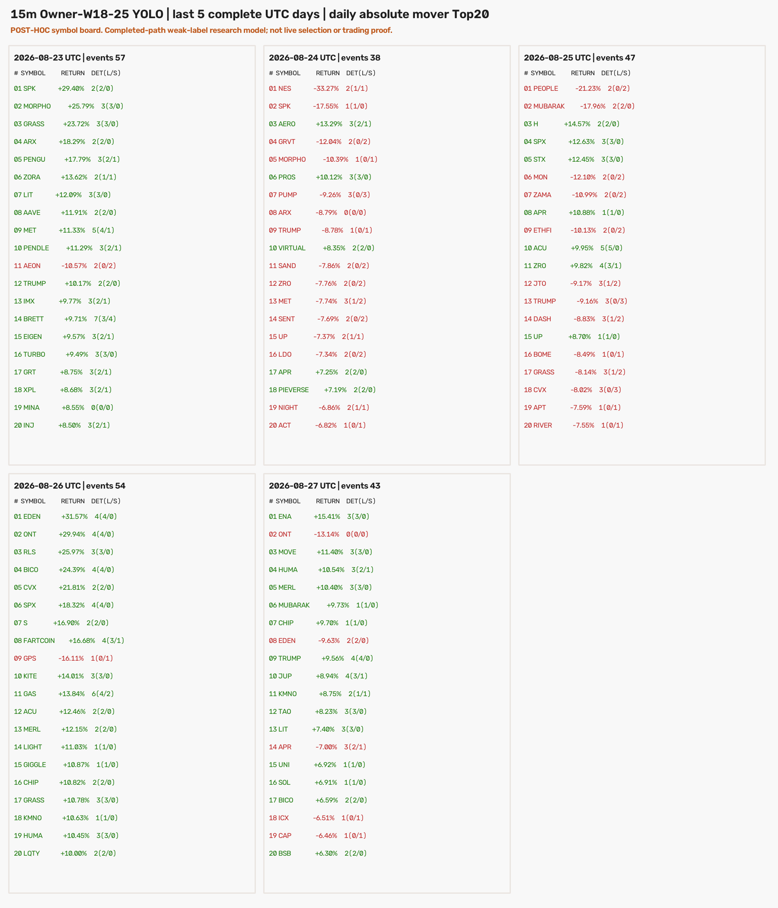
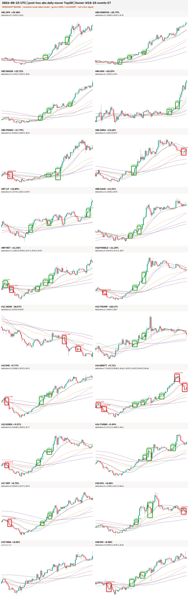
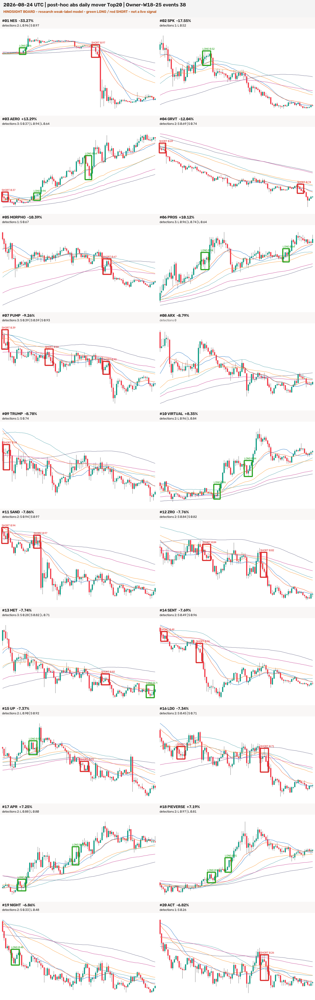
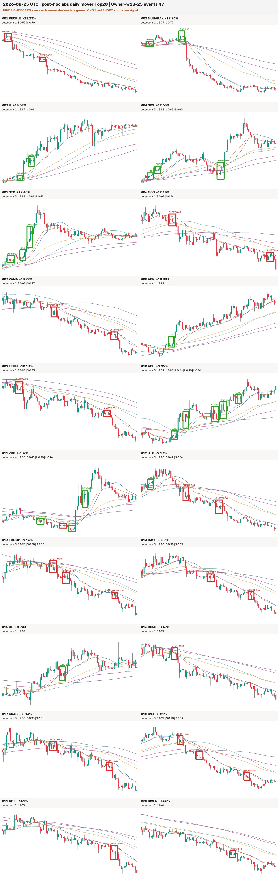
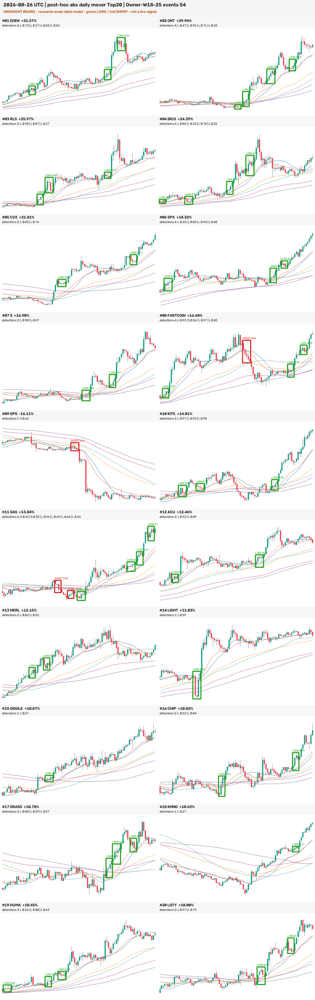
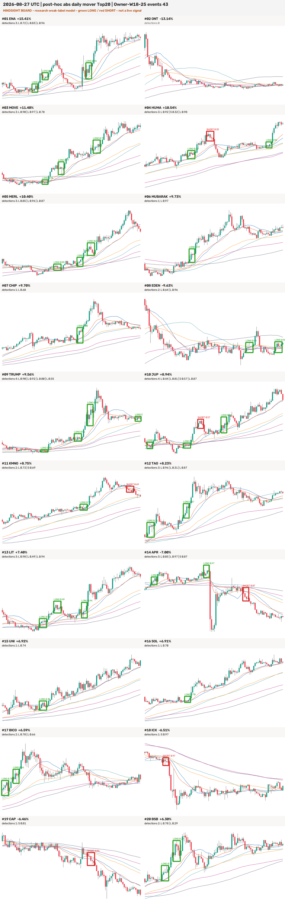

# 新 Owner YOLO：最近五个完整 UTC 日 Top20 扫描报告

## 结论先行

- 已按预注册范围扫描 **2026-08-23 至 2026-08-27** 五个完整 UTC 日；当前未收盘的
  08-28 没有混入。每天在当前仍 live 的 OKX `instCategory=1` 加密 USDT 永续中，取已确认
  当日 `|close / open - 1|` Top20，因此这是**收盘后才知道的事后榜单**。
- 五天共 **100 个币种日、75 个唯一币**。新训练的 10,000 正例 + 30,000 负例 Owner YOLO
  扫描 81,600 个因果小窗，得到 5,632 个原始框；结构过滤后 4,528 个，按同币 5 根 K 去重后
  保留 **239 个事件：LONG 168、SHORT 71**。
- 模型在这批高波动完成路径上明显偏积极：**97/100 个币种日有框**，平均 2.39 个/币种日；
  BRETT 最多 7 个，GAS 6 个。这个结果不能解释成“更准”，反而说明当前阈值下选择性不足，
  与 Owner 之前提出的“一张图框太多”是同一风险。
- 对 08-23 至 08-25 完全相同的 60 个榜单身份，新模型从旧 t-3 模型的 **96 个事件升到
  142 个（+47.9%）**；有框币种日从 48/60 升到 58/60，中位置信度从 0.317 升到 0.821。
  新权重及其训练几何是一个整体，不能把增加归因于某个单独变量。
- 239 个事件里 204 个（85.4%）和币种当日最终方向一致。固定 LONG/SHORT 数量后随机打乱类别，
  期望一致率为 59.4%，单侧超几何 `p=4.49e-22`；但一个事后读取收盘正负号的规则天然是
  100%，所以这个数字只说明模型在已走完的大行情中识别趋势，不是提前预测胜率。
- RTX 3060 正式作业正常退出，运行 24.7 分钟；所有 CSV/PNG 远端与本机 SHA 一致。独立 verifier
  已检查榜单、K 线连续性、框几何、5-bar 去重和安全开关；全项目回归为 **1728 passed、
  4 skipped**。没有训练、调阈值、改 ACTIVE/frozen、promote、部署、forward 或下单。



## 冻结扫描合同

| 项目 | 冻结值 |
|---|---|
| 权重 | Owner 10k 正 + 30k 负、YOLO11s、`imgsz=960` |
| `best.pt` SHA-256 | `58888f996f7da46d4321316964085e90855d00e4c0a14e18c98b303c6e43c182` |
| 类别 | `dense_long` / `dense_short` |
| 推理窗 | W18–25；来自该权重训练 manifest 的真实支持集 |
| 映射核心 | 4–5 根 K |
| 核心后确认 | 4–6 根 K |
| 阈值 / NMS | `confidence=0.25` / `IoU=0.7` |
| 事件去重 | 同币核心末端不足 5 根只保留高置信度框 |
| 推理未来可见量 | 每个小窗右端以后 0 根；但检测成立时已看过核心后 4–6 根确认 K |

图中的绿框是 LONG、红框是 SHORT，矩形只显示映射回原 K 线的 4–5 根核心。模型真正完成判断的
时间是完整 W18–25 小窗右端，也就是核心后 4–6 根；框的左端、右端都不能倒填成实时信号时间。

## 分日结果与原图

| UTC 日 | 榜单上涨/下跌 | Top20 最低绝对涨跌幅 | 事件 | LONG / SHORT | 有框币种日 | 与最终日方向一致 |
|---|---:|---:|---:|---:|---:|---:|
| 2026-08-23 | 19 / 1 | 8.50% | 57 | 42 / 15 | 19 / 20 | 44 / 57（77.2%） |
| 2026-08-24 | 5 / 15 | 6.82% | 38 | 16 / 22 | 19 / 20 | 32 / 38（84.2%） |
| 2026-08-25 | 7 / 13 | 7.55% | 47 | 23 / 24 | 20 / 20 | 41 / 47（87.2%） |
| 2026-08-26 | 19 / 1 | 10.00% | 54 | 50 / 4 | 20 / 20 | 51 / 54（94.4%） |
| 2026-08-27 | 15 / 5 | 6.30% | 43 | 37 / 6 | 19 / 20 | 36 / 43（83.7%） |
| **合计** | **65 / 35** | — | **239** | **168 / 71** | **97 / 100** | **204 / 239（85.4%）** |

### 2026-08-23：57 个事件



这天 BRETT 出现 7 个框、MET 5 个；MINA 是唯一无框币种。19 个上涨币中仍混有 15 个 SHORT
事件，主要来自上涨前的局部下跌或上涨后的回落，说明一张图多阶段重复触发的问题很明显。

### 2026-08-24：38 个事件



榜单以 15 个下跌币为主，SHORT 22、LONG 16；ARX 是唯一无框币种。PUMP 有 3 个 SHORT，
PROS 有 3 个 LONG，类别总体跟随已完成的日内趋势。

### 2026-08-25：47 个事件



20 个币全部有框。ACU 5 个、ZRO 4 个；PEOPLE、MON、ZAMA、ETHFI、TRUMP 等下跌路径主要出
SHORT，但 MUBARAK 的最终日跌幅为 -17.96%，仍在早期横盘/上冲段出了两个 LONG。

### 2026-08-26：54 个事件



这是最强的上涨日，19/20 个币上涨，模型给出 50 LONG / 4 SHORT。GAS 一张图内触发 6 次；
EDEN、ONT、BICO、SPX、FARTCOIN 各 4 次，是“完成趋势中重复报相似启动段”的代表。

### 2026-08-27：43 个事件



ONT 是唯一无框币种。TRUMP 和 JUP 各 4 个，ENA、MOVE、HUMA、MERL、TAO、LIT、APR 各 3 个。
EDEN 当日最终下跌，但两个框都是局部反弹 LONG，再次说明事件方向不能直接替代整日方向标签。

## 选择性与旧模型同板对照

08-23 至 08-25 的榜单身份、顺序和日涨跌幅与旧报告逐行一致，因此可做纯描述性同板对照：

| 同一 60 个币种日 | 旧 t-3 模型 | 新 Owner 10k+30k 模型 | 变化 |
|---|---:|---:|---:|
| 事件 | 96 | 142 | +46（+47.9%） |
| LONG / SHORT | 72 / 24 | 81 / 61 | SHORT 明显增加 |
| 有框币种日 | 48 / 60 | 58 / 60 | +10 |
| 平均置信度 | 0.327 | 0.745 | +0.418 |
| 中位置信度 | 0.317 | 0.821 | +0.504 |

这不是“新模型优于旧模型”的验收：训练集、权重、窗口支持、核心和确认几何都随模型合同变化，
而且 60 个币是用已知当日大波动挑出的。它能证明的只有：在完全相同的完成行情图上，新模型更
容易、更高置信度地报框。结合 97/100 的覆盖率，当前最值得警惕的是**高波动池上的过度触发**。

事件数分布如下：3 个币种日无框，19 个有 1 个，33 个有 2 个，33 个有 3 个，8 个有 4 个，
2 个有 5 个，GAS 有 6 个，BRETT 有 7 个。5-bar 去重已经从 4,528 个结构合格框删掉 4,289 个，
仍留下 239 个；所以“框多”不是简单的相邻滑窗重复未去重，而是日内相隔至少 5 根 K 的多次触发。

## 数据、推理与几何统计

| 项目 | 结果 |
|---|---:|
| ticker / instrument metadata 原始行 | 453 / 454 |
| live `instCategory=1` 加密 USDT swaps | 274 |
| 榜单 | 5 × 20 = 100 币种日 |
| 唯一币种 | 75 |
| 本地 15m 快照 | 75 文件、50,850 根 |
| 榜单日连续性 | 100/100 精确 96 根、0 gap |
| 扫描小窗 | 81,600 |
| 有预测框的小窗 | 4,976 |
| 原始框 / 结构合格框 | 5,632 / 4,528 |
| 5-bar 去重移除 / 保留 | 4,289 / 239 |
| RTX 3060 推理与渲染 | 1,483.395 秒（24.7 分钟） |

保留事件的置信度均值 0.739、中位数 0.810、四分位数 0.594 / 0.810 / 0.922，范围
0.253–0.989。几何全部落在训练支持内：核心 4 / 5 根分别 128 / 111 个；确认 4 / 5 / 6 根分别
142 / 62 / 35 个；W18–25 分别贡献 39 / 81 / 13 / 13 / 14 / 40 / 24 / 15 个。

## 验收、零假设对照与适用边界

这是视觉检测探针，不是交易收益实验，所以 val AUC、top-decile 毛/净收益、胜率、0.2% 成本、
TP/SL 和同币×同时间块×同波动桶的匹配随机入场均不适用；本轮没有定义入场与出场，强行计算会
伪造经济含义。等价的非方向性验收和零假设对照如下：

| 验收 / 对照 | 结果 |
|---|---|
| 五个 Top20 身份、顺序、收益 | 100/100 通过 |
| 快照 SHA、OHLC 不变量、15m 连续性 | 75/75；100/100；通过 |
| 训练 manifest → 推理几何 | W18–25、核心 4–5、确认 4–6，全部通过 |
| 信号索引、核心高度、确认长度、窗口长度 | 239/239 通过 |
| 同币事件间隔 | 全部 ≥5 根 |
| PNG 解码、尺寸、SHA | 6/6 通过 |
| 远端与本机 artifact SHA | 9/9 一致 |
| 随机置换类别零假设 | 期望方向一致 59.4%，实际 85.4%，`p=4.49e-22` |
| 事后最终方向上界对照 | 读取收盘正负号可得 100%；因此 85.4% 不是交易胜率 |
| 相同三日旧模型对照 | 新模型事件 +47.9%，只证明更积极，不证明更准 |
| 独立 QA | 通过；`qa_receipt.json` SHA `fa9579a4fba0309e84989c348d425087a6423363c43bd6fe373c02c3b32ffb1f` |
| 全项目测试 | 1728 passed、4 skipped |

五张日图均已目视打开：面板完整、红绿框没有系统性整图偏移，Windows 生成 PNG 也没有颜色通道
异常。但机器几何通过只证明“框和模型输出一致”，不证明每个框都符合 Owner 心中的严格均线密集
语义；大量多框和完成趋势后段触发正是需要保留的负面结果。

## Holdout 使用记录

五天都晚于项目 holdout 起点 2026-05-04。Owner 明确要求“跑一下最近 5 天的数据”，本配置因此
记录为第 **1 次**有界 holdout 消费：精确范围只含 2026-08-23..27，不含 08-28 部分日。

- 市场数据只正式抓取一次并锁成 75 份快照；没有在结果出来后换榜单、阈值、窗口或去重参数。
- Mac MPS 曾用同一冻结配置处理前 5/100 个币种日，因预计过慢而中止；没有写出 scan receipt、
  CSV 或 PNG，也没有据此改参数。随后只把同一 hash-bound 快照搬到 3060 完成。
- 3060 的第一个启动器在模型推理前因缺 pandas 失败，同时发现临时 provenance 字符串并非仓库解析
  SHA；临时日志已删除，框、CSV、PNG 均为 0。正式运行绑定提交
  `8051b7af43ed98a405394987f13eb466ca9a59bf`，exit=0。
- 这五天已经被本配置看过，后续不能在同五天上调阈值、改去重再声称是未见 holdout 验收。

## 风险与诚实声明

1. **榜单是事后的。** 每天 Top20 只有收盘后才知道，不能证明模型能提前选到这些币。
2. **检测不是 tip。** 每个事件需要核心后 4–6 根确认 K；图中框的位置早于实际可知时间。
3. **选择性明显不足。** 97% 币种日有框、平均 2.39 个，且同板比旧模型多 47.9%；这对实盘告警
   会形成信号泛滥，不能靠高置信度掩盖。
4. **模型是 completed-history weak labels。** 10,000 个正例不是 10,000 个逐样本 Owner Gold；
   高静态 val 与本轮趋势一致率都可能来自已走完的斜率、均线展开或位置线索。
5. **当前 live universe 有幸存偏差。** 已下架资产不在历史榜单中。
6. **没有经济结论。** 本轮未定义持仓、障碍、成本或匹配随机对照，239 个框不等于 239 笔可交易信号。
7. **未动生产。** `training_eligible=false / production_eligible=false`；ACTIVE/frozen、tip-smoke、
   forward、部署、仓位和订单状态均未改变。

## 完整复现命令

```bash
cd /Users/zhangzc/fable-trading
git branch --show-current

# 在仓库内新建独立复现目录，避免覆盖正式 holdout 回执
OWNER5_REPRO_DIR=$(mktemp -d "$PWD/analysis/output/owner5_repro.XXXXXX")

# 网络读取：固定预注册五日，当前 partial day 仍排除
PYTHONPATH=. .venv/bin/python scripts/scan_15m_ma_launch_owner_yolo_recent5d.py \
  --fetch \
  --out "$OWNER5_REPRO_DIR/output" \
  --results "$OWNER5_REPRO_DIR/results" \
  --workers 8

# 冻结权重与几何；本机可用 mps，正式结果使用下方 3060 命令
PYTHONPATH=. .venv/bin/python scripts/scan_15m_ma_launch_owner_yolo_recent5d.py \
  --scan \
  --out "$OWNER5_REPRO_DIR/output" \
  --results "$OWNER5_REPRO_DIR/results" \
  --device mps \
  --batch-size 16

# 对独立复现目录验收；正式结果的默认命令见下一行
PYTHONPATH=. .venv/bin/python scripts/verify_15m_ma_launch_owner_yolo_recent5d.py \
  --out "$OWNER5_REPRO_DIR/output" \
  --results "$OWNER5_REPRO_DIR/results" \
  --output "$OWNER5_REPRO_DIR/qa_receipt.json"
PYTHONPATH=. .venv/bin/python scripts/verify_15m_ma_launch_owner_yolo_recent5d.py

PYTHONPATH=. .venv/bin/python -m pytest -q tests
python3 scripts/md_to_html.py \
  analysis/p1_15m_ma_launch_owner_yolo_recent5d_20260828.md \
  --out-dir analysis/html
```

正式 3060 hash-bound runner 的实际 PowerShell 命令是：

```powershell
$env:PYTHONPATH = "."
& "C:/fable/.venv/Scripts/python.exe" `
  scripts/run_15m_ma_launch_owner_yolo_recent5d_remote.py `
  --source-commit 8051b7af43ed98a405394987f13eb466ca9a59bf `
  --device 0 `
  --batch-size 64
```

## 产物身份

| 产物 | SHA-256 |
|---|---|
| preregistration | `3b0dd8e1a84f08be96f3a8f8cea146b23ced3787817baeb5e7b9546bcf80e8aa` |
| fetch receipt | `497bfb8bfa050ecda11bbc65061608d5cc807a0583ef99ae9c3e5b3e2d53ab75` |
| scan receipt | `ebf13e69494b51ecd126c1385b28e262de555fe40738dd2afdb7ff88956d9cc4` |
| remote execution receipt | `2a45b3421f1067e46760528da1c39df7916a4e7d92954afb0c07c3623185b2fb` |
| QA receipt | `fa9579a4fba0309e84989c348d425087a6423363c43bd6fe373c02c3b32ffb1f` |
| overview PNG | `f790a68ac22acae17a2c493bd1b62c5636bd0288e142bcae44683cd80061d12a` |
| 08-23 PNG | `1ba011f47dea542344e9f14ab71db5361eb4d3faa1842775e8a18f69ec30d51f` |
| 08-24 PNG | `9b7a1edc05d96100149547a8e358f31e6af615c4e16c542b0b14d7da05e1ba3c` |
| 08-25 PNG | `3105b7ddcbdede51b3ff74c7912119cb5ac53944cc745295e01922bc010a4144` |
| 08-26 PNG | `53bcc186604f781895de7a6333e3ba2d25347bfd1105bf90109c00eb4677f93c` |
| 08-27 PNG | `832a3583c7f11ca7cfca6c8f9ab860af810221ff3949898a5667f4fafa3faa7d` |

- 预注册：`experiments/active/exp-15m-ma-launch-owner-yolo-recent5d-v1/preregistration.json`
- 回执与 6 张 PNG：`experiments/active/exp-15m-ma-launch-owner-yolo-recent5d-v1/results/`
- disposable CSV / K 线快照：`analysis/output/ma_launch_owner_yolo_recent5d_v1/`
- canonical Markdown：`analysis/p1_15m_ma_launch_owner_yolo_recent5d_20260828.md`
- Owner HTML：`analysis/html/p1_15m_ma_launch_owner_yolo_recent5d_20260828.html`

下一步不应该直接在这五天上把阈值调高到“看起来刚好”。如果要解决框多，应另开 pre-holdout 或
新鲜 tip Gold 选择性实验，先冻结“每币每天允许的事件预算 / 事件聚类规则 / Owner 逐框语义门”，
再到未看数据上评估；是否授权新的 holdout 或 tip 前向范围，需要 Owner 另行决定。
