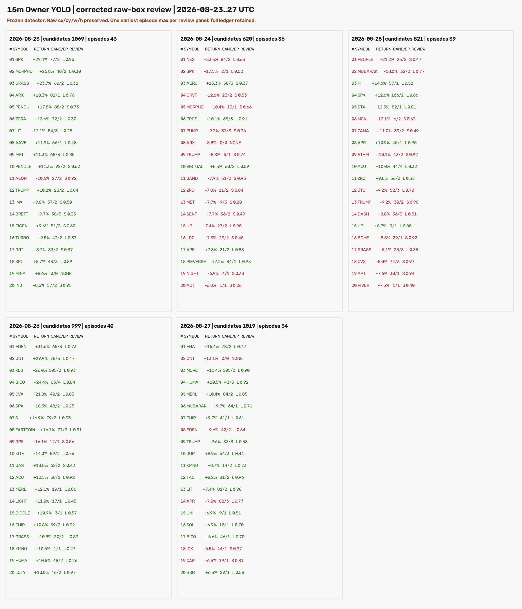
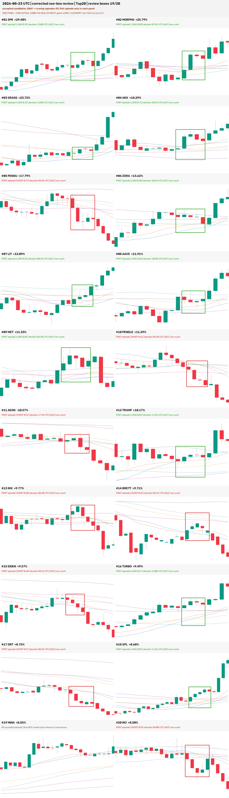
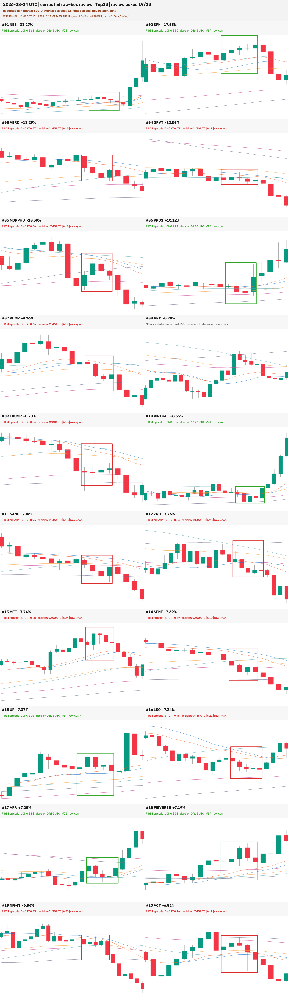
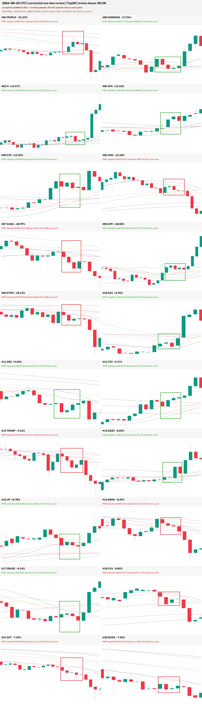
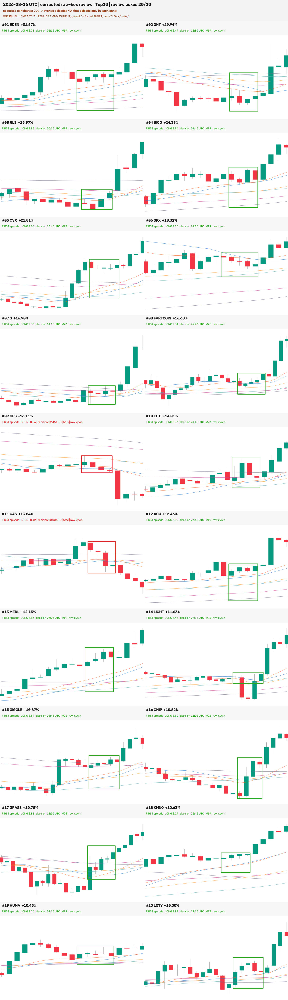
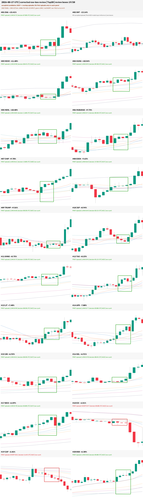

# 最近五日 Top20：原始 YOLO 框与单 Episode 复核修正版

## 结论先行

- 已把上一版五日图的两个展示错误修正：**不再把同一币日的多个滑窗命中全部叠在一张图上**，也
  **不再丢掉模型预测的 `cy/h` 后用 K 线 high/low 重造框**。
- 修正版仍使用完全相同的权重、`confidence=0.25`、`NMS IoU=0.7`、W18–25、核心 4–5 根、
  确认 4–6 根。原扫描的 **239/239 个 5-bar 去重事件身份完全一致**，最大置信度差
  `1.11e-16`；因此本轮改变的是证据记录、episode 聚合和复核图，不是模型结果。
- 4,528 个结构合格候选按同币日重叠决策区间聚成 **192 个连续 episode**。每天每币只展示最早
  episode 的代表框，最终 100 张复核图为 **97 张各 1 个框、3 张 0 个框**，最大框数为 1。
- 每个面板就是实际送入模型的 **1280×742、W18–25** 输入；红/绿矩形直接使用模型原始
  `cx/cy/w/h`。离线验收对 100 张输入重新渲染、对 100 张 overlay 重新画框，均为
  **100/100 逐像素一致**。
- 这次修复证明了上一版“框多”和“框与训练图不一样”至少有一部分来自展示层，但也如实暴露：
  模型在这 100 个事后高波动币种日中仍有 **97/100 检出**，选择性依然过强。单框展示不是模型
  变准，也不能作为生产或交易验收。
- RTX 3060 作业正常退出，用时 25.7 分钟；全仓测试 **1733 passed、4 skipped**。没有训练、
  调阈值、改权重、promote、部署、forward 写入或下单。



## 上一版为什么会出现多个框和框位不一致

| 环节 | 上一版 | 修正版 |
|---|---|---|
| 推理输入 | 1280×742 的 W18–25 小窗 | 不变 |
| 原始预测 | YOLO `cx/cy/w/h` | 不变 |
| 落盘字段 | 只保留横向中心/宽度，未保留预测 `cy/h` | 四维坐标、输入尺寸、窗口根数、输入像素 SHA 全保留 |
| 纵向画框 | 用核心 K 的 high/low 重新构造 | 直接投影原始预测 `cy/h` |
| 一张日图内容 | 96 根 K 压到同一画布，叠加当日所有去重事件 | 每个面板只用一个真实模型输入，最多一个原始框 |
| 重复命中处理 | 同币相隔 5 根即可成为新事件 | 另外按重叠决策区间聚成 episode；复核只取最早 episode |

上一版图中的矩形因此不是严格意义上的模型原始框：横向来自预测，纵向却来自语义核心；多张不同
窗口的预测又被画到一张 96 根 K 日图上。它能够描述“这个币日有过哪些触发”，却不能回答“模型
当时看到了什么、原框到底画在哪里”。修正版把这两种用途分开：候选和全部 episode 留在 CSV，
owner 复核图只显示真实输入与一个原框。

## 修正版五日原图

图中绿色为 `dense_long`、红色为 `dense_short`。无框面板保持真正的 0 框，不补造矩形。

### 2026-08-23：1,069 候选、43 episode、19/20 有框



### 2026-08-24：620 候选、36 episode、19/20 有框



### 2026-08-25：821 候选、39 episode、20/20 有框



### 2026-08-26：999 候选、40 episode、20/20 有框



### 2026-08-27：1,019 候选、34 episode、19/20 有框



## 数据统计与分日结果

| UTC 日 | 结构合格候选 | 重叠 episode | 复核有框 | LONG / SHORT | 无框币 |
|---|---:|---:|---:|---:|---|
| 2026-08-23 | 1,069 | 43 | 19/20 | 11 / 8 | MINA |
| 2026-08-24 | 620 | 36 | 19/20 | 7 / 12 | ARX |
| 2026-08-25 | 821 | 39 | 20/20 | 11 / 9 | — |
| 2026-08-26 | 999 | 40 | 20/20 | 18 / 2 | — |
| 2026-08-27 | 1,019 | 34 | 19/20 | 17 / 2 | ONT |
| **合计** | **4,528** | **192** | **97/100** | **64 / 33** | **3** |

完整推理账本没有被“单框展示”删掉：81,600 个窗口、5,632 个原始框、4,528 个结构合格候选、
239 个旧口径 5-bar 去重事件和 192 个 episode 分别留存在独立 CSV。复核选择规则固定为
`earliest_episode_per_symbol_day`，置信度仅用于同一最早完成时刻的并列决胜，不用最高置信度偷偷
挑更靠后的完成行情。

97 个实际预测框的归一化宽度中位数为 0.209（5%–95%：0.184–0.257），高度中位数为 0.376
（5%–95%：0.180–0.521）。高度看起来比旧图更高不是新一轮“统一扩大”，而是此前被丢弃的模型
原始 `cy/h`；本轮不对它做二次美化或语义重框。

## 验收与零假设对照

这是推理证据和展示 parity 修复，不定义入场、出场或收益，所以 val AUC、置换收益检验、
top-decile 毛/净收益、胜率、0.2% 成本以及同币×同时间块×同波动桶随机入场均不适用；强行报告
会制造不存在的经济含义。对应的严格反事实/零假设对照是：如果本轮实际改变了模型、阈值、过滤
或输入，冻结 v1 的事件身份与置信度就不应完全复现。

| 验收 / 对照 | 结果 |
|---|---:|
| 冻结权重 SHA | `58888f996f7da46d4321316964085e90855d00e4c0a14e18c98b303c6e43c182` |
| v1 事件身份不变量 | 239/239 完全一致 |
| 最大置信度绝对差 | `1.11e-16` |
| 真实模型输入重新渲染 | 100/100 逐像素一致 |
| 原始框 overlay 独立重画 | 100/100 逐像素一致 |
| 每面板框数 | 97×1 + 3×0；最大 1 |
| 四维预测字段完整性 | 4,528/4,528 均有合法 `cx/cy/w/h` |
| ZIP 内容 | 100 原输入 + 100 原框 overlay + manifest |
| PNG 解码、尺寸与 SHA | 总览 + 5 日图，6/6 通过 |
| 网络读取 | 扫描 0；复用第一次消费时冻结的 75 份快照 |
| 全项目测试 | 1733 passed、4 skipped |

这组对照拒绝“修复靠换模型或调参数造成”的解释；它只证明证据链和展示正确，不证明模型语义
正确。逐样本是否符合 owner 的严格均线密集定义，仍需要独立的 Gold 语义验收，不能由像素 parity
替代。

## Holdout 使用记录

日期 2026-08-23..27 晚于 holdout 起点 2026-05-04。Owner 在看过上一版后明确要求“那你重新弄”，
本轮在预注册中记录为**该配置第 2 次有界 holdout 消费**。范围、权重、阈值、窗口和结构过滤在
重跑前冻结；只修复四维框留存、episode 聚合和复核 surface。没有读取 08-28 部分日，也没有新增
网络抓取。

这五天已经被同一配置第二次查看，禁止再用它们调置信度、NMS、episode 规则或挑框策略后声称是
未见验证。若要改善 97/100 的过度检出，必须在 pre-holdout 或新的前向数据上预注册一个单变量
选择性实验。

## 风险与诚实声明

1. **修的是图，不是模型。** 239 个旧事件完全不变；单图一个框只是复核 surface 的聚合规则。
2. **模型仍过度触发。** 97/100 个事后高波动币种日有框，不能被“图看起来清爽”掩盖。
3. **Top20 是收盘后榜单。** 当前涨跌幅榜单不能作为可提前获得的选币规则，存在完成路径和幸存偏差。
4. **不是 tip 信号。** 判断仍使用核心后 4–6 根确认 K；完整检测窗右端才是实际可知时刻。
5. **原框不等于 Gold 框。** 原始 `cx/cy/w/h` 只是模型预测事实；框得宽、窄或语义不准时应判定
   模型问题，不能在展示层手动改到“看起来对”。
6. **未动生产。** `training_eligible=false / production_eligible=false`；ACTIVE/frozen、tip-smoke、
   forward、部署、仓位和订单均未改变。

## 完整复现命令

```bash
cd /Users/zhangzc/fable-trading
git branch --show-current

# 先只验证冻结合同、75 份已有快照及全部输入哈希；不推理、不写产物
PYTHONPATH=. .venv/bin/python \
  scripts/scan_15m_ma_launch_owner_yolo_recent5d_rawbox.py \
  --validate-only --device 0 --batch-size 64 \
  --source-commit b98ab3850467e67277f6a8dc5b045be95bb52c4f

# 正式重跑；本次在 RTX 3060 上使用相同命令
PYTHONPATH=. .venv/bin/python \
  scripts/scan_15m_ma_launch_owner_yolo_recent5d_rawbox.py \
  --device 0 --batch-size 64 \
  --source-commit b98ab3850467e67277f6a8dc5b045be95bb52c4f

# 本机独立离线复核：重新渲染 100 输入、重新画 100 overlay、重聚 192 episode
PYTHONPATH=. .venv/bin/python \
  scripts/verify_15m_ma_launch_owner_yolo_recent5d_rawbox.py

PYTHONPATH=. .venv/bin/python -m pytest -q tests
python3 scripts/md_to_html.py \
  analysis/p1_15m_ma_launch_owner_yolo_recent5d_rawbox_repair_20260828.md \
  --out-dir analysis/html
```

## 产物身份

| 产物 | SHA-256 |
|---|---|
| preregistration | `c05c1fb2b33228694c5398091dfc989831fe18dbd398b66b8636c96bc70418a2` |
| scan receipt | `c63b339e443a2ea687c9a65bee3d88e3e666d1475611e2cc3598cd20cc4646a7` |
| QA receipt | `4c6736b4835df776c5b3fa3f0399779762b205a7806d52ba45390750f0cde0b2` |
| overview PNG | `bbb6032875c5381fd1cf9cfd040a36067958ee169d87cd938e06ceda581a42df` |
| 08-23 PNG | `bba9fb868802dbb4327fef4049340bb4105c2ac44921d74124367a4b02e10da4` |
| 08-24 PNG | `4758e37f909e6767424fb4e09cb00432100c6a52a438618024bff6d49a4af275` |
| 08-25 PNG | `223821e7e38f6598e8c6be8116cf84cbcbcd723b209bcac1a1e395032d88dcc6` |
| 08-26 PNG | `67da21bac2c2a1ba880ddae720be30228e8ed9b2842c7d24ab0efdec954bf09a` |
| 08-27 PNG | `43fe8efdbb049f0105992dbed284cc439e6df6b7936fb9c56dea88c7b6aeaedb` |
| 100 输入 + 100 overlay ZIP | `8d1597188d1e9ee7fac1acf7aad2e6dc04b137bbf28a63e2476f399c18d379bc` |

- 预注册：`experiments/active/exp-15m-ma-launch-owner-yolo-recent5d-rawbox-v2/preregistration.json`
- 回执、总览、五张日图与 ZIP：`experiments/active/exp-15m-ma-launch-owner-yolo-recent5d-rawbox-v2/results/`
- 全量候选、episode、复核 manifest 和逐张 PNG：`analysis/output/ma_launch_owner_yolo_recent5d_rawbox_v2/`
- Owner HTML：`analysis/html/p1_15m_ma_launch_owner_yolo_recent5d_rawbox_repair_20260828.html`

下一步若要降低检出数量，不能继续在这五天上“调到看起来正好”。应先冻结允许的 episode 预算和
语义 Gold 规则，再在新的未见前向范围验证；是否开启该实验需要 owner 另行决定。
