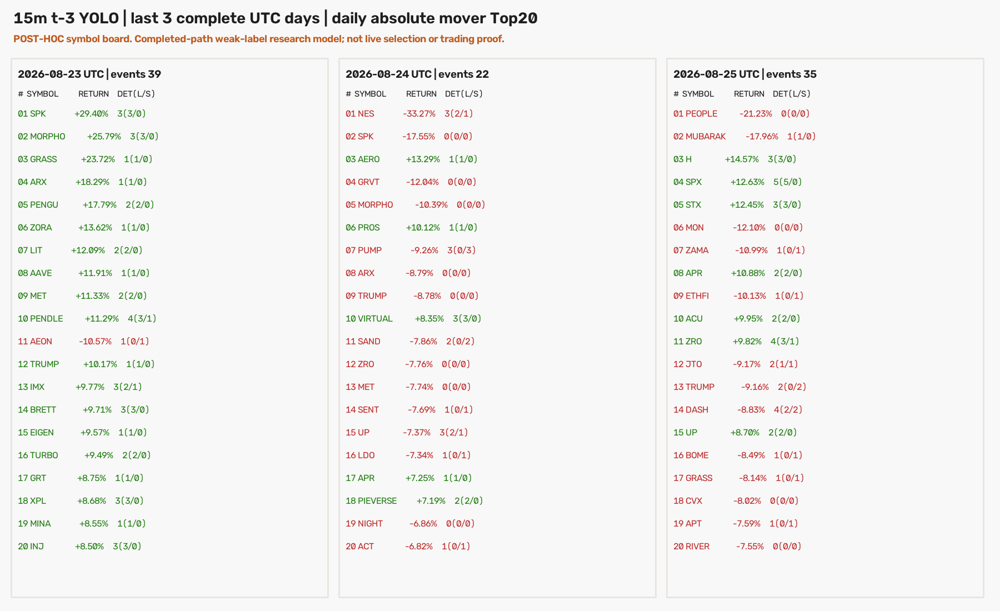
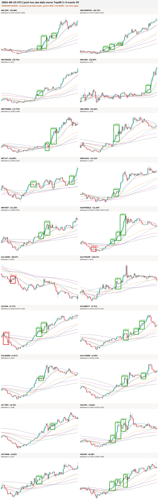
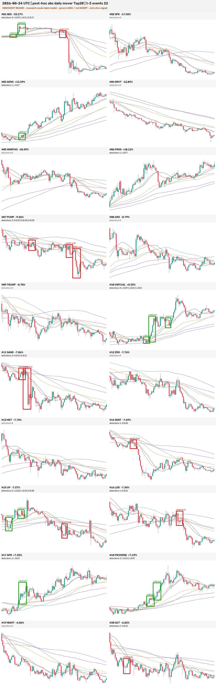
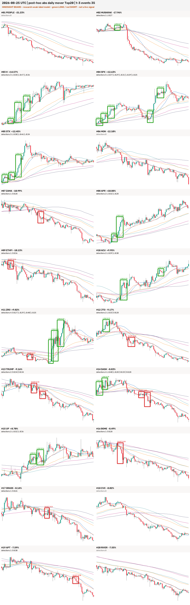

# 最近三天每日绝对涨跌幅 Top20：15m t-3 模型扫描报告

## 结论先行

- 已按 **UTC 完整日**扫描 2026-08-23、08-24、08-25；08-26 尚未收盘，因此没有混入。
  “涨跌幅 Top20”在本报告中定义为当日 `|close / open - 1|` 最大的 20 个 OKX 加密
  USDT 永续，所以上涨币和下跌币在同一张榜里。
- 三天共 **60 个币种日**、50 个唯一币；每个币种日都有精确 96 根连续 15m K 线。冻结的
  t-3 弱标签 YOLO 共扫描 18,180 个 W14/W18/W22 小窗，得到 500 个原始框，结构过滤后
  495 个，按同币 5 根 K 线去重后是 **96 个事件：LONG 72、SHORT 24**。
- 分日结果是：08-23 **39** 个（36 LONG / 3 SHORT），08-24 **22** 个（12 / 10），
  08-25 **35** 个（24 / 11）；48/60 个币种日有框，12/60 没有框。
- 96 个框中 **85 个（88.5%）与当日最终涨跌方向相同**：上涨日 64 LONG / 3 SHORT，
  下跌日 8 LONG / 21 SHORT。这个现象说明模型在高波动完成路径里主要识别顺势启动段；由于
  榜单本身用当天收盘后才知道的涨跌幅筛选，它**不是提前选币能力、不是回测收益，也不是可交易
  胜率**。
- 置信度整体不高：均值 0.327、中位数 0.317、最大 0.469，阈值固定 0.25。没有看到结果后
  改阈值、改窗口或重跑挑最好参数。
- 四张 PNG、60 个榜单身份、50 份 K 线快照、96 个框的核心/确认坐标及所有 SHA 已由独立
  verifier 通过。没有训练、没有改 ACTIVE/frozen、没有 promote、部署、forward 或下单。



## 图例与扫描口径

- 绿色框：`dense_long`；红色框：`dense_short`。
- 每个小图是该币完整 UTC 日的 96 根 15m K 线，叠加 SMA/EMA 20、60、120 六条均线。
- 推理窗固定为 W14 / W18 / W22，`confidence=0.25`，`NMS IoU=0.7`。
- 图上矩形只画映射回 K 线的核心：允许 4–7 根；完整检测窗还包含核心之后 3–5 根确认 K 线。
  因此这是**完成确认后的形态检测**，框的左端或核心末端都不能冒充实时信号时间。
- 同币同日核心末端相距不足 5 根时只保留高置信度事件；最后一根核心允许使用日后最多 5 根
  确认 K 线，但核心末端必须仍落在所属榜单日内。

## 2026-08-23：39 个事件



| # | 币种 | 日涨跌幅 | LONG | SHORT |
|---:|---|---:|---:|---:|
| 1 | SPK | +29.40% | 3 | 0 |
| 2 | MORPHO | +25.79% | 3 | 0 |
| 3 | GRASS | +23.72% | 1 | 0 |
| 4 | ARX | +18.29% | 1 | 0 |
| 5 | PENGU | +17.79% | 2 | 0 |
| 6 | ZORA | +13.62% | 1 | 0 |
| 7 | LIT | +12.09% | 2 | 0 |
| 8 | AAVE | +11.91% | 1 | 0 |
| 9 | MET | +11.33% | 2 | 0 |
| 10 | PENDLE | +11.29% | 3 | 1 |
| 11 | AEON | -10.57% | 0 | 1 |
| 12 | TRUMP | +10.17% | 1 | 0 |
| 13 | IMX | +9.77% | 2 | 1 |
| 14 | BRETT | +9.71% | 3 | 0 |
| 15 | EIGEN | +9.57% | 1 | 0 |
| 16 | TURBO | +9.49% | 2 | 0 |
| 17 | GRT | +8.75% | 1 | 0 |
| 18 | XPL | +8.68% | 3 | 0 |
| 19 | MINA | +8.55% | 1 | 0 |
| 20 | INJ | +8.50% | 3 | 0 |

这天榜单明显偏上涨，20 个币里 19 个上涨、1 个下跌；模型也几乎全部出 LONG。AEON 的
SHORT 落在持续下跌段，PENDLE 和 IMX 先出现局部 SHORT、后出现 LONG，说明模型不是简单给
每个币整日只分一个方向，但完成日方向仍是主导因素。

## 2026-08-24：22 个事件



| # | 币种 | 日涨跌幅 | LONG | SHORT |
|---:|---|---:|---:|---:|
| 1 | NES | -33.27% | 2 | 1 |
| 2 | SPK | -17.55% | 0 | 0 |
| 3 | AERO | +13.29% | 1 | 0 |
| 4 | GRVT | -12.04% | 0 | 0 |
| 5 | MORPHO | -10.39% | 0 | 0 |
| 6 | PROS | +10.12% | 1 | 0 |
| 7 | PUMP | -9.26% | 0 | 3 |
| 8 | ARX | -8.79% | 0 | 0 |
| 9 | TRUMP | -8.78% | 0 | 0 |
| 10 | VIRTUAL | +8.35% | 3 | 0 |
| 11 | SAND | -7.86% | 0 | 2 |
| 12 | ZRO | -7.76% | 0 | 0 |
| 13 | MET | -7.74% | 0 | 0 |
| 14 | SENT | -7.69% | 0 | 1 |
| 15 | UP | -7.37% | 2 | 1 |
| 16 | LDO | -7.34% | 0 | 1 |
| 17 | APR | +7.25% | 1 | 0 |
| 18 | PIEVERSE | +7.19% | 2 | 0 |
| 19 | NIGHT | -6.86% | 0 | 0 |
| 20 | ACT | -6.82% | 0 | 1 |

这天 15 个下跌、5 个上涨，是三天里检出最少的一天。PUMP、SAND、SENT、LDO、ACT 的
SHORT 框都落在明显的下跌启动或续跌段；VIRTUAL、APR、PIEVERSE 的 LONG 框落在上涨段。
NES 先有两次局部 LONG，随后出现 SHORT 并进入大跌，属于完整路径中多阶段的例子。

## 2026-08-25：35 个事件



| # | 币种 | 日涨跌幅 | LONG | SHORT |
|---:|---|---:|---:|---:|
| 1 | PEOPLE | -21.23% | 0 | 0 |
| 2 | MUBARAK | -17.96% | 1 | 0 |
| 3 | H | +14.57% | 3 | 0 |
| 4 | SPX | +12.63% | 5 | 0 |
| 5 | STX | +12.45% | 3 | 0 |
| 6 | MON | -12.10% | 0 | 0 |
| 7 | ZAMA | -10.99% | 0 | 1 |
| 8 | APR | +10.88% | 2 | 0 |
| 9 | ETHFI | -10.13% | 0 | 1 |
| 10 | ACU | +9.95% | 2 | 0 |
| 11 | ZRO | +9.82% | 3 | 1 |
| 12 | JTO | -9.17% | 1 | 1 |
| 13 | TRUMP | -9.16% | 0 | 2 |
| 14 | DASH | -8.83% | 2 | 2 |
| 15 | UP | +8.70% | 2 | 0 |
| 16 | BOME | -8.49% | 0 | 1 |
| 17 | GRASS | -8.14% | 0 | 1 |
| 18 | CVX | -8.02% | 0 | 0 |
| 19 | APT | -7.59% | 0 | 1 |
| 20 | RIVER | -7.55% | 0 | 0 |

SPX 是单个币检出最多的例子，共 5 个 LONG；H、STX、APR、ACU、UP 的框也集中在日内上涨段。
ZAMA、ETHFI、TRUMP、BOME、GRASS、APT 的 SHORT 与下跌段一致。MUBARAK 在当日最终下跌
17.96% 的情况下出过一个早期 LONG，DASH 同时有 2 LONG / 2 SHORT，说明局部形态与全日方向
并不总是一致。

## 数据与模型扫描统计

| 项目 | 结果 |
|---|---:|
| 当前 ticker / instrument metadata 原始行 | 453 / 454 |
| 过滤后 live `instCategory=1` 加密 USDT swaps | 274 |
| 每日榜单 | 3 × 20 = 60 币种日 |
| 唯一币种 | 50 |
| 本地 15m 快照 | 50 文件、24,250 根 |
| 榜单日连续性 | 60/60 精确 96 根、0 gap |
| 扫描小窗 | 18,180 |
| 有预测框的小窗 | 472 |
| 原始框 / 结构合格框 | 500 / 495 |
| 5-bar 去重移除 / 保留 | 399 / 96 |
| 有事件的币种日 | 48/60 |
| 推理耗时 | 756.463 秒（12.6 分钟，Mac MPS） |

事件几何没有超出训练合同：核心长度 5 / 6 / 7 根分别为 7 / 52 / 37 个，本次没有最终保留的
4 根框；确认 3 / 4 / 5 根分别为 24 / 42 / 30 个；贡献窗口 W14 / W18 / W22 分别为
22 / 37 / 37 个。置信度四分位数为 0.283 / 0.317 / 0.370。

| 当日最终方向 | LONG | SHORT | 合计 |
|---|---:|---:|---:|
| 上涨币种日里的事件 | 64 | 3 | 67 |
| 下跌币种日里的事件 | 8 | 21 | 29 |
| 合计 | **72** | **24** | **96** |

这里的 88.5% “方向一致率”只描述框和已知整日方向的关系。一个直接读取当日最终正负号的事后
规则会天然达到 100%，因此该数字不能作为模型胜率或基线优势；它反而提醒我们，这批图适合检查
模型能否在大波动完成路径中找出相似片段，不适合估计提前交易价值。

## v1 失败闭环与 v2 修正

第一版预注册后读取了相同三天，但静态币名排除表把 OKX 新增的 14 个 `instCategory=3`
股权/Pre-IPO 风格合约混入 Top20（包括 ASTS、MRNA、SMCI、UNITREE、ZHIPU 等）。流程在模型
推理前 fail closed：窗口 0、预测 0、图片 0，没有悄悄删掉坏币继续使用已污染榜单。

| 配置 | 候选 universe | 非加密合约 | 模型推理 | 结论 |
|---|---:|---:|---:|---|
| v1 静态币名过滤 | 380 | Top20 中 14 个 | 0 | rejected / 推理前失败 |
| v2 交易所元数据 `state=live && instCategory=1` | 274 | 0 | 18,180 窗 | 本报告正式结果 |

这次修正只改变**资产分类过滤**，没有改模型权重、阈值、窗口、框几何或去重标准。相关通用经验已
记录在 `docs/learnings/okx-instcategory-must-filter-crypto-swap-universe.md`。

## 验收与零假设对照

这是视觉检测探针，不是方向收益实验，所以 val AUC、置换检验 p、top-decile 毛/净收益、胜率、
单特征收益基线和匹配随机入场收益均不适用；本报告不把检出数或方向一致率换名成收益证据。
同等严格的非方向性零假设/对照是：交易所类别必须在排行前锁定；所有 60 个币种日必须有完整
96 根 K；框必须反映冻结的 4–7 核心与 3–5 确认；任一资产、时间、哈希、坐标或安全开关漂移都
fail closed。结果如下：

| 验收项 | 结果 |
|---|---:|
| Top20 身份与绝对涨跌幅排序 | 3/3 榜单通过 |
| 快照 SHA / 15m 连续性 / OHLC 不变量 | 50/50；60/60；通过 |
| 权重 SHA | `8b2e393ffa887b8284a5580f68df290963fccc08fb94cdc4e0fec0c2b1e40e10` |
| 信号 CSV / scan stats SHA | 通过 |
| 核心、确认、窗口索引与时间映射 | 96/96 通过 |
| 同币事件最小间隔 | 全部 ≥5 根 |
| 四张 PNG 解码 / 尺寸 / SHA | 4/4 通过 |
| 60 个面板目视坐标检查 | 通过；未见框位整体偏移 |
| 本实验专项测试 | 11 passed |
| 独立 QA 回执 | SHA `352ea61624cb3260983f43e3fe7dffb395edf7cb40bccae0bcd143c9ccd6dbee` |

## Holdout 使用记录

这些日期均晚于项目 holdout 起点 2026-05-04。Owner 的本轮指令明确要求跑最近三天，因此只对
这个精确范围执行。必须如实记录：

1. `exp-15m-ma-launch-t3-daily-movers3d-v1`：该配置第 **1** 次、也是唯一一次读取；因资产分类
   污染在推理前失败。
2. `exp-15m-ma-launch-t3-daily-movers3d-v2`：修正后的独立配置第 **1** 次、也是唯一一次读取；
   产生本报告结果。

所以本任务实际发生两次有界 holdout 数据读取，但正式 v2 配置没有反复看结果调参。它不是项目的
最终 holdout 验收，也没有给模型新增 production 资格。

## 风险与诚实声明

1. **榜单有事后信息。** 当天 Top20 只有日线收盘后才知道，不能拿这 60 个样本回头声称模型会在
   当时提前选中它们。若要做实时榜单，排名窗口必须在交易日之前闭合。
2. **权重是弱标签完成态模型。** 它由 10,000 个机器候选训练，不是逐样本 Owner Gold；可能学习
   已完成的涨跌方向、K 线斜率或均线展开，而不是早期可交易“密集启动”。
3. **检测时间晚于核心。** 模型需要核心后 3–5 根确认；图里只突出核心，真实可用时间应记为完整
   窗口右端，不能倒填到框左端或核心末端。
4. **当前存续 universe 有幸存偏差。** 排行使用 2026-08-26 查询时仍 live 的合约；已下架资产不会
   出现在历史榜单。三天很近，此风险有限但不为零。
5. **没有经济标签。** 本轮没有设置 TP/SL、成本、持有期、随机入场对照或收益标签；图看着像启动
   不能替代交易验证。
6. **未动生产。** `production_eligible=false`；未改 ACTIVE/frozen、tip-smoke、forward、部署、
   仓位或下单状态。

## 完整复现命令

```bash
cd /Users/zhangzc/fable-trading
git branch --show-current

# 网络读取：拒绝覆盖已有正式快照；复现时应改到新的空目录/结果目录
MOVERS_REPRO_ROOT=$(mktemp -d)
PYTHONPATH=. .venv/bin/python scripts/scan_15m_ma_launch_t3_daily_movers.py \
  --fetch \
  --out "$MOVERS_REPRO_ROOT/output" \
  --results "$MOVERS_REPRO_ROOT/results" \
  --workers 8

# 冻结 best.pt，在单个因果小窗内推理；不训练、不调阈值
PYTHONPATH=. .venv/bin/python scripts/scan_15m_ma_launch_t3_daily_movers.py \
  --scan \
  --out "$MOVERS_REPRO_ROOT/output" \
  --results "$MOVERS_REPRO_ROOT/results" \
  --device mps \
  --batch-size 16

# 正式产物的离线身份/几何/连续性验收
PYTHONPATH=. .venv/bin/python scripts/verify_15m_ma_launch_t3_daily_movers.py

# 专项与全项目回归
PYTHONPATH=. .venv/bin/pytest -q \
  tests/test_scan_15m_ma_launch_t3_daily_movers.py \
  tests/test_verify_15m_ma_launch_t3_daily_movers.py
PYTHONPATH=. .venv/bin/pytest -q tests

# Owner HTML
python3 scripts/md_to_html.py \
  analysis/p1_15m_ma_launch_t3_daily_movers3d_20260826.md \
  --out-dir analysis/html
```

## 产物身份

| 产物 | SHA-256 |
|---|---|
| v2 fetch receipt | `d84f1c898958d9e9b4ea217fd87bca7d7caf05adc85830647d53e93d143f7856` |
| v2 scan receipt | `e098246868e9e71bdd352235b625a69ad27b8c89945179f83a95d3a3720bc106` |
| v2 QA receipt | `352ea61624cb3260983f43e3fe7dffb395edf7cb40bccae0bcd143c9ccd6dbee` |
| overview PNG | `749b5213f8164e1f76583071e32a4e698e7a0d097fe6a0c756193e43a6495f96` |
| 08-23 PNG | `5fc4d71caed08479f888fc23e88cdec2c3befb2f37f68e36f2760c91174d22c9` |
| 08-24 PNG | `c8d3175c7a9f02bd4eaa11125ce9a9526c459fdaf176e0042ed8bdbf5c17646d` |
| 08-25 PNG | `484f5c05248eab82eb531c0dcb2ea5b139efba57f690630508f2d78b98a10d4c` |

- 预注册：`experiments/active/exp-15m-ma-launch-t3-daily-movers3d-v2/preregistration.json`
- 回执与 PNG：`experiments/active/exp-15m-ma-launch-t3-daily-movers3d-v2/results/`
- disposable CSV/K 线快照：`analysis/output/ma_launch_t3_daily_movers3d_v2/`
- canonical Markdown：`analysis/p1_15m_ma_launch_t3_daily_movers3d_20260826.md`
- Owner HTML：`analysis/html/p1_15m_ma_launch_t3_daily_movers3d_20260826.html`

下一步如果继续，最有信息量的不是在这三天上调阈值，而是冻结同一模型，改成“前一日 Top20 / 当日
盘前固定 universe”做真正因果的未来日扫描；是否再读 holdout 或把它当最终验收，需要 Owner 另行
明确授权。
