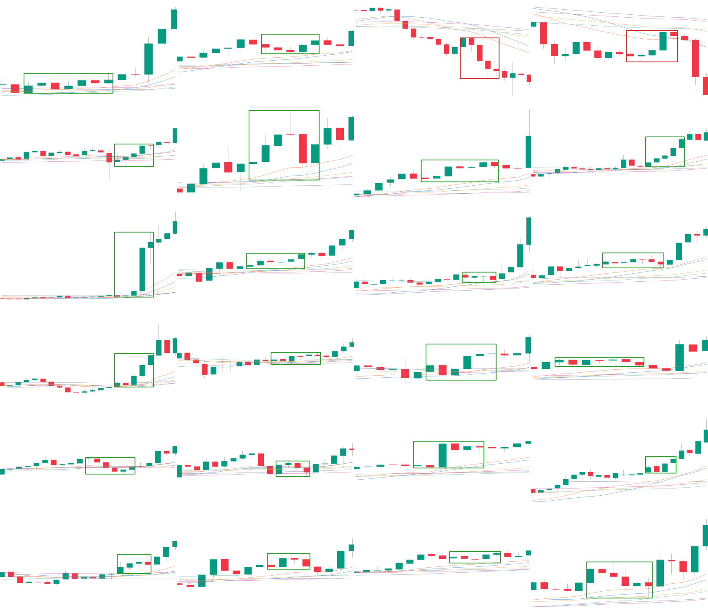
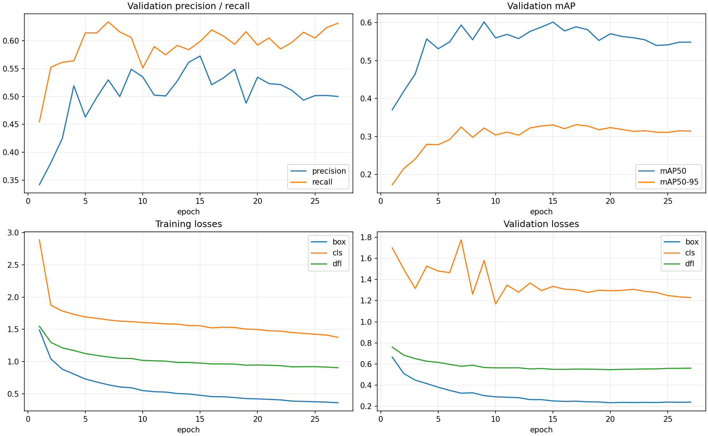
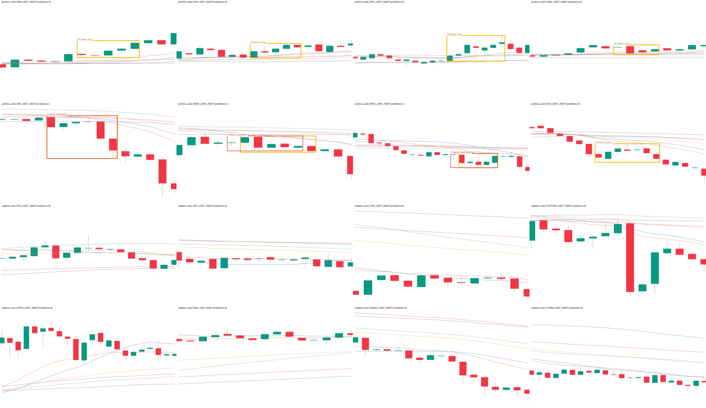

# 15m 六均线密集启动 t-3 弱标签数据集与 YOLO 训练报告

## 结论先行

- 已把首批 1,000 与新增 9,000 个 15m 完成态候选合并为 **10,000 个唯一事件**，LONG / SHORT
  各 5,000；形态门、排序、同币去重与多样性标准没有降低。
- 按 Owner 本轮明确授权，不再等待逐张人工审核，而是把机器检索结果按
  `owner_authorized_weak_labels_not_gold` 使用：每个候选的训练核心右端严格放在原选择 `t-3`，
  核心 4–7 根、输入 14–22 根、核心后确认 3–5 根。
- 时间切分和 150 根 purge 后，10,000 个候选中 **9,938 个**进入正例：train 8,468、val
  1,470，另有 62 个只保留为负例保护区。训练集按旧方法配了 easy 1× + hard 2×，验证集配
  easy 1×，最终是 **36,812 张图**、36,812 个标签文件、约 1.49 GiB。
- 框没有固定在一个位置：middle 6,348、right 3,590；中心比例标准差 0.08357，四位小数下
  有 62 个位置。输入窗、核心长度与确认根数均由稳定哈希分散，训练图像本身不画框或竖线。
- 3060 训练请求 40 轮，实际在第 27 轮触发 patience=10 早停；best 来自第 17 轮。回载
  `best.pt` 后终局 val 为 **P 0.534 / R 0.607 / mAP50 0.589 / mAP50-95 0.33189**；
  SHORT 的 mAP50-95 0.337，LONG 0.327。
- 本轮没有读取 holdout、没有改 ACTIVE/frozen、没有 promote、没有部署或改 forward/order
  状态。该模型是完成态弱标签研究模型，`production_eligible=false`。



## 从 10,000 个候选到 36,812 张训练图

| 项目 | train | val | 合计 |
|---|---:|---:|---:|
| LONG 弱正例 | 4,143 | 822 | 4,965 |
| SHORT 弱正例 | 4,325 | 648 | 4,973 |
| 弱正例 | 8,468 | 1,470 | 9,938 |
| easy no-launch 负例 | 8,468 | 1,470 | 9,938 |
| hard dense-rope no-launch 负例 | 16,936 | 0 | 16,936 |
| 总图数 | **33,872** | **2,940** | **36,812** |

候选联合池 LONG / SHORT 各 5,000 且身份重复为 0。时间依赖切分后有 62 个候选落在 purge
区；它们不生成正例，但仍和其余候选一起建立负例禁入区，不能为了凑 3:1 比例把它们附近取成
背景。实际正例锚点覆盖 `2022-01-05 17:30 UTC` 至 `2026-05-03 12:00 UTC`；最晚标签依赖
为 `2026-05-03 14:45 UTC`，仍早于 holdout 起点 `2026-05-04 00:00 UTC`。

数据身份：

| 产物 | SHA-256 / 数量 |
|---|---|
| dataset manifest | `dd55246938b03c4b2013d159cdfee94b4e9db56ecb298ad30145eb5d1bc2bc3a` / 36,812 行 |
| data.yaml | `aa7237ba9abae5381709272c2af172192956fa153680765d6e47a35663530594` |
| source audit | `d669a7d0fcdb0b42c4e987451366e526b543897fc9618e4c3b1962a768068601` / 228 文件 |
| 数据集大小 | 1,595,383,625 bytes |
| 物化 pre-holdout K 线 | 10,139,450 根 |
| 物化 holdout OHLCV | **0 根** |

## t-3、小检测窗、小信号框与位置分散

原机器检索的选择 bar 记为 `t`。本轮按 Owner 指令统一移动的是**核心右端**：

```text
core_end = t - 3
core_start = core_end - core_length + 1      # core_length = 4..7
input_end = core_end + confirmation_bars     # confirmation = 3..5
input_start = input_end - window_length + 1  # window_length = 14..22
```

所以渲染像素最晚只到 `t+2`，而完成态候选标签可以使用已冻结的 `t..t+11` 路径；未来路径只决定
标签归属，不进入训练图像。这个右端语义意味着它不是 tip 实盘检测器，未来如接研究扫描，输出时间
必须记为完整检测窗右端，不能冒充 `t-3` 当时已产生的信号。

| 几何审计 | 结果 |
|---|---:|
| 输入窗 | 14–22 根；每个长度 1,057–1,180 个正例 |
| 核心框 | 4–7 根；每种 2,387–2,561 个正例 |
| 核心后确认 | 3 / 4 / 5 根 = 3,322 / 3,334 / 3,282 |
| 位置桶 | middle 6,348（63.9%）/ right 3,590（36.1%） |
| 单一位置桶最大份额 | 63.88%，低于 70% 门 |
| 框中心比例 | min 0.3846 / median 0.6333 / max 0.7857 |
| 框中心比例标准差 | 0.08357，高于 0.07 门 |
| 四位小数唯一位置 | 62，高于 20 门 |
| YOLO 横向框宽 | 4–7 根；归一化 min 0.1727 / mean 0.3064 / max 0.5031 |

几何组合通过 `protocol + event_id` 的 SHA-256 稳定分配，不依赖 manifest 顺序，也不对图片做
随机抖动。小框只写入 YOLO `.txt`；PNG 是原始 K 线与六条均线，不把矩形或竖线烙进像素。

## 负样本逻辑

负例和正例使用同一渲染器、同一 14–22 根输入窗与 3–5 根确认分布。每个正例在同一数据源和
同一时间 split 内精确配一个 easy；train 再配两个 hard。这样检测窗长度或确认根数本身不能成为
正负 shortcut。

共同 `completed_no_launch` 条件以伪 `t` 开始的 12 根路径定义：

- 12 根后收盘相对伪 `t` 开盘的绝对位移不超过 1.5 ATR；
- 期间向上或向下最大有利位移均不超过 2 ATR；
- 未来只用于确认“没有完成启动”，训练像素仍最多到伪 `t+2`。

easy 从满足上述条件、但不属于 hard rope 的同源候选中确定性抽取。hard 还要求
SMA/EMA 20/60/120 六均线带宽不超过 1.243218%，用于教模型区分“均线很密”与“均线密集后
真正启动”。10,000 个候选全部建立 `core_start-12 .. t+2+12` 的同源保护区；36,812 个最终样本
中，负窗与候选保护区重叠 0，所有同源负窗彼此也零重叠。

| 配对零假设 | 正例 | easy 负例 | hard 负例 |
|---|---:|---:|---:|
| train 数量 | 8,468 | 8,468 | 16,936 |
| val 数量 | 1,470 | 1,470 | 0 |
| 同源 / 同 split | 基准 | 精确 1:1 | train 精确 2:1 |
| W14–22 分布 | 基准 | 每一档逐项相等 | train 每一档恰为 2× |
| 确认 3/4/5 分布 | 基准 | 每一档逐项相等 | train 每一档恰为 2× |

## 时间切分与无前视边界

切分不是随机的。全局 cutoff 为 `2026-03-01 00:00 UTC`，两侧各 purge 150 根 15m K 线，
即 37.5 小时。归属判断覆盖**完整输入和完整标签依赖**：正例直到 `t+11`，负例直到伪
`t+11`。审计结果：

| 边界 | 实际值 |
|---|---|
| train 最晚标签依赖 | `2026-02-27 09:30 UTC` |
| cutoff - purge | `2026-02-27 10:30 UTC` |
| cutoff + purge | `2026-03-02 13:30 UTC` |
| val 最早输入依赖 | `2026-03-02 13:45 UTC` |
| 任一样本触及 holdout | false |

独立 verifier 对 36,812 张图和 36,812 个标签逐文件重算 SHA，全部一致；确定性抽样解码 512
张均为 1280×742；Ultralytics 自己的 dataset parser 通过。3060 再次扫描得到 train
33,872、background 25,404、corrupt 0，val 2,940、background 1,470、corrupt 0，与本地
manifest 完全相符。

## 3060 训练配方与结果

| 项目 | 冻结值 |
|---|---|
| 主机 / GPU | `Administrator@192.168.1.5` / RTX 3060 12GB |
| 环境 | torch 2.8.0、torchvision 0.23.0、ultralytics 8.4.89、numpy 2.0.2 |
| 基础权重 | YOLO11s；SHA-256 `85a76fe86dd8afe384648546b56a7a78580c7cb7b404fc595f97969322d502d5` |
| 训练 | 40 epochs，patience 10，batch 8，imgsz 960 |
| 优化 | AdamW，lr0 1e-4，lrf 0.01，warmup 0.5 |
| 复现 | seed 0，deterministic true，rect true，cache false，workers 2 |
| 增强 | flip / HSV / mosaic / mixup / copy-paste / erasing 全关；translate 0.02、scale 0.1 |

`manifest.jsonl` 与专用 trainer 先按 SHA 上传到 `C:\fable`，远端解包后再次校验才启动。实际
训练命令、环境与 staging 哈希写入训练回执；没有调用旧的 ACTIVE/promote/deploy 路径。

### 静态验证指标

| 口径 | epoch / 类别 | Precision | Recall | mAP50 | mAP50-95 |
|---|---:|---:|---:|---:|---:|
| 第 1 轮 | 1 | 0.3421 | 0.4546 | 0.3704 | 0.1731 |
| results.csv 最佳行 | **17** | 0.5329 | 0.6087 | 0.5887 | 0.3312 |
| 回载 best.pt 终局验证 | overall | **0.5341** | **0.6073** | **0.5887** | **0.33189** |
| 回载 best.pt 终局验证 | dense_long（822） | 0.546 | 0.597 | 0.573 | 0.327 |
| 回载 best.pt 终局验证 | dense_short（648） | 0.522 | 0.617 | 0.605 | 0.337 |
| 早停当轮，不是交付权重 | 27 | 0.5001 | 0.6312 | 0.5484 | 0.3144 |

训练实际用时 5.001 小时。第 17 轮 CSV 行和终局验证有约 0.0007 的 mAP50-95 差异，是训练器
在早停后回载/strip `best.pt` 再跑一次完整 val 所得；交付指标采用后者，轮次定位采用前者，二者
没有混成同一个字段。



训练 box/cls/dfl loss 持续下降，但验证 mAP50-95 在第 15–17 轮附近进入平台并波动，27 轮时
没有恢复到 best，patience=10 因而按预注册正确停训。它没有表现出“训练直接崩掉”或验证指标
单调恶化；同时 best mAP50-95 只有 0.332，远不能据此说弱标签已经学得充分。

### 固定 16 张 val 渲染



这张图用稳定 SHA 预先选定 4 LONG、4 SHORT、8 easy background，推理阈值固定为 0.25：8 个正例
中 3 个出框（均为 SHORT），8 个背景均未出框。它刻意同时保留成功、漏检和真背景，只用于证明
权重可加载、双类输出和渲染链路可用；16 张不是性能估计，不能替代上表 2,940 张完整 val。

产物身份：

| 文件 | bytes | SHA-256 |
|---|---:|---|
| `best.pt` | 19,190,554 | `8b2e393ffa887b8284a5580f68df290963fccc08fb94cdc4e0fec0c2b1e40e10` |
| `args.yaml` | 1,878 | `b903a1607969f20ecb8a6c07165391ee43e68efd63e9b2bf709571c3dc32825d` |
| `results.csv` | 3,456 | `695100ff4b894b32b4ca490e8fd3a02cf7af92ad5fc73c3ed9aced2af32b69ef` |
| 完整远端日志 | 18,051,069 | `21919987d3be9810c6d408e87db6236167aa24097596dbbabdd25f1906f26bba` |

四个本地文件的 bytes/SHA 与训练结束后 3060 现场回执逐项相等；权重内 class names 为
`{0: dense_long, 1: dense_short}`。训练回执由已提交的 summarizer commit
`885f476be2b8d5cdcee6e1fa63f43bd401210600` 生成。

## 验收、零假设与上一状态对照

这是目标检测/形态学习实验，不是入场收益实验。val AUC、收益置换 `p`、top-decile 毛/净收益、
胜率、单特征收益基线和匹配随机入场对照均不适用；本报告不把 mAP 换名成交易证据。相应的严格
非方向性对照是：背景必须在同源同时间 split 内满足完成态 no-launch，输入几何必须与正例逐档
匹配，未来不得进入像素，且任何保护区/时间边界/资产身份漂移都要 fail closed。

| 检查 | 结果 |
|---|---:|
| 10,000 候选身份 | LONG 5,000 + SHORT 5,000；重复 0 |
| t-3 核心右端 | 9,938 / 9,938 精确成立 |
| 位置退化门 | 通过；2 个位置桶、62 个唯一中心、最大桶 63.88% |
| 正负 W / confirmation 匹配 | easy 逐档 1×；train hard 逐档 2× |
| 负例与全部候选保护区重叠 | 0 |
| 同源负窗彼此重叠 | 0 |
| 文件身份 | 36,812 图 + 36,812 label 全量 SHA 通过 |
| 解析 / 解码 | Ultralytics parser 通过；512 / 512 解码通过 |
| holdout OHLCV / 样本依赖 | 0 / 0 |
| 项目测试 | 1,624 passed、4 skipped |

| 阶段 | 上一状态：候选门 | 本轮完成后 |
|---|---:|---:|
| 候选 | 10,000 PENDING | 同一 10,000，身份不变 |
| 弱正例 | 0 | 9,938 |
| easy / hard 负例 | 0 / 0 | 9,938 / 16,936 |
| 训练图片 | 0 | 36,812 |
| 3060 epochs | 0 | 27（40 上限，patience=10 早停） |
| best.pt | 0 | 19,190,554 bytes；SHA `8b2e393f…e40e10` |
| Gold / production 资格 | false / false | **仍为 false / false** |

裸跑 `pytest -q` 会额外收集 vendored `external/Kronos/` 的可选 qlib/model 测试，而当前主环境
没有那些独立依赖；项目正式测试入口 `pytest tests -q` 全绿。本轮没有为了让外部 vendored 测试
变绿而污染主训练依赖合同。

## 风险与诚实声明

1. **弱标签不是 Gold。** 9,938 个正例来自 Owner 本轮明确授权的完成态机器候选，不代表逐样本
   类别和边界已经人工确认；模型可能学习候选算法的偏差。
2. **选择使用未来。** 候选和 no-launch 标签都看至 `t+11`；训练图最多到 `t+2`，但这仍是完成态
   研究数据，不是 tip / tip-1 / tip-2 实盘信号。
3. **静态 val 不是实盘。** 时间切分和 purge 降低直接泄漏，但同市场跨币相关性仍存在；mAP
   只能说明复现弱标签的能力，不能说明扣成本后赚钱。
4. **LONG 是本轮特批弱镜像。** Owner 明确要求类似多头和空头一起训练，故本轮双类进入弱标签；
   这不把历史协议里的 `mirror_unconfirmed` 改写成 Gold 结论。
5. **hard 负例很难但并非人工真负。** 未来 no-launch 门排除了明显完成启动，仍可能包含语义相似但
   未走出的形态；这是训练对照，不是“永远不会启动”的事实。
6. **没有消费 holdout。** 本轮所有样本依赖早于 2026-05-04；没有做最终 holdout 验收，也没有
   借此给生产资格。
7. **不自动上线。** 权重只作为实验产物取回；ACTIVE、frozen、forward、部署、下单均未改。

## 完整复现命令

```bash
cd /Users/zhangzc/fable-trading
git branch --show-current

# 计划：不写图片
PYTHONPATH=. .venv/bin/python scripts/build_15m_ma_launch_t3_dataset.py --plan-only

# 正式重建必须指向新的空目录；当前 canonical 数据集拒绝覆盖
T3_REPRO_ROOT=$(mktemp -d)
PYTHONPATH=. .venv/bin/python scripts/build_15m_ma_launch_t3_dataset.py \
  --dataset "$T3_REPRO_ROOT/ma_launch_t3_10000_v1" \
  --results "$T3_REPRO_ROOT/results"

PYTHONPATH=. .venv/bin/python scripts/verify_15m_ma_launch_t3_dataset.py \
  --dataset "$T3_REPRO_ROOT/ma_launch_t3_10000_v1" \
  --results "$T3_REPRO_ROOT/results"

# 本地回归
PYTHONPATH=. .venv/bin/pytest -q tests

# 3060：check -> stage + run -> status -> fetch
FABLE_3060_HOST=Administrator@192.168.1.5 \
  bash scripts/train_15m_ma_launch_t3_on_3060.sh --check
FABLE_3060_HOST=Administrator@192.168.1.5 \
  bash scripts/train_15m_ma_launch_t3_on_3060.sh --run
FABLE_3060_HOST=Administrator@192.168.1.5 \
  bash scripts/train_15m_ma_launch_t3_on_3060.sh --status
FABLE_3060_HOST=Administrator@192.168.1.5 \
  bash scripts/train_15m_ma_launch_t3_on_3060.sh --fetch

# 对 fetched bytes 与远端回执、args 和双类权重做 fail-closed 验收并画曲线
PYTHONPATH=. .venv/bin/python scripts/summarize_15m_ma_launch_t3_training.py

# 固定 4 LONG + 4 SHORT + 8 background 的 best.pt 推理渲染
PYTHONPATH=. .venv/bin/python scripts/render_15m_ma_launch_t3_validation_preview.py \
  --device mps

# Owner 交付 HTML
python3 scripts/md_to_html.py \
  analysis/p1_15m_ma_launch_t3_yolo10000_20260826.md \
  --out-dir analysis/html
```

## 产物

- 预注册：`experiments/active/exp-15m-ma-launch-t3-yolo10000-v1/preregistration.json`
- 数据集：`datasets/ma_launch_t3_10000_v1/`
- 计划 / build / QA 回执：
  `experiments/active/exp-15m-ma-launch-t3-yolo10000-v1/results/`
- 训练结果：`analysis/output/ma_launch_t3_10000_v1/ma_launch_t3_10000_v1_y11s_ft/`
- canonical Markdown：`analysis/p1_15m_ma_launch_t3_yolo10000_20260826.md`
- Owner HTML：`analysis/html/p1_15m_ma_launch_t3_yolo10000_20260826.html`

下一步如果继续，应单独做前向新鲜样本验证或人工弱标签质量抽检；是否消耗 holdout、是否改变
Gold/production 资格、是否 promote 或接入实盘，都需要 Owner 另行明确决定，本轮不代替该决定。
