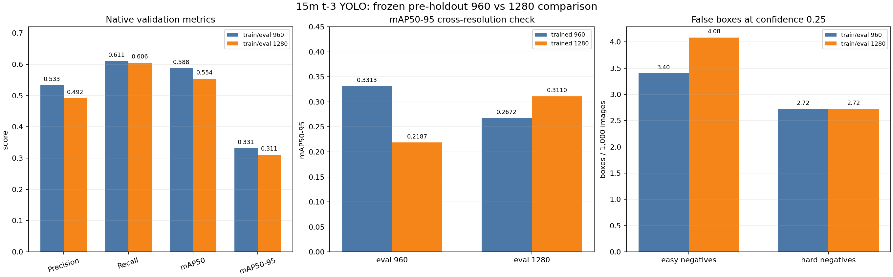
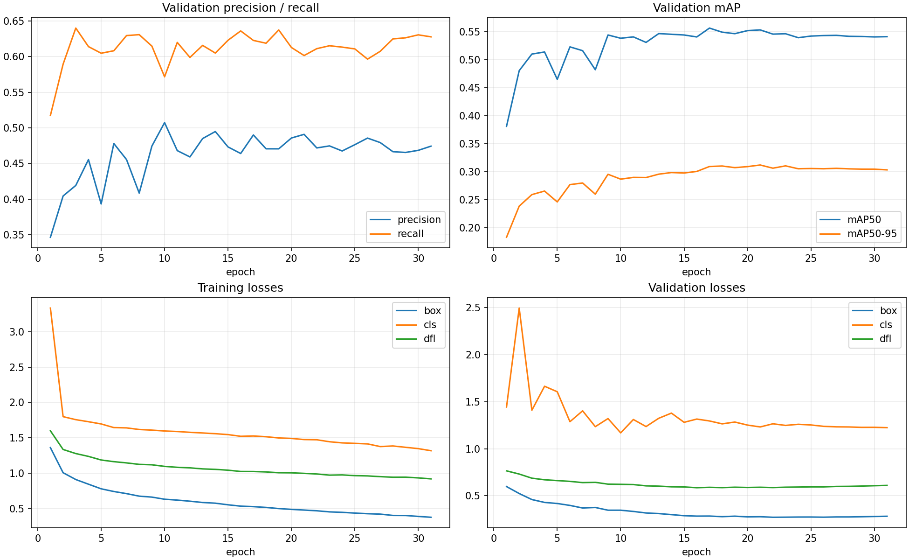
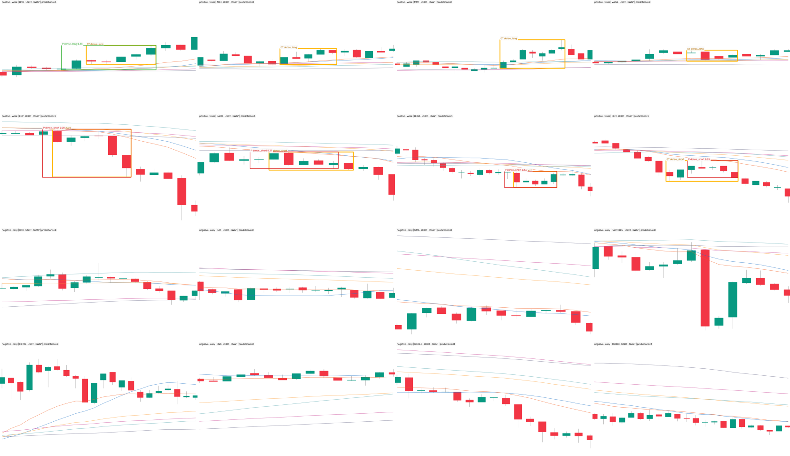

# 15m 六均线密集启动 t-3：原图宽度 imgsz=1280 重训报告

## 结论先行

- 本轮直接使用上一轮已经验收过的 **36,812 张 1280×742 PNG** 和对应 YOLO 标签；没有重渲染、
  没有压缩后另存、没有移动框、没有重做正负样本。唯一训练变量是 `imgsz 960 → 1280`。
- 3060 运行状态：**成功早停并退出（exit_code=0）**。第 31 轮触发 patience 10，最佳是第 21 轮；
  回载 best.pt 的 CUDA 验证为 P 0.4919、R 0.6015、mAP50 0.5547、mAP50-95 0.3120。
- 固定 2,940 张时间验证集的原生分辨率结果：1280 为 P 0.4921、R 0.6058、mAP50 0.5543、
  mAP50-95 0.3110；相对 960 原生四项分别下降 0.0414、0.0049、0.0337、0.0202。
- 固定 confidence=0.25 的背景误报结果：easy 从 5 框/4 张升到 6 框/6 张，hard 仍为
  4 框/4 张；1280 没有用更低误报换取指标变化。
- 没有读取 holdout，没有调整阈值，没有改 ACTIVE/frozen，没有 promote、部署、forward 或下单。
  这仍是完成态弱标签研究模型，`training_eligible=false`、`production_eligible=false`。



## 这次到底改了什么

| 项目 | 960 基线 | 1280 本轮 | 是否变化 |
|---|---:|---:|---|
| PNG 像素 | 1280×742 | 1280×742 | 否，同一批文件 |
| manifest SHA-256 | `dd552469…bc3a` | `dd552469…bc3a` | 否 |
| train / val | 33,872 / 2,940 | 33,872 / 2,940 | 否 |
| 正 / easy / hard | 9,938 / 9,938 / 16,936 | 同左 | 否 |
| 输入窗 / 核心框 / 确认窗 | W14–22 / 4–7 / 3–5 根 | 同左 | 否 |
| 框位置分布 | middle 6,348 / right 3,590 | 同左 | 否 |
| 训练 `imgsz` | 960 | **1280** | **是，唯一变量** |
| 其余训练参数与增强 | 冻结配方 | 同左 | 否 |

Ultralytics 的 `imgsz` 是模型训练时的 letterbox 目标上限，不是数据集文件尺寸。本轮没有把
1280×742 图先改写成正方形 PNG；训练器在内存中按 `rect=true` 保持宽高比并补边。960 基线同样
读取原始 1280×742 文件，只是训练张量的长边较小。因此这次回答的是“模型端使用更高输入分辨率
是否更好”，不是重新造一套图片。这里的“原图”严格指源 PNG 未离线缩放、重编码或另存；训练
批次仍保留基线同样的 `translate=0.02 / scale=0.1` 内存增强，因此不代表每个训练张量都与磁盘
PNG 逐像素相同。把这两项也改成 0 会同时改变第二、第三个变量，本轮没有这样做。

数据与训练身份：

| 产物 | 固定身份 |
|---|---|
| dataset manifest | `dd55246938b03c4b2013d159cdfee94b4e9db56ecb298ad30145eb5d1bc2bc3a` |
| dataset build summary | `3e16331836cad20fb62c27b73b8506353ec3bc75b7df846de815fc06eab16142` |
| YOLO11s 初始权重 | `85a76fe86dd8afe384648546b56a7a78580c7cb7b404fc595f97969322d502d5` |
| trainer | `4ec54f1ee956c2d17ef9d5a2877a7872310ad886636fd08003159d8c143d2aa5` |
| 960 best.pt | `8b2e393ffa887b8284a5580f68df290963fccc08fb94cdc4e0fec0c2b1e40e10` |
| 1280 best.pt | `a9fae2ef64489e24f39bd51714d96b43cf680bf80d5c536537f03a4402e9f9c0` |

## 3060 训练合同与终局

| 项目 | 冻结值 / 结果 |
|---|---|
| 主机 / GPU | `Administrator@192.168.1.5` / NVIDIA GeForce RTX 3060 12GB |
| 环境 | torch 2.8.0、torchvision 0.23.0、ultralytics 8.4.89、numpy 2.0.2 |
| 训练 | 40 epochs 上限，patience 10，batch 8，**imgsz 1280** |
| 优化 | AdamW，lr0 1e-4，lrf 0.01，warmup 0.5 |
| 复现 | seed 0，deterministic true，rect true，cache false，workers 2 |
| 增强 | flip / HSV / mosaic / mixup / copy-paste / erasing 全关；translate 0.02、scale 0.1 |
| 实际轮数 / best 轮 | 31 / 21 |
| 训练用时 | 9.101 小时（约 9 小时 6 分） |

远端先校验 Mac/3060 的四个依赖版本，再把同一数据集复制到独立只写一次的目录；manifest、build
回执、QA 回执、初始权重、trainer 与预注册均按 SHA-256 通过后才启动。新 run name 和远端数据
目录与 960 基线分开，旧权重和旧日志没有被覆盖。



| 静态 val | epoch / 类别 | Precision | Recall | mAP50 | mAP50-95 |
|---|---:|---:|---:|---:|---:|
| 1280 第 1 轮 | 1 | 0.3467 | 0.5175 | 0.3811 | 0.1828 |
| 1280 CSV 最佳行 | **21** | 0.4910 | 0.6015 | 0.5536 | 0.3120 |
| 1280 回载 best.pt | overall | **0.4919** | **0.6015** | **0.5547** | **0.3120** |
| 1280 回载 best.pt | dense_long（822） | 0.503 | 0.589 | 0.536 | 0.299 |
| 1280 回载 best.pt | dense_short（648） | 0.481 | 0.614 | 0.574 | 0.325 |
| 1280 停训当轮 | 31 | 0.4744 | 0.6277 | 0.5414 | 0.3033 |

## 同一 val 的 2×2 分辨率对照

两份权重都在 `imgsz=960` 和 `imgsz=1280` 各评估一次；验证集、rect、IoU 和 conf=0.001 全部
固定，不调阈值。这样可以分开观察“训练分辨率”与“只在推理时把分辨率调高”两种效应。

| 训练 imgsz | 推理 imgsz | Precision | Recall | mAP50 | mAP50-95 |
|---:|---:|---:|---:|---:|---:|
| 960 | 960 | 0.5334 | 0.6107 | 0.5880 | 0.3313 |
| 960 | 1280 | 0.4792 | 0.5485 | 0.5036 | 0.2672 |
| 1280 | 960 | 0.3882 | 0.5580 | 0.4351 | 0.2187 |
| 1280 | 1280 | **0.4921** | **0.6058** | **0.5543** | **0.3110** |

原生对原生的变化：Precision -0.0414、Recall -0.0049、mAP50 -0.0337、mAP50-95 -0.0202。
两个交叉单元都进一步下降：旧 960 权重只把推理改成 1280，mAP50-95 降到 0.2672；新 1280
权重改用 960 推理则降到 0.2187。两套权重各自依赖训练分辨率，但这种匹配效应不能改变 1280
原生单元仍弱于 960 原生单元的事实，因此下降不是单纯由“评估尺寸没对上”造成的。

## easy / hard 负样本误报

confidence 固定 0.25。easy 是原数据集 val 的 1,470 张配对背景；hard 是独立 sidecar 的 1,469
张均线密集但未来未完成启动背景。hard 没有并入 frozen val，也没有用于训练或调阈值。

| 权重 / 推理分辨率 | easy 发火图 | easy 框/千图 | hard 发火图 | hard 框/千图 |
|---|---:|---:|---:|---:|
| 960 / 960 | 4 / 1,470 | 3.401 | 4 / 1,469 | 2.723 |
| 1280 / 1280 | 6 / 1,470 | 4.082 | 4 / 1,469 | 2.723 |

easy 增加 1 个框、2 张发火图，即 +0.680 框/千图；hard 的框数与发火图数完全持平，但命中样本
并非逐一相同。两个模型在这两组背景上产生的框全部是 dense_long。样本量很小，不能把 hard
持平解释成显著等效；它只能说明本轮没有观察到 hard 误报数量改善，而 easy 有轻微恶化。

## 固定 16 张 val 预测渲染



这 16 张仍是按相同稳定 SHA 选出的 4 LONG、4 SHORT、8 easy background；输入是数据集里的原始
1280×742 PNG，仅在副本上叠加黄框 GT 和预测框。8 张正例中 5 张出现 confidence≥0.25 的预测框，
8 张 easy 背景均无框。它用于核对像素、颜色、
类别、框坐标和推理渲染链路，不用 16 张图代替完整 2,940 张 val 指标。

## 验收与零假设

这是目标检测/渲染分辨率实验，不是入场收益实验，所以 val AUC、收益置换 p、top-decile 毛/净
收益、胜率、单特征收益基线和匹配随机入场对照按字面不适用；本报告不把 mAP 叫成盈利证据。

同等严格的非方向性零假设是：若收益只是“推理时像素更多”，960 权重在 eval=1280 应取得与
1280 训练权重类似的改善；若收益来自高分辨率训练，2×2 网格会显示权重效应。easy/hard 背景则
检查更高分辨率有没有用误报换召回。三项都使用预先冻结的样本、权重和阈值，不根据结果重选。

| 检查 | 结果 |
|---|---|
| 原图身份 | 36,812 张仍为同一 manifest；确定性抽检及全量身份已在前轮 QA 通过 |
| 单变量 | 仅 `imgsz 960 → 1280`；其余远端 args 逐字段通过 |
| 训练结束 | exit_code=0；第 31 轮早停、best 第 21 轮；远端与 fetched 文件 bytes/SHA 一致 |
| 2×2 val | 4 / 4 单元完成；每单元 2,940 图、1,470 个实例 |
| 负样本 | easy 1,470 + hard 1,469；confidence=0.25，未调阈值 |
| holdout | 未读取；0 次消费 |
| 项目测试 | 1,657 passed、4 skipped；新增失败 0 |

## 与 960 基线同表结论

| 指标 | 960 基线原生 | 1280 本轮原生 | 差值 | 裁决 |
|---|---:|---:|---:|---|
| Precision | 0.5334 | 0.4921 | -0.0414 | 下降 |
| Recall | 0.6107 | 0.6058 | -0.0049 | 下降 |
| mAP50 | 0.5880 | 0.5543 | -0.0337 | 下降 |
| mAP50-95 | 0.3313 | 0.3110 | -0.0202 | 下降 |
| easy 框/千图 @0.25 | 3.401 | 4.082 | +0.680 | 恶化 1 框、2 张发火图 |
| hard 框/千图 @0.25 | 2.723 | 2.723 | +0.000 | 数量持平 |

**本轮裁决：拒绝用 imgsz=1280 替代 960 基线。** 它在同一时间 val 的四项原生指标全部下降，
easy 误报略增，hard 数量持平；固定 16 张图里正例框更多不能推翻全量结果。960 权重继续只作为
当前完成态弱标签研究基线；本轮 1280 权重保存用于复现负结果，但不进入 ACTIVE、forward 或部署。

## 风险与诚实声明

1. **弱标签仍不是 Gold。** 9,938 个正例来自完成态机器检索和 Owner 一次性授权，并非逐样本
   人工确认；提高分辨率不能修复标签语义误差。
2. **候选和标签看未来。** 像素最多到 `t+2`，但候选/正负归属看至 `t+11`；这个模型不能冒充
   tip / tip-1 / tip-2 新鲜实盘检测器。
3. **静态 val 不是实盘。** 指标只衡量复现当前弱标签；时间切分与 purge 不能证明扣成本后盈利。
4. **分辨率比较不是完全独立重复实验。** 两轮共享同一数据、初始化架构和 seed；结果只回答当前
   配置的单次对照，没有给 seed 间方差。
5. **背景不是“永远不会启动”。** easy/hard 只在冻结未来门下没有完成启动，仍可能含有视觉相似
   的未走出形态。
6. **没有消费 holdout，也不自动上线。** 本轮不改变 Gold、training 或 production 资格；ACTIVE、
   frozen、forward、部署和交易状态保持原样。

## 完整复现命令

```bash
cd /Users/zhangzc/fable-trading
git branch --show-current

# 远端依赖/显卡/占用检查；随后启动一次性 1280 run
FABLE_3060_HOST=Administrator@192.168.1.5 \
  bash scripts/train_15m_ma_launch_t3_imgsz1280_on_3060.sh --check
FABLE_3060_HOST=Administrator@192.168.1.5 \
  bash scripts/train_15m_ma_launch_t3_imgsz1280_on_3060.sh
FABLE_3060_HOST=Administrator@192.168.1.5 \
  bash scripts/train_15m_ma_launch_t3_imgsz1280_on_3060.sh --status
FABLE_3060_HOST=Administrator@192.168.1.5 \
  bash scripts/train_15m_ma_launch_t3_imgsz1280_on_3060.sh --fetch

# fetched bytes / args / remote exit / best validation / 曲线
PYTHONPATH=. .venv/bin/python scripts/summarize_15m_ma_launch_t3_training.py \
  --run analysis/output/ma_launch_t3_10000_v1/ma_launch_t3_10000_v1_y11s_ft_imgsz1280 \
  --out experiments/active/exp-15m-ma-launch-t3-yolo10000-imgsz1280-v1/results/training_receipt.json \
  --curve experiments/active/exp-15m-ma-launch-t3-yolo10000-imgsz1280-v1/results/training_curves.png \
  --run-name ma_launch_t3_10000_v1_y11s_ft_imgsz1280 \
  --experiment-id exp-15m-ma-launch-t3-yolo10000-imgsz1280-v1 \
  --expected-imgsz 1280 \
  --remote-dataset-name ma_launch_t3_10000_v1_imgsz1280_input \
  --remote-host Administrator@192.168.1.5

# 固定 val：两份权重 × 两种推理 imgsz
PYTHONPATH=. .venv/bin/python scripts/evaluate_15m_ma_launch_t3_resolution_grid.py \
  --baseline-weights analysis/output/ma_launch_t3_10000_v1/ma_launch_t3_10000_v1_y11s_ft/weights/best.pt \
  --baseline-sha256 8b2e393ffa887b8284a5580f68df290963fccc08fb94cdc4e0fec0c2b1e40e10 \
  --treatment-weights analysis/output/ma_launch_t3_10000_v1/ma_launch_t3_10000_v1_y11s_ft_imgsz1280/weights/best.pt \
  --treatment-sha256 a9fae2ef64489e24f39bd51714d96b43cf680bf80d5c536537f03a4402e9f9c0 \
  --out experiments/active/exp-15m-ma-launch-t3-yolo10000-imgsz1280-v1/results/resolution_grid.json \
  --device mps --batch 8

# 固定 easy/hard 背景与固定 16 张预测渲染
PYTHONPATH=. .venv/bin/python scripts/evaluate_15m_ma_launch_t3_hard_val.py \
  --weights analysis/output/ma_launch_t3_10000_v1/ma_launch_t3_10000_v1_y11s_ft_imgsz1280/weights/best.pt \
  --weights-sha256 a9fae2ef64489e24f39bd51714d96b43cf680bf80d5c536537f03a4402e9f9c0 --imgsz 1280 --confidence 0.25 \
  --experiment-id exp-15m-ma-launch-t3-yolo10000-imgsz1280-v1 \
  --output experiments/active/exp-15m-ma-launch-t3-yolo10000-imgsz1280-v1/results/hard_val_evaluation_native1280.json \
  --device mps --batch 16

PYTHONPATH=. .venv/bin/python scripts/render_15m_ma_launch_t3_validation_preview.py \
  --run analysis/output/ma_launch_t3_10000_v1/ma_launch_t3_10000_v1_y11s_ft_imgsz1280 \
  --out experiments/active/exp-15m-ma-launch-t3-yolo10000-imgsz1280-v1/results/validation_preview.png \
  --receipt experiments/active/exp-15m-ma-launch-t3-yolo10000-imgsz1280-v1/results/validation_preview_receipt.json \
  --device mps --conf 0.25 --imgsz 1280 \
  --experiment-id exp-15m-ma-launch-t3-yolo10000-imgsz1280-v1

# 汇总对照图、项目测试与 Owner HTML
PYTHONPATH=. .venv/bin/python scripts/render_15m_ma_launch_t3_imgsz1280_comparison.py
PYTHONPATH=. .venv/bin/python -m pytest -q tests
PYTHONPATH=. .venv/bin/python scripts/md_to_html.py \
  analysis/p1_15m_ma_launch_t3_yolo10000_imgsz1280_20260827.md \
  --out-dir analysis/html
```

## 产物

- 预注册：`experiments/active/exp-15m-ma-launch-t3-yolo10000-imgsz1280-v1/preregistration.json`
- 数据集：`datasets/ma_launch_t3_10000_v1/`（与 960 基线逐字节同一份）
- 训练结果：`analysis/output/ma_launch_t3_10000_v1/ma_launch_t3_10000_v1_y11s_ft_imgsz1280/`
- 回执与渲染：`experiments/active/exp-15m-ma-launch-t3-yolo10000-imgsz1280-v1/results/`
- canonical Markdown：`analysis/p1_15m_ma_launch_t3_yolo10000_imgsz1280_20260827.md`
- Owner HTML：`analysis/html/p1_15m_ma_launch_t3_yolo10000_imgsz1280_20260827.html`

下一步是否用人工 Gold 抽检、是否消费 holdout、是否改变资格或 promote，均需要 Owner 另行明确
决定。本轮不代替这些决策。
