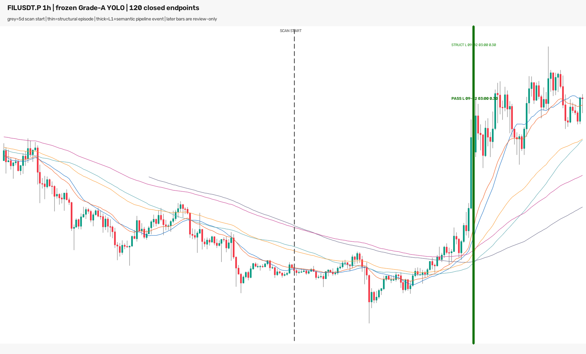
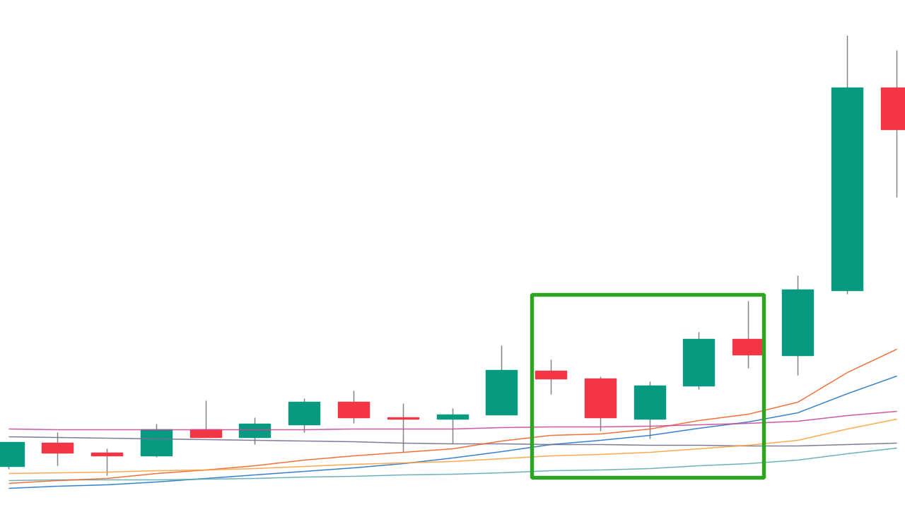

# FILUSDT.P 1h 最近5天：冻结 Grade-A 模型逐小时回放（2026-09-03/04）

## 结论先行

**同一段上涨被模型检出了，但并不是在下降趋势线刚突破时提前检出。** 冻结的 Grade-A
full40 native-1280 YOLO 在 OKX `FIL-USDT-SWAP` 最近 120 个完整 1h 端点中产生 8 个
`dense_long` 结构框；8 个全部通过既有因果语义门，合并后是 **1 个 LONG episode**。

| 项目 | 北京时间（UTC+8） | 点位 / 结果 |
|---|---|---:|
| 模型框对应的五根密集核心 | **09-01 19:00～23:00** bar | `0.6884～0.7211` |
| 突破主升大阳线 | **09-02 01:00～02:00** | 收盘 `0.7721`，该小时 `+6.69%` |
| 模型首次检测 bar 标签 | **09-02 02:00** | `dense_long`，`confidence=0.2966` |
| 首次无前视可用时间 | **09-02 03:00** | 检测 bar 收盘 `0.7621` |
| 同 episode 后续最高分 | **09-02 04:00 可用** | `confidence=0.5372` |
| 冻结行情末端 | **09-04 00:00 可用** | 末根收盘 `0.7988` |

所以，如果 Owner 问的是“模型有没有把截图里的这波上涨识别成 LONG”：**有**。如果问的是
“它能不能像手工下降趋势线一样在刚突破时给出早期入场”：**这次不能这样说**。模型等主升大阳线
已经收完，又等下一根 1h K 收完，才在 03:00 完整可用；从五根核心最后一根的收盘 `0.7083`
到首次检测收盘已经上涨约 **7.60%**。

截图没有机器可读的实际开仓时间或价格，因此本报告不能把该 episode 与 Owner 的成交单做严格
逐笔联结；但价格路径、日期和上涨段在视觉上是同一段行情。



灰色虚线是五天扫描区间的起点。细绿线是结构层 episode 的首次端点；粗绿线是 YOLO 后再通过
冻结语义门的完整流水线事件。粗线右侧所有 K 线只用于 Owner 审核，没有进入该次模型输入。

## 模型实际看见的图



这是首次检测的真实 `1280×742`、W19 输入。绿色框是模型原始 `cx/cy/w/h`，不是根据后来上涨
重新手画。模型输入到 09-02 02:00～03:00 这根 bar 为止，右侧后来 K 线物理不存在。

这也说明本次命中的语义：现有模型检测的是**均线密集后启动的局部核心**，不是识别了截图中那条
跨十天的手动画下降趋势线。两种形态在这次 FIL 行情上恰好重合，因此现有模型命中了同一波行情；
不能把这一张成功案例解释为模型已经具备通用趋势线识别能力。

## 扫描范围与数据统计

运行在 `2026-09-04 00:03 CST` 冻结，使用 OKX 官方 `FIL-USDT-SWAP / 1H` K 线。仍在形成的
00:00～01:00 CST bar 被排除。冻结快照包含 299 根连续小时 K：

- 来源范围：`2026-08-22 13:00 CST`～`2026-09-03 23:00 CST` bar；
- 正式评分范围：最后 120 根，即 `2026-08-30 00:00 CST`～`2026-09-03 23:00 CST`；
- 每个端点分别渲染 W18/W19，因此实际评分 **240 张**模型输入；
- checkpoint SHA-256：`862705b999594355c1133640acc540f4de19b561889e89d9e050ddad5c6db838`；
- 参数完全冻结：`imgsz=1280`、`conf=0.25`、NMS IoU `0.70`、core 4/5、post 2～9；
- 该 checkpoint 原生训练周期是 15m，本轮 1h 属于 OOD completed-history 研究回放。

| 层级 | 数量 | 方向 | 说明 |
|---|---:|---|---|
| 实际模型窗口 | 240 | — | 120 端点 × W18/W19 |
| YOLO 原始框 | 8 | 8 LONG | 均达到冻结 `conf=0.25` |
| 结构合法框 | 8 | 8 LONG | core4/5、post2～9 全部合法 |
| 语义通过框 | 8 | 8 LONG | 冻结因果语义门全部通过 |
| 重叠合并事件 | **1** | **LONG** | 八框是同一物理核心的重复观察 |

不能把 8 个框报成 8 次独立成功。最早框分数只有 `0.2966`；后来同一 episode 的最高分
`0.5372` 也不是胜率。

## 与前一轮 1h 最新端点扫描对照

| 项目 | 1h 最新端点 #14 | 本轮 FIL 五天 #17 | 变化原因 |
|---|---:|---:|---|
| 币种 | 274 | 1（FIL） | Owner 指定单币 |
| 每币端点 | 1 | 120 | 本轮需要回看手工交易发生时间 |
| 模型窗 | 548 | 240 | 端点数 × W18/W19 |
| 结构框 | 13 | 8 | 不同扫描范围，不是性能优劣 |
| 语义框 | 3 | 8 | 本轮八框属于同一 FIL episode |
| 去重事件 | 2（SUI、SAHARA） | 1（FIL LONG） | #14 只扫当时最新端点，当然看不到两天前 FIL 事件 |

本表只说明为什么先前的“最新一根”结果没有列出 FIL。它不是两个独立测试集上的性能比较。

## 无前视、独立复验与零假设对照

独立复验不联网，重新读取冻结 CSV，并逐个重建 8 个模型输入和 8 组实际/反向语义：

| 检查 | 结果 |
|---|---:|
| 冻结小时 K 连续性 / 末端闭合时间 | PASS |
| 精确模型输入像素重建 | 8/8 PASS |
| 输入像素失败 | 0 |
| 实际方向语义重算 | 8/8 PASS |
| 反向语义重算 | 8/8 PASS |
| 语义数值最大绝对误差 | `1.11e-16` |
| 模型输入读取未来 K | 0 根 |
| CPU 独立重跑首张输入 | `dense_long`, `0.296579` |
| CPU 与正式 MPS 框坐标最大差 | `5.55e-17` |
| CPU 与 MPS confidence 差 | `2.18e-6` |

非方向性单样本检测回放没有 val 标签，因而 val AUC、top-decile 毛/净收益、胜率、0.2% 成本、
收益置换检验和匹配随机交易对照均**不适用**；强行填数会制造不存在的证据。本轮同等严格的零假设
对照固定每一张图、框、分数、时间和 OHLC，只把语义计算里的 LONG/SHORT 翻转：实际方向
`8/8` 通过，反向 `0/8` 通过，配对精确双侧 `p=0.0078125`。它只表明这 8 个框的语义生存依赖
正确方向，不证明趋势线策略收益，也不把 Owner 事后选中的盈利单变成精度统计。

独立 verifier 第一次运行在比较未出现的 `post5=None` 时停止；修复仅处理缺失值相等性，随后用
同一冻结 CSV 离线重跑通过，没有第二次行情读取或模型参数变化。

任务专属测试 `tests/test_probe_1h_filusdt_grade_a_recent5d.py` 为 **4/4 PASS**。扩展守门集合
共 85 项时为 **84 PASS / 1 FAIL**；唯一失败来自旧实验
`exp-15m-ma-launch-owner-yolo-causal-semantic-gate-v1` 预注册锁定的 `raw_evaluator` SHA 与当前
main 文件不一致，不涉及本轮 FIL 脚本、数据、权重或结果。本轮没有越权改写旧实验合同。

## Holdout 与风险诚实声明

- Owner 本轮明确要求读取最新 FIL 1h 五天并运行现有模型；登记为该 Grade-A checkpoint 的
  holdout 使用 **#17**。
- 这是 Owner 已知盈利后的单例回放，存在强烈结果条件选择，不能估计 precision、召回率或收益。
- 本次命中发生在大阳线之后，证明“能事后确认这波启动”，不证明“能在下降线刚突破时及时入场”。
- 1h 是 15m checkpoint 的分布外周期。一次视觉正确不能把 1h 模型升级成可用 detector。
- 没有训练、调参、修改阈值或权重、改 label/dataset、promote、部署、改 ACTIVE/frozen/forward、
  发 Telegram 或下单；`training_eligible=false`、`production_eligible=false` 不变。

## 复现入口

预注册合同：
`experiments/active/exp-1h-filusdt-grade-a-recent5d-probe-20260903-v1/preregistration.json`

```bash
cd /Users/zhangzc/fable-trading

# 正式运行；输出目录存在时 fail closed，不会覆盖
.venv/bin/python scripts/probe_1h_filusdt_grade_a_recent5d.py \
  --device mps --batch-size 8

# 冻结结果离线复验；network_reads=0
.venv/bin/python scripts/verify_1h_filusdt_grade_a_recent5d_probe.py

# Owner HTML
python3 scripts/md_to_html.py \
  analysis/p1_1h_filusdt_grade_a_recent5d_probe_20260903.md \
  --out-dir analysis/html
```

审核入口：

- 全局图：`experiments/active/exp-1h-filusdt-grade-a-recent5d-probe-20260903-v1/results/review/FILUSDT_P_1h_recent5d_global.png`
- 可浏览图库：`experiments/active/exp-1h-filusdt-grade-a-recent5d-probe-20260903-v1/results/review/gallery.html`
- 完整摘要：`experiments/active/exp-1h-filusdt-grade-a-recent5d-probe-20260903-v1/results/summary.json`
- 独立复验：`experiments/active/exp-1h-filusdt-grade-a-recent5d-probe-20260903-v1/results/verification.json`

## 下一步（需要 Owner 选择）

1. 若只确认这笔交易身份：提供实际开仓时间或价格，即可与本次 `03:00 / 0.7621` 检测逐笔比较，
   不需要再次跑模型或消费 holdout。
2. 若目标是像手工画线一样更早发现：另做因果数值趋势线候选层，并在未见的 pre-holdout 数据上
   冻结参数；不能根据这张已知盈利图反向调阈值。
3. 当前模型保持原样。本单不足以授权训练、promote 或进入实盘。
