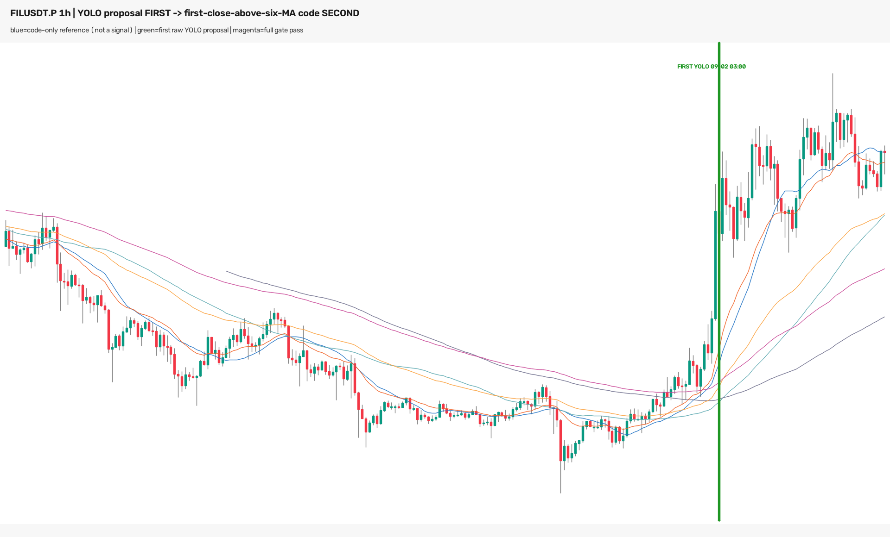

# FILUSDT.P 1h：模型先检测、代码再确认站上线（2026-09-04）

## 结论先行

**Owner 提出的流水线顺序是对的，但当前 YOLO 仍然给不出早信号。** 本轮严格执行：

```text
冻结 YOLO 原始提案 → 确定性代码检查“本根首次收盘站上六条均线”
```

复用上一轮 240 张模型输入的完整原始框账本，不联网、不重新推理、不降低 `conf=0.25`：
YOLO 共给出 8 个 LONG 原始框，代码门 **0/8 通过**。最早 YOLO 提案仍是
**09-02 02:00 bar，03:00 CST 才完整可用**，所以第二层代码无论怎么写，都不能把信号
提前到模型尚未提案的 01:00～02:00 主升阶段。



绿色粗线是第一个原始 YOLO 提案的完整可用位置。图上没有洋红线，因为没有任何模型提案通过
“本根首次站上六线”的代码门。后续 K 线只存在于审核图，不进入任何门控计算。

## 为什么 8 个全部被代码拒绝

冻结代码规则没有可调阈值：LONG 必须同时满足：

1. 当前收盘严格高于 `SMA/EMA 20/60/120` 六线中的最高值；
2. 前一根收盘不高于前一根六线最高值。

第一个模型提案的逐值结果：

| 项目 | 数值 | 判断 |
|---|---:|---|
| 当前 02:00 bar 收盘 | `0.7621` | — |
| 当前六线最高值 | `0.709675` | 当前已经在线上方 |
| 前一根主升 bar 收盘 | `0.7721` | — |
| 前一根六线最高值 | `0.704157` | 前一根也早已在线上方 |
| 代码最终结果 | — | **FAIL：不是“本根首次站上”** |

其余 7 个提案同样发生在价格已经站上六线之后。因此，若第二层代码只检查“现在是否在线上”，
8 个都会保留，但最早时间仍是 03:00；若检查“是不是刚刚首次站上”，则 8 个全部排除。
两种写法都无法修复 YOLO 本身的晚到。

## “刚出密集站上均线”不是简单六线穿越

在模型后来框出的核心区间开始之前，FIL 收盘已经高于六线最高值：09-01 17:00 bar 收盘
`0.6941`，六线最高值约 `0.6907`。所以本轮冻结的“第一次由线下穿到六线上”并不等同于
Owner 视觉上的“从密集区刚启动并站稳”。后者实际是一个有状态的组合语义：

1. 模型必须先在**当时可见的右端**输出 `dense_active`；
2. 代码把该密集状态短暂锁存；
3. 随后代码判断价格脱离密集核心、站在均线束上方；
4. 信号时间只能是当根收盘，禁止把后来检测到的框回填到核心时间。

本轮只验证顺序和瓶颈，没有根据这张已知盈利图选择“锁存几根”“离开核心多少 ATR”或其他
新阈值。那些参数若要做，必须先在 pre-holdout 样本冻结，不能在本单上现场调到通过。

## 与上一轮同表对照

| 项目 | 原 completed-history 语义门 | 本轮模型先→首次站上线代码 | 变化 |
|---|---:|---:|---|
| 模型输入 | 240 | 240（逐字节复用） | 0 |
| YOLO 原始框 | 8 | 8（完整账本复用） | 0 |
| 最早模型可用时间 | 09-02 03:00 CST | 09-02 03:00 CST | **没有提前** |
| 第二层通过框 | 8 | 0 | 首次穿越条件剔除全部晚框 |
| 去重事件 | 1 LONG | 0 | 不把晚框冒充早信号 |

这不是两套独立测试数据上的性能比较，只是同一组冻结模型提案的第二层逻辑诊断。

## 数据统计、因果复验与零假设

- 源数据：OKX `FIL-USDT-SWAP / 1H`，冻结 299 根连续小时 K；
- 评分范围：120 个完整端点、W18/W19 共 240 张输入；
- 原框账本完整性：源摘要 `raw_boxes=8`、`accepted_structural_boxes=8`、候选 CSV 8 行，
  三者完全相等，因此旧结构门没有藏住更早的原始框；
- 本轮网络读取 0、模型推理 0，只读取已登记的冻结字节；
- 每次代码判断只读取 `t-1` 与 `t`；修改每个提案后面的全部 OHLCV 后重新计算，8/8 决策不变；
- 独立实现重新计算六条均线和 8 个实际/反向判断，全部与交付 CSV 一致；
- 实际方向通过 0/8，方向翻转也通过 0/8。方向翻转在本例无法区分方法，诚实结论是代码门只在
  拒绝晚框，没有提供方向有效性的额外证据。

这是已知盈利单的单例架构诊断，不存在独立 val 标签，因此 val AUC、top-decile 毛/净收益、
胜率、0.2% 成本、收益置换检验和匹配随机交易对照均不适用；填写这些数字会制造性能证据。
同等严格的零假设是方向镜像与 Future Mutation Test，分别为 `0/8 vs 0/8` 和 `8/8 PASS`。

## 风险与诚实声明

- Owner 本轮明确要求尝试模型先、代码后；即使没有联网和重新推理，新配置查看了冻结 holdout
  结果，登记为该 checkpoint 的 holdout 使用 **#18**。
- 本轮证明的是必要时序上限：后级代码不可能早于首个模型提案；不证明新的 `dense_active`
  模型一定有效。
- 当前 checkpoint 由 15m completed-history 图训练，在 1h 上是 OOD；不能据此评价所有周期。
- 当前阶段仍是 P0/P1，未启动新模型训练。没有调置信度、改权重/标签/数据集、promote、部署、
  改 ACTIVE/frozen/forward、发 Telegram 或下单；两项 eligibility 均为 false。

## 复现命令

```bash
cd /Users/zhangzc/fable-trading

# 已冻结输出存在时 fail closed，不会覆盖
.venv/bin/python scripts/diagnose_1h_filusdt_model_first_breakout.py

# 独立离线复验
.venv/bin/python scripts/verify_1h_filusdt_model_first_breakout.py

# 单元、注册表与边界守门
.venv/bin/python -m pytest -q \
  tests/test_model_first_breakout.py \
  tests/contracts/test_registries.py \
  tests/boundaries/test_layer_imports.py

# Owner HTML
python3 scripts/md_to_html.py \
  analysis/p1_1h_filusdt_model_first_breakout_gate_20260904.md \
  --out-dir analysis/html
```

## 下一步（Owner 决策）

正确方向不是交换流水线顺序，而是给第一层建立真正的因果目标：模型在突破前或突破当根只回答
“这里当前是否处于可启动的均线密集状态”，代码随后判断离开密集核心并站稳。仓库现阶段允许的
下一步是先制作 tip/tip-1/tip-2 盲审图，让 Owner 标出 `DENSE_ACTIVE / ONSET_NOW / NOT_YET`；
P0/P1 门通过前不启动新 YOLO 训练。
