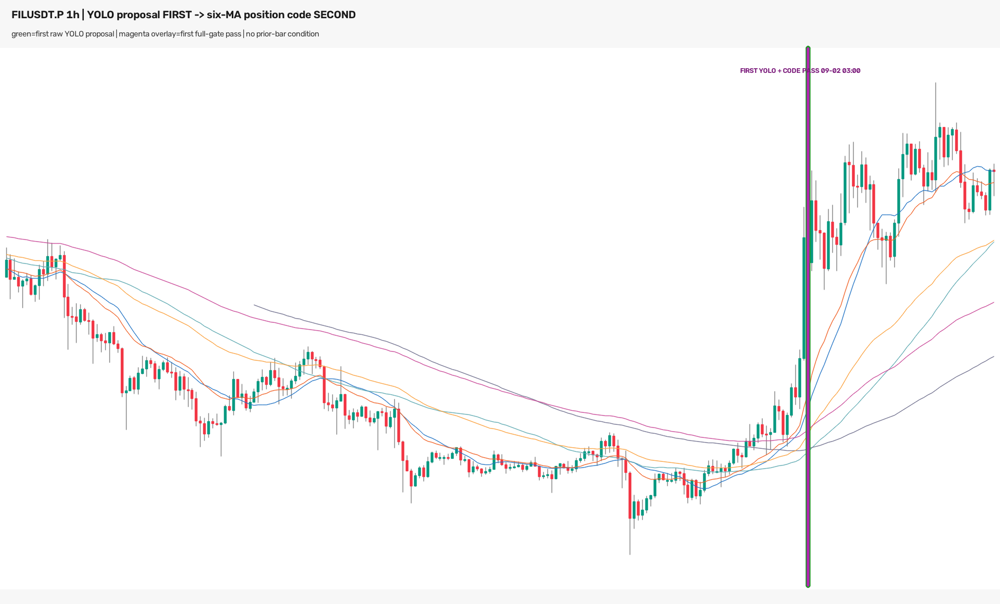

# P1 — FILUSDT.P 1h 模型先、当前站位代码后诊断（2026-09-04）

## 结论

Owner 要求去掉代码层的前一根首次穿越条件。本轮保留“模型先提案、代码后确认”的顺序，
只把代码门改成：LONG 提案端点的当前收盘严格高于全部六条均线；SHORT 为严格低于全部
六条均线。代码不再读取前一根 K 线。

冻结的 8 个 YOLO 原始提案现在 **8/8 通过**，方向翻转对照 **0/8 通过**；重合核心去重后
仍是 **1 个 LONG 事件**。最早完整可用时间仍为 **2026-09-02 03:00 CST**，与原始 YOLO
最早提案完全相同。因此这项修改修复了 v1 的 0/8 误拒绝，但没有把信号提前；当前延迟下界
仍由上游 YOLO 何时首次提案决定。



图中绿色外沿是首个 raw YOLO 提案，紫色内线是首个完整门通过。两者重合在同一根 02:00
开盘的小时 K 线上，该 K 线到 03:00 CST 收完后才可用。右侧未来 K 线只用于 Owner 审核，
不进入模型输入或代码判断。

## 授权、单变量与 holdout 账本

- Owner 选中“本根首次站上六线”并明确要求“去掉这个”。
- v2 唯一变化：删除 `t-1` 是否仍在均线束内侧的判断。
- checkpoint、240 张模型输入、8 个 raw box、W18/W19、`conf=0.25`、NMS `0.70`、
  方向、端点、六均线算法和 `epsilon=0` 全部不变。
- 本轮登记为该 checkpoint 的 holdout 使用 **#19**。这是已知盈利案例上的规则诊断，
  不是模型精度、收益或泛化验证。
- 零网络读取、零新模型推理、零训练、零调参；未改 ACTIVE/frozen/forward，未 promote、
  部署、发消息或下单。

预注册：
`experiments/active/exp-1h-filusdt-model-first-standing-gate-20260904-v2/preregistration.json`。

## 技术规则

模型必须先产生提案，代码只在该提案端点 `t` 执行：

```text
LONG 通过 := close[t] > max(SMA20, SMA60, SMA120, EMA20, EMA60, EMA120)[t]
SHORT 通过 := close[t] < min(SMA20, SMA60, SMA120, EMA20, EMA60, EMA120)[t]
```

没有 `t-1` 条件，没有首次穿越扫描，没有距离阈值。相等不通过。实现只读取 `t`，模型没有
提案的时刻不能由代码反向补成信号。

## 数据统计

| 项目 | 数值 |
|---|---:|
| 交易所 / 合约 / 周期 | OKX / FIL-USDT-SWAP / 1h |
| 冻结 K 线 | 299 根，2026-08-22 13:00 ～ 2026-09-03 23:00 CST |
| 被评分端点 | 120 个完整小时端点 |
| W18/W19 模型输入 | 240 张 |
| raw boxes | 8 |
| structural boxes | 8 |
| 完整候选账本 | 8 行 |
| v2 当前站位通过 | 8 / 8 |
| 方向翻转通过 | 0 / 8 |
| 重合核心去重事件 | 1 个 LONG |
| Future Mutation | 8 / 8 PASS |

## v1 / v2 单变量对照

| 版本 | 代码读取 | raw 提案 | 代码通过 | 去重事件 | 最早可用时间 |
|---|---|---:|---:|---:|---|
| v1 前一根穿越门 | `t-1, t` | 8 | 0 | 0 | 无 |
| v2 当前站位门 | `t` | 8 | 8 | 1 | 09-02 03:00 CST |
| 原始 YOLO | 模型窗口截至 `t` | 8 | 不适用 | 1 | 09-02 03:00 CST |

v1 到 v2 的 0→8 完全由删除前一根条件解释。最早时间没有变化，说明第二级只能筛选模型已经
产生的提案，不能修复上游首次提案偏晚。

## 完整候选结果

下表时间为 K 线开盘时间（UTC）；每根 1h K 线在一小时后完整可用。

| candidate | endpoint UTC | conf | close | 六线上沿 | 实际方向 | 翻转方向 |
|---|---|---:|---:|---:|---|---|
| 000001 | 09-01 18:00 | 0.2966 | 0.7621 | 0.709675 | PASS | FAIL |
| 000002 | 09-01 19:00 | 0.5372 | 0.7871 | 0.717049 | PASS | FAIL |
| 000003 | 09-01 19:00 | 0.3393 | 0.7871 | 0.717049 | PASS | FAIL |
| 000004 | 09-01 22:00 | 0.3149 | 0.7598 | 0.730554 | PASS | FAIL |
| 000005 | 09-01 23:00 | 0.2995 | 0.7786 | 0.735129 | PASS | FAIL |
| 000006 | 09-01 23:00 | 0.3265 | 0.7786 | 0.735129 | PASS | FAIL |
| 000007 | 09-02 00:00 | 0.4047 | 0.7725 | 0.738688 | PASS | FAIL |
| 000008 | 09-02 00:00 | 0.5182 | 0.7725 | 0.738688 | PASS | FAIL |

完整机器账本：
`experiments/active/exp-1h-filusdt-model-first-standing-gate-20260904-v2/results/model_first_standing_decisions.csv`。

## 因果与独立复算

- 代码门只读取提案端点 `t` 的 `close` 与六条 trailing MA。
- 对每个提案，把 `t` 之后所有 OHLCV 乘以 5～50 倍再重算均线，8/8 决策不变。
- 独立 verifier 不导入生产 gate，重新计算六条均线、8 个实际方向、8 个翻转方向、重合核心
  去重和全局图像素；结果 PASS。
- verifier 核对 4 份冻结源哈希，得到 8 个实际通过、0 个翻转通过、1 个事件；图像为
  1920×1160，SHA-256 为
  `85bc0a05ca001bace7793c6e618c7eeb1dc26004967ca525c93e0aa7323bff6f`。

方向翻转是本次非经济诊断的零假设对照：如果“站在线束目标侧”只反映无方向性的远离均线，
翻转方向也应大量通过；实际为 0/8。它只支持代码方向一致性，不证明未来收益。

## 经济指标为什么不适用

本轮没有训练分类器、没有候选排序，也没有建立独立经济标签，因此 val AUC、置换检验 p、
top-decile 毛/净收益、胜率、单特征收益基线和匹配随机入场对照均不适用。FIL 是 Owner 已知
盈利后选中的单例；在它上面计算收益指标会产生结果条件选择偏差，不能编造为模型能力。

同等严格的替代检查是：完整 8-row raw-box 账本、方向翻转 8 对、Future Mutation 8 对、
独立 MA 复算和 v1/v2 单变量对照。

## 解读

1. Owner 的修改是正确的：模型已经负责提出“密集形态”，代码层不应再要求提案端点恰好是
   均线穿越事件；否则同一有效状态会因模型晚一根或多根而被全部误拒。
2. v2 的职责是验证“模型提案当前是否仍站在目标侧”，所以 8 个重叠提案通过后必须去重成
   1 个事件，不能宣称得到 8 次独立信号。
3. v2 不解决延迟。要在图中更早出现，必须让模型在更早的因果右端产生 proposal；后级代码
   无法回填模型尚未发出的时点。

## 风险与诚实声明

- 这是 15m 训练 checkpoint 在 1h 上的 OOD 已完成历史回放。
- 当前模型框需要核心之后的 K 线，不能冒充 tip / tip-1 / tip-2 新鲜盘口信号。
- 单个已知盈利案例只能判断这条代码门有没有误拒，不能估计误报率、胜率或收益。
- 8 个 proposal 高度重叠，只代表一个事件。
- `training_eligible=false`、`production_eligible=false`；生产仍应 `detector=none`。

## 复现命令

本轮实际执行：

```bash
.venv/bin/python -m pytest -q \
  tests/test_model_first_standing.py \
  tests/test_model_first_breakout.py \
  tests/boundaries/test_layer_imports.py \
  tests/causality/test_future_mutation.py

.venv/bin/python scripts/diagnose_1h_filusdt_model_first_standing.py
.venv/bin/python scripts/verify_1h_filusdt_model_first_standing.py
python3 scripts/md_to_html.py \
  analysis/p1_1h_filusdt_model_first_standing_gate_20260904.md \
  --out-dir analysis/html
```

runner 与 verifier 均拒绝覆盖既有 canonical 输出。完整从零重建应在 `7fc2cdf` 的干净 clone
中执行前两条生成命令，再比较 summary、决策账本、图像与 verification receipt 的哈希；
`generated_at` / `verified_at` 是预期变化字段。

## 下一步

本次 Owner 指定修改已经完成，不需要继续调整这条门。若目标是提前识别，只允许进入 P0/P1
的下一动作：审核 tip / tip-1 / tip-2 无未来窗口，确认模型在启动前是否看得到且能稳定标注
`dense_active`。在 P0/P1 门通过前不启动新 YOLO 训练。
