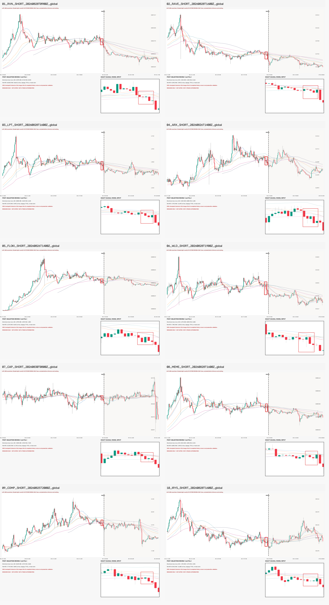

# P1 — OKX 全市场 1h：模型先检测、当前站位代码后 Top-10（2026-09-04）

## 结论

已按 Owner 要求**取消“只看已冻结 pre-holdout 候选”限制**，重新下载当时全部合资格 OKX
USDT 永续 1h 原始 K 线并重新运行当前 Grade-A checkpoint。流水线顺序是：YOLO 先提案，
代码再检查提案端点当前收盘是否位于六条均线的目标侧；没有前一根条件，也不要求“本根首次
站上/站下”。

完整漏斗为：**65,760 个 W18/W19 输入 → 2,294 raw boxes → 2,008 个合法结构框 →
1,928 个当前站位通过 → 248 个同币同方向去重事件 → 模型排序 Top-10**。Top-10 恰好全是
SHORT，这是模型置信度自然排序结果，没有人工凑多空比例。

这些也**不是十个都赚钱**。四天未来仅在身份冻结后作审核：96h 方向性收盘变化 8/10 为正，
但 24h 只有 2/10 为正、48h 只有 1/10 为正；FLOKI 和 IRYS 到 96h 仍为负。并且没有定义
真实入场、手续费、滑点、止盈止损和持仓路径，因此这些数字不是交易收益。



逐张高清全局图（每张 180 根历史 + 96 根未来）在：
`experiments/active/exp-1h-okx-model-first-standing-top10-20260904-v1/results/review/gallery.html`。

## 扫描范围与 holdout 账本

- Owner 原话：“测试一下 找到10个信号我看看”；随后明确说“不要这个限制”。
- 解释为：不再复用旧候选账本，允许读取当前 holdout 市场并重新推理。
- checkpoint holdout 使用登记为 **#20**。
- 冻结时间：2026-09-04 01:23:19 CST；最新完整 1h bar 开盘时间为 09-04 00:00 CST。
- 当时合资格合约 277 个；274 个有连续 396 根 K 线。CASHCAT、CP、DGAI 上市时间太短，
  分别仅 14、26、14 根，被显式排除。
- 每币评分 120 个端点（08-26 01:00 至 08-31 00:00 CST），每端点 W18/W19 两张图。
- 每币最后 96 根（08-31 01:00 至 09-04 00:00 CST）在任务构建前物理删除，只供审核。
- 未训练、调参、改阈值、promote、部署、改 ACTIVE/frozen/forward、发消息或下单。

预注册：
`experiments/active/exp-1h-okx-model-first-standing-top10-20260904-v1/preregistration.json`。

## 技术规则

模型仍使用冻结的 15m Grade-A full40 native-1280 权重，但本轮在 1h 图上作 OOD 研究：

```text
YOLO: conf=0.25, NMS IoU=0.70, W18/W19, core=4/5, post=2..9

LONG code pass  := close[t] > max(SMA20,SMA60,SMA120,EMA20,EMA60,EMA120)[t]
SHORT code pass := close[t] < min(SMA20,SMA60,SMA120,EMA20,EMA60,EMA120)[t]
```

代码门只读 `t`；没有 `t-1`，没有首次穿越条件。事件在同币同方向内按固定 5-bar core-end
间隔去重。每个事件在图上标记**最早通过端点**；Top-10 排名使用事件内模型峰值置信度，随后
依次用最早可用时间、symbol、class_id 稳定破同分。任何 future / return / MFE / MAE 字段
进入排序都会直接报错。

## 数据与结果统计

| 项目 | 数值 |
|---|---:|
| 合资格 / 可用 / 排除合约 | 277 / 274 / 3 |
| 每币冻结完整 K 线 | 396 根 1h |
| 每币评分端点 | 120 |
| W18/W19 模型输入 | 65,760 |
| raw boxes | 2,294 |
| 合法结构框 | 2,008 |
| 当前站位通过 | 1,928 |
| 方向翻转站位通过 | 9 |
| 去重独立事件 | 248 |
| 交付 Top-10 | 10（全 SHORT） |
| 未来变异 / 输入像素复验 | 10/10 / 10/10 PASS |
| 全量代码门独立复算 | 2,008/2,008 PASS |

## 十个信号

“方向变化”为 SHORT 方向的收盘变化：正数表示该时点之后价格下跌。MFE/MAE 同样只从信号
bar 收盘作观察基准，不是可成交回测。

| # | 合约 | 首次完整可用 CST | 峰值 conf | 24h | 48h | 96h | 96h MFE | 96h MAE |
|---:|---|---|---:|---:|---:|---:|---:|---:|
| 1 | RVNUSDT.P | 08-28 18:00 | 0.9727 | +4.29% | +5.76% | +8.54% | +10.32% | -0.66% |
| 2 | RAVEUSDT.P | 08-29 01:00 | 0.9600 | -1.96% | -1.32% | +3.16% | +4.29% | -3.95% |
| 3 | LPTUSDT.P | 08-29 01:00 | 0.9588 | -0.30% | -3.64% | +1.63% | +3.27% | -5.49% |
| 4 | ARXUSDT.P | 08-26 23:00 | 0.9579 | -5.52% | -0.88% | +1.68% | +7.37% | -11.69% |
| 5 | FLOKIUSDT.P | 08-26 23:00 | 0.9549 | -6.99% | -4.29% | -1.03% | +1.27% | -8.66% |
| 6 | WLDUSDT.P | 08-29 04:00 | 0.9476 | +1.47% | -0.84% | +4.68% | +7.78% | -2.23% |
| 7 | CAPUSDT.P | 08-30 17:00 | 0.9427 | -3.58% | -2.94% | +7.52% | +13.22% | -11.72% |
| 8 | MEMEUSDT.P | 08-29 01:00 | 0.9426 | -0.51% | -2.04% | +2.21% | +6.05% | -2.34% |
| 9 | COMPUSDT.P | 08-26 05:00 | 0.9421 | -0.63% | -2.57% | +3.68% | +7.77% | -5.04% |
| 10 | IRYSUSDT.P | 08-29 01:00 | 0.9409 | -1.74% | -4.17% | -2.35% | +0.76% | -11.60% |

汇总仅作图审描述：24h 均值 -1.55%、48h 均值 -1.69%、96h 均值 +2.97%；96h 平均 MFE
+6.21%、平均 MAE -6.34%。CAP 最能说明为什么“96h 最后是正”不等于一单好交易：期间对
SHORT 的不利幅度达到 -11.72%。

机器明细：
`experiments/active/exp-1h-okx-model-first-standing-top10-20260904-v1/results/selected_top10.csv`。

## 与 FIL 单例的对照

| 扫描 | 币数 | 输入 | 结构框 | 当前站位通过 | 去重事件 | 交付方向 |
|---|---:|---:|---:|---:|---:|---|
| FIL 1h 五日冻结账本 | 1 | 240 | 8 | 8 | 1 | LONG |
| 本轮全市场 1h 新扫描 | 274 | 65,760 | 2,008 | 1,928 | 248 | Top-10 全 SHORT |

这不是精度对照：FIL 是 Owner 已知盈利后点名的单例，本轮是全市场模型排序队列；时间冻结点、
币种数和结果选择机制都不同。它只证明同一“模型先、当前站位代码后”流程能够在新原始 K 线
上批量工作。

## 因果、恢复与独立复验

第一次本地 MPS 运行在 3,240/65,760 时因 batch=8 预计耗时过长而人工中断；当时 277 币
宇宙、274 份完整 K 线、3 个失败项和每文件 SHA 已全部落盘。部分模型输出没有写盘、没有进入
结果。恢复修正只把运行 batch 改为 32，从同一快照重新完整推理，**新增市场读取为 0**，模型
和所有语义、排序、未来隔离规则不变。

独立 verifier 不联网、不调用模型，完成：

- 274/274 个 candle 文件 SHA 与连续性；
- 2,008 个实际方向及翻转方向六均线判断；
- 从不含未来字段的 248-row event ledger 重建完全相同的 Top-10 顺序；
- 10/10 exact model-input pixel SHA；
- 10/10 Future Mutation；
- 10/10 全局图尺寸与文件哈希；
- 10/10 事后 24h/48h/96h、MFE、MAE 独立复算。

复验结果：PASS。

## 经济指标为什么不适用

本轮目标是检测图审，不是训练或策略验收；预注册没有交易入场、退出、TP/SL、成本或独立收益
假设。因此 val AUC、置换检验 p、top-decile 毛/净收益、胜率、单特征基线和匹配随机入场
对照均不适用，不能用 10 张图临时发明一套回测口径。

同等严格的非经济零假设与防泄漏证据是：2,008 个方向翻转对照、固定规则的完整事件账本、
选择函数 future-field fail-closed、274 个源文件哈希、10 次 Future Mutation 和独立 Top-10
重建。表中的后续变化只帮助 Owner 看图，不能用来宣称模型有收益 edge。

## 风险与诚实声明

- checkpoint 原生训练周期是 15m，本轮 1h 属于 OOD；置信度不是胜率。
- 模型框合同允许 core 后 2～9 根确认 K，本轮是 completed-history detector，不是 tip 新鲜信号。
- Top-10 全 SHORT 暴露出高置信端的方向偏置，不能据此默认实盘只做空，也不能手工补 LONG。
- 96h 8/10 为正与 24h 2/10、48h 1/10 的反转说明结果高度依赖持有期；没有预注册持有期就
  不能称为盈利。
- 样本只有 10 个且来自同一五日决策块；未建立匹配市场 beta 对照，不做泛化结论。
- `training_eligible=false`、`production_eligible=false`；生产仍应 `detector=none`。

## 复现命令

预注册与代码测试：

```bash
PYTHONPATH=. .venv/bin/python -m pytest -q \
  tests/test_scan_1h_model_first_standing_top10.py \
  tests/test_model_first_standing.py
```

原始市场读取与首轮运行（已诚实记录为中断，不应再次联网重放）：

```bash
PYTHONPATH=. .venv/bin/python scripts/scan_1h_model_first_standing_top10.py \
  --device mps --batch-size 8 --workers 6
```

从该次冻结快照完成的实际恢复命令：

```bash
PYTHONPATH=. .venv/bin/python scripts/scan_1h_model_first_standing_top10.py \
  --resume-frozen \
  experiments/active/exp-1h-okx-model-first-standing-top10-20260904-v1/results.snapshot_holdout20_batch8_interrupted \
  --recovery-amendment \
  experiments/active/exp-1h-okx-model-first-standing-top10-20260904-v1/recovery_batch_size_20260904.json \
  --device mps --batch-size 32 --workers 6

PYTHONPATH=. .venv/bin/python scripts/verify_1h_model_first_standing_top10.py

python3 scripts/md_to_html.py \
  analysis/p1_1h_okx_model_first_standing_top10_20260904.md \
  --out-dir analysis/html
```

## 下一步

本轮只需要 Owner 图审这十张，不应继续自动调阈值。如果 Owner 判定其中哪些是真正想要的
“密集启动”，下一步是在图上逐张记录形态裁决（不是按未来赚亏贴标签），再决定 1h 是否值得
单独建立原生 Gold Dataset；在 P0/P1 通过前不启动新训练或 promote。
