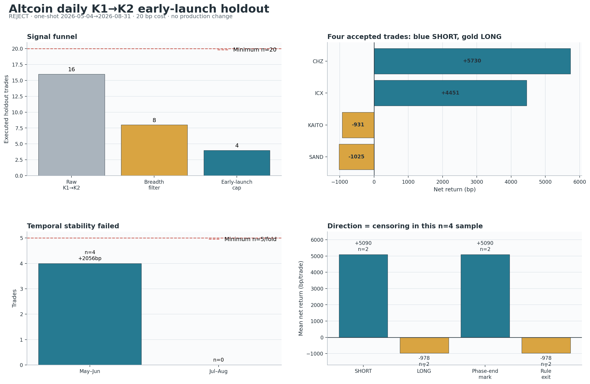

# 山寨币日线 K1→K2：早启动 V4 最终 Holdout

生成日期：2026-09-05

实验：`exp-altcoin-1d-k1k2-early-launch-holdout-20260905-v4`

裁决：**REJECT / 本配置 holdout 已消费 1 次 / 不重跑 / 不写 TradingView / 不改生产状态**

## Executive Summary

V4 回答一个很窄的问题：在 V3 已冻结的“方向广度 5 日增量至少 +2 个百分点”之外，若要求
K1 穿过 EMA13 时还没有离 SMA34 超过 `0.75 ATR`，能否只留下真正处在早期的日线趋势启动？

结果不是简单的“没用”，而是 **方向看对、证据不够、评估窗口还有结构性缺口**：

- 未过滤 K1→K2 在 holdout 只有 16 笔，已经低于预注册总样本下限 20；广度门降为 8 笔，
  早启动门再降为 4 笔。
- 4 笔候选扣除 20bp 往返成本后平均 `+2,056.24bp`、中位 `+1,759.96bp`、PF `5.206`；
  但正币占比只有 `50%`，周聚类 `p=0.2941`，第二时间折为 `0` 笔，严格随机匹配也为 `0` 笔。
- 0.75ATR 门在 8 笔广度交易里保留的 4 笔比剔除的 4 笔平均多 `+2,886.15bp`，但精确置换
  `p=0.1429`；单特征 `-K1 距离 SMA34` 的盈利 AUC 为 `0.7333`，精确 `p=0.1964`。
- 两笔盈利全是空单，平均 `+5,090.23bp`；两笔多单全亏，平均 `-977.76bp`。两笔盈利也全是
  数据尾端强制估值，而两笔亏损全是规则退出，方向、runner 激活和右删失在这个 `n=4` 样本里完全
  重合，无法证明是 K1→K2 选点能力，而不是阶段空头 beta。
- CHZ 与 ICX 的 SMA34 runner 确实保留了大趋势，只回吐 `0.35R / 0.29R`；所以本轮失败原因
  **不是止盈目标太低**。真正问题是信号基数、方向混杂、未闭合交易和数据覆盖。

因此程序按预注册合取门输出 `rejected_final_holdout`。漂亮均值不能覆盖失败门，也不能保存到
TradingView 或进入 ACTIVE。



## 这次测试之前冻结了什么

V4 的变量和 `0.75ATR` 阈值来自已经打开的 V3 development 与 confirmation A 事后诊断；这两段
只负责提出假设，**不获得任何确认信用**。在打开 2026-05-04 之后价格以前，以下内容已经提交并
推送：

| 项目 | 冻结值 |
|---|---|
| 快 / 慢线 | EMA13(HL2) / SMA34(HL2) |
| V3 共振 | 方向广度 5 日变化 ≥ +2pp |
| V4 唯一新增变量 | `direction × (K1 close - SMA34) / ATR14 ≤ 0.75` |
| K1→K2 最大距离 | 5 个完整 UTC 日 |
| 形态投票 | 4 票至少 2 票 |
| 入场 | K2 完成后下一完整 UTC 日开盘 |
| 结构退出 | 连续 2 个日收盘失效，下一日开盘退出 |
| 灾难止损 | K2 结构与 2ATR 取更宽者 |
| 渐进兑现 | +1.5R/+3R/+6R/+10R 各兑现 8%/4%/4%/4% |
| Runner | 完成日收盘达到 +1.5R 后，以 SMA34 ± 1.25ATR 跟随 |
| 最长持有 | 90 个完整日 |
| 成本 | 每笔固定扣 0.20% 往返成本 |
| 组合风险 | 每笔初始权益风险 0.5%，最多 6 仓、总开放风险 3% |

最终区间固定为 `[2026-05-04, 2026-09-01)`，分为 `May–Jun` 与 `Jul–Aug` 两个时间折。
本配置的 holdout 消费编号为 **#1**；结果出现后没有改阈值、止盈止损、样本门或统计门。

## 当前交易规则的完整口径

### 1. 日线与中性压缩段

每根日线必须由 UTC 日内恰好 96 根连续 15 分钟 K 线构成。ATR 为 Pine 风格 RMA14；所有均线和
指标都只使用当日及此前完成数据。

一个可重置 episode 需要连续 3 日同时满足：

- `|EMA13 - SMA34| / ATR ≤ 0.45`；
- `|EMA13 三日平均斜率| / ATR ≤ 0.10`；
- 当日 BB20 宽度 / 过去最多 120 日 BB20 中位数 `≤ 1.10`。

每个中性 episode 只允许一次 K1 尝试，失败后不在同一盘整区不断重触发，因此它本质上是稀疏趋势
策略，不是震荡区频繁交易策略。

### 2. K1：穿越快线的释放 K 线

多头 K1 必须开盘在 EMA13 下方或等于 EMA13，收盘穿到上方且实体为阳；空头完全镜像。随后还要：

- 实体 `≥0.20ATR`，全幅 `≥0.65ATR`；
- 收盘位于方向端至少 60%；
- 收盘相对 SMA34 不得落后方向超过 `0.25ATR`；
- K1 必须在中性结束后的 1–10 日内出现。

四个投票为：K1 幅度相对前 20 日中位数 `≥1.25`、量能相对前 20 日中位数 `≥1.25`、K1 收盘
真正站过 SMA34、以及 K2 时均线趋势已接受。至少 2 票通过。

V4 在上述形态之后再要求 K1 沿交易方向距离 SMA34 `≤0.75ATR`。这不是要求一定贴线为零距离；
它只排除穿线后已经走得过远的追价 K1。

### 3. K1 与 K2 之间

K2 必须在 K1 后 1–5 日出现。等待过程中，若收盘沿错误方向穿回 EMA13 超过 `0.05ATR`，本次尝试
立即失效；不会等行情再次变好后把后面的 K 线硬配成 K2。

### 4. K2：影线回踩与趋势接受

K2 必须为方向实体，并满足：

- 影线触及 EMA13，容差为线外 `0.10ATR`，最多刺入 `1.25ATR`；
- 实体靠近均线的一端不得反向穿入超过 `0.05ATR`；
- 收盘至少留在方向侧 `0.05ATR`；
- 回踩影线占全幅至少 15%；实体占全幅不超过 75%。

K2 是第一个满足形态的候选；若投票不够，同一 episode 也直接消耗，不能继续等更漂亮的 K2。

### 5. 市场共振与执行

K2 完成时，整个可用山寨币横截面中与交易方向一致的比例，相比 5 个完整日前至少扩大 2 个百分点。
通过后在下一日开盘成交。

初始结构位是 K2 极值外再留 `0.10ATR`，灾难风险至少 2ATR。尚未进入 runner 时，连续两个日收盘
跌破/升破结构位才安排下一日开盘退出；达到 +1.5R 的完成日收盘后，主仓改跟随
`SMA34 ±1.25ATR`，仍用连续两个完成日收盘确认。渐进止盈不抬整个仓位止损，优先保留大趋势右尾。

## 数据与覆盖

| 数据组 | 配置币数 | 历史合格 | 最后完整日 | 距注册末日缺失 |
|---|---:|---:|---|---:|
| V1/V2 已打开 development | 52 | 52 | 2026-07-11 | 51 日 |
| V3 A 当前段 | 87 | 75 | 2026-08-13 | 18 日 |
| V3 A 旧段+当前段 | 22 | 22 | 2026-08-13 | 18 日 |
| BTC reference | 1 | 1 | 2026-07-11 | 51 日 |
| ETH reference | 1 | 1 | 2026-07-11 | 51 日 |

共配置 161 个目标币，149 个满足至少 140 日历史；读取并保留 4,649,748 行目标 15m 数据，其中
1,386,914 行位于授权 holdout。完整目标日线 48,351 根，因数量/重复/时间网格问题丢弃 210 个日。
BTC/ETH 参考数据各缺 1 日。

覆盖缺口直接影响第二时间折：7 月 11 日后 BTC/ETH 制度字段无法计算，3 个 7 月原始 setup 被标为
`context_unavailable`；另外两个 7 月 setup 虽通过广度，却被 0.75ATR 门排除，因此 V4 在 Jul–Aug
最终为 0 笔。即使把这 3 笔假设为可用，原始信号总数仍只有 16，依旧达不到 20 笔注册下限。

V3 的 108 币 confirmation B 在本轮连 warmup、广度、信号、结果和随机对照都没有参与；实际打开
B 路径为 0。

## Holdout 结果总表

| 策略 | 交易/币 | 净 bp/笔 | 中位 bp | PF | 胜率 | 截断净 R | 正 fold | 最小 fold | 正币占比 | 周聚类 p |
|---|---:|---:|---:|---:|---:|---:|---:|---:|---:|---:|
| 原始 K1→K2 | 16/16 | -35.90 | -834.86 | 0.955 | 25.00% | -0.0438 | 1/2 | 5 | 25.00% | 0.3015 |
| + 广度 Δ5 ≥2pp | 8/8 | +613.16 | -680.75 | 1.881 | 37.50% | +0.4233 | 1/2 | 2 | 37.50% | 0.2727 |
| **+ K1 距慢线 ≤0.75ATR** | **4/4** | **+2,056.24** | **+1,759.96** | **5.206** | **50.00%** | **+1.4623** | **0/2*** | **0** | **50.00%** | **0.2941** |

`*` 程序要求两个 fold 都有有限统计量；Jul–Aug 为 0 笔，因此正式 `positive_folds=0`，不能把
May–Jun 的正值写成 1/2 稳定通过。

候选组合按每笔 0.5% 风险计算，账面总收益 `+2.907%`、已平仓曲线最大回撤 `-0.819%`、最大同时
3 仓。但这个组合数字包含两笔在数据尾端按收盘价强制估值的未自然退出 runner，只能算压力/估值
描述，不能当成可复现实盘收益。

### Top-decile 与成本

这是确定性规则实验，没有模型排序，所以 **validation AUC 不适用**。候选仍保留父规则的
`signal_score` 描述列；候选 top-decile 只有 1 笔 KAITO，其毛收益约 `-911.01bp`、扣 20bp 后
`-931.01bp`。top-decile 的样本为 1，既不支持该分数，也不能拿来与模型排名比较。

## 0.75ATR 门实际筛掉了什么

8 笔广度交易里，门保留 CHZ、ICX、KAITO、SAND，排除：

| 币 | 方向 | K1 距 SMA34 | 净 bp | 后续路径 |
|---|---|---:|---:|---|
| APT | 多 | 1.290ATR | -622.78 | 曾到 +1.98R，后回吐 2.56R，双收盘退出 |
| GRASS | 多 | 1.455ATR | -2,252.19 | 灾难止损 |
| SHIB | 多 | 1.128ATR | -738.72 | 灾难止损 |
| WET | 多 | 0.912ATR | +294.03 | 数据尾端估值 |

被排除 4 笔平均 `-829.92bp`，保留 4 笔平均 `+2,056.24bp`，差值 `+2,886.15bp`。这个方向与
“不追已经远离慢线的 K1”一致，但 8 选 4 的精确均值分配检验只有 70 种可能，单侧
`p=0.1429`，不能过统计门。

把连续距离直接当一个单特征，使用距离越小分数越高，在 8 笔里区分盈利交易的 AUC 为 `0.7333`，
精确标签置换 `p=0.1964`。这是本报告要求的单特征基线；没有 LightGBM、YOLO 或其他模型参与，
所以不存在可以汇报的模型 val AUC。

## 四笔候选逐笔诊断

| 币 | 方向 | 入场→观察/退出 | 距慢线 | 广度 Δ5 | 净 bp | R | Runner/止盈 | 结局 |
|---|---|---|---:|---:|---:|---:|---|---|
| CHZ | 空 | 05-22→07-12 | 0.026 | +23.49pp | +5,729.53 | +3.612 | 已激活/2 档，共 12% | 数据尾端估值 |
| ICX | 空 | 05-17→08-14 | 0.475 | +18.79pp | +4,450.93 | +3.878 | 已激活/2 档，共 12% | 数据尾端估值 |
| KAITO | 多 | 06-19→06-25 | 0.450 | +5.37pp | -931.01 | -0.621 | 未激活/0 档 | 双收盘结构退出 |
| SAND | 多 | 05-09→05-16 | 0.223 | +34.90pp | -1,024.50 | -1.020 | 未激活/0 档 | 2ATR 灾难止损 |

CHZ 与 ICX 的持仓内 MFE 分别 `3.97R / 4.19R`，最终捕获毛 R 为 `3.63R / 3.90R`，只回吐
`0.35R / 0.29R`。这正是用户要求的“沿均线慢慢 TP、吃大趋势”：小比例阶梯只兑现 12%，其余
88% 由 SMA34 runner 保留，执行并没有过早把赢家切掉。

但 KAITO 暴露另一类问题：它在 6 日后以 `-0.62R` 双收盘退出，而固定 90 日观察窗的后续 MFE
达到 `+12.86R`。这不是证据要求无脑放宽止损——SAND 后续 MFE 只有 `0.43R`，放宽只会扩大真实
失败损失。它提出的更窄研究问题是：**一次早期结构失效后，若均线与广度重新接受，是否允许同一大
趋势最多一次因果重入**。这个问题必须单独实验，不能和 0.75ATR 门一起事后补进 V4。

APT 则是“盈利又变亏”的典型：曾触及 `+1.98R`，只兑现 8%，最后净亏 `-622.78bp`。它支持未来
单独测试“达到首档后，快线动量衰减时再分批兑现”一类动态 TP，但 APT 已被 V4 入场门排除，不能用
它反过来证明 V4 候选应该改变退出。

## 为什么最终必须拒绝

| 预注册门 | 观察值 | 结果 |
|---|---:|---|
| 总计 ≥20 笔、每 fold ≥5、至少 15 个币 | 4 笔、0、4 币 | **失败** |
| 净均值 >0 | +2,056.24bp | 通过 |
| 截断平均净 R >0 | +1.4623R | 通过 |
| PF >1 | 5.206 | 通过 |
| 2/2 时间折为正 | 第二折 0 笔 | **失败** |
| 正币占比 ≥55% | 50% | **失败** |
| 周聚类 sign-flip p≤0.01 | 0.2941 | **失败** |
| 匹配随机超额 >0 且 p≤0.01 | 0 个匹配 | **失败** |
| 去最大赢家后均值 >0 | +831.81bp | 通过 |
| 组合收益 >0、DD≤20% | +2.907%、-0.819% | 通过但含右删失 |

门是合取关系，不是“7 项通过、5 项失败”的投票。尤其不能用高 PF 覆盖以下四个核心病因。

### 1. 样本在过滤前就不够

原始执行信号只有 16 笔，已经低于 20；广度与早启动门各削减一半，最终 4 笔。为了凑样本去放宽
K1/K2，会重新制造用户最反感的盘整乱开仓。正确办法是延长真正未来观察期或扩大事先冻结、覆盖完整的
资产池，而不是降低形态质量。

### 2. 盈利与方向完全混杂

原始 16 笔中，3 笔空单全部盈利，平均 `+3,998.90bp`；13 笔多单仅 1 笔盈利，平均
`-967.00bp`。V4 保留的 2 空全盈、2 多全亏。没有随机对照就无法回答：收益来自 K1→K2、来自
0.75ATR，还是恰好在山寨币走弱阶段做空。

### 3. 随机对照设计在稀疏日线下不可执行

预注册对照要求同币、同半年、相同方向、同币 holdout ATR 五分位、离信号至少 30 日，并且随机日
也要满足广度门；每个候选需要 2 个不复用控制。四笔候选各自可用控制数都是 0，所以候选对随机的超额
与 p 值均不可计算。对照失败本身就是研究设计失败，不能当作策略通过。

### 4. 两个赢家都没有自然退出

最大赢家 CHZ 占总净收益 `69.66%`；去掉它后仍为 `+831.81bp/笔`，所以“去一个赢家”门通过。
但前两大赢家合计占总收益 `123.78%`，去掉两笔后剩余两笔平均 `-977.76bp`；而这两大赢家正好都是
空单、runner 激活、数据尾端估值。传统 leave-one-out 对 `n=4` 趋势策略不够，必须同时审查
leave-top-k、方向与退出完整性。

## 本轮对“如何继续优化”的结论

### 保留为未来假设，而不是当前最优参数

- `广度 Δ5 ≥+2pp` 与 `K1 距 SMA34 ≤0.75ATR` 在本次都呈正确方向，但各自精确检验
  `p=0.1423 / 0.1429`，不能叫“最优”或“已确认”。
- SMA34 runner 对两笔真实大趋势的捕获是好的；不要因为整体拒绝就缩短 runner，也不要继续抬固定
  TP 把右尾截掉。
- 当前 V4 只能作为下一段**真正未来数据**的冻结假设，不能再用已经消费的 2026-05-04 之后行情调
  0.6、0.8 或 1.0ATR，然后重新报一次更好结果。

### 下一轮必须先修研究契约

1. **覆盖门先于 holdout 消费**：BTC、ETH 与目标币必须覆盖到注册评估末日；覆盖不全时在打开价格
   前 fail closed。
2. **未闭合 runner 不计作完成收益**：报告日仍开放的仓位单列 mark-to-market，不进入 PF、胜率、
   permutation 或通过门；要么等自然退出/90 日完整结束，要么把评估期结束后继续追踪的尾部预先写入
   标签窗。
3. **先证明匹配器可行**：在开发段预演每个事件至少能找到注册数量的对照；不能等 holdout 跑完才
   发现 0 对照。对照规格的任何调整必须在下一未来窗口前冻结。
4. **靠时间积累样本，不靠放宽形态**：日线趋势信号本来就稀疏，至少累计 20–30 个独立事件、两个
   都有样本的时间折后再作裁决。

### 可独立研究、但不能打包回测的两条执行假设

- **动态分批止盈**：达到首档后，如果快线动量衰减但慢线趋势仍有效，再兑现一小部分；不抬整个仓位
  的固定止损，仍给慢线 runner 留主仓。它针对 APT 类“先盈利后回吐”。
- **一次受限重入**：首次双收盘结构失效后，只有市场广度与均线方向重新接受、并出现新的合法 K2，
  才允许一次重入。它针对 KAITO 类“先洗出、后走大趋势”，而不是无脑扩大初始止损。

两者必须一次只测一个，先在开发数据写清触发时点与成本，再等待新的未来样本；本报告没有拿 holdout
替它们调参。

## 风险与诚实声明

- 本配置按 owner 授权读取 `[2026-05-04, 2026-09-01)`，这是该精确配置的第 1 次 holdout
  消费；不可再称后续同区间微调为独立验证。
- 币种集合来自 2026 年 9 月当前可用合约缓存，存在存活偏差、上市偏差，并非逐历史日 point-in-time
  universe。
- 目标与参考源覆盖没有到注册末日；结果按原门拒绝，没有静默补源或改区间。
- 4 笔候选、0 个匹配随机、4 个周簇，不具统计把握；高 PF 是右尾描述，不是稳定胜率证据。
- 两笔正收益是数据边界估值，不是自然退出；组合收益与回撤不能直接当作可交易曲线。
- 这次没有训练或评估任何模型；val AUC、top-decile 模型净收益与模型置换检验按字面不适用。报告给出
  了同等严格的固定单特征 AUC/精确置换和策略周聚类检验，没有编造模型指标。
- `training_eligible=false`、`production_eligible=false`；没有修改 Pine、TradingView、ACTIVE、
  frozen、forward、新鲜度门、部署、API key、仓位或真实订单。

## 复现与审计命令

一次性 holdout 已在冻结提交 `7de3bc77e52f20cefedac13903223c1b0369d624` 上执行：

```bash
PYTHONPATH=. .venv/bin/python \
  scripts/evaluate_altcoin_1d_k1k2_early_launch_holdout.py \
  --eval-holdout \
  --experiment-dir \
  experiments/active/exp-altcoin-1d-k1k2-early-launch-holdout-20260905-v4
```

该命令现在会因 `holdout_consumption_started.json` / `holdout_receipt.json` 存在而拒绝第二次执行，这是
预期的一次性保护。复核已提交结果、重建诊断图和 HTML 使用：

```bash
PYTHONPATH=. .venv/bin/pytest -q \
  tests/test_evaluate_altcoin_1d_k1k2_early_launch_holdout.py

PYTHONPATH=. .venv/bin/python \
  scripts/build_altcoin_1d_k1k2_early_launch_holdout_report.py

python3 scripts/md_to_html.py \
  analysis/p1_altcoin_1d_k1k2_early_launch_holdout_20260905.md \
  --out-dir analysis/html
```

关键冻结哈希：

- config SHA-256：`3a0d4975d37709f5a2f3e661a8dae829d23bea9464baa5d6884b46aba2c4f786`
- preregistration SHA-256：`037be3bf06bc5f1a4c386fb2c1603814d0267395d614260d00d750c9351bf57f`
- evaluator SHA-256：`352f3bc7e3bc13c943a85ec3b3c2e8d6c38ec8f7a832149c8ccf29f1896f1d0d`
- holdout receipt SHA-256：`76e1d6087af6e4e8f5a5aecc0aff05ec950325a65b5ac35b18ea414d5ad12609`
