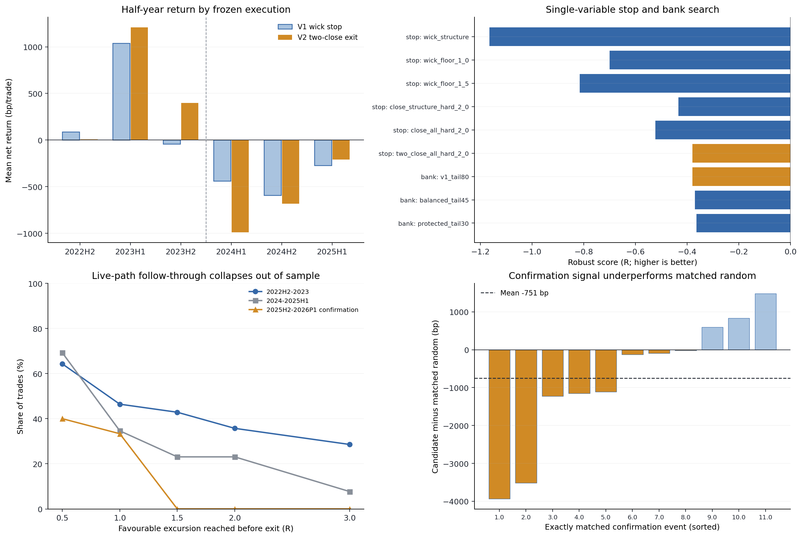

# 山寨币日线 K1→K2：稀疏趋势 Episode 与动态退出审计

生成日期：2026-09-05

实验：`altcoin 1D V1` / `altcoin 1D V2`

状态：**两版均未通过；保留研究代码与失败账本，不写 TradingView，不改 ACTIVE / forward / 实盘**

## 技术结论：日线版已经开发完成，但现阶段不能叫“可交易策略”

本轮不是把 15m 或 SMA40 参数放大到日线。V1 在 52 个当前本地缓存的 OKX 山寨币永续上，独立探索了
`EMA8/SMA21`、`EMA13/SMA34`、`EMA20/SMA50`，并把“中性压缩→首个 K1→首个 K2”做成一次性
episode，避免盘整里重复开仓。出场是小比例渐进止盈加慢线 runner。V2 保持信号完全不动，只探索日线
影线扫损、收盘确认止损、渐进止盈比例和快/慢线 runner。

最终结论明确：

- V1 在 2022–2023 selection 看似每笔 `+520.65bp`，但只有 22 笔，任何半年 fold 都未达到预注册的
  20 笔门槛；更快的 `EMA8/SMA21` 还被一笔 ORDI 上市期极端趋势抬高到 `+1,997bp/笔`。这不是稳定
  的参数证据。
- 冻结 V1 搬到 2024–2025H1 audit 后，23 笔变为 `-482.17bp/笔`、PF `0.084`、胜率 `4.35%`，
  0/3 半年为正；相对匹配随机再少 `374.14bp/笔` (`p=0.9392`)。
- V1 的日线影线硬止损确实过紧：22 笔亏损里有 17 笔在完整 90 日观察窗后来走到过 `+2R`，11 笔
  到过 `+6R`。因此 V2 改成 2 个连续日收盘失效、下一日开盘退出，并保留 2ATR 灾难止损。
- V2 在已看过的 development 把均值从 `-97.91` 改善到 `-47.37bp/笔`，但仍亏损、PF `0.936`，
  且 2024 年后 3 个半年全部为负。
- 冻结 V2 在一次性 confirmation（2025-07 至 2026-04）得到 15 笔、`-890.38bp/笔`、PF `0.082`、
  胜率 `13.33%`、0/3 时间 fold 为正。15 笔里 **没有一笔** 在实际持有期间达到 `+1.5R` 的首档
  止盈/runner 激活线。
- confirmation 的 11 笔精确匹配样本中，候选均值 `-1,001.18bp`，随机对照 `-249.77bp`，超额
  `-751.42bp` (`p=0.8915`)；不是简单的山寨币市场整体下跌 beta。
- 仓库 holdout 从 2026-05-04 开始，本轮数据加载上限是 2026-05-01，物理读取 **0 行 holdout**。

所以本轮交付的是一个能复现、能解释、信号足够稀疏、但已被时间外数据证伪的日线研究版本。把它现在
保存成 TradingView 或实盘指标，只会把失败规则包装得更好看，不会产生优势。



图左上把 V1 影线止损与 V2 双收盘退出按半年对照：V2 的改善集中在 2023 年，2024 年后两者都负。
右上是严格单变量的止损与分批止盈搜索；左下显示确认段入场的实际顺向运动在 `1.5R` 前归零；右下是
11 笔匹配随机的逐笔超额，均值为 `-751bp`。**出场修复是真改善，但无法修复没有持续跟随的入场。**

## 当前日线策略的完整交易规则

### 数据与均线

| 模块 | 冻结规则 |
|---|---|
| 标的 | 52 个当前本地缓存的 OKX USDT 永续；排除 BTC、ETH |
| 日线定义 | 每个 UTC 日必须恰好有 96 根唯一、连续、对齐的完成 15m K 线；缺失、重复、错位整日丢弃 |
| 指标分段 | 数据日期不连续时重置 ATR、均线和滚动窗口，禁止跨缺口续算 |
| ATR | Pine/Wilder RMA ATR14 |
| 快慢线 | 最终信号使用 HL2 的 EMA13 与 SMA34；不是 SMA40，也没有强制使用 40 |
| 压缩 | `abs(EMA13-SMA34)≤0.45ATR`、EMA13 三日斜率绝对值 `≤0.10ATR/日`、BB20 宽度不高于过去 120 日中位数的 1.10 倍，连续 3 日 |
| Episode | 压缩完成后产生一次可用 episode；首个合格 K1 无论之后成功或失败都会消费 episode，必须重新压缩才能再开下一单 |

### K1、K2 与两根 K 线的关系

| 模块 | 冻结规则 |
|---|---|
| K1 | 实体顺方向贯穿 EMA13；实体 ≥`0.20ATR`，全长 ≥`0.65ATR`，收盘处于顺方向至少 60% 位置；相对 SMA34 最多容许仍在错误侧 `0.25ATR` |
| K1 距压缩 | K1 必须在最近一次完成压缩后 10 日内出现 |
| K1→K2 距离 | 1–5 根日 K；中间任一收盘越过 EMA13 错误侧 `0.05ATR` 即失效 |
| K2 触线 | 影线必须实际触及 EMA13，容许离线 `0.10ATR`，穿越深度最多 `1.25ATR` |
| K2 实体 | 靠近均线的实体边缘最多深入错误侧 `0.05ATR`；收盘至少回到正确侧 `0.05ATR`；拒绝影线 ≥15%，实体占全长 ≤75%，实体方向与趋势一致 |
| 首个 K2 | 只评价 K1 后第一个形态合格 K2；如果共振票不足，episode 直接结束，不等更漂亮的后续 K2 |
| 信号时点 | K2 日线收盘后确认，下一完整 UTC 日开盘入场；不使用 K2 影线内部的事后最优成交价 |

这里专门把用户反复强调的距离纳入状态机：压缩到 K1 的距离和 K1 到 K2 的距离都是真正的信号条件，
不是画图标签。一个盘整区反复穿线也只允许第一次 K1 尝试，因此 confirmation 只有 15 笔可执行交易，
不存在 15m 版本那种盘整中密集发信号的问题。

### 已加入的因果共振

四票全部只使用 K2 收盘及以前信息：

1. K1 全长 / 前 20 日全长中位数 ≥`1.25`；
2. K1 成交量 / 前 20 日成交量中位数 ≥`1.25`；
3. K1 收盘已经越过 SMA34 的趋势侧；
4. K2 时 EMA13/SMA34 价差方向正确，且 EMA13 三日斜率方向正确。

最终要求至少 2/4 票。连续信号分数还综合 K1 振幅释放、量能释放、K2 价差、斜率和影线比例，用于同日
信号排序与诊断。它不是训练模型，也没有用未来收益拟合权重。

### V2 最终风险与动态止盈

| 模块 | 冻结规则 |
|---|---|
| 初始结构位 | K2 极值外再留 `0.10ATR` |
| 灾难止损 | 结构风险与 `2.0ATR` 取更宽者；盘中先检查，最大容许 `4ATR` |
| 结构退出 | runner 未激活前，连续 2 个完整日收盘跌破/升破 K2 结构位，下一完整日开盘退出 |
| 渐进止盈 | `+1.5R` 平原仓 8%；`+3R/+6R/+10R` 各平 4%；累计只兑现 20%，保留 80% 吃趋势 |
| Runner 激活 | 完整日收盘达到 `+1.5R` 后激活 |
| Runner | 多头为只上移的 `SMA34-1.25×当日ATR`，空头镜像；连续 2 日收盘失效后下一日开盘退出 |
| 同日优先级 | 先检查 2ATR 灾难止损，再成交分批止盈；本日收盘形成的新退出只能下一日执行 |
| 超时 | 最长 90 个完整 UTC 日；研究阶段边界强制平仓 |
| 成本 | 每笔固定扣 0.20% 往返成本；未额外计资金费率和冲击 |

组合层每笔以开仓权益的 0.5% 初始风险计量，最多 6 个并行仓、名义总初始风险约 3%。同日竞争时按
共振票数、连续分数、币名排序。组合曲线使用已平仓权益，因此报告单独声明它低估了持仓内浮亏。

## V1：看似漂亮的 2022–2023 结果没有达到样本门

### 三组均线都不是经验证的“最优参数”

| MA profile | Selection 笔数 | 净 bp/笔 | PF | 正式正 fold | 最大单笔 bp | 结论 |
|---|---:|---:|---:|---:|---:|---|
| EMA8/SMA21 | 61 | +1,997.21 | 5.593 | 1/4 | +121,269.40 | 一笔 ORDI 上市期趋势主导，3/4 半年负 |
| EMA13/SMA34 | 22 | +520.65 | 2.616 | 0/4 合格 fold | +5,871.67 | 保留 incumbent；每 fold 都不足 20 笔 |
| EMA20/SMA50 | 7 | +194.65 | 1.463 | 0/4 | +4,165.98 | 样本过少 |

预注册规则要求 selection 至少 120 笔、每半年至少 20 笔、至少 20 个币。没有候选达标，因此程序没有
把历史均值最高者当成最优，而是保持初始 `EMA13/SMA34`。这也是为什么结果里能看到正均值，却仍标记
`research_only_sample_gate_failed`。

V1 的单特征基线只保留“K1 振幅释放票”，其他入场/出场不变。selection 的 15 笔是
`+916.69bp/笔`、PF `4.62`，但 audit 的 14 笔变为 `-509.78bp/笔`、PF `0`。单一放量/放幅条件
同样不运输。

### 冻结后在 2024 起全面失效

| 冻结阶段 | 笔数 / 币数 | 净 bp/笔 | 中位 bp | PF | 胜率 | 正 fold | 正币占比 | 组合收益 / DD |
|---|---:|---:|---:|---:|---:|---:|---:|---:|
| V1 selection 2022–2023 | 22 / 16 | +520.65 | -343.36 | 2.616 | 31.82% | 0/4 合格 | 37.50% | +3.50% / -2.97% |
| V1 audit 2024–2025H1 | 23 / 20 | **-482.17** | -504.66 | **0.084** | **4.35%** | **0/3** | **5.00%** | **-9.65% / -9.65%** |

selection 中位数已经为负，正均值来自极少数右尾。到 audit，23 笔只有 1 笔盈利；高分前 10% 反而
`-782.27bp/笔`，周聚类 sign-flip `p=0.9969`。这不是参数轻微漂移，而是依赖少数超级趋势的分布在
2024 年以后消失。

## V1 失败归因：影线止损有问题，但不是唯一问题

| 失败模式 | 笔数 | 净 bp/笔 | 90日平均 MFE | 平均回吐 |
|---|---:|---:|---:|---:|
| 未跟随、触 K2 结构止损 | 15 | -568.95 | 13.25R | 1.81R |
| 已分批止盈但整单最终仍亏 | 7 | -510.73 | 3.58R | 3.06R |
| 唯一赢家仍有大回吐 | 1 | +1,019.54 | 5.05R | 3.03R |

日线内部噪声会扫过 K2 极值，V1 把任何影线触位都视为整单失败，确实过于脆弱。22 笔亏损中 17 笔在
止损之后的完整观察窗曾达到 `+2R`，11 笔达到 `+6R`，所以“只用 K2 最低/最高点做日线硬止损”值得
修复。

但 `horizon MFE` 是事后路径，不是可成交利润：它忽略了先承受多深浮亏、资金占用、再次入场以及在什么
时点才知道趋势恢复。更不能据此把止损无限放宽。因此 V2 只把它当成修改退出机制的假设来源，并重新做
一次单变量开发和一次冻结确认。

## V2：双收盘退出改善开发段，但没有跨期优势

### 单变量执行搜索

| 因子 | 候选 | 开发净 bp/笔 | Robust score | 是否替换 incumbent |
|---|---|---:|---:|---|
| 止损 | V1 K2 影线结构止损 | -97.91 | -1.1645R | Baseline |
| 止损 | 结构止损至少 1ATR | -96.59 | -0.6998R | 否 |
| 止损 | 结构止损至少 1.5ATR | -199.94 | -0.8157R | 否 |
| 止损 | 结构 1 日收盘失效；runner 盘中 | -56.47 | -0.4341R | 否 |
| 止损 | 结构/runner 都 1 日收盘失效 | -184.72 | -0.5231R | 否 |
| 止损 | **结构/runner 都 2 日收盘失效** | **-47.37** | **-0.3799R** | **是** |
| 分批 | 原 20% 止盈、80% runner | -47.37 | -0.3799R | 保留 |
| 分批 | 55% 止盈、45% runner | -18.02 | -0.3702R | 否，提升仅 0.0097R |
| 分批 | 70% 止盈、30% runner | -9.63 | -0.3641R | 否，提升仅 0.0158R |
| Runner | 快线而非慢线 | -7.99 | -0.3724R | 否，提升仅 0.0074R |
| 缓冲 | 慢线 1.75ATR | +20.84 | -0.4236R | 否，裸均值转正但跨 fold 更差 |

选择分数先把每笔 R 截在 `[-1.5,+10]`，再取半年均值的中位数减 0.5 倍标准差；任何替换至少要改善
`0.10R` 并保留右尾。这样可以防止一笔新币暴涨再次决定参数。更重的止盈和更快 runner 确实让裸均值
好看，但稳健改善远小于预注册门，因此最终仍保留 20% 微止盈和 80% runner。

### V2 的收益按时间断裂在 2024 年

| 半年 | V1 影线止损 bp/笔 | V2 双收盘退出 bp/笔 | V2 笔数 | V2 PF |
|---|---:|---:|---:|---:|
| 2022H2 | +87.56 | +8.63 | 8 | 1.009 |
| 2023H1 | +1,039.82 | +1,208.89 | 7 | 7.201 |
| 2023H2 | -43.04 | +398.94 | 13 | 1.710 |
| 2024H1 | -439.71 | **-991.18** | 6 | 0.000 |
| 2024H2 | -592.28 | **-681.51** | 13 | 0.309 |
| 2025H1 | -271.89 | **-209.83** | 7 | 0.708 |

V2 development 共 54 笔 / 31 币，均值 `-47.37bp`、中位 `-765.39bp`、PF `0.936`、3/6 fold
为正，组合 `-1.58%`、已平仓 DD `-6.56%`。它比 V1 baseline 少亏，但仍没有正期望；正 fold 全在
2023 年及以前，2024 起 3/3 为负，说明“修复止损”没有修复市场状态变化。

## 一次性确认：真正的问题变成 K1→K2 没有后续趋势

| 指标 | V1 式影线退出 baseline | V2 双收盘 candidate |
|---|---:|---:|
| 交易 / 币 | 13 / 11 | 15 / 12 |
| 净 bp/笔 | -621.10 | **-890.38** |
| 中位 bp | -546.54 | **-1,017.93** |
| PF | 0.000 | **0.0816** |
| 胜率 | 0.00% | **13.33%** |
| 正时间 fold | 0/3 | **0/3** |
| 正币占比 | 0.00% | **8.33%** |
| Runner 激活 / 任意止盈 | 15.38% / 30.77% | **0% / 0%** |
| 高分前 10% | -875.23bp | **-1,494.57bp** |

V2 的 15 笔里，8 笔触发 2ATR 灾难止损，5 笔连续两日结构收盘失效，2 笔因阶段结束退出；只有 SAND
空单与 VIRTUAL 多单为正。11 笔属于“假启动/没有跟随”，2 笔退出后完整窗口后来超过 `+2R`，2 笔是
普通小赢家。与 V1 audit 不同，这里没有任何一笔在实际持仓期间达到首档 `+1.5R`，所以调整
`1.5/3/6/10R` 分批比例或 SMA34 runner 细节根本没有触发机会。

实际持仓路径达到各级 MFE 的比例：

| 时段 | ≥0.5R | ≥1R | ≥1.5R | ≥2R | ≥3R |
|---|---:|---:|---:|---:|---:|
| 2022H2–2023 | 64.29% | 46.43% | 42.86% | 35.71% | 28.57% |
| 2024–2025H1 | 69.23% | 34.62% | 23.08% | 23.08% | 7.69% |
| Confirmation 2025H2–2026P1 | **40.00%** | **33.33%** | **0%** | **0%** | **0%** |

confirmation 的完整 90 日事后窗口有 3 笔后来超过 `1.5R`、2 笔超过 `2R`，但那发生在策略已经依据
双收盘或灾难止损退出之后。它只能支持“未来可以研究重新 arm/re-entry”，不能支持“当时应该不止损”。

## 共振为什么没有救活日线信号

### 票数和连续分数没有跨期排序能力

| 阶段 | 笔数 / 盈利笔 | 信号分数盈利 AUC | 高分前10%净 bp/笔 | 周聚类 sign-flip p |
|---|---:|---:|---:|---:|
| V1 selection | 22 / 7 | 0.638 | +3,181.34 | 0.1086 |
| V1 audit | 23 / 1 | **0.091** | **-782.27** | 0.9969 |
| V2 development | 54 / 15 | 0.569 | +478.70 | 0.6223 |
| V2 confirmation | 15 / 2 | **0.538** | **-1,494.57** | 1.0000 |

这里没有 LightGBM 或概率模型，因此模型 `val AUC` 按字面不适用，不能编造。表中的 AUC 只是固定因果
信号分数对最终正收益的排序诊断：confirmation 接近随机，而且最高分组亏得更重。严格零假设是周聚类
sign-flip 与同币、同时段、同方向、同 ATR 桶的匹配随机。

把票数直接加严也不成立：confirmation 中 2 票为 `-860.02bp/笔`，3 票为 `-745.55bp/笔`，4 票反而
是 `-1,431.11bp/笔`。多共振不是票越多越好；如果票来自同一组均线/波动信息，它们只是重复确认同一
错误状态。

### 形态特征发生漂移，但没有一个可直接拿来补阈值

| 事前特征中位数 | 2022H2–2023 | 2024–2025H1 | Confirmation |
|---|---:|---:|---:|
| 连续信号分数 | 0.991 | 0.809 | 0.848 |
| K1 振幅 / ATR | 1.436 | 1.205 | 1.337 |
| K1 振幅释放 | 1.880 | 1.398 | 1.538 |
| K1 量能释放 | 1.645 | 1.264 | 1.357 |
| K1 越过慢线距离 / ATR | 0.904 | 0.659 | 0.407 |
| K2 快慢线价差 / ATR | 0.540 | 0.417 | 0.418 |
| K2 快线三日斜率 / ATR | 0.042 | 0.037 | 0.039 |

后期 K1 的释放和越过慢线距离整体变弱，说明“启动”越来越像已存在震荡中的普通穿线。但 confirmation
只有 15 笔，事后相关性还互相冲突：例如更深 K2 触线、更大正向价差、更长影线在该小样本里反而与收益
负相关。现在基于它补一个 `K1慢线距离≥x` 或 `K2触线深度≤y`，就是用已经打开的确认段调参。

更合理的下一版共振不是继续叠同源票，而是增加与单币形态不同的信息轴：

- **市场广度**：信号日之前，52 币中站在各自慢线上方/下方的比例及其 3 日变化；
- **BTC/ETH 日线制度**：只使用信号日前已完成的 BTC/ETH 趋势、波动扩张和方向一致性；
- **横截面相对强弱**：K1 前 20 日收益或效率相对同日山寨币截面分位，而非本币自己再做一个相似振幅票；
- **重新 arm 机制**：双收盘退出后若重新完成压缩或方向性再启动，允许新 episode；不能原地无条件扛单。

这些是下一轮可预注册假设，不是本轮已经验证有效的参数。

## 匹配随机证明形态本身没有增益

匹配随机对照对每个候选复制同一做多/做空方向，在同一币、同一半年、同一阶段内 ATR14 五分位中抽 3 个
随机入场避开候选信号前后 30 日；每一行都沿用该候选阶段自身完全相同的出场、成本和风险规则。控制样本不复用。

| 阶段 | 精确匹配候选 | 候选净 bp/笔 | 随机净 bp/笔 | 超额 bp/笔 | 周聚类 p |
|---|---:|---:|---:|---:|---:|
| V1 audit | 22 | -461.98 | -87.84 | **-374.14** | 0.9392 |
| V2 confirmation | 11 | -1,001.18 | -249.77 | **-751.42** | 0.8915 |

confirmation 有 4 笔因同层内找不到 3 个未复用控制而未进入配对检验，程序没有降级为跨币或重复控制。
这组对照并不能证明因果，但足以否定“亏损只是那段市场整体不适合山寨币”这一解释：在相同币、方向和
波动层里，K1→K2 时点比随机时点更差。

## 信号数量已经足够稀疏，问题不是过度交易

| 阶段 | K1 episode 尝试 | 超时无 K2 | 中途错侧失效 | K2 票数拒绝 | 最终 setup / trade | 每100币年 setup |
|---|---:|---:|---:|---:|---:|---:|
| V1 selection | 100 | 31 | 31 | 9 | 22 / 22 | 21.17 |
| V1 audit | 126 | 47 | 33 | 16 | 23 / 23 | 29.53 |
| V2 development | 226 | 78 | 64 | 25 | 57 / 54 | 36.53 |
| V2 confirmation | 90 | 24 | 40 | 11 | **15 / 15** | **34.66** |

confirmation 相当于每个币每年约 0.35 个 setup。90 次压缩后 K1 尝试中，40 次被中间错侧收盘失效，
24 次等不到 K2，11 次 K2 共振不足，仅 15 次入场。继续用更严格形态压数量，不会自动把负期望变正；
需要能区分“真正跨市场启动”和“单币局部假突破”的新信息轴。

## 数据、时间切分与无前视保证

| 冻结读取节点 | 原始 15m 行 | 完整日 K | 丢弃日 | 有效币 | 最后日 K | Holdout 行 |
|---|---:|---:|---:|---:|---|---:|
| V1 selection | 2,074,809 | 21,596 | 37 | 34 | 2023-12-31 | **0** |
| V1 audit / V2 development | 4,350,232 | 45,291 | 49 | 47 | 2025-06-30 | **0** |
| V2 confirmation | 5,841,733 | 60,825 | 52 | 52 | 2026-04-30 | **0** |

V1 selection 是 2022–2023，audit 是 2024–2025H1；audit receipt 先提交，才将尚未打开的
2025H2–2026-04 改作 V2 一次性 confirmation。V2 development 明确是已见过的 2022H2–2025H1，
用于修出场，不冒充独立验证。

信号特征只使用当日及以前完成日 K：ATR14、HL2 均线、3 日斜率、前 20 日振幅/量能中位数、BB20
相对前 120 日宽度。K2 收盘形成信号，下一日开盘成交。执行层在日 K 内无法知道高低点先后，所以同日
采用保守的灾难止损优先。未来 OHLCV 突变测试验证边界前的信号身份和字段不变。

当前 52 币来自“现在仍在本地缓存的合约”，不是历史每一天的 point-in-time 上市池，存在幸存者与上市
时间偏差。代码对尚未上市的币记为 `not_listed_yet`，不会把没有该阶段数据误报成数据源损坏，也不会用
未来上市信息补历史 K 线。

## 验收门与诚实裁决

预注册确认门要求：样本合格、净均值与 capped-R 为正、PF>1、至少 2/3 时间 fold 为正、至少 55% 币
为正、周聚类和匹配随机均 `p<0.01`、组合收益为正、已平仓 DD≤20%。V2 confirmation 只有 DD 门通过，
其余全部失败。

风险与限制：

- confirmation 只有 15 笔，无法精确估计尾部；但 PF `0.082`、匹配超额 `-751bp` 和 0/3 fold
  同向，已足够否决当前规则，不足以挑新阈值。
- 20bp 成本未包含资金费率、动态滑点与成交量冲击，真实结果可能更差；不能在看到亏损后改低成本。
- 组合 DD 是已平仓权益，未逐日计入所有持仓浮亏；它是乐观下界，不是完整风险报告。
- 多币信号在同一市场制度下相关，15 笔不能当 15 个完全独立试验；统计检验按入场周聚类，但仍可能低估
  更长周期共同因子。
- 本轮没有训练、promote 或切换 LightGBM/YOLO；没有修改 Pine/TradingView、ACTIVE/frozen、
  forward、部署、新鲜度门、API key、仓位或真实订单。

## 下一步：只立新假设，不在已看过区间继续追参数

1. **当前 V1/V2 均标记 rejected。** 代码保留作研究基线，不保存 TradingView，不接 forward/实盘。
2. **下一版只改入场共振，冻结 V2 出场。** 使用市场广度 + BTC/ETH 日线制度 + 横截面相对强弱中的一个
   正交因子包；先预注册，不能同时再改止损和止盈。
3. **保留真正渐进 TP。** 当前确认失败不是因为止盈太近，而是 0/15 触发首档。若新入场能够稳定走到
   `1.5R`，再单独比较 20%/55%/70% 的真实落袋比例。
4. **新验证数据是硬前提。** 2022 至 2026-04 已用于选择、审计、修复、确认和事后诊断。下一版可以先
   写规则并 shadow；若要读取 2026-05-04 之后的仓库 holdout，必须为那个冻结配置单独记录消耗次数。
5. **若研究退出后恢复，必须测试 re-entry 而不是无限放宽止损。** 双收盘退出后只有重新压缩或新方向性
   启动才能 re-arm，并把再次入场的成本、并发和失败全部记账。

进一步问题：加入全市场广度之后，是否能在 setup 数量仍保持每币每年小于 0.5 的前提下，把匹配随机超额
从负转正，并让 2024 之后至少两个独立时间 fold 为正？当前数据不能诚实回答。

## 复现命令与证据

```bash
cd /Users/zhangzc/fable-trading

# V1：每个下一阶段只能在上一阶段 receipt 已提交后运行。
PYTHONPATH=. .venv/bin/python scripts/research_altcoin_1d_k1k2_episode_runner.py \
  --config experiments/active/exp-altcoin-1d-k1k2-episode-runner-preholdout-20260905-v1/config.json \
  --phase selection
PYTHONPATH=. .venv/bin/python scripts/research_altcoin_1d_k1k2_episode_runner.py \
  --config experiments/active/exp-altcoin-1d-k1k2-episode-runner-preholdout-20260905-v1/config.json \
  --phase audit

# V2：development receipt 提交后，confirmation 只运行一次。
PYTHONPATH=. .venv/bin/python scripts/research_altcoin_1d_k1k2_risk_repair.py \
  --config experiments/active/exp-altcoin-1d-k1k2-close-stop-bank-repair-preholdout-20260905-v2/config.json \
  --phase development
PYTHONPATH=. .venv/bin/python scripts/research_altcoin_1d_k1k2_risk_repair.py \
  --config experiments/active/exp-altcoin-1d-k1k2-close-stop-bank-repair-preholdout-20260905-v2/config.json \
  --phase confirmation

# 只从冻结结果生成诊断与本报告图，不读取行情源。
PYTHONPATH=. .venv/bin/python scripts/build_altcoin_1d_k1k2_report.py

# 测试与 HTML。
PYTHONPATH=. .venv/bin/python -m pytest -q \
  tests/test_research_altcoin_1d_k1k2_episode_runner.py \
  tests/test_research_altcoin_1d_k1k2_risk_repair.py \
  tests/contracts/test_registries.py
python3 scripts/md_to_html.py \
  analysis/p1_altcoin_1d_k1k2_episode_runner_20260905.md \
  --out-dir analysis/html
```

关键冻结证据：

- `experiments/active/exp-altcoin-1d-k1k2-episode-runner-preholdout-20260905-v1/results/audit_receipt.json`
- `experiments/active/exp-altcoin-1d-k1k2-close-stop-bank-repair-preholdout-20260905-v2/results/development_receipt.json`
- `experiments/active/exp-altcoin-1d-k1k2-close-stop-bank-repair-preholdout-20260905-v2/results/confirmation_receipt.json`
- `analysis/output/altcoin_1d_k1k2_20260905_v1_v2/summary.json`
- `analysis/output/altcoin_1d_k1k2_20260905_v1_v2/confirmation_trade_audit.csv`
- `analysis/output/altcoin_1d_k1k2_20260905_v1_v2/confirmation_matched_pair_audit.csv`
- `analysis/output/altcoin_1d_k1k2_20260905_v1_v2/postmortem_feature_diagnostics.csv`
