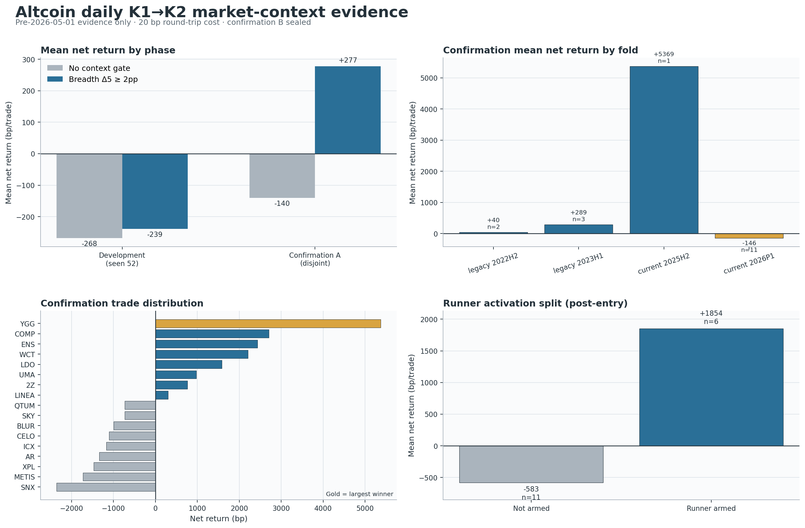

# 山寨币日线 K1→K2：市场广度共振 V3 与趋势接管诊断

生成日期：2026-09-05

实验：`exp-altcoin-1d-k1k2-market-context-preholdout-20260905-v3`

裁决：**REJECT / confirmation B 保持封存 / 不写 TradingView / 不改 ACTIVE、forward 或实盘**

## Executive Summary

V3 只改变了一个系统组件：**K2 确认后的入场资格**。K1/K2 形态、EMA13/SMA34、下一日开盘
入场、双收盘结构退出、2ATR 灾难止损、渐进止盈、SMA34 runner、90 日上限、20bp 成本和组合风险
全部沿用冻结的 V2。开发段依次筛选市场广度、BTC/ETH 制度和横截面相对强弱，最终只留下
`五日方向广度变化 ≥ +2 个百分点`。

这个门有真实的筛除能力：在不相交的 confirmation A 中，它从 22 笔 baseline 执行交易里剔除 5
笔，**5 笔全亏、0 笔盈利**，把均值从 `-140.16bp/笔` 提升到 `+277.27bp/笔`，PF 从
`0.841` 提升到 `1.405`。但是候选只有 17 笔，最低时间 fold 只有 1 笔，正币占比
`47.06%`，周聚类 `p=0.2777`；11 笔可匹配样本相对随机多 `+684.95bp/笔`，但
`p=0.1556`。所有正式统计门没有通过。

更关键的是，确认收益高度集中：YGG 一笔 `+5,368.88bp` 占候选净收益总和的 `113.90%`；
去掉它，剩余 16 笔平均 `-40.95bp`。真正进入 runner 的 6 笔平均 `+1,854.40bp`，没有进入
runner 的 11 笔平均 `-582.98bp`。这证明“吃大趋势”的执行设计方向是对的，但 **runner 是否
激活是入场后的结果，不能拿它事后挑单**。下一步应研究在 K2 收盘时可见、能预测后续趋势接管的独立
因果特征，而不是放宽形态制造更多信号，也不是继续无脑抬止损。



图左上是广度门在开发与 confirmation A 的增量；右上暴露时间 fold 极小且 2026P1 仍为负；左下
显示单笔赢家集中；右下显示 runner 激活后与未激活交易的巨大分化。四图共同说明：**门有方向，但证据
强度和样本覆盖都不够，不能把偶然抓到一次大趋势误写成稳定优势。**

## 这次到底优化了什么

V1/V2 已经证明，日线影线止损过于敏感，但仅把止损改为双收盘确认仍无法修复假启动。V3 因此冻结
执行层，转向与本币 K1/K2 形态不同的信息轴：

| 因果特征 | K2 收盘时的定义 | 开发候选 |
|---|---|---|
| 方向广度水平 | 同日可用山寨币中，收盘、EMA13/SMA34 价差、EMA13 三日斜率均与信号方向一致的比例 | 无门、50%、60%、70% |
| 广度五日变化 | 当前方向广度减去 5 个完整 UTC 日前方向广度 | 无门、-2pp、+2pp、+5pp |
| BTC/ETH 制度 | BTC、ETH 均线方向一致性与方向调整 20 日收益 / ATR 的固定权重分数 | 无门、0.50、0.65、0.80 |
| 横截面相对强弱 | 本币方向调整 20 日收益分位与 20 日路径效率分位的均值 | 无门、0.50、0.65、0.80 |
| 固定权重总分 | 广度、BTC/ETH 制度、相对强弱各约三分之一 | 无门、0.50、0.60、0.70 |

所有值只使用 **K2 日及以前的完成日线**；K2 日收盘后才知道门是否通过，交易仍在下一完整 UTC 日
开盘成交。开发采用固定坐标顺序，一次只修改一个阈值，最终选择：

```text
breadth_change5_min = +0.02
breadth_level_min   = off
major_score_min     = off
relative_score_min  = off
context_mean_min    = off
```

因此 V3 不是“把五个条件一起堆上去”。实际只增加了一个条件：**信号方向的全市场广度在最近五个
完成日内至少扩大 2 个百分点**。

## 结果总表：改善存在，但没有达到可确认强度

| 阶段 / 策略 | 交易 / 币 | 净 bp/笔 | 中位 bp | PF | 胜率 | 正 fold | 最小 fold | 正币占比 | 周聚类 p |
|---|---:|---:|---:|---:|---:|---:|---:|---:|---:|
| Development baseline | 71 / 37 | -267.96 | -864.42 | 0.669 | 23.94% | 3/8 | 5 | 32.43% | 0.9329 |
| Development + 广度 Δ5 | 39 / 26 | -239.06 | -841.14 | 0.689 | 30.77% | 2/8 | 3 | 38.46% | 0.8507 |
| Confirmation A baseline | 22 / 20 | -140.16 | -813.13 | 0.841 | 36.36% | 2/4 | 2 | 40.00% | 0.4854 |
| **Confirmation A + 广度 Δ5** | **17 / 17** | **+277.27** | **-729.44** | **1.405** | **47.06%** | **3/4** | **1** | **47.06%** | **0.2777** |

开发段候选的稳健分数从 `-0.7183R` 改善到 `-0.5036R`，提升 `+0.2147R`，达到预注册的
“允许打开 A”门，但策略本身仍然是负收益。确认 A 候选的单笔均值和 PF 转正，却没有通过以下正式门：

| Confirmation A 注册门 | 观察值 | 结果 |
|---|---:|---|
| 至少 20 笔、每 fold ≥3、至少 15 个币 | 17 笔、最小 fold 1、17 币 | **失败** |
| 净均值 >0 | +277.27bp | 通过 |
| 截断后平均净 R >0 | +0.0712R | 通过 |
| PF >1 | 1.405 | 通过 |
| 正 fold 占比 ≥75% | 3/4 | 通过 |
| 正币占比 ≥55% | 47.06% | **失败** |
| 周聚类 sign-flip p≤0.01 | 0.2777 | **失败** |
| 匹配随机 p≤0.01 | 0.1556 | **失败** |
| 组合收益 >0、已平仓 DD≤20% | +0.594%、-1.831% | 通过 |

这里不能用“7 个门通过、4 个门失败”做多数表决。注册门是合取关系，任一关键门失败就不能晋级，所以
程序按合同输出 `rejected_confirmation_a_b_remains_sealed`，没有打开 108 币的 confirmation B。

## 广度门真正做对了什么

确认 A 的 baseline 有 22 笔执行交易，候选有 17 笔。两者逐 `setup_id` 做集合差后，广度门移除：

| 被移除交易 | 方向 | 广度 Δ5 | 净 bp |
|---|---:|---:|---:|
| CELO（旧段） | 多 | -31.58pp | -845.69 |
| JELLYJELLY | 空 | -5.63pp | -3,412.07 |
| LPT | 空 | -5.26pp | -1,362.08 |
| PEOPLE | 多 | -4.84pp | -1,396.71 |
| QTUM（当前段） | 多 | 0.00pp | -780.57 |

合计 **5/5 都是亏损，移除总损失 -7,797.11bp，没有移除任何赢家**。这不是“候选刚好少几笔”
的模糊解释，而是逐交易可核对的增量。它符合趋势策略直觉：单币形态出现时，如果同方向市场参与度没有
扩张，更像局部穿线或盘整假突破。

但这个增量仍不能证明阈值 `+2pp` 已经稳定。开发中该门从 71 笔缩到 39 笔，仍为
`-239.06bp/笔`；确认 A 里只有 5 笔可直接评价的被删执行交易。应把它保留为下一轮的候选第一层，
不能宣称它已经是“最优参数”。

## 为什么 +277bp 仍然不能接受

### 1. 一笔 YGG 决定了整个正收益

确认候选 17 笔中 8 盈 9 亏，总净收益简单求和为 `+0.47136`。最大的 YGG 交易贡献
`+0.53689`，即净收益总和的 `113.90%`。依次删除头部赢家：

| 删除头部赢家数 | 剩余交易 | 剩余净 bp/笔 |
|---:|---:|---:|
| 1 | 16 | **-40.95** |
| 2 | 15 | -223.79 |
| 3 | 14 | -413.71 |
| 5 | 12 | -798.88 |

趋势策略本来就依靠右尾，不能因为“收益集中”本身否决它；但右尾策略必须有足够多独立时间和币种重复。
当前最大赢家独占整个净优势，且所在 `current_2025H2` fold 只有这一笔，无法区分趋势捕获能力与一次
偶然事件。

### 2. 2026P1 仍然亏损

| Confirmation fold | 交易 | 净 bp/笔 | PF | 说明 |
|---|---:|---:|---:|---|
| legacy 2022H2 | 2 | +40.11 | 1.034 | 样本不足 |
| legacy 2023H1 | 3 | +289.36 | 1.473 | 样本很小 |
| current 2025H2 | 1 | +5,368.88 | ∞ | 仅 YGG |
| current 2026P1 | 11 | **-145.78** | **0.784** | 唯一稍有规模的当前 fold 仍负 |

“3/4 fold 为正”在这里会掩盖每个 fold 的样本量。最有现实代表性的 2026P1 有 11 笔但仍亏损；正的
2025H2 完全等同于一笔 YGG。

### 3. 匹配随机有方向、但没有显著性

匹配对照固定同币、同半年、相同多空方向和本币阶段 ATR14 五分位，随机选择非信号日并使用完全相同的
双收盘退出、2ATR 灾难止损、分批止盈、runner 和 20bp 成本。17 笔候选中 11 笔找到严格匹配：

| 指标 | 候选 | 匹配随机 |
|---|---:|---:|
| 可匹配事件 | 11 | 11 |
| 净 bp/笔 | -157.93 | -842.88 |
| 候选超额 | **+684.95bp/笔** | — |
| 独立入场周簇 | 8 | 8 |
| 周聚类 sign-flip p | **0.1556** | — |

候选相对随机更好，说明结果不只是山寨币方向 beta；但候选本身在可匹配子样本仍亏钱，而且 8 个周簇
不足以把 `p` 压到 0.01。它是值得继续验证的信号，不是可部署证据。

## 趋势接管才是收益分界，但它不能事后使用

| 持仓路径 | 交易 | 净 bp/笔 | 胜率 | 平均持仓期 MFE | 平均回吐 |
|---|---:|---:|---:|---:|---:|
| Runner 未激活 | 11 | **-582.98** | 27.27% | 0.868R | 1.250R |
| Runner 已激活 | 6 | **+1,854.40** | 83.33% | 2.783R | 1.842R |

当前 runner 只有在完整日收盘浮盈达到 `+1.5R` 后才激活。激活后，80% 主仓跟随
`SMA34 ± 1.25ATR`，并用连续两个日收盘失效、下一日开盘退出；所以它确实保留了大趋势右尾。

失败交易不是因为“止盈太低”：

- 9 笔一次止盈都没触发，平均约 `-1,066bp`；
- 5 笔触发 1 档止盈，平均约 `+1,862bp`；
- 3 笔触发 2 档止盈，平均约 `+1,666bp`；
- 4 笔触发 2ATR 灾难止损，平均约 `-1,649bp`；
- 5 笔触发连续双收盘结构退出，平均约 `-1,006bp`；
- 3 笔持有到 90 日上限，平均约 `+3,426bp`。

这支持用户提出的“明显趋势要沿均线慢慢 TP”：当前 8% / 4% / 4% / 4% 的小比例阶梯兑现没有截断
主趋势，80% runner 才是主要盈利来源。真正的问题在 runner 激活之前——多数 K1→K2 没有形成可持续
跟随。把灾难止损继续放宽，会让未跟随的 11 笔承担更大亏损；把 TP 整体抬高，也救不了从未到达
`+1.5R` 的交易。

**重要因果边界：** `runner_armed`、MFE、最终止盈档数都是进场后的结果，只能解释收益来源，不能
作为下一版的入场条件。下一版只能寻找 K2 收盘时已经可见、与未来 runner 激活稳定相关的变量。

## 单特征与多因子证据：只有广度变化方向一致

本轮没有训练 LightGBM 或其他分类器，因此项目要求的模型 `val AUC` 按字面不适用，不能编造。
下表是固定单特征对“最终净收益是否为正”的排序 AUC，作用只是失败后诊断：

| K2 时可见特征 | Development AUC | Confirmation A AUC | Confirmation runner AUC |
|---|---:|---:|---:|
| 广度五日变化 | **0.541** | **0.670** | **0.635** |
| 广度水平 | 0.388 | 0.397 | 0.510 |
| BTC/ETH 制度分 | 0.519 | 0.250 | 0.359 |
| 横截面相对分 | 0.393 | 0.567 | 0.526 |
| 固定权重总分 | 0.408 | 0.357 | 0.438 |
| 原 K1/K2 连续分 | 0.545 | 0.536 | 0.427 |

广度五日变化是唯一在两段都高于 0.5、且 confirmation 对 runner 也同向的变量。但 confirmation 的
22 笔 baseline 上，盈利排序 AUC `0.6696` 的**精确单侧标签置换 p=0.1021**（遍历
319,770 个同正例数标签组合），仍不显著。它是单特征基线，不是训练模型结果，更不能因为打开 A 后
AUC 好看就重新改变阈值。

高分前 10% 也没有稳定性：

| 阶段 | Baseline 高分前10% | 广度门后高分前10% |
|---|---:|---:|
| Development | +81.91bp/笔（8 笔） | +207.41bp/笔（4 笔） |
| Confirmation A | -733.49bp/笔（3 笔） | +605.80bp/笔（2 笔） |

这里没有足够样本计算“top-decile 扣成本净收益显著为正”；表中数字已扣 20bp，但每格只有 2–8 笔。
项目的 `p<0.01` 成功标准未达到。

## 为什么信号看起来少：这是状态机主动去重，不是漏扫

| 阶段 | K1 尝试 | 中途错误侧失效 | 5 日内无 K2 | K2 票不足 | 接受 K2 | 阶段内 setup | 过广度门的交易 |
|---|---:|---:|---:|---:|---:|---:|---:|
| Development | 316 | 104 | 102 | 36 | 74 | 74 | 39 |
| Confirmation A | 130 | 51 | 34 | 8 | 35 | 23 | 17 |

日线策略刻意不是“每次穿均线都发信号”。必须先完成连续 3 日压缩，一个压缩 episode 只允许首个 K1
尝试；K1 后一旦中间收盘回到错误侧、5 日内没有 K2、或首个 K2 共振票不足，该 episode 就结束，
必须重新压缩。confirmation A 的 35 个形态接受中还有 12 个因阶段范围/剩余持有期等执行条件不能作为
独立 setup，最终 23 个 setup 中 17 个通过广度门。

这符合“行情大部分时间盘整，不要随便开仓”的要求。下一步不能靠放宽 K1/K2 票数或 gap 来机械增加
笔数；那会重新引入此前已经解决的震荡重复开仓。样本扩展应来自更多**历史上当时可交易的币种和更长
时间覆盖**，而不是降低趋势定义。

## 当前完整交易规则

### 数据、均线与压缩 episode

| 模块 | 冻结规则 |
|---|---|
| 研究 K 线 | OKX USDT 永续 15m 聚合为 UTC 日线；每个完整日必须恰好 96 根唯一、连续、15m 对齐 K 线 |
| 缺口处理 | 不完整日丢弃；跨历史缺口重置 ATR、均线和滚动特征 |
| ATR | Pine/Wilder RMA ATR14 |
| 均线 | HL2 上 EMA13（快）与 SMA34（慢），**不是强制 SMA40** |
| 中性压缩 | 价差绝对值 ≤0.45ATR、EMA13 三日斜率绝对值 ≤0.10ATR、BB20 宽度 ≤过去120日中位数的1.10倍，连续3日 |
| Episode | 压缩后 10 日内只允许首个合格 K1；一旦消费，必须重新压缩才能有下一次机会 |

### K1→K2 形态

| 模块 | 冻结规则 |
|---|---|
| K1 贯穿 | 实体顺方向贯穿 EMA13；实体 ≥0.20ATR、全长 ≥0.65ATR、收盘在顺向至少60%位置 |
| K1 与慢线 | K1 相对 SMA34 最多仍在错误侧 0.25ATR |
| K1→K2 距离 | 1–5 根日 K；中间任一收盘越过 EMA13 错误侧 0.05ATR 即失效 |
| K2 触线 | 影线真实触及 EMA13，容许离线0.10ATR，最深穿越1.25ATR |
| K2 拒绝 | 实体边缘最多进入错误侧0.05ATR；收盘至少回正确侧0.05ATR；影线占比≥15%，实体占比≤75%，实体方向顺趋势 |
| 首个 K2 | 只评价首个形态合格 K2；票不足就结束 episode，不等待后续 K2 |
| 四票共振 | K1 振幅/前20日中位≥1.25；K1量/前20日中位≥1.25；K1收盘越过SMA34；K2价差与EMA13三日斜率均顺向 |
| 票数 | 至少 2/4 |
| V3 新门 | K2 收盘时，信号方向的山寨币广度相对5个完成日前至少扩大2个百分点 |

### 入场、止损、渐进止盈与 runner

| 模块 | 冻结规则 |
|---|---|
| 入场 | K2 收盘和 V3 广度门确认后，下一完整 UTC 日开盘 |
| 初始结构位 | K2 极值外 0.10ATR；初始风险限制 0.5–4.0ATR |
| 灾难止损 | 结构风险与 2.0ATR 取更宽者，盘中触发优先 |
| 普通结构退出 | Runner 激活前，连续两个完整日收盘越过 K2 结构位，下一日开盘退出 |
| 渐进止盈 | +1.5R 平8%；+3R、+6R、+10R 各平4%；累计只兑现20% |
| Runner 激活 | 完整日收盘达到 +1.5R |
| Runner | 余仓跟随 SMA34，缓冲1.25ATR，只向盈利方向移动；连续两个日收盘失效后下一日开盘退出 |
| 同日顺序 | 先灾难止损，再分批止盈；收盘生成的新退出次日才成交 |
| 上限与成本 | 最长90个完整日；每笔扣0.20%往返成本；未单独计资金费率、滑点和冲击 |
| 组合风险 | 每笔初始风险为开仓权益0.5%；最多6仓；总初始开放风险约3% |

## 数据范围与时间切分

- Development：52 个 V1/V2 已看过的币，2022-07-01 至 2026-05-01 右开；60,825 根完整日线，
  71 笔 baseline、39 笔候选。该段只负责选阈值，不能作为新确认。
- Confirmation A：预先哈希分配的 109 个未出现在 V1/V2 的币；因安全预检、历史长度和完整日要求，
  最终 71 个币合格，34,942 根完整日线，22 笔 baseline、17 笔候选。
- Confirmation B：108 个不相交币，**0 行读取**，保持封存。
- 仓库 holdout：从 2026-05-04 开始；成功运行的特征、信号、收益、对照和报告均只保留
  2026-05-01 之前的数据，**0 行 holdout 被评分**。

当前币种集合来自 2026-09 的本地可用合约快照，存在幸存者偏差；它不是历史时点逐日重建的交易所
universe。旧档与当前档之间有缺口的币分段计算，不跨缺口延续指标。

## 必须披露的 confirmation A 边界事故

confirmation A 第一次启动时，通用分块加载器打开
`data/kline_fetched/okx_BILL_USDT_SWAP_15m_9587.csv`，第一块解析发现已进入仓库 holdout 后
fail-closed 报错。该失败发生在日线特征、信号、交易、收益、对照和门判断之前：

- 第一次尝试没有写出任何 confirmation 结果；
- confirmation B 读取 0 行；
- post-holdout 行保留 0、评分 0；
- 但物理解析器确实接触了边界后的源文件，不能写成“从未接触”。

修复只增加源文件打开前的元数据预检：对 `data/kline_fetched` 当前缓存，先从冻结文件名读取行数；
少于 30,000 根 15m 的文件不打开，显式 preholdout 档案不受该门影响。30,000 根覆盖 312.5 日，
保守大于从 2026-05-01 安全截止回溯到 2026-09 快照并满足 140 日历史所需的长度。修复、测试和事故
amendment 先提交，再重跑同一冻结阈值。成功重跑打开 93 个路径、预检跳过 38 个，最后日线为
2026-04-30，评分 holdout 仍为 0。

这次事故不被包装成一次授权 holdout 验收，也不被隐瞒。它说明当前 universe 元数据与源文件读取边界
需要在 IO 之前 fail-closed，而不能等解析后再发现。

## 失败归因与下一步

### 已经可以保留的结论

1. **广度扩张比广度绝对水平更有用。** 开发和 A 的方向一致，A 中删掉 5/5 坏单；作为下一实验的
   第一层候选有价值。
2. **均线跟随 runner 确实承接大趋势。** 激活交易平均 +1,854bp，当前 20% 微止盈 / 80% runner
   没有明显过早截断右尾。
3. **当前主要失败发生在趋势接管之前。** 11 笔未激活 runner 的交易平均 -583bp；继续调 TP 或放宽
   止损不是主因修复。
4. **不能靠多因子固定均值。** BTC/ETH 制度和综合 context 分在 confirmation 的排序方向反转，
   说明“多加几个共振”如果没有时间外证据，只会把同源噪声复杂化。

### 下一版应只改一个什么变量

推荐下一轮把 `广度 Δ5≥2pp` 作为冻结的第一层，不改 K1/K2 和退出；然后只研究一个**事前趋势接管
分数**。候选特征必须在 K2 收盘可用，优先从三类互补轴构造：

1. 广度扩张的持续性：不是再改 +2pp 阈值，而是过去 3–5 日扩张是否单调、是否由足够多独立币贡献；
2. K1 后的方向接受：K1→K2 期间错误侧收盘距离、价格对慢线的保持率与广度同步程度；
3. 可交易性：K2 时成交量横截面分位、盘口无法回溯时使用已完成日成交额与 ATR 的因果代理，避免新币
   单笔极端趋势独占结果。

先在已打开的 development + A 做**明确标记为 postmortem**的稳定性筛查，只有同方向、按时间/币种
留一法不崩的单变量才可预注册成 V4；之后需要新的独立数据来源或未来 paper-forward 样本验证。不能再
用 confirmation A 反复调阈值，也不能因为 V3 均值转正就打开 B。若没有新的独立确认样本，最诚实的
动作是累计 forward，而不是继续切同一份历史。

## 风险与诚实声明

- V3 **没有通过**；`+277bp/笔` 不能称为最优参数或稳定盈利。
- 结果依赖 17 笔交易与一笔 YGG 大赢家；去掉最大赢家后均值为负。
- 当前 universe 有幸存者偏差；71/109 个 A 币实际合格，早期 fold 极小。
- 组合曲线按已平仓权益计算，可能低估持仓内浮亏；资金费率、滑点和冲击未建模，20bp 只是固定往返成本。
- 单特征 AUC 是打开 A 后的诊断，不是预注册验证，更不是训练模型 val AUC。
- 匹配随机只覆盖 11 笔，虽然候选超额为正，但 `p=0.1556`，不满足 `p<0.01`。
- confirmation A 首次运行发生了已记录的读取边界接触；0 行 post-holdout 被保留或评分，但不能声称
  物理读取路径从未发生。
- 本轮没有训练、promote、保存 TradingView、改 ACTIVE/frozen、改 forward、部署或下单。

## 可复现命令

以下命令记录本轮历史执行路径。confirmation A 是一次性冻结测试，**列出命令不构成再次消费 A 或
打开 B 的授权**。

```bash
cd /Users/zhangzc/fable-trading

# 注册表与冻结配置已先提交
git show 6fbc87f

# 因果/分区/镜像/执行合同测试
python3 -m pytest tests/test_research_altcoin_1d_k1k2_market_context.py -q

# Development：只用已看过的 52 币，选择结果随后冻结提交
python3 scripts/research_altcoin_1d_k1k2_market_context.py \
  --phase development \
  --experiment-dir experiments/active/exp-altcoin-1d-k1k2-market-context-preholdout-20260905-v3
git show d01de2c

# IO 前安全门修复与事故记录先提交
git show 976b2dd

# 历史的一次性 confirmation A 运行；B 未打开
python3 scripts/research_altcoin_1d_k1k2_market_context.py \
  --phase confirmation_a \
  --experiment-dir experiments/active/exp-altcoin-1d-k1k2-market-context-preholdout-20260905-v3
git show 8f70f7d

# 只从冻结结果账本生成诊断，不读取 OHLCV
python3 scripts/build_altcoin_1d_k1k2_market_context_report.py
python3 scripts/md_to_html.py \
  analysis/p1_altcoin_1d_k1k2_market_context_20260905.md \
  --out-dir analysis/html
```

关键机器可读入口：

- 实验配置：
  `experiments/active/exp-altcoin-1d-k1k2-market-context-preholdout-20260905-v3/config.json`
- 开发冻结凭证：
  `experiments/active/exp-altcoin-1d-k1k2-market-context-preholdout-20260905-v3/results/development_receipt.json`
- Confirmation A 凭证：
  `experiments/active/exp-altcoin-1d-k1k2-market-context-preholdout-20260905-v3/results/confirmation_a_receipt.json`
- 边界事故 amendment：
  `experiments/active/exp-altcoin-1d-k1k2-market-context-preholdout-20260905-v3/confirmation_a_boundary_amendment.json`
- 汇总与诊断表：
  `analysis/output/altcoin_1d_k1k2_market_context_20260905_v3/summary.json`

## 最终裁决

**V3 拒绝。** 广度五日扩张 ≥2pp 是目前唯一值得带入下一轮的因果共振候选：它在 confirmation A
精确删除了 5 笔执行亏损且没删赢家，也让 PF 与均值转正。但 17 笔样本、YGG 单笔集中、当前 fold
仍负、正币占比不足和两类 `p` 值不达标，使它没有资格进入 TradingView、生产或 confirmation B。

下一步优化目标不是“多发信号”，而是：**在广度已经扩张时，利用 K2 收盘前可见的信息尽量识别哪些
setup 会真正进入 runner；同时通过更独立的历史 universe 或 forward 样本增加证据，而不降低趋势
episode 的稀疏约束。**
