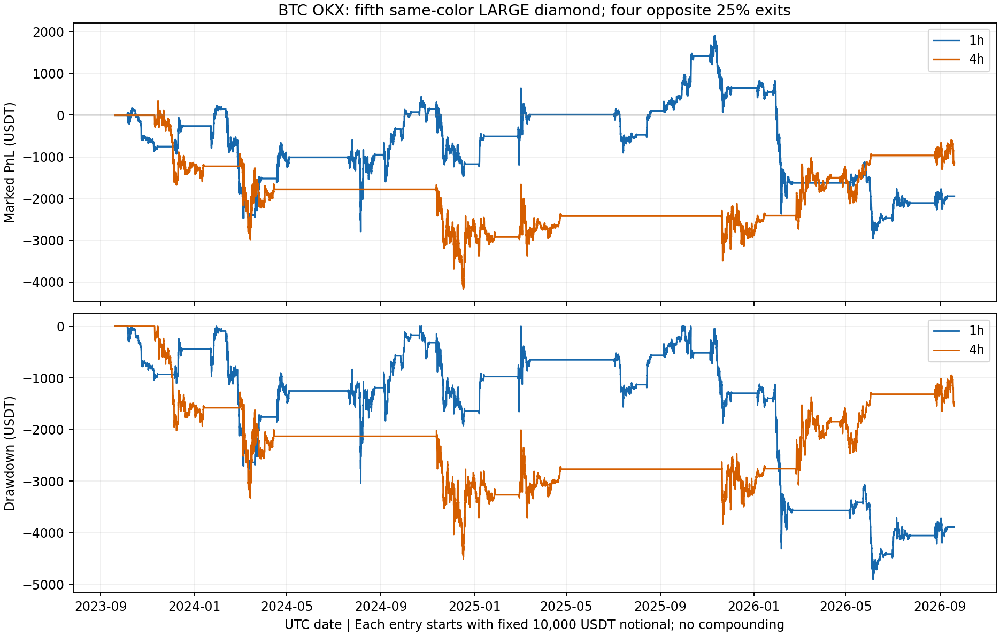

# BTC RSI：第5个同色大菱形入场，反向大菱形分四次退出

结论：**当前规则在1h、4h两个周期全期均未盈利**。1h 28笔全部闭合，18盈10亏，胜率64.29%，净价格收益平均每笔−0.6937%；4h开仓8笔，7笔已平（4盈3亏），另1笔剩75%原仓位，计入末端估值后平均每笔−1.4163%。两组相对匹配随机入场均有正超额，但绝对价格损益仍为负，不能以相对少亏认定为可盈利策略。4h多头仅3笔、全部盈利，只能保留为小样本观察。

- 实验：`exp-btc-rsi-fifth-color-20260920-v1`；Owner原始观察及两次澄清均为2026-09-20，Asia/Shanghai。
- 固定评价窗：2023-09-19 21:00Z至2026-09-19 21:00Z，末端不成交。北京时间2023-09-20 05:00至2026-09-20 05:00。
- 时间切点：2025-09-19 21:00Z；没有随机切分、参数选择或盲测声明。
- 规则/源构建先提交4ef932004a，交易及统计构建提交`2b3b5b1f1c5aca0252988b6897fc2f1ba36c6213`后才运行。主结果`results/run_v1/`。
- **所有收益比例以每笔最初入场名义金额为分母。合计是等额逐笔收益相加，单位为百分点，不是账户复利回报。** 无初始止损，因此R和止损距离仓位法不适用。

## 1. 最终规则

1. 使用Owner提供的ChartPrime Parabolic RSI：close RSI14，SAR .02/.02/.2；多头大菱形为SAR翻多且SAR≤30，空头为SAR翻空且SAR≥70。比较SAR，不比较RSI本身。
2. **仅数大菱形。** 从大菱形事件序列看连续同色，圆点、小菱形和普通SAR翻转均忽略。不同色大菱形将连续数重置为1。
3. 恰好第5个同色大菱形确认后，下一根同周期K线开盘，按其颜色做多或做空。第6个以后不另开；单仓不加仓，占仓时跳过候选、不排队。
4. 持仓后，每一个与仓位方向相反的大菱形，下一根开盘**平初始数量的25%**；四次清仓。这四次不要求连续；期间同向大菱形不恢复仓位、不重置减仓次数。
5. Owner明确“不止损”；没有固定止盈、保本、超时退出或利润过滤。反向减仓即使亏损也执行。仓位清空前不反手。评价起点空仓，历史指标及大菱形计数用此前数据预热。
6. 每笔原名义归一为1，初始数量1/入场价。固定往返成本0.2%：入场0.1%，每次减仓按原份额收0.1%×0.25，完整四次共0.1%。末端剩余仓位按最后5m收盘估值，并单列未实际发生的假设平仓费。
7. 1h和4h独立运行。信号时点是完整K线收盘；相同时间戳的下一根开盘成交。完整4h柱即使跨越评价起点，也可在其之后收盘时使用；不存在提前读未收盘柱。

首个1h空单的五个同色大菱形依次在2023-09-27 15Z、09-29 03Z、10-01 15Z、10-02 15Z、10-05 16Z；第5个时27550.6入空。这不是连续五根小时K线。首个4h入场的五个同色大菱形跨2023-10-17至11-10。

## 2. 数据与核验

- OKX BTC-USDT-SWAP，同上轮原始源，不替换交易所。新增90天预热后341568根连续5m；全部324288根原源数据逐值相同。评价期315648根5m。
- 90天前缀只缺2023-06-22 22:15Z一根，从[OKX官方历史K线API](https://app.okx.com/docs-v5/en/#rest-api-market-data-get-candlesticks-history)取得已确认原生行并冻结原响应；0插值、0剩余缺口、0重复、OHLC几何有效。
- 新源SHA256：`776251a5118648192c58118e52b3c84ad6ba104db8f070a24b2b290d13fa284b`。原源SHA仍为`076e9d1c74b9912a8d3421216fa6a10c3b19544fbdf93e90050dc92d2bf560ae`。
- 完整聚合：28464根1h、7115根4h（含预热）。可成交评价时钟内26304个1h收盘标签、6576个4h标签。4h按UTC00/04/08/12/16/20对齐，只聚合48根完整5m。
- 独立代理抽查跨2023–2026的8根OKX原生4H，OHLCV全部逐值一致；主代理用新90天源重新聚合并核对这8行。原生响应本轮未另存，仅保留抽样值/请求参数/核对收据；不是全历史原生逐根认证。
- 30/90天预热比较：1h RSI/SAR差0；4h最大RSI差3.25855e−5、SAR差8.31643e−5。两周期状态、大菱形、第5个候选及连续计数均0差异。
- 1h评价期564个大菱形，33次第5个同色候选，其中5次因已有持仓跳过、28次入场；4h149个大菱形，8次第5个候选全部入场。

## 3. 主结果及随机对照

胜率仅统计完整清仓的生命周期，减仓成交不另算一笔。总净收益和均值则覆盖全部入场，末端未平仓按同一边界估值。

| 周期 | 入场/已平/未平 | 已平净胜率 | 毛合计（百分点） | 净合计（百分点） | 每入场净收益 | 匹配随机每入场净收益 | 一侧置换p |
|---|---:|---:|---:|---:|---:|---:|---:|
| 1h | 28 / 28 / 0 | 64.29% | -13.82 | -19.42 | -0.69% | -2.67% | 0.009500 |
| 4h | 8 / 7 / 1 | 57.14% | -9.73 | -11.33 | -1.42% | -9.24% | 0.003906 |

1h已平利润因子0.7922；4h已平利润因子0.6692。1h正收益合计+74.05个百分点，负收益−93.47个百分点。4h计入末端估值后正收益合计+19.50，负收益−30.83个百分点。**毛价格收益已经为负，成本进一步减少收益。**

每笔都以10000 USDT初始名义入场、其余规则相同时，1h总净损益约−1942.33 USDT，4h含未平仓估值约−1133.01 USDT；这只是账本线性换算，没有设定账户本金、保证金、杠杆或复利。

匹配超额的月块95%区间：1h +0.3742%至+3.5951%每笔；4h +4.5638%至+12.0848%每笔。两项主要周期检验的Holm校正p分别0.009500、0.0078125，仍是“给定退出机制的相对入场时点优势”，绝对盈利条件未通过。

自身平均净收益95%月块区间：1h[−3.9937%,+2.2032%]，4h[−6.5095%,+3.5632%]。样本少、区间宽；特别是4h只有8个入场月份，精确符号检验最小p即1/256，不能把800个随机控制当800笔独立真实交易。

## 4. 多空拆分

| 周期方向 | 入场/已平 | 已平净胜率 | 净合计（百分点，含末端） | 每入场净收益 | 匹配随机均值 | 一侧置换p |
|---|---:|---:|---:|---:|---:|---:|
| 1h 多 | 12 / 12 | 66.67% | +1.10 | +0.09% | -1.18% | 0.128906 |
| 1h 空 | 16 / 16 | 62.50% | -20.53 | -1.28% | -3.79% | 0.011688 |
| 4h 多 | 3 / 3 | 100.00% | +14.17 | +4.72% | -1.16% | 0.125000 |
| 4h 空 | 5 / 4 | 25.00% | -25.50 | -5.10% | -14.08% | 0.031250 |

1h多头12笔总体仅+1.10个百分点，空头16笔−20.53；4h多头3笔+14.17，空头5笔含未平估值−25.50。空头贡献了主要亏损。4h多头3笔100%胜率不能充当策略确认，也没有据此补跑或推荐“只做多”版本。

## 5. 时间分段与跨切点持仓

| 入场分段及估值边界 | 入场 | 当时已平/未平 | 净合计（百分点） | 每入场净收益 | 匹配随机均值 | 一侧置换p |
|---|---:|---:|---:|---:|---:|---:|
| 1h 前两年入场，切点估值 | 18 | 17 / 1 | +3.24 | +0.18% | -2.97% | 0.000778 |
| 1h 最后一年新入场，末端估值 | 10 | 10 / 0 | -23.97 | -2.40% | -2.24% | 0.531250 |
| 4h 前两年入场，切点估值 | 4 | 4 / 0 | -24.16 | -6.04% | -16.02% | 0.062500 |
| 4h 最后一年新入场，末端估值 | 4 | 3 / 1 | +12.83 | +3.21% | -2.45% | 0.062500 |

前两年1h有1笔跨切点持仓；在切点真实估值，未借用后来清仓收益。该持仓切点后的贡献+1.3028个百分点，所以最后一年日历持仓损益为−22.6631个百分点，而“最后一年新入场”合计−23.9659。4h切点没有持仓，前两年−24.1572，最后一年+12.8271个百分点。4h后段含3笔清仓盈利和1笔未平亏损，不能只报3笔100%胜率。

完整自然年/月入场分组及其匹配随机对照在`1h_grouped.csv`、`4h_grouped.csv`。这些分组使用各入场生命周期的完整末端结果，不是逐月账户收益；日历损益应由标记曲线差额读取。

## 6. 不止损下的持仓代价

- 1h持仓中位14.15天，最长39.54天；4h中位50.25天，最长76.67天。
- 1h单笔原始价格最不利变化−55.06%（空头遇到上涨），4h−34.37%。这些是相对于原入场价的反向变动，尚未按减仓缩小敞口。
- **按实际剩余数量并计已减仓损益后，单笔盘中最差净损益为1h−31.84%、4h−24.49%原始名义。** 最终减仓在开盘完成后，该根后续高低点不计入已退出仓位风险。
- 等额标记PnL曲线最大回撤：1h49.2851个百分点、4h45.6059个百分点。它们是每笔相同初始名义下累加PnL的下降，不是账户净值百分比；曲线用5m收盘，不能保证捕获盘中最大组合回撤。
- 1h最差闭合单是2024-02-11 02Z的空头，净−25.4552%，持有32.83天；另一笔2026-01-26 02Z的多头在过程最差时达到−31.8421%，最终−21.7368%。高胜率仍被少数大亏损抵消。



## 7. 末端未平仓及对照方法

4h末端唯一未平仓：2026-08-25 12Z以79095.7开空，2026-09-11 16Z于77687.8平原仓25%；仍持75%。末端2026-09-19 21Z以81135估值，整笔净−1.6887%原名义（含已经兑现的那25%及剩余假设平仓费），不计已平胜率。1h末端无持仓。

每个真实入场先固定抽100个同BTC/同方向/同日历月/同早晚阶段/同因果波动桶时点，候选为对应周期可成交开盘。波动用前一已收盘5m的TR14均值/close14均值，其五分桶阈值来自严格更早30天。当前价格后续路径不参与抽样；真实时点自身从其控制池排除，池不足100时有放回抽样。

100是抽样行数，不保证100个不同时间：1h有两笔的唯一控制时间数为60/42，4h各笔为20–50。重复抽样不增加独立证据量；统计以28/8个实际持仓及23/8个月块为单位，不把3600行当3600个独立样本。当前p和区间未另传播随机控制均值的抽样不确定性。

控制也等待其入场之后严格更晚的4个反向强菱形，各平25%原仓位，并使用相同成本和边界估值。向量标签与所有实际入场、两周期各3个随机抽样参考事件循环逐值对账。3600个全期控制中100个4h末端未闭合，原样保留；早段1800个1h控制中143个在切点未闭合，同样标记而不按未来结果重抽。

不确定性使用10000次按入场月成块bootstrap；≤16个入场月用精确月配对差符号翻转，否则20000次，seed20260920。控制可互相重叠，不是可执行单仓随机组合；长期持仓可能跨月关联，少量月份下区间和p只作探索性证据，不等于前向验证。

## 8. 与上一版及必报指标适用性

| 版本 | 已平数量/纳入均值数量 | 净胜率（已平） | 平均净价格收益 | 该版本匹配随机价格均值 |
|---|---:|---:|---:|---:|
| 上轮1h大菱形＋5m六线、固定3R | 356/356 | 25.56% | -0.1806% | -0.3361% |
| 本轮1h第5大菱形、无止损四次减仓 | 28/28 | 64.29% | −0.6937% | −2.6720% |
| 本轮4h第5大菱形、无止损四次减仓 | 7/8 | 57.14% | −1.4163% | −9.2356% |

Owner明确换了整套入场与退出规则；样本/持仓/障碍均不同，这张表只是历史语境，不能把胜率上升归因于某一个变量。上一版R与本轮无止损结果不可直接比较；本表统一使用入场名义价格收益，但各自随机对照执行各自退出规则。

没有训练、概率预测或排序：val AUC、top-decile毛/净收益不适用；禁止按事后收益选前10%。本策略本身是单指标大菱形计数规则，单特征零假设基线是同条件随机入场，未再偷偷改第5个为第1个或搜索阈值。最后一年历史复核为1h10笔新入场、4h4笔新入场（3闭合1未平），正类率/胜率必须按以上完整生命周期口径解释。

## 9. 风险与诚实声明

- **资金费未纳入。** 本地BTC资金费只有278行、约2026-04至07，未覆盖三年；没有把缺失段填成零或拿局部费用冒充全期。无止损导致持仓数周，资金费缺失可能明显影响实盘损益。
- 未建模真实账户保证金、杠杆、标记价格清算或破产约束；模拟能一直持有，不代表杠杆账户能承受对应浮亏。固定20bp是研究约定，不保证实际成交成本。
- 源码端口、时钟和账本已核对，仍没有原生TradingView完整逐信号导出认证。原生4h只抽8个时点；预热对照验证本次信号不变，不等于任何参数或数据源都等价。
- 全部历史已获授权，但这些是已可见历史研究结果。两周期样本都小，4h尤其小；不把3笔全赢、较高胜率或相对随机显著写成可生产策略。
- production_eligible=false、training_eligible=false；没有Pine新发布、模型训练、监控或真金操作。

## 10. 复现与交付

现有项目venv，无依赖变更。源文件为不可覆盖快照，已存在时跳过acquire；输出目录必须选不存在的新路径。

```bash
cd /Users/zhangzc/fable-trading
# Fresh checkout: fetch the parent source only when its frozen file is absent.
test -f experiments/active/exp-btc-rsi1h-sixma5m-20260920-v1/data/okx_btc_usdt_swap_5m.csv.gz || .venv/bin/python -m yoyo.data.btc_rsi_research_source
.venv/bin/python -m yoyo.data.btc_rsi_fifth_source
.venv/bin/python -m pytest tests/evaluation/test_btc_rsi_diamond_scaleout.py tests/evaluation/test_btc_rsi_diamond_study.py tests/evaluation/test_btc_rsi_fifth.py tests/evaluation/test_parabolic_rsi_sar.py tests/boundaries/test_layer_imports.py -q
.venv/bin/python -m yoyo.evaluation.btc_rsi_diamond_study --output experiments/active/exp-btc-rsi-fifth-color-20260920-v1/results/run_v1
.venv/bin/python -m yoyo.evaluation.btc_rsi_diamond_delivery
```

上述是空输出目录的从零流程。若run_v1已存在，只将study输出改成`results/reproduce_new`，不得覆盖旧结果，之后按ID比较逐笔账本；delivery默认读取canonical run_v1。源builder优先只读已存OKX prefix archive；档案缺失时按300根一页从同一个官方OKX接口补取，绝不换交易所。源文件已存在且SHA匹配时直接复用。若交易所重下载不能重现指定SHA，须恢复冻结源，不可绕过校验声称精确复现。此次实际评分使用的仍是4ef932004a冻结源，后加的缺档分页恢复能力没有改变数据或重跑结果，该整段缺档下载未另作完整网络重跑。图表和中文CSV是canonical账本的展示。源码、源SHA、输出SHA在manifest；未把大型市场数据、3600行控制和稠密曲线强行加入git。

信号/原SAR/层间检查88项，新增向量标签与分批标记会计6项，共94项通过。Terra实现引擎并独立读审root统计；Luna核对指标、原生4h和后续结果账本。工具角色配置为Terra High/Luna Max，但会话未暴露独立运行时型号回执，不宣称额外验证了实际推理档。

下一步：保留“入场相对随机可能更好、退出尾部风险过大”为待验证解释。本轮不改参数。若Owner要继续，应单独指定退出/风险规则或方向限制；任何实盘准入仍需单独批准。
