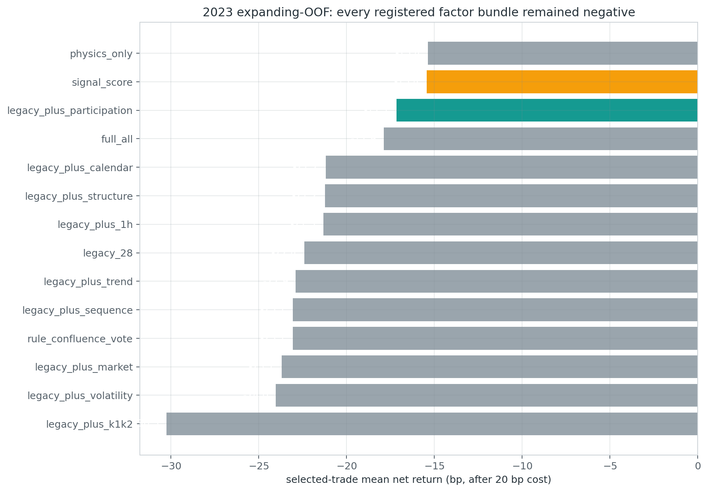
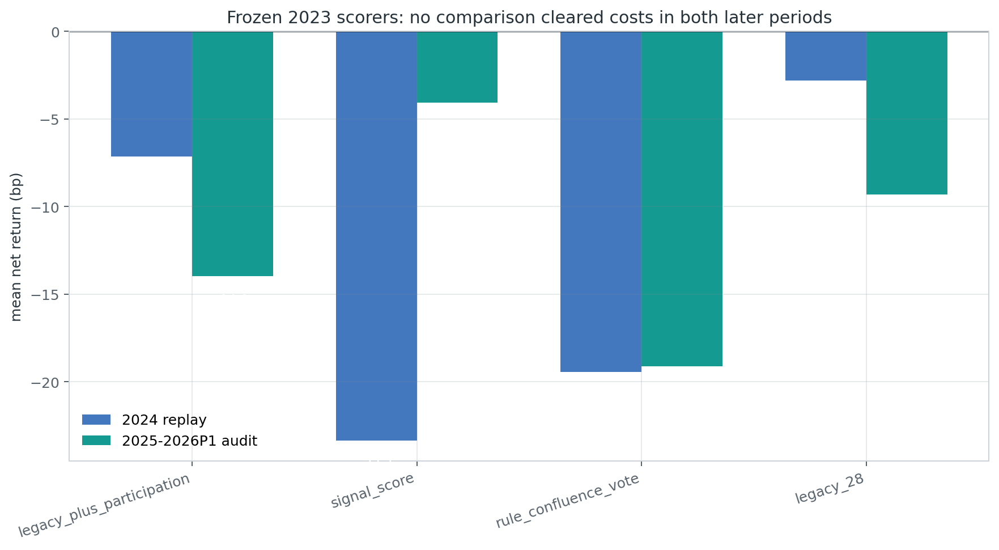
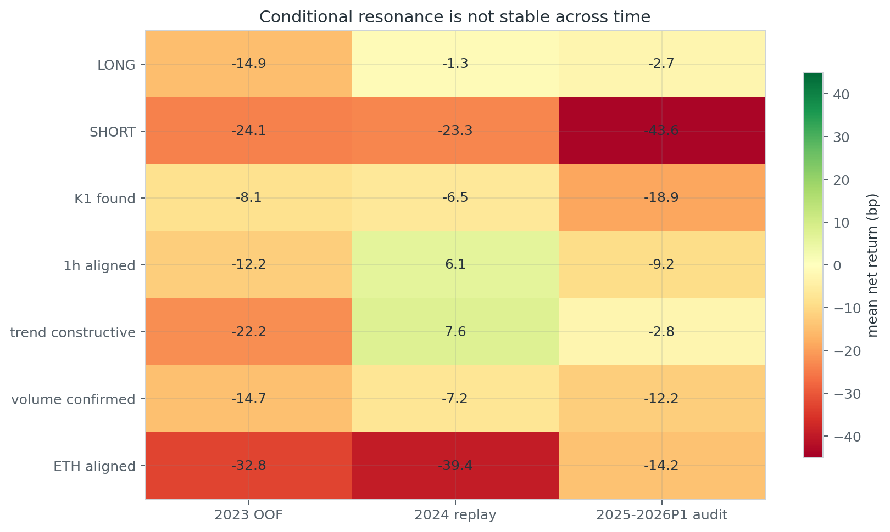
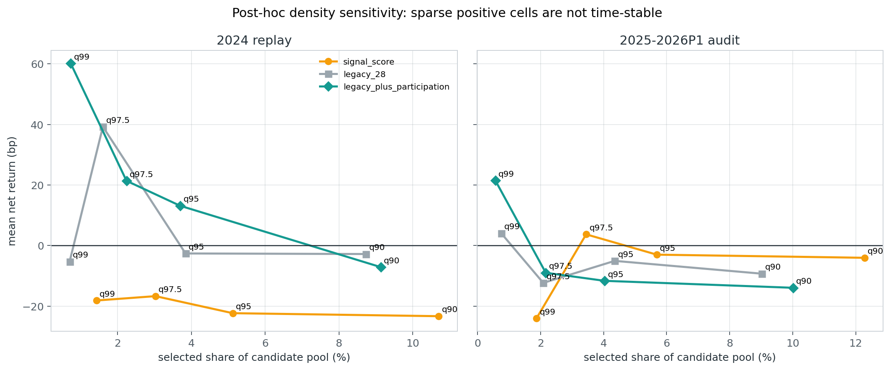
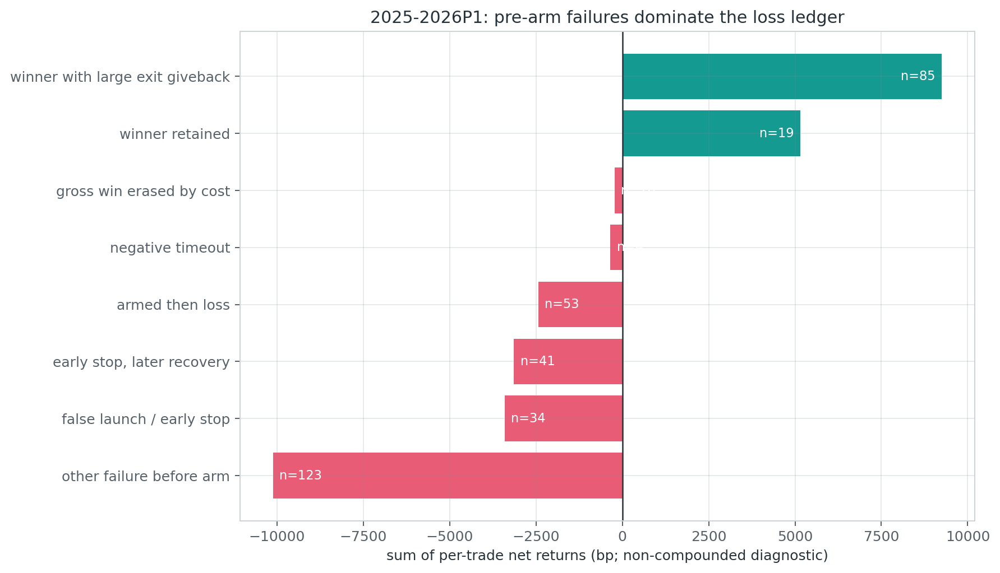

# P1：BTCUSDT.P 15m 多因子共振与特征工程审计（2026-09-04）

## 结论

这轮已经把能从当前因果数据中落地的共振维度系统跑过一遍：K1→K2 关系、趋势年龄、完整 1h
状态、波动、量价参与、结构动量、ETH 市场共振、32 根序列形态、时段，共得到 **103 个模型输入特征 +
1 个规则共振票数**，组成 14 个预注册候选。入场事件、成本和 SMA60 趋势退出全部固定，只比较特征包。

结果不是“还差一个指标”，而是：**当前高召回候选池没有稳定可被排序的净优势，多加因子也救不活。**

| 阶段 | 池事件 | 入选 | 净均值 | PF | 胜率 | 净正类 AUC | score p | 匹配随机超额 / p |
|---|---:|---:|---:|---:|---:|---:|---:|---:|
| 2023 expanding OOF | 2,695 OOF | 206 | **-17.15bp** | 0.654 | 16.99% | 0.469 | FWER 0.799 | 不适用，开发选择层 |
| 2024 exact replay | 3,437 | 314 | **-7.14bp** | 0.881 | 26.11% | 0.532 | 0.0427 | +3.70bp / 0.3592 |
| 2025–2026P1 audit | 3,746 | 375 | **-13.96bp** | 0.733 | 27.73% | 0.508 | 0.4002 | +0.81bp / 0.4627 |

2024 的 9 个验收门只过了“至少 200 笔”和“优于原始 signal score”两项；净收益、PF、`p<0.01`、
两半年为正、击败旧 28 特征、击败全部 8 份匹配随机对照均未通过。2025H1、2025H2、2026H1 三段又
全部为负。因此本轮结论是 **reject**：不加入 TradingView，不改当前 Pine，不 promote 到 ACTIVE、
forward 或实盘。



## 固定的交易合同

本轮没有同时调整入场、模型和退出，以免把改善来源混在一起。固定口径是：

1. 候选池沿用 `EMA30(HL2)` 的 15m 高召回 `direct / rejection / coil`，同方向 raw 状态需先连续
   3 根失效才重新发事件；这是研究候选，不等于严格 Owner K1→K2。
2. 信号 bar 收盘确认，下一根开盘成交。
3. 初始灾难止损为 `2×信号 ATR14`。
4. 完成 K 线收盘利润首次达到 `+2ATR` 后，下一根开始启用趋势保护。
5. 多头跟踪 `SMA60(HL2)-1ATR14`，空头跟踪 `SMA60(HL2)+1ATR14`，只朝盈利方向收紧。
6. 最长持有 96 根 15m；同 bar 按 active-stop-first；每笔固定扣 0.2% 往返成本。

所以这轮只回答一个问题：**在相同候选和相同均线 runner 下，共振与特征工程能否挑出更好的入场。**
完整 Pine 形态阈值与退出规则见
[`p1_btcusdtp_15m_trend_refactor_20260904.md`](p1_btcusdtp_15m_trend_refactor_20260904.md)。

## 测试了哪些共振

全部特征只读取完成的信号 bar `t` 及之前；1h 只使用四根 15m 都已经完成的整小时，禁止部分小时。

| 组 | 数量 | 主要内容 |
|---|---:|---|
| legacy | 28 | 方向、形态分数、实体/突破、ATR、ADX/DI、效率、EMA/SMA spread、风险成本 |
| K1→K2 | 15 | K1 是否找到、2–24 根距离、K1 实体/量、路径位移与回撤、错误侧比例、K2 触线/实体/影线 |
| 趋势年龄 | 10 | EMA30 正确侧年龄、EMA30/SMA60 对齐年龄、斜率、加速度、均线排序、发散程度 |
| 完整 1h | 8 | 1h 收盘离线、均线 spread/斜率、6h 动量、RSI、ADX、均线对齐 |
| 波动状态 | 7 | ATR 分位与变化、实现波动率、布林带宽/释放、range 分位 |
| 量价参与 | 6 | 96 根量比、4 根量脉冲、12/48 根方向量、OBV 斜率、价量相关 |
| 结构动量 | 8 | RSI、MACD、Donchian 位置、收盘位置、回撤、突破、加速度、连续色 |
| ETH 共振 | 9 | ETH 多尺度方向收益、均线状态、RSI/ADX、BTC/ETH 相关与相对强弱 |
| 序列形态 | 9 | 32 根自相关、方向熵/切换、偏度/峰度、路径效率、区间位置 |
| 时段 | 3 | UTC 小时正余弦、周末 |

候选包括单独添加每一组、全部物理特征、全量特征、原始单分数和 7 项人工共振票数。LightGBM 使用固定
Huber 回归、160 棵树、`num_leaves=7`、`max_depth=3`；没有在结果上调模型超参数。未来修改数据不会改变
过去特征的 mutation audit 为 **1,692 事件 × 104 列，最大差 0，缺失模式差 0**。

## 实验设计与数据质量

| 角色 | 时间（UTC） | 事件数 | 池净正率 | 池净均值 |
|---|---|---:|---:|---:|
| 开发 | 2023-01-01 至 2024-01-01（右开） | 3,533 | 17.72% | -18.63bp |
| expanding OOF 测试 | 2023Q2 / Q3 / Q4 | 854 / 930 / 911 | — | — |
| exact replay | 2024-01-01 至 2025-01-01（右开） | 3,437 | 21.12% | -20.58bp |
| 已看过 lineage 审计 | 2025-01-01 至 2026-02-28 16:00（右开） | 3,746 | 22.82% | -15.44bp |

- BTC：OKX `BTC-USDT-SWAP` 5m 完整 UTC `3×5m` 聚合为 15m；源 SHA256
  `767f67c2b0ae5a8c83369a7cb950334e61de09edbb82a0158122c41794eed5ac`。
- ETH：Binance `ETHUSDT` 永续 15m，只作跨市场状态代理，不参与 BTC 成交价格。
- OOF 为时间扩展训练，切点前清除 96 根标签 horizon；没有随机切分。
- 2023 训练分数的 q90 绝对阈值冻结后原样应用到后续年份；没有按后期分布重新取 top 10%。
- 仓库 holdout 从 `2026-05-04` 开始；本轮最晚入场 `2026-02-27 08:00 UTC`，读取/评分 holdout
  行数为 **0**。

这份 lineage 的 2024 与 2025–2026P1 结果在父实验中已经看过，因此 2024 是“精确协议重放”，不是
全新未见确认；2025–2026P1 只允许解释运输失败。实验价值来自冻结协议、时间切分和负结果的诚实记录，
不来自伪装成新 holdout。

## 14 个候选：开发期没有一根正折

| 候选 | 特征数 | 入选 | 净均值 | PF | AUC | 正折 | 最差折 | FWER p |
|---|---:|---:|---:|---:|---:|---:|---:|---:|
| participation + legacy（规则提名） | 34 | 206 | -17.15 | 0.654 | 0.469 | 0/3 | -21.19 | 0.799 |
| full all | 103 | 255 | -17.89 | 0.639 | 0.475 | 0/3 | -22.54 | 0.839 |
| signal score | 1 | 277 | -15.43 | 0.669 | 0.494 | 0/3 | -23.28 | 0.643 |
| calendar + legacy | 31 | 222 | -21.19 | 0.592 | 0.487 | 0/3 | -25.20 | 0.970 |
| structure + legacy | 36 | 216 | -21.24 | 0.594 | 0.485 | 0/3 | -25.24 | 0.973 |
| volatility + legacy | 35 | 215 | -24.03 | 0.552 | 0.490 | 0/3 | -25.64 | 0.996 |
| legacy 28 | 28 | 220 | -22.41 | 0.577 | 0.480 | 0/3 | -26.46 | 0.987 |
| complete 1h + legacy | 36 | 222 | -21.33 | 0.580 | 0.488 | 0/3 | -27.65 | 0.968 |
| trend maturity + legacy | 38 | 217 | -22.90 | 0.563 | 0.484 | 0/3 | -28.42 | 0.987 |
| physics only | 72 | 254 | -15.37 | 0.693 | 0.473 | 0/3 | -29.90 | 0.697 |
| sequence + legacy | 37 | 244 | -23.05 | 0.535 | 0.498 | 0/3 | -30.44 | 0.984 |
| rule confluence vote | 1 | 459 | -23.06 | 0.517 | 0.501 | 0/3 | -33.04 | 0.984 |
| K1→K2 + legacy | 43 | 238 | **-30.25** | 0.431 | 0.479 | 0/3 | -35.51 | 1.000 |
| ETH market + legacy | 37 | 240 | -23.70 | 0.559 | 0.474 | 0/3 | -44.20 | 0.996 |

`participation + legacy` 只是按预先登记的“正折数→最差折→中位折→均值”规则被迫提名的**最不坏候选**，
不是有优势的候选。它三个 OOF 折依次为 -21.19、-17.88、-13.11bp；看见负号后不能把 nomination
改写成“最优参数”。

## 冻结重放：多因子没有击败旧模型

| 阶段 / scorer | 入选 | 毛均值 | 净均值 | PF | 胜率 | AUC | eval top-decile 净均值 |
|---|---:|---:|---:|---:|---:|---:|---:|
| 2024 / participation + legacy | 314 | +12.86 | **-7.14** | 0.881 | 26.11% | 0.532 | -6.56 |
| 2024 / legacy 28 | 300 | +17.19 | **-2.81** | 0.951 | 26.00% | 0.534 | -5.38 |
| 2024 / signal score | 368 | -3.34 | -23.34 | 0.631 | 21.47% | 0.495 | -23.43 |
| 2024 / rule vote | 566 | +0.58 | -19.42 | 0.689 | 21.20% | 0.515 | -19.42 |
| 2025–2026P1 / participation + legacy | 375 | +6.04 | **-13.96** | 0.733 | 27.73% | 0.508 | -13.96 |
| 2025–2026P1 / legacy 28 | 338 | +10.69 | **-9.31** | 0.820 | 27.51% | 0.509 | -8.43 |
| 2025–2026P1 / signal score | 460 | +15.95 | **-4.05** | 0.919 | 26.09% | 0.501 | -5.94 |
| 2025–2026P1 / rule vote | 590 | +0.88 | -19.12 | 0.642 | 22.88% | 0.514 | -19.12 |



2024 的模型排序单侧置换 `p=0.0427`，仍未达到预注册 `p<0.01`；审计期退化到 `p=0.4002`。
匹配随机对照按同月份 × 同 UTC 六小时段 × 月内 ATR 五分位 × 同方向，避开候选前后 97 根：2024
超额 +3.70bp、`p=0.3592`；审计期 +0.81bp、`p=0.4627`，而且两期都未击败 8 份控制分配。
所以这里没有“虽然绝对亏，但相对随机有显著 alpha”的隐藏解释。

## 共振为什么看起来一会儿有效、一会儿失效

下表只在已被模型选中的交易内做固定条件切片，属于原因诊断，不是再次选参数。

| 条件 | 2023 OOF | 2024 replay | 2025–2026P1 | 判断 |
|---|---:|---:|---:|---|
| LONG | -14.92 | -1.34 | -2.73 | 三期仍负；多头比空头好，但 long-only 也没过成本 |
| SHORT | -24.09 | -23.27 | **-43.61** | 最稳定的坏方向，应在下一份独立合同中单独研究 |
| 找到 K1 | -8.14 | -6.50 | -18.88 | 宽松的 2–24 根搜索不等于真实 K1→K2 episode |
| 完整 1h 同向 | -12.16 | +6.07 | -9.15 | 2024 的正值没有运输 |
| 趋势结构 constructive | -22.23 | +7.62 | -2.79 | 同样只在中间一年变正 |
| 量能确认 | -14.68 | -7.19 | -12.21 | 没有跨期净正优势 |
| ETH 同向 | **-32.77** | **-39.43** | -14.18 | 不是有效共振，甚至在前两期明显更差 |



按 gain 排名，提名模型最依赖 SMA60–SMA160 spread（6.54%）、ATR96 相对状态（5.41%）、
SMA60–SMA120（4.56%）、SMA120–SMA240（4.50%）、ATR%（4.38%）、fee-to-risk（3.43%）和
48 根方向量（3.41%）；原始形态分数只占 0.71%。模型主要学到“行情状态”，但这些状态与“刚启动且能
覆盖 20bp 成本”不是同一件事。更复杂的物理特征也没有解决标签异质性。

按预注册合同，只有 2024 净均值为正且 score `p<0.01` 才运行 SHAP。本候选两门都失败，因此本轮
**没有运行 SHAP**；对一个已失败模型生成精美解释不会增加证据。

## 信号密度：提高阈值只制造稀疏的事后亮点

q90 是唯一预注册密度。q95、q97.5、q99 都用 2023 全训练分数生成绝对阈值，再原样应用于后期，
但它们是在看过 q90 失败后做的敏感性分析，不能升级为确认。

| 提名模型阈值 | 2024 笔数 / 净均值 | 2025–2026P1 笔数 / 净均值 |
|---|---:|---:|
| q90（预注册） | 314 / -7.14bp | 375 / -13.96bp |
| q95（事后） | 127 / +13.13bp | 151 / -11.66bp |
| q97.5（事后） | 77 / +21.37bp | 81 / -9.01bp |
| q99（事后） | 25 / +60.16bp | 21 / +21.50bp |



q99 汇总看似两期都正，但拆开后为：2024H1 12 笔 +126.62bp、2024H2 13 笔 -1.18bp、2025H1
9 笔 +39.64bp、2025H2 8 笔 +35.53bp、2026H1 4 笔 **-47.39bp**。总共只有 46 笔，收益被少数
右尾驱动，且已经发生符号反转。其他 scorer 也一样：signal score q97.5 在审计期 +3.69bp，但 2024
-16.72bp；legacy q97.5 在 2024 +39.23bp，但审计期 -12.35bp。因此不能称 q99 为“现在最优参数”，
也不能保存到 TradingView；它最多是一条未来前向假设，而且会重新制造用户之前不满意的信号稀少。

## 失败原因：54.7% 根本没进入趋势 runner

旧诊断曾用 `MFE>=2ATR` 反推 runner 已激活，这是错误的：影线盘中碰到 +2ATR，不代表完成 K 线收盘
达到 +2ATR。本报告改用真实 `runner_armed` 状态，并把“截至退出的回吐”和“退出后到完整 horizon 的
机会差”分开。

| 真实路径 | 笔数 | 单笔净均值 | 非复利贡献 |
|---|---:|---:|---:|
| 其他未激活失败 | 123 | -82.13bp | -10,103bp |
| 未激活早停，之后也未恢复到 +2ATR | 34 | -100.09bp | -3,403bp |
| 未激活早停，之后 horizon 曾恢复到 +2ATR | 41 | -76.48bp | -3,136bp |
| 已激活后最终亏损 | 53 | -45.92bp | -2,434bp |
| 到期仍负 | 4 | -85.54bp | -342bp |
| 毛利被 20bp 成本抹掉 | 16 | -13.36bp | -214bp |
| 已激活赢家、退出前回吐 <2ATR | 19 | +271.17bp | +5,152bp |
| 已激活赢家、退出前回吐 ≥2ATR | 85 | +108.75bp | +9,244bp |



直接按状态汇总：**205/375（54.7%）从未激活，均值 -83.06bp，合计 -17,027bp；170 笔激活仓均值
+69.37bp，合计 +11,792bp。** 104 笔已激活赢家贡献 +14,396bp。即使 85 笔赢家退出前平均回吐
4.80ATR，它们最终仍平均赚 +108.75bp；机械收紧 runner 很可能继续砍掉大趋势。

41 笔“早停后后来恢复”说明可以独立研究**新 episode 重入**或初始止损路径，但不能直接据此放宽止损：
“后来恢复”使用了未来 96 根，是标签诊断，不是入场时已知信息；另有 34 笔早停后根本没恢复，盲目放宽
会放大它们的损失。

## 当前判断：该改哪里

1. **保留退出，先改事件语义。** SMA60 runner 已经证明会保留右尾；优先级不是再加固定 TP、自动保本
   或更紧均线，而是把高召回 raw 状态改成真正的 episode 账本。
2. **多空必须拆开。** 空头三期持续更差；下一实验可只在开发期登记 long/short 两份合同，不能继续让一个
   模型用 `direction` 自己“学会”全部不对称。long-only 目前仍负，不能直接启用。
3. **把任务拆成两阶段。** 阶段 A 预测未来是否会以完成 bar 激活 +2ATR；阶段 B 只对已激活样本预测
   runner 捕获/回吐。当前直接回归混合净收益，让 54.7% 未启动与少数大右尾互相抵消。
4. **严格 K1→K2 episode。** K1 登记、2–8 根关系、期间错误侧收盘、K2 影线触线且实体留在正确侧、
   K1/K2 量价收缩/再启动应成为事件资格，不只是给宽松候选附 15 个数值后交给模型。
5. **把早停后恢复建成重入标签。** 必须等待旧 episode 失效、再出现新的因果 K1/K2；不能在同一状态里
   无限补仓，也不能用未来是否恢复作为当下特征。
6. **暂停外部 ETH 同向票。** 当前定义前两期明显拖累；以后若再测，应改为市场风险状态或相对强弱交互，
   而不是简单“ETH 与 BTC 同方向就加分”。
7. **q99 只进入未来候选清单。** 未经新的前向样本，不修改 q90、Pine、报警或默认显示。

这比继续加入 RSI、MACD、ADX、成交量等单项开关更重要：这些已经在本轮特征包中出现，失败原因是它们
没有跨时间保持相同经济含义，而不是代码忘了算。

## 风险与诚实声明

- 所有收益均为历史 OHLC 回放；15m bar 内路径未知，资金费率、冲击和额外滑点未逐笔建模，统一成本为 20bp。
- 2024 与 2025–2026P1 在父 lineage 已被查看，不是未见 holdout；q95/q97.5/q99 是明确标记的事后诊断。
- ETH 与 BTC 来自不同交易所，只能当状态代理；跨交易所时间和市场微结构差异仍在。
- 匹配随机对照控制月份、时段、ATR 桶和方向，但不能消除所有单币时间依赖；其 p 值也不能替代净收益为正。
- 特征重要性只描述失败模型如何分裂，不证明因果；因 2024 基本门失败，本轮按合同跳过 SHAP。
- 本轮没有读取 `>=2026-05-04` 的价格，没有修改 TradingView、ACTIVE/frozen、forward、新鲜度门、
  仓位、API key、部署或真实订单。

## 产物

- 实验：`experiments/active/exp-btcusdtp-15m-multifactor-confluence-preholdout-20260904-v1/`
- 选择/确认/审计 receipt：`results/selection_receipt.json`、`confirmation_receipt.json`、
  `audit_receipt.json`。
- 模型合同和重要性：`results/model_contract.json`、
  `results/feature_importance_legacy_plus_participation.csv`。
- 报告诊断：`analysis/output/btcusdtp_15m_multifactor_confluence_20260904/`，含密度曲线、跨期条件、
  q99 半年拆分、修正后的逐笔失败账本和全部图。

## 复现命令

```bash
cd /Users/zhangzc/fable-trading

# 各阶段必须在上一阶段的 config/script/receipt/model 已提交且 clean 后依次运行。
PYTHONPATH=. .venv/bin/python -m \
  scripts.research_btcusdtp_15m_multifactor_confluence --phase select
PYTHONPATH=. .venv/bin/python -m \
  scripts.research_btcusdtp_15m_multifactor_confluence --phase confirm
PYTHONPATH=. .venv/bin/python -m \
  scripts.research_btcusdtp_15m_multifactor_confluence --phase audit

PYTHONPATH=. .venv/bin/python \
  scripts/build_btcusdtp_15m_multifactor_confluence_report.py

PYTHONPATH=. .venv/bin/python -m pytest -q \
  tests/test_btcusdtp_15m_multifactor_confluence_report.py

python3 scripts/md_to_html.py \
  analysis/p1_btcusdtp_15m_multifactor_confluence_20260904.md \
  --out-dir analysis/html
```
