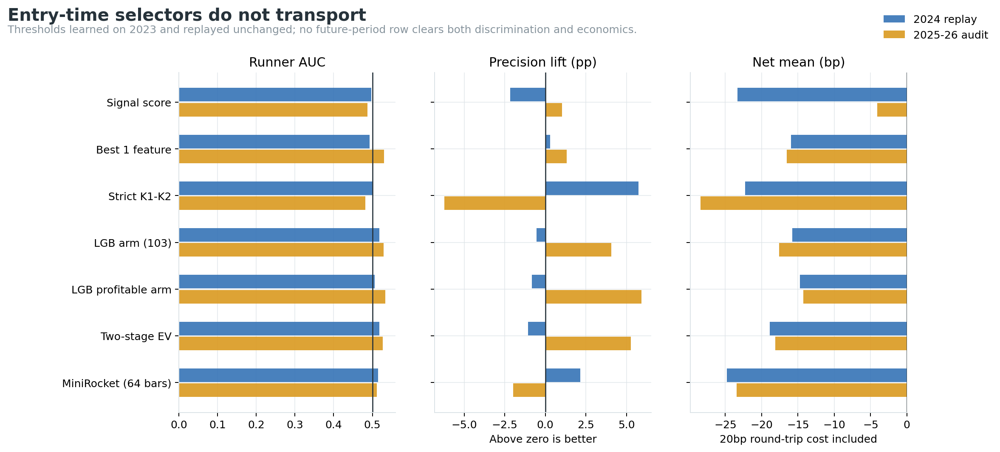
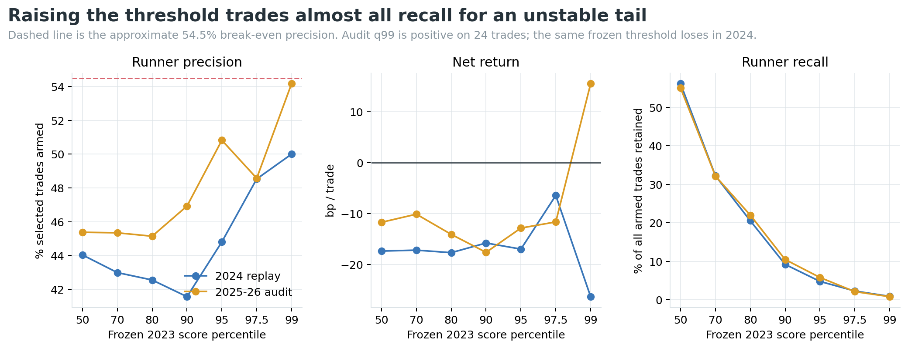
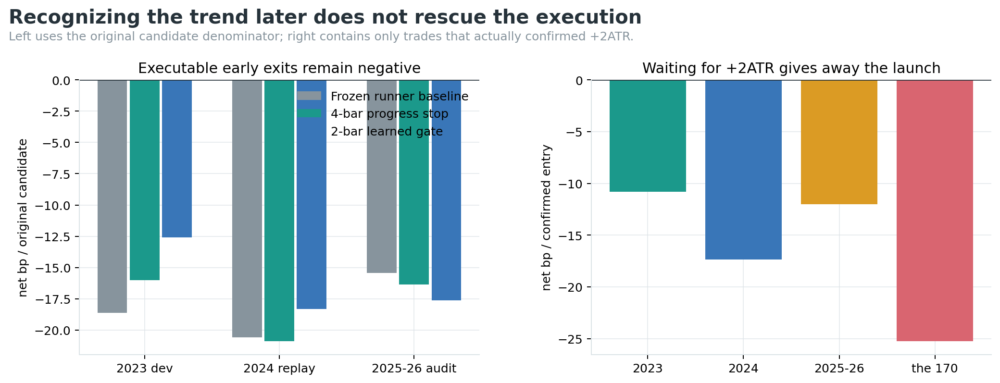
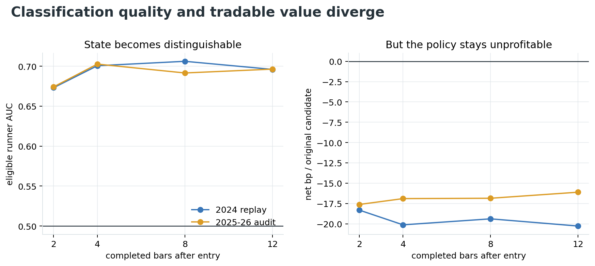

# P1：BTCUSDT.P 15m 趋势接管交易可识别性审计（2026-09-04）

## 结论

**目前不能在 K2 入场时稳定地“只抓住”那 170 笔趋势接管交易。** 170 笔平均净收益
`+69.37bp` 是按未来状态 `runner_armed` 分组后的结果，不是一条当时可见的信号。它证明当前
SMA60 runner 保存了右尾，但不证明这些右尾能够提前识别。

本轮用同一份 BTCUSDT.P 15m 候选账本，依次测试：原始分数、单特征、严格 K1→K2 几何、103 个
因果特征 LightGBM、两阶段期望收益、以“盈利且激活”为标签的模型、Aeon MiniRocket 64 根原始序列、
+2ATR 后追入、30 组进度止损，以及 2/4/8/12 根后的动态分类退出。没有一项同时通过跨期识别、净收益、
随机对照和稳定性门。

| 核心检查 | 2023 expanding OOF | 2024 冻结重放 | 2025–2026P1 诊断审计 |
|---|---:|---:|---:|
| LGB arm AUC | 0.512 | 0.518 | 0.529 |
| q90 激活精度 | 45.83% | 41.56% | 46.93% |
| q90 激活召回 | 9.61% | 9.19% | 10.46% |
| q90 毛 / 净均值 | +4.95 / **-15.05bp** | +4.23 / **-15.77bp** | +2.40 / **-17.60bp** |
| q90 PF / 胜率 | 0.650 / 19.91% | 0.717 / 22.19% | 0.650 / 24.58% |

2024 的 score permutation `p=0.2588`、周块 sign-flip `p=0.9717`；相对同月份 × 同 UTC 六小时段 ×
同 ATR 桶 × 同方向的匹配随机入场还**少 -6.10bp**，配对 `p=0.7593`。八个预注册门只过“笔数
不少于 120”一项。因此结论是 **reject**：不把任何新过滤条件写入 TradingView，不改 Pine 默认参数，
不进入 ACTIVE、forward 或实盘。



## 先纠正 +69.37bp 的含义

父实验的审计入选组有 375 笔：

| 事后状态 | 笔数 | 单笔净均值 | 非复利合计 |
|---|---:|---:|---:|
| 完成 K 线先达到 +2ATR、触发 runner | 170 | **+69.37bp** | +11,792bp |
| 未触发 runner | 205 | **-83.06bp** | -17,027bp |

这里的分组条件要查看入场后的 K 线，所以只能当标签。若假设两组的条件盈亏保持不变，要让入选组合刚好
不亏，`runner_armed` 精度至少需要：

`83.06 / (69.37 + 83.06) = 54.49%`。

这只是便于理解的近似门槛，不是新参数，因为模型改变样本后，两组内部的收益分布也会变化。它仍清楚说明：
精度从候选池的约 42% 提高两三个点没有经济意义，必须稳定超过约 55%，最好留出成本和漂移余量达到 60%
以上，同时还要保留足够召回。

## “把阈值拉高”为什么也不行

LGB arm 的阈值只从 2023 全训练分数计算一次，之后绝对值冻结。q95–q99 是诊断敏感性，不是重新确认。

| 阈值 | 2024 笔数 / 精度 / 召回 / 净均值 | 2025–2026P1 笔数 / 精度 / 召回 / 净均值 |
|---|---:|---:|
| q90 | 320 / 41.56% / 9.19% / -15.77bp | 358 / 46.93% / 10.46% / -17.60bp |
| q95 | 154 / 44.81% / 4.77% / -16.96bp | 183 / 50.82% / 5.79% / -12.83bp |
| q97.5 | 68 / 48.53% / 2.28% / -6.44bp | 70 / 48.57% / 2.12% / -11.63bp |
| q99 | 26 / 50.00% / **0.90%** / -26.29bp | 24 / 54.17% / **0.81%** / +15.49bp |

审计 q99 的正值只来自 24 笔，并且只找回全部激活交易的 0.81%；同一阈值在前一整年立刻变成
-26.29bp。不能把这条稀疏、跨期反号的尾部保存成“最优参数”。



## 入场时到底试了什么

所有特征只截止完成的 K2 / signal bar，未来只允许用于标签和收益：

- 103 个表格特征：K1→K2 关系、趋势年龄、完整 1h 状态、波动、量价参与、结构动量、ETH 共振、
  32 根序列统计和时段。
- 严格 K1→K2：找到 K1、间隔 2–8 根、中间无错误侧收盘、K2 影线真实触线、实体留在正确侧。
- Aeon MiniRocket：64 根完成的 15m K 线 × 6 通道；多空镜像；跨数据缺口只补零。
- 三个学习目标：是否激活、是否“激活且净盈利”、激活概率 × 条件收益的两阶段期望值。

2023 使用 expanding-time OOF，标签 horizon 前清除 96 根；完整 2023 拟合后，阈值冻结重放 2024 和
已看过的 2025–2026P1。没有随机切分。

| 入场选择器 | 2023 OOF：笔数 / AUC / 激活精度 / 净 bp | 2024：笔数 / AUC / 激活精度 / 净 bp | 审计：笔数 / AUC / 激活精度 / 净 bp |
|---|---:|---:|---:|
| 原始 signal score | 277 / 0.505 / 34.3% / -15.43 | 368 / 0.497 / 39.9% / -23.34 | 460 / 0.487 / 43.9% / -4.05 |
| 单特征模型 | 259 / 0.528 / 35.9% / -25.52 | 415 / 0.492 / 42.4% / -15.94 | 430 / 0.531 / 44.2% / -16.54 |
| 严格 K1→K2 gate | 189 / 0.498 / 32.8% / -33.22 | 209 / 0.501 / 47.8% / -22.28 | 221 / 0.482 / 36.7% / -28.40 |
| LGB 是否激活 103 | 216 / 0.512 / 45.8% / -15.05 | 320 / 0.518 / 41.6% / -15.77 | 358 / 0.529 / 46.9% / -17.60 |
| LGB 盈利激活 103 | 269 / 0.517 / 42.0% / -7.97 | 378 / 0.505 / 41.3% / -14.74 | 498 / 0.533 / 48.8% / -14.25 |
| 两阶段期望收益 | 228 / 0.505 / 43.9% / -13.66 | 273 / 0.518 / 41.0% / -18.89 | 349 / 0.526 / 48.1% / -18.13 |
| MiniRocket 64 bars | 131 / 0.523 / 45.0% / -25.63 | 375 / 0.515 / 44.3% / -24.77 | 401 / 0.511 / 40.9% / -23.46 |

没有一根选择器在 2023 的三个 OOF 折全部净正。MiniRocket 在完整 2023 拟合内 AUC=1.0，但到 2024
只有 0.515，这是典型记忆化，不是“深度时序终于看懂图形”。运行中数值库还发出 overflow 警告；输出
概率经过 finite 检查，但这进一步限制它只能作为失败诊断，不能作为模型资产。

### 单特征基线

按未来两段 AUC 的较小值排序，最稳定的单项是 `rv12_ratio96`：开发/2024/审计 AUC 分别为
0.511/0.524/0.533；各期 q90 净均值为 `+6.10/-18.35/-15.30bp`。第二名
`atr_change24` 在后两期 AUC 为 0.518/0.531，净均值仍为 `-5.05/-13.84bp`。所以波动扩张有一点
排序信息，但强度不足以覆盖成本，也不能单独做 Pine gate。

## 等 +2ATR 再追：标签变因果了，利润也没了

完成 K 线达到 +2ATR 后，最早只能下一根开盘成交。保持原 SMA60±1ATR trailing stop 和原 96 根总
horizon：

| 来源 | 确认后可入场 | 中位延迟 | 确认后净均值 | PF | 胜率 |
|---|---:|---:|---:|---:|---:|
| 2023 全池 | 1,370 | 11 bars | -10.79bp | 0.823 | 25.84% |
| 2024 全池 | 1,447 | 11 bars | -17.35bp | 0.761 | 27.51% |
| 2025–2026P1 全池 | 1,606 | 11 bars | -12.00bp | 0.798 | 27.96% |
| 原先那 170 笔 | 170 | 9 bars | **-25.26bp** | 0.612 | 31.18% |

也就是说，+69.37bp 的主要价值就在确认前的启动段。等“确定它是趋势”再市价追入，剩余尾部不足以覆盖
位置和 20bp 成本。

## 动态止损：更容易识别，但仍无法变现

### 固定进度止损

测试 4/8/12/16/24 根 deadline × 0/0.25/0.5/0.75/1/1.5ATR 最低进度，共 30 份合同。
开发期最好的 `4 bars + 至少 0.25ATR` 为 -16.01bp；冻结到 2024/审计变成 -20.90/-16.37bp，
相对原 runner 的 -20.58/-15.44bp 反而略差。没有一个组合跨期净正。

### 学习型动态退出

进场 2–12 根后，路径特征预测尚未激活交易最终能否激活的 AUC 确实明显提高：2024 与审计期约
0.67–0.71。但每个决策均按下一根开盘退出并计入成本后，60 个 checkpoint × 保留阈值 × 时期组合
仍全部净负。开发期最好的 2-bar/q50 在开发/2024/审计为 `-12.58/-18.31/-17.62bp`。





原因不是模型完全看不出路径，而是到 2–12 根时：失败仓已经支付入场成本并发生部分逆向移动；被保留组仍有
假阳性；提前退出还会误砍后来启动的右尾。分类指标不能替代一整套可成交 PnL。

## 随机对照与统计门

预注册提名 `lgb_arm_all103` q90 的控制结果：

| 阶段 | score permutation p | 周块 sign-flip p | 匹配事件 | 对匹配随机超额 | 配对 p | 是否击败 8 份随机分配 |
|---|---:|---:|---:|---:|---:|---:|
| 2024 | 0.2588 | 0.9717 | 320 | **-6.10bp** | 0.7593 | 否 |
| 审计 | 0.6211 | 0.9988 | 358 | **-1.37bp** | 0.5800 | 否 |

匹配随机对照使用相同月份、UTC 六小时时段、月内 ATR 五分位和方向，并避开候选前后 97 根。该模型
既没有显著排序，也没有相对于相同行情状态的超额。

## 当前能怎样“尽量只抓住这些”

现阶段最诚实的答案不是再加一个阈值，而是把系统拆成三层，并把每层单独验收：

1. **K2 只产生候选，不直接声称是趋势单。** 当前 OHLCV/指标在入场时的可识别性接近随机；若自动执行，
   q90 精度远低于约 54.5% 的盈亏平衡线。
2. **已经触发 +2ATR 的仓继续让 SMA60 runner 管理。** 170 笔的条件结果支持“激活后不要用固定小 TP
   砍掉尾部”；它不支持“等 +2ATR 再开新仓”。
3. **下一份新假设应测试“确认后的第一次可控回踩再加仓”，不是确认时追价。** 初始 K2 只保留小额探针，
   完成 bar 激活后等待对 EMA30/SMA60 或新结构位的因果回踩，下一根成交；必须把未等到回踩、回踩失败、
   两次手续费和总风险一起重放。这个合同尚未验证，不能提前称有效。
4. **增加真正不同的信息源。** 103 个常见价量/均线/ETH 因子和 64 根原始序列已经失败；下一轮若继续，
   应引入在信号时刻有时间戳的 OI 变化、主动买卖差、清算、永续基差/资金费率和盘口流动性，而不是再堆
   RSI、MACD 或另一根均线。
5. **重建严格 episode，而不是在宽候选池上补一个布尔 gate。** 本轮 strict gate 失败，只说明“对现有
   raw 状态事后过滤”不行；真正 Owner K1→K2 的事件起止、冷却和新 episode 重入要在候选生成层重建，
   然后用全新的前向样本验证。

下一版最低门建议沿用本轮预注册值并增加 precision 要求：冻结前向样本至少 120 笔，激活 precision
`>=60%`、净均值 `>0`、PF `>1`、score 与匹配对照均 `p<0.01`、完整半年全部为正。在此之前，任何
q99、早期 AUC 或图上“很像”的例子都只进入研究清单，不进入 TradingView 默认信号。

## 数据与执行合同

| 项目 | 固定值 |
|---|---|
| 标的 / 周期 | OKX BTC-USDT-SWAP / 15m（完整 UTC 3×5m 聚合） |
| 数据期 | 2023-01-01 至 2026-02-28 16:00 UTC（右开） |
| 开发 / 2024 / 审计事件 | 3,533 / 3,437 / 3,746 |
| 各池激活率 | 38.78% / 42.10% / 42.87% |
| 各池净正率 | 17.72% / 21.12% / 22.82% |
| 入场 | signal bar 收盘确认，下一根开盘 |
| 初始止损 | 2×signal ATR14 |
| 激活 | 完成 K 线收盘首次达到 +2ATR |
| 激活后退出 | 多头 SMA60(HL2)-1ATR；空头 SMA60(HL2)+1ATR；只收紧 |
| horizon / 冲突顺序 | 96 bars / active stop first |
| 成本 | 固定 0.2% 往返 |

原始 5m 文件 SHA256 为
`767f67c2b0ae5a8c83369a7cb950334e61de09edbb82a0158122c41794eed5ac`。仓库 holdout 从
`2026-05-04` 开始，本实验最晚数据为 `2026-02-28 15:45 UTC`，读取 holdout 行数为 **0**。

## 风险与诚实声明

- 170 / +69.37bp 是未来条件分解，不是因果选择器效果；本文已把原先可能误导的表达纠正。
- 2024 和 2025–2026P1 在父 lineage 已被查看，本轮是回溯诊断，不是新的 pristine confirmation。
- q95–q99、break-even precision、严格 gate、进度止损和 early classifier 都是诊断；不能从其中挑最好看
  的一个冒充新预注册结果。
- OHLC 无法解析同一 15m bar 内精确路径；回放统一按 active-stop-first，仍可能与真实盘口成交不同。
- 成本只用固定 20bp，未逐笔加入资金费率、冲击和额外滑点；真实结果不会因此更乐观。
- MiniRocket 的拟合内完美分数和运行时数值警告都是过拟合/稳定性风险，不作为资产保存。
- 本轮没有修改 TradingView、Pine、ACTIVE/frozen、forward、新鲜度门、仓位、API key、部署或订单。

## 产物

- 实验与全部逐笔/汇总结果：
  `experiments/active/exp-btcusdtp-15m-runner-isolation-preholdout-20260904-v1/`
- 主程序：`scripts/research_btcusdtp_15m_runner_isolation.py`
- 图表构建：`scripts/build_btcusdtp_15m_runner_isolation_report.py`
- 图表与派生检查：`analysis/output/btcusdtp_15m_runner_isolation_20260904/`
- 因果与成交单测：`tests/test_research_btcusdtp_15m_runner_isolation.py`
- 方法沉淀：
  `docs/learnings/outcome-conditioned-runner-cohorts-are-not-entry-filters.md`、
  `docs/learnings/early-runner-classification-must-be-scored-as-an-executable-policy.md`

## 复现命令

```bash
cd /Users/zhangzc/fable-trading

# 隔离评估环境；主 .venv 不安装 aeon。
python3.10 -m venv /tmp/fable_eval_aeon_20260904_v1
/tmp/fable_eval_aeon_20260904_v1/bin/pip install --dry-run \
  --report /tmp/fable_eval_aeon_20260904_v1_dryrun.json \
  aeon==1.3.0 pandas==2.2.3 lightgbm==4.6.0 matplotlib pyyaml
/tmp/fable_eval_aeon_20260904_v1/bin/pip install \
  aeon==1.3.0 pandas==2.2.3 lightgbm==4.6.0 matplotlib pyyaml

PYTHONPATH=. /tmp/fable_eval_aeon_20260904_v1/bin/python -m \
  scripts.research_btcusdtp_15m_runner_isolation

PYTHONPATH=. .venv/bin/python \
  scripts/build_btcusdtp_15m_runner_isolation_report.py

PYTHONPATH=. .venv/bin/pytest -q \
  tests/test_research_btcusdtp_15m_runner_isolation.py

python3 scripts/md_to_html.py \
  analysis/p1_btcusdtp_15m_runner_isolation_20260904.md \
  --out-dir analysis/html
```
