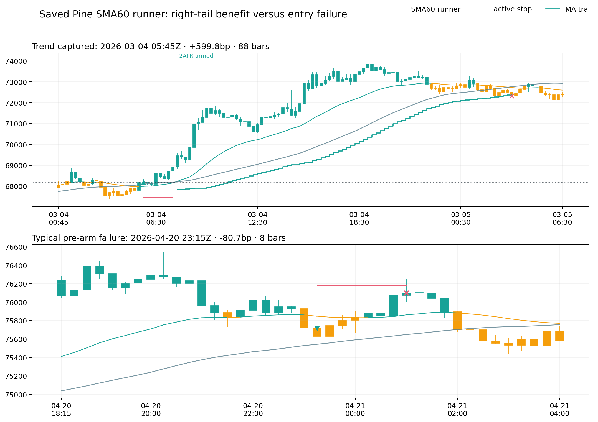
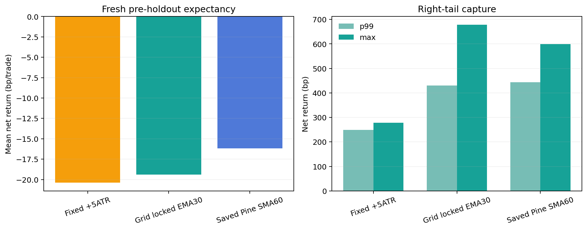
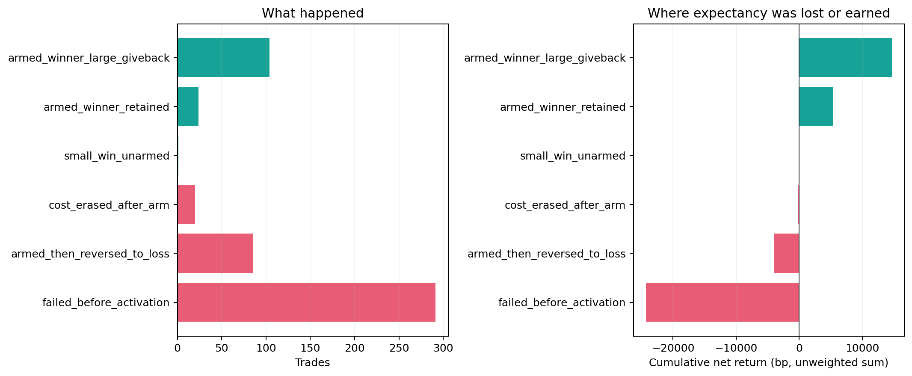
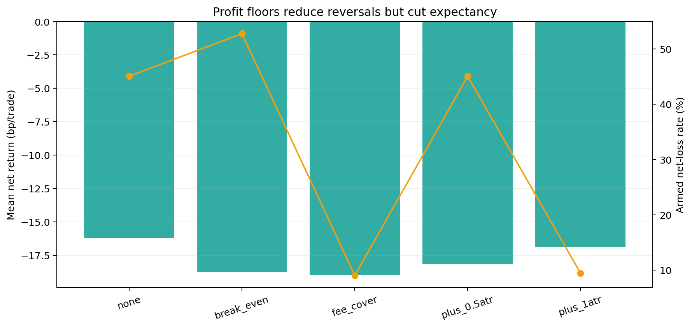
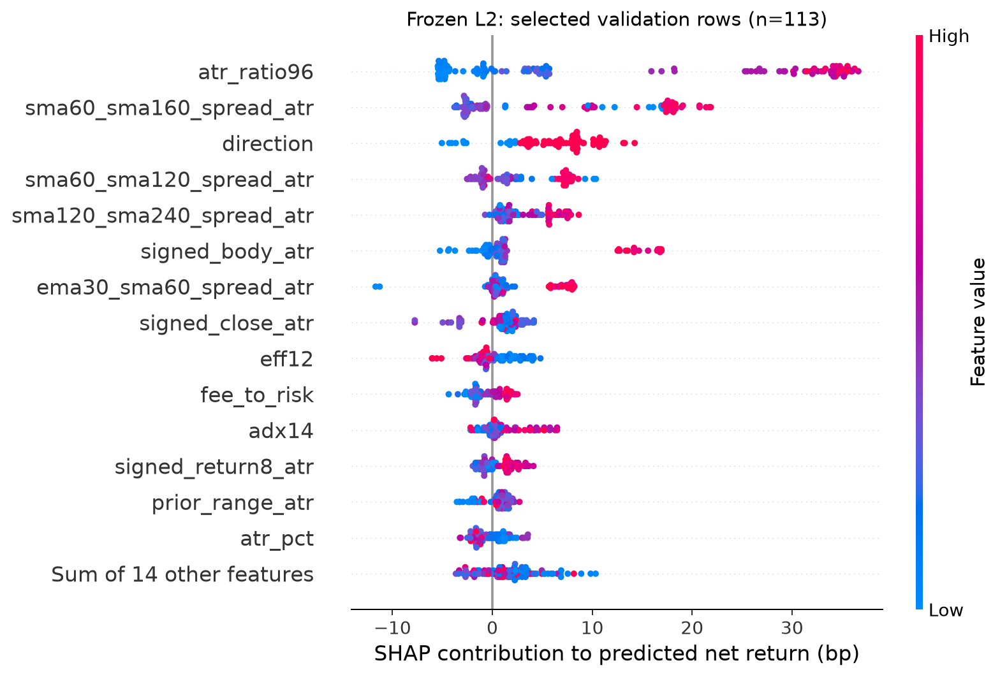
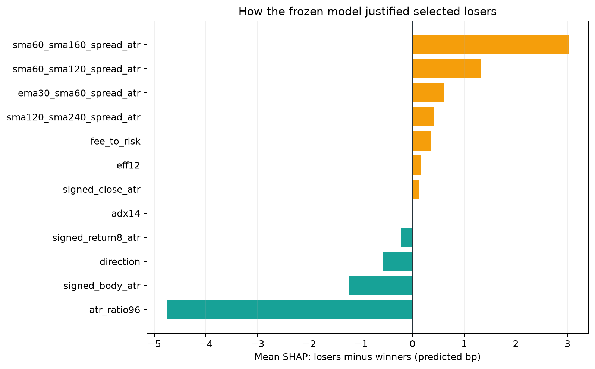
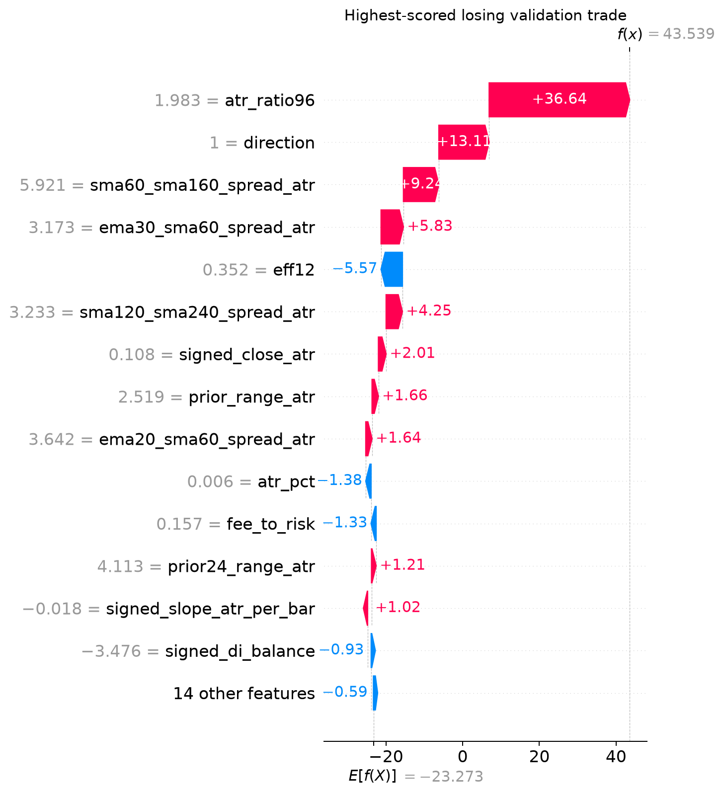

# P1：BTCUSDT.P 15m K1→K2 高召回与均线趋势退出重构（2026-09-04）

## 结论

Owner 对退出方式的判断是对的：**明显启动后的盈利仓，不应被固定 TP 提前截断，而应在趋势仍成立时跟随均线。**
在完全早于仓库 holdout 的新鲜区间 `2026-03-01` 至 `2026-05-04`（右开）上，当前已保存到
TradingView 的研究版用 `SMA60(HL2) ± 1ATR` 跟踪退出，把 525 笔信号中的最大净盈利从固定
`+5ATR` 的 **+277.94bp** 放大到 **+599.81bp**，p99 从 **+248.59bp** 放大到
**+444.06bp**。这证明均线 runner 的确改善了右尾捕获。

但它还不是可交易系统。当前 Pine runner 扣除每笔 0.2% 往返成本后平均 **-16.18bp/笔**，
profit factor **0.702**，胜率 **24.57%**。虽然比固定 `+5ATR` 的 **-20.38bp/笔**改善
4.20bp，但离净正收益仍远，且相对同月份、同 6 小时时段、同 ATR 桶、同方向的匹配随机入场只多
**+3.51bp/笔，p=0.2730**。这还是在已打开区间上的事后诊断，不能作为采用证据。

主要病因不在止盈：**291/525（55.4%）的交易从未以收盘达到 +2ATR，便在 runner 激活前失败**，
平均 -83.53bp，合计贡献 -24,307bp 的单位收益损失。退出优化无法修复这些入场。相反，128 笔
runner 盈利仓合计贡献 +20,037bp；其中 104 笔虽从峰值回吐较多，最终仍平均赚 +141.50bp。
把所有这类回吐都当作错误、机械地上移保本线，会砍掉正常趋势回踩。

因此本轮决策是：

- 保留当前 **SMA60 runner、+2ATR 收盘激活、1ATR 缓冲、最多 96 根**，作为研究版 Pine 默认；
- 不加自动 break-even、fee-cover、+0.5ATR 或 +1ATR 利润底线；五种方案均未改善期望；
- 不把当前 Pine、L2 或 runner promote 到 ACTIVE、forward、部署或真实下单；
- 下一轮不再继续微调止盈，而是重构真正有关系约束的 **K1→K2 episode 入场层**。

## 当前 TradingView 研究指标的完整规则

云端名称：`Fable 15m Trend Research V2`；图上短名：`Fable 15m Trend V2`。本轮已在 Pine
Editor 编译通过并保存。它只在 15m 生效，其他周期显示 `TF!`，不会发出交易信号。

### 1. 参考线与形态候选

- 触发参考：`EMA30(HL2)`，不是 SMA40；`HL2=(high+low)/2`。
- runner 参考：`SMA60(HL2)`。
- 波动单位：ATR14。
- 多空完全镜像；下表均用 `direction=+1/-1` 统一表达。

| 候选 | 当前判断 |
|---|---|
| direct | 前收盘在 EMA30 反侧或仅高出 0.10ATR，本根收盘越过至少 0.10ATR；方向实体 ≥0.20ATR；全幅 ≥0.65ATR；收盘位于方向端 60% 以上；EMA30 方向斜率 ≥-0.04ATR/根 |
| rejection | 本根影线真实触及 EMA30；收盘留在方向侧 ≥0.05ATR；方向实体 ≥0.10ATR；收盘位于方向端 65% 以上；斜率 ≥-0.03ATR/根 |
| coil | 收盘离开 EMA30 ≥0.15ATR，并突破前 8 根极值 ≥0.05ATR；实体 ≥0.25ATR；全幅 ≥0.70ATR；前 8 根至少一半靠近 EMA30，前区间 ≤2.75ATR |

同方向 raw 状态必须连续 3 根为 false 后才重新发一次信号，避免每根重复报警。默认关闭
`High-score launches only`，所以明显的 15m 启动不会被一个未经验证的分数阈值隐藏。

### 2. K1/K2 标记的诚实边界

当前显示层把 direct 信号标成 `K1`，把 rejection/coil 标成 `K2`，并把对应蜡烛提亮；但这仍是
**高召回视觉捷径**，不是 Owner 原始语义的完整 K1→K2 状态机。当前代码没有强制：

- K2 前必须先出现一根已登记的 K1；
- K1→K2 间隔必须为 2–8 根；
- 中间 K 线必须持续在均线正确一侧；
- K2 必须“影线触线、实体不穿线”；
- K1/K2 的实体、影线、距离、量能和趋势年龄必须相互匹配。

这正是信号多、失败率高的结构性原因。当前标签适合告诉人“这里可能是启动/回踩”，不具备自动下单资格。

### 3. 成交与趋势退出

1. 信号必须在 K 线收盘确认；下一根开盘入场，不在信号 bar 内回填。
2. 同时只显示一笔仓位；持仓期间后续信号仍可见，但不叠加仓位。
3. 初始灾难止损：入场价反向 `2×信号 ATR14`。
4. 没有固定 TP。绿色区域只画 `+5ATR` 视觉参考，不是止盈订单。
5. 已完成 K 线收盘利润首次达到 `+2ATR` 后，runner 激活。
6. 多头止损候选为 `SMA60-1ATR14`，空头为 `SMA60+1ATR14`；只允许朝盈利方向收紧。
7. 用完成 bar `t` 算出的新止损从下一根 `t+1` 才生效，避免前视。
8. 最长 96 根 15m bar（24 小时）；同 bar 按 active-stop-first。



上图第一笔正是 Owner 所说的场景：入场后先达到 +2ATR，随后不设固定 TP，止损沿 SMA60 逐步
抬升，最终吃到 +599.8bp。第二笔没有达到激活线，说明它是入场/初始风险问题，不是止盈问题。

## 数据、时间切分与成本

| 项目 | 口径 |
|---|---|
| 合约 / 周期 | OKX `BTC-USDT-SWAP` / 15m，对应 TradingView 的 BTCUSDT.P 研究语义 |
| 开发源 | 341,567 根 5m，完整 UTC 3×5m 聚合为 113,855 根 15m |
| 开发可用尾部 | 2026-02-28 15:45 UTC |
| 新鲜验证源 | 原生 15m，SHA256 `7eec6db01922a2748924e40574950f79dbad1d82ce2a0bcb2da849e1e8d48ff3` |
| 新鲜验证交易窗 | 2026-03-01 00:00 至 2026-05-04 00:00 UTC（右开） |
| 新鲜验证事件 | 525 |
| 仓库 holdout 起点 | 2026-05-04 00:00 UTC |
| 本轮经济回测读取 / 评分 holdout 行 | **0 / 0** |
| 入场 | 信号后下一根开盘 |
| 成本 | 每笔毛收益固定减 0.002，即 20bp 往返 |
| 初始止损 | 2ATR14 |

原生 15m 与旧 3×5m 聚合在重叠区间逐时间戳核对 5,632 行：OHLC 最大绝对差全部为 0，volume
最大差 `2.33e-10`。所有切分按时间；没有随机切分，特征只读取信号 bar 及之前，只有退出与标签看未来。

Owner 之前提供的 2026-07/08 截图只用于检查“明显形态有没有被视觉层漏掉”，已经污染显示形态选择，
所以本系列 lineage 诚实标记为 holdout-contaminated display diagnostic。**这些截图没有用于经济收益、
阈值、模型或 runner 评分**；本报告也没有再读取截图对应的价格行。

## 四轮收敛过程

| 轮次 | 只回答的问题 | 结果 | 判定 |
|---|---|---:|---|
| V1：单参考线 | SMA40 是否必须；换线能否救基线 | SMA40 开发净 -20.18bp；SMA60 -15.49bp，但所有时间折仍为负 | 拒绝 |
| V2：双线确认 | SMA60 触发 + MA close runner 是否比固定 5ATR 好 | 2024 exact 682 笔：runner -17.57bp，固定 -17.69bp；差 +0.12bp，月块 p=0.444 | 拒绝 |
| V3：高召回 + L2 | EMA30 高召回池能否由 LightGBM 找出可交易子集 | 冻结验证 3,746→113 笔；净 -8.92bp，PF 0.825，score p=0.281 | 拒绝 |
| V4：退出隔离 | 不筛 L2，只优化 MA runner 是否能吃到大尾部 | runner 放大 p99/max，但开发与新鲜验证的均值仍为负 | 拒绝经济采用；保留研究显示 |

这个顺序很重要：先证明“不必固定 40”，再把触发和退出分开，最后才发现 runner 有右尾价值但入场没优势。

## 新鲜区间：固定 TP 与均线 runner 同表

| 退出 | 笔数 | 净均值 | PF | 胜率 | p95 | p99 | 最大盈利 | 持仓中位 |
|---|---:|---:|---:|---:|---:|---:|---:|---:|
| 固定 +5ATR | 525 | -20.38bp | 0.648 | 31.05% | +179.07bp | +248.59bp | +277.94bp | 14 bars |
| 预注册网格选中：EMA30，+3ATR 激活，0 缓冲，192 bars | 525 | -19.40bp | 0.649 | 31.24% | +244.84bp | +430.86bp | **+678.01bp** | 18 bars |
| 当前 TradingView：SMA60，+2ATR 激活，1ATR 缓冲，96 bars | 525 | **-16.18bp** | **0.702** | 24.57% | **+306.93bp** | **+444.06bp** | +599.81bp | 21 bars |



预注册坐标网格的 selected policy 相对固定 +5ATR 只改善 +0.98bp，周块单侧 sign-flip
`p=0.2312`；相对匹配随机入场反而 -0.34bp，`p=0.5233`。当前 TradingView 默认在新鲜窗表面上
更好，但它是看过该窗后的诊断，不可倒称“最优参数”。因此云端默认保持为用户更容易理解且右尾更好的
SMA60 runner，但状态明确为 research-only。

## 时间稳定性：2026 年初的表面转正没有延续

当前 TradingView 退出合同保持不变：

| 时间块 | 角色 | 笔数 | 净均值 | PF |
|---|---|---:|---:|---:|
| 2024H1 | development | 1,711 | -19.48bp | 0.673 |
| 2024H2 | development | 1,726 | -21.67bp | 0.626 |
| 2025H1 | development | 1,593 | -18.46bp | 0.642 |
| 2025H2 | development | 1,602 | -20.03bp | 0.575 |
| 2026P1（1–2月） | development | 523 | +4.55bp | 1.084 |
| 2026-03 | fresh，事后诊断 | 267 | -12.69bp | 0.787 |
| 2026-04 | fresh，事后诊断 | 258 | -19.80bp | 0.596 |

2026 年 1–2 月单折转正不是稳定结构；紧接着 3 月、4 月重新为负。不能只截取那个正折宣布参数有效。

## 失败原因：首先是未启动，不是止盈太早



| 类型 | 笔数 | 单笔净均值 | 单位净收益合计 | 退出前 MFE | 实际退出回吐 |
|---|---:|---:|---:|---:|---:|
| runner 激活前失败 | **291** | **-83.53bp** | **-24,307bp** | 0.89ATR | 2.89ATR |
| 激活后反转成净亏 | 85 | -47.49bp | -4,037bp | 4.27ATR | 5.15ATR |
| 毛利被成本抹掉 | 20 | -10.48bp | -210bp | 5.06ATR | 4.73ATR |
| 未激活小赢 | 1 | +20.61bp | +21bp | 1.96ATR | 0.44ATR |
| 激活赢家、回吐 <2ATR | 24 | +221.70bp | +5,321bp | 8.29ATR | 1.28ATR |
| 激活赢家、回吐 ≥2ATR | 104 | +141.50bp | +14,716bp | 10.84ATR | 5.06ATR |

合计表使用逐笔 bp 的非复利加总，只用于定位贡献。最关键的反事实是：就算把所有 85 笔“激活后反转”
都改好，也没有触碰 291 笔最大亏损来源。策略的优先级应是让 K2 入场更真实，或研究被震出后的新 episode
重入，而不是继续把 runner 越收越紧。

## 为什么不直接加自动保本

所有利润底线只在收盘达到 +2ATR 后设置，并从下一根生效，其他规则不变：

| 激活后利润底线 | 净均值 | PF | 激活仓最终净亏率 | p99 | 最大盈利 |
|---|---:|---:|---:|---:|---:|
| 无（当前默认） | **-16.18bp** | **0.702** | 45.06% | **+444.06bp** | +599.81bp |
| break-even | -18.75bp | 0.630 | 52.79% | +427.51bp | +599.81bp |
| 覆盖 20bp 成本 | -18.96bp | 0.591 | 9.01% | +421.17bp | +599.81bp |
| +0.5ATR | -18.14bp | 0.619 | 45.06% | +426.01bp | +599.81bp |
| +1ATR | -16.85bp | 0.638 | 9.44% | +421.17bp | +599.81bp |



fee-cover 和 +1ATR 的确显著减少“已经激活却最终净亏”的比例，但同时更早砍掉正常回踩，使总体均值、
PF 和 p99 都变差。减少红单数量不等于增加期望；本轮不采用。

## 入场层哪些维度没有形成简单阈值

在当前 Pine 的 525 笔新鲜事件中，事后按特征四分位查看：

| 特征 | Q1 / Q2 / Q3 / Q4 净均值（bp） | 结论 |
|---|---|---|
| signal score | -7.71 / -19.37 / -28.01 / -9.71 | 分数不单调，不能只抬阈值 |
| ATR96 相对扩张 | -5.36 / -19.42 / -17.88 / -22.14 | 极高扩张更像追晚了 |
| ADX14 | -11.50 / **+1.49** / -26.66 / -28.09 | 倒 U；强趋势端可能已衰竭 |
| K 线方向实体 / ATR | -19.66 / -7.48 / -24.23 / -13.33 | 大实体不是越大越好 |
| SMA60–SMA160 spread / ATR | -13.08 / -2.37 / -28.03 / -21.26 | 线已大幅发散时常不是“刚启动” |
| fee-to-risk | 非单调，Q4 反而最好 | 不能据此机械加上限 |

多空都为负：LONG 251 笔 -14.20bp、PF 0.736；SHORT 274 笔 -18.00bp、PF 0.672。
`direct` 家族在这一个 fresh 窗 63 笔表面 +3.87bp，但它在开发集 842 笔为 -20.30bp，且
2024H1、2024H2、2025H1、2025H2、2026P1 五折全部为负。因此这不是可直接切换的答案，只是新鲜窗噪声。

## L2 为什么也没把坏入场筛掉

冻结 LightGBM Huber 使用 2023 训练、2024 选绝对 97.5% 分数门、2025-01 至 2026-02 验证：

| 指标 | 结果 |
|---|---:|
| 验证池 / 冻结门选中 | 3,746 / 113 |
| 池内净正类率 | 22.82% |
| 净正类 AUC | **0.509** |
| 模型 top-decile（375 笔）净均值 | **-8.43bp** |
| 单特征 signal score top-decile 净均值 | -5.94bp |
| 冻结 2.5% 门净均值 / PF | -8.92bp / 0.825 |
| score 排序置换 p | 0.2812 |
| 相对匹配随机入场 | +8.32bp，p=0.2691 |

AUC 接近随机、top-decile 扣成本仍负、两类检验都不显著，所以不能用“113 笔比全池少亏”来宣布 L2 有效。

SHAP 只解释这个**已经失败的冻结模型怎样打分**，不把相关性当因果。100 行 2023 训练背景的
interventional TreeSHAP 与 path-dependent 重要性排名 Spearman 为 0.9956，加法误差
`1.98e-10`；计算本身稳定。模型最依赖 ATR96 扩张、SMA60–SMA160 spread 和方向。失败组选中样本中，
慢均线 spread 反而比赢家得到更高正向贡献：SMA60–SMA160 为 +3.02bp、SMA60–SMA120 为
+1.33bp、EMA30–SMA60 为 +0.61bp。也就是说，模型把“已经发散的成熟趋势”误当成“新的启动”。





最高分亏损交易 `1bef9640928adab8` 被模型预测 +43.54bp，实际 -147.25bp；ATR 扩张、LONG 方向和
慢线发散共同把它推到高分。它揭示的不是“删掉某一个特征就会盈利”，而是缺少趋势年龄与 K1→K2
关系特征。



## 下一轮应重构的 K1→K2 episode

下一轮应把显示召回、入场资格和退出分别建模，不能继续让一根 raw 状态同时承担三种职责。建议冻结后
逐项验证以下关系特征：

1. **登记 K1。** K1 必须是实体贯穿候选快线的启动 K，记录方向、实体/ATR、穿越深度、收盘位置、
   量比、均线斜率与 K1 时间。
2. **等待 K2，而不是把任意 rejection 叫 K2。** 只接受 K1 后 2–8 根；距离以 bars 与 ATR 位移双重
   表达，防止相同 bars 在不同波动环境含义不同。
3. **约束中间路径。** K1→K2 之间不允许错误侧收盘，方向色连续；记录错误侧最深穿越与离线最大距离。
4. **K2 必须影线触线、实体留在正确侧。** 分开计算 touch depth、wick/body、实体到线的最小距离、
   收盘拒绝幅度，避免“整根实体穿线”也被算成回踩。
5. **比较 K1 与 K2。** K2 实体应相对 K1 收缩、逆向影线更明显；成交量既可缩量回踩，也可在重新启动
   时放量，需用交互而非单调阈值。
6. **加入趋势年龄/衰竭。** bars since cross、连续正确侧 bars、MA spread 的一阶变化和加速度；把
   “刚分离”与“已经发散很久”拆开。
7. **允许状态化重入研究。** 像路径图第二笔那样被 2ATR 初止损扫出后，若旧 episode 失效再出现新的
   合格 K1→K2，可作为新事件；不能在同一状态里无限补仓。
8. **退出保持当前 runner。** 新入场版本先固定 SMA60/+2ATR/1ATR/96，不再同时调退出，才能知道改善
   来自哪里。

EMA20/30/40、SMA40/60/90 已经探索过；没有证据支持“必须 40”。当前 EMA30 是高召回显示参考，SMA60
是更慢的持仓结构参考。下一轮可在开发折里把快线 family 当单变量，但不能再用已经打开的 2026-03/04
窗挑参数，也不能碰 2026-05-04 之后的经济 holdout，除非先冻结新合同并明确记一次消耗。

## 诊断口径修正

旧 V4 产物字段 `gave_back_atr=horizon_mfe_atr-realized_atr` 把退出后直到 384 bars 的行情也算成
“止盈回吐”，语义错误。本报告保留历史文件不篡改，新增：

- `exit_giveback_atr = mfe_at_exit_atr - realized_atr`：截至实际退出 K 的已观察回吐；
- `horizon_opportunity_gap_atr = horizon_mfe_atr - realized_atr`：退出后仍可能出现的机会差。

这个修正不改变交易收益、退出时点或已冻结参数路径；旧字段只参与同主目标精确并列时的第三排序，而本轮
没有这样的主目标并列。仍需注意 15m OHLC 不提供 bar 内路径：退出 K 的 high/low MFE 是观察上界，不能
断言一定发生在止损之前。

## 风险与诚实声明

- 全部经济结果均为历史回放，不是未来实盘保证；资金费率、滑点冲击和成交深度未额外建模，统一成本为 20bp。
- 当前 Pine 默认在 fresh 窗的比较是事后诊断，不能称为最优参数；正式选择的 EMA30 runner 同样没有过门。
- 匹配随机对照减少时段与波动 beta，但单币单市场仍有残余依赖；p 值也不替代经济为正这一硬门。
- SHAP 解释失败模型，不证明特征因果，也不授权删特征后直接重训或 promote。
- 用户截图发生在 holdout 后，只影响显示召回假设；经济回测没有读取或评分 `>=2026-05-04` 的价格。
- 本轮没有训练新模型、自动 promote、修改 ACTIVE/frozen/forward、新鲜度门、仓位、API key、部署或下单。

## 产物

主目录：`analysis/output/btcusdtp_15m_trend_refactor_20260904/`

- `summary.json`：全部结论与输入/产物哈希；当前 SHA256
  `b2336db2fa9df329f9b9376b1def94d45ec4cead6c90dac924664b1908f9645c`。
- `fresh_saved_pine_sma60_trades.csv.gz`：525 笔当前 Pine 退出账本。
- `exit_policy_comparison.csv`、`profit_floor_comparison.csv`、`failure_mechanics.csv`。
- `temporal_stability.csv`、`family_stability.csv`、`feature_quartiles.csv`、`side_metrics.csv`。
- `saved_pine_matched_controls.csv.gz` 与逐事件 matching 回执。
- 四张失败/退出图和三张 SHAP 图。

Pine 源码 SHA256：
`c54cc851b5abb684668a3b8d89f4e5cc1c15daba5a2e8932504fb9fe378606c9`。

## 复现命令

```bash
cd /Users/zhangzc/fable-trading

# 冻结 V4 开发选择；输出应与已提交 receipt 逐字节一致，且仍不打开 fresh 源。
PYTHONPATH=. .venv/bin/python -m \
  scripts.research_btcusdtp_15m_ma_runner_grid --phase selection
git diff --exit-code -- \
  experiments/active/exp-btcusdtp-15m-ma-runner-grid-preholdout-20260904-v1/config.json \
  scripts/research_btcusdtp_15m_ma_runner_grid.py \
  experiments/active/exp-btcusdtp-15m-ma-runner-grid-preholdout-20260904-v1/results/selection_receipt.json

# 在 selection/config/script 已提交且 SHA 对齐后，复现 fresh pre-holdout 验证。
PYTHONPATH=. .venv/bin/python -m \
  scripts.research_btcusdtp_15m_ma_runner_grid --phase validation

# 重建本报告的失败分层、保本线反事实、匹配对照与所有图。
PYTHONPATH=. .venv/bin/python -m \
  scripts.build_btcusdtp_15m_trend_refactor_report

# SHAP 必须留在隔离环境，不能污染主 torch/ultralytics/numpy 契约。
shap_venv="$(mktemp -d /tmp/fable-shap-repro.XXXXXX)"
python3 -m venv "$shap_venv"
"$shap_venv/bin/pip" install --dry-run --report /tmp/fable-shap-dry-run.json \
  shap==0.52.0 lightgbm==4.6.0 matplotlib==3.11.1 pandas==3.0.5 scipy==1.18.1
"$shap_venv/bin/pip" install \
  shap==0.52.0 lightgbm==4.6.0 matplotlib==3.11.1 pandas==3.0.5 scipy==1.18.1
PYTHONPATH=. "$shap_venv/bin/python" scripts/audit_btcusdtp_15m_l2_shap.py

PYTHONPATH=. .venv/bin/python -m pytest -q \
  tests/test_research_btcusdtp_15m_ma_state_trend.py \
  tests/test_research_btcusdtp_15m_dual_ma_runner.py \
  tests/test_research_btcusdtp_15m_high_recall_l2_runner.py \
  tests/test_research_btcusdtp_15m_ma_runner_grid.py

python3 scripts/md_to_html.py \
  analysis/p1_btcusdtp_15m_trend_refactor_20260904.md \
  --out-dir analysis/html
```
