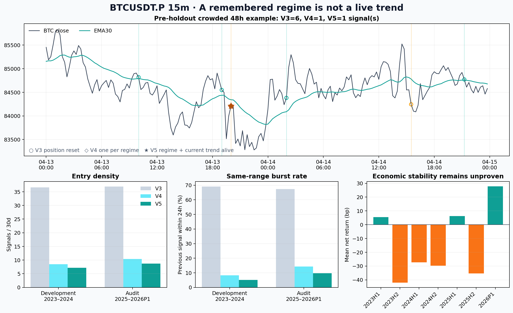
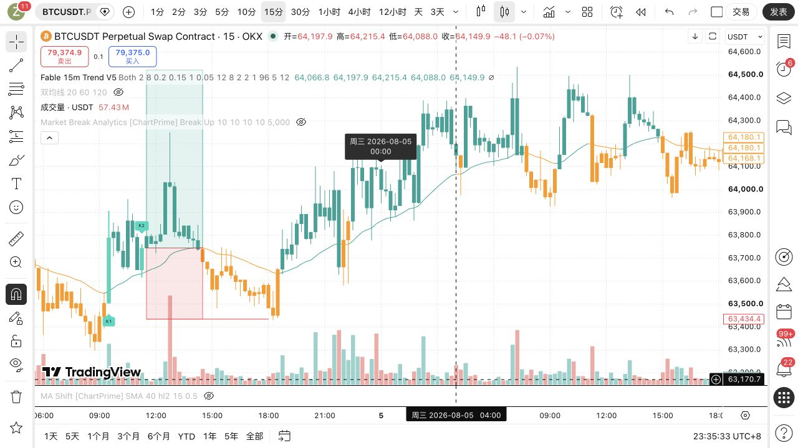

# P1：BTCUSDT.P 15m 趋势状态去重与实时活性门审计（2026-09-04）

## 结论

用户截图中的“四组信号”不是四段趋势，而是同一震荡区间被旧脚本反复当作新机会。根因有两层：

1. V3 把 `positionSide` 同时当持仓状态和趋势去重状态；止损或超时一平仓，检测器立刻重新武装。
2. V4 虽然改成“一段趋势只发一次”，但趋势状态是有记忆的，K2 到来时没有确认趋势**此刻仍然同向**。

最终 V5 使用两个互不混淆的状态机：持仓退出只管理风险，不重置趋势账本；K2 除了属于已确认趋势，
还必须在当根满足 EMA30 相对 SMA60 同向、EMA30 四根斜率同向。只有反向强趋势或连续 8 根中性 K 线
才能重新武装。

在未读取仓库 holdout 的时间审计中，V5 将信号密度从 V3 的约 36.9 次/月压到 8.71 次/月，
24 小时内重复信号从 67.37% 降到 9.76%，中位信号间隔从 16.75 小时提高到 73.88 小时。
用户指定的 2026-08-05 TradingView 区间另作了一次获批的冻结后视觉核验：原截图中的四组重复信号均已消失，
左侧只保留更早已经成立的一组趋势交易。

这次修复解决的是“震荡重复开仓”，**没有证明策略可盈利**。审计期 V5 扣 0.2% 往返成本后仍为
`-10.41bp/笔`、PF `0.806`；匹配随机入场的超额仅 `+5.54bp`，置换 `p=0.353`。
因此 V5 只保存为稀疏研究指标，不进入 ACTIVE、forward、部署或实盘。



## 当前完整交易规则

| 环节 | 冻结规则 |
|---|---|
| 周期 | 仅 BTCUSDT.P 15m；非 15m 不产生信号 |
| 主线 | EMA30(HL2)，唯一可见均线；SMA60(HL2) 仅用于内部趋势与跟踪止损 |
| 趋势建立 | 多头：`(EMA30-SMA60)/ATR14 >= 1.0` 且 EMA30 四根斜率 `>= 0.05 ATR/bar`，连续 12 根；空头镜像 |
| K1 | 实体贯穿 EMA30；方向实体 `>=0.20 ATR`；全幅 `>=0.65 ATR`；收盘位置 `>=0.60`；开盘在线反侧、收盘在线趋势侧 |
| K1→K2 距离 | 2--8 根完整 K 线 |
| 中间 K 线 | 不允许收盘越过 EMA30 的错误侧超过 `0.05 ATR` |
| K2 | 拒绝影线占全幅 `>=0.15`；实体占比 `<=0.75`；影线真实触线，深度 `0--1.50 ATR`；实体完全留在趋势侧 |
| V5 当前活性门 | 多头 K2 当下必须 `EMA30>SMA60` 且 EMA30 四根斜率 `>=0`；空头镜像 |
| 同趋势去重 | 每个方向趋势 regime 最多接受一组 K1/K2；止损、超时、移动止损均不重新武装 |
| 重新武装 | 相反方向强趋势确认，或连续 8 根满足 `abs(spread)<=0.10 ATR` 且 `abs(slope)<=0.005 ATR/bar` 的中性状态 |
| 信号与入场 | K2 收盘确认，研究成交价为下一根连续 K 线开盘 |
| 初始止损 | 入场价反向 `2 ATR14` |
| 趋势接管 | 收盘浮盈达到 `2 ATR` 后启动；止损按 SMA60 外侧 `1 ATR` 单向收紧 |
| 最长持仓 | 96 根 15m，即 24 小时 |
| 图上绿色框 | 5 ATR 的视觉收益导引，不是固定止盈单；框宽固定 12 根，不延长成色带 |
| 成本 | 往返 0.2%，从毛收益中扣除 |

## 数据与切分

| 项目 | 数值 |
|---|---:|
| 原生 5m 行数 | 341,567 |
| 完整 15m 行数 | 113,855 |
| 数据范围 | 2022-11-30 16:00 -- 2026-02-28 15:45 UTC |
| 不完整 15m 组丢弃 | 1 |
| 时间断点 | 1（按 segment 隔离） |
| 原始 K1/K2 形态候选 | 3,926 |
| 开发期 | 2023-01-01 -- 2025-01-01，892 个 V3 顺序事件 |
| 审计期 | 2025-01-01 -- 2026-02-28 16:00，521 个 V3 顺序事件 |
| 随机切分 | 否 |
| 仓库 holdout 起点 | 2026-05-04 00:00 UTC |
| 回测/调参读取 holdout 行 | 0 |
| 本配置获批视觉 holdout 使用 | 第 1 次；冻结后只看 2026-08-05 图，不算收益、不再调参 |

V4 的四个数值参数只在 2023--2024 按顺序单变量选择：趋势建立 spread、趋势建立 slope、强趋势持续根数、
中性重置根数。V5 没有新增参数网格；它只增加零轴语义门 `signed spread > 0` 与 `signed slope >= 0`，
避免根据已经看过的审计期寻找“最好看的”幅度阈值。

## 信号密度与经济结果

| 窗口 / 策略 | 事件 | 次/月 | 24h 内重复 | 中位间隔 | Runner 触发率 | 净收益 bp/笔 | PF | 胜率 |
|---|---:|---:|---:|---:|---:|---:|---:|---:|
| 开发 V3：持仓退出即重置 | 892 | 36.61 | 69.06% | 17.50h | 42.94% | -19.92 | 0.634 | 20.85% |
| 开发 V4：每趋势一次 | 207 | 8.50 | 8.21% | 63.38h | 46.86% | -9.81 | 0.814 | 23.67% |
| 开发 V5：再加当前活性 | 175 | 7.18 | 5.14% | 80.63h | 46.86% | -23.03 | 0.572 | 22.29% |
| 审计 V3：持仓退出即重置 | 521 | 36.89 | 67.37% | 16.75h | 42.23% | -21.02 | 0.598 | 22.46% |
| 审计 V4：每趋势一次 | 147 | 10.41 | 14.29% | 63.50h | 42.18% | -3.89 | 0.925 | 23.13% |
| **审计 V5：再加当前活性** | **123** | **8.71** | **9.76%** | **73.88h** | **40.65%** | **-10.41** | **0.806** | **22.76%** |

密度目标通过，但经济门失败。V5 相对 V3 在审计期减少 76.39% 的交易，相对 V4 再减少 16.33%；
它没有提高审计期 Runner 触发率，也没有获得正净期望。

### V5 时间片稳定性

| 时间片 | 事件 | 次/月 | 净收益 bp/笔 | PF | Runner 触发率 |
|---|---:|---:|---:|---:|---:|
| 2023H1 | 44 | 7.29 | +5.55 | 1.120 | 47.73% |
| 2023H2 | 41 | 6.68 | -42.00 | 0.167 | 36.59% |
| 2024H1 | 50 | 8.24 | -27.30 | 0.524 | 56.00% |
| 2024H2 | 40 | 6.52 | -29.67 | 0.513 | 45.00% |
| 2025H1 | 51 | 8.45 | +6.18 | 1.119 | 47.06% |
| 2025H2 | 57 | 9.29 | -35.30 | 0.391 | 31.58% |
| 2026P1 | 15 | 7.63 | +27.79 | 1.648 | 53.33% |

信号稀疏性在所有时间片较稳定，收益却在正负之间大幅翻转。最大问题集中在 2023H2、2024 与 2025H2，
说明“处于趋势方向”仍不足以区分趋势延续和趋势末端回踩。

## 匹配随机对照

审计期每个 V5 事件按同月、UTC 六小时段、月度 ATR 五分位、方向匹配随机入场，使用相同的下一开盘、
2ATR 初始止损、2ATR 接管、SMA60±1ATR 跟踪、96 根期限和 0.2% 成本。123/123 个事件精确匹配。

| 指标 | V5 | 匹配随机 | V5 - 随机 |
|---|---:|---:|---:|
| 平均净收益 | -10.41bp | -15.95bp | +5.54bp |
| 配对符号翻转检验 |  |  | `p=0.3531` |

V5 比随机池少亏，但差异远未达到项目要求的 `p<0.01`，不能声称形态具有可交易的独立超额。

## 形态分数与 top-decile 反证

V5 没有 LightGBM/YOLO 排序层，但保留 V3 的 K1/K2 形态质量分数。为了不漏报项目经济指标，
以“扣成本后净收益为正”为二分类标签计算 AUC，并将形态分数最高的 `ceil(10%)` 与同池随机子集比较。

| 窗口 | AUC | top 10% 数 | top 毛收益 | top 净收益 | top 胜率 | top - 全池净收益 | 置换 p |
|---|---:|---:|---:|---:|---:|---:|---:|
| 开发 | 0.595 | 18 | +21.60bp | +1.60bp | 38.89% | +24.63bp | 0.1860 |
| 审计 | 0.536 | 13 | -33.08bp | -53.08bp | 15.38% | -42.67bp | 0.8711 |

这是一条明确的负结论：形态分数在开发期看似有方向，在审计期几乎退化为随机，最高分组反而更差。
因此不能通过“再提高 K1 实体、影线、形态 score 阈值”来解决趋势质量；这也是本轮没有继续拧形态参数的原因。
形态分数本身就是本轮唯一单特征基线，没有第二个模型可以假装成对照。

## 用户截图视觉验收



- 账号：`zc994739211`；布局：`综合过滤`；品种：`OKX:BTCUSDT.P`；周期：15m。
- Pine v6 编译通过，私有脚本保存为版本 5，图表运行标题为 `Fable 15m Live Trend · Episode V5`。
- 用户原截图同一天四组重复 K1/K2 已消失；左侧保留的是更早已经确认且仍活跃的一组趋势 episode。
- 该图位于仓库 holdout 之后。这是本配置第 1 次 holdout 使用，已有 Owner 明确批准；参数在查看前冻结，
  查看后未改数值、未计算收益，因此不能把这张图计入经济证据。

## 失败原因与下一步判断

### 已解决

- **重复武装**：持仓结束不再等于趋势结束。
- **陈旧趋势记忆**：K2 必须确认当前均线关系和斜率仍同向。
- **视觉噪声**：每段 regime 最多一个 K1/K2；只有一条可见 EMA30；风险收益框固定宽度。

### 尚未解决

- 0.2% 成本高于审计期平均毛收益 `+9.59bp`，直接把结果压到 `-10.41bp`。
- 2025H2 Runner 触发率只有 31.58%，大量 K2 是趋势尾部而不是二次启动。
- 形态 score 的审计 AUC 仅 0.536，top-decile 明显失效；继续调 K 线几何阈值有较高过拟合风险。
- V5 只回答“是否仍同向”，没有回答“趋势是否刚完成扩张并有足够剩余空间”。

### 下一步（不在本轮私自改变）

下一轮应把“是否值得进场”与“图形是否成立”分层：保留 V5 作为稀疏候选生成器，再在信号 K2 时点建立
因果 L2，优先验证趋势年龄、1h 同向状态、24 根效率、波动扩张相对自身分位、距结构阻力/支撑的剩余空间，
以及 K1 后是否已经透支 MFE。所有特征只能使用 K2 及以前数据，并按时间走步验证。只有 L2 在扣成本后
top-decile 为正、匹配随机超额 `p<0.01`，才有资格讨论替换研究显示版。

## 风险与诚实声明

- 审计窗口 2025--2026P1 不是 pristine holdout，先前已经看过，只能用于抗时间漂移复核。
- 仓库价格回测完全截止于 2026-02-28 15:45 UTC，未加载任何 `>=2026-05-04` 行。
- 2026-08-05 仅为获批视觉验收，不能用来声称收益改善或泛化成功。
- V5 改善了事件语义和图面密度，却让 V4 的审计平均净收益从 -3.89bp 降至 -10.41bp；报告没有隐藏这项退化。
- 没有修改成本、止损、Runner、ATR、阈值预设、ACTIVE、frozen、forward、部署、仓位或真实订单。

## 复现命令

```bash
cd /Users/zhangzc/fable-trading

PYTHONPATH=. .venv/bin/python \
  scripts/research_btcusdtp_15m_trend_regime_episode.py --phase select

# 冻结 selection commit 后：
PYTHONPATH=. .venv/bin/python \
  scripts/research_btcusdtp_15m_trend_regime_episode.py --phase audit

# 冻结 V5 config/prereg/script commit 后：
PYTHONPATH=. .venv/bin/python \
  scripts/research_btcusdtp_15m_trend_regime_live_entry.py

PYTHONPATH=. .venv/bin/python \
  scripts/build_btcusdtp_15m_trend_regime_episode_report.py

PYTHONPATH=. .venv/bin/pytest -q \
  tests/test_research_btcusdtp_15m_trend_regime_episode.py \
  tests/test_research_btcusdtp_15m_trend_regime_live_entry.py

python3 scripts/md_to_html.py \
  analysis/p1_btcusdtp_15m_trend_regime_live_entry_20260904.md \
  --out-dir analysis/html
```

## 主要产物

- `experiments/active/exp-btcusdtp-15m-trend-regime-live-entry-preholdout-20260904-v1/results/summary.json`
- `experiments/active/exp-btcusdtp-15m-trend-regime-live-entry-preholdout-20260904-v1/results/ranking_diagnostics.json`
- `experiments/active/exp-btcusdtp-15m-trend-regime-live-entry-preholdout-20260904-v1/results/tradingview_save_receipt.json`
- `experiments/active/exp-btcusdtp-15m-trend-regime-live-entry-preholdout-20260904-v1/pine/fable_15m_trend_regime_live_v5.pine`
