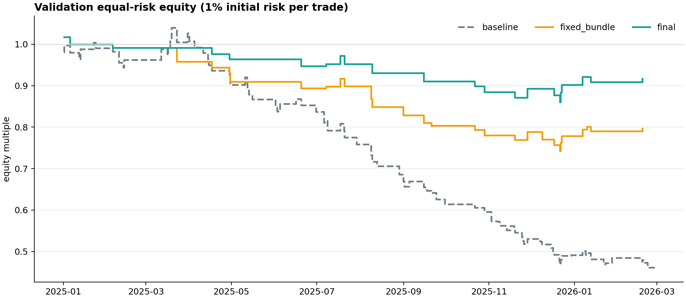
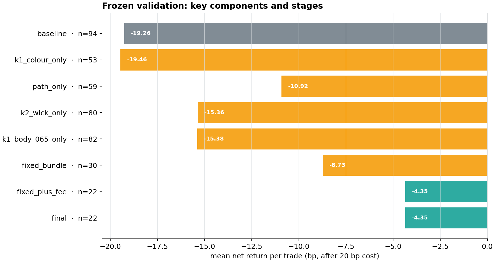
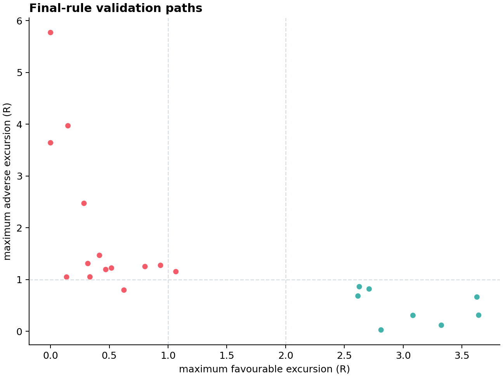
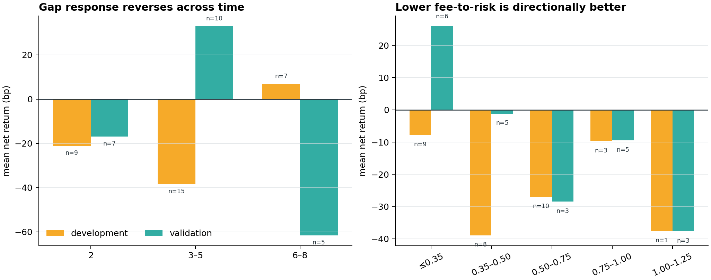

# P1：BTCUSDT.P 1h K1→K2 Owner Causal V2 回测（2026-09-04）

## 结论

**修改有效地减少了坏交易，但仍没有达到可交易标准，结论为 RESEARCH KEEP / PRODUCTION REJECT。**

在完全未参与参数选择的 2025-01-01 至 2026-03-01（右开）验证段：

- 原 `Core recall · 2–8`：94 笔，扣 0.2% 后 **-19.26bp/笔**，PF **0.505**；
- 四项固定逻辑修正：30 笔，**-8.73bp/笔**，PF **0.733**；
- 再加开发段选定的 `fee_to_risk ≤ 1.25R`：22 笔，**-4.35bp/笔**，PF **0.881**；
- 1.5R 收盘后、下一根启用 fee-cover 止损：22 笔，结果与上一步完全相同。

新规则把平均亏损收窄 **14.91bp/笔**，等风险 1% 顺序复利从 **-54.46%** 改善到
**-8.31%**，最大回撤从 **-56.19%** 缩小到 **-15.40%**。但是最终均值仍为负，
匹配随机对照超额虽为 **+11.36bp/笔**，单侧 sign-flip `p=0.1994`，远未达到预注册的
`p<0.01`。2025H1、2025H2 均未盈利，因此成功门明确失败。

更关键的病因是：最终 22 笔的毛收益已经是 **+15.65bp/笔**，但固定往返成本为 20bp，
扣费后正好变成 **-4.35bp/笔**。这套形态可能有一点相对随机入场的“引力”，但边际还不足以覆盖
当前成本，不具备生产资格。



## 已实现的当前交易规则

Pine 研究版位于
`experiments/active/exp-btcusdtp-1h-owner-causal-v2-preholdout-20260904-v1/pine/fable_k1_k2_owner_causal_v2.pine`。
它仍是 `indicator()`，负责识别与画图，不自动下单。离线回测用完全相同的入场门，并用下表的
冻结执行合同计算结果。

| 层 | Owner Causal V2 精确规则 |
|---|---|
| 周期 | 本报告只验证 OKX BTC-USDT-SWAP 原生语义 1h；Pine 允许原生 15m，但 15m 未由本报告验证 |
| SMA/颜色 | `SMA40(HL2)`；K 线颜色为 `HL2 >= SMA40` 青色，否则橙色；实体、边框、影线同色 |
| K1 方向 | 多头阳线、空头阴线；实体/全幅 ≥0.65；全幅/ATR14 ≥0.95；方向收盘位置 ≥0.70 |
| K1 穿线 | K1 开盘与收盘相对 SMA40 的方向深度都 ≥-0.05ATR；仍保留原 Core recall 的 0.05ATR 容差 |
| K1 颜色 | K1 的 `HL2 vs SMA40` 颜色必须与方向一致 |
| K1→K2 距离 | 2–8 根；同一 K2 有多个 K1 时，按原 Pine 的 rope 覆盖、实体、幅度、rope 穿越质量选最高者 |
| 中间路径 | 严格位于 K1、K2 之间的每根 K 线都必须：收盘在正确 SMA40 一侧，且 MA-side 颜色连续一致 |
| K2 形态 | 拒绝影线/全幅 ≥0.25；实体/全幅 ≤0.50；方向拒绝位置 ≥0.25 |
| K2 真触线 | 触线深度 0–1.50ATR；不再允许 -0.05ATR 的“差一点碰到” |
| K2 影线-only | 多头 `min(open,close) >= SMA40`，空头 `max(open,close) <= SMA40`；SMA40 只能进入拒绝影线，不能穿过实体 |
| 入场 | K2 完整收盘确认，下一根开盘入场；风险必须为 0.15–2.50ATR |
| 经济门 | `fee_to_risk = 0.002 / (K2极值风险距离 / 入场价)`，必须 ≤1.25R |
| 去重 | 同一 K1 只收最早 K2；全局 cooldown 6 根；同根多空都成立时多头优先 |
| 初始止损 | 多头=已完成 K2 最低点；空头=已完成 K2 最高点；无 buffer |
| 止盈/期限 | 3R；最多 12 根 1h K 线；同一根同时触发止损和止盈时保守记止损；超时按第 12 根收盘 |
| 盈利保护 | 某根完整收盘达到 1.5R 后，从下一根开始把止损移到毛收益 +0.2% 的 fee-cover 位置 |
| 成本 | 每笔固定减 0.2% 往返成本；不含 funding，也不在 0.2% 之外另加滑点 |

Pine 视觉层保持参考指标源语义：SMA 主线默认 1px，glow 默认不显示；青/橙状态同时控制 SMA、
K 线实体、边框和影线；K1/K2 亮色标记；目标区与风险区不写 `TP`/`SL` 字母。虚线为 1.5R
保护触发层，点线为 fee-cover 层。

## 实验纪律与数据

本轮没有再次读取 holdout。使用 SHA 固定的
`data/kline_deep/okx_BTC_USDT_SWAP_15m_158499.csv`，物理数据末端为
**2026-02-28 23:45 UTC**，早于项目 holdout 起点 **2026-05-04**。15m 按 UTC 整点聚合，
只保留每小时完整 4 根的组。

| 数据项 | 数值 |
|---|---:|
| 15m 源行数（安全截止内） | 145,669 |
| 完整 1h K 线 | 36,417 |
| 不完整小时丢弃 | 1 |
| 1h 缺口 | 0 |
| 首小时 | 2022-01-03 15:00 UTC |
| 末小时 | 2026-02-28 23:00 UTC |
| 开发段 | 2023-01-01 至 2025-01-01 |
| 冻结验证段 | 2025-01-01 至 2026-03-01 |
| 本轮读取 holdout 行数 | **0** |

所有规则先写入 config 并提交；开发段只选择 fee-to-risk 上限与盈利保护触发点。选择收据提交后，
验证命令才允许执行。基线复刻与旧 Python Pine-v8 回放逐键相同：全快照 599 个原始候选、374 个
去重后事件，K1/K2/方向/入场索引全部一致。

开发段 fee-to-risk 网格结果如下。注意：Owner 要求加入经济门，所以有限阈值之间择优；1.25R 虽是
有限候选的稳健分最高者，但它没有胜过“不设经济门”，不能把“被选中”误读为独立盈利证据。

| fee/risk 上限 | n | 净bp/笔 | 半年稳健分bp | 最差半年bp | 合格样本量 |
|---:|---:|---:|---:|---:|---:|
| 不设门 | 35 | -24.57 | -37.32 | -50.19 | 是 |
| 0.35R | 10 | -15.61 | -51.91 | -103.17 | 否 |
| 0.50R | 19 | -30.47 | -46.50 | -62.18 | 否 |
| 0.75R | 29 | -24.37 | -40.82 | -54.45 | 是 |
| 1.00R | 30 | -24.86 | -38.30 | -53.67 | 是 |
| **1.25R** | **31** | **-25.27** | **-38.05** | **-52.06** | **是** |

盈利保护固定在已选 1.25R 信号上比较。1.5R 触发的稳健分比关闭提高 2.89bp，最差半年不变，
达到预注册的 +1bp 启用门，因此被冻结为 1.5R。

| 收盘触发 | n | 净bp/笔 | 半年稳健分bp | 最差半年bp |
|---:|---:|---:|---:|---:|
| 关闭 | 31 | -25.27 | -38.05 | -52.06 |
| 1.0R | 31 | -21.40 | -35.21 | -46.68 |
| **1.5R** | **31** | **-23.15** | **-35.16** | **-52.06** |
| 2.0R | 31 | -25.27 | -38.05 | -52.06 |

开发段的绝对结果全部为负。这是预警，不是可以藏起来的坏消息。

## 冻结验证结果

| 规则阶段 | n | 净bp/笔 | PF | 净胜率 | 等风险1%复利 | 最大回撤 | 对照超额bp | 配对 p |
|---|---:|---:|---:|---:|---:|---:|---:|---:|
| 原 Core recall | 94 | -19.26 | 0.505 | 27.66% | -54.46% | -56.19% | -5.78 | 0.7930 |
| 四项固定逻辑 | 30 | -8.73 | 0.733 | 33.33% | -20.28% | -27.01% | +10.13 | 0.1528 |
| + fee/risk ≤1.25R | 22 | -4.35 | 0.881 | 36.36% | -8.31% | -15.40% | +11.99 | 0.1859 |
| + 1.5R 盈利保护 | 22 | -4.35 | 0.881 | 36.36% | -8.31% | -15.40% | +11.36 | 0.1994 |

随机对照为每个候选 3 个精确匹配入场：同月、同 UTC 六小时时段、同月 ATR14 五分位，复制方向、
ATR 风险距离、3R/保护规则、12h 和成本；所有 22 笔最终候选均匹配成功。AUC、top-decile 不适用：
本实验比较的是确定性二元规则，没有训练模型、概率分数或排名阈值。

四项形态修正移除了多数宽松信号：验证基线 94 笔中，最终精确保留 20 笔，74 笔被移除；由于重新
选择 K1 和去重顺序变化，另产生 2 个新组合。信号少了 **76.6%**，风险显著下降，但统计把握度也
随之下降。



### 时间与方向稳定性

| 时段 | n | 净bp/笔 | PF | 胜率 |
|---|---:|---:|---:|---:|
| 2025H1 | 6 | -39.79 | 0.280 | 16.67% |
| 2025H2 | 13 | -0.93 | 0.970 | 38.46% |
| 2026H1（仅1–2月） | 3 | +51.67 | 3.034 | 66.67% |

| 方向 | n | 净bp/笔 | PF | 等风险1%复利 |
|---|---:|---:|---:|---:|
| 多 | 11 | +1.77 | 1.048 | -3.18% |
| 空 | 11 | -10.48 | 0.715 | -5.29% |

多头等名义刚过零，但只有 11 笔，等风险仍为负；空头更弱。2026 年正数仅来自 3 笔，不能覆盖
2025H1 的严重失效。系统仍明显依赖行情阶段。

## 失败原因：主要不是止盈太低

最终 22 笔为 4 笔 3R TP、13 笔止损、5 笔超时；其中 4 笔超时净赚、1 笔超时净亏。

| 路径机制 | n | 净bp/笔 | MFE均值R | MAE均值R | 净贡献bp |
|---|---:|---:|---:|---:|---:|
| 止损前连 0.5R 都没到 | 9 | -49.65 | 0.23 | 2.44 | -446.84 |
| 走到 0.5R、但未到 1.5R 就止损 | 4 | -66.59 | 0.83 | 1.23 | -266.37 |
| 负收益超时 | 1 | -94.21 | 0.63 | 0.80 | -94.21 |
| 正收益超时 | 4 | +84.86 | 2.69 | 0.60 | +339.43 |
| 3R 目标 | 4 | +93.04 | 3.42 | 0.35 | +372.18 |

**13 个止损全部在 MFE<1.5R 时发生，9 个甚至未到 0.5R。** 因此这批失败单无法靠“1.5R 后保本”
挽救；问题发生在保护规则有资格启动之前。1.5R 保护在验证里曾武装 5 笔，但没有改变任何一笔退出。
开发段也只改变 1/31 笔，把一笔 -65.63bp 止损变为净零。盈利保护不是当前主要杠杆。



## 哪些参数值得保留，哪些逻辑要重做

### 1. K1 实体 0.65：目前最一致的单项修正

单独把 K1 实体从 0.50 提到 0.65，开发从 -14.31 改善到 **-7.81bp/笔**，验证从 -19.26
改善到 **-15.38bp/笔**。方向在两个时间段一致；开发段相对匹配控制的 `p=0.00494`。
它仍未让绝对收益转正，但四项里证据最稳定，建议保留。

### 2. K1 颜色：形态语义合理，尚不是利润过滤器

K1 颜色单项在开发改善 1.09bp，验证反而恶化 0.20bp；完整 bundle 去掉它后，验证从 -8.73
变为 -8.09bp。它可以作为 Owner 形态定义保留，但不能声称已验证出 alpha。

### 3. 中间路径：存在强交互和阶段反转

路径门单独使用时，开发从 -14.31 恶化到 -17.66bp，验证则改善到 -10.92bp；完整 bundle 去掉
路径门后，验证反而从 -8.73 改善到 -5.43bp。当前把“不得错误侧收盘”和“HL2 颜色必须 100%
连续”绑成一个硬门，可能过度收缩。下一轮应把两个条件分开单变量检验，而不是继续一起收紧。

### 4. K2 影线-only：提高语义真实性，盈利证据仍不稳定

它在验证单项改善 3.90bp，在开发却恶化 3.37bp；完整 bundle 中移除它，验证由 -8.73 变为
-10.01bp，说明它在验证组合中有正贡献。建议作为“这确实是一根回踩 K”保留，但不能把它当成独立
盈利因子。

### 5. fee-to-risk：方向正确，1.25R 太宽但目前不能追着验证集改

最终验证按 fee/risk 分桶：`≤0.35R` 6 笔为 **+25.94bp/笔**；`1.00–1.25R` 3 笔全部亏损，
为 **-37.64bp/笔**。开发里 `≤0.35R` 也比整体少亏，但只有 9 笔且仍为 -7.78bp/笔；预注册
0.35 阈值臂总样本不足。经济方向值得继续，但不能用已经看过的验证结果把默认值偷偷从 1.25 改成
0.35。需要在更大的、仍属 pre-holdout 的多币种开发池重新估计，再用新的时间段验证。

### 6. K1→K2 距离：不能简单改成 3–5

| gap | 开发 n / bp | 验证 n / bp |
|---|---:|---:|
| 2 | 9 / -21.06 | 7 / -16.84 |
| 3–5 | 15 / **-38.40** | 10 / **+32.99** |
| 6–8 | 7 / **+6.82** | 5 / **-61.57** |

距离效应几乎完全反转。验证图上会诱导人把 2–8 改成 3–5，但开发证据明确反对。这里需要的是
行情阶段/趋势持续性条件，或全新前向样本，而不是在同一验证集继续找最漂亮的 gap。



## 风险与诚实声明

- 这是单品种、22 笔最终验证信号，统计功效不足；`+11.36bp` 对照超额没有显著性。
- 开发段最终规则为 -23.15bp/笔，验证段为 -4.35bp/笔；没有跨期绝对盈利。
- 2026H1 的 +51.67bp 只有 3 笔，是部分半年，不能当稳定结果。
- 0.2% 成本已固定，不含 funding 和额外滑点；现实成本更高只会更差。
- 主结果把每个信号作为独立机会；等风险曲线为诊断，不代表同时持仓、保证金和交易所撮合的完整组合模拟。
- 本轮未读取 2026-05-04 之后的价格，没有产生新的 holdout 次数；也没有训练、promote、切换
  ACTIVE/frozen、写 forward_log 或下单。
- Pine 默认也可在 15m 计算，但本文没有给 15m 盈利结论。

## 下一步

1. **保留研究版、不进入生产。** 保留 K1 实体 0.65 和 K2 影线-only；K1 颜色可按形态语义保留。
2. **优先重做入场延续，不先动 3R。** 9/13 止损在 0.5R 前失败，说明需要研究 K2 后的因果确认，
   例如下一根突破 K2 方向极值才入场；这会改变入场价和风险，需 Owner 单独批准后预注册。
3. **拆开路径双门。** 分别验证“错误侧收盘=0”和“MA-side 颜色连续=100%”，禁止再打包后猜归因。
4. **扩大经济门样本。** 在不碰 holdout 的多币种时间切分中单变量测试 0.35/0.50/0.75/1.00R，
   再决定是否把 Pine 默认 1.25R 收紧。
5. **盈利保护暂不视为已验证。** 1.5R 在冻结验证中零退出影响；若测试 0.5R/1.0R，必须同时统计
   被提前保护掉、后来本可到 3R 的赢家，不能只数被救的亏损。
6. **15m 另立合同回测。** 不能把本次 1h 阈值与结论直接外推到 15m。

涉及收紧 fee/risk、改变下一根入场确认、TP/SL 倍数或 15m 默认参数，均需 Owner 决策；当前结果
不授权自动上线。

## 复现命令

```bash
PYTHONPATH=. .venv/bin/python scripts/backtest_btcusdtp_1h_owner_causal_v2_preholdout.py --stage development
# selection_receipt.json 必须提交后，validation 才会解锁
PYTHONPATH=. .venv/bin/python scripts/backtest_btcusdtp_1h_owner_causal_v2_preholdout.py --stage validation
PYTHONPATH=. .venv/bin/python scripts/analyze_btcusdtp_1h_owner_causal_v2_results.py
PYTHONPATH=. .venv/bin/pytest -q tests/test_backtest_btcusdtp_1h_owner_causal_v2_preholdout.py
python3 scripts/md_to_html.py \
  analysis/p1_btcusdtp_1h_owner_causal_v2_preholdout_20260904.md \
  --out-dir analysis/html
```
