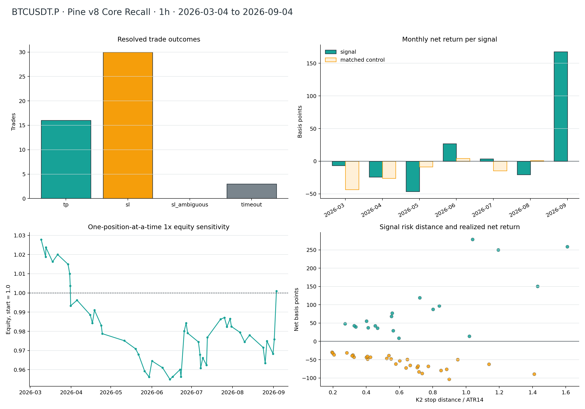
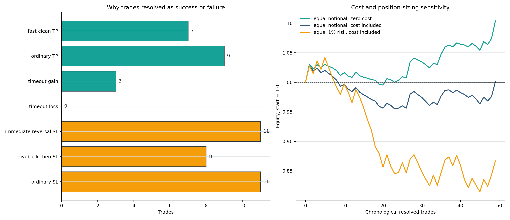
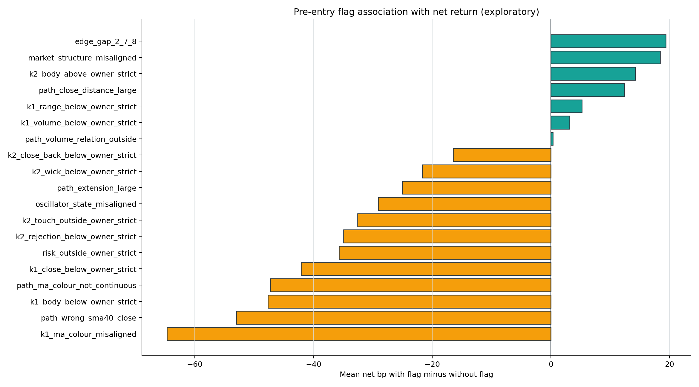

# P1：BTCUSDT.P 1h Pine v8 近半年逐笔回测（2026-09-04）

## 结论

**这套默认参数不具备可确认的稳定盈利能力，结论为 REJECT。** 2026-03-04 00:00 至
2026-09-04 03:00 UTC（右开）共出现 **49 笔**信号，全部有完整 12 小时路径：16 笔触达 3R、
30 笔击穿 K2 极值止损、3 笔超时退出；扣固定 0.2% 往返成本后，成功 19 笔、失败 30 笔，
胜率 **38.78%**。

按每笔等名义计算，毛收益均值 **+20.60bp**，扣费后只剩
**+0.60bp/笔**，profit factor **1.017**，
49 笔顺序复利 **0.10%**。这个正数没有统计资格：
单侧 sign-flip `p=0.4807`，bootstrap 95% CI
为 **[-23.31,
+27.23]bp/笔**，明显跨零。

最危险的表象是最后两笔：9 月 1 日和 3 日两笔都赢，合计贡献全期净收益的 **1139.1%**；
去掉尚未结束的 9 月，仅前 47 笔就变成 **-6.51bp/笔**、
PF **0.821**。相对 141 笔精确匹配随机入场，前 47 笔候选
虽少亏 **+8.57bp/笔**，但候选自身仍为
-6.51bp/笔，而且配对 `p=0.2829`，不能称为形态优势。



## 冻结合同与 holdout 记录

Owner 明确批准：“批准读取 2026-05-04 之后的价格”。这是当前 Pine v8 默认配置的第 1 次
holdout 使用，不是全项目所有模型的统一次数。读取前已在 git 提交 `1eb5ea4` 冻结以下合同：

- `OKX:BTCUSDT.P` / `BTC-USDT-SWAP`，原生 1H，UTC；
- Pine v8 `Core recall · 2–8`，SMA40(HL2)，多空都做，六根全局 cooldown；
- K2 收盘确认，下一根开盘入场；止损为精确 K2 低点（多）/高点（空）；
- 目标 3R，最多看 12 根；同一根同时打 TP/SL 时保守记 SL；
- 每笔毛收益减 0.2% 往返成本；不含 funding 与额外滑点；
- 三个匹配控制：同月、同 UTC 6 小时时段、同月 ATR14 五分位，复制方向、ATR 风险、3R、12h、成本。

首次运行在结果落盘前因 9 月精确控制池为空而 fail-closed。运行期补丁 `3ed2ef8` 没有放宽匹配，
也没有改任何信号/成交/收益口径：保留主交易；少于 3 个精确控制的候选明确标成 unmatched，
仅不参加配对检验。本次共有 2 笔 unmatched，正是 9 月两笔赢家。

## 数据质量

官方 OKX `history-candles` 快照从 2025-08-01 00:00 UTC 开始，以提供 1000 根振荡器预热；
最后一根是 2026-09-04 02:00 UTC，合计 9,579 根已确认 1H K 线。零重复、零缺口、零非法 OHLC、
零负成交量。原始快照只保存在实验目录，未覆盖生产缓存。

| 交叉源 | 粒度 | 重叠根数 | 首根 | 末根 | OHLC逐字一致 | 成交量差异根数 |
|---|---|---|---|---|---|---|
| data/kline_fetched/okx_BTC_USDT_SWAP_1H_9699.csv | native 1h | 8201 | 2025-08-01T00:00:00+00:00 | 2026-07-08T16:00:00+00:00 | 是 | 0 |
| data/kline_fetched/okx_BTC_USDT_SWAP_15m_42007.csv | complete UTC 15m groups to 1h | 9076 | 2025-08-01T00:00:00+00:00 | 2026-08-14T03:00:00+00:00 | 是 | 1 |
| experiments/active/exp-1h-okx-model-first-standing-top10-20260904-v1/results/candles/BTC_USDT_SWAP.csv | native 1h | 396 | 2026-08-18T05:00:00+00:00 | 2026-09-03T16:00:00+00:00 | 是 | 0 |

15m 聚合源有 1 根成交量相差 5.78 合约，但 9,076 根重叠 OHLC 全部精确一致；信号和出场只依赖 OHLC，未受影响。

## 总体与多空拆分

“成功”定义为扣 0.2% 后净收益大于 0；不是单纯触达 TP 的别名。本窗 16 笔 TP 与 3 笔超时均为
净正，30 笔 SL 均为净负，且没有同 bar TP/SL 歧义。

| 方向 | 笔数 | 成功 | 净胜率 | 毛bp/笔 | 净bp/笔 | 净PF |
|---|---|---|---|---|---|---|
| 多 | 23 | 9 | 39.13% | +21.93 | +1.93 | 1.053 |
| 空 | 26 | 10 | 38.46% | +19.42 | -0.58 | 0.982 |

| 结局 | 笔数 | 净成功 | 净bp/笔 | 毛R/笔 | 平均持有h | 平均MFE R | 平均MAE R |
|---|---|---|---|---|---|---|---|
| TP | 16 | 16 | +104.46 | +3.00 | 4.75 | 4.54 | 0.46 |
| SL | 30 | 0 | -56.88 | -1.00 | 2.47 | 0.80 | 1.83 |
| TIMEOUT | 3 | 3 | +21.50 | +1.26 | 12.00 | 1.81 | 0.63 |

多头 23 笔与空头 26 笔都接近零；
没有哪一边单独承担全部问题。中位数是 **-38.98bp**，显著低于均值，说明均值由少数
大 TP 拉高，而多数交易是小到中等止损。

## 费用与仓位：为什么毛利看起来可以，实盘口径却不行

零成本、等名义顺序复利为 **10.40%**；加入
49×20bp 往返成本后降为 **0.10%**。K2 极值止损的
价格距离中位数只有 **0.301%**，所以 0.2% 成本
中位数相当于 **0.66R**，均值相当于 0.72R。
信号毛 R 期望是 +0.445R，扣费后变成 **-0.272R**。

如果按止损距离把每笔仓位调到固定账户风险 1%（事后仓位敏感性，不是预注册主结果），49 笔合计
**-13.35R**，复利 **-13.31%**，最大回撤
**-21.79%**。因此“等名义 +0.10%”不能外推成常见的等风险仓位系统盈利。



## 成功与失败的路径原因

这里严格区分两类“原因”：

- **机械原因**可以确定：价格何时打到 3R、何时穿过 K2 极值、是否 12 根超时；
- **形态原因**只能叫关联：K1/K2、距离、颜色、路径、振荡器和结构字段都在入场前可见，但 49 笔历史回放不能证明它们导致成败。

19 笔成功中，7 笔是 4 小时内且 MAE≤0.5R 的快速干净 TP，9 笔是较慢 TP，3 笔没有触达 3R、
但第 12 根收盘仍覆盖成本。30 笔失败中，11 笔在前两根几乎没走出 0.5R 就反转止损；8 笔曾经
走出至少 1.5R，却未保护利润、最终全部回吐；另 11 笔为普通止损。TP 平均 4.75 小时，SL 平均
2.47 小时——失败通常比成功更快暴露。

## K1→K2 距离

距离 2–8 全部按原样报告，没有根据本次结果选择“最佳 gap”。gap=8 三笔全败，但样本只有 3；
gap=2 的均值最高，也只有 11 笔且被大赢家影响。边缘 gap 2/7/8 合并后反而比 3–6 好约 19.4bp，
这与“只收紧到 3–6”并不一致，所以本窗不能支持直接改默认范围。

| gap | n | 成功 | 胜率 | 毛bp/笔 | 净bp/笔 | TP | SL | 超时 |
|---|---|---|---|---|---|---|---|---|
| 2 | 11 | 5 | 45.45% | +61.49 | +41.49 | 5 | 6 | 0 |
| 3 | 12 | 3 | 25.00% | +13.82 | -6.18 | 2 | 9 | 1 |
| 4 | 5 | 1 | 20.00% | -5.48 | -25.48 | 1 | 4 | 0 |
| 5 | 6 | 3 | 50.00% | +9.34 | -10.66 | 2 | 3 | 1 |
| 6 | 3 | 2 | 66.67% | +34.77 | +14.77 | 2 | 1 | 0 |
| 7 | 9 | 5 | 55.56% | +18.40 | -1.60 | 4 | 4 | 1 |
| 8 | 3 | 0 | 0.00% | -43.75 | -63.75 | 0 | 3 | 0 |

## 月份与稳定性

3–8 月六个分段只有 6 月、7 月为正；5 月 5 笔全败。9 月只覆盖 3 天零 6 小时，两笔都赢，不能与
完整月份等权看待，更不能用这两笔宣称策略刚刚“变好了”。

| 月 | n | 多/空 | TP/SL/超时 | 净胜率 | 候选净bp | 对照净bp | 候选-对照bp |
|---|---|---|---|---|---|---|---|
| 2026-03 | 9 | 5/4 | 3/6/0 | 33.33% | -6.82 | -43.51 | +36.69 |
| 2026-04 | 6 | 2/4 | 2/4/0 | 33.33% | -24.41 | -26.23 | +1.83 |
| 2026-05 | 5 | 2/3 | 0/5/0 | 0.00% | -46.51 | -8.57 | -37.94 |
| 2026-06 | 9 | 2/7 | 3/4/2 | 55.56% | +26.70 | +4.13 | +22.56 |
| 2026-07 | 11 | 7/4 | 4/6/1 | 45.45% | +3.44 | -14.60 | +18.04 |
| 2026-08 | 7 | 4/3 | 2/5/0 | 28.57% | -20.53 | +0.96 | -21.49 |
| 2026-09 | 2 | 1/1 | 2/0/0 | 100.00% | +167.71 | 无精确对照 | — |

## 入场前形态关联：颜色是最明显的线索，但还不是可用过滤器

19 个冻结标签全部一起审计并做 Holm 多重比较校正。最强原始信号是 **K1 均线色反向**：反向组
3/16 成功、均值 -42.97bp；对齐组 16/33 成功、均值 +21.73bp，差 -64.70bp。其次是中间路径有
收盘落到错误 SMA40 一侧，均值差 -53.00bp。它们符合 Owner 对 K 线颜色和均线侧连续性的直觉。

但这两项的收益置换原始 `p` 分别约 0.0156、0.0436；在同时看 19 项后 Holm `p` 变为 0.2966、
0.7843，**没有任何标签通过 0.01**。所以只能把 K1 颜色对齐和中间路径连续性列为下一份全新数据的
预注册候选，不能在本快照上勾选过滤后再把改善当样本外结果。振荡器失配出现在 41/49 笔，几乎没有
区分度；结构未对齐组反而表面更好，说明不能机械叠加所有“看起来正确”的门。

| 冻结标签（有/无） | n有/无 | 胜率有/无 | 净bp有/无 | 差值bp | 原始置换p | Holm p |
|---|---|---|---|---|---|---|
| K1均线色反向 | 16/33 | 18.8%/48.5% | -43.0/+21.7 | -64.7 | 0.0156 | 0.2966 |
| 中间K线收错均线侧 | 19/30 | 26.3%/46.7% | -31.9/+21.2 | -53.0 | 0.0436 | 0.7843 |
| K1实体占比<0.65 | 16/33 | 18.8%/48.5% | -31.5/+16.2 | -47.7 | 0.0833 | 1.0000 |
| 中间均线色不连续 | 9/40 | 22.2%/42.5% | -38.0/+9.3 | -47.3 | 0.1561 | 1.0000 |
| K1方向收盘位置<0.85 | 33/16 | 33.3%/50.0% | -13.1/+29.0 | -42.1 | 0.1286 | 1.0000 |
| 开盘止损距离不在0.25–2.00ATR | 3/46 | 0.0%/41.3% | -32.9/+2.8 | -35.7 | 0.5239 | 1.0000 |
| K2拒绝收盘<0.65 | 28/21 | 32.1%/47.6% | -14.4/+20.6 | -34.9 | 0.1867 | 1.0000 |
| K2踩线深度不在0.10–1.00ATR | 16/33 | 25.0%/45.5% | -21.3/+11.2 | -32.6 | 0.2424 | 1.0000 |
| 振荡器序列未对齐 | 41/8 | 36.6%/50.0% | -4.2/+25.0 | -29.1 | 0.4178 | 1.0000 |
| 回踩前延伸>1.00ATR | 13/36 | 38.5%/38.9% | -17.8/+7.2 | -25.0 | 0.4059 | 1.0000 |
| K2拒绝影线<0.60 | 34/15 | 35.3%/46.7% | -6.0/+15.6 | -21.6 | 0.4523 | 1.0000 |
| K2收回均线<0.25ATR | 18/31 | 38.9%/38.7% | -9.8/+6.6 | -16.5 | 0.5510 | 1.0000 |
| K2/K1量比不在0.50–1.50 | 27/22 | 44.4%/31.8% | +0.8/+0.4 | +0.3 | 0.9897 | 1.0000 |
| K1量比<1.25 | 16/33 | 37.5%/39.4% | +2.7/-0.4 | +3.2 | 0.9105 | 1.0000 |
| K1振幅<1.25ATR | 17/32 | 47.1%/34.4% | +4.0/-1.2 | +5.3 | 0.8507 | 1.0000 |
| K2-K1收盘距离>0.75ATR | 5/44 | 60.0%/36.4% | +11.7/-0.7 | +12.4 | 0.7902 | 1.0000 |
| K2实体占比>0.35 | 13/36 | 38.5%/38.9% | +11.1/-3.2 | +14.3 | 0.6377 | 1.0000 |
| 10/10结构方向未对齐 | 28/21 | 46.4%/28.6% | +8.5/-9.9 | +18.4 | 0.4918 | 1.0000 |
| 边缘间距2/7/8 | 23/26 | 43.5%/34.6% | +10.9/-8.5 | +19.4 | 0.4676 | 1.0000 |



## 匹配随机对照与经济门

47 笔有足够精确对照，每笔 3 个，共 141 笔；9 月两笔因部分月份且信号排除半径覆盖可用行而没有
精确对照。没有借用别月、放宽 ATR 桶或缩小禁入区凑数。

| 口径 | n | 胜率 | 毛bp/笔 | 净bp/笔 | 净PF |
|---|---|---|---|---|---|
| 全部候选 | 49 | 38.78% | +20.60 | +0.60 | 1.017 |
| 有精确对照的候选 | 47 | 36.17% | +13.49 | -6.51 | 0.821 |
| 精确匹配随机对照 | 141 | 29.08% | +4.92 | -15.08 | 0.603 |

| 门 | 结果 | 判定 |
|---|---|---|
| 候选扣费均值 > 0 | +0.60bp | 仅数值通过 |
| 绝对收益 sign-flip p < 0.01 | p=0.4807 | 失败 |
| 候选 - 对照 > 0 | +8.57bp | 数值通过 |
| 配对 sign-flip p < 0.01 | p=0.2829 | 失败 |
| 时间稳定 | 3–8 月仅 6、7 月为正；9 月为部分月 | 失败 |
| 等风险 1% 仓位 | -13.31% | 失败 |
| 总判定 | 没有稳健、可复现的扣费优势 | REJECT |

## AUC、top-decile 与单特征基线

AUC 与 top-decile 按预注册记为**不适用**：本轮回放的是一个布尔阈值指标，没有预注册按 score 排序
或选择 top-decile 的交易臂；事后拿图上的 `anchor_score` 排序会把这次 holdout 变成调参集。单特征
基线采用 Owner 明确强调、且读取前已冻结的 `K1 MA colour aligned` 二分诊断：对齐组 +21.73bp/笔，
反向组 -42.97bp/笔，但 Holm `p=0.2966`，只能作为下一批数据要验证的假设，不能据此修改当前指标。

## 逐笔成功明细（19 笔）

`MFE/MAE` 是入场后的最大有利/不利波动，以该笔 K2 止损距离为 1R。最后一列是入场前冻结标签，
只是解释线索；真正决定该笔成功的是倒数第二列记录的价格路径。

| # | 入场(CST) | 向 | gap | 风险ATR | 结局 | 持有h | MFE/MAE R | 净bp | 机械成功/失败原因 | 入场前冻结诊断 |
|---|---|---|---|---|---|---|---|---|---|---|
| 1 | 2026-03-09 16:00 | 多 | 2 | 1.04 | TP | 12 | 3.04/0.33 | +278.38 | 第12根触达3R；途中MFE 3.04R、MAE 0.33R | 边缘间距2/7/8；K1方向收盘位置<0.85；K2拒绝影线<0.60；K2实体占比>0.35；振荡器序列未对齐；10/10结构方向未对齐 |
| 3 | 2026-03-13 07:00 | 多 | 7 | 0.27 | TP | 1 | 3.64/0.10 | +47.93 | 第1根触达3R；最大逆向仅0.10R，属快速干净推进 | 边缘间距2/7/8；K1方向收盘位置<0.85；K2拒绝影线<0.60；K2实体占比>0.35；K2拒绝收盘<0.65；K2收回均线<0.25ATR；中间K线收错均线侧；K2/K1量比不在0.50–1.50；振荡器序列未对齐；10/10结构方向未对齐 |
| 5 | 2026-03-22 03:00 | 空 | 2 | 0.41 | TP | 5 | 13.81/0.81 | +37.00 | 第5根触达3R；途中MFE 13.81R、MAE 0.81R | 边缘间距2/7/8；K1振幅<1.25ATR；K1方向收盘位置<0.85；K2拒绝影线<0.60；K2实体占比>0.35；K2拒绝收盘<0.65；K2/K1量比不在0.50–1.50；振荡器序列未对齐 |
| 10 | 2026-04-05 19:00 | 空 | 5 | 0.56 | TP | 2 | 3.27/0.40 | +28.98 | 第2根触达3R；最大逆向仅0.40R，属快速干净推进 | K1实体占比<0.65；K1方向收盘位置<0.85；K1量比<1.25；K2拒绝影线<0.60；K2拒绝收盘<0.65；K2收回均线<0.25ATR；回踩前延伸>1.00ATR；10/10结构方向未对齐 |
| 13 | 2026-04-19 00:00 | 空 | 5 | 0.55 | TP | 3 | 3.37/0.22 | +68.04 | 第3根触达3R；最大逆向仅0.22R，属快速干净推进 | K1振幅<1.25ATR；K1均线色反向；K2拒绝影线<0.60；K2拒绝收盘<0.65；K2踩线深度不在0.10–1.00ATR；回踩前延伸>1.00ATR；K2/K1量比不在0.50–1.50；振荡器序列未对齐；10/10结构方向未对齐 |
| 21 | 2026-06-01 12:00 | 空 | 2 | 0.80 | TP | 3 | 3.02/0.29 | +87.35 | 第3根触达3R；最大逆向仅0.29R，属快速干净推进 | 边缘间距2/7/8；K2-K1收盘距离>0.75ATR；振荡器序列未对齐；10/10结构方向未对齐 |
| 24 | 2026-06-17 03:00 | 空 | 5 | 1.02 | TIMEOUT | 12 | 0.94/0.66 | +13.76 | 12根内TP/SL均未触发，按第12根收盘；MFE 0.94R、MAE 0.66R | K1方向收盘位置<0.85；K2踩线深度不在0.10–1.00ATR；回踩前延伸>1.00ATR；K2/K1量比不在0.50–1.50；振荡器序列未对齐；10/10结构方向未对齐 |
| 25 | 2026-06-22 17:00 | 多 | 7 | 0.34 | TP | 3 | 4.84/0.87 | +39.31 | 第3根触达3R；途中MFE 4.84R、MAE 0.87R | 边缘间距2/7/8；K1方向收盘位置<0.85；K2拒绝影线<0.60；K2拒绝收盘<0.65；K2收回均线<0.25ATR；K2-K1收盘距离>0.75ATR；中间K线收错均线侧；中间均线色不连续；K2/K1量比不在0.50–1.50；振荡器序列未对齐 |
| 27 | 2026-06-25 21:00 | 空 | 2 | 1.19 | TP | 1 | 5.77/0.24 | +249.62 | 第1根触达3R；最大逆向仅0.24R，属快速干净推进 | 边缘间距2/7/8；K1振幅<1.25ATR；K1量比<1.25；K2/K1量比不在0.50–1.50；振荡器序列未对齐 |
| 28 | 2026-06-27 07:00 | 多 | 7 | 0.45 | TIMEOUT | 12 | 1.81/0.55 | +42.25 | 12根内TP/SL均未触发，按第12根收盘；MFE 1.81R、MAE 0.55R | 边缘间距2/7/8；K1振幅<1.25ATR；K1方向收盘位置<0.85；K1均线色反向；K2拒绝影线<0.60；K2实体占比>0.35；K2收回均线<0.25ATR；中间K线收错均线侧；中间均线色不连续；K2/K1量比不在0.50–1.50；振荡器序列未对齐；10/10结构方向未对齐 |
| 33 | 2026-07-09 21:00 | 多 | 6 | 0.40 | TP | 1 | 4.06/0.60 | +55.12 | 第1根触达3R；途中MFE 4.06R、MAE 0.60R | K1振幅<1.25ATR；K2拒绝影线<0.60；K2拒绝收盘<0.65；K2-K1收盘距离>0.75ATR；K2/K1量比不在0.50–1.50；10/10结构方向未对齐 |
| 35 | 2026-07-13 09:00 | 空 | 3 | 1.43 | TP | 3 | 3.67/0.01 | +150.16 | 第3根触达3R；最大逆向仅0.01R，属快速干净推进 | K1量比<1.25；K2拒绝影线<0.60；K2拒绝收盘<0.65；K2收回均线<0.25ATR；K2踩线深度不在0.10–1.00ATR；回踩前延伸>1.00ATR；K2/K1量比不在0.50–1.50；振荡器序列未对齐；10/10结构方向未对齐 |
| 36 | 2026-07-23 09:00 | 空 | 7 | 0.84 | TP | 12 | 4.27/0.61 | +96.76 | 第12根触达3R；途中MFE 4.27R、MAE 0.61R | 边缘间距2/7/8；K1实体占比<0.65；K1振幅<1.25ATR；K1方向收盘位置<0.85；K1量比<1.25；振荡器序列未对齐；10/10结构方向未对齐 |
| 37 | 2026-07-26 06:00 | 多 | 3 | 0.60 | TIMEOUT | 12 | 2.69/0.67 | +8.48 | 12根内TP/SL均未触发，按第12根收盘；MFE 2.69R、MAE 0.67R | K1振幅<1.25ATR；K1方向收盘位置<0.85；K1均线色反向；K2拒绝影线<0.60；K2拒绝收盘<0.65；K2收回均线<0.25ATR；中间K线收错均线侧；K2/K1量比不在0.50–1.50；振荡器序列未对齐；10/10结构方向未对齐 |
| 39 | 2026-07-30 14:00 | 多 | 4 | 0.33 | TP | 4 | 4.52/0.78 | +42.56 | 第4根触达3R；途中MFE 4.52R、MAE 0.78R | K1方向收盘位置<0.85；K1量比<1.25；K2拒绝影线<0.60；K2拒绝收盘<0.65；K2收回均线<0.25ATR；K2/K1量比不在0.50–1.50；振荡器序列未对齐；10/10结构方向未对齐 |
| 43 | 2026-08-14 07:00 | 空 | 7 | 0.47 | TP | 8 | 5.00/0.83 | +35.89 | 第8根触达3R；途中MFE 5.00R、MAE 0.83R | 边缘间距2/7/8；K2踩线深度不在0.10–1.00ATR；回踩前延伸>1.00ATR；K2/K1量比不在0.50–1.50；振荡器序列未对齐 |
| 46 | 2026-08-27 10:00 | 多 | 2 | 0.72 | TP | 7 | 3.09/0.84 | +118.91 | 第7根触达3R；途中MFE 3.09R、MAE 0.84R | 边缘间距2/7/8；K1实体占比<0.65；K1振幅<1.25ATR；K1方向收盘位置<0.85；K1量比<1.25；K2拒绝影线<0.60；K2实体占比>0.35；中间K线收错均线侧；振荡器序列未对齐；10/10结构方向未对齐 |
| 48 | 2026-09-01 23:00 | 空 | 6 | 0.56 | TP | 2 | 3.43/0.00 | +76.95 | 第2根触达3R；最大逆向仅0.00R，属快速干净推进 | 无冻结弱点标签 |
| 49 | 2026-09-03 14:00 | 多 | 3 | 1.61 | TP | 9 | 3.84/0.47 | +258.47 | 第9根触达3R；途中MFE 3.84R、MAE 0.47R | 无冻结弱点标签 |

## 逐笔失败明细（30 笔）

| # | 入场(CST) | 向 | gap | 风险ATR | 结局 | 持有h | MFE/MAE R | 净bp | 机械成功/失败原因 | 入场前冻结诊断 |
|---|---|---|---|---|---|---|---|---|---|---|
| 2 | 2026-03-13 01:00 | 多 | 6 | 0.74 | SL | 2 | 0.36/1.21 | -87.76 | 第2根突破K2极值止损；此前最多仅0.36R，属入场后立即反转 | K1振幅<1.25ATR；K1方向收盘位置<0.85；K1量比<1.25；中间K线收错均线侧；振荡器序列未对齐；10/10结构方向未对齐 |
| 4 | 2026-03-18 07:00 | 多 | 8 | 0.64 | SL | 1 | 0.25/1.12 | -72.78 | 第1根突破K2极值止损；此前最多仅0.25R，属入场后立即反转 | 边缘间距2/7/8；K1均线色反向；K2拒绝影线<0.60；K2实体占比>0.35；K2拒绝收盘<0.65；K2收回均线<0.25ATR；中间K线收错均线侧；K2/K1量比不在0.50–1.50；振荡器序列未对齐 |
| 6 | 2026-03-30 00:00 | 空 | 2 | 0.65 | SL | 5 | 1.91/1.36 | -49.73 | 先走出1.91R，随后全部回吐并于第5根击穿K2极值 | 边缘间距2/7/8；K1振幅<1.25ATR；K1方向收盘位置<0.85；K1均线色反向；K2拒绝影线<0.60；K2拒绝收盘<0.65；K2收回均线<0.25ATR；中间K线收错均线侧；中间均线色不连续；振荡器序列未对齐 |
| 7 | 2026-03-31 06:00 | 空 | 4 | 0.41 | SL | 1 | 0.71/1.02 | -48.75 | 第1根突破K2极值止损；此前MFE 0.71R、MAE 1.02R | K1实体占比<0.65；K1方向收盘位置<0.85；K1均线色反向；K2拒绝影线<0.60；K2实体占比>0.35；K2拒绝收盘<0.65；回踩前延伸>1.00ATR；K2/K1量比不在0.50–1.50；振荡器序列未对齐；10/10结构方向未对齐 |
| 8 | 2026-03-31 16:00 | 多 | 7 | 0.58 | SL | 1 | 0.50/2.46 | -61.98 | 第1根突破K2极值止损；此前MFE 0.50R、MAE 2.46R | 边缘间距2/7/8；K1实体占比<0.65；K1量比<1.25；K1均线色反向；K2拒绝收盘<0.65；K2踩线深度不在0.10–1.00ATR；回踩前延伸>1.00ATR；振荡器序列未对齐 |
| 9 | 2026-04-01 00:00 | 空 | 7 | 0.90 | SL | 1 | 0.02/2.31 | -103.67 | 第1根突破K2极值止损；此前最多仅0.02R，属入场后立即反转 | 边缘间距2/7/8；回踩前延伸>1.00ATR；中间K线收错均线侧；振荡器序列未对齐 |
| 11 | 2026-04-15 19:00 | 空 | 5 | 0.88 | SL | 2 | 0.00/1.48 | -76.50 | 第2根突破K2极值止损；此前最多仅0.00R，属入场后立即反转 | K1实体占比<0.65；K1振幅<1.25ATR；K1方向收盘位置<0.85；K1量比<1.25；K1均线色反向；K2拒绝影线<0.60；K2踩线深度不在0.10–1.00ATR；回踩前延伸>1.00ATR；10/10结构方向未对齐 |
| 12 | 2026-04-17 10:00 | 多 | 7 | 0.33 | SL | 1 | 0.42/1.17 | -43.29 | 第1根突破K2极值止损；此前最多仅0.42R，属入场后立即反转 | 边缘间距2/7/8；K1量比<1.25；K2拒绝影线<0.60；K2实体占比>0.35；K2拒绝收盘<0.65；K2踩线深度不在0.10–1.00ATR |
| 14 | 2026-04-24 03:00 | 空 | 2 | 0.85 | SL | 4 | 0.17/1.43 | -79.73 | 第4根突破K2极值止损；此前MFE 0.17R、MAE 1.43R | 边缘间距2/7/8；K1实体占比<0.65；K1振幅<1.25ATR；K1方向收盘位置<0.85；K1量比<1.25；K1均线色反向；K2踩线深度不在0.10–1.00ATR；K2-K1收盘距离>0.75ATR；回踩前延伸>1.00ATR；K2/K1量比不在0.50–1.50；振荡器序列未对齐；10/10结构方向未对齐 |
| 15 | 2026-04-24 22:00 | 多 | 2 | 0.40 | SL | 1 | 0.00/2.21 | -43.96 | 第1根突破K2极值止损；此前最多仅0.00R，属入场后立即反转 | 边缘间距2/7/8；K1方向收盘位置<0.85；K2拒绝影线<0.60；K2拒绝收盘<0.65；K2踩线深度不在0.10–1.00ATR；振荡器序列未对齐 |
| 16 | 2026-05-11 14:00 | 空 | 2 | 0.32 | SL | 1 | 0.58/1.50 | -37.58 | 第1根突破K2极值止损；此前MFE 0.58R、MAE 1.50R | 边缘间距2/7/8；K1方向收盘位置<0.85；K2拒绝收盘<0.65；K2收回均线<0.25ATR；K2踩线深度不在0.10–1.00ATR；K2/K1量比不在0.50–1.50；振荡器序列未对齐；10/10结构方向未对齐 |
| 17 | 2026-05-20 02:00 | 空 | 3 | 0.43 | SL | 2 | 0.64/1.25 | -43.37 | 第2根突破K2极值止损；此前MFE 0.64R、MAE 1.25R | K1实体占比<0.65；K1方向收盘位置<0.85；K2拒绝影线<0.60；K2拒绝收盘<0.65；K2收回均线<0.25ATR；K2-K1收盘距离>0.75ATR；中间K线收错均线侧；K2/K1量比不在0.50–1.50；振荡器序列未对齐 |
| 18 | 2026-05-22 07:00 | 多 | 5 | 0.19 | SL | 1 | 1.64/1.30 | -29.85 | 先走出1.64R，随后全部回吐并于第1根击穿K2极值 | K1方向收盘位置<0.85；K2拒绝影线<0.60；K2拒绝收盘<0.65；K2收回均线<0.25ATR；K2踩线深度不在0.10–1.00ATR；开盘止损距离不在0.25–2.00ATR；中间K线收错均线侧；K2/K1量比不在0.50–1.50；振荡器序列未对齐 |
| 19 | 2026-05-26 22:00 | 多 | 3 | 1.41 | SL | 2 | 1.63/1.79 | -89.63 | 先走出1.63R，随后全部回吐并于第2根击穿K2极值 | K1方向收盘位置<0.85；K1均线色反向；K2拒绝影线<0.60；K2收回均线<0.25ATR；K2踩线深度不在0.10–1.00ATR；中间K线收错均线侧；中间均线色不连续；振荡器序列未对齐 |
| 20 | 2026-05-30 07:00 | 空 | 4 | 0.20 | SL | 2 | 1.90/1.12 | -32.13 | 先走出1.90R，随后全部回吐并于第2根击穿K2极值 | K1方向收盘位置<0.85；K1均线色反向；K2拒绝影线<0.60；K2拒绝收盘<0.65；K2收回均线<0.25ATR；开盘止损距离不在0.25–2.00ATR；中间K线收错均线侧；中间均线色不连续；K2/K1量比不在0.50–1.50；振荡器序列未对齐；10/10结构方向未对齐 |
| 22 | 2026-06-09 12:00 | 空 | 3 | 0.21 | SL | 1 | 1.15/5.27 | -36.80 | 第1根突破K2极值止损；此前MFE 1.15R、MAE 5.27R | K1方向收盘位置<0.85；K2拒绝影线<0.60；K2拒绝收盘<0.65；K2收回均线<0.25ATR；K2踩线深度不在0.10–1.00ATR；开盘止损距离不在0.25–2.00ATR；K2/K1量比不在0.50–1.50；振荡器序列未对齐；10/10结构方向未对齐 |
| 23 | 2026-06-15 01:00 | 空 | 2 | 1.14 | SL | 5 | 0.96/6.50 | -62.64 | 第5根突破K2极值止损；此前MFE 0.96R、MAE 6.50R | 边缘间距2/7/8；K1方向收盘位置<0.85；K2/K1量比不在0.50–1.50；振荡器序列未对齐；10/10结构方向未对齐 |
| 26 | 2026-06-23 10:00 | 空 | 3 | 0.32 | SL | 1 | 0.92/1.01 | -39.49 | 第1根突破K2极值止损；此前MFE 0.92R、MAE 1.01R | K1实体占比<0.65；K1方向收盘位置<0.85；K2拒绝影线<0.60；K2拒绝收盘<0.65；K2踩线深度不在0.10–1.00ATR；振荡器序列未对齐；10/10结构方向未对齐 |
| 29 | 2026-06-28 11:00 | 空 | 3 | 0.60 | SL | 6 | 1.99/2.03 | -53.10 | 先走出1.99R，随后全部回吐并于第6根击穿K2极值 | K1实体占比<0.65；K1振幅<1.25ATR；K1方向收盘位置<0.85；K1量比<1.25；K2拒绝影线<0.60；K2收回均线<0.25ATR；中间K线收错均线侧；10/10结构方向未对齐 |
| 30 | 2026-07-06 14:00 | 多 | 8 | 0.52 | SL | 2 | 0.26/1.33 | -46.87 | 第2根突破K2极值止损；此前最多仅0.26R，属入场后立即反转 | 边缘间距2/7/8；K1实体占比<0.65；K1方向收盘位置<0.85；K2拒绝影线<0.60；K2实体占比>0.35；K2拒绝收盘<0.65；回踩前延伸>1.00ATR |
| 31 | 2026-07-07 20:00 | 多 | 5 | 0.77 | SL | 2 | 1.57/1.39 | -68.41 | 先走出1.57R，随后全部回吐并于第2根击穿K2极值 | K1实体占比<0.65；K1振幅<1.25ATR；K1方向收盘位置<0.85；K1量比<1.25；K1均线色反向；K2拒绝影线<0.60；中间K线收错均线侧；中间均线色不连续；振荡器序列未对齐 |
| 32 | 2026-07-08 07:00 | 多 | 8 | 0.71 | SL | 3 | 0.70/1.95 | -71.61 | 第3根突破K2极值止损；此前MFE 0.70R、MAE 1.95R | 边缘间距2/7/8；K1实体占比<0.65；K1均线色反向；K2拒绝影线<0.60；回踩前延伸>1.00ATR；K2/K1量比不在0.50–1.50；振荡器序列未对齐 |
| 34 | 2026-07-12 17:00 | 空 | 4 | 0.54 | SL | 4 | 1.80/1.35 | -38.98 | 先走出1.80R，随后全部回吐并于第4根击穿K2极值 | K1方向收盘位置<0.85；K1量比<1.25；K2拒绝影线<0.60；K2实体占比>0.35；K2拒绝收盘<0.65；K2踩线深度不在0.10–1.00ATR；回踩前延伸>1.00ATR；振荡器序列未对齐；10/10结构方向未对齐 |
| 38 | 2026-07-28 04:00 | 多 | 3 | 0.55 | SL | 2 | 0.39/1.02 | -48.14 | 第2根突破K2极值止损；此前最多仅0.39R，属入场后立即反转 | K1方向收盘位置<0.85；K1均线色反向；K2拒绝影线<0.60；K2实体占比>0.35；K2拒绝收盘<0.65；中间K线收错均线侧；K2/K1量比不在0.50–1.50；振荡器序列未对齐；10/10结构方向未对齐 |
| 40 | 2026-07-31 13:00 | 空 | 2 | 0.41 | SL | 2 | 0.87/1.37 | -41.24 | 第2根突破K2极值止损；此前MFE 0.87R、MAE 1.37R | 边缘间距2/7/8；K1实体占比<0.65；K1振幅<1.25ATR；K1方向收盘位置<0.85；K1均线色反向；K2拒绝影线<0.60；K2拒绝收盘<0.65；K2收回均线<0.25ATR；K2/K1量比不在0.50–1.50；振荡器序列未对齐；10/10结构方向未对齐 |
| 41 | 2026-08-07 02:00 | 多 | 3 | 0.28 | SL | 1 | 0.05/3.29 | -31.50 | 第1根突破K2极值止损；此前最多仅0.05R，属入场后立即反转 | K2拒绝影线<0.60；K2实体占比>0.35；K2拒绝收盘<0.65；K2踩线深度不在0.10–1.00ATR；K2/K1量比不在0.50–1.50；振荡器序列未对齐 |
| 42 | 2026-08-10 12:00 | 空 | 4 | 0.95 | SL | 3 | 0.24/1.81 | -50.10 | 第3根突破K2极值止损；此前MFE 0.24R、MAE 1.81R | K1实体占比<0.65；K1方向收盘位置<0.85；K2拒绝影线<0.60；K2实体占比>0.35；K2收回均线<0.25ATR；中间K线收错均线侧；中间均线色不连续；K2/K1量比不在0.50–1.50；振荡器序列未对齐；10/10结构方向未对齐 |
| 44 | 2026-08-24 13:00 | 空 | 3 | 0.66 | SL | 2 | 0.18/1.75 | -65.74 | 第2根突破K2极值止损；此前最多仅0.18R，属入场后立即反转 | K1量比<1.25；K1均线色反向；K2拒绝影线<0.60；K2拒绝收盘<0.65；中间K线收错均线侧；中间均线色不连续；振荡器序列未对齐 |
| 45 | 2026-08-26 02:00 | 多 | 3 | 0.72 | SL | 2 | 0.27/1.04 | -83.51 | 第2根突破K2极值止损；此前最多仅0.27R，属入场后立即反转 | K1振幅<1.25ATR；K1方向收盘位置<0.85；K2/K1量比不在0.50–1.50；振荡器序列未对齐 |
| 47 | 2026-09-01 00:00 | 多 | 7 | 0.71 | SL | 11 | 1.86/1.09 | -67.64 | 先走出1.86R，随后全部回吐并于第11根击穿K2极值 | 边缘间距2/7/8；K1实体占比<0.65；K1振幅<1.25ATR；K1量比<1.25；K2拒绝收盘<0.65；中间K线收错均线侧；中间均线色不连续；振荡器序列未对齐；10/10结构方向未对齐 |

## 完整性验证

独立验证为 **PASS（23/23）**：Pine 源码 SHA、官方快照 SHA、零缺口/非法 OHLC、三路重叠 OHLC、
K1/K2 索引、next-open、六根 cooldown、精确 K2 止损、3R、风险区间、49 笔全量重放、逐笔费用、
三个精确匹配控制、unmatched 显式排除、配对差值、信号禁入半径、结果汇总均一致。另对首/中/末三处
信号之后的 OHLCV 做大幅未来扰动，既有信号与入场仍逐字段不变。

自动测试覆盖 3R、SL、同 bar 碰撞保守记 SL、12 根 timeout、尾部 unresolved，以及 holdout/Pine
合同。当前 Pine 源 SHA256 为
`3afa39c8a3bc2d85f329f3fd553b112ef0ca68e5fdc1ff143956b6b5ced09984`。

## 风险与诚实声明

- 只有 BTC 一个品种、49 笔、一次半年窗；置信区间宽，不能泛化到别的周期或币种。
- 这是按 Pine 源码 SHA 固定的 Python 逐 bar 重放，不是 TradingView Strategy Tester 导出；两者若要做像素/事件逐根 parity，仍需 TradingView 导出事件时间。
- 1H OHLC 不知道同根内部先后顺序；合同保守按 SL 优先。本窗没有出现同 bar TP/SL，因此该假设未改变 49 笔结果。
- 费用固定 0.2%，不含 funding 与额外滑点；真实摩擦更高只会使结果更差，不能使其变好。
- 9 月两笔都是赢家且没有精确控制；报告保留它们的主结果，同时单独给出排除部分末月的敏感性。
- 等风险 1% 是结果后追加的仓位敏感性，不是另一个经预注册验证的策略臂。
- 19 个形态标签在读取前冻结，但与收益的关联仍是探索性；所有多重校正均未通过，禁止据此在同一快照调参。
- 本轮没有训练、promote、部署、ACTIVE/frozen/forward 修改、消息发送或真金下单。

## 下一步

当前默认参数应保持**研究指标**，不应宣称已获得可实盘的盈利系统。若继续，唯一干净的路径是：

1. 停止在这份 2026-03-04 至 2026-09-04 快照上选参数；它已经是用过一次的 holdout。
2. 把 `K1均线色必须同向` 与 `K1→K2中间收盘不得跨错SMA40侧` 作为下一份未见数据的两个独立候选，一次只验证一个；当前证据只够提出假设。
3. 在任何新收益验证前，先决定成交成本口径和仓位口径。当前最主要的失败不是方向完全随机，而是 0.2% 成本相对 0.30% 中位止损过重。
4. 若 Owner 要改 TP/SL、成本、严格阈值或选 gap，必须视作新配置重新预注册；不能复用本轮 p 值当确认。

## 逐笔图册

每张图四笔，K1/K2、SMA40、入场、精确止损与 3R 目标均从同一账本绘制。青/橙 K 线按
`HL2 >= SMA40` 着色，与指标的 MA Shift 蜡烛语义一致。

### 图册 1：第 1–4 笔


### 图册 2：第 5–8 笔


### 图册 3：第 9–12 笔


### 图册 4：第 13–16 笔


### 图册 5：第 17–20 笔


### 图册 6：第 21–24 笔


### 图册 7：第 25–28 笔


### 图册 8：第 29–32 笔


### 图册 9：第 33–36 笔


### 图册 10：第 37–40 笔


### 图册 11：第 41–44 笔


### 图册 12：第 45–48 笔


### 图册 13：第 49–49 笔


## 产物与哈希

| 文件 | 字节 | SHA256 |
|---|---|---|
| experiments/active/exp-btcusdtp-1h-pine-v8-sixmonth-backtest-20260904-v1/config.json | 6926 | 90ee08de9b9d5b7c795f6d68438c248a4541ed0d6f8b83fc1d96b55009e58f49 |
| experiments/active/exp-btcusdtp-1h-pine-v8-sixmonth-backtest-20260904-v1/protocol_amendment_01.json | 979 | ae0f015080615c57cf28034e3e2db23a24e76d3f182b4657b01c2c7d91a66894 |
| experiments/active/exp-btcusdtp-1h-pine-v8-sixmonth-backtest-20260904-v1/results/source_receipt.json | 969 | 6fe3a17020ef9198a763f8db57b13d4752ca3ccbf99a3122be759091884b69c0 |
| experiments/active/exp-btcusdtp-1h-pine-v8-sixmonth-backtest-20260904-v1/results/source/okx_BTC_USDT_SWAP_1H.csv.gz | 239188 | 01984275dc57b263fdeb209ee996e599a6759da8f6ade649442e1ac132ef2c04 |
| experiments/active/exp-btcusdtp-1h-pine-v8-sixmonth-backtest-20260904-v1/results/trade_ledger.csv | 88311 | 17231b982cec42852a583ba632b4a387b7cbd1d35d31a52d30079eedaa0f2e5f |
| experiments/active/exp-btcusdtp-1h-pine-v8-sixmonth-backtest-20260904-v1/results/matched_controls.csv | 47561 | 87e9d183030796aaa201be935bdb5c2e51e3488132999761dc966128a1ad9539 |
| experiments/active/exp-btcusdtp-1h-pine-v8-sixmonth-backtest-20260904-v1/results/matched_pairs.csv | 4917 | 0562d8fb6471c7b145060dcc6ca65872370071778539feab4ef7e033cd268485 |
| experiments/active/exp-btcusdtp-1h-pine-v8-sixmonth-backtest-20260904-v1/results/monthly_summary.csv | 701 | e27776102a6bfc8c8bdb9cb983805c5c436ec123b6c7f7bcbacd94597268cfda |
| experiments/active/exp-btcusdtp-1h-pine-v8-sixmonth-backtest-20260904-v1/results/causal_flag_diagnostics.csv | 4713 | cf032a7a623ec375dd1bb5fd6f5dea601fd0d680feb01a2c2c5c97958ff6b450 |
| experiments/active/exp-btcusdtp-1h-pine-v8-sixmonth-backtest-20260904-v1/results/one_position_trades.csv | 90304 | 28cb3609410069adde39450b266946a74e7ecb75f4f1a19fceb46459fe1afb2a |
| experiments/active/exp-btcusdtp-1h-pine-v8-sixmonth-backtest-20260904-v1/results/data_quality.json | 2950 | d8aa5db64b56c7f58b61ad0033c155eaf48ee7fd697a2813a501826d1bd2c88c |
| experiments/active/exp-btcusdtp-1h-pine-v8-sixmonth-backtest-20260904-v1/results/summary.json | 9510 | 19ebd95883b63583e13b3e2e4c7d638d5e60d25505f108be56a50471127dc592 |
| experiments/active/exp-btcusdtp-1h-pine-v8-sixmonth-backtest-20260904-v1/results/validation.json | 1730 | 93ef0418b6001c7bcdcd1e03ca6d12ecbff27abcb6dfda314a44882e9847a795 |
| experiments/active/exp-btcusdtp-1h-pine-v8-sixmonth-backtest-20260904-v1/results/overview.png | 222891 | 407d5f782da9c2d07cb3f337302277ff0d9a12e041e12afd5501e8e3e882435e |
| experiments/active/exp-btcusdtp-1h-pine-v8-sixmonth-backtest-20260904-v1/results/reason_diagnostics.png | 179822 | 9439892de8b6cdc640bdc79144cd192964b9b884bd3658eb2303d72672bfbccb |
| experiments/active/exp-btcusdtp-1h-pine-v8-sixmonth-backtest-20260904-v1/results/causal_flag_diagnostics.png | 139768 | c2c037d20642e7a8794eeb60b3b99ec948d221650a09eb2e89f8d0fba8762920 |
| experiments/active/exp-two-key-candle-feature-atlas-v3/pine/fable_two_key_candle_sma40_retest_v1.pine | 39592 | 3afa39c8a3bc2d85f329f3fd553b112ef0ca68e5fdc1ff143956b6b5ced09984 |

运行环境：Python 3.9.6，numpy 2.0.2，pandas 2.3.3，scipy 1.13.1。

## 从零复现

```bash
cd /Users/zhangzc/fable-trading

# 使用已冻结的官方快照；若重新拉取，字节哈希可能因交易所历史修订而变化
PYTHONPATH=. python3 scripts/backtest_two_key_candle_pine_v8_btc_1h.py
PYTHONPATH=. python3 scripts/validate_two_key_candle_pine_v8_btc_1h.py
PYTHONPATH=. python3 -m pytest -q tests/test_backtest_two_key_candle_pine_v8_btc_1h.py tests/contracts/test_registries.py

python3 scripts/build_btcusdtp_1h_pine_v8_report.py
python3 scripts/md_to_html.py \
  analysis/p1_btcusdtp_1h_pine_v8_sixmonth_backtest_20260904.md \
  --out-dir analysis/html
```
