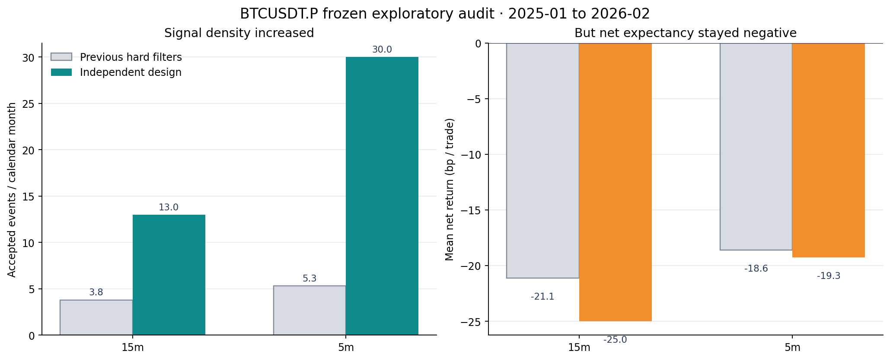
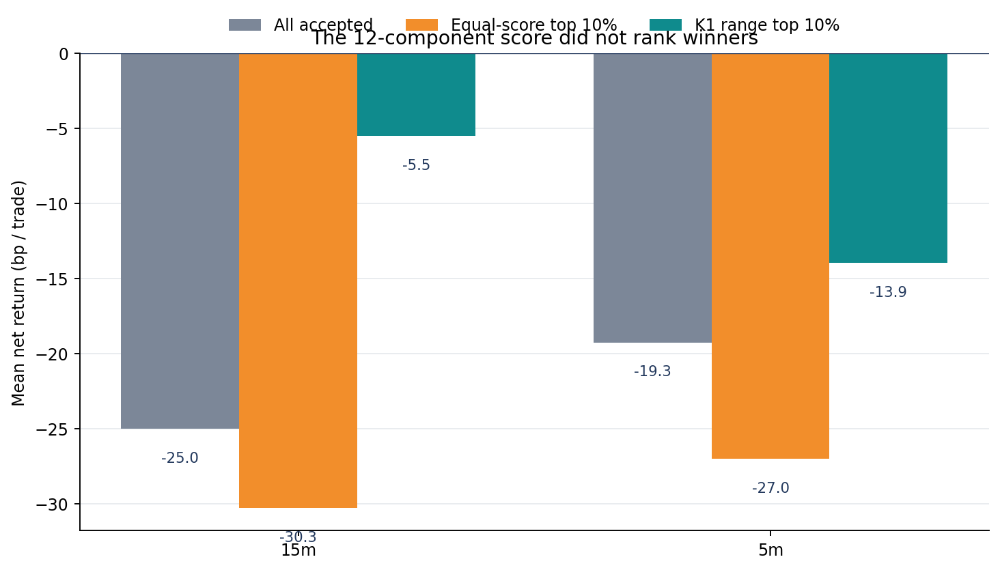
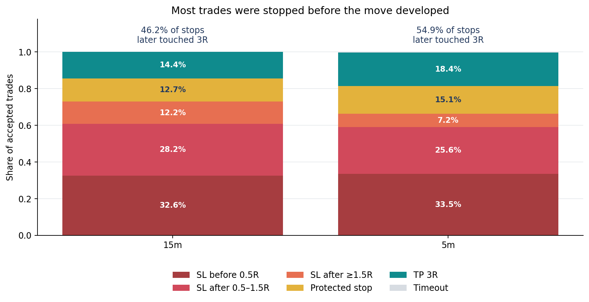
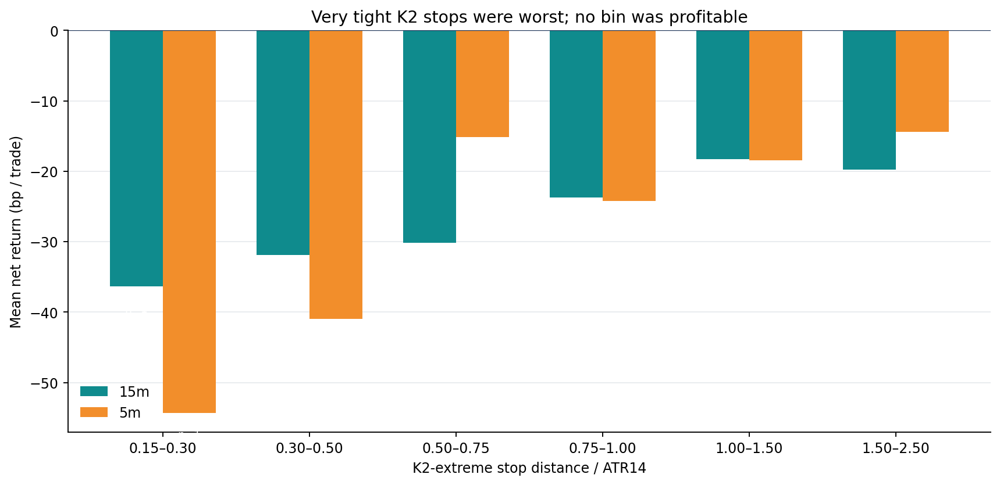

# BTCUSDT.P 15min / 5min 独立 K1→K2 研究（2026-09-04）

性质：P1、pre-holdout、两周期独立预注册开发 + 冻结探索审计。  
最终裁决：**两套都 REJECTED；信号密度问题解决了，但交易优势没有解决。**

## Executive Summary

这轮不再把 1h 参数机械缩放到小周期，而是给 15min 和 5min 各自选择均线周期、K1→K2
距离窗与形态总分。结果很清楚：15min 审计信号从 53 增至 181（3.42×），
5min 从 74 增至 418（5.65×）；但扣固定 20bp 往返成本后，
分别为 **-25.00bp/笔** 与
**-19.26bp/笔**。严格匹配随机入场后的超额也接近 0，p 值均远未过 0.01。

因此，先前“5min/15min 信号太少”的直接原因确实是把颜色、路径、实体等二级特征全部做成硬
否决；把它们改为评分后密度恢复。可交易性仍失败的主要矛盾则不是信号数量，而是 **K2 极值
止损与小周期噪声不匹配，加上形态评分没有排序力**。15min 有 46.2%、5min 有 54.9% 的止损单，
在被止损后同一冻结 12 小时路径里仍曾达到原定 3R；与此同时等权 score 的 AUC 都低于 0.5，
top-decile 反而更差。



## 这轮实际得到的两套参数

| 周期 | SMA(HL2) | K1→K2 距离 | 等权分门 | 实际时间距离 | 均线记忆 |
|---|---|---|---|---|---|
| 15m | 120 | 2–8 bars | 0.40 | 30–120 min | 30 h |
| 5m | 40 | 6–24 bars | 0.40 | 30–120 min | 3 h 20 min |

值得保留的跨周期规律是 **K1→K2 的实际时间距离都收敛到 30–120 分钟**；值得拒绝的假设是
“均线周期也应按实际时间等比例”。15min 选择 SMA120（30 小时），5min 保留 SMA40（3 小时
20 分）；5min 的 120/240/480 均线没有按预注册移动规则胜出。score floor 两边均保持最低 0.40，
说明加严总分没有产生足够收益改善。

## 交易规则（本轮冻结口径）

1. **K1：**方向实体必须从 SMA(HL2) 错侧真正贯穿到方向侧，穿越容差为 0；多头由下向上，
   空头镜像。
2. **K2：**影线必须真实触碰同一 SMA(HL2)，完整实体与收盘都留在方向侧；K2 不能用实体穿线。
3. **K1→K2：**15min 允许 2–8 根、5min 允许 6–24 根。中间 K 线站位、MA 颜色、K1/K2
   几何不再各自一票否决，而是组成 12 项等权因果 score，最低 0.40。
4. **入场：**K2 完成后的下一根开盘；多头止损为 K2 最低点，空头止损为 K2 最高点。
5. **经济门：**止损距离须在 0.15–2.50 ATR14，固定成本 0.2% 除以价格风险不得高于 1.25。
6. **出场：**3R 止盈；12 小时到期；同根同时触发按止损优先。收盘达到 1.5R 后启用覆盖手续费
   的保护止损。15min 冷却 24 根，5min 冷却 72 根，都是 6 小时。

注意：这不是当前可交易系统，而是本轮被证伪的研究合同；未写入 Pine、ACTIVE、frozen 或实盘。

## 预注册开发结果（2023–2024）

| 周期 | 交易数 | 毛收益 bp/笔 | 净收益 bp/笔 | 稳健分 bp | 最差半年 bp/笔 | 结论 |
|---|---|---|---|---|---|---|
| 15m | 345 | +6.49 | -13.51 | -16.35 | -20.54 | FAIL |
| 5m | 755 | +2.68 | -17.32 | -17.68 | -21.07 | FAIL |

| 周期 | 开发折 | n | 净 bp/笔 |
|---|---|---|---|
| 15m | 2023H1 | 89 | -7.70 |
| 15m | 2023H2 | 62 | -20.54 |
| 15m | 2024H1 | 87 | -7.91 |
| 15m | 2024H2 | 107 | -18.82 |
| 5m | 2023H1 | 180 | -21.07 |
| 5m | 2023H2 | 114 | -16.26 |
| 5m | 2024H1 | 227 | -16.91 |
| 5m | 2024H2 | 234 | -15.34 |

15min 只接受了一次单变量移动：SMA40→SMA120；5min 只接受了距离窗 2–8→6–24。两个周期的
开发均值、稳健分和最差半年都仍为负，所以开发阶段已经没有通过。之后仍按预注册合同冻结参数，
仅做一次探索审计，没有在审计结果上回头调参。

开发漏斗进一步说明“少信号”发生在哪里：

| 周期 | 核心 K1→K2 对 | 距离+score 后 | accepted | fee/risk 淘汰 | 风险过小 | 风险过大 | 冷却淘汰 |
|---|---|---|---|---|---|---|---|
| 15m | 11580 | 1661 | 345 | 936 | 118 | 6 | 256 |
| 5m | 117393 | 9343 | 755 | 7179 | 577 | 31 | 798 |

5min 最大的机械淘汰来自 fee-to-risk 门（7,179 个），本质是 K2 极值止损太近，以至固定 20bp
成本占风险过大；这不是简单把门放宽就能修复，因为放宽只会接受手续费相对风险更贵的交易。

## 冻结探索审计（2025-01-01 至 2026-02-28 16:00 UTC）

| 周期 | 交易数 | 毛收益 bp/笔 | 净收益 bp/笔 | 胜率 | PF | TP / SL / 保护 | 结论 |
|---|---|---|---|---|---|---|---|
| 15m | 181 | -5.00 | -25.00 | 26.5% | 0.292 | 26 / 132 / 23 | FAIL |
| 5m | 418 | +0.74 | -19.26 | 33.0% | 0.359 | 77 / 277 / 63 | FAIL |

分时段结果没有隐藏的稳定盈利区：

| 周期 | 审计切片 | n | 毛 bp/笔 | 净 bp/笔 | 胜率 | PF |
|---|---|---|---|---|---|---|
| 15m | 2025H1 | 80 | -12.97 | -32.97 | 21.2% | 0.157 |
| 15m | 2025H2 | 74 | +2.84 | -17.16 | 31.1% | 0.463 |
| 15m | 2026P1 | 27 | -2.85 | -22.85 | 29.6% | 0.314 |
| 5m | 2025H1 | 197 | +1.70 | -18.30 | 33.5% | 0.398 |
| 5m | 2025H2 | 150 | -0.54 | -20.54 | 34.7% | 0.292 |
| 5m | 2026P1 | 71 | +0.77 | -19.23 | 28.2% | 0.389 |

15min 三段全部净亏；5min 三段也全部净亏。5min 的毛收益仅 +0.74bp/笔，远小于冻结的 20bp
成本；15min 连毛收益也是负值。失败不是某一个月偶发拖累。

### 信号数量：改善成立，但不是 edge

| 周期 | 旧信号 n | 新信号 n | 密度倍数 | 旧/月 | 新/月 | 旧净 bp/笔 | 新净 bp/笔 |
|---|---|---|---|---|---|---|---|
| 15m | 53 | 181 | 3.42× | 3.81 | 13.00 | -21.12 | -25.00 |
| 5m | 74 | 418 | 5.65× | 5.32 | 30.03 | -18.60 | -19.26 |

“信号太少”这个问题已被定位并修复：旧逻辑把二级视觉特征当硬门，导致漏检；新逻辑保留核心
K1/K2 形态并软评分，信号密度达标。但新信号只是更多，不是更好，不能因数量提升而上线。

### 匹配随机对照：形态本身没有显著贡献

| 周期 | 策略 n | 严格匹配 n | 策略−随机 bp/笔 | 单侧符号置换 p | 判定 |
|---|---|---|---|---|---|
| 15m | 181 | 181 | +0.138 | 0.486 | 不显著 |
| 5m | 418 | 388 | -0.194 | 0.529 | 不显著 |

随机对照按同月 × UTC 六小时块 × 当月 ATR14 五分位严格匹配，并复制方向、ATR 风险距离、出场、
时限与成本；找不到完全匹配时不放宽。5min 因此只有 388/418 笔进入配对检验。15min 超额
+0.138bp、5min -0.194bp，均约等于 0；单侧符号置换 p=0.486/0.529。也就是说，当前 K1→K2
核心形态并没有优于同环境随机时点。

### 12 项评分：不是“阈值不够好”，而是没有稳定排序力

| 周期 | 排序池 n | score AUC | top10% n | top10% 毛 bp | top10% 净 bp | top10% 胜率 | 置换 p | 单特征 top10% 净 bp |
|---|---|---|---|---|---|---|---|---|
| 15m | 182 | 0.488 | 19 | -10.29 | -30.29 | 15.8% | 0.648 | -5.50 |
| 5m | 419 | 0.487 | 42 | -7.02 | -27.02 | 23.8% | 0.897 | -13.95 |



score AUC 为 0.488/0.487，等权 top-decile 的净收益降至 -30.29/-27.02bp；单独用 K1 range 排序
虽比等权 score 好，但仍为 -5.50/-13.95bp。结论不是“把 score_floor 从 0.40 调到 0.55”——
开发阶段已经逐档检查 0.40–0.70，未产生满足移动门槛的改进。需要重估二级特征的方向与交互，
而不是继续旋阈值。

以下是开发与审计相关方向的稳定性诊断；它是事后解释，不能直接变成新门：

| 周期 | 变量 | 开发 Spearman | 审计 Spearman | 同号 | 审计中高于开发 Q75 n | 该组净 bp/笔 |
|---|---|---|---|---|---|---|
| 15m | secondary_score | +0.037 | +0.033 | 是 | 45 | -34.00 |
| 15m | stop_distance_atr | -0.131 | -0.066 | 是 | 41 | -17.04 |
| 15m | gap_bars | +0.151 | +0.133 | 是 | 57 | -23.84 |
| 15m | k1_range_atr | -0.031 | -0.018 | 是 | 34 | -22.59 |
| 15m | k2_wick_share | +0.006 | +0.109 | 是 | 49 | -22.96 |
| 15m | k2_body_ratio | +0.012 | -0.088 | 否 | 55 | -23.01 |
| 15m | k2_rejection_close_location | +0.043 | -0.013 | 否 | 47 | -16.05 |
| 15m | k2_touch_depth_atr | -0.096 | -0.064 | 是 | 44 | -23.34 |
| 15m | path_close_share | -0.006 | -0.012 | 是 | 126 | -26.21 |
| 15m | path_colour_share | +0.012 | -0.061 | 否 | 124 | -28.45 |
| 5m | secondary_score | -0.012 | -0.003 | 是 | 113 | -19.38 |
| 5m | stop_distance_atr | -0.054 | -0.054 | 是 | 138 | -16.88 |
| 5m | gap_bars | +0.032 | +0.030 | 是 | 108 | -14.72 |
| 5m | k1_range_atr | -0.007 | -0.094 | 是 | 135 | -23.45 |
| 5m | k2_wick_share | +0.016 | +0.023 | 是 | 104 | -14.06 |
| 5m | k2_body_ratio | -0.017 | -0.046 | 是 | 97 | -19.29 |
| 5m | k2_rejection_close_location | +0.018 | +0.017 | 是 | 106 | -17.70 |
| 5m | k2_touch_depth_atr | +0.022 | -0.021 | 否 | 112 | -18.20 |
| 5m | path_close_share | +0.006 | +0.039 | 是 | 141 | -17.64 |
| 5m | path_colour_share | +0.005 | +0.047 | 是 | 161 | -17.38 |

若干蜡烛与路径特征换期即翻号；`stop_distance_atr` 的逐笔 Spearman 与粗分桶方向甚至不完全一致，
说明关系明显非线性且受 barrier 收益尺度影响。这解释了为什么“颜色越一致、形态越漂亮就越赚钱”
的等权先验没有成立，也不允许从这张事后表直接抄一个阈值。

## 失败交易的真正规律



| 周期 | 阶段 | n | 占比 | 平均净 bp |
|---|---|---|---|---|
| 15m | SL before 0.5R | 59 | 32.6% | -50.53 |
| 15m | SL after 0.5–1.5R | 51 | 28.2% | -47.81 |
| 15m | SL after ≥1.5R | 22 | 12.2% | -44.12 |
| 15m | Protected stop | 23 | 12.7% | +0.00 |
| 15m | TP 3R | 26 | 14.4% | +71.76 |
| 15m | Timeout | 0 | 0.0% | n/a |
| 5m | SL before 0.5R | 140 | 33.5% | -44.41 |
| 5m | SL after 0.5–1.5R | 107 | 25.6% | -46.66 |
| 5m | SL after ≥1.5R | 30 | 7.2% | -45.22 |
| 5m | Protected stop | 63 | 15.1% | +0.00 |
| 5m | TP 3R | 77 | 18.4% | +58.67 |
| 5m | Timeout | 1 | 0.2% | -1.88 |

| 周期 | 止损 n | 止损后 12h 内触 3R | 止损后触 4R / 5R / 6R | 3R 止盈 n | 止盈路径后触 4R / 5R / 6R |
|---|---|---|---|---|---|
| 15m | 132 | 61 (46.2%) | 53 / 46 / 37 | 26 | 20 / 19 / 15 |
| 5m | 277 | 152 (54.9%) | 120 / 105 / 83 | 77 | 68 / 60 / 52 |

最重要的反直觉结果是：大量交易不是方向完全错，而是先扫掉紧贴 K2 极值的止损，再沿原方向
走出目标。这里的“后来触 3R”只是在原始 12 小时 OHLC 路径上做的诊断，不是假装止损后仍持仓
的收益回测，也不证明加宽止损必然有效；但它明确指出下一项应验证 **止损/入场几何**，而不是
继续堆 K 线颜色门。

按原始 K2 止损距离分桶也一致：



| 周期 | 止损距离 ATR | n | 净 bp/笔 | 胜率 |
|---|---|---|---|---|
| 15m | 0.15–0.30 | 1 | -36.38 | 0.0% |
| 15m | 0.30–0.50 | 22 | -31.88 | 13.6% |
| 15m | 0.50–0.75 | 50 | -30.14 | 22.0% |
| 15m | 0.75–1.00 | 51 | -23.75 | 29.4% |
| 15m | 1.00–1.50 | 39 | -18.25 | 28.2% |
| 15m | 1.50–2.50 | 18 | -19.79 | 44.4% |
| 5m | 0.15–0.30 | 1 | -54.33 | 0.0% |
| 5m | 0.30–0.50 | 15 | -40.98 | 0.0% |
| 5m | 0.50–0.75 | 55 | -15.11 | 40.0% |
| 5m | 0.75–1.00 | 99 | -24.18 | 31.3% |
| 5m | 1.00–1.50 | 144 | -18.45 | 33.3% |
| 5m | 1.50–2.50 | 104 | -14.43 | 35.6% |

最紧的 <0.50 ATR 桶明显差，较宽风险桶相对改善，但所有桶仍为负。这个分桶是在冻结审计后做的
探索性归因，不能把 0.50 ATR 偷写成已验证阈值。

## 关于“盈利单止盈可以更高”

这个观察有数据支持：15min 的 26 笔 3R 止盈中，20/19/15 笔后来触及 4R/5R/6R；5min 的
77 笔中有 68/60/52 笔。也就是说，**赢家确实常有余程**。但当前更大的漏损是止损：132 笔
15min 止损和 277 笔 5min 止损中，分别 61 与 152 笔后来仍触 3R。直接把 TP 从 3R 提到 5R，
不会挽回这些已被扫出的交易，还可能把原本 3R 获利变成回撤。

正确顺序是：先单变量修复止损/入场；只有该变体在开发与新鲜验证上站住，再单独比较固定 3R、
部分 3R + runner 5R、或趋势尾仓。两者不能打包，否则无法知道收益来自哪项变化。

## 下一步建议与 Owner 决策门

建议下一实验只改一项：**K2 极值外加 ATR buffer**，候选保持为 0 / 0.10 / 0.20 / 0.30 /
0.50 ATR；K1/K2 形态、已选 MA/距离、下一根开盘、3R、12h、1.5R 保护与 0.2% 成本全部冻结。
这会改变 SL 障碍参数，按项目铁律必须由 Owner 再明确批准，不能在本轮偷偷回测。

如果 buffer 仍失败，第二个独立假设才是“等待扫 K2 极值后收回再入场”；它改变入场时机，不能与
buffer 同轮。只有止损/入场单变量通过后，才轮到提高 TP 或保留 runner。

本轮不建议：放宽 fee-to-risk 门、继续提高 score_floor、把两个周期合成一套参数、更新 TradingView
Pine、读取 2026-05-04 之后 holdout、promote 或部署。

## 数据、可复现性与审计边界

| 项目 | 值 |
|---|---|
| 合约 | OKX `BTC-USDT-SWAP`（TradingView `OKX:BTCUSDT.P`） |
| 原生源 | `data/kline_preholdout_okx_5m/okx_BTC_USDT_SWAP_5m_341567.csv` |
| SHA256 | `767f67c2b0ae5a8c83369a7cb950334e61de09edbb82a0158122c41794eed5ac` |
| 原生行数 | 341,567 根 5min |
| 源时间 | 2022-11-30T16:00:00Z ～ 2026-02-28T15:55:00Z |
| 15min 构造 | UTC 对齐、每 3 根连续 5min 聚合；不完整组丢弃 |
| 开发 | 2023-01-01 ～ 2025-01-01，四个连续半年折 |
| 探索审计 | 2025-01-01 ～ 2026-02-28 16:00 UTC，冻结后一次读取 |
| holdout | ≥2026-05-04；本轮物理读取 **0 行** |
| 成本 | 固定往返 0.2%；不含 funding，不额外模拟超过 20bp 的滑点 |
| 审计校验 | `verification.json`，22/22 checks passed |

复现命令：

```bash
cd /Users/zhangzc/fable-trading
PYTHONPATH=. python3 -m scripts.optimize_btcusdtp_k1k2_independent_timeframes --phase development
PYTHONPATH=. python3 -m scripts.optimize_btcusdtp_k1k2_independent_timeframes --phase audit
PYTHONPATH=. python3 scripts/verify_btcusdtp_k1k2_independent_timeframes.py
PYTHONPATH=. python3 scripts/build_btcusdtp_k1k2_independent_report.py
python3 scripts/md_to_html.py \
  analysis/p1_btcusdtp_k1k2_15m_5m_independent_research_20260904.md \
  --out-dir analysis/html
```

为避免覆盖冻结研究产物，独立复现前应复制实验目录并改输出路径；上列命令是原始审计轨迹。真正的
可复现证据是 config/script/source SHA、逐笔 ledger 与独立 verifier，而不是重新覆盖旧文件。

## 风险与诚实声明

- 审计期并非从未见过：前一实验已暴露过该期聚合结果。因此本报告只能叫“冻结探索审计”，不能
  冒充 untouched OOS，也没有消耗 holdout。
- 参数网格是有限的单次坐标搜索，不是全局最优；开发结果本身已失败，不能从局部较优偷换成有效。
- 交易以 OHLC barrier 模拟，同根碰撞保守按止损；没有 tick 顺序、资金费率与额外滑点。
- “止损后后来触 3R”是反事实诊断线索，不是可获得收益；新止损会改变风险金额、成本比与路径结果，
  必须重新完整回测。
- 所有收益表都同时给出固定 20bp 成本与匹配随机对照。AUC 只用于检查 score 排序，不是成功标准。
- 结果已拒绝：`training_eligible=false`、`production_eligible=false`，不改 Pine、不 promote、不下单。
