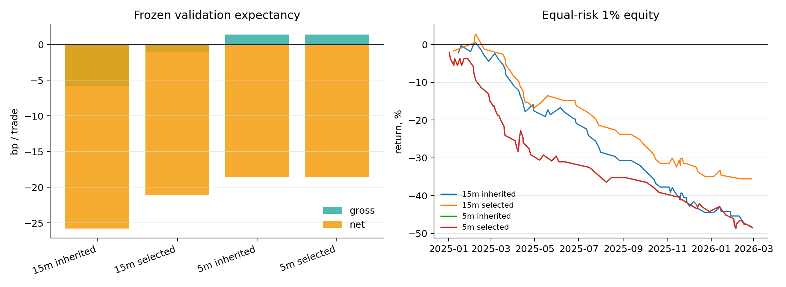
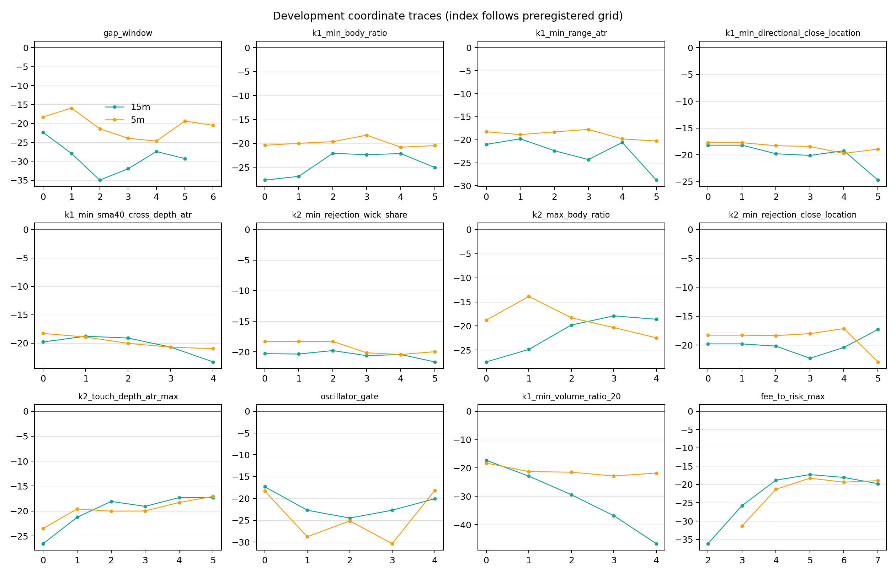

# BTCUSDT.P 15m / 5m K1→K2 独立参数优化（pre-holdout）

生成日期：2026-09-04<br>
实验：`exp-btcusdtp-k1k2-15m-5m-params-preholdout-20260904-v2`<br>
结论：**15m 与 5m 均未通过冻结验证，不可用于实盘。**

## 先说结论

这轮确实把 15m 和 5m 分开调了，不是把 1h 参数简单复制下来。结果很明确：

- **15m 有两项开发期稳定改进**：K1 最低波幅从 `0.95 ATR` 放宽到 `0.80 ATR`，K2 收盘在拒绝影线中的位置从 `0.25` 提高到 `0.65`。冻结验证相对继承版改善 `+4.66bp/笔`，但最终仍为 **-21.12bp/笔**，PF `0.403`。
- **5m 没有参数通过预注册门槛**，所以最终参数保持不变。冻结验证为 **-18.60bp/笔**，PF `0.374`。
- 修正后的匹配随机对照仅显示 15m `+4.39bp`、5m `+2.35bp` 的弱相对优势，`p=0.333/0.359`，既不显著，也远小于固定 20bp 往返成本。
- 不是“再细调一点就行”。15m 毛收益已经是 `-1.12bp/笔`，5m 也只有 `+1.40bp/笔`；即便暂时把成本拿掉，绝对方向优势仍接近零。
- 你之前说盈利单的止盈可能更高，这个观察在低周期同样成立：15m 的 8 个 3R TP 中 8 个在固定 12 小时观察窗内继续到 5R，5m 的 13 个中有 12 个继续到 5R。但这是**退出后的路径诊断**，不能拿来直接改 TP；提高 TP、分批止盈或 runner 必须另开障碍参数实验。



## 当前完整交易规则

1. 指标状态：`SMA40(HL2)`、Pine/Wilder `ATR14`、MA Shift 的 K 线颜色；所有状态只用当前已完成 K 线及之前数据。
2. K1：方向实体必须贯穿 SMA40；K1 的 MA Shift 颜色必须与方向一致；实体占比、波幅/ATR、方向收盘位置和穿越深度达到下表阈值。
3. K1→K2：间隔 2–8 根；中间每一根收盘都不能回到 SMA40 错误侧，MA Shift 颜色也必须连续在方向侧。
4. K2：必须真实用拒绝影线触碰 SMA40，SMA40 不得进入实体；K2 收盘必须回到方向侧；影线占比、实体上限、拒绝收盘位置和触线深度达到下表阈值。
5. 入场：K2 完成后的下一根开盘；多头止损为 K2 最低点，空头止损为 K2 最高点。
6. 经济门：`0.2% / 初始风险百分比 <= fee_to_risk_max`；初始风险必须在 `0.15–2.50 ATR`。
7. 出场：固定 3R；最长持有 12 小时（15m=48 根，5m=144 根）；同根 TP/SL 冲突按止损优先。
8. 保护：完成 K 线收盘达到 1.5R 后，从下一根起把止损移到覆盖 0.2% 往返成本的位置。
9. 去重：全局冷却 6 小时（15m=24 根，5m=72 根），同方向同一 K1 不重复使用。

| Parameter | 15m | 5m | Relation |
|---|---|---|---|
| gap_min_bars | 2 | 2 | same |
| gap_max_bars | 8 | 8 | same |
| k1_min_body_ratio | 0.65 | 0.65 | same |
| k1_min_range_atr | 0.8 | 0.95 | changed |
| k1_min_directional_close_location | 0.7 | 0.7 | same |
| k1_min_sma40_cross_depth_atr | -0.05 | -0.05 | same |
| k2_min_rejection_wick_share | 0.25 | 0.25 | same |
| k2_max_body_ratio | 0.5 | 0.5 | same |
| k2_min_rejection_close_location | 0.65 | 0.25 | changed |
| k2_touch_depth_atr_max | 1.5 | 1.5 | same |
| oscillator_gate | none | none | same |
| k1_min_volume_ratio_20 | None | None | same |
| fee_to_risk_max | 1.25 | 1.25 | same |

## 实验设计与数据

- 唯一底层源：OKX 官方月度 1m 归档聚合出的完整 5m K 线；SHA256 `767f67c2b0ae5a8c83369a7cb950334e61de09edbb82a0158122c41794eed5ac`。
- 物理范围：`2022-11-30T16:00:00+00:00` 至 `2026-02-28T15:55:00+00:00`；15m 由连续 3 根 5m 因果聚合。
- 开发期：2023-01-01 至 2024-12-31，四个半年折；一次按预注册顺序的 coordinate pass。
- 验证期：2025-01-01 至 2026-02-28 16:00 UTC；参数收据先提交，再首次打开验证。
- 仓库 holdout 从 2026-05-04 开始；干净 v2 的源物理截止更早，**holdout 读取 0 行**。
- 固定成本：20bp；资金费率与额外滑点未计。
- 匹配对照：同月份 × UTC 六小时块 × 月内 ATR 五分位，复制方向、风险 ATR、持有期和退出规则，每笔 3 个对照，不放宽 strata。

## 开发期选择结果

| TF | Initial n | Initial net bp | Initial robust | Final n | Final net bp | Final robust | Moved families | Eligible |
|---|---|---|---|---|---|---|---|---|
| 15m | 113 | -18.35 | -22.37 | 89 | -16.30 | -17.31 | k1_min_range_atr, k2_min_rejection_close_location | yes |
| 5m | 112 | -17.96 | -18.29 | 112 | -17.96 | -18.29 | none | no |

- **15m:** only `K1 range/ATR = 0.80` and `K2 rejection close location = 0.65` crossed the locked +2bp/worst-fold gate. Gap, candle body, wick, touch depth, oscillator colour, volume and fee/risk stayed unchanged.
- **5m:** no move was legal. The best gap trace (`[3,12]`) had robust score -15.94bp but only 11 events in its thinnest half-year versus 20 required. `K2 body <= 0.4` looked better (-13.88bp) but had only 10 in the thinnest fold. Loosening fee/risk to 2.0 reached eligibility but worsened robust score to -18.96bp, so it was correctly rejected.

开发期每一个坐标的完整轨迹如下。图中横轴是配置里锁定的网格顺序，不是连续变量拟合。



## 冻结验证

| TF | Arm | n | Gross bp | Net bp | PF | Win | Equal-risk return | Matched excess bp | paired p |
|---|---|---|---|---|---|---|---|---|---|
| 15m | Inherited | 69 | -5.79 | -25.79 | 0.293 | 24.6% | -48.2% | — | — |
| 15m | Selected | 53 | -1.12 | -21.12 | 0.403 | 28.3% | -35.6% | +4.39 | 0.333 |
| 5m | Inherited | 74 | +1.40 | -18.60 | 0.374 | 33.8% | -48.5% | — | — |
| 5m | Selected | 74 | +1.40 | -18.60 | 0.374 | 33.8% | -48.5% | +2.35 | 0.359 |

成功门要求：净收益 > 0、匹配超额 > 0 且 `p<0.01`、2025H1/H2 都 > 0。两套系统均失败。

### 时间稳定性

| TF | Slice | n | Gross bp | Net bp | PF | Win |
|---|---|---|---|---|---|---|
| 15m | 2025H1 | 23 | -11.17 | -31.17 | 0.214 | 30.4% |
| 15m | 2025H2 | 25 | +2.62 | -17.38 | 0.493 | 28.0% |
| 15m | 2026P1 | 5 | +26.40 | +6.40 | 1.308 | 20.0% |
| 5m | 2025H1 | 42 | +2.99 | -17.01 | 0.422 | 33.3% |
| 5m | 2025H2 | 18 | -4.81 | -24.81 | 0.233 | 27.8% |
| 5m | 2026P1 | 14 | +4.63 | -15.37 | 0.434 | 42.9% |

15m 的 2026P1 只有 5 笔，虽然等名义均值为 `+6.40bp`，但样本太小且等风险累计仍为负，不能覆盖两个完整 2025 半年的亏损。5m 三个切片全负。

### 匹配对照修正

冻结交易账本没有变化。初版对照误把冷却前候选当成排除中心；修正后严格按协议只围绕已接受的继承信号排除。

| TF | Old exclusion signals | Correct accepted signals | Old excess bp | Correct excess bp | Correct p |
|---|---|---|---|---|---|
| 15m | 516 | 69 | +4.62 | +4.39 | 0.333 |
| 5m | 1273 | 74 | +4.77 | +2.35 | 0.359 |

## 为什么失败

### 1. 失败首先发生在 K2 后的最初几根，而不是盈利后回吐

| TF | SL | SL <0.5R | Share | SL 0.5–1.5R | SL >=1.5R | Median stop bars | Median stop minutes | Median fee/risk R |
|---|---|---|---|---|---|---|---|---|
| 15m | 36 | 17 | 47.2% | 13 | 6 | 2.0 | 30 | 0.72 |
| 5m | 49 | 30 | 61.2% | 16 | 3 | 3.0 | 15 | 0.96 |

- 15m 有 `17/36` 个止损在到达 0.5R 前发生，止损单中位只活 2 根（30 分钟）。
- 5m 更明显：`30/49` 个止损在 0.5R 前发生，中位只活 3 根（15 分钟）。
- 这说明低周期主要病因是 **K2 触线后没有真实延续确认 + K2 极值止损处在微观噪声内**。现有 K 线颜色、振荡器颜色、成交量阈值并没有在开发期稳定地解决它。

### 2. 成本相对初始风险太大

15m 的费用中位数相当于 `0.72R`，5m 达到 `0.96R`。也就是说低周期的一次 20bp 往返成本，接近一整个初始风险单位。15m 要净零成本必须低于其毛期望，但毛期望已经为负；5m 的理论净零成本上限只有约 `1.40bp/笔`，与当前 20bp 相差一个数量级。

### 3. TP 单确实有长右尾，但单纯提高 TP 不是完整答案

| TF | 3R TP | Later hit 4R | Later hit 5R | Later hit 6R | TP horizon MFE median R | Protection armed | Protected exits |
|---|---|---|---|---|---|---|---|
| 15m | 8 | 8 | 8 | 6 | 7.96 | 16 | 9 |
| 5m | 13 | 13 | 12 | 10 | 11.81 | 23 | 12 |

右尾是真实的，但当前亏损主要来自大量早期 SL。提高 TP 只放大少数赢家；同时 1.5R 费用保护会在等待 5R 时改变退出分布。因此下一轮若获批准，应比较“固定 5R”与“3R 部分止盈 + runner”，不能只把数字 3 改成 5。

### 4. 方向和距离没有稳定规律

| TF | Side | n | Gross bp | Net bp | Win |
|---|---|---|---|---|---|
| 15m | Short | 31 | -3.28 | -23.28 | 25.8% |
| 15m | Long | 22 | +1.91 | -18.09 | 31.8% |
| 5m | Short | 42 | +5.17 | -14.83 | 35.7% |
| 5m | Long | 32 | -3.54 | -23.54 | 31.2% |

15m 多头略好，5m 却是空头略好，方向优势没有跨周期一致性；更像市场阶段 beta，而不是结构规则。

| TF | Gap bars | Clock gap | n | Gross bp | Net bp | Win |
|---|---|---|---|---|---|---|
| 15m | 2 | 30m | 11 | +8.64 | -11.36 | 45.5% |
| 15m | 3 | 45m | 9 | +18.75 | -1.25 | 33.3% |
| 15m | 4 | 60m | 8 | -22.81 | -42.81 | 12.5% |
| 15m | 5 | 75m | 6 | -11.15 | -31.15 | 33.3% |
| 15m | 6 | 90m | 5 | -17.64 | -37.64 | 20.0% |
| 15m | 7 | 105m | 5 | -24.23 | -44.23 | 0.0% |
| 15m | 8 | 120m | 9 | +15.05 | -4.95 | 33.3% |
| 5m | 2 | 10m | 23 | -3.55 | -23.55 | 34.8% |
| 5m | 3 | 15m | 13 | +2.36 | -17.64 | 38.5% |
| 5m | 4 | 20m | 9 | +10.32 | -9.68 | 44.4% |
| 5m | 5 | 25m | 8 | +10.51 | -9.49 | 50.0% |
| 5m | 6 | 30m | 7 | +6.18 | -13.82 | 14.3% |
| 5m | 7 | 35m | 9 | -0.14 | -20.14 | 22.2% |
| 5m | 8 | 40m | 5 | -12.84 | -32.84 | 20.0% |

15m 验证里 2–3 根和 8 根看起来较好、4–7 根较差；5m 里 4–5 根较好。但每格只有 5–23 笔，而且开发期并未给出同样排序，所以这些只能作为下一次预注册假设，不能回头裁掉验证亏损。

## 参数问题还是逻辑问题？

结论偏向 **逻辑问题为主、参数问题为辅**：

1. 15m 的 K2 强收盘阈值确实减少了弱拒绝，验证改善约 4.7bp/笔，说明形态参数有信息；但改善后毛期望仍负。
2. 5m 的多数参数变化要么样本不足，要么更差；现有 K1/K2 两根结构在 5m 上不足以抵抗噪声。
3. 下一条最有价值的入场逻辑实验是增加一个**因果确认条件**，例如 K2 后下一根不能重新穿回均线，再下一开盘入场；代价是更晚、更少的入场。它不是本轮参数微调，必须单独预注册。
4. K2 极值外加 ATR 缓冲、TP/runner 和更低真实成交成本都属于止损/障碍/成本假设，按项目纪律需要 owner 明确批准后才能测试。

## 风险与诚实声明

- v1 预检误信了旧 15m 文件的“物理安全”记录；加载时间戳后发现它已覆盖 holdout，信号和收益尚未计算即 fail-closed。该读取被诚实记录为 v1 未授权的配置特定 holdout 触碰 #1，v1 完全废弃。
- v2 改用物理截止 2026-02-28 的官方归档源，holdout 读取 0 行。上一份 1h 报告里“旧 15m 文件物理截止 2026-02-28”的说法也因此需要单独勘误。
- 第一遍开发选择器曾错误允许“不够样本的 incumbent”免除 +2bp 改进条件；验证尚未打开即发现。无效运行完整保存在 `results/invalid_run01/`，修正代码提交后才重跑并封存选择。
- 原验证切片的 `2026P1` 标签与对照排除中心有报告层 bug；修复器逐笔确认交易账本完全不变后只重算报告和 controls。
- 结果没有模型分数，所以 AUC、top-decile 与单特征模型基线不适用；这里用继承规则、时间折和匹配随机入场作为严格零假设对照。
- 未计资金费率和 20bp 以外滑点，真实结果只可能更差；没有训练、promote、ACTIVE/frozen/forward 变更、部署、消息或订单。

## 复现

```bash
python3 -m pytest tests/test_fetch_okx_archives.py tests/test_optimize_btcusdtp_k1k2_intraday_preholdout.py -q
python3 -m src.data.fetch_okx --symbols BTC_USDT_SWAP --bar 5m \
  --archive-monthly-start 2022-12 --archive-monthly-end 2026-02 \
  --archive-max-exclusive 2026-03-01T00:00:00Z \
  --out-dir data/kline_preholdout_okx_5m --workers 1
python3 -m scripts.optimize_btcusdtp_k1k2_intraday_preholdout --phase development
# commit results/selection_receipt.json before the next command
python3 -m scripts.optimize_btcusdtp_k1k2_intraday_preholdout --phase validation
python3 -m scripts.repair_btcusdtp_k1k2_intraday_validation_artifacts
python3 -m scripts.build_btcusdtp_k1k2_intraday_parameter_report
python3 scripts/md_to_html.py analysis/p1_btcusdtp_k1k2_15m_5m_parameter_optimization_preholdout_20260904.md --out-dir analysis/html
```

## 下一步选项（需要 owner 决策）

1. **入场确认实验（推荐）**：固定本轮所有障碍与成本，只增加 K2 后确认条款，分别在 15m/5m 开新开发实验。
2. **退出右尾实验**：批准改变障碍参数后，固定信号比较 3R、5R、3R 部分止盈 + runner。
3. **止损缓冲实验**：批准改变止损后，单变量比较 K2 极值与 K2 极值 ± 0.1/0.2 ATR；必须同时报告风险放大与仓位缩小。
4. **执行成本实验**：只有拿到真实 maker/taker 与滑点数据才重估成本；不得为了让回测转正直接把 20bp 改小。
