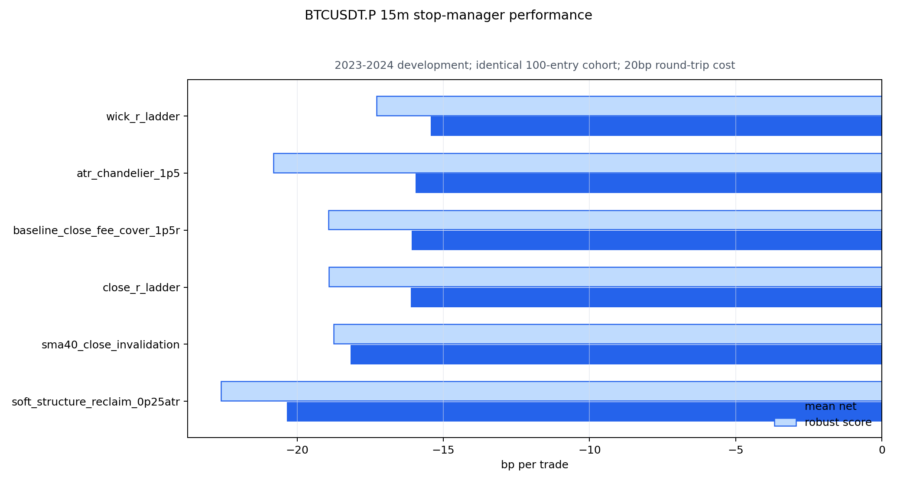
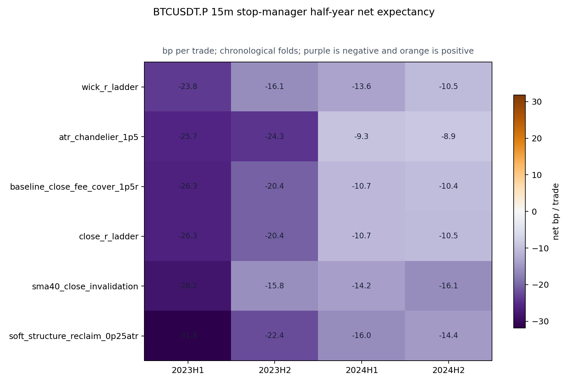
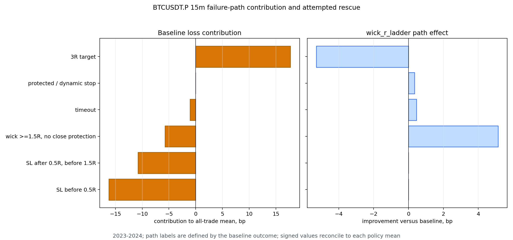
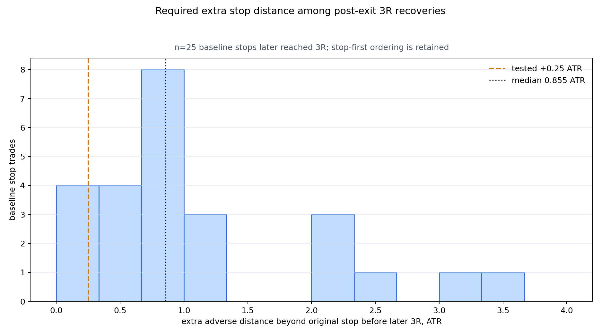

# BTCUSDT.P 15m K1→K2 动态 / 自动止损实验（2026-09-04）

性质：P1、pre-holdout、预注册单变量止损管理器对照。

最终裁决：**六种方案全部 REJECTED；保留原基线仅用于研究对照，不代表基线可交易。**

## Executive Summary

这轮没有停留在“可以试动态止损”的建议层，而是冻结同一批 100 笔 BTCUSDT.P 15m
K1→K2 入场，逐笔重放六种因果出场状态机：原始保护止损、影线 R 阶梯、收盘 R 阶梯、
1.5 ATR 吊灯、SMA40 收盘失效自动退出，以及带 0.25 ATR 灾难线的结构收复止损。
所有方案共用同一入场、原始风险单位、3R 止盈、48 根时限和 20bp 往返成本。

结果很明确：表现最好的 `wick_r_ladder` 也只有 **-15.42bp/笔**，相对基线
**-16.09bp/笔**仅改善 **+0.66bp/笔**；五候选整体校正后的配对检验
**p=0.829**，四个半年仍全部为负。其胜率由 37% 升到 46%，但 PF 从 0.529 降到
0.468，按每单初始风险 1% 复利反而由 -41.32% 变成 -43.05%。提高胜率并没有提高
收益质量。

真正的根因在止损启动之前：100 笔中有 30 笔在 MFE 尚未达到 +0.5R 时止损，单独贡献
**-16.24bp/笔**的全池损失；另有 20 笔在 +0.5R 至 +1.5R 之间止损，贡献
**-10.77bp/笔**。任何在 +1.5R 后才启动的盈利保护都无法改变这 50 笔。
影线阶梯确实从“影线到过 +1.5R、收盘未确认”的回吐单中救回 +5.13bp/笔全池贡献，
但同时把原本 3R 赢家截断，损失 -5.28bp/笔，几乎完全抵消。

“止损后后来又到 3R”也不能直接推出应该放宽止损。61 笔基线止损中，25 笔在原 12 小时
路径内后来达到 3R；但它们在反弹前还需要承受的额外逆向距离中位数是 **0.855 ATR**，
只有 4/25 能被额外 0.25 ATR 的灾难线保住。实际软止损把全部 61 笔止损单改写后，
只有 9 笔改善、52 笔恶化，净收益降至 **-20.35bp/笔**。

自动失败识别同样没有成立。使用 20 个入场时可见特征、严格扩展窗测试 78 笔后，L2
逻辑回归 AUC=0.412，深度 2 决策树 AUC=0.396，均不如训练先验基线 AUC=0.532。
因此现在不是“找一个更聪明的自动止损参数”，而是当前入场池缺少足以覆盖 20bp 成本的
即时延续优势，且现有特征暂时分不出最早失败的那一组。



## 当前交易系统的完整冻结规则

本实验没有重新调入场。下列规则来自前序两阶段 K2 合同，并按多空镜像执行。

1. **基础指标：**SMA40(HL2)；Pine/Wilder ATR14。多头要求均线方向色为多，空头完全镜像。
2. **K1 穿线：**实体从 SMA40 错侧穿到方向侧；实体占 K 线范围至少 0.65，整根范围至少
   0.80 ATR，方向收盘位置至少 0.70，穿越深度至少 -0.05 ATR。
3. **K1→触线距离：**触线 K 线须出现在 K1 后第 2–8 根；中间每根收盘及均线颜色都保持
   在方向侧。
4. **两阶段 K2：**触线深度在 0–1.50 ATR；确认 K 线拒绝影线占比至少 0.25、实体占比
   不高于 0.50、方向收盘位置至少 0.65，实体和收盘均在 SMA40 方向侧。确认可与触线同根，
   或在其后 1–2 根出现；选最早合格确认。
5. **K2 结构极值：**多头止损锚为触线至确认区间最低点，空头为最高点。这整个区间才是
   K2，不再只看一根 K 线。
6. **入场：**确认 K 线完整收盘后的下一根开盘。风险距离须在 0.15–2.50 ATR，
   `0.2% / price_risk` 不得高于 1.25。
7. **基础出场：**3R 止盈，最多持有 48 根（12 小时），超时按最后一根收盘；同一根同时
   触及止损与止盈时按止损优先。收盘达到 +1.5R 后，从下一根开始把止损抬至覆盖 0.2%
   往返成本的位置。
8. **信号选择：**15m 冷却 24 根（6 小时）；前序决策账本已经冻结最终 100 笔开发入场。
9. **成本：**每笔固定扣 20bp 往返成本；未另计 funding，也未在 20bp 之外另加滑点。

这套规则是被研究的合同，不是已获准上线的系统。动态实验没有写入 Pine、TradingView、
ACTIVE、frozen、forward 或实盘执行器。

## 本轮六个止损管理器

| 策略 | 因果规则 | 试图解决的问题 |
|---|---|---|
| Baseline | 原结构止损；收盘到 1.5R 后，下一根启用手续费保护 | 当前对照 |
| Wick R ladder | 完整 K 线的运行影线 MFE 到 1.5/2.0/2.5R 后，下一根分别锁手续费/0.5/1.0R | 冲高回吐 |
| Close R ladder | 用最佳完整收盘代替影线，阶梯相同 | 降低影线噪声 |
| ATR chandelier | 收盘到 1.5R 后，下一根按高水位减 1.5 ATR 单调跟踪，最低为手续费保护 | 趋势尾部退出 |
| SMA40 invalidation | 保留基线止损；完整收盘错失 SMA40 方向侧后，下一根开盘自动退出 | 结构失效早退 |
| Soft reclaim +0.25 ATR | 原止损变软；灾难线再放 0.25 确认 ATR。触原止损后必须收回原线且收盘仍在正确 SMA 侧，否则下一根开盘退出 | 假突破扫损 |

所有动态更新只使用已经完成的 K 线，并从下一根生效；没有用当前 K 线的最高/最低反过来改变
同根止损。障碍止损按障碍价成交，结构/SMA 失效信号按下一根开盘成交。

## 数据、切分与可复现性

| 项目 | 数值 |
|---|---|
| 原始源 | OKX BTC-USDT-SWAP 5m，本地固定 SHA256 |
| 原始行数 | 341,567 |
| 完整 UTC 15m 聚合行数 | 113,855 |
| 物理数据范围 | 2022-11-30 16:00 至 2026-02-28 15:45 UTC |
| 本轮开发评分范围 | 2023-01-01 至 2024-12-31 UTC |
| 时间折 | 2023H1 / 2023H2 / 2024H1 / 2024H2 |
| 冻结入场 | 100；各折 22 / 21 / 27 / 30 |
| 基线净盈利正例率 | 37/100 = 37.0% |
| 早期失败标签率 | 30/100 = 30.0% |
| 自动失败模型严格 OOS 样本 | 78 |
| 匹配随机对照 | 每笔 3 个；100/100 精确匹配 |
| 2025–2026-02 审计结果读取 | 0 |
| 仓库 holdout（≥2026-05-04）读取 | 0 |

基线与前序交易账本做到 100/100 setup key 完全一致，净收益最大绝对误差
`9.93e-17`，退出价最大误差 `1.46e-11`，结果类别不一致为 0。因此本轮差异来自止损管理器，
不是偷偷换了信号或成交定义。

## 主结果：没有一种止损让期望转正

| 策略 | n | 毛 bp/笔 | 净 bp/笔 | 稳健分 bp | 最差半年 bp | 胜率 | PF | 1% 风险复利 | 最大回撤 |
|---|---:|---:|---:|---:|---:|---:|---:|---:|---:|
| Baseline | 100 | +3.91 | **-16.09** | -18.93 | -26.33 | 37% | 0.529 | -41.32% | -41.54% |
| Wick R ladder | 100 | +4.58 | **-15.42** | -17.28 | -23.77 | 46% | 0.468 | -43.05% | -43.26% |
| Close R ladder | 100 | +3.89 | **-16.11** | -18.91 | -26.29 | 37% | 0.528 | -41.32% | -41.55% |
| ATR chandelier | 100 | +4.05 | **-15.95** | -20.81 | -25.73 | 37% | 0.533 | -41.66% | -41.88% |
| SMA40 invalidation | 100 | +1.84 | **-18.16** | -18.75 | -28.17 | 32% | 0.452 | -44.03% | -44.25% |
| Soft reclaim +0.25 ATR | 100 | -0.35 | **-20.35** | -22.61 | -31.82 | 37% | 0.470 | -48.67% | -48.67% |

`robust_score` 为四个时间折净收益均值减去折间离散惩罚。六种方案、四个半年，共 24 个
`policy × half-year` 单元的净收益全部小于 0；不是单个坏月份拖累。



### 相对基线与多重比较

| 候选 | 改变交易 | 改善 / 恶化 | 相对基线 bp/笔 | familywise 单侧 p | 裁决 |
|---|---:|---:|---:|---:|---|
| Wick R ladder | 24 | 14 / 10 | +0.661 | 0.829 | FAIL |
| Close R ladder | 2 | 1 / 1 | -0.029 | 0.995 | FAIL |
| ATR chandelier | 7 | 5 / 2 | +0.139 | 0.922 | FAIL |
| SMA40 invalidation | 24 | 19 / 5 | -2.079 | 1.000 | FAIL |
| Soft reclaim +0.25 ATR | 61 | 9 / 52 | -4.267 | 1.000 | FAIL |

familywise p 值来自 100,000 次配对 max-stat sign-flip，已同时校正五个候选。即使只看最好
观察值，+0.661bp 也远低于预注册的稳健改善至少 +5bp，更没有把净收益、稳健分或最差折
带到正区间。

### 严格匹配随机对照

随机入场按同月 × UTC 六小时块 × 当月 ATR14 五分位精确匹配，复制方向、原止损 ATR 距离、
对应止损管理器、3R、48 根时限和 20bp 成本。每笔选 3 个控制，并排除任一前序信号附近
49 根的时点；找不到完全匹配时不得放宽。本轮 100/100 笔都完成精确匹配。

| 策略 | 策略−匹配随机 bp/笔 | 单侧配对 p | 解释 |
|---|---:|---:|---|
| Baseline | -0.457 | 0.529 | 形态不优于同环境随机时点 |
| Wick R ladder | +1.513 | 0.402 | 正但不显著，且自身仍净亏 |
| Close R ladder | -0.972 | 0.559 | 不优于随机 |
| ATR chandelier | -0.597 | 0.537 | 不优于随机 |
| SMA40 invalidation | -0.806 | 0.559 | 不优于随机 |
| Soft reclaim +0.25 ATR | -4.868 | 0.761 | 明显方向不利但亦未作反向宣称 |

早期实现只排除了“最终接受”的信号，导致部分被拒绝前序信号附近仍能进入控制池；那会让
控制组不再是真正的非信号时点。本轮在出结论前已修正为排除**全部前序信号**并重跑。
修正后的基线超额由旧账本中的乐观正值回到 -0.457bp；本报告只采用修正结果。

## 失败原因一：大部分损失发生在动态止损有资格启动之前

| 基线路径 | n | 组内净 bp/笔 | 对全池均值贡献 bp/笔 |
|---|---:|---:|---:|
| SL before 0.5R | 30 | -54.13 | **-16.24** |
| SL after 0.5R, before 1.5R | 20 | -53.86 | **-10.77** |
| Wick ≥1.5R, no close protection | 11 | -52.34 | -5.76 |
| Protected flat | 12 | 0.00 | 0.00 |
| 3R target | 24 | +73.87 | +17.73 |
| Timeout | 3 | -34.84 | -1.05 |



前两组 50 笔合计拖累 -27.01bp/笔，而 24 笔 3R 赢家只贡献 +17.73bp/笔。动态盈利保护的
触发点是 +1.5R，它在数学上不可能修复这些尚未到 +1.5R 的路径。即使有一个不可能实现的
oracle，能在不误伤任何赢家的前提下把 30 笔“0.5R 前失败”全部零损退出，系统也只从
-16.09bp/笔升到 **+0.155bp/笔**，几乎没有可交易余量。这说明问题不是少一个漂亮的追踪线，
而是早期方向延续不足与 20bp 成本共同吃掉了期望。

## 失败原因二：Wick 阶梯救回回吐，同时截断右尾

Wick 阶梯是六者中最好观察值，但其 +0.661bp 改善由互相抵消的两部分组成：

| 原基线路径 | 对全池改善贡献 bp/笔 |
|---|---:|
| Wick ≥1.5R、但收盘未触发保护 | **+5.134** |
| 原 3R 赢家 | **-5.277** |
| 原保护止损 | +0.343 |
| Timeout | +0.461 |
| 0.5R 前止损 | 0.000 |
| 0.5–1.5R 止损 | 0.000 |

它把 24 个原 3R 目标减少到 14 个，产生 33 个动态止损；所以胜率上升并不等于期望改善。
这正是“锁利润”类规则最容易给人的错觉：大量小赢/平手变多，但少数右尾赢家被截短后，
PF 与等风险复利仍可恶化。

Close 阶梯只改变 2 笔，说明这个池里“完整收盘跨过 2R/2.5R 后再回落”的可管理路径很少。
ATR 吊灯只改变 7 笔，均值改善 +0.139bp，但稳健分从 -18.93 降到 -20.81；少数大幅正负变化
让均值看起来略好，却没有时间稳定性。

## 失败原因三：SMA 自动退出判断多数方向正确，但赔率错误

SMA40 失效退出改变 24 笔，其中 19 笔相对基线改善、只有 5 笔恶化；如果只看“判断正确率”，
它似乎成功。但最终均值反而比基线差 -2.079bp/笔，因为五笔误杀包含约
**-227.84、-85.93、-81.25bp** 的相对损失，并使 3R 目标数从 24 降到 21。

这说明自动退出不能用“改善笔数”优化。它必须优化带幅度的期望，并保护稀少但重要的右尾。
当前 SMA40 错侧收盘更像常见波动，而不是足以立即否定 K1→K2 方向的事件。

## 失败原因四：事后恢复率高，不等于小幅放宽止损可执行

基线 61 笔止损中：

- 11 笔在入场同根止损，合计 20 笔在最初两根内止损；
- 39 笔止损 K 线收盘已经穿过原结构线；
- 46 笔止损 K 线收盘已落到 SMA40 错侧；
- 只有 13 笔同时收回原止损且保住正确 SMA40 侧；
- 36 笔在退出后的原 12 小时路径内后来到过 1R，25 笔后来到过 3R；
- 13 笔合法收复中有 10 笔后来到过 3R，但这是事后诊断，不是事前可得标签。

对那 25 笔后来到 3R 的路径，止损至 3R 的时间中位数为 14 根，即 3.5 小时；反弹前所需额外
止损空间如下：

| 分位 | 额外逆向距离 / ATR |
|---|---:|
| P25 | 0.621 |
| P50 | **0.855** |
| P75 | 1.146 |
| P90 | 2.340 |
| 最大 | 3.666 |



因此，额外 0.25 ATR 只能保住 4/25 条最终恢复路径，却让其余大多数原 -1R 止损变成更深的
灾难线或下一开盘损失。Soft reclaim 最终产生 46 次灾难线退出、15 次结构失效下一开盘退出；
61 笔里 52 笔恶化，净收益降至 -20.35bp/笔。此前独立静态止损缓冲实验中，0.50 ATR 也已
恶化；本次因果状态机给出了同方向证据。

## 自动识别早期失败：现有特征没有向前排序力

早期失败定义为“最终触发基线止损，且退出前 MFE <0.5R”。只使用入场时已知的 20 个变量，
包括 K1/K2 实体、影线、收盘位置、触线深度、K1→K2 距离、确认延迟、成交量比、ATR release、
SMA 斜率、入场 gap、risk/fee 等。训练严格按时间扩展：

1. 训练 2023H1，测试 2023H2；
2. 训练截至 2023H2，测试 2024H1；
3. 训练截至 2024H1，测试 2024H2。

没有随机切分，没有在测试折调超参数。样本只有 100，第一折训练仅 22 笔，所以采用固定 L2
逻辑回归和深度 2 浅树，没有用序列深度模型。

| 模型 | OOS n | 早败率 | ROC AUC | Brier | 预测最高风险 30% 的早败率 | Lift |
|---|---:|---:|---:|---:|---:|---:|
| Logistic L2 | 78 | 28.2% | **0.412** | 0.353 | 20.8% | 0.739 |
| Tree depth 2 | 78 | 28.2% | **0.396** | 0.344 | 25.0% | 0.886 |
| Training-prior dummy | 78 | 28.2% | 0.532 | 0.205 | 33.3% | 1.182 |

两个学习器连方向都没有稳定学对。全开发集描述性拟合中，较大的系数包括确认影线占比
+0.932、确认实体占比 +0.556、K1 收盘位置 -0.440、确认 ATR release +0.406；但由于严格
OOS AUC <0.5，这些系数没有资格变成新规则。现在上“自动止损 AI”只会把 100 笔小样本的噪声
包装成确定性。

## 出口分布说明

| 策略 | 3R | 原止损 | 手续费保护 | 动态利润止损 | 灾难线 | 结构下一开 | SMA 下一开 | 超时 |
|---|---:|---:|---:|---:|---:|---:|---:|---:|
| Baseline | 24 | 61 | 12 | 0 | 0 | 0 | 0 | 3 |
| Wick R ladder | 14 | 51 | 0 | 33 | 0 | 0 | 0 | 2 |
| Close R ladder | 24 | 61 | 0 | 13 | 0 | 0 | 0 | 2 |
| ATR chandelier | 22 | 61 | 0 | 15 | 0 | 0 | 0 | 2 |
| SMA40 invalidation | 21 | 45 | 10 | 0 | 0 | 0 | 24 | 0 |
| Soft reclaim +0.25 ATR | 24 | 0 | 12 | 0 | 46 | 15 | 0 | 3 |

每行互斥出口总数均为 100。该表解释为什么不能仅比较 TP/SL 两列：动态策略会把原 TP、SL、
保护和超时重新分配到不同退出类型，必须逐笔对齐比较最终净收益。

## 评分层与单特征基线

止损策略改变最终标签，但没有改变入场分数。原基线 100 笔的冻结 `secondary_score`：

| 指标 | 结果 |
|---|---:|
| 开发 score AUC（净收益 >0） | 0.4985 |
| Top decile n | 10 |
| Top decile 毛收益 | +10.73bp/笔 |
| Top decile 净收益 | -9.27bp/笔 |
| Top decile 胜率 | 50.0% |
| Top-decile 置换单侧 p | 0.340 |
| 单特征 `k1_range_atr` top decile 净收益 | -29.68bp/笔 |

因此当前分数既不能选出正期望交易，也不能为自动止损提供稳定的风险排序。AUC 只作为参考；
本项目真正门槛仍是扣成本的 top-decile 净收益、时间稳定性、置换显著性与匹配随机超额。

## 开发门逐项裁决

| 预注册门 | 最好观察值 | 结果 |
|---|---:|---|
| 候选净收益 >0 | -15.42bp/笔 | FAIL |
| 候选稳健分 >0 | -17.28bp | FAIL |
| 最差半年 >-5bp | -23.77bp | FAIL |
| 每个半年毛收益 >0 | 无候选满足 | FAIL |
| 稳健分相对基线改善 ≥5bp | +1.64bp | FAIL |
| 匹配随机超额 >0 且 p<0.01 | +1.51bp，p=0.402 | FAIL |
| 候选相对基线 familywise p<0.05 | 最小 p=0.829 | FAIL |

开发门失败后，预注册合同要求保留基线用于比较并关闭审计；这不是“基线通过”。仓库 holdout
也没有消耗。没有理由把任一动态止损保存到 TradingView。

## 结论：参数问题还是逻辑问题？

主要是**入场池逻辑/优势问题**，不是动态止损参数精度问题，证据链如下：

1. 基线毛收益只有 +3.91bp/笔，远小于固定 20bp 成本；出口再精细也很难凭空创造 16bp。
2. 50% 交易在 +1.5R 保护启动前止损，贡献 -27.01bp/笔；后置动态止损对它们无作用。
3. 唯一有效的冲高回吐保护同时截断 3R 右尾，收益互相抵消。
4. 结构软止损需要的真实恢复空间中位数 0.855 ATR，而不是 0.25 ATR；继续旋 0.2/0.3/0.4
   只是在同一失败机制上调参。
5. SMA 自动退出改善笔数多但亏损幅度更大，说明结构信号的分类正确率不能替代收益期望。
6. 20 个因果特征的严格向前失败预测 AUC <0.5，尚无证据支持自动分流。
7. 形态相对严格匹配随机时点没有显著超额；问题早于出场管理。

下一轮不应继续搜更多 trail 参数。优先级应转回**入场前拒绝和池子优势**：在不碰 holdout 的
更大、多资产 pre-holdout 事件池上，验证超低成交量、风险距离 0.5–1.5 ATR、触线深度与
“入场后最初 1–2 根是否立即延续”的因果组合；必须先建立能向前预测早期失败的信号，再决定
是否为不同路径分配不同止损。由于本轮只有 100 笔，任何自动路由至少要扩大样本并做嵌套
walk-forward 后再讨论。

## 风险与诚实声明

- 本轮只评分 2023–2024；2025–2026-02 预留审计没有打开，≥2026-05-04 仓库 holdout 没有读取。
- `post_exit_hit_3r`、oracle flatten 与所需额外 ATR 都是退出后的诊断，绝不是可执行策略收益。
- OHLC 回测无法知道同根价格路径，统一采用保守止损优先；动态更新一律延迟到下一根。
- 固定 20bp 已含预设往返成本，但没有单独模拟 funding、极端滑点、流动性或挂单未成交。
- 100 笔仍是小样本。familywise 检验控制了本轮五候选，但不能为后续无限参数搜索背书。
- 学习器只用于判断“现有特征是否有最基本向前排序力”，没有被用于选方案，也没有训练或
  promote 生产模型。
- 最好观察值依然显著净亏；本轮结论是拒绝，而不是“再小调一下即可上线”。

## 复现命令

```bash
cd /Users/zhangzc/fable-trading

# 开发阶段；只计算 2023–2024，审计与 holdout 保持关闭
python3 -m scripts.research_btcusdtp_k1k2_15m_dynamic_stop --phase development

# 状态机、配对检验、产物契约与时间前向测试
python3 -m pytest -q tests/test_research_btcusdtp_k1k2_15m_dynamic_stop.py

# 代码静态检查（使用仓库环境中可用的 ruff）
ruff check scripts/research_btcusdtp_k1k2_15m_dynamic_stop.py \
  tests/test_research_btcusdtp_k1k2_15m_dynamic_stop.py

# 生成 owner 交付 HTML
python3 scripts/md_to_html.py \
  analysis/p1_btcusdtp_k1k2_15m_dynamic_stop_preholdout_20260904.md \
  --out-dir analysis/html
```

关键机器可读证据：

- `experiments/active/exp-btcusdtp-k1k2-15m-dynamic-stop-preholdout-20260904-v1/results/development_receipt.json`
- `.../development_policy_metrics.csv`
- `.../development_policy_familywise_tests.csv`
- `.../development_failure_contributions.csv`
- `.../development_baseline_stop_bar_diagnostics.csv.gz`
- `.../development_early_failure_classifier_metrics.csv`
- `.../development_early_failure_predictions.csv.gz`
