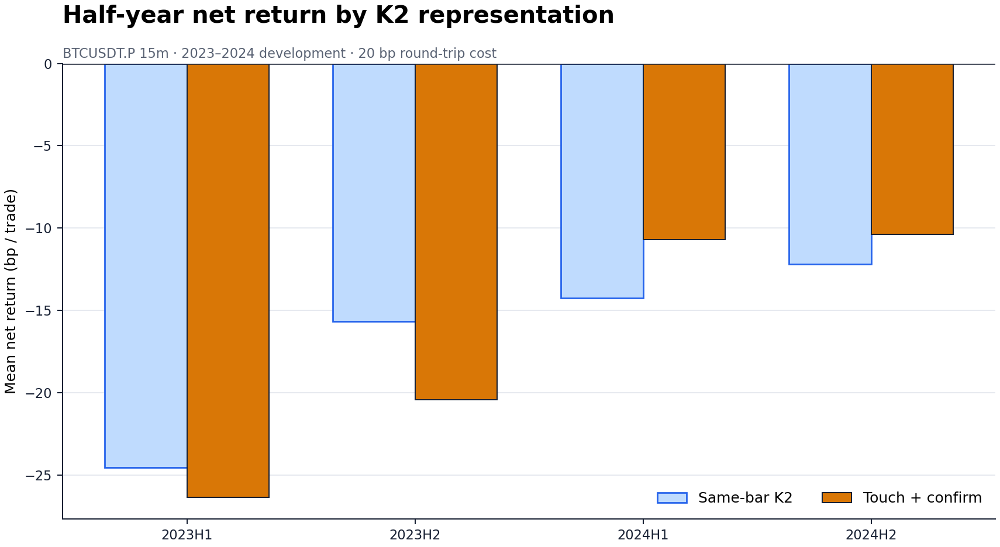
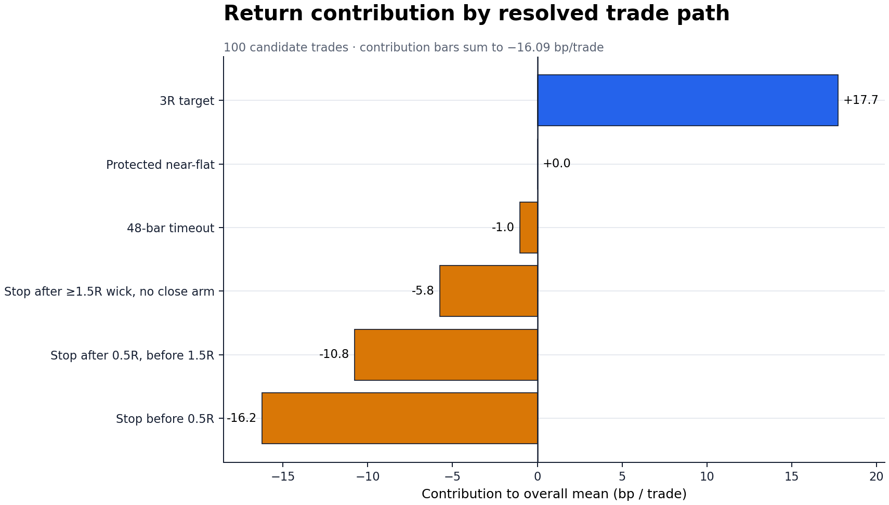
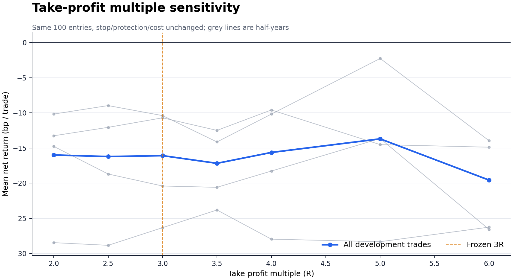

# BTCUSDT.P 15m K1→K2 两阶段确认 + Freqtrade 全量验证

日期：2026-09-04

实验：`exp-btcusdtp-k1k2-15m-two-stage-k2-preholdout-20260904-v1`

性质：P1、单变量、pre-holdout、原生因果状态机 + Freqtrade 2026.8 独立实现

最终状态：**REJECTED；开发门失败，audit / holdout 保持关闭，TradingView 指标不替换**

## 技术摘要

本轮把截图里“先用影线踩均线、随后一到两根才出现明确拒绝”的视觉关系正式写成一个因果状态机：
K2 不再必须是一根同时完成触线和强拒绝的 K 线，而可以是最长三根的“触线→确认”区间。除 K2
表示方式外，K1、SMA40(HL2)、颜色连续性、2–8 根距离、下一根开盘、结构止损、3R、1.5R
保护、12 小时、20bp 成本和 6 小时冷却全部冻结。

结论不是“信号仍太少”，而是**新增信号没有质量**：同根基线 89 笔，候选 100 笔；候选平均毛收益
只有 +3.91bp，扣 20bp 后为 **-16.09bp/笔**，PF 0.529，四个半年全部为负。两阶段 K2 相对
基线只改善平均净值 +0.22bp，却让稳健分恶化 1.62bp；严格匹配随机对照超额 +5.48bp，但
单侧配对检验 `p=0.2313`，远未达到 0.01。

Freqtrade 不再只是“参考工具”。本轮在锁定的 2026.8 Docker 镜像中实现了完整信号、风险门、
结构止损、3R、收盘保护与 12 小时退出：**100/100 入场时间与方向一致，入场价和初始止损价
最大误差均为 0，确认延迟不一致数为 0；lookahead-analysis 报告 0 个偏置信号。** Freqtrade
均值 -15.77bp、PF 0.538，与原生结论一致。



## 当前交易系统的完整规则

### 1. 时间、数据与指标

| 项目 | 冻结定义 |
|---|---|
| 品种 | OKX `BTC-USDT-SWAP`；TradingView `OKX:BTCUSDT.P` |
| 周期 | 15 分钟，UTC 对齐，只使用已经完成的 K 线 |
| 均线 | `SMA40(HL2)`，其中 `HL2=(high+low)/2` |
| ATR | Pine/Wilder RMA 口径的 ATR14 |
| MA-side 颜色 | `HL2 >= SMA40` 为多头/青色状态，否则为空头/橙色状态 |
| 额外硬门 | **无**成交量门、无 MA Shift oscillator 门、无 Market Break 门 |

K 线颜色不是装饰：K1 必须与方向颜色一致，K1 与 K2 之间每根 K 线的收盘侧和 MA-side 颜色也
必须连续一致。后面的成交量、振荡器和 Market Break 只做事后分层，未偷写进信号。

### 2. K1：真正的启动/贯穿 K 线

多头与空头完全镜像。多头 K1 同时满足：

1. `close > open`，实体方向向上；空头为 `close < open`。
2. MA-side 颜色与方向一致。
3. `abs(close-open)/(high-low) >= 0.65`，即实体至少占全长 65%。
4. `(high-low)/ATR14 >= 0.80`。
5. 多头收盘在本 K 线从低到高至少 70% 位置；空头收盘在从高到低至少 70% 位置。
6. 对多头计算 `min((SMA-open)/ATR, (close-SMA)/ATR)`；空头镜像。该贯穿深度须
   `>= -0.05`。因此最多容许一端距离均线 0.05 ATR 的数值误差，不是宽松地把远离均线的趋势
   K 线当 K1。

### 3. K1 到 K2：距离与路径

- K1 到“触线根”的距离为 **2–8 根 15m K 线**，即 30–120 分钟。
- 中间每一根完成 K 线都必须收在方向侧，且 MA-side 颜色仍与方向一致。
- 同一个确认时点存在多个 K1 时，依次偏好：更短确认延迟、更高 K1 质量、更小 K1→触线距离、
  更晚的触线根。
- 同方向同一根 K1 不重复使用；所有方向共享 24 根（6 小时）入场冷却。

### 4. K2：先触线，再确认

触线根必须满足：

- 拒绝影线占 K 线全长至少 25%；
- 实体占比最多 50%；
- 影线真实到达 SMA40，触入深度为 0–1.5 ATR；
- 完整实体与收盘都留在方向侧，均线不能贯穿实体。

确认根选触线根本身、下一根或下两根中的**最早合格者**：影线占比仍至少 25%，实体占比最多
50%，完整实体与收盘仍在方向侧，并且拒绝收盘位置至少 65%。延迟 1–2 根时，触线到确认之间
的收盘和 MA-side 颜色也不得失效。延迟 0 与原同根 K2 完全相同；291 个候选、142 个经济门后
事件及全部止损价均通过逐笔退化校验。

### 5. 成交与退出

| 环节 | 冻结规则 |
|---|---|
| 入场 | 确认根完成后的下一根开盘；不在确认根收盘作弊成交 |
| 初始止损 | 多头取触线→确认区间最低点，空头取该区间最高点 |
| 风险距离 | `0.15 <= 价格风险/确认根 ATR14 <= 2.50` |
| 经济门 | `0.002 / 入场价格风险比例 <= 1.25` |
| 仓位/并发 | 等风险统计；Freqtrade 1× 杠杆、最多 1 个同时仓位 |
| 固定目标 | 3R |
| 盈利保护 | 任一完成收盘达到 1.5R 后，从下一根起把止损移到覆盖 20bp 成本的位置 |
| 最长持仓 | 48 根，即 12 小时；到期按末根收盘退出 |
| 同根冲突 | 原生状态机保守按止损优先 |
| 成本 | 往返 0.2%；不含 funding，不额外假设超过 20bp 的滑点 |

## 注册实验结果：两阶段 K2 没有修复系统

| 指标 | 同根 K2 基线 | 两阶段 K2 | 候选变化 |
|---|---:|---:|---:|
| 开发交易数 | 89 | 100 | +11 |
| 平均毛收益 | +3.70bp | +3.91bp | +0.22bp |
| 平均净收益 | -16.30bp | **-16.09bp** | +0.22bp |
| 中位净收益 | -40.53bp | -40.68bp | -0.16bp |
| PF | 0.518 | 0.529 | +0.011 |
| 报表胜率（含经济平盘） | 37.08% | 37.00% | -0.08pp |
| 真正方向盈利率 | — | **25.00%** | — |
| TP / SL / 保护 / 超时 | 21 / 55 / 11 / 2 | 24 / 61 / 12 / 3 | — |
| 稳健分 | -17.31bp | **-18.93bp** | **-1.62bp** |
| 最差半年 | -24.54bp | **-26.33bp** | -1.80bp |
| 匹配随机超额 | +4.99bp | +5.48bp | +0.49bp |
| 配对单侧 p | 0.2648 | **0.2313** | 未过 0.01 |

“37% 胜率”容易误导：候选中只有 25 笔净收益真正大于 0；另 12 笔是保护止损恰好覆盖 20bp
成本后的经济平盘。把平盘算进表面胜率不会改变负期望。

| 开发折 | n | 候选净收益/笔 |
|---|---:|---:|
| 2023H1 | 22 | -26.33bp |
| 2023H2 | 21 | -20.40bp |
| 2024H1 | 27 | -10.71bp |
| 2024H2 | 30 | -10.39bp |

样本总数和每折样本数合格，但均值、稳健分、最差折、四折全正、相对基线改善及显著性六道门
失败。因此 2025–2026-02 的预留 audit 没有打开，2026-05-04 之后的项目 holdout 读取 0 行。

### 两阶段新增了什么

候选中延迟 0 / 1 / 2 根分别为 88 / 6 / 6 笔。与基线逐笔合并后为 88 笔相同入场、12 笔
候选独有、1 笔基线独有；12 笔延迟确认交易平均 **-16.65bp**。所以这项修改只是覆盖了截图所示
的形态类型，没有形成统计优势。

## 失败交易的结构：亏损主要发生在入场之后很早



| 路径类型 | n | 占比 | 本组净收益 | 对全体均值贡献 | 入场后 MFE |
|---|---:|---:|---:|---:|---:|
| 未到 0.5R 就止损 | 30 | 30% | -54.13bp | **-16.24bp** | 0.20R |
| 到 0.5R、未到 1.5R 后止损 | 20 | 20% | -53.86bp | -10.77bp | 0.85R |
| 影线曾到 ≥1.5R、但收盘未触发保护后止损 | 11 | 11% | -52.34bp | -5.76bp | 2.12R |
| 48 根超时 | 3 | 3% | -34.84bp | -1.05bp | 1.58R |
| 保护后经济平盘 | 12 | 12% | 0.00bp | 0.00bp | 2.32R |
| 3R 目标 | 24 | 24% | +73.87bp | +17.73bp | 3.98R |

仅“入场后未到 0.5R 就止损”的 30 笔就贡献 -16.24bp，几乎等于系统全部 -16.09bp 均值。
这说明首要问题是有一大批 K1→K2 在入场当下没有延续，而不是止盈框画得不够高。另有 11 笔
盘中影线达到 1.5R 后仍亏损，说明只用收盘确认保护会丢掉部分盘中利润；但把保护提前到 1.25R
的单变量重放仍为 -14.79bp，不能单独救活系统。

## 距离、颜色、K 线形态和指标维度

以下是同一开发账本上的事后分层，只用于提出下一轮假设，不是可上线参数。

### K1→K2 距离

| 精确距离 | n | 净收益/笔 | 匹配随机超额 |
|---:|---:|---:|---:|
| 2 根 | 35 | -6.59bp | +17.37bp |
| 3 根 | 22 | -22.39bp | -0.38bp |
| 4 根 | 14 | -17.86bp | -0.63bp |
| 5 根 | 10 | -43.21bp | -19.99bp |
| 6 根 | 7 | -11.73bp | +12.32bp |
| 7 根 | 7 | -9.24bp | +12.78bp |
| 8 根 | 5 | -11.28bp | -3.63bp |

距离关系明显非单调；2 根相对最好，但把最大距离直接收紧到 2 根后只有 42 笔、均值 -7.88bp、
稳健分 -17.34bp、最差折 -25.15bp。不能把“2 根最好”简化成已经验证的 `gap_max=2`。

### K1 强度、触线深度与止损距离

- K1 实体 0.65–0.70 的 12 笔为 **-50.32bp**，四个半年均负；把 K1 下限提高到 0.70 后
  仍有 89 笔，但均值只改善到 -11.71bp、稳健分 -19.49bp、`p=0.1598`。
- 触线深度 0.10–0.25 / 0.25–0.50 ATR 分别为 -30.69 / -28.98bp；0.50–1.00 ATR 的
  18 笔为 +11.78bp，1.00–1.50 ATR 的 3 笔为 +12.33bp。重放 `touch_depth >= 0.5 ATR`
  得到 23 笔、+16.85bp、稳健分 +14.02bp，但每折最少仅 4 笔、最差折 -6.03bp、
  `p=0.0717`，是**最强新假设，不是最优参数**。
- 止损距离 0.50–0.75 ATR 的 26 笔为 -34.06bp；1.00–1.50 ATR 的 29 笔为 +0.43bp、
  匹配超额 +36.55bp。但直接改为 `risk >= 1 ATR` 会把 >1.5 ATR 尾部一起收入，40 笔均值仍
  -3.55bp、稳健分 -7.35bp。下一轮应验证“1.0–1.5 ATR 带状门”，而不是单边放宽止损。

### 多空、成交量、MA 斜率与振荡器

- 多头 56 笔为 -9.36bp、匹配超额 +11.11bp；空头 44 笔为 -24.64bp、匹配超额 -1.68bp。
  多头相对更好，但四个半年仍全部为负，不能直接删除空头后宣称系统盈利。
- 确认根成交量/20 根均量低于 0.5 的 13 笔为 -38.91bp，且四折都负；其余成交量桶不单调，
  所以“排除极低量”值得独立预注册，但不能现在补进规则。
- 方向化 SMA6 斜率、MA Shift oscillator 与 Market Break state 都没有跨折单调关系。
  例如 oscillator 0–0.2 桶为 -6.84bp，而 0.2–0.5 桶为 -33.40bp；继续把“颜色更强”机械
  解释成“收益更高”没有数据支持。
- K1、路径、确认根的方向颜色已经是硬门。失败不是因为代码完全没看颜色，而是颜色连续只说明
  价格位于均线一侧，不能区分延续和局部衰竭。

### 26 组事后单坐标重放

| 变化 | n | 净收益/笔 | 稳健分 | 最差折 | p | 原门通过 |
|---|---:|---:|---:|---:|---:|---|
| K1 实体下限 0.70 | 89 | -11.71bp | -19.49bp | -22.89bp | 0.1598 | 否 |
| 触线深度下限 0.50 ATR | 23 | +16.85bp | +14.02bp | -6.03bp | 0.0717 | 否 |
| 风险下限 1.00 ATR | 40 | -3.55bp | -7.35bp | -16.84bp | 0.0406 | 否 |
| 最大距离 2 根 | 42 | -7.88bp | -17.34bp | -25.15bp | 0.1444 | 否 |
| 最大确认延迟 1 根 | 94 | -15.38bp | -19.25bp | -26.33bp | 0.2316 | 否 |
| 保护触发 1.25R | 100 | -14.79bp | -16.60bp | -23.81bp | 0.1834 | 否 |

26 组中没有一组通过原开发门。它们是在结果已知后做的定位，任何一项若继续，都必须换到新的
预注册实验，而不能把同一账本里最好看的 +16.85bp 当成可复现收益。

## “盈利交易可以止盈更高”——观察成立，但全局改 TP 仍失败

24 笔当前 3R 目标交易中，之后在原 12 小时观察窗内有 19 笔到 4R、16 笔到 5R、10 笔到
6R。赢家右尾确实存在；用户的图表观察是对的。



| 固定目标 | 净收益/笔 | 稳健分 | 最差半年 | 匹配超额 | p |
|---:|---:|---:|---:|---:|---:|
| 2R | -15.99bp | -17.52bp | -28.46bp | +6.57bp | 0.1641 |
| 2.5R | -16.22bp | -19.19bp | -28.85bp | +5.25bp | 0.2356 |
| 3R | -16.09bp | -18.93bp | -26.33bp | +5.48bp | 0.2313 |
| 3.5R | -17.18bp | -19.68bp | -23.82bp | +4.55bp | 0.2799 |
| 4R | -15.63bp | -17.96bp | -27.97bp | +6.65bp | 0.2134 |
| 5R | **-13.70bp** | -18.70bp | -28.33bp | +8.80bp | 0.1731 |
| 6R | -19.56bp | -23.58bp | -26.58bp | +3.02bp | 0.3637 |

5R 是全表平均值最好的一档，却仍为负，四个半年也都为负。原因是“3R 后继续走远”的统计已经
条件化在赢家上；对全部交易等待 5R 时，有些原本 3R 获利会回撤。更高 TP 能多拿部分右尾，
但无法挽回 61 笔止损，尤其无法挽回 30 笔未到 0.5R 的早期失败。

所以合理顺序是先修复入场池，再独立预注册退出。仓库里另一个冻结入场池上的 3R 部分止盈 +
8R runner 已经证明：分批只能在两个端点间做加权，无法凭空创造超过较优端点的均值。本实验
不再从这 100 笔上继续搜索 runner 比例。

## Freqtrade：完整主研究实现，而不是受限的旁观者

### 实现和逐笔验收

| 验收项 | 结果 |
|---|---:|
| Freqtrade 版本 | 2026.8 |
| Docker 镜像 | `freqtradeorg/freqtrade@sha256:7031…42db` |
| 原生 / Freqtrade 交易 | 100 / 100 |
| 时间+方向完全一致 | 100 / 100 |
| 入场价最大绝对误差 | 0 |
| 初始止损最大绝对误差 | 0 |
| 确认延迟不一致 | 0 |
| 原生 / Freqtrade 平均净值 | -16.09 / -15.77bp |
| 原生 / Freqtrade PF | 0.529 / 0.538 |
| lookahead `has_bias` | `false` |
| 偏置入场 / 出场信号 | 0 / 0 |

两引擎均值相差 +0.315bp，来自 Freqtrade 的框架内止损/ROI/回调成交排序与费用精度；它不改变
方向性结论。Freqtrade 出场为 25 次 ROI、54 次初始止损、18 次动态保护、3 次 12 小时超时。

移植期间出现过一次“原生 100 笔、Freqtrade 0 笔”：原因是框架在调用
`populate_entry_trend()` 前重置自己拥有的 `enter_tag`。修复不是放宽信号，而是先把因果事件写入
私有 `fable_entry_tag`，最后在正式入场回调交接；修复后才达到 100/100 parity。该教训已写入
`docs/learnings/freqtrade-entry-metadata-needs-late-handoff.md`。

### 为什么前视检查可信但不等于有收益

lookahead-analysis 用目标 100 笔、最低 80 笔重新切片并检查信号列，没有发现基线与切片重算差异。
这证明当前实现没有因 dataframe 全量可见而偷看未来；它只回答**因果正确性**，不回答策略是否
赚钱。100 笔因果正确的交易仍然可以稳定亏损。

## 匹配随机对照与排序能力

随机对照按“同月 × UTC 六小时块 × 当月 ATR14 五分位”严格匹配，每笔复制方向、ATR 风险
距离、3R/保护/时限和 20bp 成本，并排除任何信号前后一个完整持仓窗；找不到精确匹配时不放宽。
候选 100 笔全部匹配，形态相对随机时点为 +5.48bp，但 `p=0.2313`。它不能排除偶然，也不能
覆盖候选自身 -16.09bp 的绝对亏损。

K1 四项几何质量分的 AUC 为 0.4985；top-decile 10 笔毛收益 +10.73bp、净收益 -9.27bp、
胜率 50%，排序置换 `p=0.3404`。单特征基线 top-decile 更差，为 -29.68bp。也就是说，当前
质量分没有把 100 笔中的可交易子集可靠排到前面；不能用一个好看的 AUC 或 score 替代净收益门。

## 决策与下一轮优先级

1. **拒绝两阶段 K2 作为新 TradingView 默认。** 它修复了形态表达，却没修复收益；不覆盖现有
   Pine，不写 ACTIVE / frozen，不部署。
2. **最高优先级的新信号假设：触线深度带。** 预注册 `0.5–1.5 ATR` 与当前 `0–1.5 ATR`
   单变量比较，并扩大开发范围/品种以解决每折只有 4 笔的问题。不能在原账本上宣布 0.5 最优。
3. **第二优先级：止损距离带 1.0–1.5 ATR。** 这是入场/结构质量门，不是简单加宽止损；必须
   把 >1.5 ATR 的差尾部排除，且仍保持原 K2 极值作为实际止损。
4. **第三优先级：排除确认根极低量。** `<0.5×20 根均量` 四折都差，但只 13 笔，应单独验证。
5. **暂不继续调 TP。** 5R 仍全期负；等入场池产生正毛 edge 后，再比较 3R、5R 或分批 runner。
6. **不删除空头、不硬设 gap=2、不堆 oscillator/Market Break。** 当前只是事后差异，跨折不稳。

没有参数可以被诚实称为“现在最优”。现阶段最有价值的输出是一个排好序、写清证伪条件的下一轮
假设队列，而不是从 26 组里挑收益最高的一格覆盖 TradingView。

## 数据与审计边界

| 项目 | 值 |
|---|---|
| 原始文件 | `data/kline_preholdout_okx_5m/okx_BTC_USDT_SWAP_5m_341567.csv` |
| SHA256 | `767f67c2b0ae5a8c83369a7cb950334e61de09edbb82a0158122c41794eed5ac` |
| 原始 5m 行数 | 341,567 |
| 15m 行数 | 113,855；每 3 根连续 5m UTC 聚合，丢弃 1 个不完整组 |
| 物理时间 | 2022-11-30T16:00Z 至 2026-02-28T15:45Z |
| 评分窗口 | 2023-01-01T00:00Z 至 2025-01-01T00:00Z |
| 开发折 | 2023H1、2023H2、2024H1、2024H2 |
| 预留 audit | 2025-01-01 至 2026-02-28；因开发失败读取结果 0 行 |
| 项目 holdout | ≥2026-05-04；本配置读取 **0 行**，消耗次数 0 |
| 截图 2026-08-14 | 只用于定义候选，完全不进入评分或选参 |

## 风险与诚实声明

- 全部单坐标分层、目标 R 敏感性和失败归因都是开发集上的事后解释；可提出假设，不能当最终验证。
- 仅覆盖 BTC 永续与一个 15m 规则，不外推 5m、其他币种或其他市场状态。
- 固定 20bp 已包含双边费用/滑点合并假设，但不含 funding；即使完全忽略 20bp，候选毛收益也
  只有 +3.91bp，安全余量不足。
- Freqtrade 与原生引擎的逐笔入场完全一致，但框架内退出顺序略有差异；两者都为明显负期望。
- 未下单、未修改真实 API key、未改变 ACTIVE、forward、Pine 或部署配置。

## 复现命令

```bash
cd /Users/zhangzc/fable-trading

# 原生预注册开发（失败时会 fail-closed，不打开 audit）
PYTHONPATH=. python3 -m scripts.research_btcusdtp_k1k2_15m_two_stage_k2 \
  --phase development

# 将完全相同的安全 15m 数据导出给 Freqtrade
PYTHONPATH=. python3 -m scripts.export_btcusdtp_k1k2_15m_freqtrade

# Freqtrade 2026.8 完整回测
docker run --rm --platform linux/arm64 \
  -v "$PWD/experiments/active/exp-btcusdtp-k1k2-15m-two-stage-k2-preholdout-20260904-v1:/workspace" \
  -v "$PWD/data/freqtrade_btcusdtp_15m_two_stage_k2_20260904_v1:/freqtrade/user_data/data:ro" \
  freqtradeorg/freqtrade@sha256:7031bca43ed7668ebf421725dd5016acade6ef88b0771db3e08c96e6d19a42db \
  backtesting --config /workspace/freqtrade/config.json \
  --strategy-path /workspace/freqtrade/user_data/strategies \
  --strategy FableTwoStageK2 --timerange 20230101-20250101 \
  --datadir /freqtrade/user_data/data --fee 0.001 \
  --export trades --export-filename /workspace/results/freqtrade/backtest-result

# Freqtrade 前视检查
docker run --rm --platform linux/arm64 \
  -v "$PWD/experiments/active/exp-btcusdtp-k1k2-15m-two-stage-k2-preholdout-20260904-v1:/workspace" \
  -v "$PWD/data/freqtrade_btcusdtp_15m_two_stage_k2_20260904_v1:/freqtrade/user_data/data:ro" \
  freqtradeorg/freqtrade@sha256:7031bca43ed7668ebf421725dd5016acade6ef88b0771db3e08c96e6d19a42db \
  lookahead-analysis --config /workspace/freqtrade/config.json \
  --strategy-path /workspace/freqtrade/user_data/strategies \
  --strategy FableTwoStageK2 --timerange 20230101-20250101 \
  --datadir /freqtrade/user_data/data --fee 0.001 \
  --minimum-trade-amount 80 --targeted-trade-amount 100 \
  --lookahead-analysis-exportfilename /workspace/results/freqtrade/lookahead_analysis.csv

# 逐笔 parity、失败归因、指标分层、TP 与单坐标敏感性
PYTHONPATH=. python3 -m scripts.analyze_btcusdtp_k1k2_15m_two_stage_k2

# 回归测试与 HTML 报告
PYTHONPATH=. python3 -m pytest -q \
  tests/test_research_btcusdtp_k1k2_15m_two_stage_k2.py \
  tests/test_analyze_btcusdtp_k1k2_15m_two_stage_k2.py
python3 scripts/md_to_html.py \
  analysis/p1_btcusdtp_k1k2_15m_two_stage_k2_freqtrade_preholdout_20260904.md \
  --out-dir analysis/html
```

原始逐笔账本、匹配对照、四折结果、26 组敏感性、Freqtrade 压缩回测包和 lookahead CSV 均位于
`experiments/active/exp-btcusdtp-k1k2-15m-two-stage-k2-preholdout-20260904-v1/results/`。
